## 前言：AI Agent时代的电商革命

随着大语言模型和AI Agent技术的快速发展，电商购物正在经历一场深刻的变革。传统的"用户浏览-搜索-比价-下单"模式正在被"AI Agent代理购物"模式所取代。用户只需向AI助手描述需求，Agent就能自动完成商品搜索、比价、下单等全流程操作。

在这个背景下，如何让AI Agent与电商平台、商家、支付系统之间实现标准化的互操作，成为了行业亟需解决的问题。本文将深入对比分析两个最重要的Agent电商购物标准协议：

- **UCP (Universal Commerce Protocol)** - 由Google等科技公司主导的通用电商协议
- **ACP (Agentic Commerce Protocol)** - 由OpenAI和Stripe联合推出的AI代理电商协议

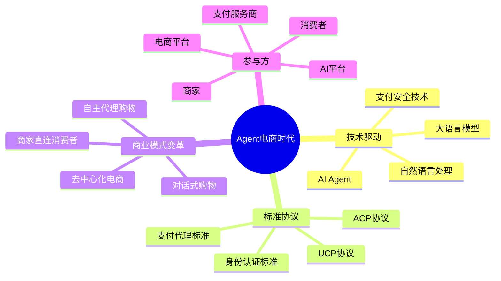
```mermaid
mindmap
  root((Agent电商时代))
    技术驱动
      大语言模型
      AI Agent
      自然语言处理
      支付安全技术
    标准协议
      UCP协议
      ACP协议
      支付代理标准
      身份认证标准
    商业模式变革
      对话式购物
      自主代理购物
      去中心化电商
      商家直连消费者
    参与方
      AI平台
      电商平台
      商家
      支付服务商
      消费者
```

## UCP协议深度解析

### UCP核心理念

**Universal Commerce Protocol (UCP)** 是一个开源的通用电商协议标准，旨在实现不同电商实体之间的无缝互操作。UCP由Google、Shopify等科技和电商公司共同推动，采用Apache 2.0开源协议。

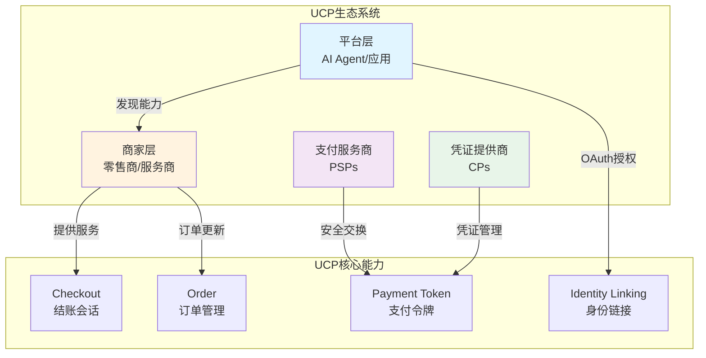
```mermaid
graph TB
    subgraph "UCP生态系统"
        Platform[平台层<br/>AI Agent/应用]
        Business[商家层<br/>零售商/服务商]
        PSP[支付服务商<br/>PSPs]
        CP[凭证提供商<br/>CPs]
    end
    
    subgraph "UCP核心能力"
        Checkout[Checkout<br/>结账会话]
        Identity[Identity Linking<br/>身份链接]
        Order[Order<br/>订单管理]
        Payment[Payment Token<br/>支付令牌]
    end
    
    Platform -->|发现能力| Business
    Platform -->|OAuth授权| Identity
    Business -->|提供服务| Checkout
    Business -->|订单更新| Order
    PSP -->|安全交换| Payment
    CP -->|凭证管理| Payment
    
    style Platform fill:#e1f5ff
    style Business fill:#fff3e0
    style PSP fill:#f3e5f5
    style CP fill:#e8f5e9
```

### UCP核心特性

#### 1. 模块化能力架构

UCP将电商功能拆解为独立的"能力（Capabilities）"和"扩展（Extensions）"：

| 核心能力 | 功能说明 | 应用场景 |
|---------|---------|---------|
| **Checkout** | 购物车管理、税费计算、结账会话 | 完整的购物流程管理 |
| **Identity Linking** | OAuth 2.0身份认证和授权 | 用户身份验证、授权代理操作 |
| **Order** | 订单生命周期事件推送 | 物流跟踪、退换货管理 |
| **Payment Token Exchange** | 支付凭证安全交换 | PSP和CP之间的令牌交换 |

**扩展能力**：
- AP2 Mandates（自主支付授权）
- Buyer Consent（买家同意管理）
- Discounts（折扣优惠）
- Fulfillment（物流履约）

#### 2. 多传输层支持

UCP支持多种传输协议，适应不同场景需求：

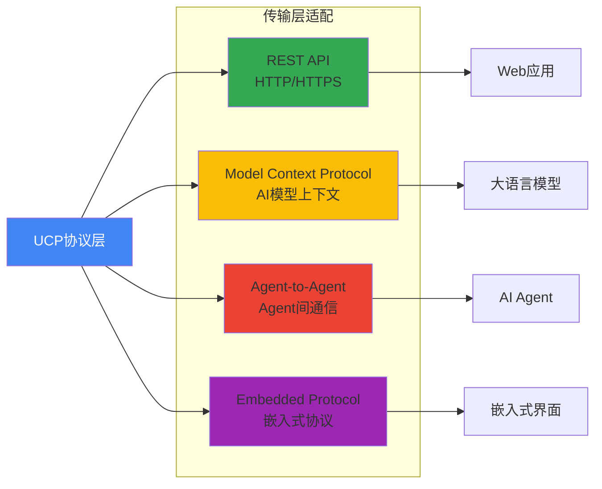
```mermaid
graph LR
    UCP[UCP协议层]
    
    subgraph "传输层适配"
        REST[REST API<br/>HTTP/HTTPS]
        MCP[Model Context Protocol<br/>AI模型上下文]
        A2A[Agent-to-Agent<br/>Agent间通信]
        EP[Embedded Protocol<br/>嵌入式协议]
    end
    
    UCP --> REST
    UCP --> MCP
    UCP --> A2A
    UCP --> EP
    
    REST --> WebApp[Web应用]
    MCP --> LLM[大语言模型]
    A2A --> Agent[AI Agent]
    EP --> Embedded[嵌入式界面]
    
    style UCP fill:#4285f4,color:#fff
    style REST fill:#34a853
    style MCP fill:#fbbc04
    style A2A fill:#ea4335
    style EP fill:#9c27b0
```

#### 3. 命名空间治理

UCP采用反向域名命名规范，确保能力标识符的唯一性和治理权：

```
{reverse-domain}.{service}.{capability}
```

**示例**：
- `dev.ucp.shopping.checkout` - UCP官方结账能力
- `dev.ucp.shopping.fulfillment` - UCP官方物流能力
- `com.shopify.payments.installments` - Shopify自定义分期付款能力

#### 4. 动态能力发现和协商

UCP采用"服务器选择架构"，业务方根据双方能力交集选择协议版本和功能：

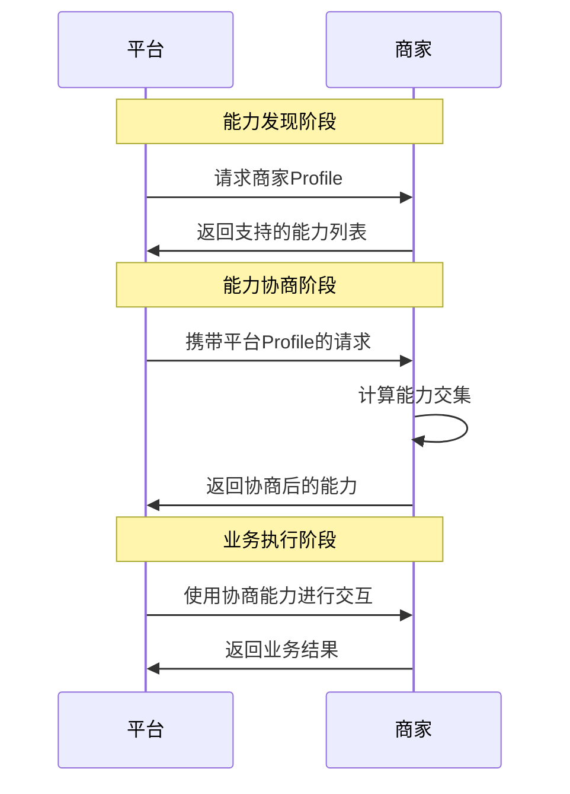
```mermaid
sequenceDiagram
    participant P as 平台
    participant B as 商家
    
    Note over P,B: 能力发现阶段
    P->>B: 请求商家Profile
    B->>P: 返回支持的能力列表
    
    Note over P,B: 能力协商阶段
    P->>B: 携带平台Profile的请求
    B->>B: 计算能力交集
    B->>P: 返回协商后的能力
    
    Note over P,B: 业务执行阶段
    P->>B: 使用协商能力进行交互
    B->>P: 返回业务结果
```

### UCP版本策略

UCP使用基于日期的版本格式：`YYYY-MM-DD`（例如：`2026-01-11`）

**版本兼容性原则**：
- 向后兼容的变更：添加非必需字段、新端点、新错误码
- 破坏性变更：删除字段、修改类型、改变语义，需要新版本

**组件独立版本控制**：
- UCP协议独立版本
- 每个能力独立版本
- 传输层可定义自己的版本机制

## ACP协议深度解析

### ACP核心理念

**Agentic Commerce Protocol (ACP)** 是由OpenAI和Stripe联合设计的开源协议，专为AI Agent购物场景优化。ACP的首个产品应用是ChatGPT中的"即时结账（Instant Checkout）"功能，让用户可以通过对话直接购买商品。


```mermaid
graph TB
    subgraph "ACP生态系统"
        User[消费者<br/>ChatGPT用户]
        Agent[AI Agent<br/>ChatGPT]
        Merchant[商家<br/>Etsy/Shopify]
        PSP[支付服务商<br/>Stripe等]
    end
    
    subgraph "ACP核心规范"
        Checkout[Agentic Checkout<br/>结账API]
        Payment[Delegated Payment<br/>委托支付]
        Feed[Product Feed<br/>商品数据源]
    end
    
    User -->|对话需求| Agent
    Agent -->|搜索商品| Feed
    Agent -->|发起结账| Checkout
    Merchant -->|返回状态| Checkout
    Agent -->|委托支付| Payment
    PSP -->|处理支付| Payment
    Merchant -->|订单确认| User
    
    style User fill:#10a37f
    style Agent fill:#74aa9c
    style Merchant fill:#635bff
    style PSP fill:#0a2540
```

### ACP核心特性

#### 1. 三大核心规范

| 规范名称 | 功能说明 | 技术实现 |
|---------|---------|---------|
| **Agentic Checkout Spec** | 定义结账API端点和状态机 | RESTful API + Webhooks |
| **Delegated Payment Spec** | 支付凭证安全传输和扣款 | 令牌化 + PCI DSS合规 |
| **Product Feed Spec** | 商品数据标准化格式 | JSON/XML Feed |

#### 2. Agentic Checkout规范

ACP的结账流程专为对话式购物优化，支持逐步构建订单：

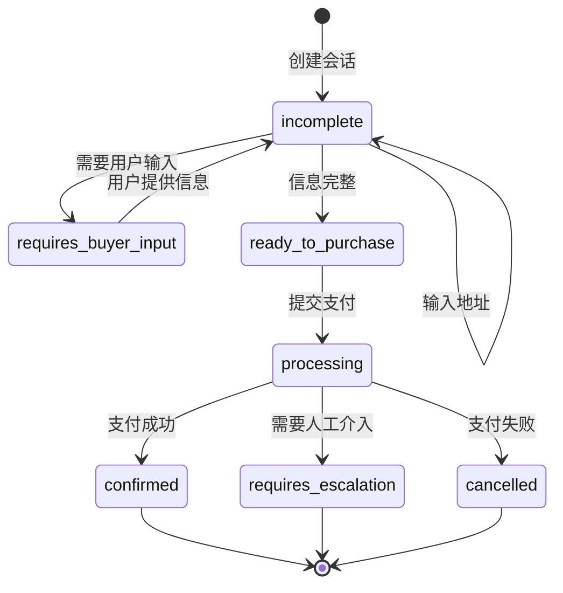
```mermaid
stateDiagram-v2
    [*] --> incomplete: 创建会话
    
    incomplete --> incomplete: 更新购物车
    incomplete --> incomplete: 添加商品
    incomplete --> incomplete: 输入地址
    
    incomplete --> requires_buyer_input: 需要用户输入
    requires_buyer_input --> incomplete: 用户提供信息
    
    incomplete --> ready_to_purchase: 信息完整
    ready_to_purchase --> processing: 提交支付
    
    processing --> confirmed: 支付成功
    processing --> requires_escalation: 需要人工介入
    processing --> cancelled: 支付失败
    
    confirmed --> [*]
    requires_escalation --> [*]
    cancelled --> [*]
```

**关键特性**：
- **增量构建订单**：支持分步添加商品、地址、支付方式
- **丰富的状态反馈**：每个响应返回完整的结账状态
- **错误处理机制**：通过messages数组传递错误和提示信息
- **Webhook通知**：订单状态变化异步通知

#### 3. Delegated Payment规范

ACP的支付架构实现了"三角信任模型"：

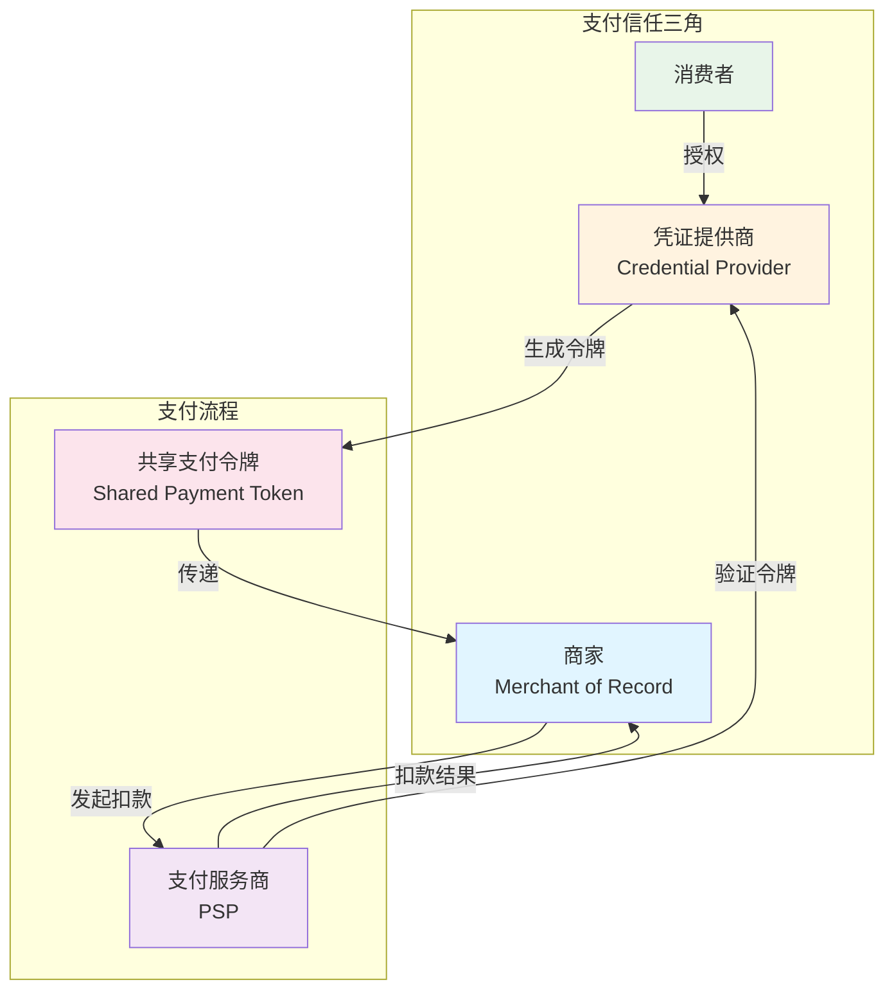
```mermaid
graph TB
    subgraph "支付信任三角"
        User[消费者]
        CP[凭证提供商<br/>Credential Provider]
        Merchant[商家<br/>Merchant of Record]
    end
    
    subgraph "支付流程"
        Token[共享支付令牌<br/>Shared Payment Token]
        PSP[支付服务商<br/>PSP]
    end
    
    User -->|授权| CP
    CP -->|生成令牌| Token
    Token -->|传递| Merchant
    Merchant -->|发起扣款| PSP
    PSP -->|验证令牌| CP
    PSP -->|扣款结果| Merchant
    
    style User fill:#e8f5e9
    style CP fill:#fff3e0
    style Merchant fill:#e1f5ff
    style Token fill:#fce4ec
    style PSP fill:#f3e5f5
```

**Stripe Shared Payment Token实现**：
- **令牌化**：用户支付信息转换为一次性令牌
- **作用域限制**：令牌仅对特定商家有效
- **PCI DSS合规**：商家和平台无需接触原始支付信息
- **欺诈信号**：传递风控信号帮助商家决策

#### 4. Product Feed规范

为了让AI Agent能够准确推荐商品，ACP定义了标准化的商品数据格式：

**必需字段**：
- `id` - 商品唯一标识
- `title` - 商品标题
- `description` - 商品描述
- `price` - 价格信息
- `availability` - 库存状态
- `image_url` - 商品图片
- `product_url` - 商品页面链接

**可选字段**：
- `category` - 商品分类
- `brand` - 品牌信息
- `variants` - 规格变体
- `reviews` - 评价信息
- `shipping` - 物流信息

### ACP实现场景

#### 场景A：数字钱包支付

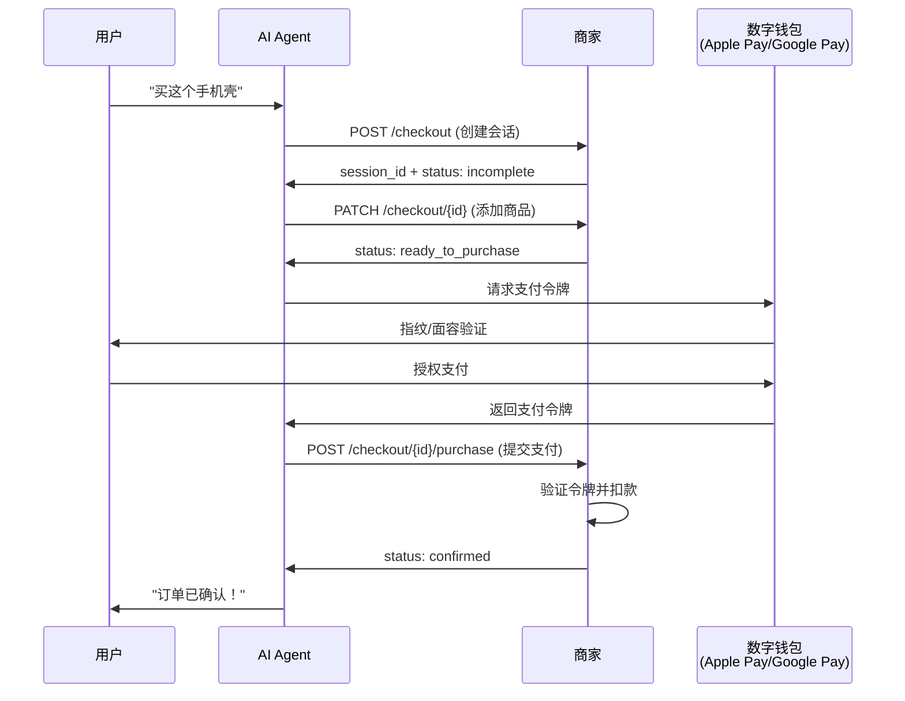
```mermaid
sequenceDiagram
    participant U as 用户
    participant A as AI Agent
    participant M as 商家
    participant W as 数字钱包<br/>(Apple Pay/Google Pay)
    
    U->>A: "买这个手机壳"
    A->>M: POST /checkout (创建会话)
    M->>A: session_id + status: incomplete
    
    A->>M: PATCH /checkout/{id} (添加商品)
    M->>A: status: ready_to_purchase
    
    A->>W: 请求支付令牌
    W->>U: 指纹/面容验证
    U->>W: 授权支付
    W->>A: 返回支付令牌
    
    A->>M: POST /checkout/{id}/purchase (提交支付)
    M->>M: 验证令牌并扣款
    M->>A: status: confirmed
    A->>U: "订单已确认！"
```

#### 场景B：直接令牌化 + 3DS验证

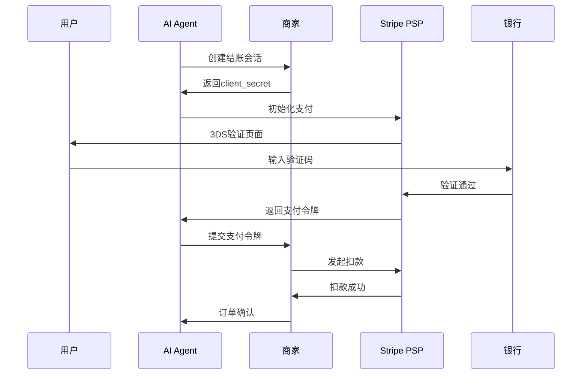
```mermaid
sequenceDiagram
    participant U as 用户
    participant A as AI Agent
    participant M as 商家
    participant S as Stripe PSP
    participant B as 银行
    
    A->>M: 创建结账会话
    M->>A: 返回client_secret
    
    A->>S: 初始化支付
    S->>U: 3DS验证页面
    U->>B: 输入验证码
    B->>S: 验证通过
    
    S->>A: 返回支付令牌
    A->>M: 提交支付令牌
    M->>S: 发起扣款
    S->>M: 扣款成功
    M->>A: 订单确认
```

#### 场景C：自主Agent (AP2)

对于完全自主的AI Agent，ACP支持AP2（Agent Payments Protocol）扩展：

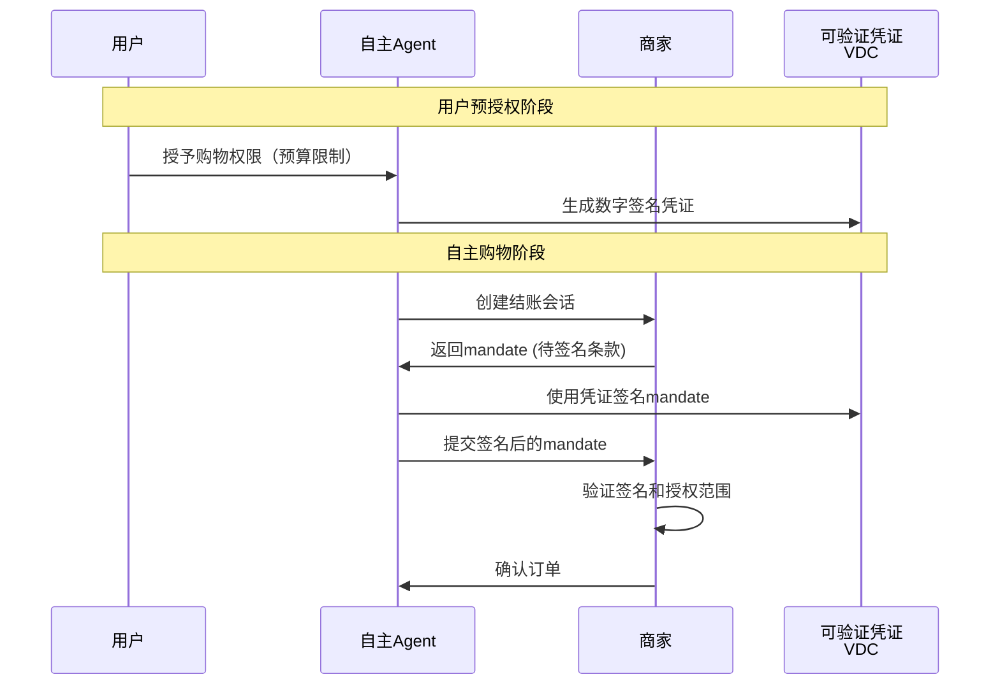
```mermaid
sequenceDiagram
    participant U as 用户
    participant A as 自主Agent
    participant M as 商家
    participant V as 可验证凭证<br/>VDC
    
    Note over U,V: 用户预授权阶段
    U->>A: 授予购物权限（预算限制）
    A->>V: 生成数字签名凭证
    
    Note over U,V: 自主购物阶段
    A->>M: 创建结账会话
    M->>A: 返回mandate (待签名条款)
    A->>V: 使用凭证签名mandate
    A->>M: 提交签名后的mandate
    M->>M: 验证签名和授权范围
    M->>A: 确认订单
```

## UCP vs ACP：全方位对比

### 设计理念对比

| 维度 | UCP | ACP |
|-----|-----|-----|
| **设计目标** | 通用电商互操作标准 | AI Agent购物场景优化 |
| **适用范围** | 所有电商场景（B2C/B2B/C2C） | 主要针对AI代理购物 |
| **架构哲学** | 模块化、可扩展、传输无关 | 简洁、易集成、对话式优先 |
| **主导方** | Google、Shopify等 | OpenAI、Stripe |
| **开源协议** | Apache 2.0 | Apache 2.0 |
| **发布时间** | 2026年1月 | 2024年底 |

### 核心能力对比

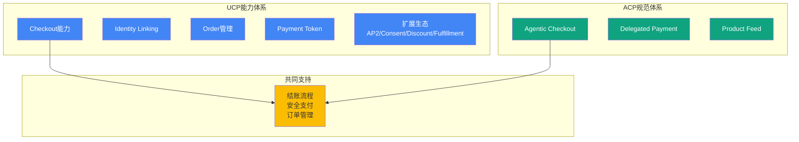
```mermaid
graph TB
    subgraph "UCP能力体系"
        UCP_C[Checkout能力]
        UCP_I[Identity Linking]
        UCP_O[Order管理]
        UCP_P[Payment Token]
        UCP_E[扩展生态<br/>AP2/Consent/Discount/Fulfillment]
    end
    
    subgraph "ACP规范体系"
        ACP_C[Agentic Checkout]
        ACP_P[Delegated Payment]
        ACP_F[Product Feed]
    end
    
    subgraph "共同支持"
        Common[结账流程<br/>安全支付<br/>订单管理]
    end
    
    UCP_C --> Common
    ACP_C --> Common
    
    style UCP_C fill:#4285f4,color:#fff
    style UCP_I fill:#4285f4,color:#fff
    style UCP_O fill:#4285f4,color:#fff
    style UCP_P fill:#4285f4,color:#fff
    style UCP_E fill:#4285f4,color:#fff
    
    style ACP_C fill:#10a37f,color:#fff
    style ACP_P fill:#10a37f,color:#fff
    style ACP_F fill:#10a37f,color:#fff
    
    style Common fill:#fbbc04
```

### 技术架构对比

#### 传输层支持

| 传输协议 | UCP | ACP |
|---------|-----|-----|
| REST API | ✅ 核心支持 | ✅ 唯一支持 |
| MCP (Model Context Protocol) | ✅ 原生支持 | ❌ 不支持 |
| A2A (Agent-to-Agent) | ✅ 原生支持 | ❌ 不支持 |
| Embedded Protocol | ✅ 支持 | ❌ 不支持 |

**解读**：
- **UCP**：传输层无关设计，可适配多种协议，更适合复杂的企业场景
- **ACP**：专注REST API，简化实现难度，快速上线

#### 支付安全模型

**UCP支付架构**：

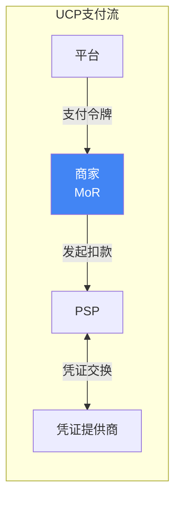
```mermaid
graph LR
    subgraph "UCP支付流"
        Platform[平台]
        Business[商家<br/>MoR]
        PSP[PSP]
        CP[凭证提供商]
    end
    
    Platform -->|支付令牌| Business
    Business -->|发起扣款| PSP
    PSP <-->|凭证交换| CP
    
    style Business fill:#4285f4,color:#fff
```

- 支持多种Payment Handler模式
- 商家作为Merchant of Record (MoR)
- 灵活的PSP集成方案
- 可选AP2 Mandates扩展

**ACP支付架构**：

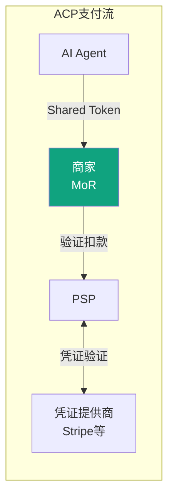
```mermaid
graph LR
    subgraph "ACP支付流"
        Agent[AI Agent]
        Merchant[商家<br/>MoR]
        CP[凭证提供商<br/>Stripe等]
        PSP[PSP]
    end
    
    Agent -->|Shared Token| Merchant
    Merchant -->|验证扣款| PSP
    PSP <-->|凭证验证| CP
    
    style Merchant fill:#10a37f,color:#fff
```

- 专注Shared Payment Token模式
- Stripe作为首选CP实现
- 商家保持MoR角色
- 简化的集成流程

### 能力发现机制对比

**UCP能力发现**：

```json
{
  "ucp": {
    "version": "2026-01-11",
    "services": {
      "shopping": {
        "version": "2026-01-11",
        "spec": "https://ucp.dev/services/shopping/spec.yaml",
        "rest": {
          "schema": "https://ucp.dev/services/shopping/openapi.json"
        }
      }
    },
    "capabilities": [
      {
        "id": "dev.ucp.shopping.checkout",
        "version": "2026-01-11",
        "spec": "https://ucp.dev/schemas/shopping/checkout.json",
        "schema": "https://ucp.dev/schemas/shopping/checkout.json"
      },
      {
        "id": "dev.ucp.shopping.ap2_mandate",
        "extends": "dev.ucp.shopping.checkout",
        "version": "2026-01-11",
        "spec": "https://ucp.dev/schemas/shopping/ap2_mandate.json"
      }
    ]
  }
}
```

**特点**：
- 分层结构：服务 → 能力 → 扩展
- 版本独立控制
- Schema URL绑定验证
- 支持能力协商

**ACP能力发现**：

```json
{
  "checkout_api_base_url": "https://merchant.example.com/api/v1",
  "product_feed_url": "https://merchant.example.com/feed.xml",
  "supported_payment_methods": ["card", "apple_pay", "google_pay"],
  "webhook_url": "https://merchant.example.com/webhooks/orders"
}
```

**特点**：
- 扁平结构
- 专注核心端点
- 简化配置
- 快速集成

### 订单状态机对比

**UCP Checkout状态**：

```
incomplete → requires_buyer_input ⇄ incomplete
incomplete → ready_to_purchase → processing
processing → confirmed | cancelled | requires_escalation
```

**ACP Agentic Checkout状态**：

```
incomplete → requires_buyer_input ⇄ incomplete
incomplete → ready_to_purchase → processing
processing → confirmed | cancelled | requires_escalation
```

**结论**：两者的状态机设计几乎一致，都支持增量构建和灵活的错误处理。

### 扩展性对比

| 扩展维度 | UCP | ACP |
|---------|-----|-----|
| **自定义能力** | ✅ 通过反向域名命名空间<br/>`com.{vendor}.*` | ⚠️ 需要扩展规范 |
| **行业垂直化** | ✅ 支持多垂直领域<br/>Shopping/Travel/Services | ⚠️ 当前专注Shopping |
| **传输层扩展** | ✅ 可添加新传输协议 | ❌ 限定REST API |
| **支付方式扩展** | ✅ 多种Payment Handler | ✅ 支持主流支付方式 |
| **国际化** | ✅ 设计考虑多区域 | ✅ 支持全球市场 |

## 电商模式重构：协议带来的变革

### 1. 去中心化电商生态

**传统电商模式**：

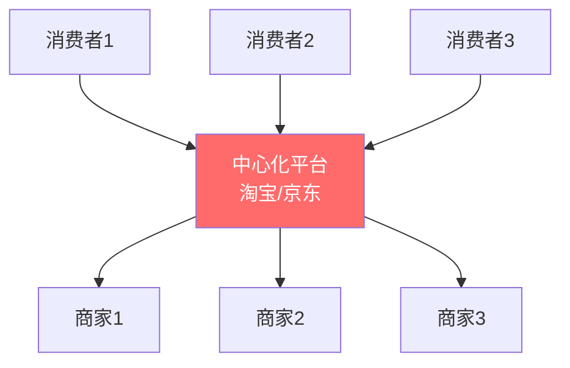
```mermaid
graph TB
    C1[消费者1] --> P[中心化平台<br/>淘宝/京东]
    C2[消费者2] --> P
    C3[消费者3] --> P
    
    P --> M1[商家1]
    P --> M2[商家2]
    P --> M3[商家3]
    
    style P fill:#ff6b6b,color:#fff
```

**Agent电商模式**：

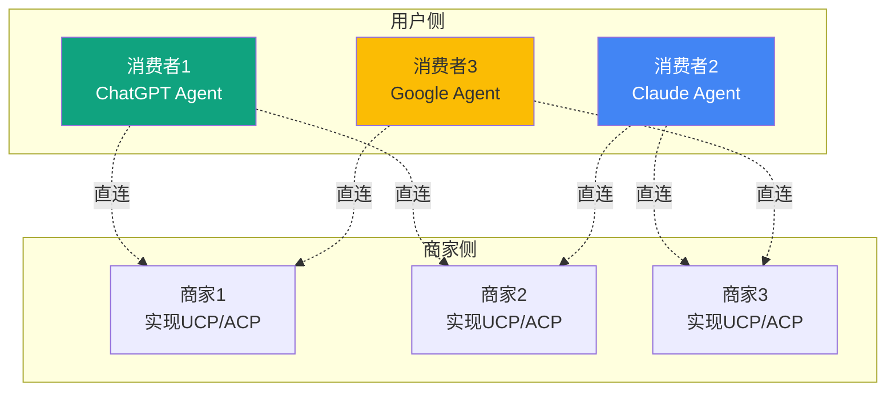
```mermaid
graph TB
    subgraph "用户侧"
        U1[消费者1<br/>ChatGPT Agent]
        U2[消费者2<br/>Claude Agent]
        U3[消费者3<br/>Google Agent]
    end
    
    subgraph "商家侧"
        M1[商家1<br/>实现UCP/ACP]
        M2[商家2<br/>实现UCP/ACP]
        M3[商家3<br/>实现UCP/ACP]
    end
    
    U1 -.直连.-> M1
    U1 -.直连.-> M2
    U2 -.直连.-> M2
    U2 -.直连.-> M3
    U3 -.直连.-> M1
    U3 -.直连.-> M3
    
    style U1 fill:#10a37f,color:#fff
    style U2 fill:#4285f4,color:#fff
    style U3 fill:#fbbc04
```

**变革点**：
- 🔓 **消除平台锁定**：商家直接服务消费者，降低平台依赖
- 💰 **降低抽成成本**：减少平台中介费用，商家利润率提升
- 🎯 **精准触达客户**：AI Agent直接对接商家API，商品推荐更精准
- 🌐 **全球市场开放**：标准化协议打破地域壁垒

### 2. 对话式商务体验

**传统购物流程**：

```
1. 打开电商App
2. 搜索关键词
3. 浏览商品列表
4. 查看商品详情
5. 比价
6. 加入购物车
7. 填写地址
8. 选择支付方式
9. 确认订单
```

**Agent购物流程**：

```
用户："帮我买一个适合跑步的蓝牙耳机，预算300元"
Agent：自动完成搜索、比价、下单
用户："订单确认"
```

**ChatGPT Instant Checkout实例**：

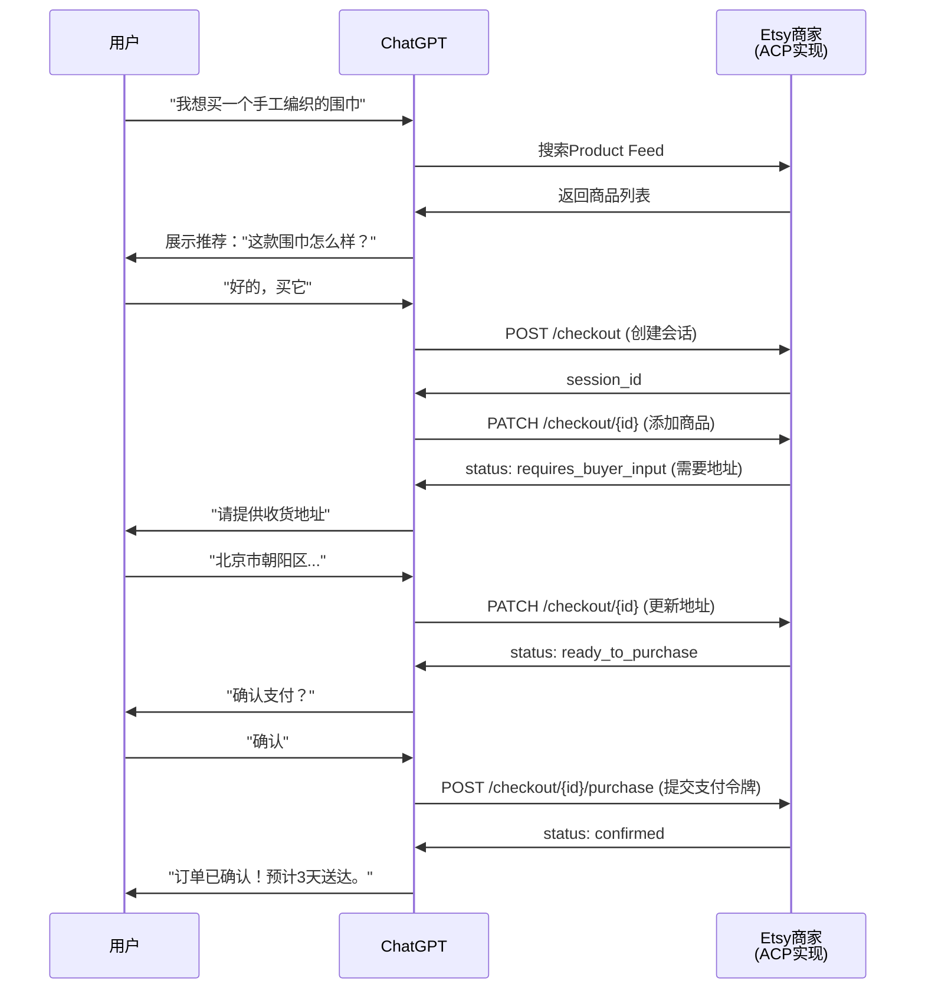
```mermaid
sequenceDiagram
    participant U as 用户
    participant C as ChatGPT
    participant E as Etsy商家<br/>(ACP实现)
    
    U->>C: "我想买一个手工编织的围巾"
    C->>E: 搜索Product Feed
    E->>C: 返回商品列表
    C->>U: 展示推荐："这款围巾怎么样？"
    U->>C: "好的，买它"
    
    C->>E: POST /checkout (创建会话)
    E->>C: session_id
    
    C->>E: PATCH /checkout/{id} (添加商品)
    E->>C: status: requires_buyer_input (需要地址)
    
    C->>U: "请提供收货地址"
    U->>C: "北京市朝阳区..."
    
    C->>E: PATCH /checkout/{id} (更新地址)
    E->>C: status: ready_to_purchase
    
    C->>U: "确认支付？"
    U->>C: "确认"
    
    C->>E: POST /checkout/{id}/purchase (提交支付令牌)
    E->>C: status: confirmed
    C->>U: "订单已确认！预计3天送达。"
```

### 3. 商家能力升级

实现UCP/ACP协议后，商家获得的新能力：

| 能力 | 说明 | 价值 |
|-----|------|------|
| **AI发现性** | 商品可被任何AI Agent发现 | 突破平台流量限制 |
| **动态定价** | 根据Agent请求实时调整价格 | 提高转化率 |
| **个性化服务** | 基于用户profile定制商品推荐 | 提升客单价 |
| **全渠道触达** | 一套API接入所有AI Agent | 降低开发成本 |
| **数据主权** | 保留客户数据所有权 | 建立私域流量 |

### 4. 支付安全新范式

**传统支付流**：

```
用户 → 平台 → PSP → 商家账户
      ↓
   敏感数据暴露风险
```

**UCP/ACP支付流**：

```
用户 → 凭证提供商(CP) → 令牌化
                          ↓
                    AI Agent (仅传递令牌)
                          ↓
                       商家 → PSP验证令牌 → 扣款
```

**安全优势**：
- ✅ 商家和平台无需处理原始支付信息
- ✅ 符合PCI DSS Level 1标准
- ✅ 一次性令牌防止重放攻击
- ✅ 作用域限制令牌使用范围
- ✅ 可验证凭证（VDC）支持自主Agent

### 5. 供应链协同重构

UCP的Order能力支持整个订单生命周期的异步更新：

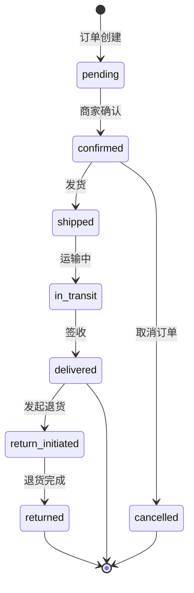
```mermaid
stateDiagram-v2
    [*] --> pending: 订单创建
    pending --> confirmed: 商家确认
    confirmed --> shipped: 发货
    shipped --> in_transit: 运输中
    in_transit --> delivered: 签收
    
    confirmed --> cancelled: 取消订单
    delivered --> return_initiated: 发起退货
    return_initiated --> returned: 退货完成
    
    delivered --> [*]
    cancelled --> [*]
    returned --> [*]
```

**每个状态变化通过Webhook实时通知AI Agent**，用户可以随时询问：

```
用户："我的订单到哪了？"
Agent："您的手工围巾已从西藏发出，预计明天下午送达。"
```

## 实施建议

### 对商家的建议

#### 快速启动路径

**选择ACP的场景**：
- 🎯 主要客群是ChatGPT用户
- 💡 希望快速上线Agent购物
- 🏪 已使用Stripe作为支付服务商
- 📦 商品品类适合对话式购物

**选择UCP的场景**：
- 🌍 需要接入多种AI Agent和平台
- 🔧 拥有复杂的ERP/OMS系统需要集成
- 🏢 B2B场景或企业采购
- 🚀 计划自建AI Agent购物能力

#### 实施步骤

**Step 1：评估现有系统**

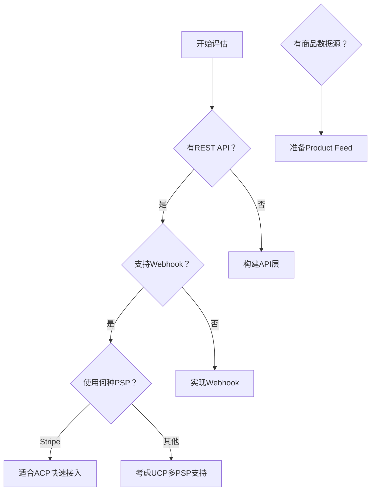
```mermaid
graph TB
    Start[开始评估]
    
    Check1{有REST API？}
    Check2{支持Webhook？}
    Check3{使用何种PSP？}
    Check4{有商品数据源？}
    
    Start --> Check1
    Check1 -->|是| Check2
    Check1 -->|否| Build1[构建API层]
    
    Check2 -->|是| Check3
    Check2 -->|否| Build2[实现Webhook]
    
    Check3 -->|Stripe| ACP_Ready[适合ACP快速接入]
    Check3 -->|其他| UCP_Option[考虑UCP多PSP支持]
    
    Check4 --> Build3[准备Product Feed]
```

**Step 2：选择协议和SDK**

- **ACP实现**：
  - 官方文档：https://developers.openai.com/commerce
  - Stripe SDK：https://docs.stripe.com/agentic-commerce

- **UCP实现**：
  - 官方规范：https://ucp.dev/specification/overview
  - Python SDK：https://github.com/Universal-Commerce-Protocol/sdk-python
  - TypeScript SDK：https://github.com/Universal-Commerce-Protocol/sdk-typescript

**Step 3：实现核心端点**

以ACP为例：

```javascript
// 1. 创建结账会话
app.post('/api/v1/checkout', async (req, res) => {
  const session = await createCheckoutSession(req.body);
  res.json({
    id: session.id,
    status: 'incomplete',
    cart: session.cart,
    available_payment_methods: ['card', 'apple_pay']
  });
});

// 2. 更新结账会话
app.patch('/api/v1/checkout/:id', async (req, res) => {
  const session = await updateCheckoutSession(req.params.id, req.body);
  res.json({
    id: session.id,
    status: session.status,
    cart: session.cart,
    shipping_address: session.shipping_address,
    tax: session.tax,
    total: session.total
  });
});

// 3. 提交购买
app.post('/api/v1/checkout/:id/purchase', async (req, res) => {
  const { payment_token } = req.body;
  
  // 使用Stripe验证和扣款
  const charge = await stripe.charges.create({
    amount: session.total,
    currency: 'usd',
    source: payment_token
  });
  
  if (charge.status === 'succeeded') {
    res.json({ status: 'confirmed', order_id: charge.id });
  } else {
    res.json({ 
      status: 'requires_escalation',
      messages: [{ type: 'error', message: 'Payment failed' }]
    });
  }
});
```

**Step 4：申请平台接入**

- **ChatGPT Instant Checkout**：
  - 申请地址：https://chatgpt.com/merchants
  - 提交Product Feed
  - 通过OpenAI认证测试

- **其他AI平台**：
  - 发布UCP Profile到`.well-known/ucp-profile.json`
  - 联系平台技术团队集成

### 对AI平台的建议

#### 接入协议选择

| 场景 | 推荐协议 | 原因 |
|-----|---------|------|
| 垂直电商平台 | ACP | 快速上线，专注购物体验 |
| 通用AI助手 | UCP + ACP | 覆盖更广泛的商家 |
| 企业服务 | UCP | 支持复杂业务场景 |
| 跨境电商 | UCP | 多区域、多PSP支持 |

#### 实现MCP支持（UCP特性）

UCP原生支持Model Context Protocol，AI模型可以直接调用UCP工具：

```json
{
  "tools": [
    {
      "name": "create_checkout",
      "description": "Create a new checkout session",
      "input_schema": {
        "type": "object",
        "properties": {
          "business_profile_uri": { "type": "string" },
          "cart": {
            "type": "object",
            "properties": {
              "items": { "type": "array" }
            }
          }
        }
      }
    }
  ]
}
```

### 对PSP/凭证提供商的建议

#### 实现Delegated Payment Spec

作为支付服务商，可以参考Stripe的Shared Payment Token实现：

**核心流程**：

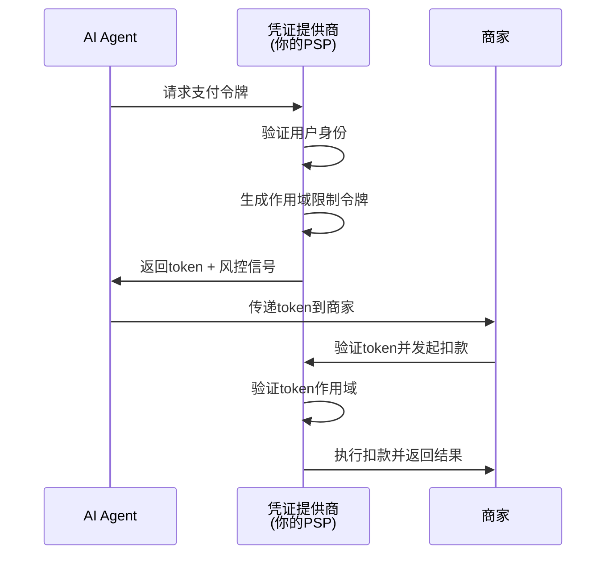
```mermaid
sequenceDiagram
    participant A as AI Agent
    participant CP as 凭证提供商<br/>(你的PSP)
    participant M as 商家
    
    A->>CP: 请求支付令牌
    CP->>CP: 验证用户身份
    CP->>CP: 生成作用域限制令牌
    CP->>A: 返回token + 风控信号
    
    A->>M: 传递token到商家
    M->>CP: 验证token并发起扣款
    CP->>CP: 验证token作用域
    CP->>M: 执行扣款并返回结果
```

**技术要点**：
1. 令牌需要绑定商家ID（merchant_id）
2. 令牌应设置过期时间（建议15分钟）
3. 支持风控信号传递（device_fingerprint, ip_address等）
4. 符合PCI DSS Level 1标准

## 未来展望

### 协议融合趋势

虽然UCP和ACP目前是两个独立的协议，但它们在很多方面是兼容的：

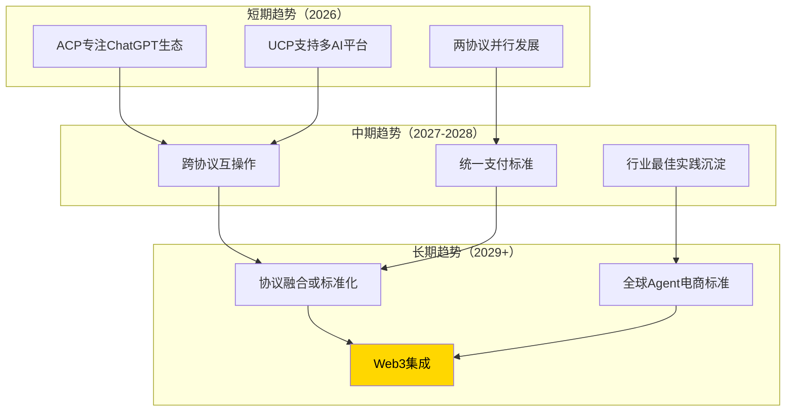
```mermaid
graph TB
    subgraph "短期趋势（2026）"
        T1[ACP专注ChatGPT生态]
        T2[UCP支持多AI平台]
        T3[两协议并行发展]
    end
    
    subgraph "中期趋势（2027-2028）"
        M1[跨协议互操作]
        M2[统一支付标准]
        M3[行业最佳实践沉淀]
    end
    
    subgraph "长期趋势（2029+）"
        L1[协议融合或标准化]
        L2[全球Agent电商标准]
        L3[Web3集成]
    end
    
    T1 --> M1
    T2 --> M1
    T3 --> M2
    
    M1 --> L1
    M2 --> L1
    M3 --> L2
    
    L1 --> L3
    L2 --> L3
    
    style L3 fill:#ffd700,color:#000
```

### 新兴场景

#### 1. 自主Agent集体购买

多个AI Agent协同完成复杂购买任务：

```mermaid
graph LR
    U[用户] -->|任务委托| M[主Agent]
    
    M -->|询价| A1[比价Agent]
    M -->|验真| A2[验真Agent]
    M -->|物流| A3[物流Agent]
    
    A1 -->|最优价格| M
    A2 -->|正品验证| M
    A3 -->|配送方案| M
    
    M -->|执行购买| Store[商家<br/>UCP/ACP]
    
    style M fill:#4285f4,color:#fff
    style Store fill:#10a37f,color:#fff
```

#### 2. 语音/视觉购物

结合多模态AI能力：

```
用户：拍摄沙发照片 → AI Agent识别款式 → 搜索相似商品 → 自动下单
```

#### 3. Web3集成

- **加密货币支付**：扩展Payment Handler支持
- **NFT商品**：数字资产所有权验证
- **DAO社区团购**：去中心化组织集体采购

#### 4. 元宇宙商务

虚拟世界中的Agent电商：

```
VR环境 → 虚拟店铺 → Agent导购 → UCP/ACP结账 → 现实世界配送
```

### 生态演进预测

**2026年**：
- ChatGPT Instant Checkout商家数量突破10万
- 主流电商平台（Shopify、WooCommerce）内置UCP/ACP支持
- 第三方AI Agent开始接入

**2027年**：
- Agent购物占电商总交易额的5-10%
- 出现专门为Agent优化的新型电商平台
- 跨境Agent购物成为新增长点

**2028年**：
- 协议融合，形成统一的国际标准（ISO标准？）
- B2B Agent采购成为主流
- 供应链全面AI化

## 总结

UCP和ACP协议的出现，标志着电商行业进入了**"Agent Commerce"时代**。两个协议各有侧重：

**UCP（Universal Commerce Protocol）**：
- ✅ 适合：需要多平台支持、复杂业务场景、传输层灵活性
- 🎯 优势：模块化设计、强大扩展性、治理机制完善
- 🎓 学习成本：中等，需要理解能力架构和传输层适配

**ACP（Agentic Commerce Protocol）**：
- ✅ 适合：快速上线ChatGPT购物、专注对话式购物体验
- 🎯 优势：简洁易用、Stripe深度集成、OpenAI官方支持
- 🎓 学习成本：低，专注REST API和标准流程

对于商家和开发者而言，**建议先从ACP入手快速验证市场**，随着业务复杂度提升再考虑UCP的完整实现。对于AI平台而言，**同时支持两种协议可以覆盖更广泛的商家生态**。

无论选择哪种协议，核心目标都是一致的：**让AI Agent成为用户的智能购物助手，重构电商价值链，实现商家与消费者的直接连接**。

这场由标准协议驱动的电商革命，才刚刚开始。

## 参考资源

### 官方文档

- **UCP官网**：https://ucp.dev/
- **UCP GitHub**：https://github.com/Universal-Commerce-Protocol/ucp
- **ACP官网**：https://agenticcommerce.dev/
- **OpenAI Commerce指南**：https://developers.openai.com/commerce/guides/get-started
- **Stripe Agentic Commerce**：https://docs.stripe.com/agentic-commerce

### 深度学习资源

- **UCP DeepWiki**：https://deepwiki.com/Universal-Commerce-Protocol/ucp
- **UCP规范文档**：https://ucp.dev/specification/overview
- **ACP Checkout规范**：https://developers.openai.com/commerce/specs/checkout
- **ACP支付规范**：https://developers.openai.com/commerce/specs/payment

### 社区和讨论

- **UCP GitHub Discussions**：https://github.com/Universal-Commerce-Protocol/ucp/discussions
- **UCP Samples仓库**：https://github.com/Universal-Commerce-Protocol/samples
- **ChatGPT商家申请**：https://chatgpt.com/merchants

---

*本文写作时间：2026年1月31日。协议规范和功能细节可能随版本更新而变化，请以官方文档为准。*

