## 项目简介

**Remotion** 是一个革命性的视频创作框架，它允许开发者使用 React 组件以编程方式创建视频。通过将视频视为代码，Remotion 打开了一个全新的视频制作范式，让开发者可以利用现代 Web 技术栈的全部能力来创作动态、数据驱动的视频内容。

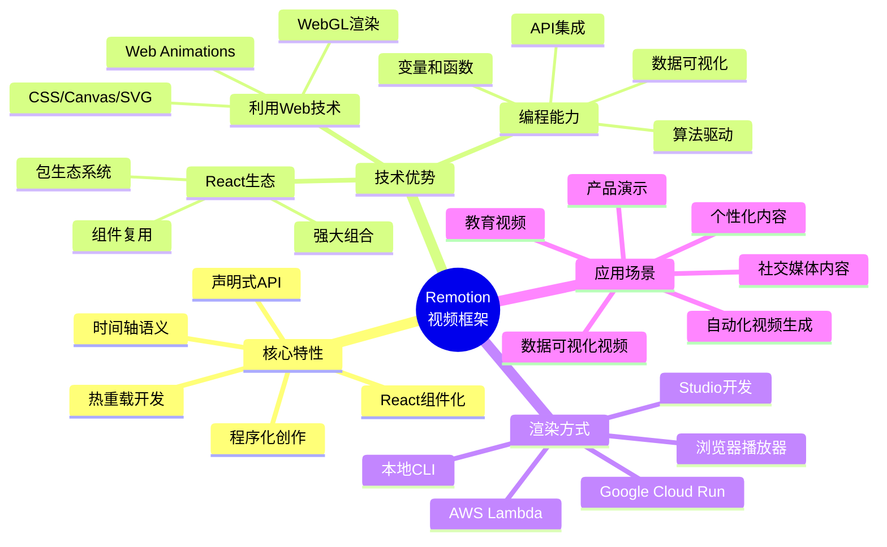

### 项目信息

- **项目地址**: [https://github.com/remotion-dev/remotion](https://github.com/remotion-dev/remotion)
- **官方网站**: [https://remotion.dev](https://remotion.dev)
- **文档地址**: [https://remotion.dev/docs](https://remotion.dev/docs)
- **Stars**: 35.2k+ ⭐
- **License**: 特殊许可证（商业使用需获取公司许可）
- **主要语言**: TypeScript (77.7%), React
- **包管理**: Bun 1.3.3
- **架构**: Monorepo (70+ packages)

## 为什么选择 Remotion？

### 传统视频制作的局限

传统视频制作工具（如 Adobe Premiere、Final Cut Pro）虽然功能强大，但在以下场景中存在明显局限：

1. **批量生成视频**: 需要为 1000 个用户生成个性化年度回顾视频
2. **数据驱动视频**: 实时股票数据可视化视频
3. **模板化内容**: 统一品牌风格的社交媒体视频
4. **自动化流程**: 新闻快讯自动生成视频
5. **版本控制**: 视频内容的迭代和协作

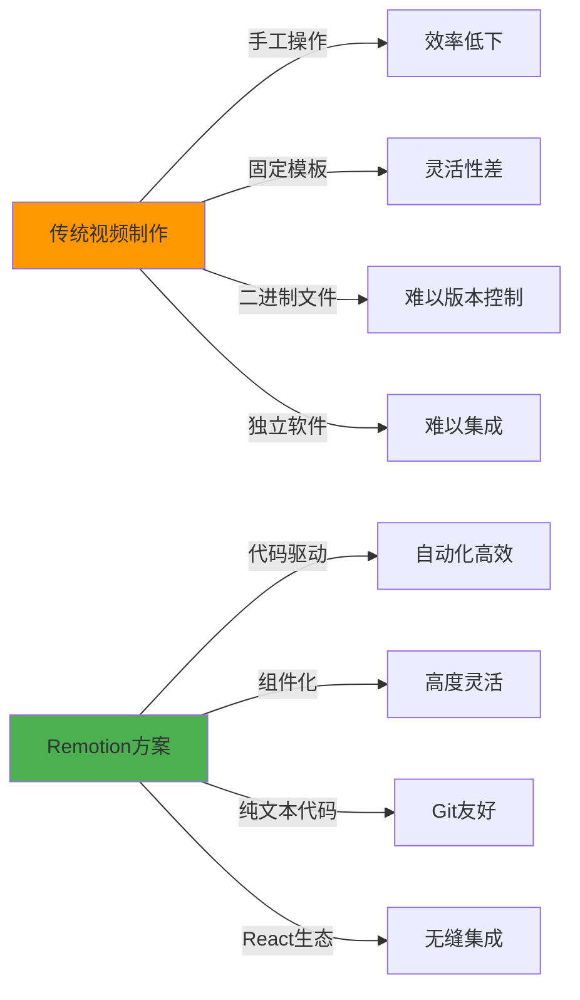

### Remotion 的核心优势

#### 1. 利用 Web 技术的全部能力

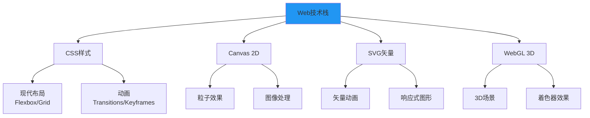

#### 2. 编程能力驱动创意

- **变量和函数**: 使用数学公式驱动动画
- **条件逻辑**: 根据数据动态调整内容
- **循环迭代**: 批量生成重复元素
- **API 集成**: 实时获取外部数据
- **算法创意**: 实现程序化艺术效果

#### 3. React 生态系统加持

- **组件复用**: 构建视频素材库
- **状态管理**: 使用 Redux/Context 管理复杂状态
- **包生态系统**: 利用 npm 上数百万个包
- **TypeScript 支持**: 类型安全的视频开发
- **测试能力**: 单元测试你的视频逻辑

## 架构设计

### 整体架构

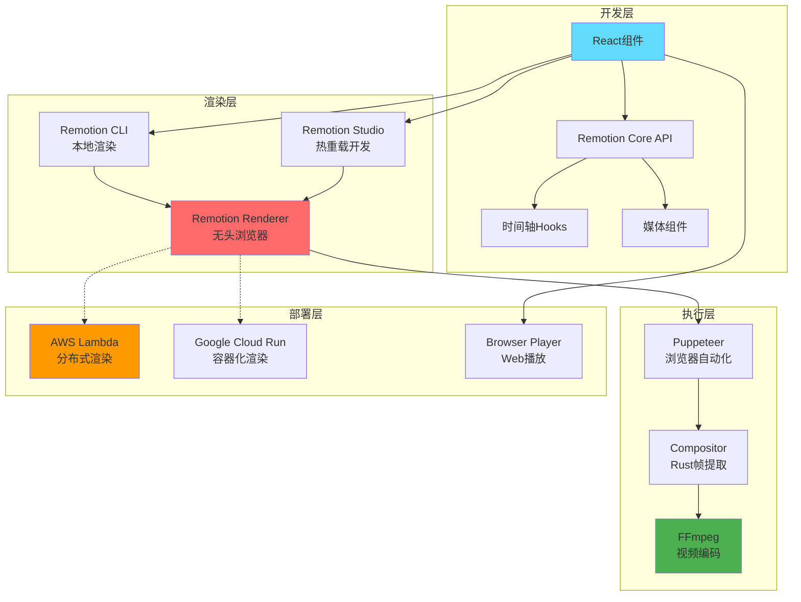

### Monorepo 组织结构

Remotion 采用 **Bun 工作区 + Turbo** 的 Monorepo 架构，包含 70+ 个专业化包：

```mermaid
graph LR
    subgraph "核心框架"
        A1[remotion<br/>React API]
        A2[@remotion/renderer<br/>渲染引擎]
        A3[@remotion/player<br/>浏览器播放器]
    end
    
    subgraph "开发工具"
        B1[@remotion/cli<br/>命令行工具]
        B2[@remotion/studio<br/>开发服务器]
        B3[@remotion/bundler<br/>Webpack编排]
        B4[create-video<br/>项目脚手架]
    end
    
    subgraph "云渲染"
        C1[@remotion/lambda<br/>AWS Lambda]
        C2[@remotion/cloudrun<br/>GCP Cloud Run]
    end
    
    subgraph "媒体处理"
        D1[@remotion/media-parser<br/>元数据提取]
        D2[@remotion/compositor-*<br/>原生帧提取]
        D3[@remotion/webcodecs<br/>浏览器编码]
        D4[@remotion/media-utils<br/>媒体工具]
    end
    
    subgraph "扩展包"
        E1[@remotion/three<br/>Three.js集成]
        E2[@remotion/lottie<br/>Lottie动画]
        E3[@remotion/shapes<br/>形状基元]
        E4[@remotion/fonts<br/>字体加载]
        E5[@remotion/captions<br/>字幕处理]
    end
    
    A1 --> A2
    A2 --> B1
    A2 --> B2
    B2 --> B3
    A2 --> C1
    A2 --> C2
    A2 --> D2
    D1 --> D4
    A1 --> E1
    A1 --> E2
```

### 渲染管道架构

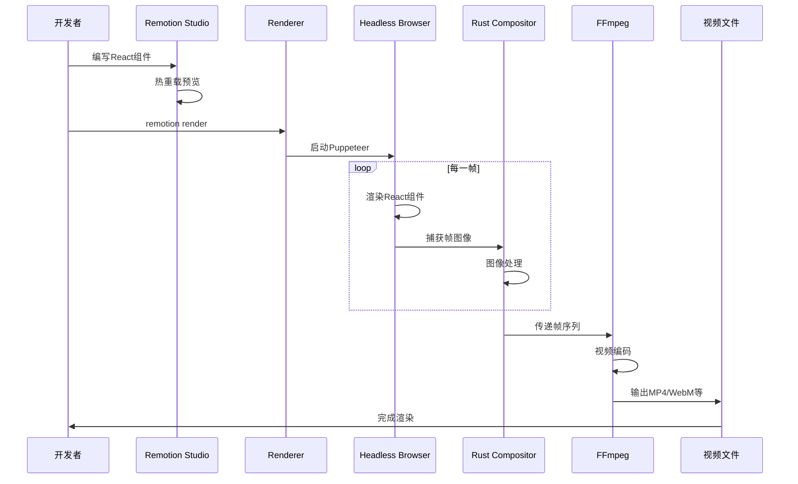

## 快速开始

### 安装和初始化

```bash
# 使用 npx 创建新项目
npx create-video@latest

# 或使用 npm
npm init video

# 或使用 yarn
yarn create video

# 或使用 pnpm
pnpm create video

# 或使用 bun
bun create video
```

创建过程中会询问：

1. **项目名称**: 如 `my-video-project`
2. **包管理器**: npm/yarn/pnpm/bun
3. **模板选择**: 
   - Hello World (基础模板)
   - Blank (空白项目)
   - JavaScript (JS版本)
   - TypeScript (TS版本，推荐)
   - TailwindCSS (集成 Tailwind)
   - Three.js (3D场景)
   - Still images (静态图像)

### 项目结构

```
my-video-project/
├── public/              # 静态资源
│   ├── audio.mp3
│   └── images/
├── src/
│   ├── Root.tsx         # 根组件，注册所有合成
│   ├── Composition.tsx  # 视频合成组件
│   ├── HelloWorld/      # 示例场景
│   │   ├── index.tsx
│   │   └── Scene.tsx
│   └── index.ts         # 入口文件
├── package.json
├── remotion.config.ts   # Remotion配置
└── tsconfig.json
```

### 第一个视频组件


```typescript
// src/MyVideo.tsx
import { AbsoluteFill, useCurrentFrame, useVideoConfig } from 'remotion';

export const MyVideo: React.FC = () => {
  // 获取当前帧号
  const frame = useCurrentFrame();
  
  // 获取视频配置
  const { width, height, fps, durationInFrames } = useVideoConfig();
  
  // 计算不透明度（淡入效果）
  const opacity = Math.min(1, frame / 30);
  
  // 计算旋转角度
  const rotation = (frame / fps) * 60; // 每秒旋转60度

  return (
    <AbsoluteFill
      style={{
        backgroundColor: '#000',
        justifyContent: 'center',
        alignItems: 'center',
      }}
    >
      <div
        style={{
          color: 'white',
          fontSize: 100,
          fontFamily: 'Arial',
          opacity,
          transform: `rotate(${rotation}deg)`,
        }}
      >
        Hello Remotion!
      </div>
    </AbsoluteFill>
  );
};
```


### 注册合成


```typescript
// src/Root.tsx
import { Composition } from 'remotion';
import { MyVideo } from './MyVideo';

export const RemotionRoot: React.FC = () => {
  return (
    <>
      <Composition
        id="MyVideo"
        component={MyVideo}
        durationInFrames={150}    // 5秒 @ 30fps
        fps={30}
        width={1920}
        height={1080}
        defaultProps={{}}
      />
    </>
  );
};
```


### 开发和渲染

```bash
# 启动开发服务器（实时预览）
npm start

# 或使用 Remotion CLI
npx remotion studio

# 渲染视频
npx remotion render MyVideo out/video.mp4

# 渲染特定帧范围
npx remotion render MyVideo out/video.mp4 --frames=0-60

# 自定义编码参数
npx remotion render MyVideo out/video.mp4 \
  --codec=h264 \
  --crf=18 \
  --audio-codec=aac
```

## AI 辅助开发：使用 Remotion Skills

Remotion 提供了专门的 **Agent Skills**，为 AI 编程助手（如 Claude Code、Cursor、Cline 等）定义了在 Remotion 项目中工作的最佳实践。这些技能可以显著提升你的开发效率，让 AI 助手更好地理解 Remotion 的特性和约定。

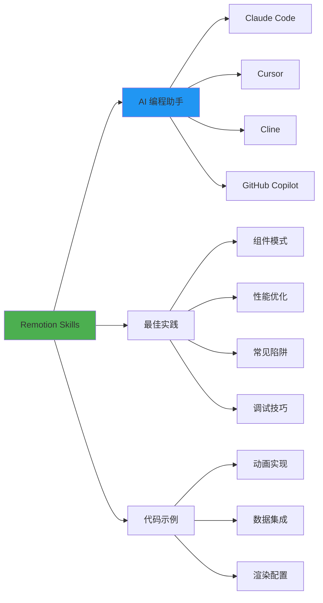

### 安装 Remotion Skills

#### 方式一：创建项目时安装

在创建新的 Remotion 项目时，系统会提示你是否安装 Skills：

```bash
bun create video
# 或
npx create-video@latest

# 在交互式提示中选择 "Yes" 来安装 Skills
```

**交互过程**：

```
✔ Project name: my-video
✔ Package manager: bun
✔ Template: TypeScript
✔ Install Remotion Skills for AI assistants? › Yes  ← 选择这个

Installing Remotion Skills...
✓ Skills installed successfully!
```

#### 方式二：在现有项目中安装

如果你已经有一个 Remotion 项目，可以使用以下命令安装 Skills：

```bash
# 使用 npx（推荐）
npx skills add remotion-dev/skills

# 或者直接从 GitHub 安装
npx skills add https://github.com/remotion-dev/remotion/tree/main/packages/skills
```

安装完成后，Skills 会被添加到你的项目中，AI 助手将自动识别并应用这些最佳实践。

### Skills 包含的内容

Remotion Skills 涵盖了以下关键领域：

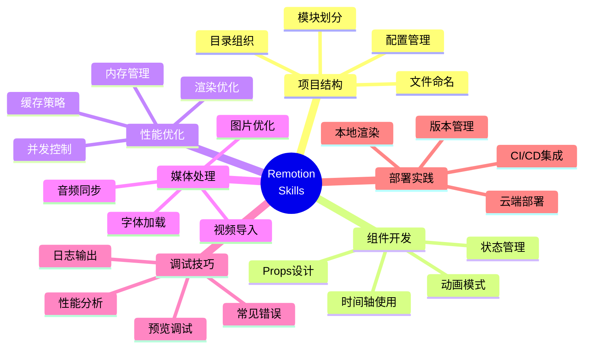

### Skills 提供的帮助

#### 1. 智能代码补全

AI 助手会根据 Remotion 的最佳实践提供更准确的代码建议：

**示例场景**：当你输入 `useCurrentFrame` 时，AI 会建议正确的用法：

```typescript
// ✓ AI 会建议这样使用
import { useCurrentFrame, interpolate } from 'remotion';

export const MyComponent = () => {
  const frame = useCurrentFrame();
  
  // 使用 interpolate 而不是手动计算
  const opacity = interpolate(frame, [0, 30], [0, 1]);
  
  return <div style={{ opacity }}>...</div>;
};

// ✗ 避免直接进行复杂计算
// const opacity = Math.min(1, frame / 30); // AI 会建议使用 interpolate
```

#### 2. 常见模式识别

AI 助手能识别并建议 Remotion 中的常见模式：

```typescript
// 当你开始编写动画时，AI 会建议使用 spring
import { spring, useCurrentFrame, useVideoConfig } from 'remotion';

export const BouncyText = () => {
  const frame = useCurrentFrame();
  const { fps } = useVideoConfig();
  
  // AI 建议：对于弹性动画，使用 spring 而不是 interpolate
  const scale = spring({
    frame,
    fps,
    config: {
      damping: 10,
      stiffness: 100,
    },
  });
  
  return (
    <div style={{ transform: `scale(${scale})` }}>
      Bouncy!
    </div>
  );
};
```

#### 3. 性能优化建议

AI 会主动提醒性能相关的注意事项：

```typescript
import React from 'react';
import { useCurrentFrame } from 'remotion';

// ✓ AI 会建议使用 React.memo 避免不必要的重渲染
export const HeavyComponent = React.memo<{ data: number[] }>(({ data }) => {
  const frame = useCurrentFrame();
  
  // 昂贵的计算...
  const processed = data.map(/* ... */);
  
  return <div>{/* ... */}</div>;
});

// AI 还会建议将静态内容提取到组件外部
const STATIC_STYLES = {
  container: {
    width: '100%',
    height: '100%',
  },
};
```

#### 4. 错误预防

AI 会帮助你避免常见错误：

```typescript
// ✗ AI 会警告：delayRender 必须在组件渲染时同步调用
export const BadComponent = () => {
  const [data, setData] = useState(null);
  
  useEffect(() => {
    const handle = delayRender(); // ✗ 错误：异步调用
    // ...
  }, []);
};

// ✓ AI 建议的正确用法
export const GoodComponent = () => {
  const [data, setData] = useState(null);
  const [handle] = useState(() => delayRender()); // ✓ 正确：同步调用
  
  useEffect(() => {
    // 使用 handle...
    continueRender(handle);
  }, [handle]);
};
```

### 与不同 AI 助手配合使用

#### Claude Code / Cursor

在 Cursor 中，Remotion Skills 会自动被识别为 Agent Skills：

```bash
# 在 Cursor 中，Skills 会出现在 Agent Skills 列表中
# 你可以通过命令面板查看：Cmd+Shift+P → "Agent Skills"
```

**使用示例**：

```
你: "创建一个带弹簧动画的文字组件"

Claude (有 Skills): 
我会创建一个使用 spring 的文字组件，这是 Remotion 中实现物理动画的最佳实践...
[生成优化的代码]

Claude (无 Skills):
我会创建一个动画组件...
[可能生成不够优化的代码]
```

#### GitHub Copilot

GitHub Copilot 也能从 Skills 中学习：

```typescript
// 当你开始输入时，Copilot 会基于 Skills 提供更好的建议
import { Composition } from 'remotion';

// 输入 "export const " 后，Copilot 会建议：
export const RemotionRoot: React.FC = () => {
  return (
    <>
      <Composition
        id="MyVideo"           // Skills: 使用清晰的 id
        component={MyVideo}
        durationInFrames={150} // Skills: 150帧 = 5秒 @ 30fps
        fps={30}
        width={1920}
        height={1080}
      />
    </>
  );
};
```

### Skills 的实际效果

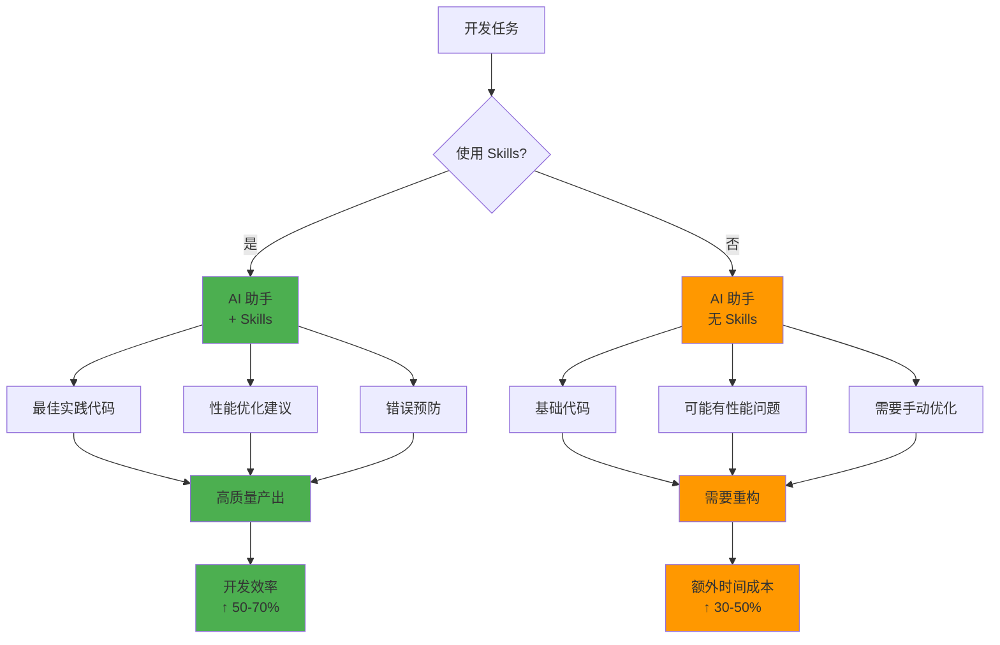

### 查看和自定义 Skills

Skills 存储在你的项目中，你可以查看和自定义它们：

```bash
# Skills 通常位于项目根目录的隐藏文件夹中
.cursor/
  └── skills/
      └── remotion-dev/
          └── SKILL.md

# 或者在 .claude/ 目录中（取决于你使用的 AI 助手）
.claude/
  └── skills/
```

你也可以在 GitHub 上查看完整的 Skills 内容：

- **GitHub 仓库**: [remotion-dev/remotion/packages/skills](https://github.com/remotion-dev/remotion/tree/main/packages/skills)
- **Skills 平台**: [agentskills.io](https://agentskills.io/home)

### 最佳实践：充分利用 Skills

#### 1. 主动询问 AI

当遇到问题时，主动向 AI 询问 Remotion 最佳实践：

```
你: "在 Remotion 中实现淡入淡出效果的最佳方式是什么？"

AI (有 Skills):
根据 Remotion 最佳实践，推荐使用 interpolate 函数配合
extrapolate 参数来实现淡入淡出效果...
[提供完整示例]
```

#### 2. 让 AI 审查代码

请 AI 帮你审查 Remotion 代码的性能和最佳实践：

```
你: "请审查这段 Remotion 代码并提出优化建议"

AI (有 Skills):
我发现以下可以改进的地方：
1. 建议使用 React.memo 包装 HeavyComponent
2. staticFile() 调用可以提取到组件外部
3. 这里的动画可以用 spring() 替代 interpolate()
...
```

#### 3. 快速原型开发

使用 AI 快速生成 Remotion 组件原型：

```
你: "创建一个显示股票价格走势图的 Remotion 组件，
     数据从 API 获取，包含动画效果"

AI (有 Skills):
我会创建一个遵循 Remotion 最佳实践的股票走势图组件，
包含：
- 使用 delayRender() 处理异步数据加载
- 使用 interpolate() 实现平滑的图表动画
- 使用 SVG 绘制性能优化的图表
[生成完整代码]
```

### Skills 带来的价值

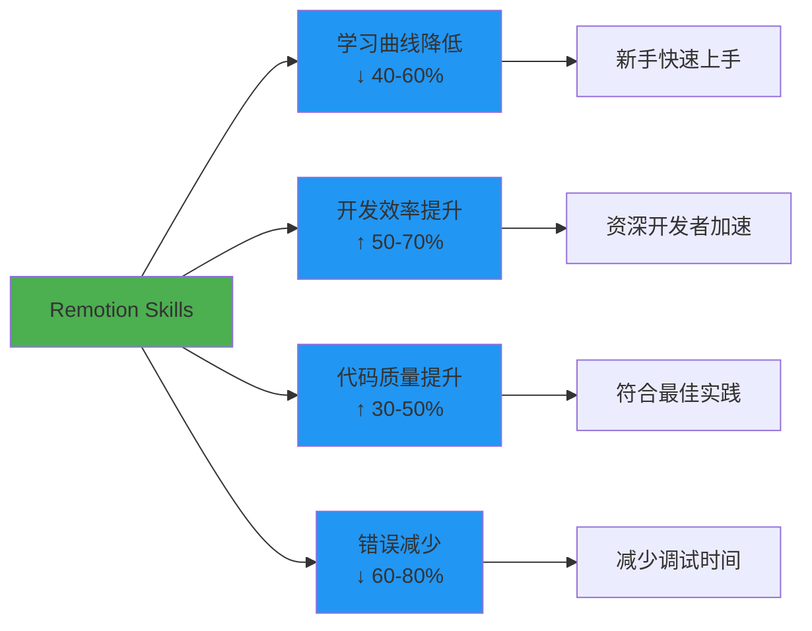

### 总结

Remotion Skills 是连接 AI 助手与 Remotion 框架的桥梁，它能够：

- ✅ **加速学习**：新手可以更快掌握 Remotion 的最佳实践
- ✅ **提高效率**：减少查阅文档的时间，AI 直接提供正确答案
- ✅ **保证质量**：确保生成的代码符合 Remotion 的性能和可维护性标准
- ✅ **避免陷阱**：预防常见错误，减少调试时间
- ✅ **持续改进**：随着 Remotion 的更新，Skills 也会持续优化

**推荐所有 Remotion 开发者安装使用！**

📚 **相关链接**：
- [Remotion AI Skills 文档](https://www.remotion.dev/docs/ai/skills)
- [Agent Skills 平台](https://agentskills.io/home)
- [GitHub Skills 仓库](https://github.com/remotion-dev/remotion/tree/main/packages/skills)

## 核心概念

### 1. Composition（合成）

Composition 是视频的顶层容器，定义视频的元数据：

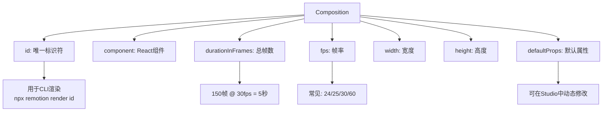

**多合成管理**：

```typescript
export const RemotionRoot: React.FC = () => {
  return (
    <>
      <Composition
        id="Square"
        component={Square}
        width={1080}
        height={1080}  // 正方形，适合Instagram
        fps={30}
        durationInFrames={90}
      />
      <Composition
        id="Landscape"
        component={Landscape}
        width={1920}
        height={1080}  // 16:9，适合YouTube
        fps={30}
        durationInFrames={300}
      />
      <Composition
        id="Portrait"
        component={Portrait}
        width={1080}
        height={1920}  // 9:16，适合TikTok/Reels
        fps={30}
        durationInFrames={120}
      />
    </>
  );
};
```

### 2. 时间轴系统

#### useCurrentFrame Hook


```typescript
import { useCurrentFrame } from 'remotion';

export const AnimatedCircle: React.FC = () => {
  const frame = useCurrentFrame();
  
  // 线性运动
  const x = frame * 5; // 每帧移动5像素
  
  // 缓动运动（easing）
  const progress = frame / 60; // 60帧完成
  const eased = Math.pow(progress, 2); // 平方缓动
  const y = eased * 500;
  
  // 周期性运动
  const scale = 1 + Math.sin(frame * 0.1) * 0.3;
  
  return (
    <div
      style={{
        width: 100,
        height: 100,
        borderRadius: '50%',
        backgroundColor: 'blue',
        transform: `translate(${x}px, ${y}px) scale(${scale})`,
      }}
    />
  );
};
```


#### Sequence 组件

Sequence 用于在时间轴上排列内容：

```typescript
import { Sequence, useCurrentFrame } from 'remotion';

export const Timeline: React.FC = () => {
  return (
    <>
      {/* 从第0帧开始，持续60帧 */}
      <Sequence from={0} durationInFrames={60}>
        <Scene1 />
      </Sequence>
      
      {/* 从第50帧开始（与Scene1重叠10帧） */}
      <Sequence from={50} durationInFrames={60}>
        <Scene2 />
      </Sequence>
      
      {/* 从第100帧开始 */}
      <Sequence from={100} durationInFrames={90}>
        <Scene3 />
      </Sequence>
    </>
  );
};
```

**时间轴可视化**：

```mermaid
gantt
    title 视频时间轴结构
    dateFormat X
    axisFormat %s帧
    
    section 场景
    Scene1           :0, 60
    Scene2           :50, 110
    Scene3           :100, 190
    
    section 音频
    背景音乐          :0, 190
    旁白1            :10, 50
    旁白2            :120, 170
    
    section 字幕
    标题             :0, 30
    正文字幕          :30, 150
    结束标识          :150, 190
```

### 3. 媒体组件

#### Video 组件


```typescript
import { Video } from 'remotion';

export const VideoScene: React.FC = () => {
  return (
    <Video
      src="https://example.com/video.mp4"
      startFrom={30}      // 从原始视频的第30帧开始
      endAt={90}          // 到原始视频的第90帧结束
      volume={0.5}        // 音量 50%
      playbackRate={1.5}  // 1.5倍速播放
      style={{
        width: '100%',
        height: '100%',
        objectFit: 'cover',
      }}
    />
  );
};
```


#### Audio 组件

```typescript
import { Audio, Sequence } from 'remotion';

export const AudioScene: React.FC = () => {
  return (
    <>
      {/* 背景音乐 */}
      <Audio
        src="/audio/background.mp3"
        volume={0.3}
        loop
      />
      
      {/* 音效1 - 在特定时间播放 */}
      <Sequence from={30}>
        <Audio
          src="/audio/sound-effect-1.mp3"
          volume={1}
        />
      </Sequence>
      
      {/* 音效2 - 淡入淡出 */}
      <Sequence from={60}>
        <Audio
          src="/audio/sound-effect-2.mp3"
          volume={(frame) => {
            if (frame < 10) return frame / 10;      // 淡入
            if (frame > 40) return (50 - frame) / 10; // 淡出
            return 1;
          }}
        />
      </Sequence>
    </>
  );
};
```

#### Img 组件


```typescript
import { Img, staticFile, useCurrentFrame } from 'remotion';

export const ImageScene: React.FC = () => {
  const frame = useCurrentFrame();
  
  // Ken Burns效果（缓慢缩放）
  const scale = 1 + (frame / 150) * 0.3;
  
  return (
    
  );
};
```


### 4. 延迟渲染（处理异步操作）

```typescript
import { continueRender, delayRender, useCurrentFrame } from 'remotion';
import { useEffect, useState } from 'react';

export const DataDrivenVideo: React.FC = () => {
  const [data, setData] = useState(null);
  const [handle] = useState(() => delayRender());
  
  useEffect(() => {
    // 获取外部数据
    fetch('https://api.example.com/data')
      .then(res => res.json())
      .then(data => {
        setData(data);
        continueRender(handle); // 数据加载完成，继续渲染
      })
      .catch(err => {
        console.error(err);
        continueRender(handle); // 即使出错也要继续
      });
  }, [handle]);
  
  if (!data) {
    return null; // 数据未加载时不渲染
  }
  
  return (
    <div>
      <h1>{data.title}</h1>
      <p>{data.description}</p>
    </div>
  );
};
```

## 高级技术

### 1. 动画和缓动

#### 使用插值函数


```typescript
import { interpolate, useCurrentFrame } from 'remotion';

export const SmoothAnimation: React.FC = () => {
  const frame = useCurrentFrame();
  
  // 线性插值
  const opacity = interpolate(
    frame,
    [0, 30],        // 输入范围：第0-30帧
    [0, 1],         // 输出范围：0-1
    {
      extrapolateLeft: 'clamp',  // 超出左边界时固定为0
      extrapolateRight: 'clamp', // 超出右边界时固定为1
    }
  );
  
  // 多段插值
  const y = interpolate(
    frame,
    [0, 30, 60, 90],        // 多个关键帧
    [0, -200, -200, 0],     // 对应的值
  );
  
  // 带缓动的插值
  const scale = interpolate(
    frame,
    [0, 60],
    [0, 1],
    {
      easing: (t) => t * t * (3 - 2 * t), // smoothstep缓动
    }
  );
  
  return (
    <div
      style={{
        opacity,
        transform: `translateY(${y}px) scale(${scale})`,
      }}
    >
      Animated Content
    </div>
  );
};
```


#### 预设缓动函数

```typescript
import { Easing, interpolate } from 'remotion';

// 常用缓动
const easeInOut = interpolate(frame, [0, 60], [0, 1], {
  easing: Easing.bezier(0.42, 0, 0.58, 1),
});

const easeOutBack = interpolate(frame, [0, 60], [0, 1], {
  easing: Easing.out(Easing.back(1.5)),
});

const elastic = interpolate(frame, [0, 60], [0, 1], {
  easing: Easing.elastic(1),
});
```

**缓动函数可视化**：

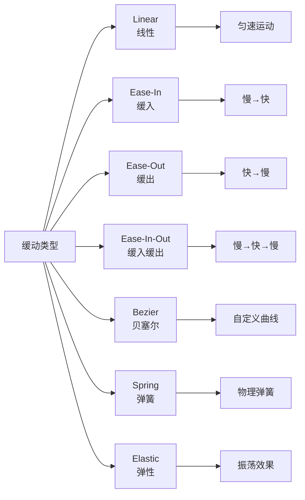

### 2. Spring 动画（物理引擎）


```typescript
import { spring, useCurrentFrame, useVideoConfig } from 'remotion';

export const SpringAnimation: React.FC = () => {
  const frame = useCurrentFrame();
  const { fps } = useVideoConfig();
  
  // 使用弹簧物理模拟
  const scale = spring({
    frame,
    fps,
    config: {
      damping: 10,    // 阻尼（数值越大，弹簧越"软"）
      stiffness: 100, // 刚度（数值越大，弹簧越"硬"）
      mass: 0.5,      // 质量
    },
  });
  
  // 延迟弹簧
  const rotation = spring({
    frame: frame - 30, // 延迟30帧开始
    fps,
    from: 0,
    to: 360,
    config: {
      damping: 20,
      stiffness: 200,
    },
  });
  
  return (
    <div
      style={{
        transform: `scale(${scale}) rotate(${rotation}deg)`,
      }}
    >
      Spring Animation
    </div>
  );
};
```


### 3. 数据可视化

#### 动态图表示例

```typescript
import { useCurrentFrame, interpolate } from 'remotion';

interface ChartProps {
  data: number[];
}

export const AnimatedBarChart: React.FC<ChartProps> = ({ data }) => {
  const frame = useCurrentFrame();
  
  const barWidth = 60;
  const gap = 20;
  const maxHeight = 400;
  const maxValue = Math.max(...data);
  
  return (
    <svg width={data.length * (barWidth + gap)} height={maxHeight + 100}>
      {data.map((value, index) => {
        // 每个柱子依次动画
        const startFrame = index * 10;
        const height = interpolate(
          frame,
          [startFrame, startFrame + 30],
          [0, (value / maxValue) * maxHeight],
          { extrapolateRight: 'clamp' }
        );
        
        const opacity = interpolate(
          frame,
          [startFrame, startFrame + 10],
          [0, 1],
          { extrapolateRight: 'clamp' }
        );
        
        return (
          <g key={index} opacity={opacity}>
            <rect
              x={index * (barWidth + gap)}
              y={maxHeight - height}
              width={barWidth}
              height={height}
              fill={`hsl(${(index / data.length) * 360}, 70%, 50%)`}
            />
            <text
              x={index * (barWidth + gap) + barWidth / 2}
              y={maxHeight + 30}
              textAnchor="middle"
              fontSize={16}
            >
              {value}
            </text>
          </g>
        );
      })}
    </svg>
  );
};
```

### 4. Three.js 3D 场景


```typescript
import { ThreeCanvas } from '@remotion/three';
import { useCurrentFrame } from 'remotion';
import { useRef } from 'react';
import * as THREE from 'three';

export const ThreeScene: React.FC = () => {
  const frame = useCurrentFrame();
  
  return (
    <ThreeCanvas
      width={1920}
      height={1080}
      camera={{ fov: 75, position: [0, 0, 5] }}
    >
      <ambientLight intensity={0.5} />
      <pointLight position={[10, 10, 10]} />
      
      <mesh rotation={[frame * 0.01, frame * 0.02, 0]}>
        <boxGeometry args={[1, 1, 1]} />
        <meshStandardMaterial color="orange" />
      </mesh>
    </ThreeCanvas>
  );
};
```


### 5. Lottie 动画集成


```typescript
import { Lottie } from '@remotion/lottie';
import animationData from './animation.json';

export const LottieScene: React.FC = () => {
  return (
    <Lottie
      animationData={animationData}
      style={{
        width: 500,
        height: 500,
      }}
    />
  );
};
```


## 渲染和部署

### 本地渲染

#### CLI 基础命令

```bash
# 基础渲染
npx remotion render src/index.ts MyVideo out/video.mp4

# 指定编解码器
npx remotion render MyVideo out/video.mp4 --codec=h264

# 调整质量（CRF: 0-51，数值越小质量越高）
npx remotion render MyVideo out/video.mp4 --crf=18

# ProRes 高质量输出
npx remotion render MyVideo out/video.mov --codec=prores

# WebM 格式
npx remotion render MyVideo out/video.webm --codec=vp8

# GIF 动画
npx remotion render MyVideo out/animation.gif --codec=gif

# 仅渲染音频
npx remotion render MyVideo out/audio.mp3 --codec=mp3

# 帧序列（PNG图片）
npx remotion render MyVideo out/frames/frame-%04d.png --codec=png-sequence
```

#### 高级渲染选项

```bash
# 并行渲染（使用多核心）
npx remotion render MyVideo out/video.mp4 --concurrency=8

# 自定义帧率范围
npx remotion render MyVideo out/video.mp4 --frames=30-90

# 传递自定义属性（props）
npx remotion render MyVideo out/video.mp4 \
  --props='{"name":"John","color":"blue"}'

# 覆盖合成配置
npx remotion render MyVideo out/video.mp4 \
  --width=1280 \
  --height=720 \
  --fps=60

# 环境变量
CUSTOM_API_KEY=xxx npx remotion render MyVideo out/video.mp4

# 静音视频
npx remotion render MyVideo out/video.mp4 --muted

# 自定义浏览器可执行文件
npx remotion render MyVideo out/video.mp4 \
  --browser-executable=/path/to/chrome
```

### 云渲染架构

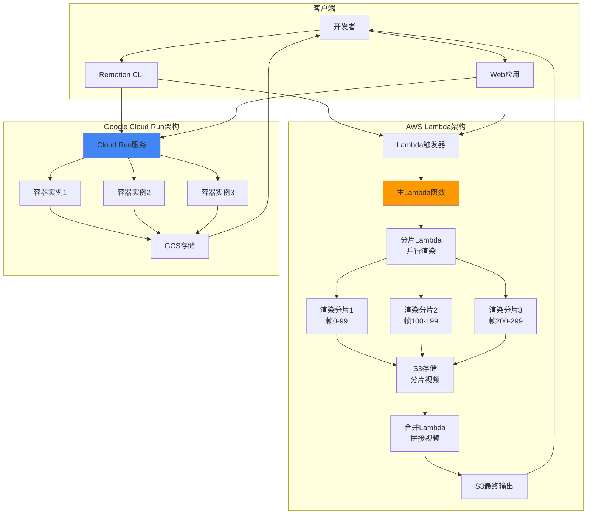

### AWS Lambda 部署

#### 1. 安装和配置

```bash
# 安装 Lambda 包
npm install @remotion/lambda

# 配置 AWS 凭证
export AWS_ACCESS_KEY_ID=your_access_key
export AWS_SECRET_ACCESS_KEY=your_secret_key

# 部署函数和层
npx remotion lambda deploy \
  --region us-east-1 \
  --memory 2048 \
  --disk 2048 \
  --timeout 900
```

#### 2. 渲染视频

```typescript
import { renderMediaOnLambda } from '@remotion/lambda/client';

const { bucketName, renderId } = await renderMediaOnLambda({
  region: 'us-east-1',
  functionName: 'remotion-render-xxx',
  composition: 'MyVideo',
  serveUrl: 'https://my-site.s3.amazonaws.com/bundle.js',
  codec: 'h264',
  inputProps: {
    name: 'John Doe',
    color: 'blue',
  },
  privacy: 'public',
});

console.log(`Rendering started: ${renderId}`);
console.log(`Output will be in: s3://${bucketName}/${renderId}`);
```

#### 3. 监控渲染进度

```typescript
import { getRenderProgress } from '@remotion/lambda/client';

const progress = await getRenderProgress({
  renderId,
  bucketName,
  functionName: 'remotion-render-xxx',
  region: 'us-east-1',
});

console.log(`Overall progress: ${progress.overallProgress * 100}%`);
console.log(`Rendered frames: ${progress.renderedFrames}/${progress.totalFrames}`);
```

### Google Cloud Run 部署

```bash
# 安装 Cloud Run 包
npm install @remotion/cloudrun

# 部署服务
npx remotion cloudrun deploy \
  --region us-central1 \
  --memory 2Gi \
  --cpu 2

# 渲染视频
npx remotion cloudrun render MyVideo \
  --service-name remotion-render \
  --region us-central1
```

### 性能优化

#### 渲染性能调优

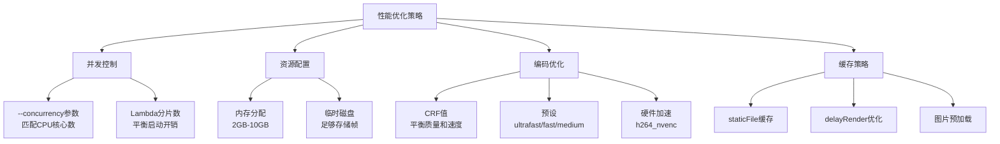

#### 成本优化

```typescript
// Lambda 成本优化配置
const renderConfig = {
  // 使用较小内存（对于简单视频）
  memory: 1024, // MB
  
  // 较小磁盘空间
  disk: 512, // MB
  
  // 合理超时时间
  timeout: 300, // 秒
  
  // 启用帧缓存
  frameCache: true,
  
  // 减少分片数（减少Lambda调用次数）
  framesPerLambda: 50,
  
  // 使用 Spot 实例（如果可用）
  useSpot: true,
};
```

## 实战案例

### 案例1：GitHub Unwrapped（个性化年度回顾）

GitHub Unwrapped 是 Remotion 官方的展示项目，为每个 GitHub 用户生成个性化的年度代码回顾视频。

**技术架构**：

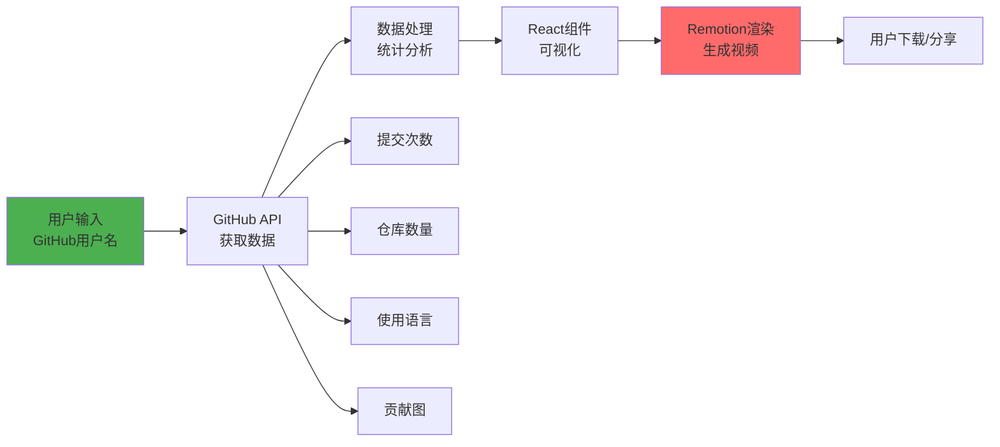

**关键代码模式**：

```typescript
interface GitHubData {
  username: string;
  totalCommits: number;
  topLanguages: Array<{ name: string; percentage: number }>;
  contributionGraph: number[][];
}

export const GitHubUnwrapped: React.FC<{ data: GitHubData }> = ({ data }) => {
  return (
    <AbsoluteFill>
      <Sequence from={0} durationInFrames={60}>
        <IntroScene username={data.username} />
      </Sequence>
      
      <Sequence from={60} durationInFrames={90}>
        <CommitsScene totalCommits={data.totalCommits} />
      </Sequence>
      
      <Sequence from={150} durationInFrames={120}>
        <LanguagesChart languages={data.topLanguages} />
      </Sequence>
      
      <Sequence from={270} durationInFrames={90}>
        <ContributionHeatmap data={data.contributionGraph} />
      </Sequence>
      
      <Sequence from={360} durationInFrames={60}>
        <OutroScene />
      </Sequence>
    </AbsoluteFill>
  );
};
```

**体验地址**: [https://www.githubunwrapped.com](https://www.githubunwrapped.com)

### 案例2：Fireship 教程视频

知名编程频道 Fireship 使用 Remotion 制作了"This video was made with code"视频。

**技术要点**：

1. **代码高亮**: 使用 Prism.js 进行语法高亮
2. **打字机效果**: 逐字符显示代码
3. **动画同步**: 代码、图形、旁白精确同步
4. **品牌一致性**: 统一的视觉风格

```typescript
// 打字机效果实现
export const TypeWriter: React.FC<{ text: string; duration: number }> = ({
  text,
  duration,
}) => {
  const frame = useCurrentFrame();
  const { fps } = useVideoConfig();
  
  const charsToShow = Math.floor(
    (frame / fps) * (text.length / (duration / fps))
  );
  
  return (
    <pre>
      <code>{text.substring(0, charsToShow)}</code>
      <span className="cursor">|</span>
    </pre>
  );
};
```

### 案例3：数据可视化仪表板

为企业创建数据驱动的视频报告。


```typescript
interface DashboardProps {
  companyName: string;
  revenue: number[];
  users: number[];
  growth: number;
}

export const Dashboard: React.FC<DashboardProps> = ({
  companyName,
  revenue,
  users,
  growth,
}) => {
  return (
    <AbsoluteFill style={{ background: 'linear-gradient(135deg, #667eea 0%, #764ba2 100%)' }}>
      <Sequence from={0} durationInFrames={90}>
        <TitleCard title={`${companyName} 季度报告`} />
      </Sequence>
      
      <Sequence from={90} durationInFrames={150}>
        <LineChart
          title="营收趋势"
          data={revenue}
          color="#4CAF50"
        />
      </Sequence>
      
      <Sequence from={240} durationInFrames={150}>
        <AreaChart
          title="用户增长"
          data={users}
          color="#2196F3"
        />
      </Sequence>
      
      <Sequence from={390} durationInFrames={120}>
        <GrowthIndicator
          percentage={growth}
          label="环比增长"
        />
      </Sequence>
    </AbsoluteFill>
  );
};
```


### 案例4：社交媒体自动化

批量生成品牌一致的社交媒体内容。


```typescript
interface SocialPostProps {
  platform: 'instagram' | 'twitter' | 'tiktok';
  content: {
    title: string;
    hashtags: string[];
    imageUrl: string;
  };
}

// 根据平台自动调整尺寸和布局
const platformConfig = {
  instagram: { width: 1080, height: 1080, fps: 30 },
  twitter: { width: 1280, height: 720, fps: 30 },
  tiktok: { width: 1080, height: 1920, fps: 30 },
};

export const SocialPost: React.FC<SocialPostProps> = ({ platform, content }) => {
  const config = platformConfig[platform];
  const frame = useCurrentFrame();
  
  // 统一的动画但适配不同平台
  return (
    <AbsoluteFill
      style={{
        background: `url(${content.imageUrl})`,
        backgroundSize: 'cover',
      }}
    >
      <Sequence from={0} durationInFrames={30}>
        <FadeIn>
          <h1>{content.title}</h1>
        </FadeIn>
      </Sequence>
      
      <Sequence from={30}>
        <HashtagsAnimation hashtags={content.hashtags} />
      </Sequence>
    </AbsoluteFill>
  );
};

// 批量渲染
async function generateBatchVideos() {
  const posts = await fetchPendingPosts();
  
  for (const post of posts) {
    await renderMedia({
      composition: 'SocialPost',
      inputProps: post,
      output: `out/${post.platform}-${post.id}.mp4`,
    });
  }
}
```


## 最佳实践

### 1. 项目组织

```
src/
├── compositions/          # 合成定义
│   ├── MyVideo/
│   │   ├── index.tsx
│   │   ├── scenes/       # 场景组件
│   │   ├── components/   # 可复用组件
│   │   └── assets/       # 场景专属资源
│   └── AnotherVideo/
├── shared/               # 共享资源
│   ├── components/       # 通用组件
│   ├── hooks/            # 自定义Hooks
│   ├── utils/            # 工具函数
│   └── styles/           # 全局样式
├── public/               # 静态资源
│   ├── fonts/
│   ├── images/
│   └── audio/
└── Root.tsx              # 根注册
```

### 2. 性能优化清单

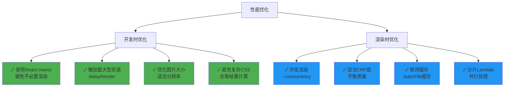

### 3. 代码质量


```typescript
// ✓ 好的做法：组件化和复用
export const Badge: React.FC<{ text: string; color: string }> = ({ text, color }) => {
  return (
    <div
      style={{
        padding: '10px 20px',
        backgroundColor: color,
        borderRadius: 8,
        color: 'white',
        fontWeight: 'bold',
      }}
    >
      {text}
    </div>
  );
};

// ✓ 使用 TypeScript 确保类型安全
interface VideoProps {
  title: string;
  data: ChartData[];
  theme: 'light' | 'dark';
}

export const DataVideo: React.FC<VideoProps> = ({ title, data, theme }) => {
  // 实现
};

// ✓ 提取复杂逻辑到自定义 Hook
function useAnimatedValue(from: number, to: number, duration: number) {
  const frame = useCurrentFrame();
  const { fps } = useVideoConfig();
  
  return interpolate(
    frame,
    [0, duration],
    [from, to],
    { extrapolateRight: 'clamp' }
  );
}

// ✗ 避免：在组件内直接写大量复杂逻辑
export const BadComponent = () => {
  const frame = useCurrentFrame();
  // 100行复杂计算...
  return <div>...</div>;
};
```


### 4. 测试策略

```typescript
// 单元测试组件逻辑
import { render } from '@testing-library/react';
import { Composition } from 'remotion';

describe('MyVideo', () => {
  it('renders correctly', () => {
    const { container } = render(
      <Composition
        id="test"
        component={MyVideo}
        durationInFrames={30}
        fps={30}
        width={1920}
        height={1080}
      />
    );
    expect(container).toMatchSnapshot();
  });
});

// 集成测试渲染流程
import { bundle } from '@remotion/bundler';
import { renderMedia } from '@remotion/renderer';

test('renders video successfully', async () => {
  const bundleLocation = await bundle({
    entryPoint: './src/index.ts',
  });
  
  await renderMedia({
    composition: 'MyVideo',
    serveUrl: bundleLocation,
    codec: 'h264',
    outputLocation: 'out/test.mp4',
  });
  
  // 验证输出文件存在且有效
}, 60000);
```

## 生态系统和扩展

### 官方包生态

```mermaid
graph TB
    A[Remotion核心] --> B[媒体处理]
    A --> C[UI/动画]
    A --> D[集成]
    A --> E[工具]
    
    B --> B1[@remotion/media-parser<br/>元数据提取]
    B --> B2[@remotion/media-utils<br/>媒体工具]
    B --> B3[@remotion/webcodecs<br/>Web编解码]
    
    C --> C1[@remotion/shapes<br/>形状基元]
    C --> C2[@remotion/lottie<br/>Lottie动画]
    C --> C3[@remotion/motion-blur<br/>运动模糊]
    C --> C4[@remotion/transitions<br/>转场效果]
    C --> C5[@remotion/animated-emoji<br/>动画表情]
    
    D --> D1[@remotion/three<br/>Three.js 3D]
    D --> D2[@remotion/tailwind<br/>Tailwind CSS]
    D --> D3[@remotion/noise<br/>噪声生成]
    D --> D4[@remotion/paths<br/>SVG路径]
    D --> D5[@remotion/layout-utils<br/>布局工具]
    
    E --> E1[@remotion/fonts<br/>字体加载]
    E --> E2[@remotion/captions<br/>字幕处理]
    E --> E3[@remotion/lambda<br/>AWS渲染]
    E --> E4[@remotion/cloudrun<br/>GCP渲染]
    E --> E5[@remotion/gif<br/>GIF处理]
```

### 社区资源

- **Remotion Templates**: 可复用的视频模板市场
- **Remotion Hub**: 社区展示平台
- **Discord 社区**: 活跃的开发者社区
- **YouTube 教程**: 官方和社区教程

### 与其他工具集成

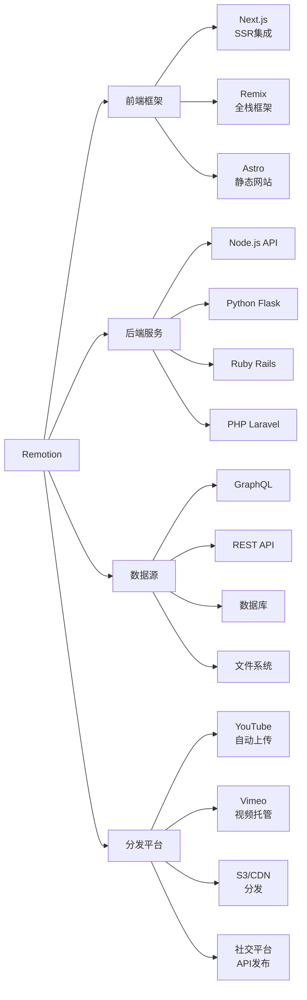

## 许可证和定价

### 许可证模式

Remotion 采用特殊许可证模式：

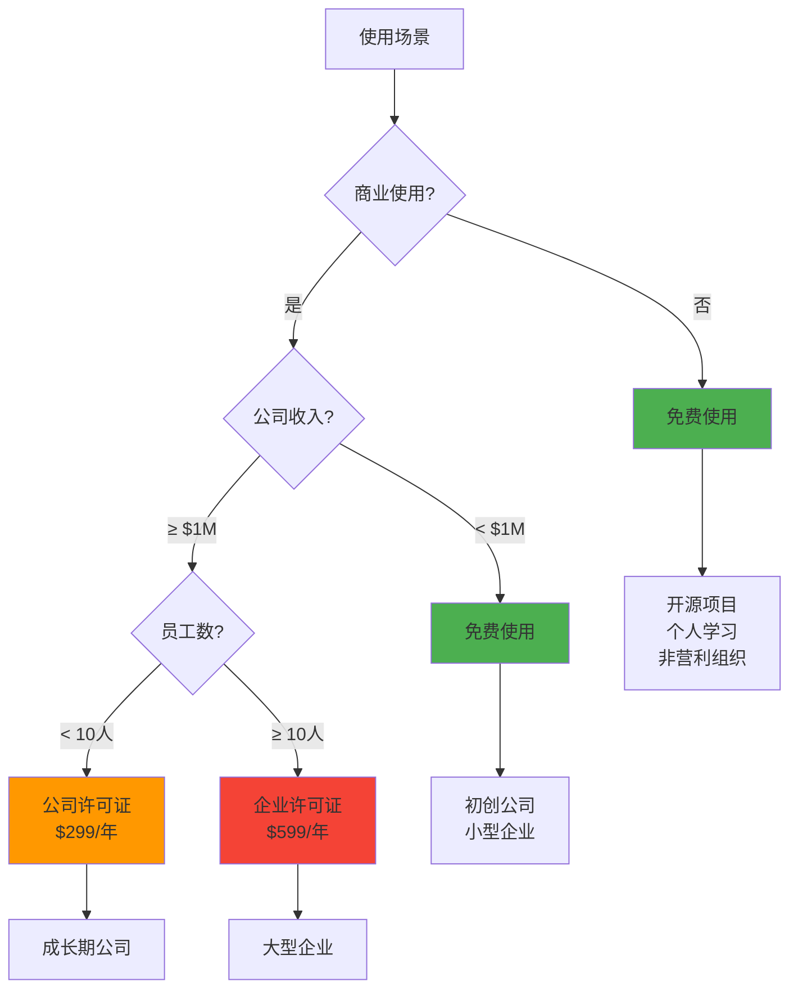

### 定价详情

- **免费层**: 开源、个人、非商业、年收入 < $1M
- **公司许可证**: $299/年（< 10 员工）
- **企业许可证**: $599/年（≥ 10 员工）
- **云渲染成本**: 按 AWS/GCP 实际使用计费

### 成本估算

```typescript
// Lambda 渲染成本示例（美东区）
// 配置：2048MB 内存，120秒渲染时间
const lambdaCost = {
  memory: 2048, // MB
  duration: 120, // 秒
  requests: 1,
  
  // AWS Lambda 定价（2024）
  computeCost: (2048 / 1024) * 120 * 0.0000166667, // ~$0.004
  requestCost: 1 * 0.0000002, // ~$0.0000002
  
  total: 0.004 // 约 $0.004/视频
};

// 批量渲染 1000 个视频
const batchCost = 1000 * 0.004; // ~$4

// 对比：本地渲染（服务器成本）
const localServerCost = {
  ec2Instance: 0.096, // t3.large 每小时
  renderingTime: 2, // 小时（1000个视频）
  total: 0.096 * 2, // ~$0.192
};
```

## 学习资源

### 官方资源

1. **官方文档**: [remotion.dev/docs](https://remotion.dev/docs)
2. **API 参考**: [remotion.dev/api](https://remotion.dev/api)
3. **示例库**: [remotion.dev/showcase](https://remotion.dev/showcase)
4. **YouTube 频道**: 官方教程和案例

### 社区资源

1. **Discord 服务器**: 实时问答和讨论
2. **GitHub Discussions**: 长期问题和讨论
3. **Stack Overflow**: `remotion` 标签

### 学习路径

```mermaid
graph TD
    A[开始学习] --> B[阶段1: 基础]
    B --> C[阶段2: 进阶]
    C --> D[阶段3: 精通]
    
    B --> B1[React基础]
    B --> B2[安装和配置]
    B --> B3[第一个视频]
    B --> B4[基础组件]
    B --> B5[时间轴概念]
    
    C --> C1[动画技巧]
    C --> C2[数据驱动]
    C --> C3[媒体处理]
    C --> C4[性能优化]
    C --> C5[云渲染]
    
    D --> D1[自定义渲染器]
    D --> D2[插件开发]
    D --> D3[架构设计]
    D --> D4[规模化生产]
    D --> D5[成本优化]
    
    style B fill:#4CAF50
    style C fill:#2196F3
    style D fill:#9C27B0
```

### 推荐项目实践

1. **个人名片视频**: 基础动画和布局
2. **数据可视化**: API 集成和图表
3. **产品介绍**: 多场景组合和转场
4. **社交媒体自动化**: 模板化和批量生成
5. **个性化营销**: 用户数据驱动的视频

## 常见问题

### Q1: Remotion 与 After Effects 的区别？

```mermaid
graph LR
    A[After Effects] --> A1[GUI操作]
    A --> A2[手工制作]
    A --> A3[固定模板]
    A --> A4[难以自动化]
    
    B[Remotion] --> B1[代码驱动]
    B --> B2[程序生成]
    B --> B3[动态内容]
    B --> B4[完全自动化]
    
    style A fill:#FF9800
    style B fill:#4CAF50
```

**Remotion 优势**:
- ✓ 批量生成（无需人工干预）
- ✓ 数据驱动（API 集成）
- ✓ 版本控制（Git 友好）
- ✓ 团队协作（代码审查）
- ✓ 测试能力（单元测试）

**After Effects 优势**:
- ✓ 可视化界面（设计师友好）
- ✓ 丰富插件生态
- ✓ 专业特效工具
- ✓ 行业标准格式

### Q2: 性能如何？渲染速度快吗？

**影响因素**:
1. 视频复杂度（DOM 层数、动画数量）
2. 分辨率和帧率
3. 硬件配置（CPU、内存）
4. 并发设置

**优化建议**:
- 使用 `--concurrency` 匹配 CPU 核心数
- Lambda 分片并行渲染（10倍+加速）
- 降低开发时分辨率
- 使用 `React.memo` 避免重复渲染

### Q3: 可以在浏览器中实时预览吗？

可以！使用 `@remotion/player`:


```typescript
import { Player } from '@remotion/player';
import { MyVideo } from './MyVideo';

export const App = () => {
  return (
    <Player
      component={MyVideo}
      durationInFrames={150}
      compositionWidth={1920}
      compositionHeight={1080}
      fps={30}
      controls
      loop
      inputProps={{ name: 'World' }}
    />
  );
};
```


### Q4: 支持哪些视频格式？

**输出格式**:
- MP4 (H.264, H.265)
- WebM (VP8, VP9)
- ProRes (专业后期)
- GIF
- PNG/JPEG 序列
- 音频 (MP3, AAC, WAV)

### Q5: 可以商用吗？

需要购买公司许可证（如果年收入 ≥ $1M）。详见许可证部分。

## 总结

Remotion 代表了视频制作领域的范式转变，将**视频创作从手工艺术转变为工程化流程**。它的核心价值在于：

### 核心优势

```mermaid
mindmap
  root((Remotion<br/>价值主张))
    可编程性
      代码驱动
      算法创意
      逻辑控制
      自动化
    可扩展性
      批量生成
      云端渲染
      分布式处理
      成本效益
    可维护性
      版本控制
      代码审查
      单元测试
      团队协作
    灵活性
      React生态
      Web技术栈
      组件复用
      无限可能
```

### 适用场景

**✓ 理想场景**:
- 数据驱动的视频内容
- 个性化视频生成
- 社交媒体自动化
- 产品演示和教程
- 数据可视化报告
- 批量模板化内容

**✗ 不适合场景**:
- 高度艺术化的特效（用 AE）
- 实拍视频剪辑（用 Premiere）
- 复杂调色和后期（用 DaVinci）

### 未来展望

Remotion 正在推动视频行业向**代码优先、自动化、规模化**方向发展。随着 AI 生成内容、个性化营销、数据可视化的需求增长，程序化视频创作将成为重要趋势。

对于开发者而言，Remotion 打开了一个新的创意空间——**用代码表达创意，用算法驱动艺术**。

---

## 相关链接

- **GitHub**: [https://github.com/remotion-dev/remotion](https://github.com/remotion-dev/remotion)
- **官网**: [https://remotion.dev](https://remotion.dev)
- **文档**: [https://remotion.dev/docs](https://remotion.dev/docs)
- **Discord**: [https://remotion.dev/discord](https://remotion.dev/discord)
- **Showcase**: [https://remotion.dev/showcase](https://remotion.dev/showcase)
- **DeepWiki**: [https://deepwiki.com/remotion-dev/remotion](https://deepwiki.com/remotion-dev/remotion)

## 贡献和社区

欢迎通过以下方式参与 Remotion 生态：

1. **贡献代码**: 提交 PR 到 GitHub 仓库
2. **分享案例**: 提交你的作品到 Showcase
3. **编写教程**: 分享你的使用经验
4. **报告问题**: 在 GitHub Issues 反馈 Bug
5. **参与讨论**: 加入 Discord 社区

---

**Happy Video Coding! 🎬🚀**
