## LeRobot 简介

LeRobot 是 Hugging Face 推出的开源机器人学习库，旨在通过端到端学习让 AI 机器人技术变得更加易用。它提供了模型、数据集和工具，降低了机器人学习的门槛，使每个人都能贡献和受益于共享的数据集和预训练模型。

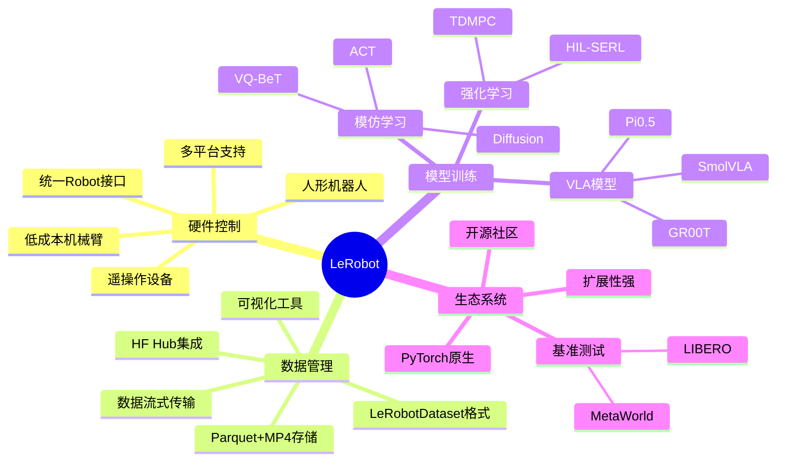
```mermaid
mindmap
  root((LeRobot))
    硬件控制
      统一Robot接口
      多平台支持
      遥操作设备
      低成本机械臂
      人形机器人
    数据管理
      LeRobotDataset格式
      Parquet+MP4存储
      HF Hub集成
      数据流式传输
      可视化工具
    模型训练
      模仿学习
        ACT
        Diffusion
        VQ-BeT
      强化学习
        HIL-SERL
        TDMPC
      VLA模型
        Pi0.5
        GR00T
        SmolVLA
    生态系统
      PyTorch原生
      开源社区
      基准测试
        LIBERO
        MetaWorld
      扩展性强
```

### 核心特性

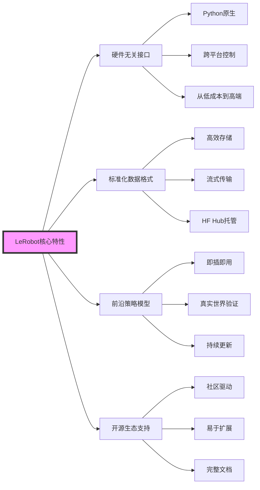
```mermaid
graph LR
    A[LeRobot核心特性] --> B[硬件无关接口]
    A --> C[标准化数据格式]
    A --> D[前沿策略模型]
    A --> E[开源生态支持]
    
    B --> B1[Python原生]
    B --> B2[跨平台控制]
    B --> B3[从低成本到高端]
    
    C --> C1[高效存储]
    C --> C2[流式传输]
    C --> C3[HF Hub托管]
    
    D --> D1[即插即用]
    D --> D2[真实世界验证]
    D --> D3[持续更新]
    
    E --> E1[社区驱动]
    E --> E2[易于扩展]
    E --> E3[完整文档]
    
    style A fill:#f9f,stroke:#333,stroke-width:4px
```

### 为什么选择 LeRobot？

在机器人学习领域，LeRobot 解决了以下核心痛点：

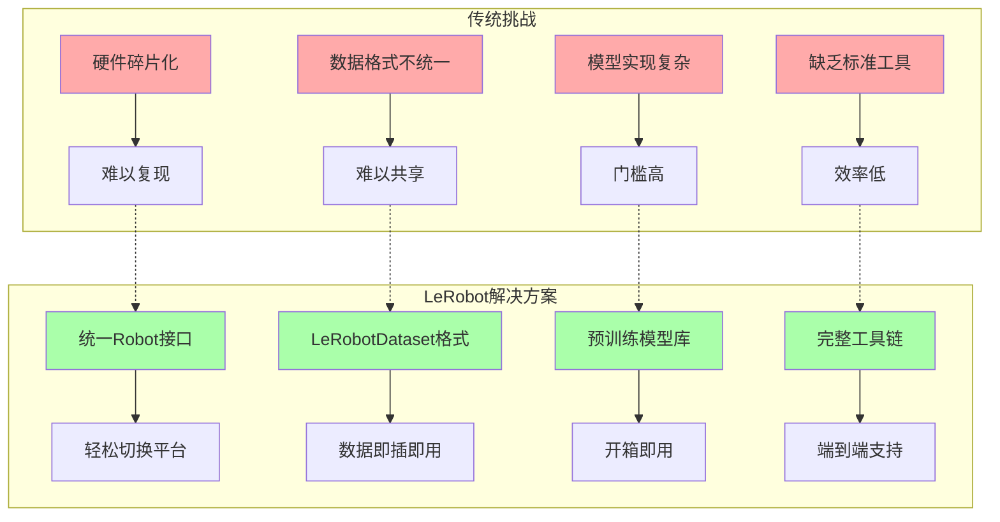
```mermaid
graph TB
    subgraph "传统挑战"
        A1[硬件碎片化] --> B1[难以复现]
        A2[数据格式不统一] --> B2[难以共享]
        A3[模型实现复杂] --> B3[门槛高]
        A4[缺乏标准工具] --> B4[效率低]
    end
    
    subgraph "LeRobot解决方案"
        C1[统一Robot接口] --> D1[轻松切换平台]
        C2[LeRobotDataset格式] --> D2[数据即插即用]
        C3[预训练模型库] --> D3[开箱即用]
        C4[完整工具链] --> D4[端到端支持]
    end
    
    B1 -.-> C1
    B2 -.-> C2
    B3 -.-> C3
    B4 -.-> C4
    
    style A1 fill:#faa
    style A2 fill:#faa
    style A3 fill:#faa
    style A4 fill:#faa
    style C1 fill:#afa
    style C2 fill:#afa
    style C3 fill:#afa
    style C4 fill:#afa
```

## 快速开始

### 安装

LeRobot 可以直接从 PyPI 安装：

```bash
# 基础安装
pip install lerobot

# 验证安装
lerobot-info
```

### 系统要求

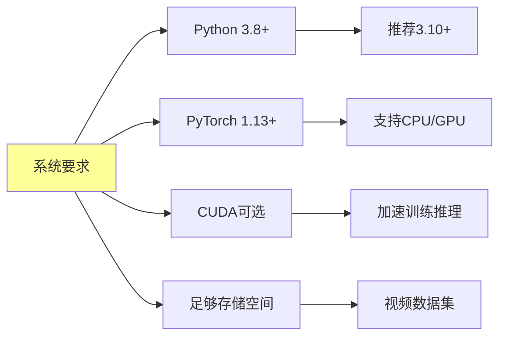
```mermaid
graph LR
    A[系统要求] --> B[Python 3.8+]
    A --> C[PyTorch 1.13+]
    A --> D[CUDA可选]
    A --> E[足够存储空间]
    
    B --> B1[推荐3.10+]
    C --> C1[支持CPU/GPU]
    D --> D1[加速训练推理]
    E --> E1[视频数据集]
    
    style A fill:#ff9
```

### 第一个示例

```python
from lerobot.datasets.lerobot_dataset import LeRobotDataset

# 从 Hugging Face Hub 加载数据集
dataset = LeRobotDataset("lerobot/aloha_mobile_cabinet")

# 访问数据（自动处理视频解码）
episode_index = 0
print(f"动作维度: {dataset[episode_index]['action'].shape}")
print(f"观察键: {dataset[episode_index].keys()}")

# 遍历数据集
for i in range(min(5, len(dataset))):
    sample = dataset[i]
    print(f"样本 {i}: 动作={sample['action'][:3]}")
```

## 机器人控制

### Robot 接口架构

LeRobot 提供了统一的 `Robot` 类接口，将控制逻辑与硬件细节解耦：

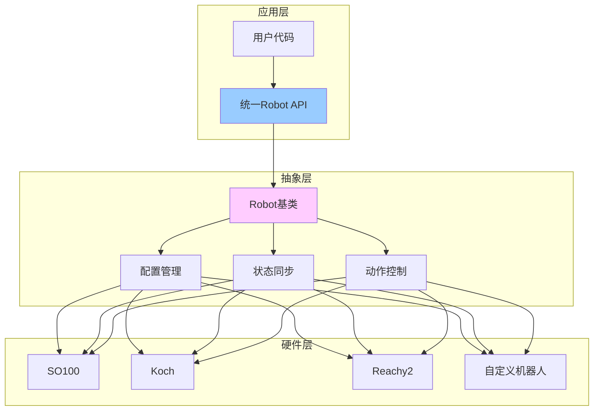
```mermaid
graph TB
    subgraph "应用层"
        A[用户代码] --> B[统一Robot API]
    end
    
    subgraph "抽象层"
        B --> C[Robot基类]
        C --> D[配置管理]
        C --> E[状态同步]
        C --> F[动作控制]
    end
    
    subgraph "硬件层"
        D --> G[SO100]
        D --> H[Koch]
        D --> I[Reachy2]
        D --> J[自定义机器人]
        
        E --> G
        E --> H
        E --> I
        E --> J
        
        F --> G
        F --> H
        F --> I
        F --> J
    end
    
    style B fill:#9cf
    style C fill:#fcf
```

### 基础控制示例

```python
from lerobot.robots.myrobot import MyRobot
from lerobot.common.robot_config import RobotConfig

# 1. 创建机器人配置
config = RobotConfig(
    robot_type="myrobot",
    control_frequency=30,  # 控制频率 30Hz
    cameras={
        "front": {"resolution": (640, 480), "fps": 30},
        "wrist": {"resolution": (320, 240), "fps": 30}
    }
)

# 2. 连接机器人
robot = MyRobot(config=config)
robot.connect()

# 3. 读取观察
observation = robot.get_observation()
print(f"关节位置: {observation['joint_positions']}")
print(f"相机图像: {observation['cameras']['front'].shape}")

# 4. 发送动作
action = {
    'joint_positions': [0.1, 0.2, 0.3, 0.4, 0.5, 0.6],
    'gripper': 1.0  # 打开夹爪
}
robot.send_action(action)

# 5. 断开连接
robot.disconnect()
```

### 遥操作示例

```python
from lerobot.robots.follower import FollowerRobot
from lerobot.robots.leader import LeaderRobot
import time

# 创建主从机器人
leader = LeaderRobot(config=leader_config)
follower = FollowerRobot(config=follower_config)

leader.connect()
follower.connect()

try:
    # 遥操作循环
    for _ in range(1000):
        # 从主控设备读取动作
        leader_obs = leader.get_observation()
        action = leader_obs['joint_positions']
        
        # 发送到从动机器人
        follower.send_action({'joint_positions': action})
        
        time.sleep(1/30)  # 30Hz 控制频率
        
finally:
    leader.disconnect()
    follower.disconnect()
```

### 支持的硬件平台

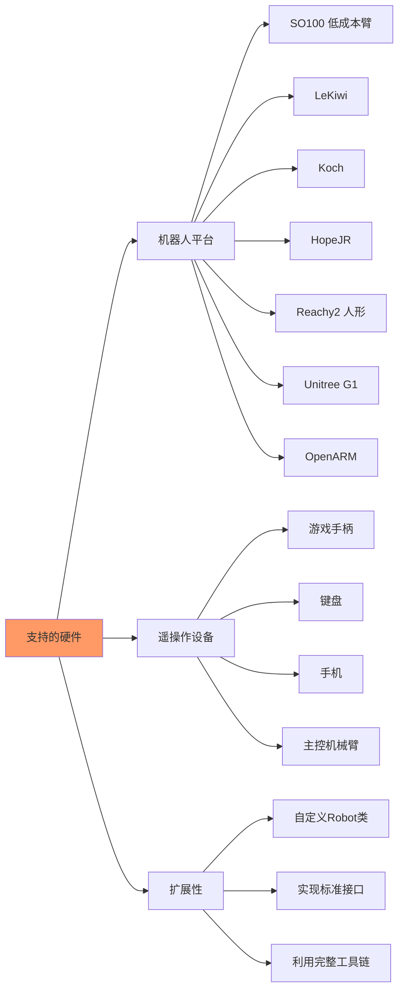
```mermaid
graph LR
    A[支持的硬件] --> B[机器人平台]
    A --> C[遥操作设备]
    A --> D[扩展性]
    
    B --> B1[SO100 低成本臂]
    B --> B2[LeKiwi]
    B --> B3[Koch]
    B --> B4[HopeJR]
    B --> B5[Reachy2 人形]
    B --> B6[Unitree G1]
    B --> B7[OpenARM]
    
    C --> C1[游戏手柄]
    C --> C2[键盘]
    C --> C3[手机]
    C --> C4[主控机械臂]
    
    D --> D1[自定义Robot类]
    D --> D2[实现标准接口]
    D --> D3[利用完整工具链]
    
    style A fill:#f96
```

## LeRobotDataset 数据集

### 数据格式架构

LeRobot 使用标准化的 LeRobotDataset 格式来解决机器人数据碎片化问题：

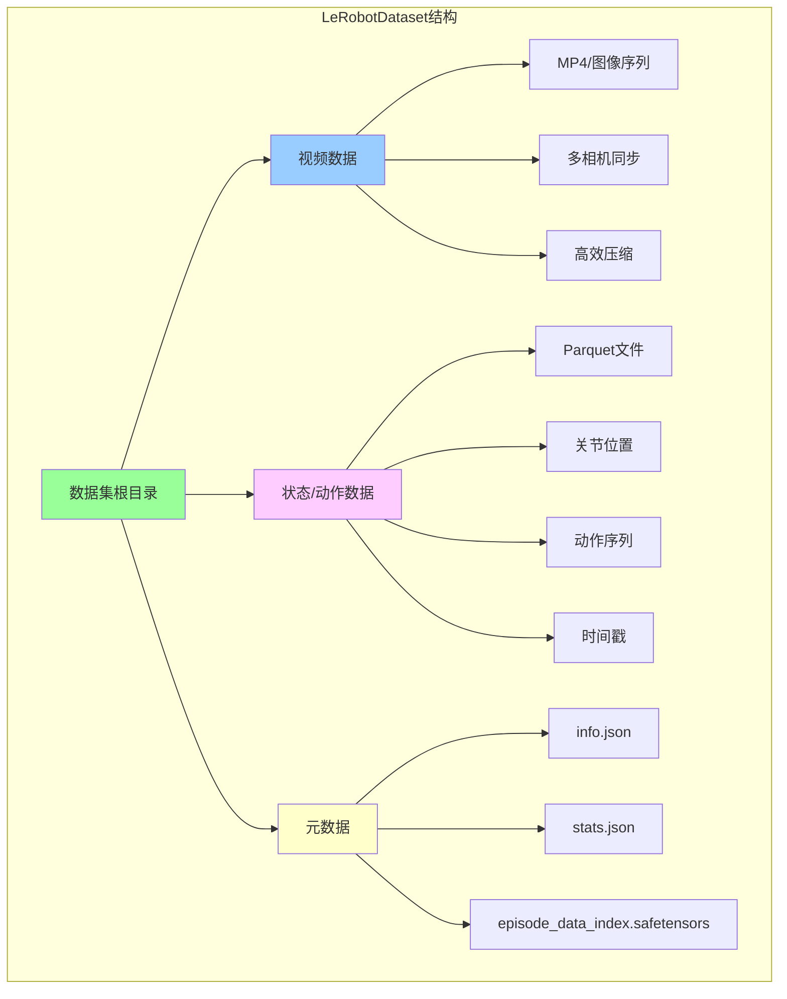
```mermaid
graph TB
    subgraph "LeRobotDataset结构"
        A[数据集根目录] --> B[视频数据]
        A --> C[状态/动作数据]
        A --> D[元数据]
        
        B --> B1[MP4/图像序列]
        B --> B2[多相机同步]
        B --> B3[高效压缩]
        
        C --> C1[Parquet文件]
        C --> C2[关节位置]
        C --> C3[动作序列]
        C --> C4[时间戳]
        
        D --> D1[info.json]
        D --> D2[stats.json]
        D --> D3[episode_data_index.safetensors]
    end
    
    style A fill:#9f9
    style B fill:#9cf
    style C fill:#fcf
    style D fill:#ffc
```

### 加载和使用数据集

```python
from lerobot.datasets.lerobot_dataset import LeRobotDataset
import torch

# 1. 从 Hub 加载数据集
dataset = LeRobotDataset(
    repo_id="lerobot/aloha_mobile_cabinet",
    split="train"
)

# 2. 查看数据集信息
print(f"数据集大小: {len(dataset)}")
print(f"特征列: {dataset.features}")
print(f"回合数: {dataset.num_episodes}")
print(f"帧数: {dataset.num_frames}")

# 3. 访问单个样本
sample = dataset[0]
print(f"可用键: {sample.keys()}")
print(f"动作形状: {sample['action'].shape}")
print(f"状态形状: {sample['observation.state'].shape}")

# 4. 访问图像数据
if 'observation.images.front' in sample:
    image = sample['observation.images.front']
    print(f"图像形状: {image.shape}")  # [H, W, C]

# 5. 按回合访问
episode_0 = dataset.get_episode(0)
print(f"回合0长度: {len(episode_0)}")

# 6. 批量加载
from torch.utils.data import DataLoader

dataloader = DataLoader(
    dataset,
    batch_size=32,
    shuffle=True,
    num_workers=4
)

for batch in dataloader:
    actions = batch['action']
    states = batch['observation.state']
    # 训练模型...
    break
```

### 数据集操作工具

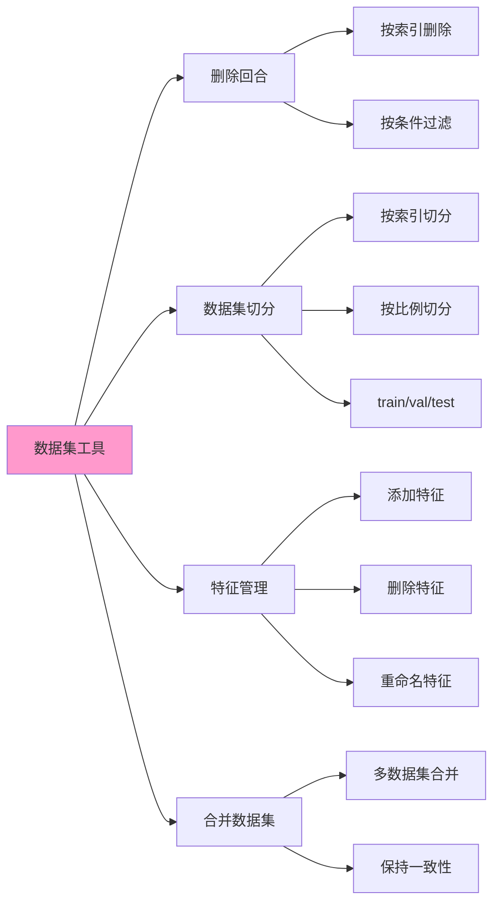
```mermaid
graph LR
    A[数据集工具] --> B[删除回合]
    A --> C[数据集切分]
    A --> D[特征管理]
    A --> E[合并数据集]
    
    B --> B1[按索引删除]
    B --> B2[按条件过滤]
    
    C --> C1[按索引切分]
    C --> C2[按比例切分]
    C --> C3[train/val/test]
    
    D --> D1[添加特征]
    D --> D2[删除特征]
    D --> D3[重命名特征]
    
    E --> E1[多数据集合并]
    E --> E2[保持一致性]
    
    style A fill:#f9c
```

```python
from lerobot.datasets.lerobot_dataset import LeRobotDataset

# 加载数据集
dataset = LeRobotDataset("lerobot/pusht")

# 1. 删除特定回合
dataset.delete_episodes([0, 5, 10])

# 2. 切分数据集
train_dataset, val_dataset = dataset.split([0.8, 0.2])

# 3. 按索引切分
train_dataset = dataset[:8000]
val_dataset = dataset[8000:]

# 4. 添加新特征
dataset.add_feature(
    name="observation.new_sensor",
    dtype="float32",
    shape=(10,)
)

# 5. 删除特征
dataset.remove_feature("observation.unused_camera")

# 6. 合并多个数据集
from lerobot.datasets.utils import merge_datasets

merged = merge_datasets([
    "lerobot/aloha_mobile_cabinet",
    "lerobot/aloha_mobile_chair"
])

# 7. 保存到 Hub
dataset.push_to_hub(
    repo_id="my-username/my-robot-dataset",
    private=False
)
```

### 创建自定义数据集

```python
from lerobot.datasets.lerobot_dataset import LeRobotDataset
from pathlib import Path
import numpy as np

# 1. 创建新数据集
dataset = LeRobotDataset.create(
    repo_id="my-username/custom-robot-data",
    fps=30,
    robot_type="my_robot",
    features={
        "observation.state": {"dtype": "float32", "shape": (7,)},
        "observation.images.front": {"dtype": "video", "shape": (480, 640, 3)},
        "action": {"dtype": "float32", "shape": (7,)},
    }
)

# 2. 添加回合数据
for episode_idx in range(10):
    episode_data = []
    for frame_idx in range(100):
        frame = {
            "observation.state": np.random.randn(7),
            "observation.images.front": np.random.randint(0, 255, (480, 640, 3), dtype=np.uint8),
            "action": np.random.randn(7),
            "timestamp": frame_idx / 30.0,
        }
        episode_data.append(frame)
    
    dataset.add_episode(episode_data)

# 3. 计算统计信息
dataset.consolidate()

# 4. 保存
dataset.save("./my_robot_dataset")
```

### 浏览 Hub 上的数据集

```python
from huggingface_hub import list_datasets

# 搜索 LeRobot 数据集
datasets = list_datasets(
    author="lerobot",
    sort="downloads",
    direction=-1
)

for ds in datasets:
    print(f"📦 {ds.id}")
    print(f"   下载量: {ds.downloads}")
    print(f"   更新时间: {ds.lastModified}")
    print()
```

## 策略模型训练

### 模型架构总览

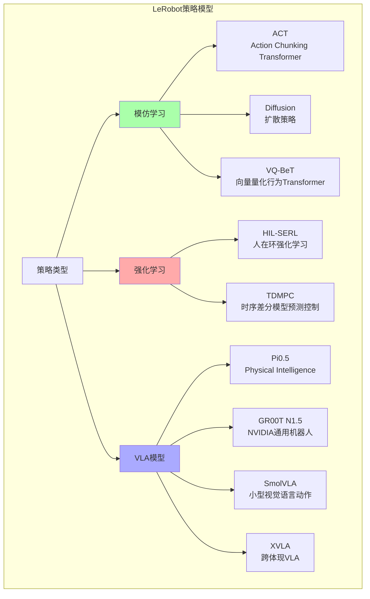
```mermaid
graph TB
    subgraph "LeRobot策略模型"
        A[策略类型] --> B[模仿学习]
        A --> C[强化学习]
        A --> D[VLA模型]
        
        B --> B1[ACT<br/>Action Chunking Transformer]
        B --> B2[Diffusion<br/>扩散策略]
        B --> B3[VQ-BeT<br/>向量量化行为Transformer]
        
        C --> C1[HIL-SERL<br/>人在环强化学习]
        C --> C2[TDMPC<br/>时序差分模型预测控制]
        
        D --> D1[Pi0.5<br/>Physical Intelligence]
        D --> D2[GR00T N1.5<br/>NVIDIA通用机器人]
        D --> D3[SmolVLA<br/>小型视觉语言动作]
        D --> D4[XVLA<br/>跨体现VLA]
    end
    
    style B fill:#afa
    style C fill:#faa
    style D fill:#aaf
```

### ACT 模型训练

ACT (Action Chunking with Transformers) 是一种流行的模仿学习方法：

```python
from lerobot.scripts.train import train

# 使用配置训练 ACT 模型
train(
    policy_name="act",
    dataset_repo_id="lerobot/aloha_mobile_cabinet",
    output_dir="./outputs/act_aloha",
    training_steps=100000,
    batch_size=32,
    learning_rate=1e-4,
    eval_freq=5000,
    save_freq=10000,
    num_workers=4,
    device="cuda",
    seed=42
)
```

或使用命令行：

```bash
lerobot-train \
  --policy=act \
  --dataset.repo_id=lerobot/aloha_mobile_cabinet \
  --training.num_steps=100000 \
  --training.batch_size=32 \
  --training.learning_rate=1e-4 \
  --training.eval_freq=5000 \
  --training.save_freq=10000 \
  --output_dir=./outputs/act_aloha \
  --device=cuda
```

### 自定义训练配置

```python
from lerobot.common.policies.act.configuration_act import ACTConfig
from lerobot.common.policies.act.modeling_act import ACTPolicy
import torch

# 1. 创建自定义配置
config = ACTConfig(
    # 模型架构
    input_shapes={
        "observation.state": [14],
        "observation.images.front": [3, 480, 640],
    },
    output_shapes={
        "action": [14],
    },
    # ACT 特定参数
    chunk_size=100,
    n_obs_steps=1,
    dim_model=512,
    n_heads=8,
    dim_feedforward=3200,
    n_encoder_layers=4,
    n_decoder_layers=7,
    # 训练参数
    lr=1e-5,
    weight_decay=1e-4,
    kl_weight=10,
)

# 2. 创建模型
policy = ACTPolicy(config)

# 3. 准备数据
from lerobot.datasets.lerobot_dataset import LeRobotDataset
from torch.utils.data import DataLoader

dataset = LeRobotDataset("lerobot/aloha_mobile_cabinet")
dataloader = DataLoader(
    dataset,
    batch_size=32,
    shuffle=True,
    num_workers=4
)

# 4. 训练循环
optimizer = torch.optim.AdamW(
    policy.parameters(),
    lr=config.lr,
    weight_decay=config.weight_decay
)

policy.train()
policy.to("cuda")

for epoch in range(100):
    for batch_idx, batch in enumerate(dataloader):
        # 移动到设备
        batch = {k: v.to("cuda") for k, v in batch.items()}
        
        # 前向传播
        output = policy(batch)
        loss = output["loss"]
        
        # 反向传播
        optimizer.zero_grad()
        loss.backward()
        optimizer.step()
        
        if batch_idx % 100 == 0:
            print(f"Epoch {epoch}, Batch {batch_idx}, Loss: {loss.item():.4f}")
    
    # 保存检查点
    if (epoch + 1) % 10 == 0:
        torch.save(
            policy.state_dict(),
            f"./checkpoints/act_epoch_{epoch+1}.pt"
        )
```

### Diffusion 策略训练

```bash
lerobot-train \
  --policy=diffusion \
  --dataset.repo_id=lerobot/pusht \
  --policy.n_action_steps=8 \
  --policy.num_inference_steps=10 \
  --policy.down_dims='[256, 512, 1024]' \
  --training.num_steps=200000 \
  --training.batch_size=64 \
  --output_dir=./outputs/diffusion_pusht
```

### 训练监控

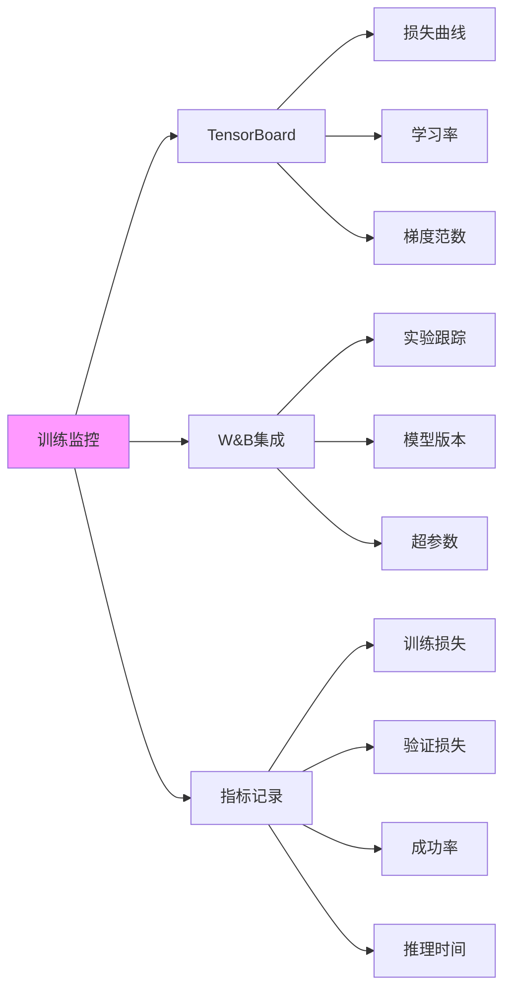
```mermaid
graph LR
    A[训练监控] --> B[TensorBoard]
    A --> C[W&B集成]
    A --> D[指标记录]
    
    B --> B1[损失曲线]
    B --> B2[学习率]
    B --> B3[梯度范数]
    
    C --> C1[实验跟踪]
    C --> C2[模型版本]
    C --> C3[超参数]
    
    D --> D1[训练损失]
    D --> D2[验证损失]
    D --> D3[成功率]
    D --> D4[推理时间]
    
    style A fill:#f9f
```

```python
# 启用 Weights & Biases 跟踪
lerobot-train \
  --policy=act \
  --dataset.repo_id=lerobot/aloha_mobile_cabinet \
  --wandb.enable=true \
  --wandb.project=lerobot-experiments \
  --wandb.entity=my-username \
  --wandb.run_name=act-aloha-v1

# 或在代码中启用
import wandb

wandb.init(
    project="lerobot-experiments",
    name="act-aloha-v1",
    config={
        "policy": "act",
        "dataset": "lerobot/aloha_mobile_cabinet",
        "batch_size": 32,
        "learning_rate": 1e-4,
    }
)
```

### 多 GPU 训练

```bash
# 使用 torchrun 进行分布式训练
torchrun --nproc_per_node=4 \
  lerobot-train \
  --policy=act \
  --dataset.repo_id=lerobot/aloha_mobile_cabinet \
  --training.batch_size=128 \
  --training.num_steps=100000
```

```python
# 在代码中启用 DDP
import torch.distributed as dist
from torch.nn.parallel import DistributedDataParallel as DDP

# 初始化分布式环境
dist.init_process_group(backend="nccl")
local_rank = int(os.environ["LOCAL_RANK"])
torch.cuda.set_device(local_rank)

# 包装模型
policy = ACTPolicy(config)
policy = policy.to(local_rank)
policy = DDP(policy, device_ids=[local_rank])

# 使用分布式采样器
from torch.utils.data.distributed import DistributedSampler

sampler = DistributedSampler(dataset)
dataloader = DataLoader(
    dataset,
    batch_size=32,
    sampler=sampler,
    num_workers=4
)
```

## 模型推理与评估

### 推理流程

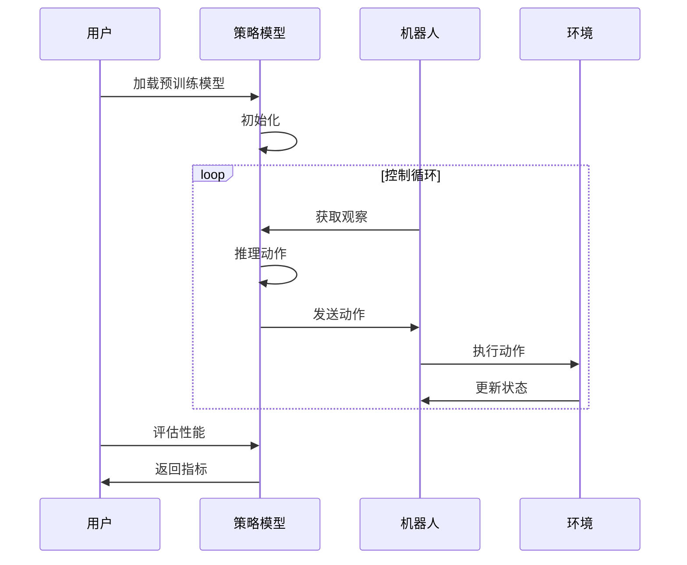
```mermaid
sequenceDiagram
    participant U as 用户
    participant M as 策略模型
    participant R as 机器人
    participant E as 环境
    
    U->>M: 加载预训练模型
    M->>M: 初始化
    
    loop 控制循环
        R->>M: 获取观察
        M->>M: 推理动作
        M->>R: 发送动作
        R->>E: 执行动作
        E->>R: 更新状态
    end
    
    U->>M: 评估性能
    M->>U: 返回指标
```

### 实时推理

```python
from lerobot.common.policies.act.modeling_act import ACTPolicy
from lerobot.robots.myrobot import MyRobot
import torch

# 1. 加载预训练模型
policy = ACTPolicy.from_pretrained("lerobot/act_aloha_mobile_cabinet")
policy.eval()
policy.to("cuda")

# 2. 连接机器人
robot = MyRobot(config=robot_config)
robot.connect()

# 3. 推理循环
try:
    for step in range(1000):
        # 获取观察
        obs = robot.get_observation()
        
        # 准备输入
        observation = {
            "observation.state": torch.tensor(obs["joint_positions"]).unsqueeze(0).to("cuda"),
            "observation.images.front": torch.tensor(obs["cameras"]["front"]).permute(2, 0, 1).unsqueeze(0).to("cuda"),
        }
        
        # 推理
        with torch.no_grad():
            output = policy.select_action(observation)
            action = output["action"][0].cpu().numpy()
        
        # 执行动作
        robot.send_action({"joint_positions": action})
        
        # 控制频率
        time.sleep(1/30)
        
finally:
    robot.disconnect()
```

### 批量评估

```bash
# 在仿真环境中评估策略
lerobot-eval \
  --policy.path=lerobot/act_aloha_mobile_cabinet \
  --env.type=aloha \
  --env.task=mobile_cabinet \
  --eval.n_episodes=50 \
  --eval.max_steps=500 \
  --output_dir=./eval_results
```

### LIBERO 基准测试

```bash
# 在 LIBERO 基准上评估
lerobot-eval \
  --policy.path=lerobot/pi0_libero_finetuned \
  --env.type=libero \
  --env.task=libero_object \
  --eval.n_episodes=10 \
  --eval.max_steps=600
```

### MetaWorld 基准测试

```bash
# 在 MetaWorld 上评估
lerobot-eval \
  --policy.path=lerobot/tdmpc_metaworld \
  --env.type=metaworld \
  --env.task=reach-v2 \
  --eval.n_episodes=20
```

### 自定义评估脚本

```python
from lerobot.common.policies.act.modeling_act import ACTPolicy
from lerobot.envs import make_env
import numpy as np

# 1. 加载模型和环境
policy = ACTPolicy.from_pretrained("lerobot/act_pusht")
policy.eval()
policy.to("cuda")

env = make_env("pusht", render_mode="rgb_array")

# 2. 评估函数
def evaluate_policy(policy, env, n_episodes=10):
    success_count = 0
    episode_rewards = []
    
    for episode in range(n_episodes):
        obs, info = env.reset()
        episode_reward = 0
        done = False
        
        while not done:
            # 准备观察
            observation = {
                "observation.state": torch.tensor(obs["agent_pos"]).unsqueeze(0).to("cuda"),
                "observation.images.top": torch.tensor(obs["pixels"]).permute(2, 0, 1).unsqueeze(0).to("cuda"),
            }
            
            # 推理
            with torch.no_grad():
                action = policy.select_action(observation)["action"][0].cpu().numpy()
            
            # 执行
            obs, reward, terminated, truncated, info = env.step(action)
            done = terminated or truncated
            episode_reward += reward
        
        episode_rewards.append(episode_reward)
        if info.get("is_success", False):
            success_count += 1
        
        print(f"Episode {episode+1}: Reward={episode_reward:.2f}, Success={info.get('is_success', False)}")
    
    return {
        "success_rate": success_count / n_episodes,
        "mean_reward": np.mean(episode_rewards),
        "std_reward": np.std(episode_rewards),
    }

# 3. 运行评估
results = evaluate_policy(policy, env, n_episodes=50)
print(f"\n评估结果:")
print(f"成功率: {results['success_rate']:.2%}")
print(f"平均奖励: {results['mean_reward']:.2f} ± {results['std_reward']:.2f}")
```

### 可视化评估结果

```python
import matplotlib.pyplot as plt
import seaborn as sns

# 可视化成功率
def plot_success_rates(results_dict):
    """
    results_dict: {"模型名称": 成功率}
    """
    plt.figure(figsize=(10, 6))
    models = list(results_dict.keys())
    success_rates = list(results_dict.values())
    
    sns.barplot(x=models, y=success_rates)
    plt.ylabel("成功率")
    plt.title("不同模型在任务上的成功率比较")
    plt.ylim(0, 1)
    plt.xticks(rotation=45)
    plt.tight_layout()
    plt.savefig("success_rates.png", dpi=300)
    plt.show()

# 可视化训练曲线
def plot_training_curves(log_file):
    import pandas as pd
    
    df = pd.read_csv(log_file)
    
    fig, axes = plt.subplots(2, 2, figsize=(15, 10))
    
    # 训练损失
    axes[0, 0].plot(df["step"], df["train_loss"])
    axes[0, 0].set_xlabel("步数")
    axes[0, 0].set_ylabel("训练损失")
    axes[0, 0].set_title("训练损失曲线")
    
    # 验证损失
    axes[0, 1].plot(df["step"], df["val_loss"])
    axes[0, 1].set_xlabel("步数")
    axes[0, 1].set_ylabel("验证损失")
    axes[0, 1].set_title("验证损失曲线")
    
    # 成功率
    axes[1, 0].plot(df["step"], df["success_rate"])
    axes[1, 0].set_xlabel("步数")
    axes[1, 0].set_ylabel("成功率")
    axes[1, 0].set_title("评估成功率")
    
    # 学习率
    axes[1, 1].plot(df["step"], df["learning_rate"])
    axes[1, 1].set_xlabel("步数")
    axes[1, 1].set_ylabel("学习率")
    axes[1, 1].set_title("学习率调度")
    
    plt.tight_layout()
    plt.savefig("training_curves.png", dpi=300)
    plt.show()
```

## 数据收集

### 数据收集流程

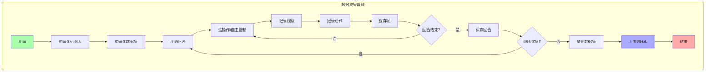
```mermaid
graph TB
    subgraph "数据收集管线"
        A[开始] --> B[初始化机器人]
        B --> C[初始化数据集]
        C --> D[开始回合]
        
        D --> E[遥操作/自主控制]
        E --> F[记录观察]
        F --> G[记录动作]
        G --> H[保存帧]
        
        H --> I{回合结束?}
        I -->|否| E
        I -->|是| J[保存回合]
        
        J --> K{继续收集?}
        K -->|是| D
        K -->|否| L[整合数据集]
        
        L --> M[上传到Hub]
        M --> N[结束]
    end
    
    style A fill:#afa
    style N fill:#faa
    style M fill:#aaf
```

### 遥操作数据收集

```python
from lerobot.robots.leader import LeaderRobot
from lerobot.robots.follower import FollowerRobot
from lerobot.datasets.lerobot_dataset import LeRobotDataset
import numpy as np

# 1. 初始化机器人
leader = LeaderRobot(config=leader_config)
follower = FollowerRobot(config=follower_config)

leader.connect()
follower.connect()

# 2. 创建数据集
dataset = LeRobotDataset.create(
    repo_id="my-username/teleoperation-data",
    fps=30,
    robot_type="my_robot",
    features={
        "observation.state": {"dtype": "float32", "shape": (14,)},
        "observation.images.front": {"dtype": "video", "shape": (480, 640, 3)},
        "observation.images.wrist": {"dtype": "video", "shape": (240, 320, 3)},
        "action": {"dtype": "float32", "shape": (14,)},
    }
)

# 3. 数据收集循环
n_episodes = 50

try:
    for episode_idx in range(n_episodes):
        print(f"\n开始收集回合 {episode_idx + 1}/{n_episodes}")
        print("准备就绪后按 Enter 开始...")
        input()
        
        episode_data = []
        start_time = time.time()
        
        while True:
            # 获取主控动作
            leader_obs = leader.get_observation()
            action = leader_obs["joint_positions"]
            
            # 执行动作并获取观察
            follower.send_action({"joint_positions": action})
            follower_obs = follower.get_observation()
            
            # 记录数据帧
            frame = {
                "observation.state": follower_obs["joint_positions"],
                "observation.images.front": follower_obs["cameras"]["front"],
                "observation.images.wrist": follower_obs["cameras"]["wrist"],
                "action": action,
                "timestamp": time.time() - start_time,
            }
            episode_data.append(frame)
            
            # 检查是否结束（例如按键或达到最大长度）
            if len(episode_data) >= 500 or check_stop_condition():
                break
            
            time.sleep(1/30)
        
        # 添加回合到数据集
        dataset.add_episode(episode_data)
        print(f"回合 {episode_idx + 1} 完成，收集了 {len(episode_data)} 帧")
        
finally:
    leader.disconnect()
    follower.disconnect()

# 4. 整合并保存
dataset.consolidate()
dataset.save("./teleoperation_data")

# 5. 上传到 Hub
dataset.push_to_hub(
    repo_id="my-username/teleoperation-data",
    private=False
)
```

### 使用命令行收集数据

```bash
# 使用内置脚本收集数据
lerobot-record \
  --robot-type=so100 \
  --robot-config=configs/robot/so100.yaml \
  --repo-id=my-username/so100-pick-place \
  --num-episodes=100 \
  --episode-length=500 \
  --fps=30 \
  --control-mode=teleoperation
```

### 从现有格式转换

```python
from lerobot.datasets.convert import convert_dataset

# 从其他格式转换到 LeRobotDataset
convert_dataset(
    input_format="rlds",  # 或 "robomimic", "d4rl" 等
    input_path="./original_dataset",
    output_repo_id="my-username/converted-dataset",
    fps=30,
    robot_type="my_robot",
)
```

## 实际应用场景

### 场景1: 移动操作任务

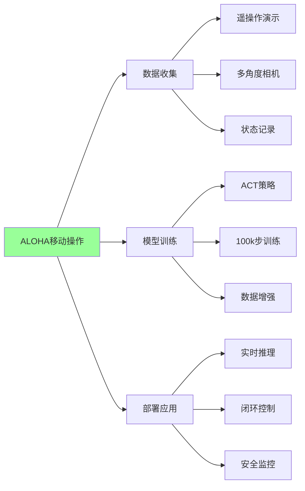
```mermaid
graph LR
    A[ALOHA移动操作] --> B[数据收集]
    A --> C[模型训练]
    A --> D[部署应用]
    
    B --> B1[遥操作演示]
    B --> B2[多角度相机]
    B --> B3[状态记录]
    
    C --> C1[ACT策略]
    C --> C2[100k步训练]
    C --> C3[数据增强]
    
    D --> D1[实时推理]
    D --> D2[闭环控制]
    D --> D3[安全监控]
    
    style A fill:#9f9
```

**示例代码：**

```python
# 1. 收集数据
lerobot-record \
  --robot-type=aloha \
  --repo-id=my-username/aloha-mobile-cabinet \
  --num-episodes=50

# 2. 训练模型
lerobot-train \
  --policy=act \
  --dataset.repo_id=my-username/aloha-mobile-cabinet \
  --training.num_steps=100000 \
  --output_dir=./models/aloha_cabinet

# 3. 评估
lerobot-eval \
  --policy.path=./models/aloha_cabinet \
  --env.type=aloha \
  --env.task=mobile_cabinet \
  --eval.n_episodes=10

# 4. 部署
lerobot-deploy \
  --policy.path=./models/aloha_cabinet \
  --robot-type=aloha \
  --control-frequency=30
```

### 场景2: 低成本机械臂学习

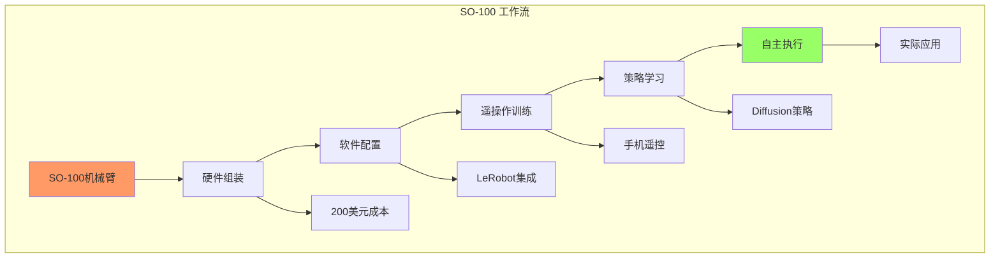
```mermaid
graph TB
    subgraph "SO-100 工作流"
        A[SO-100机械臂] --> B[硬件组装]
        B --> C[软件配置]
        C --> D[遥操作训练]
        D --> E[策略学习]
        E --> F[自主执行]
        
        B --> B1[200美元成本]
        C --> C1[LeRobot集成]
        D --> D1[手机遥控]
        E --> E1[Diffusion策略]
        F --> F1[实际应用]
    end
    
    style A fill:#f96
    style F fill:#9f6
```

**完整示例：**

```python
from lerobot.robots.so100 import SO100Robot
from lerobot.common.policies.diffusion import DiffusionPolicy

# 1. 连接 SO-100
robot = SO100Robot(port="/dev/ttyUSB0")
robot.connect()

# 2. 校准
robot.calibrate()

# 3. 收集演示数据
dataset = collect_demonstrations(
    robot=robot,
    control_device="phone",  # 使用手机遥控
    num_episodes=30,
    task="pick_and_place"
)

# 4. 训练策略
policy = train_policy(
    policy_type="diffusion",
    dataset=dataset,
    training_steps=50000
)

# 5. 部署
deploy_policy(
    policy=policy,
    robot=robot,
    safety_checks=True
)
```

### 场景3: 人形机器人控制

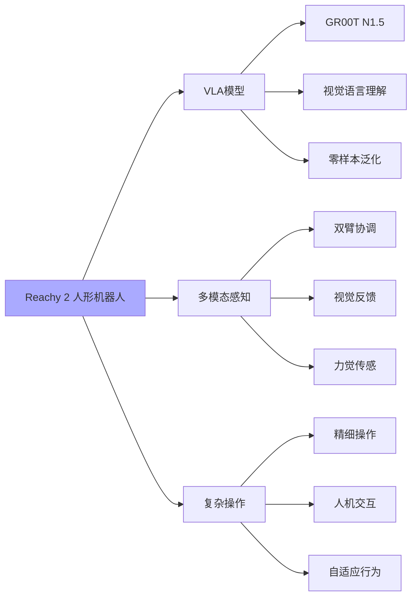
```mermaid
graph LR
    A[Reachy 2 人形机器人] --> B[VLA模型]
    A --> C[多模态感知]
    A --> D[复杂操作]
    
    B --> B1[GR00T N1.5]
    B --> B2[视觉语言理解]
    B --> B3[零样本泛化]
    
    C --> C1[双臂协调]
    C --> C2[视觉反馈]
    C --> C3[力觉传感]
    
    D --> D1[精细操作]
    D --> D2[人机交互]
    D --> D3[自适应行为]
    
    style A fill:#aaf
```

**使用 VLA 模型：**

```python
from lerobot.common.policies.groot import GR00TPolicy
from lerobot.robots.reachy2 import Reachy2Robot

# 1. 加载预训练 VLA 模型
policy = GR00TPolicy.from_pretrained("lerobot/groot_n1.5")
policy.eval()
policy.to("cuda")

# 2. 连接 Reachy 2
robot = Reachy2Robot()
robot.connect()

# 3. 语言条件控制
task_instruction = "请拿起桌子上的红色方块，放到蓝色盒子里"

while True:
    # 获取观察（包括视觉）
    obs = robot.get_observation()
    
    # VLA 推理
    with torch.no_grad():
        action = policy.predict(
            images=obs["cameras"],
            states=obs["joint_positions"],
            instruction=task_instruction
        )
    
    # 执行动作
    robot.send_action(action)
    
    # 检查任务完成
    if robot.check_task_completion():
        break
```

### 场景4: 仿真到真实迁移

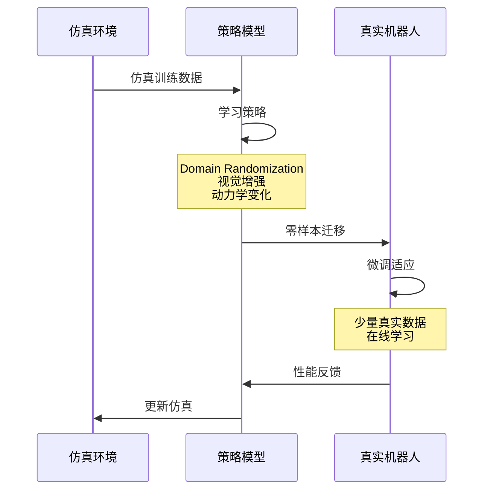
```mermaid
sequenceDiagram
    participant S as 仿真环境
    participant P as 策略模型
    participant R as 真实机器人
    
    S->>P: 仿真训练数据
    P->>P: 学习策略
    
    Note over P: Domain Randomization<br/>视觉增强<br/>动力学变化
    
    P->>R: 零样本迁移
    R->>R: 微调适应
    
    Note over R: 少量真实数据<br/>在线学习
    
    R->>P: 性能反馈
    P->>S: 更新仿真
```

**Sim-to-Real 代码：**

```python
# 1. 在仿真中训练
lerobot-train \
  --policy=tdmpc \
  --env.type=metaworld \
  --env.task=reach-v2 \
  --training.num_steps=200000 \
  --training.domain_randomization=true \
  --output_dir=./models/sim_reach

# 2. 在真实机器人上微调
lerobot-finetune \
  --policy.path=./models/sim_reach \
  --robot-type=so100 \
  --num-episodes=10 \
  --online-learning=true \
  --output_dir=./models/real_reach

# 3. 评估迁移效果
lerobot-eval \
  --policy.path=./models/real_reach \
  --robot-type=so100 \
  --eval.n_episodes=20
```

## 高级特性

### 自定义策略实现

```python
from lerobot.common.policies.policy_protocol import PolicyProtocol
import torch
import torch.nn as nn

class MyCustomPolicy(nn.Module, PolicyProtocol):
    """自定义策略示例"""
    
    def __init__(self, config):
        super().__init__()
        self.config = config
        
        # 定义网络层
        self.encoder = nn.Sequential(
            nn.Linear(config.state_dim, 256),
            nn.ReLU(),
            nn.Linear(256, 512),
            nn.ReLU(),
        )
        
        self.actor = nn.Linear(512, config.action_dim)
    
    def forward(self, batch):
        """训练前向传播"""
        states = batch["observation.state"]
        actions = batch["action"]
        
        # 编码
        features = self.encoder(states)
        
        # 预测动作
        predicted_actions = self.actor(features)
        
        # 计算损失
        loss = nn.functional.mse_loss(predicted_actions, actions)
        
        return {"loss": loss, "predicted_actions": predicted_actions}
    
    def select_action(self, observation):
        """推理时选择动作"""
        with torch.no_grad():
            states = observation["observation.state"]
            features = self.encoder(states)
            action = self.actor(features)
        
        return {"action": action}
    
    @classmethod
    def from_pretrained(cls, path):
        """从预训练模型加载"""
        # 实现加载逻辑
        pass
    
    def save_pretrained(self, path):
        """保存模型"""
        torch.save(self.state_dict(), f"{path}/policy.pt")
```

### 多模态融合

```python
import torch
import torch.nn as nn
from torchvision.models import resnet18

class MultiModalPolicy(nn.Module):
    """多模态策略：融合视觉、状态和触觉"""
    
    def __init__(self, config):
        super().__init__()
        
        # 视觉编码器
        self.vision_encoder = resnet18(pretrained=True)
        self.vision_encoder.fc = nn.Identity()
        
        # 状态编码器
        self.state_encoder = nn.Sequential(
            nn.Linear(config.state_dim, 128),
            nn.ReLU(),
            nn.Linear(128, 256),
        )
        
        # 触觉编码器
        self.tactile_encoder = nn.Sequential(
            nn.Linear(config.tactile_dim, 64),
            nn.ReLU(),
            nn.Linear(64, 128),
        )
        
        # 融合层
        self.fusion = nn.Sequential(
            nn.Linear(512 + 256 + 128, 512),
            nn.ReLU(),
            nn.Linear(512, config.action_dim),
        )
    
    def forward(self, batch):
        # 处理视觉输入
        images = batch["observation.images.front"]
        vision_features = self.vision_encoder(images)
        
        # 处理状态输入
        states = batch["observation.state"]
        state_features = self.state_encoder(states)
        
        # 处理触觉输入
        tactile = batch["observation.tactile"]
        tactile_features = self.tactile_encoder(tactile)
        
        # 融合所有模态
        combined = torch.cat([vision_features, state_features, tactile_features], dim=-1)
        action = self.fusion(combined)
        
        # 计算损失
        target_action = batch["action"]
        loss = nn.functional.mse_loss(action, target_action)
        
        return {"loss": loss, "predicted_actions": action}
```

### 在线学习与适应

```python
from lerobot.common.online_learning import OnlineLearner

class AdaptivePolicy:
    """支持在线学习的自适应策略"""
    
    def __init__(self, base_policy, learning_rate=1e-4):
        self.policy = base_policy
        self.optimizer = torch.optim.Adam(
            self.policy.parameters(),
            lr=learning_rate
        )
        self.replay_buffer = []
        
    def collect_and_adapt(self, robot, num_steps=100):
        """收集数据并在线适应"""
        
        for step in range(num_steps):
            # 执行动作
            obs = robot.get_observation()
            action = self.policy.select_action(obs)
            robot.send_action(action)
            
            # 获取反馈
            next_obs = robot.get_observation()
            reward = compute_reward(obs, action, next_obs)
            
            # 存储经验
            self.replay_buffer.append({
                "observation": obs,
                "action": action,
                "reward": reward,
                "next_observation": next_obs,
            })
            
            # 在线更新
            if len(self.replay_buffer) >= 32:
                self.update_policy()
    
    def update_policy(self):
        """使用最近的经验更新策略"""
        batch = self.sample_batch()
        
        output = self.policy(batch)
        loss = output["loss"]
        
        self.optimizer.zero_grad()
        loss.backward()
        self.optimizer.step()
        
        # 清理旧数据
        if len(self.replay_buffer) > 1000:
            self.replay_buffer = self.replay_buffer[-1000:]
```

### 模型压缩与优化

```python
import torch
from torch.quantization import quantize_dynamic

# 1. 动态量化
policy = ACTPolicy.from_pretrained("lerobot/act_aloha_mobile_cabinet")
quantized_policy = quantize_dynamic(
    policy,
    {torch.nn.Linear},
    dtype=torch.qint8
)

# 2. 导出 ONNX
dummy_input = {
    "observation.state": torch.randn(1, 14),
    "observation.images.front": torch.randn(1, 3, 480, 640),
}

torch.onnx.export(
    policy,
    dummy_input,
    "policy.onnx",
    input_names=["state", "image"],
    output_names=["action"],
    dynamic_axes={
        "state": {0: "batch_size"},
        "image": {0: "batch_size"},
        "action": {0: "batch_size"},
    }
)

# 3. TorchScript
scripted_policy = torch.jit.script(policy)
scripted_policy.save("policy_scripted.pt")

# 4. 使用 TensorRT 优化（需要安装 torch-tensorrt）
import torch_tensorrt

trt_policy = torch_tensorrt.compile(
    policy,
    inputs=[
        torch_tensorrt.Input(shape=[1, 14]),
        torch_tensorrt.Input(shape=[1, 3, 480, 640]),
    ],
    enabled_precisions={torch.float16},
)
```

## 最佳实践

### 数据收集建议

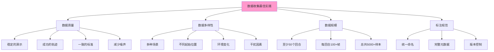
```mermaid
graph TB
    A[数据收集最佳实践] --> B[数据质量]
    A --> C[数据多样性]
    A --> D[数据规模]
    A --> E[标注规范]
    
    B --> B1[稳定的演示]
    B --> B2[成功的轨迹]
    B --> B3[一致的标准]
    B --> B4[减少噪声]
    
    C --> C1[多种场景]
    C --> C2[不同起始位置]
    C --> C3[环境变化]
    C --> C4[干扰因素]
    
    D --> D1[至少50个回合]
    D --> D2[每回合100+帧]
    D --> D3[总共5000+样本]
    
    E --> E1[统一命名]
    E --> E2[完整元数据]
    E --> E3[版本控制]
    
    style A fill:#f9c
```

### 训练调优技巧

**1. 超参数调整：**

```python
# 推荐的 ACT 超参数
act_config = {
    "chunk_size": 100,          # 动作序列长度
    "n_obs_steps": 1,           # 观察历史长度
    "dim_model": 512,           # 模型维度
    "n_heads": 8,               # 注意力头数
    "n_encoder_layers": 4,      # 编码器层数
    "n_decoder_layers": 7,      # 解码器层数
    "lr": 1e-5,                 # 学习率
    "weight_decay": 1e-4,       # 权重衰减
    "kl_weight": 10,            # KL 散度权重
    "batch_size": 32,           # 批次大小
}

# 推荐的 Diffusion 超参数
diffusion_config = {
    "n_action_steps": 8,        # 预测步数
    "num_inference_steps": 10,  # 推理扩散步数
    "down_dims": [256, 512, 1024],  # 下采样维度
    "lr": 1e-4,
    "batch_size": 64,
}
```

**2. 数据增强：**

```python
from lerobot.common.datasets.transforms import (
    RandomCrop,
    ColorJitter,
    AddGaussianNoise,
)

# 视觉增强
transforms = [
    RandomCrop(scale=(0.8, 1.0)),
    ColorJitter(brightness=0.2, contrast=0.2, saturation=0.2),
]

# 状态增强
state_transforms = [
    AddGaussianNoise(std=0.01),
]
```

**3. 学习率调度：**

```python
from torch.optim.lr_scheduler import CosineAnnealingLR, OneCycleLR

# Cosine 退火
scheduler = CosineAnnealingLR(
    optimizer,
    T_max=100000,
    eta_min=1e-6
)

# One Cycle 策略
scheduler = OneCycleLR(
    optimizer,
    max_lr=1e-4,
    total_steps=100000,
    pct_start=0.1,
)
```

### 部署优化

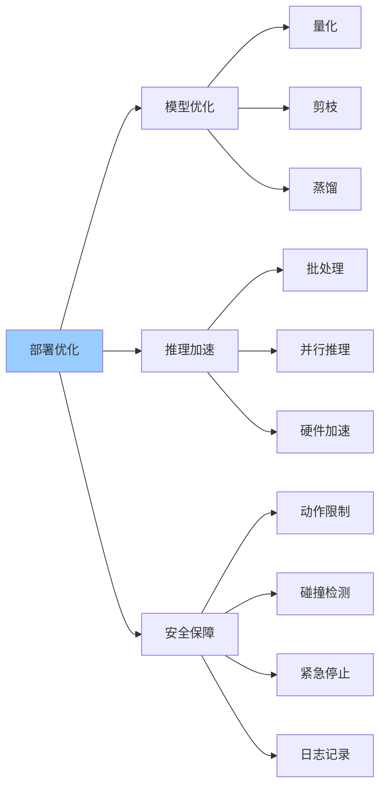
```mermaid
graph LR
    A[部署优化] --> B[模型优化]
    A --> C[推理加速]
    A --> D[安全保障]
    
    B --> B1[量化]
    B --> B2[剪枝]
    B --> B3[蒸馏]
    
    C --> C1[批处理]
    C --> C2[并行推理]
    C --> C3[硬件加速]
    
    D --> D1[动作限制]
    D --> D2[碰撞检测]
    D --> D3[紧急停止]
    D --> D4[日志记录]
    
    style A fill:#9cf
```

**安全部署示例：**

```python
class SafeRobotController:
    """带安全检查的机器人控制器"""
    
    def __init__(self, robot, policy, safety_config):
        self.robot = robot
        self.policy = policy
        self.config = safety_config
        
        # 安全限制
        self.joint_limits = safety_config["joint_limits"]
        self.velocity_limits = safety_config["velocity_limits"]
        self.workspace_bounds = safety_config["workspace_bounds"]
        
        # 监控
        self.action_history = []
        self.emergency_stop = False
    
    def execute_action(self, observation):
        """安全地执行动作"""
        
        # 1. 推理动作
        with torch.no_grad():
            action = self.policy.select_action(observation)["action"]
        
        # 2. 安全检查
        if not self.is_action_safe(action):
            print("⚠️ 不安全的动作被阻止")
            return self.get_safe_action()
        
        # 3. 执行
        self.robot.send_action({"joint_positions": action})
        self.action_history.append(action)
        
        return action
    
    def is_action_safe(self, action):
        """检查动作是否安全"""
        
        # 检查关节限制
        for i, (pos, (min_pos, max_pos)) in enumerate(zip(action, self.joint_limits)):
            if pos < min_pos or pos > max_pos:
                print(f"关节 {i} 超出限制: {pos} not in [{min_pos}, {max_pos}]")
                return False
        
        # 检查速度限制
        if len(self.action_history) > 0:
            velocity = action - self.action_history[-1]
            if torch.abs(velocity).max() > self.velocity_limits:
                print(f"速度过大: {velocity.max()}")
                return False
        
        # 检查工作空间
        ee_pos = self.robot.forward_kinematics(action)
        if not self.is_in_workspace(ee_pos):
            print(f"超出工作空间: {ee_pos}")
            return False
        
        return True
    
    def get_safe_action(self):
        """获取安全的后备动作"""
        current_obs = self.robot.get_observation()
        return current_obs["joint_positions"]  # 保持当前位置
    
    def is_in_workspace(self, position):
        """检查位置是否在工作空间内"""
        x, y, z = position
        x_min, x_max = self.workspace_bounds["x"]
        y_min, y_max = self.workspace_bounds["y"]
        z_min, z_max = self.workspace_bounds["z"]
        
        return (x_min <= x <= x_max and
                y_min <= y <= y_max and
                z_min <= z <= z_max)
```

## 社区与资源

### 官方资源

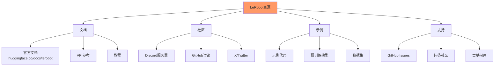
```mermaid
graph TB
    A[LeRobot资源] --> B[文档]
    A --> C[社区]
    A --> D[示例]
    A --> E[支持]
    
    B --> B1[官方文档<br/>huggingface.co/docs/lerobot]
    B --> B2[API参考]
    B --> B3[教程]
    
    C --> C1[Discord服务器]
    C --> C2[GitHub讨论]
    C --> C3[X/Twitter]
    
    D --> D1[示例代码]
    D --> D2[预训练模型]
    D --> D3[数据集]
    
    E --> E1[GitHub Issues]
    E --> E2[问答社区]
    E --> E3[贡献指南]
    
    style A fill:#f96
```

### 学习路径

**初学者：**
1. 完成快速开始教程
2. 尝试预训练模型推理
3. 在仿真环境中训练简单策略
4. 学习数据集格式

**中级用户：**
1. 实现自定义 Robot 类
2. 收集和管理自己的数据集
3. 训练多种策略模型
4. 在真实机器人上部署

**高级用户：**
1. 实现自定义策略算法
2. 贡献新的硬件支持
3. 优化训练和推理性能
4. 参与社区开发

### 贡献指南

LeRobot 欢迎各种形式的贡献：

**代码贡献：**
```bash
# 1. Fork 仓库
git clone https://github.com/your-username/lerobot.git
cd lerobot

# 2. 创建分支
git checkout -b feature/my-new-feature

# 3. 安装开发依赖
pip install -e ".[dev]"
pre-commit install

# 4. 进行更改并测试
pytest tests/

# 5. 提交 Pull Request
git push origin feature/my-new-feature
```

**其他贡献方式：**
- 报告 Bug
- 改进文档
- 分享数据集
- 提供使用案例
- 回答社区问题

## 故障排查

### 常见问题

**1. 安装问题：**

```bash
# CUDA 版本不匹配
pip install torch torchvision --index-url https://download.pytorch.org/whl/cu118

# 依赖冲突
pip install lerobot --no-deps
pip install -r requirements.txt
```

**2. 数据加载慢：**

```python
# 增加 workers
dataloader = DataLoader(
    dataset,
    batch_size=32,
    num_workers=8,  # 增加工作进程
    prefetch_factor=2,
    persistent_workers=True
)
```

**3. GPU 内存不足：**

```python
# 减小批次大小
--training.batch_size=16

# 使用梯度累积
--training.gradient_accumulation_steps=2

# 启用混合精度训练
--training.use_amp=true
```

**4. 机器人连接失败：**

```python
# 检查端口
import serial.tools.list_ports
ports = serial.tools.list_ports.comports()
for port in ports:
    print(f"{port.device}: {port.description}")

# 设置权限（Linux）
sudo usermod -a -G dialout $USER
sudo chmod 666 /dev/ttyUSB0
```

### 调试技巧

```python
# 1. 启用详细日志
import logging
logging.basicConfig(level=logging.DEBUG)

# 2. 可视化数据
from lerobot.common.visualization import visualize_episode

dataset = LeRobotDataset("lerobot/pusht")
visualize_episode(dataset, episode_idx=0, output_path="episode_0.mp4")

# 3. 检查模型输出
policy.eval()
with torch.no_grad():
    output = policy(sample_batch)
    print(f"输出形状: {output['action'].shape}")
    print(f"动作范围: [{output['action'].min()}, {output['action'].max()}]")

# 4. 分析训练曲线
import matplotlib.pyplot as plt
import pandas as pd

logs = pd.read_csv("training_logs.csv")
plt.plot(logs["step"], logs["loss"])
plt.xlabel("步数")
plt.ylabel("损失")
plt.savefig("training_curve.png")
```

## 总结

LeRobot 是一个强大而易用的机器人学习框架，它通过以下核心优势降低了机器人 AI 的门槛：

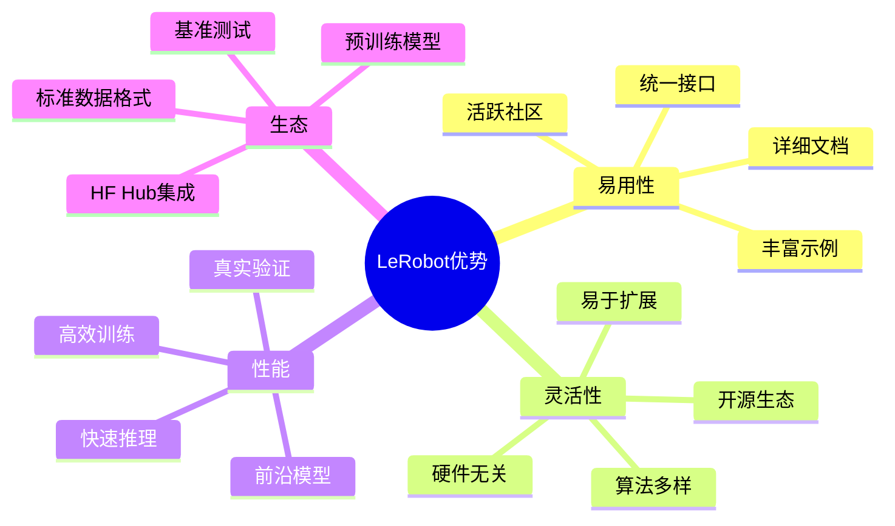
```mermaid
mindmap
  root((LeRobot优势))
    易用性
      统一接口
      详细文档
      丰富示例
      活跃社区
    灵活性
      硬件无关
      算法多样
      易于扩展
      开源生态
    性能
      前沿模型
      高效训练
      快速推理
      真实验证
    生态
      HF Hub集成
      标准数据格式
      预训练模型
      基准测试
```

无论您是机器人学习的初学者，还是希望快速原型化新想法的研究者，LeRobot 都能为您提供完整的工具链，从数据收集、模型训练到实际部署。

**开始您的机器人学习之旅：**

```bash
# 安装 LeRobot
pip install lerobot

# 探索数据集
lerobot-info

# 训练您的第一个模型
lerobot-train --policy=act --dataset.repo_id=lerobot/pusht

# 加入社区
# Discord: discord.gg/lerobot
# GitHub: github.com/huggingface/lerobot
```

## 参考资源

- **官方文档**: [https://huggingface.co/docs/lerobot](https://huggingface.co/docs/lerobot)
- **GitHub 仓库**: [https://github.com/huggingface/lerobot](https://github.com/huggingface/lerobot)
- **DeepWiki**: [https://deepwiki.com/huggingface/lerobot](https://deepwiki.com/huggingface/lerobot)
- **Hugging Face Hub**: [https://huggingface.co/lerobot](https://huggingface.co/lerobot)
- **论文引用**:

```bibtex
@misc{cadene2024lerobot,
    author = {Cadene, Remi and Alibert, Simon and Soare, Alexander and Gallouedec, Quentin and Zouitine, Adil and Palma, Steven and Kooijmans, Pepijn and Aractingi, Michel and Shukor, Mustafa and Aubakirova, Dana and Russi, Martino and Capuano, Francesco and Pascal, Caroline and Choghari, Jade and Moss, Jess and Wolf, Thomas},
    title = {LeRobot: State-of-the-art Machine Learning for Real-World Robotics in Pytorch},
    howpublished = "\url{https://github.com/huggingface/lerobot}",
    year = {2024}
}
```

---

*本文档由 LeRobot 社区维护，最后更新于 2026-02-08*


