## Godot Engine 简介

Godot Engine 是一个功能完备的跨平台游戏引擎，用于创建2D和3D游戏。它提供了一套全面的通用工具，让开发者能够专注于游戏制作而无需重新发明轮子。游戏可以一键导出到多个平台，包括主流桌面平台（Linux、macOS、Windows）、移动平台（Android、iOS）以及Web平台和游戏主机。

```mermaid
mindmap
  root((Godot Engine))
    引擎特性
      2D引擎
        专用2D节点
        瓦片地图编辑器
        物理引擎
        动画系统
      3D引擎
        现代渲染器
        PBR材质
        GI照明
        后处理效果
      脚本系统
        GDScript
        C#支持
        可视化脚本
        C++扩展
      场景系统
        节点树结构
        继承机制
        信号系统
        场景实例化
    开发工具
      集成编辑器
        所见即所得
        实时预览
        调试工具
      资源管理
        智能导入
        自动优化
        版本控制友好
      UI系统
        灵活布局
        主题系统
        多分辨率适配
      动画工具
        关键帧动画
        骨骼动画
        动画树
    跨平台支持
      桌面平台
        Windows
        macOS
        Linux
      移动平台
        Android
        iOS
      Web平台
        HTML5导出
      游戏主机
        Nintendo Switch
        PlayStation
        Xbox
    社区生态
      完全开源
        MIT许可证
        无版权费
        社区驱动
      丰富资源
        官方文档
        视频教程
        示例项目
        资产库
```

### 核心优势

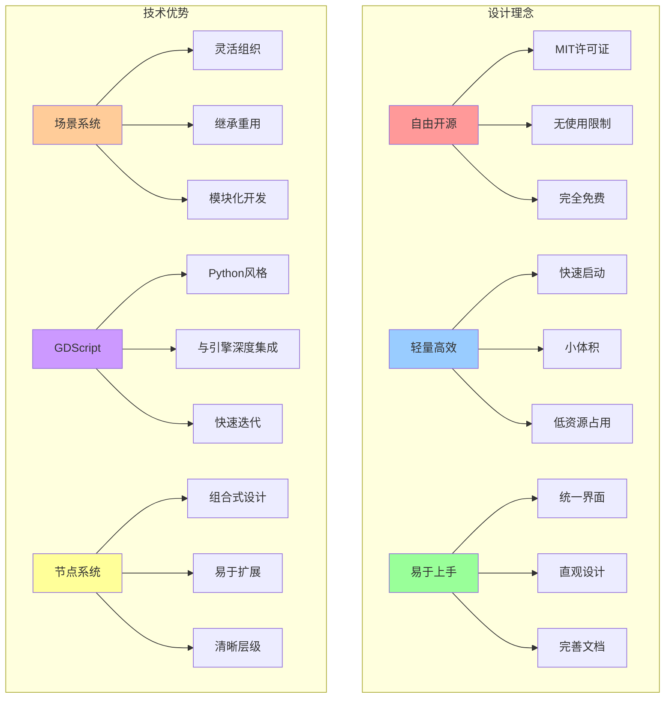

### 为什么选择 Godot？

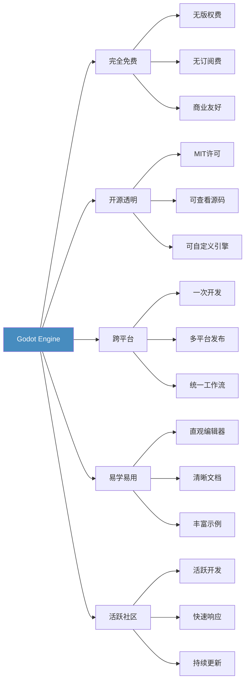

## 核心概念

### 场景和节点系统

Godot的核心是场景（Scene）和节点（Node）系统。所有游戏元素都是由节点组成的场景。

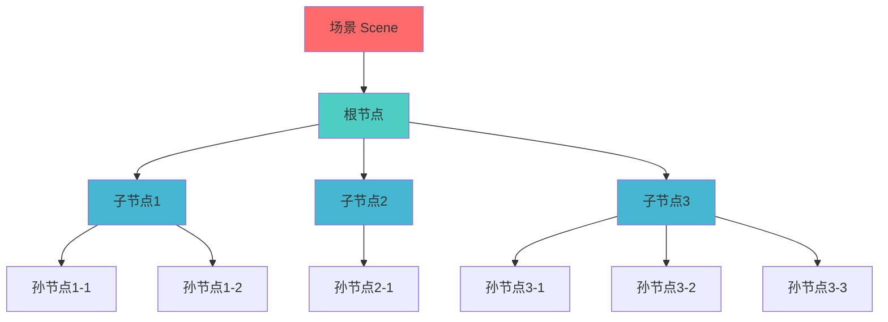

**场景树示例：**

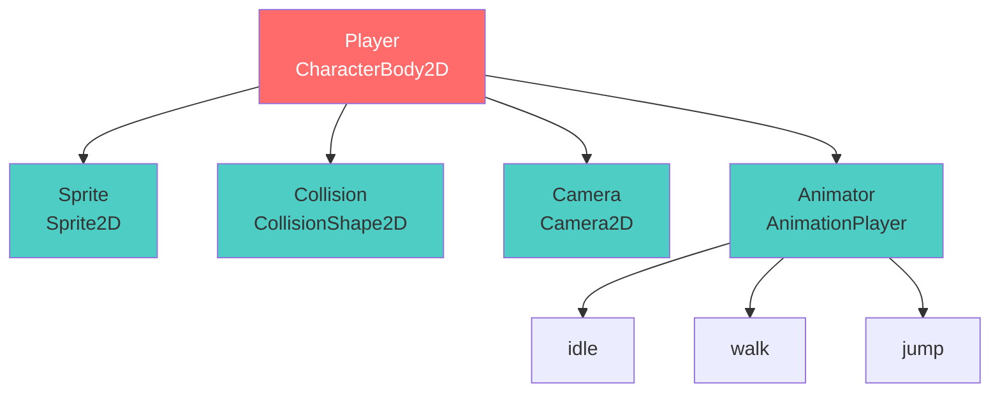

### 信号系统

Godot使用信号（Signals）进行节点间通信，实现松耦合的事件驱动架构。

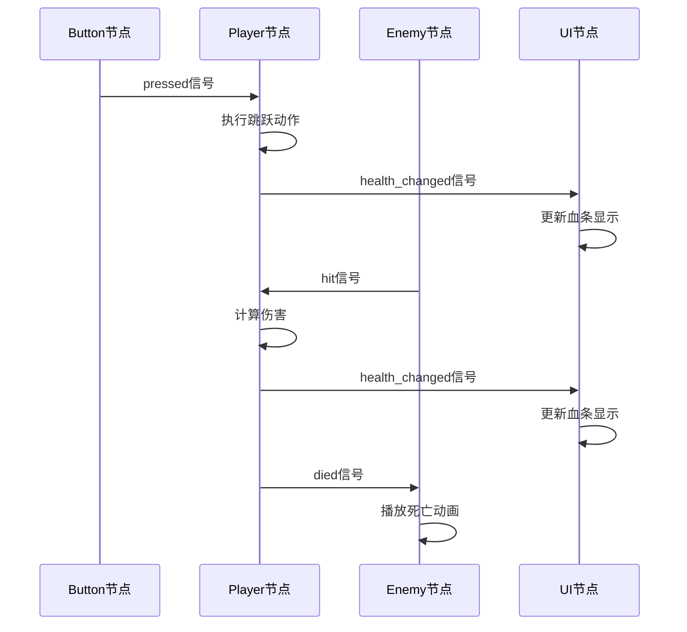

### GDScript 语言

GDScript是Godot的专用脚本语言，语法类似Python，与引擎深度集成。

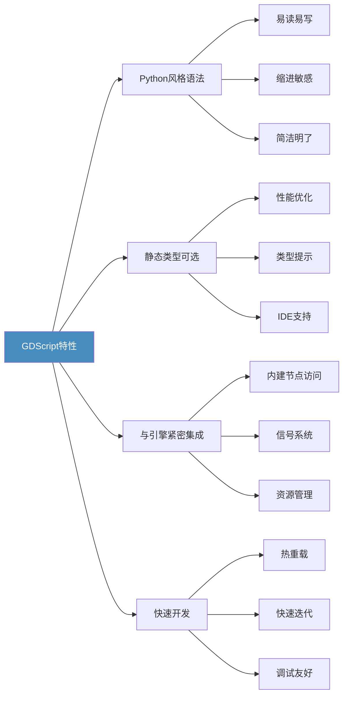

## 安装与设置

### 系统要求

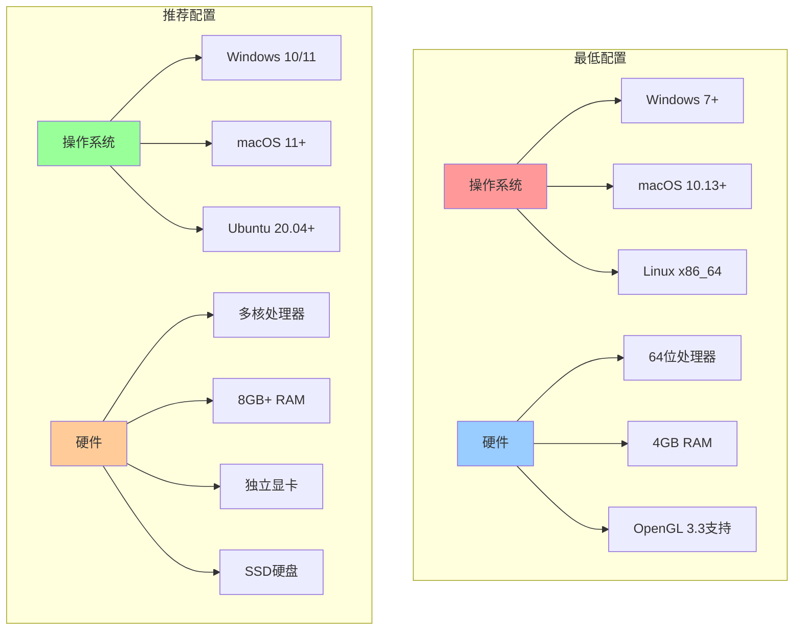

### 安装步骤

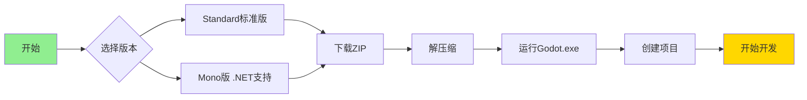

**详细安装流程：**

1. **访问官网** - 前往 [godotengine.org](https://godotengine.org)
2. **下载版本** - 选择适合的版本：
   - **Standard** - 使用GDScript开发
   - **Mono** - 需要C#支持
3. **解压运行** - 无需安装，直接运行可执行文件
4. **配置编辑器** - 首次运行时设置项目路径和编辑器选项

### 项目管理器

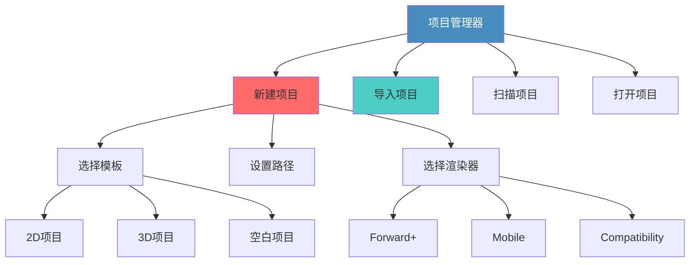

## 快速开始：2D游戏示例

### 创建简单的2D角色控制器

**项目结构：**

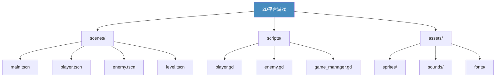

### 玩家角色场景结构

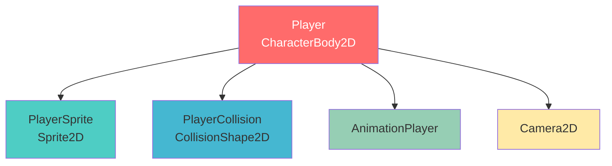

**Player.gd 脚本示例：**

```gdscript
extends CharacterBody2D

# 移动参数
const SPEED = 300.0
const JUMP_VELOCITY = -400.0

# 引用节点
@onready var sprite = $Sprite2D
@onready var anim_player = $AnimationPlayer

# 获取重力
var gravity = ProjectSettings.get_setting("physics/2d/default_gravity")

func _physics_process(delta):
    # 添加重力
    if not is_on_floor():
        velocity.y += gravity * delta
    
    # 处理跳跃
    if Input.is_action_just_pressed("jump") and is_on_floor():
        velocity.y = JUMP_VELOCITY
        anim_player.play("jump")
    
    # 获取输入方向
    var direction = Input.get_axis("move_left", "move_right")
    
    # 处理移动
    if direction != 0:
        velocity.x = direction * SPEED
        sprite.flip_h = direction < 0
        if is_on_floor():
            anim_player.play("walk")
    else:
        velocity.x = move_toward(velocity.x, 0, SPEED)
        if is_on_floor():
            anim_player.play("idle")
    
    # 应用移动
    move_and_slide()

# 处理受伤
func take_damage(amount: int):
    anim_player.play("hurt")
    # 发射信号通知UI更新
    health_changed.emit(-amount)

# 定义信号
signal health_changed(amount: int)
signal player_died()
```

### 输入映射配置

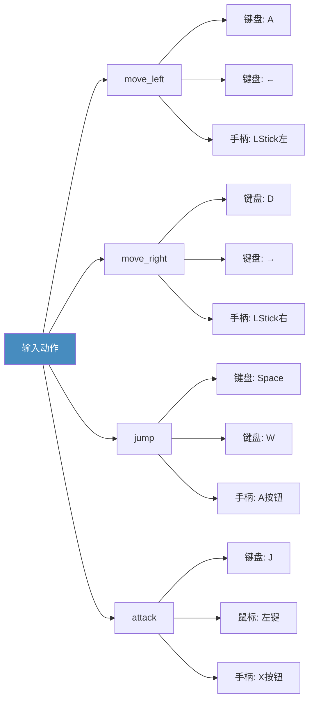

### 游戏循环架构

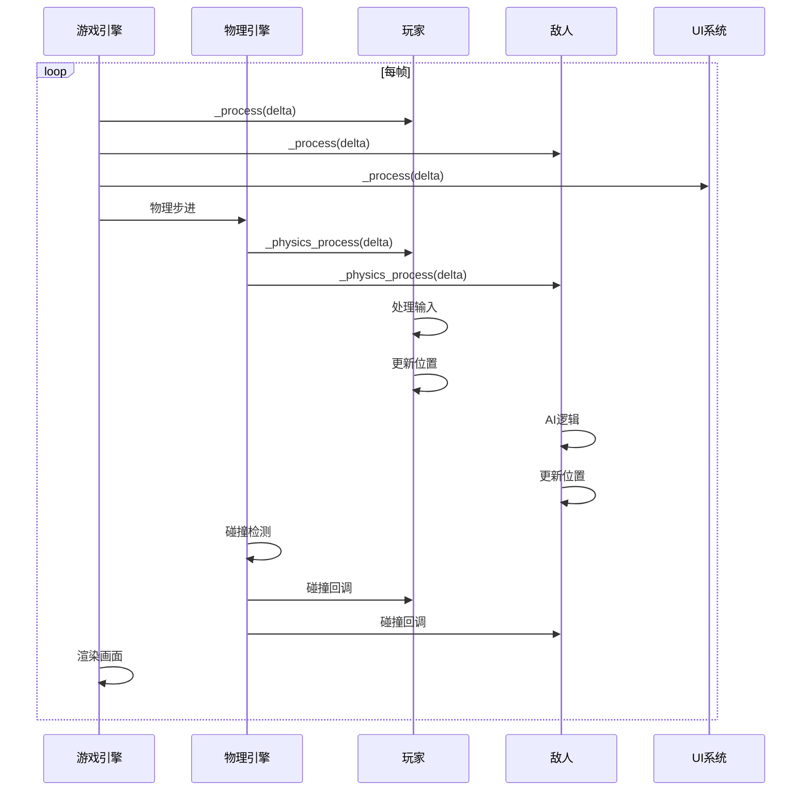

## 3D游戏开发

### 3D场景基础结构

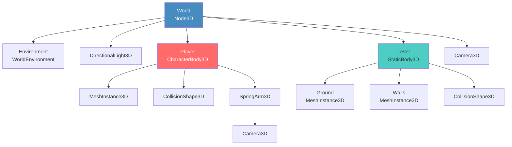

### 3D渲染管线

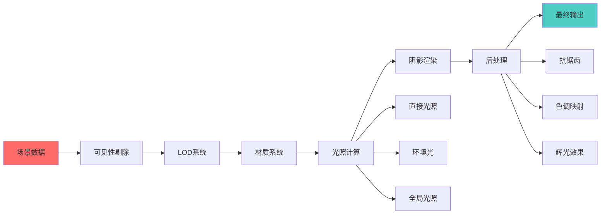

**3D角色控制器示例：**

```gdscript
extends CharacterBody3D

const SPEED = 5.0
const JUMP_VELOCITY = 4.5
const MOUSE_SENSITIVITY = 0.003

# 相机控制
@onready var spring_arm = $SpringArm3D
@onready var camera = $SpringArm3D/Camera3D
@onready var mesh = $MeshInstance3D

var gravity = ProjectSettings.get_setting("physics/3d/default_gravity")
var camera_rotation = Vector2.ZERO

func _ready():
    # 捕获鼠标
    Input.set_mouse_mode(Input.MOUSE_MODE_CAPTURED)

func _input(event):
    # 鼠标控制相机
    if event is InputEventMouseMotion and Input.get_mouse_mode() == Input.MOUSE_MODE_CAPTURED:
        camera_rotation.y -= event.relative.x * MOUSE_SENSITIVITY
        camera_rotation.x -= event.relative.y * MOUSE_SENSITIVITY
        camera_rotation.x = clamp(camera_rotation.x, -PI/2, PI/2)
        
        spring_arm.rotation.y = camera_rotation.y
        spring_arm.rotation.x = camera_rotation.x

func _physics_process(delta):
    # 重力
    if not is_on_floor():
        velocity.y -= gravity * delta
    
    # 跳跃
    if Input.is_action_just_pressed("jump") and is_on_floor():
        velocity.y = JUMP_VELOCITY
    
    # 移动输入
    var input_dir = Input.get_vector("move_left", "move_right", "move_forward", "move_back")
    
    # 相对于相机方向的移动
    var direction = (transform.basis * Vector3(input_dir.x, 0, input_dir.y)).normalized()
    direction = direction.rotated(Vector3.UP, spring_arm.rotation.y)
    
    if direction:
        velocity.x = direction.x * SPEED
        velocity.z = direction.z * SPEED
        
        # 角色朝向移动方向
        mesh.look_at(position + direction, Vector3.UP)
    else:
        velocity.x = move_toward(velocity.x, 0, SPEED)
        velocity.z = move_toward(velocity.z, 0, SPEED)
    
    move_and_slide()
```

### PBR材质系统

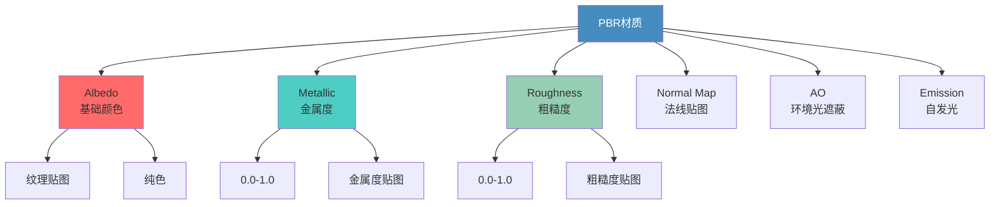

## 高级特性

### 动画系统

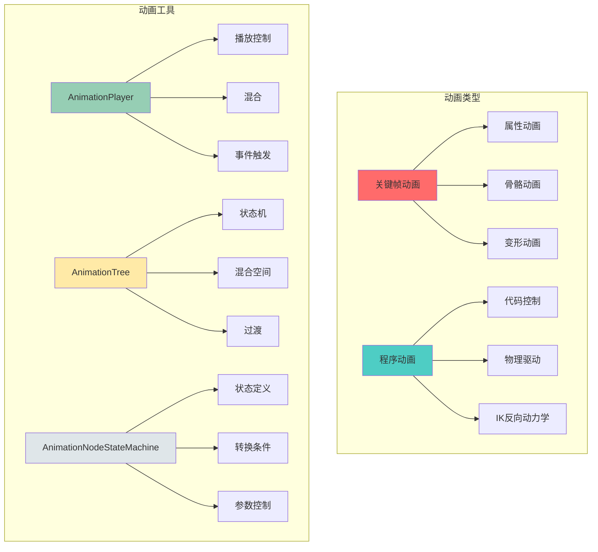

### 动画状态机示例

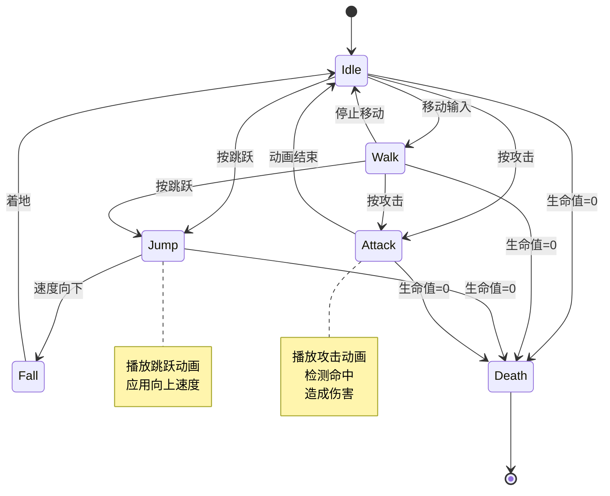

**AnimationTree配置示例：**

```gdscript
extends CharacterBody2D

@onready var animation_tree = $AnimationTree
@onready var state_machine = animation_tree["parameters/playback"]

func _physics_process(delta):
    # 更新动画状态
    update_animation()
    
    # ... 移动逻辑 ...

func update_animation():
    if is_on_floor():
        if velocity.x != 0:
            # 设置混合参数
            animation_tree["parameters/movement/blend_position"] = velocity.x / SPEED
            state_machine.travel("walk")
        else:
            state_machine.travel("idle")
    else:
        if velocity.y < 0:
            state_machine.travel("jump")
        else:
            state_machine.travel("fall")

func attack():
    state_machine.travel("attack")

func die():
    state_machine.travel("death")
    # 禁用输入和物理
    set_physics_process(false)
```

### UI系统架构

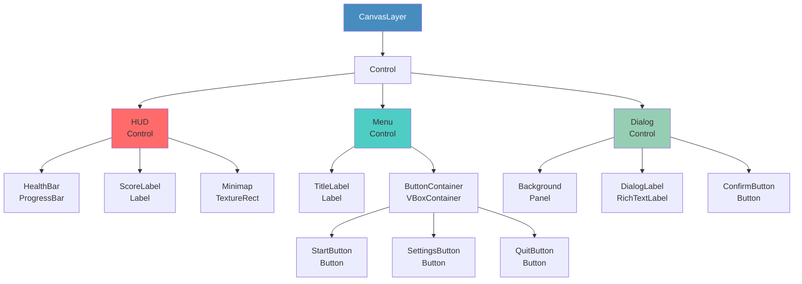

### UI布局容器

```mermaid
graph LR
    A[Container节点] --> B[HBoxContainer<br/>水平布局]
    A --> C[VBoxContainer<br/>垂直布局]
    A --> D[GridContainer<br/>网格布局]
    A --> E[MarginContainer<br/>边距容器]
    A --> F[CenterContainer<br/>居中容器]
    
    B --> B1[自动排列子节点]
    B --> B2[支持分隔器]
    
    C --> C1[垂直堆叠]
    C --> C2[自动调整间距]
    
    D --> D1[指定列数]
    D --> D2[自动换行]
    
    E --> E1[设置四周边距]
    E --> E2[响应式布局]
    
    F --> F1[内容居中]
    F --> F2[自适应大小]
    
    style A fill:#478cbf,color:#fff
```

**响应式UI示例：**

```gdscript
extends Control

@onready var health_bar = $HUD/HealthBar
@onready var score_label = $HUD/ScoreLabel
@onready var pause_menu = $PauseMenu

var score = 0

func _ready():
    # 连接玩家信号
    var player = get_node("/root/Main/Player")
    player.health_changed.connect(_on_health_changed)
    player.score_updated.connect(_on_score_updated)
    
    # 隐藏暂停菜单
    pause_menu.hide()

func _input(event):
    if event.is_action_pressed("pause"):
        toggle_pause()

func toggle_pause():
    get_tree().paused = !get_tree().paused
    pause_menu.visible = get_tree().paused

func _on_health_changed(new_health: int, max_health: int):
    # 更新血条
    health_bar.max_value = max_health
    health_bar.value = new_health
    
    # 血量低时闪烁
    if new_health < max_health * 0.3:
        health_bar.modulate = Color.RED
    else:
        health_bar.modulate = Color.WHITE

func _on_score_updated(new_score: int):
    score = new_score
    score_label.text = "Score: %d" % score
    
    # 添加得分动画
    var tween = create_tween()
    tween.tween_property(score_label, "scale", Vector2(1.2, 1.2), 0.1)
    tween.tween_property(score_label, "scale", Vector2(1.0, 1.0), 0.1)
```

### 资源系统

```mermaid
graph TB
    subgraph "资源类型"
        A1[场景资源] --> B1[.tscn文件]
        A1 --> B2[可实例化]
        A1 --> B3[继承支持]
        
        A2[脚本资源] --> C1[GDScript]
        A2 --> C2[C# Script]
        A2 --> C3[Visual Script]
        
        A3[纹理资源] --> D1[图片]
        A3 --> D2[图集]
        A3 --> D3[动画帧]
        
        A4[音频资源] --> E1[音效]
        A4 --> E2[音乐]
        A4 --> E3[语音]
    end
    
    subgraph "资源管理"
        F1[导入系统] --> G1[自动检测]
        F1 --> G2[格式转换]
        F1 --> G3[优化压缩]
        
        F2[预加载] --> H1[preload]
        F2 --> H2[ResourcePreloader]
        
        F3[动态加载] --> I1[load]
        F3 --> I2[ResourceLoader]
    end
    
    style A1 fill:#ff6b6b
    style A2 fill:#4ecdc4
    style A3 fill:#96ceb4
    style A4 fill:#ffeaa7
```

**资源加载示例：**

```gdscript
extends Node

# 预加载（编译时加载）
const PLAYER_SCENE = preload("res://scenes/player.tscn")
const BULLET_TEXTURE = preload("res://sprites/bullet.png")

# 资源缓存
var loaded_resources = {}

func _ready():
    # 异步加载大资源
    load_level_async("res://scenes/level_1.tscn")

# 动态加载
func spawn_enemy(enemy_type: String):
    var enemy_scene = load("res://scenes/enemies/" + enemy_type + ".tscn")
    if enemy_scene:
        var enemy = enemy_scene.instantiate()
        add_child(enemy)
        return enemy
    return null

# 异步加载
func load_level_async(path: String):
    # 开始异步加载
    var loader = ResourceLoader.load_threaded_request(path)
    
    # 等待加载完成
    while true:
        var progress = []
        var status = ResourceLoader.load_threaded_get_status(path, progress)
        
        if status == ResourceLoader.THREAD_LOAD_LOADED:
            var resource = ResourceLoader.load_threaded_get(path)
            _on_level_loaded(resource)
            break
        elif status == ResourceLoader.THREAD_LOAD_FAILED:
            push_error("Failed to load: " + path)
            break
        
        # 更新加载进度
        update_loading_progress(progress[0])
        await get_tree().process_frame

func _on_level_loaded(level_scene: PackedScene):
    var level = level_scene.instantiate()
    get_parent().add_child(level)

func update_loading_progress(progress: float):
    # 更新加载界面
    var loading_bar = get_node_or_null("LoadingScreen/ProgressBar")
    if loading_bar:
        loading_bar.value = progress * 100

# 资源缓存管理
func get_cached_resource(path: String):
    if path not in loaded_resources:
        loaded_resources[path] = load(path)
    return loaded_resources[path]

func clear_cache():
    loaded_resources.clear()
```

## 网络多人游戏

### 网络架构

```mermaid
graph TB
    subgraph "服务器架构"
        A1[服务器] --> B1[游戏状态管理]
        A1 --> B2[玩家连接管理]
        A1 --> B3[同步系统]
        
        B1 --> C1[世界状态]
        B1 --> C2[实体管理]
        B1 --> C3[权威验证]
        
        B2 --> D1[连接处理]
        B2 --> D2[断线重连]
        B2 --> D3[反作弊]
        
        B3 --> E1[状态同步]
        B3 --> E2[RPC调用]
        B3 --> E3[插值预测]
    end
    
    subgraph "客户端架构"
        F1[客户端] --> G1[输入收集]
        F1 --> G2[状态接收]
        F1 --> G3[预测与回滚]
        
        G1 --> H1[本地输入]
        G1 --> H2[发送到服务器]
        
        G2 --> I1[接收更新]
        G2 --> I2[应用状态]
        
        G3 --> J1[客户端预测]
        G3 --> J2[服务器校正]
    end
    
    style A1 fill:#ff6b6b,color:#fff
    style F1 fill:#4ecdc4
```

### 网络通信流程

```mermaid
sequenceDiagram
    participant C1 as 客户端1
    participant Server as 服务器
    participant C2 as 客户端2
    
    C1->>Server: 连接请求
    Server->>C1: 分配ID, 发送世界状态
    
    C2->>Server: 连接请求
    Server->>C2: 分配ID, 发送世界状态
    Server->>C1: 通知新玩家加入
    
    loop 游戏循环
        C1->>Server: 输入数据
        C2->>Server: 输入数据
        
        Server->>Server: 处理输入,更新状态
        Server->>Server: 碰撞检测,游戏逻辑
        
        Server->>C1: 同步状态
        Server->>C2: 同步状态
        
        C1->>C1: 插值与预测
        C2->>C2: 插值与预测
    end
    
    C1->>Server: RPC: player_attack()
    Server->>Server: 验证并执行
    Server->>C2: RPC: show_attack_effect()
    
    C2->>Server: 断开连接
    Server->>C1: 通知玩家离开
```

**多人游戏服务器示例：**

```gdscript
extends Node

# 网络配置
const PORT = 7777
const MAX_PLAYERS = 4

var peer = ENetMultiplayerPeer.new()
var players = {}

func _ready():
    # 连接网络信号
    multiplayer.peer_connected.connect(_on_peer_connected)
    multiplayer.peer_disconnected.connect(_on_peer_disconnected)

# 创建服务器
func create_server():
    peer.create_server(PORT, MAX_PLAYERS)
    multiplayer.multiplayer_peer = peer
    print("服务器启动在端口: ", PORT)
    
    # 添加服务器自己作为玩家
    add_player(1)

# 连接到服务器
func join_server(address: String):
    peer.create_client(address, PORT)
    multiplayer.multiplayer_peer = peer
    print("正在连接到服务器: ", address)

# 玩家连接
func _on_peer_connected(id: int):
    print("玩家连接: ", id)
    add_player(id)
    
    # 同步现有玩家给新玩家
    if multiplayer.is_server():
        rpc_id(id, "sync_players", players)

# 玩家断开
func _on_peer_disconnected(id: int):
    print("玩家断开: ", id)
    remove_player(id)

# 添加玩家
func add_player(id: int):
    var player_scene = preload("res://scenes/network_player.tscn")
    var player = player_scene.instantiate()
    player.name = str(id)
    player.set_multiplayer_authority(id)
    
    players[id] = player
    add_child(player)
    
    # 通知所有客户端
    if multiplayer.is_server():
        rpc("player_joined", id)

# 移除玩家
func remove_player(id: int):
    if id in players:
        players[id].queue_free()
        players.erase(id)
        
        # 通知所有客户端
        if multiplayer.is_server():
            rpc("player_left", id)

# RPC: 同步玩家列表
@rpc("authority", "call_remote", "reliable")
func sync_players(player_data: Dictionary):
    for id in player_data:
        if id not in players:
            add_player(id)

# RPC: 玩家加入通知
@rpc("authority", "call_local", "reliable")
func player_joined(id: int):
    if id not in players:
        add_player(id)

# RPC: 玩家离开通知
@rpc("authority", "call_local", "reliable")
func player_left(id: int):
    remove_player(id)
```

**网络玩家控制器：**

```gdscript
extends CharacterBody2D

const SPEED = 200.0

@export var player_id: int = 1

# 同步变量
var synced_position = Vector2.ZERO
var synced_velocity = Vector2.ZERO

func _ready():
    # 只有拥有权限的客户端才处理输入
    if is_multiplayer_authority():
        $Camera2D.enabled = true
    else:
        $Camera2D.enabled = false

func _physics_process(delta):
    if is_multiplayer_authority():
        # 本地玩家：处理输入
        handle_input(delta)
        
        # 发送位置给服务器
        if multiplayer.is_server():
            sync_position()
        else:
            rpc_id(1, "update_position", position, velocity)
    else:
        # 远程玩家：插值到同步位置
        position = position.lerp(synced_position, 0.3)
        velocity = velocity.lerp(synced_velocity, 0.3)

func handle_input(delta):
    var direction = Input.get_vector("move_left", "move_right", "move_up", "move_down")
    
    if direction:
        velocity = direction * SPEED
    else:
        velocity = velocity.move_toward(Vector2.ZERO, SPEED * delta)
    
    move_and_slide()

# RPC: 更新位置（客户端->服务器）
@rpc("any_peer", "unreliable")
func update_position(pos: Vector2, vel: Vector2):
    # 服务器验证位置
    if multiplayer.is_server():
        # 简单的反作弊检查
        if pos.distance_to(position) < 500:
            position = pos
            velocity = vel
            sync_position()

# 同步位置给所有客户端
func sync_position():
    rpc("receive_position", position, velocity)

# RPC: 接收位置（服务器->客户端）
@rpc("authority", "unreliable")
func receive_position(pos: Vector2, vel: Vector2):
    if not is_multiplayer_authority():
        synced_position = pos
        synced_velocity = vel

# RPC: 播放动画
@rpc("any_peer", "call_local", "reliable")
func play_animation(anim_name: String):
    $AnimationPlayer.play(anim_name)

# RPC: 发射子弹
@rpc("any_peer", "call_local", "reliable")
func shoot(direction: Vector2):
    if multiplayer.is_server():
        # 服务器权威生成子弹
        var bullet = preload("res://scenes/bullet.tscn").instantiate()
        bullet.position = position
        bullet.direction = direction
        get_parent().add_child(bullet)
```

## 插件系统

### 插件架构

```mermaid
graph TB
    Plugin[EditorPlugin] --> Dock[添加停靠面板]
    Plugin --> Tool[自定义工具]
    Plugin --> Import[导入插件]
    Plugin --> Export[导出插件]
    Plugin --> Inspector[检查器插件]
    
    Dock --> Dock1[自定义编辑器]
    Dock --> Dock2[工具面板]
    
    Tool --> Tool1[场景工具]
    Tool --> Tool2[资源工具]
    
    Import --> Import1[自定义格式]
    Import --> Import2[预处理]
    
    Export --> Export1[自定义平台]
    Export --> Export2[后处理]
    
    Inspector --> Insp1[自定义属性编辑器]
    Inspector --> Insp2[可视化编辑]
    
    style Plugin fill:#478cbf,color:#fff
```

**简单编辑器插件示例：**

```gdscript
@tool
extends EditorPlugin

var dock

func _enter_tree():
    # 创建停靠面板
    dock = preload("res://addons/my_plugin/dock.tscn").instantiate()
    
    # 添加到编辑器
    add_control_to_dock(DOCK_SLOT_LEFT_UL, dock)
    
    # 添加自定义类型
    add_custom_type("MyNode", "Node2D", 
        preload("res://addons/my_plugin/my_node.gd"),
        preload("res://addons/my_plugin/icon.png"))
    
    print("插件已加载")

func _exit_tree():
    # 清理
    remove_control_from_docks(dock)
    dock.free()
    
    remove_custom_type("MyNode")
    
    print("插件已卸载")

func _handles(object):
    # 指定插件处理的对象类型
    return object is MyNode

func _edit(object):
    # 编辑对象时调用
    if object is MyNode:
        dock.edit(object)

func _make_visible(visible):
    # 控制可见性
    if dock:
        dock.visible = visible
```

## 性能优化

### 性能优化策略

```mermaid
mindmap
  root((性能优化))
    渲染优化
      视锥剔除
      LOD系统
      遮挡剔除
      批量渲染
      减少绘制调用
      纹理压缩
      光照优化
    脚本优化
      避免每帧计算
      使用对象池
      缓存节点引用
      优化循环
      避免字符串操作
      使用静态类型
    物理优化
      简化碰撞体
      减少物理层
      调整时间步长
      使用睡眠状态
      空间分区
    内存优化
      资源共享
      及时释放
      预加载策略
      纹理图集
      音频压缩
    网络优化
      差分同步
      压缩数据
      预测回滚
      优先级队列
```

### 性能分析工具

```mermaid
graph LR
    A[性能分析] --> B[帧率监控]
    A --> C[性能分析器]
    A --> D[内存分析]
    A --> E[网络分析]
    
    B --> B1[FPS显示]
    B --> B2[帧时间]
    B --> B3[瓶颈识别]
    
    C --> C1[CPU分析]
    C --> C2[GPU分析]
    C --> C3[脚本分析]
    
    D --> D1[内存使用]
    D --> D2[资源追踪]
    D --> D3[泄漏检测]
    
    E --> E1[带宽监控]
    E --> E2[延迟测量]
    E --> E3[包丢失率]
    
    style A fill:#478cbf,color:#fff
```

**性能监控示例：**

```gdscript
extends CanvasLayer

@onready var fps_label = $FPSLabel
@onready var memory_label = $MemoryLabel
@onready var draw_calls_label = $DrawCallsLabel

var frame_times = []
var max_samples = 60

func _ready():
    # 启用性能监控
    Performance.add_custom_monitor("game/entities", get_entity_count)

func _process(delta):
    # FPS和帧时间
    var fps = Engine.get_frames_per_second()
    fps_label.text = "FPS: %d (%.2f ms)" % [fps, delta * 1000]
    
    # 内存使用
    var memory = Performance.get_monitor(Performance.MEMORY_STATIC) / 1024.0 / 1024.0
    memory_label.text = "Memory: %.2f MB" % memory
    
    # 绘制调用
    var draw_calls = Performance.get_monitor(Performance.RENDER_TOTAL_DRAW_CALLS_IN_FRAME)
    draw_calls_label.text = "Draw Calls: %d" % draw_calls
    
    # 记录帧时间
    frame_times.append(delta)
    if frame_times.size() > max_samples:
        frame_times.pop_front()
    
    # 检测性能问题
    if fps < 30:
        push_warning("FPS过低: %d" % fps)
    
    if delta > 0.033:  # 超过33ms（30FPS）
        push_warning("帧时间过长: %.2f ms" % (delta * 1000))

func get_entity_count():
    return get_tree().get_nodes_in_group("entities").size()

func get_average_frame_time():
    if frame_times.is_empty():
        return 0.0
    var sum = 0.0
    for time in frame_times:
        sum += time
    return sum / frame_times.size()

# 对象池实现
class ObjectPool:
    var pool = []
    var scene: PackedScene
    var initial_size: int
    
    func _init(p_scene: PackedScene, p_initial_size: int = 10):
        scene = p_scene
        initial_size = p_initial_size
        _populate_pool()
    
    func _populate_pool():
        for i in range(initial_size):
            var obj = scene.instantiate()
            obj.visible = false
            pool.append(obj)
    
    func get_object():
        if pool.is_empty():
            _populate_pool()
        var obj = pool.pop_back()
        obj.visible = true
        return obj
    
    func return_object(obj):
        obj.visible = false
        pool.append(obj)
```

## 导出与发布

### 导出流程

```mermaid
graph TB
    Start[开始导出] --> Config[配置导出预设]
    Config --> Platform{选择平台}
    
    Platform --> Windows[Windows]
    Platform --> Linux[Linux]
    Platform --> Mac[macOS]
    Platform --> Android[Android]
    Platform --> iOS[iOS]
    Platform --> Web[HTML5]
    
    Windows --> WinSettings[配置Windows设置]
    Linux --> LinuxSettings[配置Linux设置]
    Mac --> MacSettings[配置macOS设置]
    Android --> AndroidSettings[配置Android设置]
    iOS --> iOSSettings[配置iOS设置]
    Web --> WebSettings[配置Web设置]
    
    WinSettings --> Export[执行导出]
    LinuxSettings --> Export
    MacSettings --> Export
    AndroidSettings --> Export
    iOSSettings --> Export
    WebSettings --> Export
    
    Export --> Test[测试]
    Test --> Success{测试通过?}
    Success -->|是| Package[打包发布]
    Success -->|否| Debug[调试修复]
    Debug --> Export
    
    Package --> End[发布完成]
    
    style Start fill:#90EE90
    style End fill:#FFD700
    style Success fill:#FF6B6B
```

### 平台特定配置

```mermaid
graph LR
    A[平台配置] --> B[Windows]
    A --> C[Android]
    A --> D[Web]
    A --> E[iOS]
    
    B --> B1[可执行文件图标]
    B --> B2[版本信息]
    B --> B3[控制台选项]
    
    C --> C1[包名配置]
    C --> C2[签名证书]
    C --> C3[权限设置]
    C --> C4[目标SDK版本]
    
    D --> D1[内存大小]
    D --> D2[线程支持]
    D --> D3[SharedArrayBuffer]
    
    E --> E1[Bundle ID]
    E --> E2[签名配置]
    E --> E3[设备支持]
    E --> E4[隐私权限]
    
    style A fill:#478cbf,color:#fff
```

**导出配置示例 (export_presets.cfg):**

```ini
[preset.0]

name="Windows Desktop"
platform="Windows Desktop"
runnable=true
custom_features=""
export_filter="all_resources"
include_filter=""
exclude_filter=""

[preset.0.options]

custom_template/debug=""
custom_template/release=""
binary_format/64_bits=true
binary_format/embed_pck=true
texture_format/bptc=true
texture_format/s3tc=true
texture_format/etc=false
texture_format/etc2=false
binary_format/architecture="x86_64"
codesign/enable=false
application/icon=""
application/file_version=""
application/product_version=""
application/company_name=""
application/product_name=""
application/file_description=""
application/copyright=""
application/trademarks=""

[preset.1]

name="Android"
platform="Android"
runnable=true

[preset.1.options]

custom_template/debug=""
custom_template/release=""
gradle_build/use_gradle_build=true
gradle_build/export_format=0
architectures/armeabi-v7a=true
architectures/arm64-v8a=true
architectures/x86=false
architectures/x86_64=false
keystore/debug=""
keystore/debug_user=""
keystore/debug_password=""
keystore/release=""
keystore/release_user=""
keystore/release_password=""
package/unique_name="com.example.mygame"
package/name="My Game"
package/signed=true
version/code=1
version/name="1.0"
```

## 调试技巧

### 调试工具生态

```mermaid
mindmap
  root((调试工具))
    内置调试器
      断点调试
      变量监视
      调用堆栈
      远程调试
    性能工具
      性能分析器
      可视化分析器
      网络分析器
      内存分析器
    日志系统
      打印输出
      日志等级
      条件日志
      文件日志
    可视化调试
      绘制调试形状
      显示碰撞体
      显示导航网格
      显示物理状态
    远程工具
      远程场景树
      远程对象检查
      实时属性修改
```

**调试辅助工具示例：**

```gdscript
extends Node

# 调试配置
const DEBUG_MODE = true
const LOG_FILE = "user://debug.log"

enum LogLevel {
    DEBUG,
    INFO,
    WARNING,
    ERROR
}

var log_file: FileAccess
var debug_draw_enabled = false

func _ready():
    if DEBUG_MODE:
        log_file = FileAccess.open(LOG_FILE, FileAccess.WRITE)
        
        # 添加调试输入
        Input.add_action("toggle_debug")
        InputMap.action_add_event("toggle_debug", InputEventKey.new())
        var key = InputEventKey.new()
        key.keycode = KEY_F3
        InputMap.action_add_event("toggle_debug", key)

func _input(event):
    if event.is_action_pressed("toggle_debug"):
        debug_draw_enabled = !debug_draw_enabled
        queue_redraw()

func _draw():
    if debug_draw_enabled:
        draw_debug_info()

func draw_debug_info():
    # 绘制FPS
    var fps = Engine.get_frames_per_second()
    draw_string(ThemeDB.fallback_font, Vector2(10, 30), 
        "FPS: %d" % fps, HORIZONTAL_ALIGNMENT_LEFT, -1, 16, Color.YELLOW)
    
    # 绘制节点数
    var node_count = get_tree().get_node_count()
    draw_string(ThemeDB.fallback_font, Vector2(10, 50),
        "Nodes: %d" % node_count, HORIZONTAL_ALIGNMENT_LEFT, -1, 16, Color.YELLOW)
    
    # 绘制物理对象
    var physics_objects = get_tree().get_nodes_in_group("physics")
    draw_string(ThemeDB.fallback_font, Vector2(10, 70),
        "Physics Objects: %d" % physics_objects.size(), 
        HORIZONTAL_ALIGNMENT_LEFT, -1, 16, Color.YELLOW)

# 日志函数
func log(message: String, level: LogLevel = LogLevel.INFO):
    var timestamp = Time.get_datetime_string_from_system()
    var level_str = LogLevel.keys()[level]
    var log_message = "[%s] [%s] %s" % [timestamp, level_str, message]
    
    print(log_message)
    
    if log_file:
        log_file.store_line(log_message)
        log_file.flush()

func debug(message: String):
    if DEBUG_MODE:
        log(message, LogLevel.DEBUG)

func info(message: String):
    log(message, LogLevel.INFO)

func warning(message: String):
    log(message, LogLevel.WARNING)
    push_warning(message)

func error(message: String):
    log(message, LogLevel.ERROR)
    push_error(message)

# 性能计时器
class PerformanceTimer:
    var start_time: int
    var name: String
    
    func _init(p_name: String):
        name = p_name
        start_time = Time.get_ticks_usec()
    
    func stop():
        var end_time = Time.get_ticks_usec()
        var elapsed = (end_time - start_time) / 1000.0
        print("%s: %.2f ms" % [name, elapsed])

# 使用示例
func expensive_operation():
    var timer = PerformanceTimer.new("ExpensiveOperation")
    
    # 执行操作
    for i in range(10000):
        var result = sqrt(i)
    
    timer.stop()

# 断言工具
func assert_not_null(value, message: String = ""):
    if value == null:
        error("Assert failed: value is null. " + message)
        assert(false)

func assert_equals(expected, actual, message: String = ""):
    if expected != actual:
        error("Assert failed: expected %s but got %s. %s" % [expected, actual, message])
        assert(false)

# 可视化调试
func draw_circle_debug(position: Vector2, radius: float, color: Color = Color.RED):
    if debug_draw_enabled:
        var debug_draw = get_node("/root/DebugDraw")
        if debug_draw:
            debug_draw.draw_circle(position, radius, color)

func draw_line_debug(from: Vector2, to: Vector2, color: Color = Color.GREEN):
    if debug_draw_enabled:
        var debug_draw = get_node("/root/DebugDraw")
        if debug_draw:
            debug_draw.draw_line(from, to, color)

func _exit_tree():
    if log_file:
        log_file.close()
```

## 最佳实践

### 项目结构

```mermaid
graph TD
    Root[项目根目录] --> Assets[assets/]
    Root --> Scenes[scenes/]
    Root --> Scripts[scripts/]
    Root --> Addons[addons/]
    Root --> Autoload[autoload/]
    
    Assets --> Sprites[sprites/]
    Assets --> Sounds[sounds/]
    Assets --> Music[music/]
    Assets --> Fonts[fonts/]
    Assets --> Shaders[shaders/]
    
    Scenes --> UI[ui/]
    Scenes --> Characters[characters/]
    Scenes --> Levels[levels/]
    Scenes --> Props[props/]
    
    Scripts --> Core[core/]
    Scripts --> Managers[managers/]
    Scripts --> Utils[utils/]
    
    Addons --> Plugin1[custom_plugin/]
    Addons --> Plugin2[third_party/]
    
    Autoload --> GameManager[game_manager.gd]
    Autoload --> AudioManager[audio_manager.gd]
    Autoload --> SaveSystem[save_system.gd]
    
    style Root fill:#478cbf,color:#fff
    style Assets fill:#ff6b6b
    style Scenes fill:#4ecdc4
    style Scripts fill:#96ceb4
```

### 代码组织规范

```mermaid
graph LR
    A[代码规范] --> B[命名规范]
    A --> C[文件组织]
    A --> D[注释规范]
    A --> E[类型提示]
    
    B --> B1[snake_case变量]
    B --> B2[PascalCase类名]
    B --> B3[UPPER_CASE常量]
    B --> B4[_private前缀]
    
    C --> C1[一个类一个文件]
    C --> C2[相关功能分组]
    C --> C3[清晰的文件夹结构]
    
    D --> D1[函数文档]
    D --> D2[复杂逻辑注释]
    D --> D3[TODO标记]
    
    E --> E1[参数类型]
    E --> E2[返回类型]
    E --> E3[变量类型]
    
    style A fill:#478cbf,color:#fff
```

**代码规范示例：**

```gdscript
## 玩家角色控制器
## 
## 处理玩家输入、移动和动画
## @tutorial: https://docs.example.com/player-controller

class_name Player
extends CharacterBody2D

#region 常量定义
const SPEED: float = 300.0
const JUMP_VELOCITY: float = -400.0
const MAX_HEALTH: int = 100
#endregion

#region 导出变量
@export_group("Movement")
@export var speed_multiplier: float = 1.0
@export var jump_height_multiplier: float = 1.0

@export_group("Combat")
@export var attack_damage: int = 10
@export var attack_cooldown: float = 0.5
#endregion

#region 私有变量
var _health: int = MAX_HEALTH
var _is_attacking: bool = false
var _attack_timer: float = 0.0
#endregion

#region 节点引用
@onready var _sprite: Sprite2D = $Sprite2D
@onready var _anim_player: AnimationPlayer = $AnimationPlayer
@onready var _collision: CollisionShape2D = $CollisionShape2D
#endregion

#region 信号定义
## 当玩家生命值改变时发射
signal health_changed(new_health: int, max_health: int)

## 当玩家死亡时发射
signal died()

## 当玩家攻击时发射
signal attacked(damage: int)
#endregion

#region 生命周期方法
func _ready() -> void:
    _initialize()

func _physics_process(delta: float) -> void:
    _handle_gravity(delta)
    _handle_input()
    _handle_movement()
    _update_animation()
    _update_timers(delta)

func _process(delta: float) -> void:
    _update_debug_info()
#endregion

#region 公共方法
## 对玩家造成伤害
## 
## @param amount: 伤害数值
## @return: 是否存活
func take_damage(amount: int) -> bool:
    _health = max(0, _health - amount)
    health_changed.emit(_health, MAX_HEALTH)
    
    if _health <= 0:
        _die()
        return false
    else:
        _play_hurt_animation()
        return true

## 治疗玩家
## 
## @param amount: 治疗数值
func heal(amount: int) -> void:
    _health = min(MAX_HEALTH, _health + amount)
    health_changed.emit(_health, MAX_HEALTH)

## 执行攻击
func attack() -> void:
    if _can_attack():
        _is_attacking = true
        _attack_timer = attack_cooldown
        _anim_player.play("attack")
        attacked.emit(attack_damage)
#endregion

#region 私有方法
func _initialize() -> void:
    _health = MAX_HEALTH
    _is_attacking = false

func _handle_gravity(delta: float) -> void:
    if not is_on_floor():
        var gravity: float = ProjectSettings.get_setting("physics/2d/default_gravity")
        velocity.y += gravity * delta

func _handle_input() -> void:
    # 跳跃
    if Input.is_action_just_pressed("jump") and is_on_floor():
        velocity.y = JUMP_VELOCITY * jump_height_multiplier
    
    # 攻击
    if Input.is_action_just_pressed("attack"):
        attack()

func _handle_movement() -> void:
    var direction: float = Input.get_axis("move_left", "move_right")
    
    if direction != 0:
        velocity.x = direction * SPEED * speed_multiplier
        _sprite.flip_h = direction < 0
    else:
        velocity.x = move_toward(velocity.x, 0, SPEED)
    
    move_and_slide()

func _update_animation() -> void:
    if _is_attacking:
        return  # 攻击动画优先
    
    if not is_on_floor():
        if velocity.y < 0:
            _anim_player.play("jump")
        else:
            _anim_player.play("fall")
    elif velocity.x != 0:
        _anim_player.play("walk")
    else:
        _anim_player.play("idle")

func _update_timers(delta: float) -> void:
    if _attack_timer > 0:
        _attack_timer -= delta

func _can_attack() -> bool:
    return not _is_attacking and _attack_timer <= 0

func _play_hurt_animation() -> void:
    _anim_player.play("hurt")
    
    # 添加受击效果
    var tween: Tween = create_tween()
    tween.tween_property(_sprite, "modulate", Color.RED, 0.1)
    tween.tween_property(_sprite, "modulate", Color.WHITE, 0.1)

func _die() -> void:
    died.emit()
    _anim_player.play("death")
    set_physics_process(false)
    
    # 延迟后移除
    await get_tree().create_timer(2.0).timeout
    queue_free()

func _update_debug_info() -> void:
    if OS.is_debug_build():
        pass  # 添加调试信息显示
#endregion

#region 信号回调
func _on_animation_player_animation_finished(anim_name: String) -> void:
    if anim_name == "attack":
        _is_attacking = false

func _on_hitbox_area_entered(area: Area2D) -> void:
    if area.is_in_group("enemy"):
        take_damage(10)
#endregion
```

### 设计模式应用

```mermaid
graph TB
    subgraph "常用设计模式"
        A1[单例模式] --> B1[GameManager]
        A1 --> B2[AudioManager]
        A1 --> B3[SaveSystem]
        
        A2[工厂模式] --> C1[EntityFactory]
        A2 --> C2[LevelFactory]
        
        A3[观察者模式] --> D1[信号系统]
        A3 --> D2[事件总线]
        
        A4[状态模式] --> E1[AI状态机]
        A4 --> E2[动画状态机]
        
        A5[对象池模式] --> F1[弹药池]
        A5 --> F2[敌人池]
        A5 --> F3[特效池]
        
        A6[命令模式] --> G1[输入系统]
        A6 --> G2[撤销重做]
    end
    
    style A1 fill:#ff6b6b
    style A2 fill:#4ecdc4
    style A3 fill:#96ceb4
    style A4 fill:#ffeaa7
    style A5 fill:#dfe6e9
    style A6 fill:#fab1a0
```

## 社区资源

### 学习路径

```mermaid
graph TB
    Start[开始学习Godot] --> Basics[基础概念]
    Basics --> Beginner[初级项目]
    Beginner --> Intermediate[中级技能]
    Intermediate --> Advanced[高级主题]
    Advanced --> Expert[专家级开发]
    
    Basics --> B1[编辑器界面]
    Basics --> B2[场景和节点]
    Basics --> B3[GDScript基础]
    
    Beginner --> BG1[2D平台跳跃]
    Beginner --> BG2[简单射击游戏]
    Beginner --> BG3[UI系统]
    
    Intermediate --> I1[动画系统]
    Intermediate --> I2[AI和状态机]
    Intermediate --> I3[3D游戏开发]
    
    Advanced --> A1[网络多人]
    Advanced --> A2[性能优化]
    Advanced --> A3[自定义渲染]
    
    Expert --> E1[引擎扩展]
    Expert --> E2[插件开发]
    Expert --> E3[游戏发布]
    
    style Start fill:#90EE90
    style Expert fill:#FFD700
```

### 推荐资源

```mermaid
mindmap
  root((Godot资源))
    官方资源
      官方文档
        API参考
        教程系列
        最佳实践
      示例项目
        Demo项目
        游戏模板
      资产库
        插件
        资源包
    社区资源
      论坛和社区
        Reddit r/godot
        Godot Forums
        Discord服务器
      学习平台
        YouTube教程
        在线课程
        博客文章
      开源项目
        GitHub项目
        Game Jams作品
    工具和插件
      开发工具
        GDQuest工具
        编辑器插件
        调试工具
      美术资源
        Kenney资产
        OpenGameArt
        itch.io
    书籍和课程
      推荐书籍
        官方教程书
        游戏设计书籍
      在线课程
        Udemy课程
        GDQuest课程
```

## 常见问题

### 问题诊断流程

```mermaid
graph TD
    Problem[遇到问题] --> Type{问题类型}
    
    Type --> Bug[程序错误]
    Type --> Performance[性能问题]
    Type --> Design[设计问题]
    
    Bug --> CheckLogs[检查错误日志]
    CheckLogs --> Reproduce[尝试复现]
    Reproduce --> Debugger[使用调试器]
    Debugger --> Fix[修复并测试]
    
    Performance --> Profile[性能分析]
    Profile --> Identify[识别瓶颈]
    Identify --> Optimize[优化代码]
    Optimize --> Verify[验证效果]
    
    Design --> Research[研究解决方案]
    Research --> Prototype[原型测试]
    Prototype --> Implement[实现方案]
    Implement --> Review[审查效果]
    
    Fix --> Done[解决]
    Verify --> Done
    Review --> Done
    
    style Problem fill:#ff6b6b
    style Done fill:#90EE90
```

### 常见问题解答

**Q: Godot和Unity/Unreal有什么区别？**

```mermaid
graph LR
    A[引擎对比] --> B[Godot优势]
    A --> C[Godot劣势]
    
    B --> B1[完全免费开源]
    B --> B2[轻量快速]
    B --> B3[易于学习]
    B --> B4[2D功能强大]
    B --> B5[场景系统优秀]
    
    C --> C1[3D功能相对弱]
    C --> C2[商业游戏较少]
    C --> C3[资产生态较小]
    C --> C4[企业支持有限]
    
    style A fill:#478cbf,color:#fff
    style B fill:#90EE90
    style C fill:#ff6b6b
```

## 实战项目：完整2D平台游戏

### 游戏架构

```mermaid
graph TB
    Game[游戏主循环] --> MainMenu[主菜单]
    MainMenu --> LevelSelect[关卡选择]
    LevelSelect --> Gameplay[游戏进行]
    Gameplay --> Pause[暂停菜单]
    Pause --> Gameplay
    Gameplay --> GameOver[游戏结束]
    GameOver --> MainMenu
    Gameplay --> LevelComplete[关卡完成]
    LevelComplete --> LevelSelect
    
    Gameplay --> Systems[游戏系统]
    Systems --> Player[玩家控制]
    Systems --> Enemy[敌人AI]
    Systems --> Items[道具系统]
    Systems --> Score[分数系统]
    Systems --> Save[存档系统]
    
    style Game fill:#478cbf,color:#fff
    style Gameplay fill:#ff6b6b
    style Systems fill:#4ecdc4
```

### 游戏管理器

```gdscript
## 游戏管理器单例
## 管理游戏状态、分数、关卡等

extends Node

enum GameState {
    MENU,
    PLAYING,
    PAUSED,
    GAME_OVER
}

#region 信号
signal game_state_changed(new_state: GameState)
signal score_updated(new_score: int)
signal level_completed(level_index: int)
signal player_died()
#endregion

#region 游戏状态
var current_state: GameState = GameState.MENU:
    set(value):
        if current_state != value:
            current_state = value
            game_state_changed.emit(current_state)
            _on_state_changed(current_state)

var current_level: int = 0
var score: int = 0:
    set(value):
        score = value
        score_updated.emit(score)

var lives: int = 3
var coins: int = 0
#endregion

#region 配置
const SAVE_PATH = "user://savegame.save"
const LEVELS = [
    "res://scenes/levels/level_1.tscn",
    "res://scenes/levels/level_2.tscn",
    "res://scenes/levels/level_3.tscn",
]
#endregion

func _ready() -> void:
    process_mode = Node.PROCESS_MODE_ALWAYS
    load_game()

#region 游戏控制
func start_game(level_index: int = 0) -> void:
    current_level = level_index
    score = 0
    lives = 3
    coins = 0
    load_level(current_level)
    current_state = GameState.PLAYING

func pause_game() -> void:
    if current_state == GameState.PLAYING:
        current_state = GameState.PAUSED
        get_tree().paused = true

func resume_game() -> void:
    if current_state == GameState.PAUSED:
        current_state = GameState.PLAYING
        get_tree().paused = false

func game_over() -> void:
    current_state = GameState.GAME_OVER
    player_died.emit()
    
    # 延迟后返回主菜单
    await get_tree().create_timer(3.0).timeout
    return_to_menu()

func return_to_menu() -> void:
    get_tree().paused = false
    get_tree().change_scene_to_file("res://scenes/ui/main_menu.tscn")
    current_state = GameState.MENU
#endregion

#region 关卡管理
func load_level(level_index: int) -> void:
    if level_index < 0 or level_index >= LEVELS.size():
        push_error("Invalid level index: %d" % level_index)
        return
    
    current_level = level_index
    get_tree().change_scene_to_file(LEVELS[level_index])

func complete_level() -> void:
    level_completed.emit(current_level)
    save_game()
    
    # 加载下一关
    if current_level + 1 < LEVELS.size():
        await get_tree().create_timer(2.0).timeout
        load_level(current_level + 1)
    else:
        # 游戏完成
        _game_completed()

func restart_level() -> void:
    load_level(current_level)
    current_state = GameState.PLAYING
#endregion

#region 分数和道具
func add_score(points: int) -> void:
    score += points

func collect_coin() -> void:
    coins += 1
    add_score(10)

func collect_powerup(type: String) -> void:
    match type:
        "health":
            if lives < 5:
                lives += 1
        "speed":
            # 通知玩家获得加速
            pass
        "invincibility":
            # 通知玩家获得无敌
            pass

func lose_life() -> void:
    lives -= 1
    if lives <= 0:
        game_over()
    else:
        restart_level()
#endregion

#region 存档系统
func save_game() -> void:
    var save_data = {
        "level": current_level,
        "score": score,
        "coins": coins,
        "high_score": max(score, load_high_score())
    }
    
    var file = FileAccess.open(SAVE_PATH, FileAccess.WRITE)
    if file:
        file.store_var(save_data)
        file.close()

func load_game() -> void:
    if not FileAccess.file_exists(SAVE_PATH):
        return
    
    var file = FileAccess.open(SAVE_PATH, FileAccess.READ)
    if file:
        var save_data = file.get_var()
        file.close()
        
        if save_data is Dictionary:
            current_level = save_data.get("level", 0)
            score = save_data.get("score", 0)
            coins = save_data.get("coins", 0)

func load_high_score() -> int:
    if not FileAccess.file_exists(SAVE_PATH):
        return 0
    
    var file = FileAccess.open(SAVE_PATH, FileAccess.READ)
    if file:
        var save_data = file.get_var()
        file.close()
        
        if save_data is Dictionary:
            return save_data.get("high_score", 0)
    
    return 0

func reset_save() -> void:
    if FileAccess.file_exists(SAVE_PATH):
        DirAccess.remove_absolute(SAVE_PATH)
    
    current_level = 0
    score = 0
    coins = 0
    lives = 3
#endregion

#region 私有方法
func _on_state_changed(new_state: GameState) -> void:
    match new_state:
        GameState.MENU:
            AudioManager.play_music("menu")
        GameState.PLAYING:
            AudioManager.play_music("gameplay")
        GameState.PAUSED:
            AudioManager.pause_music()
        GameState.GAME_OVER:
            AudioManager.play_sound("game_over")

func _game_completed() -> void:
    # 显示胜利画面
    get_tree().change_scene_to_file("res://scenes/ui/victory_screen.tscn")
    save_game()
#endregion
```

## 总结

Godot Engine是一个强大且易用的开源游戏引擎，非常适合独立开发者和小团队使用。通过本指南，你应该已经掌握了：

```mermaid
mindmap
  root((Godot技能树))
    基础知识
      场景和节点
      GDScript脚本
      信号系统
      资源管理
    2D开发
      角色控制
      物理系统
      动画系统
      UI设计
    3D开发
      3D场景
      材质系统
      光照系统
      相机控制
    高级技能
      网络多人
      性能优化
      插件开发
      调试技巧
    项目管理
      版本控制
      团队协作
      测试发布
      持续集成
```

### 下一步学习建议

1. **实践项目** - 从小项目开始，逐步增加复杂度
2. **阅读源码** - 学习Godot引擎和优秀开源项目的代码
3. **参与社区** - 加入Godot社区，分享经验和学习
4. **持续学习** - 关注Godot更新，学习新特性
5. **游戏设计** - 不仅学习技术，也要提升游戏设计能力

## 参考资源

- 官方网站: [https://godotengine.org](https://godotengine.org)
- 官方文档: [https://docs.godotengine.org](https://docs.godotengine.org)
- GitHub仓库: [https://github.com/godotengine/godot](https://github.com/godotengine/godot)
- 官方论坛: [https://forum.godotengine.org](https://forum.godotengine.org)
- Reddit社区: [https://reddit.com/r/godot](https://reddit.com/r/godot)
- Discord服务器: [https://discord.gg/godotengine](https://discord.gg/godotengine)
- GDQuest教程: [https://gdquest.com](https://gdquest.com)
- Godot资产库: [https://godotengine.org/asset-library](https://godotengine.org/asset-library)

---

*本文档基于Godot Engine 4.x版本编写，部分内容可能随版本更新而变化。建议参考官方文档获取最新信息。*


