## 一、OpenCode 简介

[OpenCode](https://opencode.ai) 是一款完全开源的 AI 编程代理（Coding Agent），支持终端界面（TUI）、桌面应用和 IDE 插件三种使用方式。与 Claude Code 相比，OpenCode 最大的优势在于**提供商无关性**——你可以自由选择 Anthropic、OpenAI、Google、本地模型等 75+ 家 LLM 提供商，避免被单一厂商绑定。

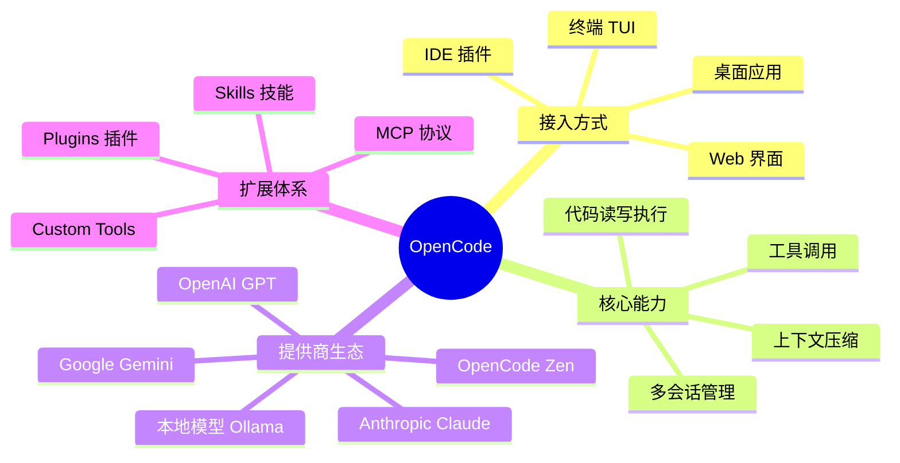

### 1.1 核心架构

OpenCode 采用**客户端-服务端**架构，多个前端界面通过统一的 SDK 与后端通信。

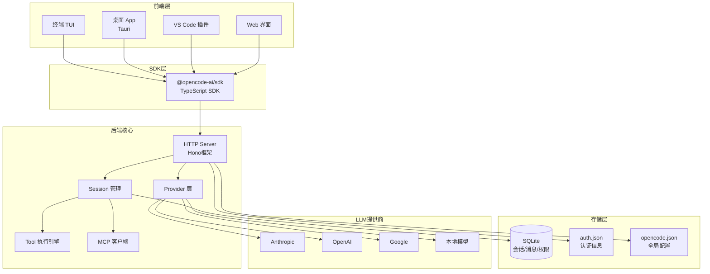

### 1.2 数据持久化位置

| 数据类型 | 存储路径 |
|---------|---------|
| 认证信息 | `~/.local/share/opencode/auth.json` |
| 全局配置 | `~/.config/opencode/opencode.json` |
| 项目数据 | `~/.local/share/opencode/project/<hash>/data.db` |
| 运行日志 | `~/.local/share/opencode/log/` |

---

## 二、安装与初始化

### 2.1 安装方式

```bash
# 官方安装脚本（推荐）
curl -fsSL https://opencode.ai/install | bash

# Homebrew（macOS/Linux，推荐，版本最新）
brew install anomalyco/tap/opencode

# npm 全局安装
npm install -g opencode-ai

# Arch Linux
sudo pacman -S opencode
```

### 2.2 项目初始化最佳实践

```bash
cd /path/to/your/project
opencode
```

进入 TUI 后执行：

```
/init
```

`/init` 命令会让 OpenCode 分析你的项目结构，并自动生成 `AGENTS.md` 文件。

> **最佳实践**：将 `AGENTS.md` 提交到 Git 仓库，让团队所有成员（以及 AI）都能获得一致的项目上下文。

### 2.3 AGENTS.md 最佳实践

一份高质量的 `AGENTS.md` 应包含以下内容：

```markdown
# 项目概述
简述项目用途、技术栈、业务背景

# 目录结构说明
解释关键目录和文件的职责

# 编码规范
- 命名约定
- 代码风格（ESLint/Prettier 规则）
- 注释规范

# 常用命令
- dev: npm run dev
- test: npm test
- build: npm run build

# 核心模块说明
解释关键模块的设计意图和边界

# 禁止事项
明确列出 AI 不应该修改的文件或区域
```

---

## 三、配置体系详解

### 3.1 配置优先级

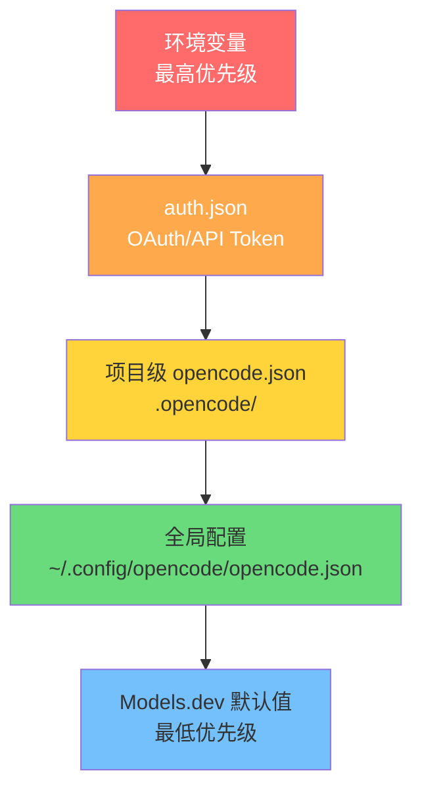

### 3.2 完整配置结构

```json
{
  "$schema": "https://opencode.ai/config.json",
  "model": "anthropic/claude-sonnet-4-5",
  "small_model": "anthropic/claude-haiku-4-5",
  "provider": {
    "anthropic": {
      "api_key": "${ANTHROPIC_API_KEY}"
    },
    "openai": {
      "api_key": "${OPENAI_API_KEY}"
    }
  },
  "agent": {
    "build": {
      "model": "anthropic/claude-sonnet-4-5",
      "system": "你是一名资深工程师，遵循 SOLID 原则"
    }
  },
  "tools": {
    "bash": { "enabled": true },
    "write": { "enabled": true },
    "read": { "enabled": true }
  },
  "mcp": {
    "filesystem": {
      "type": "local",
      "command": "npx",
      "args": ["-y", "@modelcontextprotocol/server-filesystem", "/workspace"]
    }
  },
  "tui": {
    "theme": "opencode"
  }
}
```

### 3.3 多环境配置策略

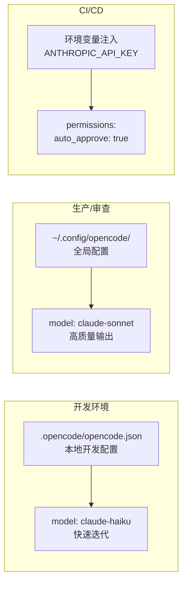

---

## 四、Agent 模式与工作流

### 4.1 内置 Agent 对比

| Agent | 模式 | 适用场景 |
|-------|------|---------|
| **build** | 完全访问权限 | 实际开发、代码修改 |
| **plan** | 只读模式 | 代码分析、制定方案 |
| **general** | 子 Agent | 复杂搜索、多步骤任务 |

在 TUI 中按 `Tab` 键切换 build 和 plan 模式。

### 4.2 推荐工作流：Plan → Review → Build

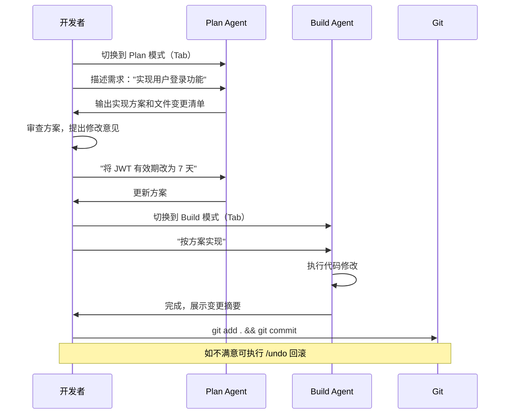

### 4.3 自定义 Agent

在配置文件中定义专属 Agent：

```json
{
  "agent": {
    "security-reviewer": {
      "model": "anthropic/claude-opus-4-5",
      "system": "你是一名专注于安全审查的工程师。检查代码中的 SQL 注入、XSS、CSRF 等安全漏洞。发现问题时，给出具体的修复建议和代码示例。",
      "tools": {
        "bash": { "enabled": false },
        "write": { "enabled": false }
      }
    },
    "test-writer": {
      "model": "anthropic/claude-haiku-4-5",
      "system": "你是一名 TDD 专家，专门负责编写单元测试和集成测试。优先使用项目已有的测试框架和风格。"
    }
  }
}
```

---

## 五、MCP（Model Context Protocol）实战

MCP 是 OpenCode 扩展能力的核心协议，允许 AI 连接外部工具和数据源。

### 5.1 MCP 架构原理

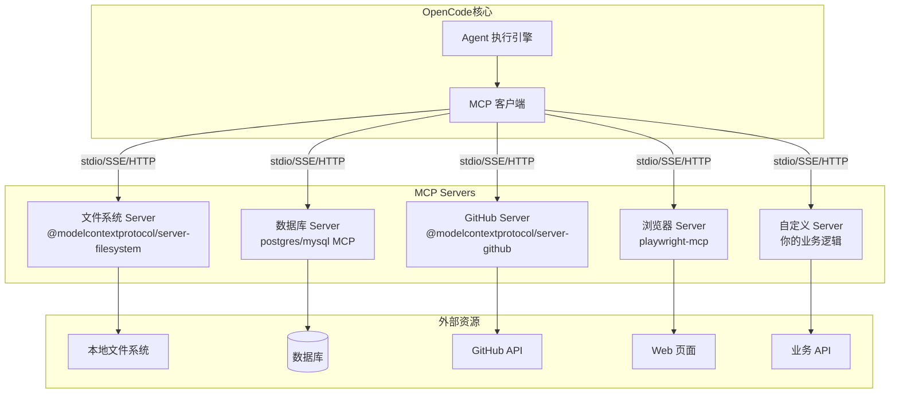

### 5.2 常用 MCP Server 配置

#### 文件系统 MCP

```json
{
  "mcp": {
    "filesystem": {
      "type": "local",
      "command": "npx",
      "args": [
        "-y",
        "@modelcontextprotocol/server-filesystem",
        "/Users/yourname/workspace"
      ]
    }
  }
}
```

#### GitHub MCP

```json
{
  "mcp": {
    "github": {
      "type": "local",
      "command": "npx",
      "args": ["-y", "@modelcontextprotocol/server-github"],
      "env": {
        "GITHUB_PERSONAL_ACCESS_TOKEN": "${GITHUB_TOKEN}"
      }
    }
  }
}
```

#### PostgreSQL 数据库 MCP

```json
{
  "mcp": {
    "postgres": {
      "type": "local",
      "command": "npx",
      "args": [
        "-y",
        "@modelcontextprotocol/server-postgres",
        "postgresql://localhost/mydb"
      ]
    }
  }
}
```

#### Playwright 浏览器自动化 MCP

```json
{
  "mcp": {
    "playwright": {
      "type": "local",
      "command": "npx",
      "args": ["-y", "@playwright/mcp"]
    }
  }
}
```

#### 远程 MCP Server（SSE）

```json
{
  "mcp": {
    "remote-service": {
      "type": "sse",
      "url": "https://your-mcp-server.com/sse",
      "headers": {
        "Authorization": "Bearer ${MCP_API_KEY}"
      }
    }
  }
}
```

### 5.3 实战案例：MCP 驱动的全栈开发

**场景**：使用 OpenCode + GitHub MCP + Postgres MCP 完成一个功能开发闭环

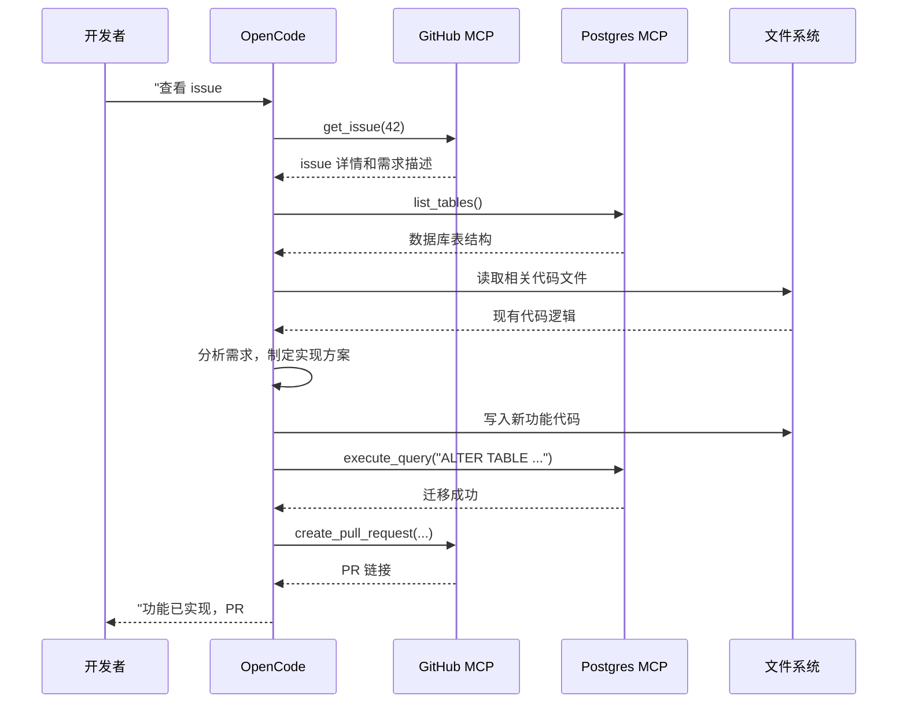

### 5.4 构建自定义 MCP Server

以下是一个连接内部 API 的自定义 MCP Server 示例：

```typescript
// custom-mcp-server.ts
import { Server } from "@modelcontextprotocol/sdk/server/index.js";
import { StdioServerTransport } from "@modelcontextprotocol/sdk/server/stdio.js";

const server = new Server(
  { name: "company-api-mcp", version: "1.0.0" },
  { capabilities: { tools: {} } }
);

// 注册工具：查询内部用户系统
server.setRequestHandler("tools/list", async () => ({
  tools: [
    {
      name: "get_user_info",
      description: "根据用户 ID 获取内部用户信息",
      inputSchema: {
        type: "object",
        properties: {
          user_id: { type: "string", description: "用户 ID" }
        },
        required: ["user_id"]
      }
    },
    {
      name: "list_user_permissions",
      description: "列出用户的权限列表",
      inputSchema: {
        type: "object",
        properties: {
          user_id: { type: "string" }
        },
        required: ["user_id"]
      }
    }
  ]
}));

server.setRequestHandler("tools/call", async (request) => {
  const { name, arguments: args } = request.params;

  if (name === "get_user_info") {
    const response = await fetch(
      `${process.env.INTERNAL_API_URL}/users/${args.user_id}`,
      { headers: { Authorization: `Bearer ${process.env.API_TOKEN}` } }
    );
    const data = await response.json();
    return { content: [{ type: "text", text: JSON.stringify(data) }] };
  }

  // ... 其他工具处理
});

const transport = new StdioServerTransport();
await server.connect(transport);
```

注册到 OpenCode：

```json
{
  "mcp": {
    "company-api": {
      "type": "local",
      "command": "npx",
      "args": ["tsx", "./scripts/custom-mcp-server.ts"],
      "env": {
        "INTERNAL_API_URL": "https://api.internal.company.com",
        "API_TOKEN": "${COMPANY_API_TOKEN}"
      }
    }
  }
}
```

---

## 六、Plugins 插件系统实战

### 6.1 插件架构

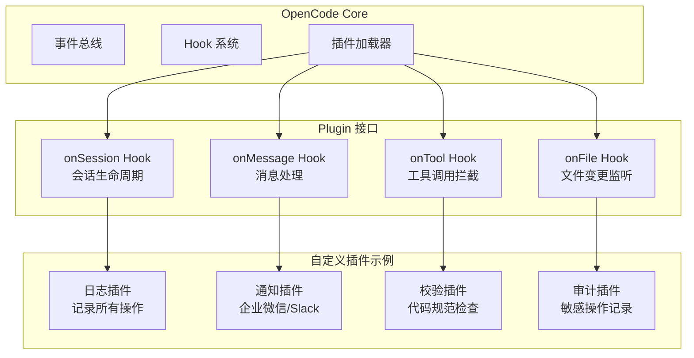

### 6.2 创建插件

OpenCode 插件是一个导出 `plugin` 对象的 JavaScript/TypeScript 模块：

```typescript
// .opencode/plugins/code-quality.ts
import type { Plugin } from "opencode-ai/plugin";

export const plugin: Plugin = {
  name: "code-quality-enforcer",
  version: "1.0.0",
  description: "在 AI 修改文件后自动运行 lint 检查",

  hooks: {
    // 文件被 AI 修改后触发
    afterFileWrite: async (ctx) => {
      const { filePath, content } = ctx;

      // 只处理 TypeScript/JavaScript 文件
      if (!/\.(ts|tsx|js|jsx)$/.test(filePath)) return;

      console.log(`[code-quality] 检查文件: ${filePath}`);

      // 运行 ESLint
      const result = await ctx.exec("npx", [
        "eslint",
        "--fix",
        filePath
      ]);

      if (result.exitCode !== 0) {
        ctx.warn(`ESLint 发现问题:\n${result.stderr}`);
      }
    },

    // 每次会话开始时触发
    onSessionStart: async (ctx) => {
      ctx.info("代码质量检查插件已激活");
    }
  }
};
```

### 6.3 实战插件：操作审计

```typescript
// .opencode/plugins/audit-logger.ts
import type { Plugin } from "opencode-ai/plugin";
import fs from "fs/promises";
import path from "path";

interface AuditEntry {
  timestamp: string;
  action: string;
  file?: string;
  tool?: string;
  user: string;
}

export const plugin: Plugin = {
  name: "audit-logger",
  version: "1.0.0",

  hooks: {
    beforeToolCall: async (ctx) => {
      const entry: AuditEntry = {
        timestamp: new Date().toISOString(),
        action: "tool_call",
        tool: ctx.toolName,
        file: ctx.args?.file_path,
        user: process.env.USER || "unknown"
      };

      // 追加到审计日志
      const logPath = path.join(process.cwd(), ".opencode/audit.jsonl");
      await fs.appendFile(logPath, JSON.stringify(entry) + "\n");
    },

    afterFileWrite: async (ctx) => {
      // 敏感文件变更告警
      const sensitivePatterns = [
        /\.env/,
        /config\/secrets/,
        /credentials/
      ];

      if (sensitivePatterns.some(p => p.test(ctx.filePath))) {
        // 发送 Webhook 告警
        await fetch(process.env.ALERT_WEBHOOK_URL!, {
          method: "POST",
          headers: { "Content-Type": "application/json" },
          body: JSON.stringify({
            text: `⚠️ 敏感文件被 AI 修改: ${ctx.filePath}`,
            timestamp: new Date().toISOString()
          })
        });
      }
    }
  }
};
```

注册插件：

```json
{
  "plugins": [
    ".opencode/plugins/code-quality.ts",
    ".opencode/plugins/audit-logger.ts"
  ]
}
```

---

## 七、Skills 技能系统实战

Skills 是 OpenCode 的"可复用上下文包"，让 AI 在执行特定任务时拥有领域专家知识。

### 7.1 Skills 工作原理

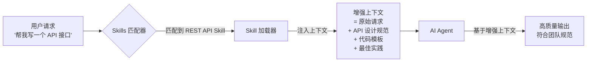

### 7.2 单一 Skill：REST API 设计规范

创建文件 `.opencode/skills/rest-api/SKILL.md`：

````markdown
# REST API 设计 Skill

## 激活场景
当用户请求创建 API 接口、路由、控制器时使用此 Skill。

## API 设计原则

### URL 规范
- 使用复数名词：`/users`，不用 `/user`
- 嵌套资源：`/users/{id}/orders`
- 版本前缀：`/api/v1/`

### HTTP 方法语义
| 方法 | 用途 | 示例 |
|------|------|------|
| GET | 查询资源 | GET /users |
| POST | 创建资源 | POST /users |
| PUT | 全量更新 | PUT /users/{id} |
| PATCH | 部分更新 | PATCH /users/{id} |
| DELETE | 删除资源 | DELETE /users/{id} |

### 统一响应格式
```typescript
// 成功响应
{
  "success": true,
  "data": { ... },
  "meta": {
    "page": 1,
    "total": 100
  }
}

// 错误响应
{
  "success": false,
  "error": {
    "code": "USER_NOT_FOUND",
    "message": "用户不存在",
    "details": {}
  }
}
```

### Express.js 标准控制器模板
```typescript
import { Request, Response, NextFunction } from "express";
import { asyncHandler } from "@/utils/async-handler";
import { UserService } from "@/services/user.service";
import { createUserSchema } from "@/validators/user.validator";

export const createUser = asyncHandler(
  async (req: Request, res: Response) => {
    const validated = createUserSchema.parse(req.body);
    const user = await UserService.create(validated);
    res.status(201).json({ success: true, data: user });
  }
);
```

## 必须包含
- 输入验证（使用 Zod）
- 错误处理中间件
- OpenAPI 注释
- 单元测试骨架
````

### 7.3 单一 Skill：数据库迁移规范

创建文件 `.opencode/skills/database/SKILL.md`：

````markdown
# 数据库迁移 Skill

## 激活场景
用户需要修改数据库结构、创建迁移文件时使用。

## 迁移文件命名
格式：`{timestamp}_{描述}.sql`
示例：`20260228143000_add_user_phone_column.sql`

## 迁移原则
1. **向前兼容**：新增列必须有默认值或允许 NULL
2. **原子性**：每个迁移文件只做一件事
3. **可回滚**：必须包含 `-- Down Migration` 部分

## 标准迁移模板
```sql
-- Up Migration
-- 描述：添加用户手机号字段
-- 作者：AI（由 OpenCode 生成）
-- 日期：2026-02-28

BEGIN;

ALTER TABLE users
  ADD COLUMN phone VARCHAR(20) DEFAULT NULL,
  ADD COLUMN phone_verified_at TIMESTAMP DEFAULT NULL;

CREATE INDEX idx_users_phone ON users(phone)
  WHERE phone IS NOT NULL;

COMMIT;

-- Down Migration
-- BEGIN;
-- ALTER TABLE users DROP COLUMN phone, DROP COLUMN phone_verified_at;
-- DROP INDEX IF EXISTS idx_users_phone;
-- COMMIT;
```

## 高风险操作检查清单
- [ ] 大表（>100万行）操作需要在维护窗口执行
- [ ] 删除列前确认无代码引用
- [ ] 新增 NOT NULL 列时必须提供默认值
- [ ] 索引创建使用 CREATE INDEX CONCURRENTLY
````

### 7.4 组合 Skills：全栈功能开发

当任务涉及多个领域时，可以组合多个 Skills：

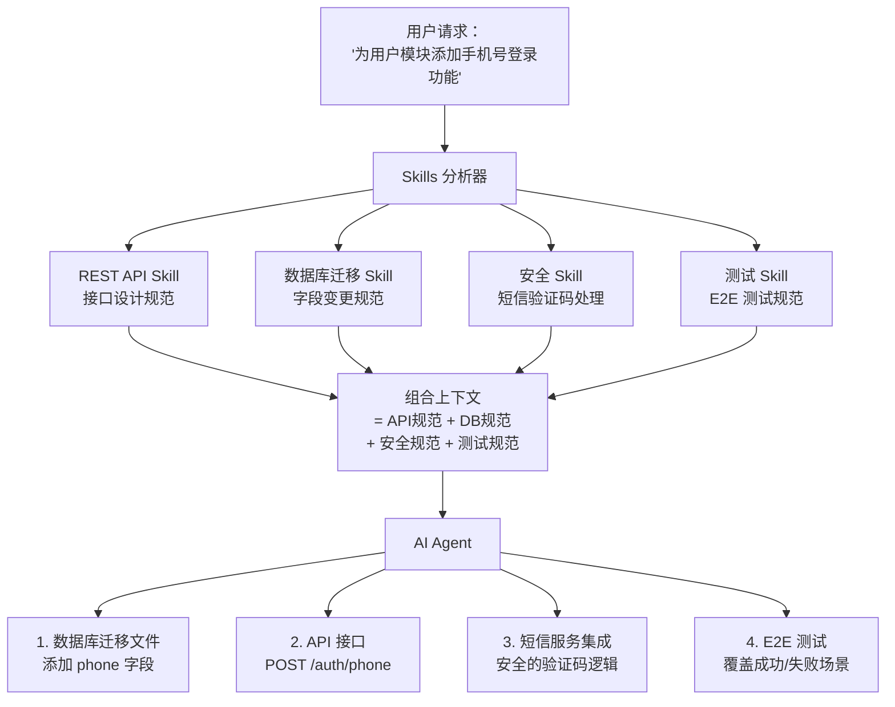

### 7.5 组合 Skill：企业级代码审查

创建文件 `.opencode/skills/code-review/SKILL.md`：

````markdown
# 企业级代码审查 Skill

## 激活场景
用户请求代码审查、安全检查、性能分析时激活。

## 审查维度

### 1. 安全审查
检查以下安全问题：
- SQL 注入：确保使用参数化查询
- XSS：确保输出转义
- 敏感信息：API Key、密码不得硬编码
- 认证：确保受保护路由有鉴权中间件

### 2. 性能审查
- N+1 查询问题
- 缺少数据库索引
- 大对象在内存中循环处理
- 未使用缓存的热点数据查询

### 3. 代码质量
- 函数单一职责
- 圈复杂度不超过 10
- 重复代码提取（DRY 原则）
- 错误处理覆盖

## 输出格式
```markdown
## 代码审查报告

### 🔴 必须修复（安全/功能问题）
1. **SQL 注入风险**（第 42 行）
   - 问题：直接拼接用户输入到 SQL 语句
   - 修复：使用参数化查询 `db.query('SELECT * FROM users WHERE id = ?', [id])`

### 🟡 建议优化（性能/质量问题）
1. **N+1 查询**（第 78-85 行）
   - 问题：在循环中调用数据库
   - 建议：使用 `include` 预加载关联数据

### 🟢 良好实践（值得保留）
- 统一的错误处理中间件
- 清晰的函数命名
```
````

### 7.6 Skill + MCP 组合实战：智能 PR 审查

将 GitHub MCP 与代码审查 Skill 结合，实现自动化 PR 审查：

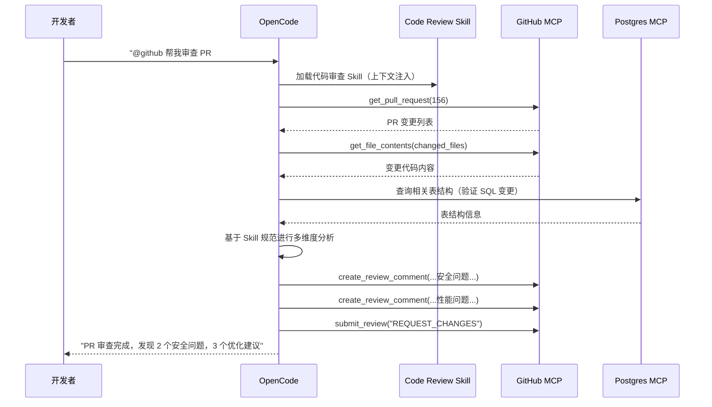

---

## 八、权限管理最佳实践

### 8.1 权限控制架构

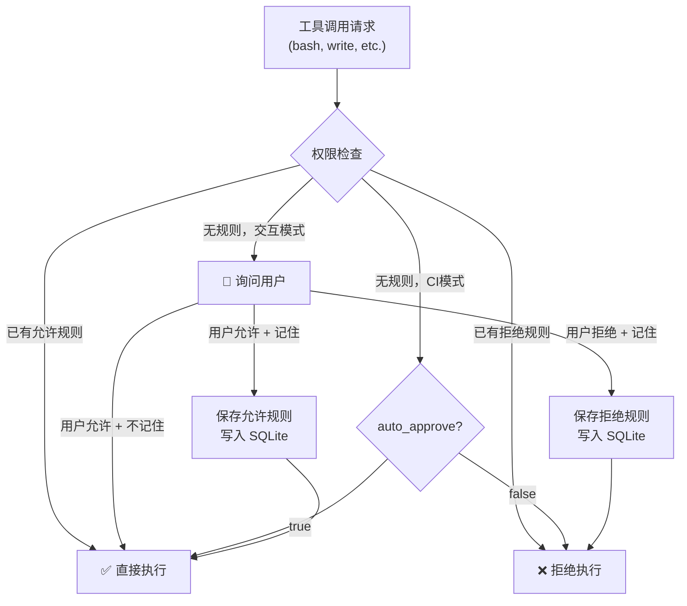

### 8.2 精细化权限配置

```json
{
  "permissions": {
    "rules": [
      {
        "tool": "bash",
        "pattern": "npm test*",
        "action": "allow"
      },
      {
        "tool": "bash",
        "pattern": "git push*",
        "action": "deny",
        "reason": "禁止 AI 直接推送代码"
      },
      {
        "tool": "write",
        "pattern": "*.env*",
        "action": "deny",
        "reason": "禁止修改环境配置文件"
      },
      {
        "tool": "bash",
        "pattern": "rm -rf*",
        "action": "deny",
        "reason": "禁止危险的删除操作"
      }
    ]
  }
}
```

---

## 九、进阶使用技巧

### 9.1 上下文管理与压缩

OpenCode 内置上下文压缩机制，当对话超过模型上下文窗口时自动压缩历史记录。

**最佳实践**：
- 每个功能开发建立新会话（`/session new`），保持上下文聚焦
- 用 `@文件名` 明确指定要分析的文件，避免 AI 猜测
- 定期使用 `/compact` 手动压缩，保留关键上下文

### 9.2 有效提示词技巧

```markdown
❌ 不好的提示：
"帮我优化代码"

✅ 好的提示：
"请分析 @src/services/user.service.ts 中 getUsersByRole 函数的性能问题。
该函数目前在生产环境中响应时间超过 2 秒，数据库中有约 50 万用户。
请提供具体的优化方案，并解释每个优化点的原理。"
```

**提示词模板**：

```
背景：[项目/功能背景]
目标：[具体想要实现的效果]
约束：[现有限制、不能改变的部分]
参考：@[相关文件] [参考实现]
输出格式：[期望的输出形式]
```

### 9.3 会话管理命令速查

| 命令 | 功能 |
|------|------|
| `/init` | 初始化项目，生成 AGENTS.md |
| `/session new` | 创建新会话 |
| `/session list` | 查看历史会话 |
| `/undo` | 撤销上一次变更 |
| `/redo` | 重做撤销的变更 |
| `/compact` | 压缩会话上下文 |
| `/share` | 生成会话分享链接 |
| `/connect` | 连接 LLM 提供商 |
| `Tab` | 切换 build/plan 模式 |
| `@文件名` | 引用项目文件 |

### 9.4 团队协作工作流

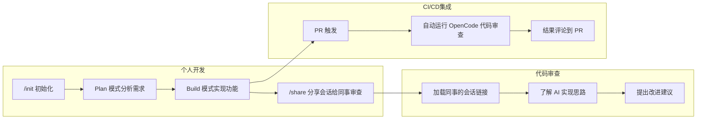

---

## 十、典型场景端到端实战

### 场景：从需求到上线的完整开发流程

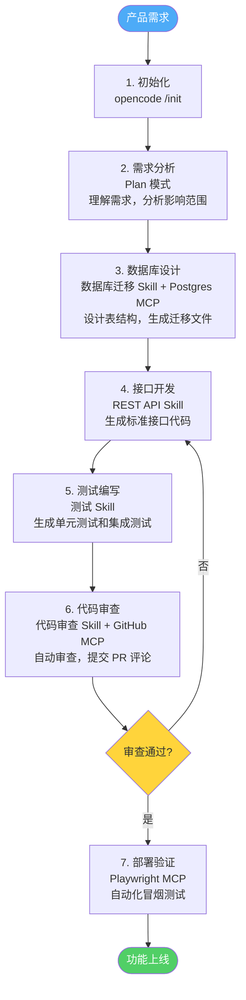

---

## 十一、常见问题与调试

### 11.1 MCP 连接问题排查

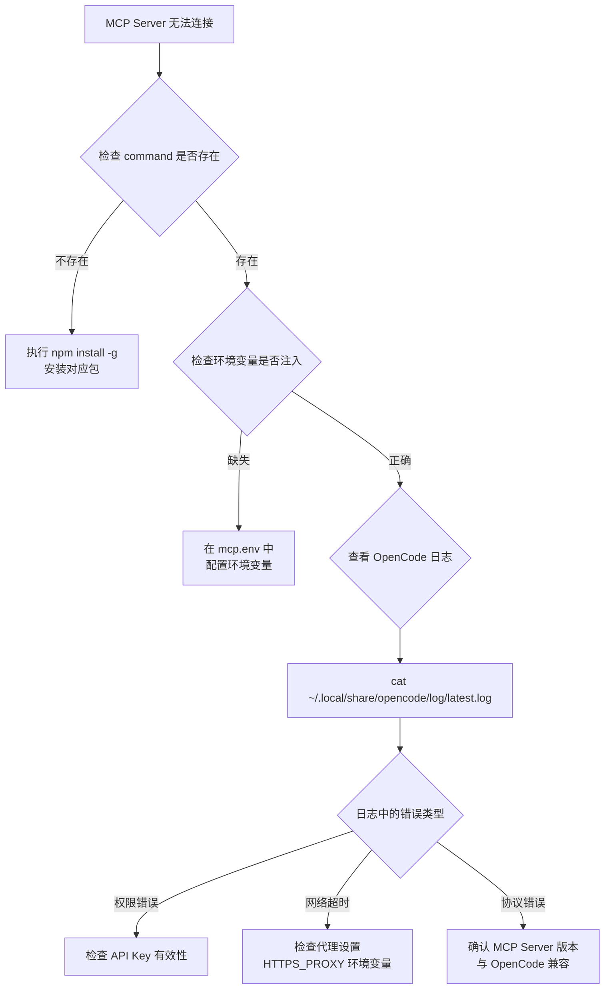

### 11.2 常见错误及解决方案

| 错误 | 原因 | 解决方案 |
|------|------|---------|
| `No provider configured` | 未配置 LLM 提供商 | 运行 `/connect` 配置 API Key |
| `Context window exceeded` | 上下文超长 | 使用 `/compact` 或新建会话 |
| `MCP server not found` | MCP 命令不存在 | 安装对应 npm 包 |
| `Permission denied for tool` | 权限规则拒绝 | 检查 `permissions.rules` 配置 |
| `AGENTS.md not found` | 未初始化项目 | 运行 `/init` |

---

## 十二、总结

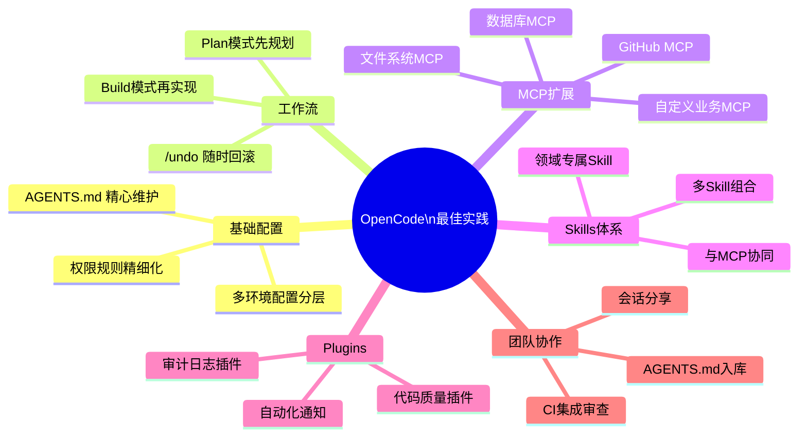

OpenCode 的核心价值在于其**开放的扩展体系**：

- **MCP** 打通外部工具和数据源，让 AI 获得真实的执行能力
- **Plugins** 在工作流的关键节点注入自定义逻辑，保障质量和安全
- **Skills** 将团队的最佳实践编码为可复用的 AI 上下文，保证输出一致性

三者组合使用，可以构建出真正适合团队的"AI 结对编程"体验。

---

## 参考资源

- [OpenCode 官网](https://opencode.ai)
- [OpenCode GitHub 仓库](https://github.com/anomalyco/opencode)
- [OpenCode 官方文档](https://opencode.ai/docs)
- [DeepWiki - OpenCode 架构分析](https://deepwiki.com/anomalyco/opencode)
- [MCP 协议规范](https://modelcontextprotocol.io)
- [OpenCode Discord 社区](https://discord.gg/opencode)
