## NocoDB 简介

NocoDB是一个开源的无代码数据库平台，它能够将传统的关系型数据库转换为智能的电子表格界面。作为Airtable的开源替代方案，NocoDB提供了丰富的功能和灵活的部署选项，让你完全掌控自己的数据。

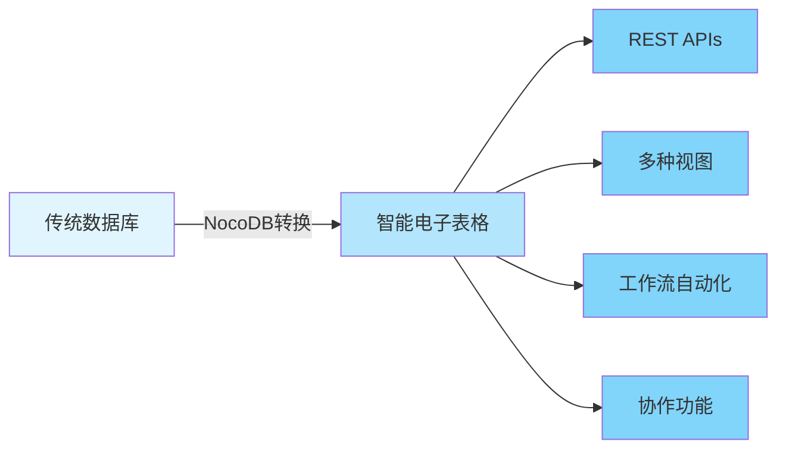

### 核心特性

- 🚀 **快速部署**：一键安装，几分钟内即可启动
- 💾 **多数据库支持**：MySQL、PostgreSQL、SQL Server、SQLite等
- 🎨 **丰富的界面**：Grid、Gallery、Form、Kanban、Calendar多种视图
- 🔌 **RESTful API**：自动生成API接口
- 🔐 **权限控制**：细粒度的访问控制和角色管理
- 🌐 **开源免费**：AGPL-3.0许可证，完全开源

### 为什么选择NocoDB？

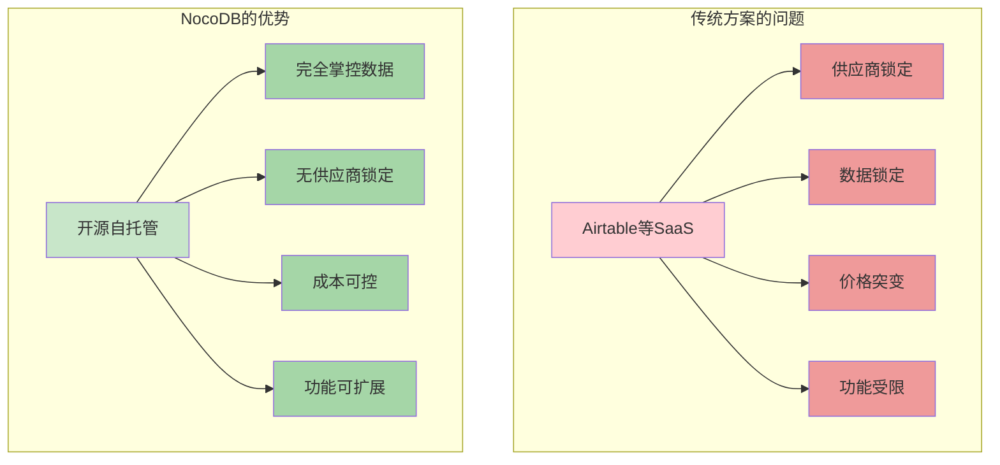

## 快速开始

### 方式一：Docker with SQLite（最简单）

这是最快速的入门方式，适合快速测试和小型项目：

```bash
docker run -d \
  --name noco \
  -v "$(pwd)"/nocodb:/usr/app/data/ \
  -p 8080:8080 \
  nocodb/nocodb:latest
```

启动后，访问 `http://localhost:8080/dashboard` 即可开始使用。

### 方式二：Docker with PostgreSQL（推荐生产环境）

使用外部PostgreSQL数据库，适合生产环境：

```bash
docker run -d \
  --name noco \
  -v "$(pwd)"/nocodb:/usr/app/data/ \
  -p 8080:8080 \
  -e NC_DB="pg://host.docker.internal:5432?u=root&p=password&d=d1" \
  -e NC_AUTH_JWT_SECRET="569a1821-0a93-45e8-87ab-eb857f20a010" \
  nocodb/nocodb:latest
```

### 方式三：Auto-upstall（一键生产部署）

Auto-upstall是最适合生产环境的部署方式，它会自动配置所有必要的服务：

```bash
bash <(curl -sSL http://install.nocodb.com/noco.sh) <(mktemp)
```

**Auto-upstall自动完成的任务**：

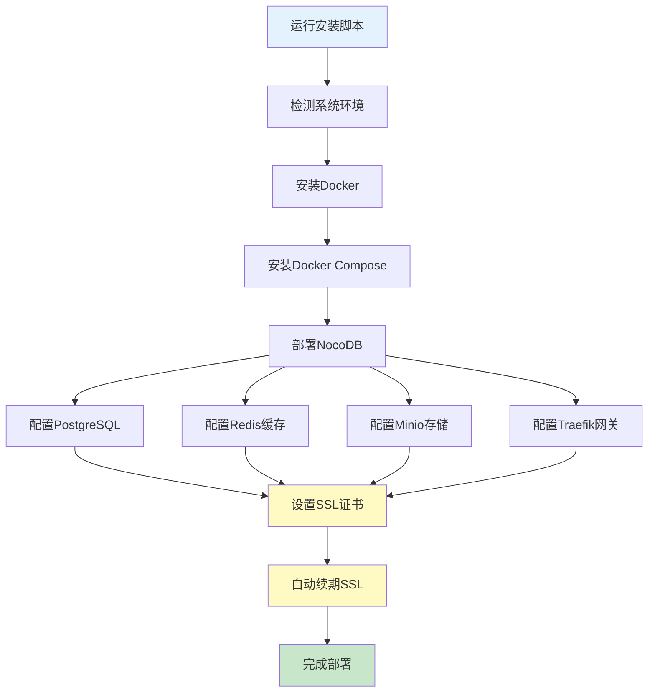

Auto-upstall的特点：
- 🐳 自动安装Docker和Docker Compose
- 🚀 一键部署PostgreSQL、Redis、Minio、Traefik完整栈
- 🔒 自动配置SSL并自动续期
- 🔄 支持一键升级到最新版本

### 方式四：二进制文件（快速测试）

适合本地快速测试，不推荐生产环境使用：

**macOS（ARM64）**：
```bash
curl http://get.nocodb.com/macos-arm64 -o nocodb -L && chmod +x nocodb && ./nocodb
```

**macOS（x64）**：
```bash
curl http://get.nocodb.com/macos-x64 -o nocodb -L && chmod +x nocodb && ./nocodb
```

**Linux（ARM64）**：
```bash
curl http://get.nocodb.com/linux-arm64 -o nocodb -L && chmod +x nocodb && ./nocodb
```

**Linux（x64）**：
```bash
curl http://get.nocodb.com/linux-x64 -o nocodb -L && chmod +x nocodb && ./nocodb
```

**Windows（PowerShell）**：
```powershell
# x64版本
iwr http://get.nocodb.com/win-x64.exe -OutFile Noco-win-x64.exe && .\Noco-win-x64.exe

# ARM64版本
iwr http://get.nocodb.com/win-arm64.exe -OutFile Noco-win-arm64.exe && .\Noco-win-arm64.exe
```

## 核心功能详解

### 1. 丰富的电子表格界面

NocoDB提供强大的电子表格操作能力，让你像使用Excel一样管理数据库：

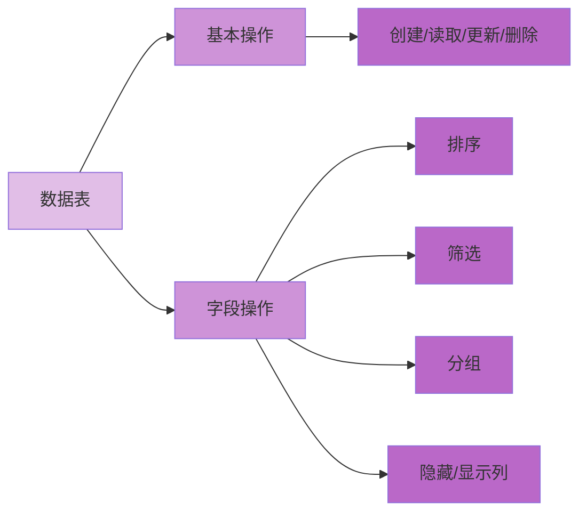

**基本操作功能**：
- ⚡ CRUD操作：创建、读取、更新、删除表、列和行
- 🔍 高级筛选：支持复杂的条件筛选
- 📊 排序与分组：多级排序和数据分组
- 👁️ 列管理：显示/隐藏列，调整列宽

### 2. 多种视图类型

NocoDB支持多种数据展示方式，满足不同场景需求：

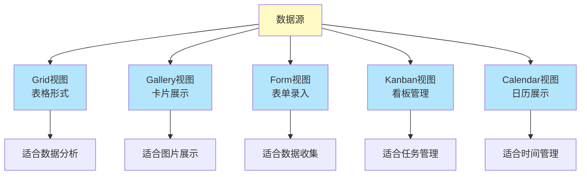

#### Grid视图（默认）
标准的表格视图，类似Excel，适合数据录入和分析。

```javascript
// 示例：通过API访问Grid视图数据
fetch('http://localhost:8080/api/v1/db/data/noco/ProjectName/TableName', {
  headers: {
    'xc-auth': 'YOUR_AUTH_TOKEN'
  }
})
.then(response => response.json())
.then(data => console.log(data));
```

#### Gallery视图
卡片式展示，适合展示包含图片的数据，如产品目录、作品集等。

#### Form视图
生成公开或受保护的表单，用于数据收集，支持字段验证和自定义样式。

#### Kanban视图
看板式管理，将数据按状态分组展示，完美适配敏捷开发和任务管理场景。

#### Calendar视图
日历形式展示时间相关数据，适合日程安排、活动管理等场景。

### 3. 丰富的字段类型

NocoDB支持20+种字段类型，满足各种数据需求：

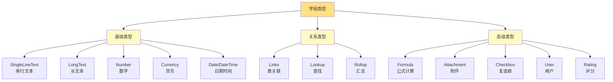

**字段类型详解**：

| 字段类型 | 说明 | 使用场景 |
|---------|------|---------|
| ID | 自动生成的唯一标识 | 主键 |
| Links | 表与表之间的关联 | 一对一、一对多、多对多关系 |
| Lookup | 从关联表中查找数据 | 跨表数据引用 |
| Rollup | 对关联数据进行聚合计算 | 统计关联数据 |
| Formula | 基于其他字段的计算结果 | 动态计算 |
| Currency | 货币格式数字 | 价格、金额 |
| User | 关联系统用户 | 任务分配、创建者 |
| Attachment | 文件上传 | 图片、文档 |

### 4. 访问控制与权限管理

NocoDB提供细粒度的权限控制系统：

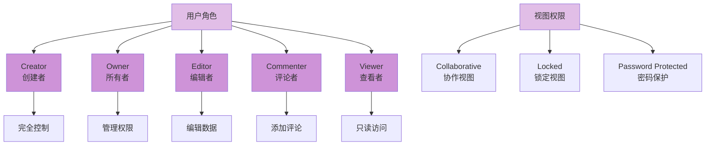

**权限级别说明**：

1. **Creator（创建者）**：拥有最高权限，可以删除项目
2. **Owner（所有者）**：可以管理用户和配置
3. **Editor（编辑者）**：可以编辑数据和视图
4. **Commenter（评论者）**：可以查看和评论
5. **Viewer（查看者）**：只能查看数据

### 5. 强大的API能力

NocoDB自动为每个表生成RESTful API：

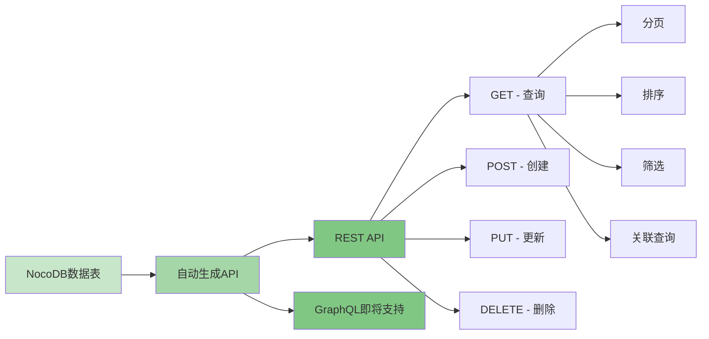

**API使用示例**：

```javascript
// 1. 获取所有记录
const response = await fetch('http://localhost:8080/api/v1/db/data/noco/ProjectName/TableName', {
  method: 'GET',
  headers: {
    'xc-auth': 'YOUR_AUTH_TOKEN',
    'Content-Type': 'application/json'
  }
});
const data = await response.json();

// 2. 创建新记录
const newRecord = await fetch('http://localhost:8080/api/v1/db/data/noco/ProjectName/TableName', {
  method: 'POST',
  headers: {
    'xc-auth': 'YOUR_AUTH_TOKEN',
    'Content-Type': 'application/json'
  },
  body: JSON.stringify({
    Title: '新任务',
    Status: '进行中',
    Priority: '高'
  })
});

// 3. 更新记录
await fetch('http://localhost:8080/api/v1/db/data/noco/ProjectName/TableName/1', {
  method: 'PATCH',
  headers: {
    'xc-auth': 'YOUR_AUTH_TOKEN',
    'Content-Type': 'application/json'
  },
  body: JSON.stringify({
    Status: '已完成'
  })
});

// 4. 删除记录
await fetch('http://localhost:8080/api/v1/db/data/noco/ProjectName/TableName/1', {
  method: 'DELETE',
  headers: {
    'xc-auth': 'YOUR_AUTH_TOKEN'
  }
});

// 5. 高级查询（分页、排序、筛选）
const advancedQuery = await fetch(
  'http://localhost:8080/api/v1/db/data/noco/ProjectName/TableName?' + 
  'limit=10&offset=0&' +
  'sort=-CreatedAt&' +
  'where=(Status,eq,进行中)',
  {
    headers: {
      'xc-auth': 'YOUR_AUTH_TOKEN'
    }
  }
);
```

**API查询参数**：

| 参数 | 说明 | 示例 |
|------|------|------|
| `limit` | 返回记录数量 | `limit=10` |
| `offset` | 偏移量（分页） | `offset=20` |
| `sort` | 排序（-表示降序） | `sort=-CreatedAt` |
| `where` | 筛选条件 | `where=(Status,eq,进行中)` |
| `fields` | 指定返回字段 | `fields=Title,Status` |

### 6. App Store - 工作流自动化

NocoDB提供丰富的集成选项，实现工作流自动化：

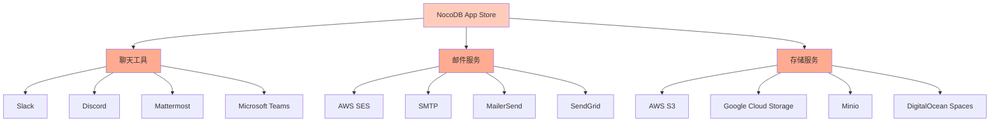

**集成类别**：

1. **Chat（聊天工具）**
   - Slack：团队协作通知
   - Discord：社区互动
   - Mattermost：私有部署聊天
   - Microsoft Teams：企业协作

2. **Email（邮件服务）**
   - AWS SES：大规模邮件发送
   - SMTP：通用邮件协议
   - MailerSend：营销邮件
   - SendGrid：事务邮件

3. **Storage（存储服务）**
   - AWS S3：云存储
   - Google Cloud Storage：Google云
   - Minio：自托管对象存储
   - DigitalOcean Spaces：简单云存储

## 完整架构示例

以下是NocoDB在实际应用中的完整架构：

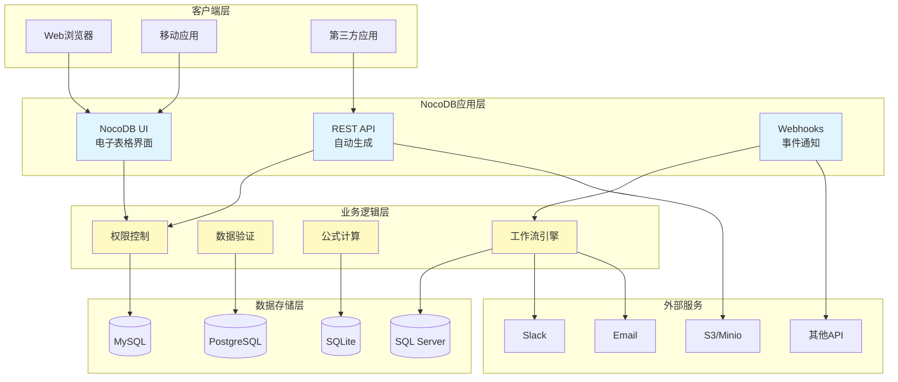

## 实战案例：任务管理系统

让我们通过一个完整的任务管理系统示例来展示NocoDB的强大功能：

### 1. 数据模型设计

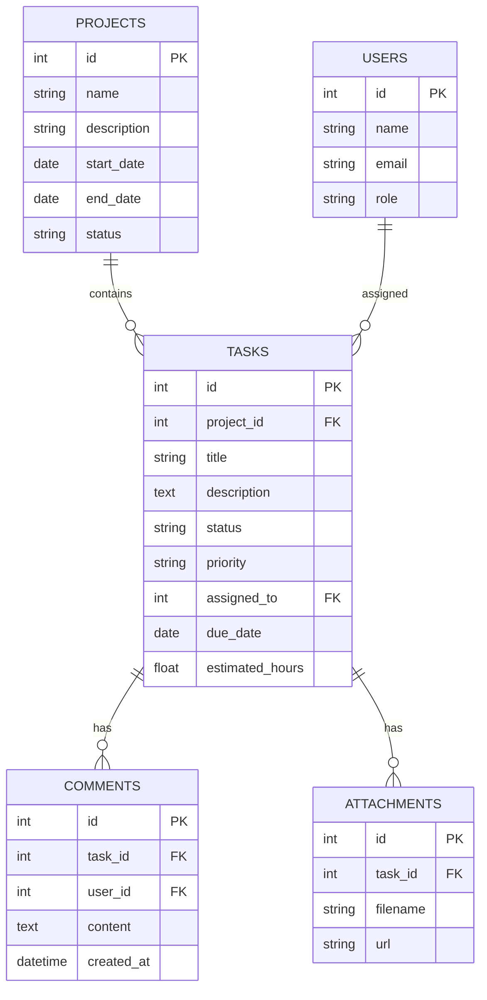

### 2. 创建项目和表

**步骤1：创建项目**
1. 登录NocoDB
2. 点击"New Project"
3. 选择数据库连接或使用内置SQLite
4. 输入项目名称"TaskManager"

**步骤2：创建表结构**

Projects表（项目表）：
```sql
-- NocoDB会自动创建，以下展示等效SQL
CREATE TABLE projects (
    id INT AUTO_INCREMENT PRIMARY KEY,
    name VARCHAR(255) NOT NULL,
    description TEXT,
    start_date DATE,
    end_date DATE,
    status VARCHAR(50) DEFAULT '进行中',
    created_at TIMESTAMP DEFAULT CURRENT_TIMESTAMP
);
```

Tasks表（任务表）：
```sql
CREATE TABLE tasks (
    id INT AUTO_INCREMENT PRIMARY KEY,
    project_id INT,
    title VARCHAR(255) NOT NULL,
    description TEXT,
    status VARCHAR(50) DEFAULT '待处理',
    priority VARCHAR(20) DEFAULT '中',
    assigned_to INT,
    due_date DATE,
    estimated_hours DECIMAL(5,2),
    created_at TIMESTAMP DEFAULT CURRENT_TIMESTAMP,
    FOREIGN KEY (project_id) REFERENCES projects(id)
);
```

### 3. 配置字段和关系

在NocoDB UI中配置：

**Projects表字段**：
- `name`：SingleLineText（必填）
- `description`：LongText
- `start_date`：Date
- `end_date`：Date
- `status`：SingleSelect（选项：规划中、进行中、已完成、已取消）

**Tasks表字段**：
- `title`：SingleLineText（必填）
- `description`：LongText
- `project_id`：Links to Projects（Many to One）
- `status`：SingleSelect（选项：待处理、进行中、已完成、已取消）
- `priority`：SingleSelect（选项：低、中、高、紧急）
- `assigned_to`：User
- `due_date`：Date
- `estimated_hours`：Number（Decimal）

### 4. 创建多种视图

**Kanban视图（看板）**：
- 按`status`字段分组
- 展示任务卡片
- 拖拽改变状态

**Calendar视图（日历）**：
- 按`due_date`字段展示
- 查看任务截止日期
- 日程安排

**Gallery视图（卡片）**：
- 展示任务详情
- 显示附件预览
- 团队协作

### 5. 设置自动化工作流

使用Webhooks实现自动通知：

```javascript
// 创建Webhook：任务状态变更通知到Slack
// 在NocoDB中配置Webhook URL
const webhookHandler = async (req, res) => {
  const { data, type } = req.body;
  
  if (type === 'after.update' && data.Status === '已完成') {
    // 发送Slack通知
    await fetch('https://hooks.slack.com/services/YOUR/WEBHOOK/URL', {
      method: 'POST',
      headers: { 'Content-Type': 'application/json' },
      body: JSON.stringify({
        text: `任务已完成: ${data.Title}`,
        blocks: [
          {
            type: 'section',
            text: {
              type: 'mrkdwn',
              text: `✅ *任务完成通知*\n\n*任务*: ${data.Title}\n*负责人*: ${data.AssignedTo}\n*完成时间*: ${new Date().toLocaleString()}`
            }
          }
        ]
      })
    });
  }
  
  res.json({ success: true });
};
```

### 6. 前端集成示例

使用Vue.js + NocoDB API构建任务看板：

```vue
<template>
  <div class="task-board">
    <div v-for="status in statuses" :key="status" class="column">
      <h3>{{ status }}</h3>
      <div class="task-list">
        <div
          v-for="task in getTasksByStatus(status)"
          :key="task.id"
          class="task-card"
          draggable="true"
          @dragstart="onDragStart($event, task)"
          @drop="onDrop($event, status)"
          @dragover.prevent
        >
          <h4>{{ task.Title }}</h4>
          <p>{{ task.Description }}</p>
          <div class="meta">
            <span class="priority" :class="task.Priority">
              {{ task.Priority }}
            </span>
            <span class="due-date">{{ task.DueDate }}</span>
          </div>
        </div>
      </div>
    </div>
  </div>
</template>

<script>
export default {
  data() {
    return {
      statuses: ['待处理', '进行中', '已完成'],
      tasks: [],
      authToken: 'YOUR_AUTH_TOKEN',
      baseURL: 'http://localhost:8080/api/v1/db/data/noco/TaskManager'
    }
  },
  
  methods: {
    async fetchTasks() {
      const response = await fetch(`${this.baseURL}/Tasks`, {
        headers: { 'xc-auth': this.authToken }
      });
      this.tasks = await response.json();
    },
    
    getTasksByStatus(status) {
      return this.tasks.filter(task => task.Status === status);
    },
    
    async updateTaskStatus(taskId, newStatus) {
      await fetch(`${this.baseURL}/Tasks/${taskId}`, {
        method: 'PATCH',
        headers: {
          'xc-auth': this.authToken,
          'Content-Type': 'application/json'
        },
        body: JSON.stringify({ Status: newStatus })
      });
      await this.fetchTasks();
    },
    
    onDragStart(event, task) {
      event.dataTransfer.setData('taskId', task.id);
    },
    
    async onDrop(event, newStatus) {
      const taskId = event.dataTransfer.getData('taskId');
      await this.updateTaskStatus(taskId, newStatus);
    }
  },
  
  mounted() {
    this.fetchTasks();
    // 每30秒刷新一次
    setInterval(this.fetchTasks, 30000);
  }
}
</script>

<style scoped>
.task-board {
  display: flex;
  gap: 20px;
  padding: 20px;
}

.column {
  flex: 1;
  background: #f5f5f5;
  border-radius: 8px;
  padding: 15px;
}

.task-card {
  background: white;
  border-radius: 6px;
  padding: 12px;
  margin-bottom: 10px;
  cursor: move;
  box-shadow: 0 2px 4px rgba(0,0,0,0.1);
}

.task-card:hover {
  box-shadow: 0 4px 8px rgba(0,0,0,0.15);
}

.priority.高 { color: #ef4444; font-weight: bold; }
.priority.中 { color: #f59e0b; }
.priority.低 { color: #10b981; }
</style>
```

## Docker Compose部署（生产环境推荐）

完整的Docker Compose配置，包含所有组件：

```yaml
version: '3.8'

services:
  # PostgreSQL数据库
  postgres:
    image: postgres:15-alpine
    container_name: nocodb_postgres
    restart: unless-stopped
    environment:
      POSTGRES_DB: nocodb
      POSTGRES_USER: nocodb
      POSTGRES_PASSWORD: your_secure_password
    volumes:
      - postgres_data:/var/lib/postgresql/data
    networks:
      - nocodb_network
    healthcheck:
      test: ["CMD-SHELL", "pg_isready -U nocodb"]
      interval: 10s
      timeout: 5s
      retries: 5

  # Redis缓存
  redis:
    image: redis:7-alpine
    container_name: nocodb_redis
    restart: unless-stopped
    command: redis-server --appendonly yes
    volumes:
      - redis_data:/data
    networks:
      - nocodb_network
    healthcheck:
      test: ["CMD", "redis-cli", "ping"]
      interval: 10s
      timeout: 3s
      retries: 5

  # Minio对象存储
  minio:
    image: minio/minio:latest
    container_name: nocodb_minio
    restart: unless-stopped
    command: server /data --console-address ":9001"
    environment:
      MINIO_ROOT_USER: minioadmin
      MINIO_ROOT_PASSWORD: minioadmin123
    volumes:
      - minio_data:/data
    ports:
      - "9000:9000"
      - "9001:9001"
    networks:
      - nocodb_network
    healthcheck:
      test: ["CMD", "curl", "-f", "http://localhost:9000/minio/health/live"]
      interval: 30s
      timeout: 20s
      retries: 3

  # NocoDB主应用
  nocodb:
    image: nocodb/nocodb:latest
    container_name: nocodb_app
    restart: unless-stopped
    depends_on:
      postgres:
        condition: service_healthy
      redis:
        condition: service_healthy
      minio:
        condition: service_healthy
    environment:
      # 数据库配置
      NC_DB: "pg://postgres:5432?u=nocodb&p=your_secure_password&d=nocodb"
      
      # Redis配置
      NC_REDIS_URL: "redis://redis:6379/0"
      
      # JWT密钥（请更换为随机字符串）
      NC_AUTH_JWT_SECRET: "your-super-secret-jwt-key-change-this"
      
      # 管理员配置
      NC_ADMIN_EMAIL: "admin@example.com"
      NC_ADMIN_PASSWORD: "admin_password"
      
      # 存储配置（Minio）
      NC_S3_BUCKET_NAME: "nocodb"
      NC_S3_REGION: "us-east-1"
      NC_S3_ACCESS_KEY: "minioadmin"
      NC_S3_ACCESS_SECRET: "minioadmin123"
      NC_S3_ENDPOINT: "http://minio:9000"
      
      # 其他配置
      NC_PUBLIC_URL: "https://nocodb.yourdomain.com"
      NC_DISABLE_TELE: "true"  # 禁用遥测
      NC_INVITE_ONLY_SIGNUP: "true"  # 仅邀请注册
      
    ports:
      - "8080:8080"
    volumes:
      - nocodb_data:/usr/app/data
    networks:
      - nocodb_network
    healthcheck:
      test: ["CMD", "curl", "-f", "http://localhost:8080/api/v1/health"]
      interval: 30s
      timeout: 10s
      retries: 3

  # Nginx反向代理（可选）
  nginx:
    image: nginx:alpine
    container_name: nocodb_nginx
    restart: unless-stopped
    depends_on:
      - nocodb
    ports:
      - "80:80"
      - "443:443"
    volumes:
      - ./nginx.conf:/etc/nginx/nginx.conf:ro
      - ./ssl:/etc/nginx/ssl:ro
      - nginx_logs:/var/log/nginx
    networks:
      - nocodb_network

volumes:
  postgres_data:
    driver: local
  redis_data:
    driver: local
  minio_data:
    driver: local
  nocodb_data:
    driver: local
  nginx_logs:
    driver: local

networks:
  nocodb_network:
    driver: bridge
```

**Nginx配置文件（nginx.conf）**：

```nginx
events {
    worker_connections 1024;
}

http {
    upstream nocodb {
        server nocodb:8080;
    }

    # HTTP to HTTPS redirect
    server {
        listen 80;
        server_name nocodb.yourdomain.com;
        return 301 https://$server_name$request_uri;
    }

    # HTTPS server
    server {
        listen 443 ssl http2;
        server_name nocodb.yourdomain.com;

        ssl_certificate /etc/nginx/ssl/cert.pem;
        ssl_certificate_key /etc/nginx/ssl/key.pem;
        
        ssl_protocols TLSv1.2 TLSv1.3;
        ssl_ciphers HIGH:!aNULL:!MD5;
        ssl_prefer_server_ciphers on;

        client_max_body_size 100M;

        location / {
            proxy_pass http://nocodb;
            proxy_set_header Host $host;
            proxy_set_header X-Real-IP $remote_addr;
            proxy_set_header X-Forwarded-For $proxy_add_x_forwarded_for;
            proxy_set_header X-Forwarded-Proto $scheme;
            
            # WebSocket support
            proxy_http_version 1.1;
            proxy_set_header Upgrade $http_upgrade;
            proxy_set_header Connection "upgrade";
            
            # Timeouts
            proxy_connect_timeout 60s;
            proxy_send_timeout 60s;
            proxy_read_timeout 60s;
        }
    }
}
```

**启动完整栈**：

```bash
# 1. 创建必要的目录
mkdir -p ssl nginx_logs

# 2. 生成SSL证书（自签名，生产环境请使用Let's Encrypt）
openssl req -x509 -nodes -days 365 -newkey rsa:2048 \
  -keyout ssl/key.pem -out ssl/cert.pem \
  -subj "/CN=nocodb.yourdomain.com"

# 3. 启动所有服务
docker-compose up -d

# 4. 查看日志
docker-compose logs -f nocodb

# 5. 检查服务状态
docker-compose ps

# 6. 访问应用
# http://localhost:8080 或 https://nocodb.yourdomain.com
```

## 环境变量配置详解

NocoDB支持丰富的环境变量配置：

### 核心配置

```bash
# 数据库连接
NC_DB=pg://host:port?u=user&p=password&d=database

# JWT密钥（必须修改）
NC_AUTH_JWT_SECRET=your-super-secret-jwt-key

# 公共URL
NC_PUBLIC_URL=https://nocodb.yourdomain.com

# 管理员账号
NC_ADMIN_EMAIL=admin@example.com
NC_ADMIN_PASSWORD=secure_password
```

### 存储配置

```bash
# S3/Minio配置
NC_S3_BUCKET_NAME=nocodb
NC_S3_REGION=us-east-1
NC_S3_ACCESS_KEY=your_access_key
NC_S3_ACCESS_SECRET=your_secret_key
NC_S3_ENDPOINT=https://s3.amazonaws.com
```

### 缓存配置

```bash
# Redis配置
NC_REDIS_URL=redis://localhost:6379/0
```

### 邮件配置

```bash
# SMTP配置
NC_SMTP_FROM=noreply@yourdomain.com
NC_SMTP_HOST=smtp.gmail.com
NC_SMTP_PORT=587
NC_SMTP_USERNAME=your_email@gmail.com
NC_SMTP_PASSWORD=your_app_password
NC_SMTP_SECURE=true
```

### 安全配置

```bash
# 仅邀请注册
NC_INVITE_ONLY_SIGNUP=true

# 禁用遥测
NC_DISABLE_TELE=true

# API限流
NC_RATE_LIMIT=100

# CORS配置
NC_ALLOW_ORIGIN=https://yourdomain.com
```

## 高级功能和最佳实践

### 1. 公式字段使用

NocoDB支持类似Excel的公式：

```javascript
// 计算任务完成率
// Formula: IF({TotalTasks} > 0, {CompletedTasks} / {TotalTasks} * 100, 0)

// 计算延期天数
// Formula: IF({DueDate} < NOW(), DATETIME_DIFF(NOW(), {DueDate}, 'days'), 0)

// 拼接全名
// Formula: CONCAT({FirstName}, ' ', {LastName})

// 条件状态显示
// Formula: SWITCH({Status}, 
//   '待处理', '⏳', 
//   '进行中', '🔄', 
//   '已完成', '✅', 
//   '已取消', '❌'
// )
```

### 2. Lookup和Rollup使用

**Lookup（查找）**：从关联表中获取字段值
```
// 在Tasks表中查找关联Project的名称
Lookup Field: Project.Name
```

**Rollup（汇总）**：对关联记录进行聚合计算
```
// 在Projects表中统计关联的任务数
Rollup Field: Tasks (Count)

// 计算项目中所有任务的总工时
Rollup Field: Tasks.EstimatedHours (Sum)
```

### 3. Webhook实战

```javascript
// NocoDB Webhook处理器示例
const express = require('express');
const app = express();

app.use(express.json());

// 任务创建通知
app.post('/webhooks/task-created', async (req, res) => {
  const { data, type } = req.body;
  
  if (type === 'after.insert') {
    // 发送邮件通知
    await sendEmail({
      to: data.AssignedTo.email,
      subject: `新任务分配: ${data.Title}`,
      body: `您有一个新任务需要处理：\n\n${data.Description}\n\n截止日期：${data.DueDate}`
    });
    
    // 记录到日志系统
    await logActivity({
      type: 'task_created',
      user: data.CreatedBy,
      task: data.Title,
      timestamp: new Date()
    });
  }
  
  res.json({ success: true });
});

// 任务状态变更通知
app.post('/webhooks/task-updated', async (req, res) => {
  const { data, type, prev } = req.body;
  
  if (type === 'after.update' && data.Status !== prev.Status) {
    // 状态变更通知
    await notifyStatusChange({
      task: data.Title,
      oldStatus: prev.Status,
      newStatus: data.Status,
      changedBy: data.UpdatedBy
    });
  }
  
  res.json({ success: true });
});

app.listen(3000, () => {
  console.log('Webhook server running on port 3000');
});
```

### 4. 批量操作API

```javascript
// 批量创建记录
const bulkCreate = async (records) => {
  const response = await fetch(
    'http://localhost:8080/api/v1/db/data/bulk/noco/ProjectName/TableName',
    {
      method: 'POST',
      headers: {
        'xc-auth': 'YOUR_AUTH_TOKEN',
        'Content-Type': 'application/json'
      },
      body: JSON.stringify(records)
    }
  );
  return await response.json();
};

// 使用示例
await bulkCreate([
  { Title: '任务1', Status: '待处理', Priority: '高' },
  { Title: '任务2', Status: '待处理', Priority: '中' },
  { Title: '任务3', Status: '待处理', Priority: '低' }
]);

// 批量更新
const bulkUpdate = async (updates) => {
  const response = await fetch(
    'http://localhost:8080/api/v1/db/data/bulk/noco/ProjectName/TableName',
    {
      method: 'PATCH',
      headers: {
        'xc-auth': 'YOUR_AUTH_TOKEN',
        'Content-Type': 'application/json'
      },
      body: JSON.stringify(updates)
    }
  );
  return await response.json();
};

// 批量删除
const bulkDelete = async (ids) => {
  const response = await fetch(
    'http://localhost:8080/api/v1/db/data/bulk/noco/ProjectName/TableName',
    {
      method: 'DELETE',
      headers: {
        'xc-auth': 'YOUR_AUTH_TOKEN',
        'Content-Type': 'application/json'
      },
      body: JSON.stringify(ids)
    }
  );
  return await response.json();
};
```

### 5. 数据导入导出

```javascript
// 导出数据为CSV
const exportToCSV = async (tableName) => {
  const response = await fetch(
    `http://localhost:8080/api/v1/db/data/noco/ProjectName/${tableName}/export/csv`,
    {
      headers: {
        'xc-auth': 'YOUR_AUTH_TOKEN'
      }
    }
  );
  const blob = await response.blob();
  
  // 下载文件
  const url = window.URL.createObjectURL(blob);
  const a = document.createElement('a');
  a.href = url;
  a.download = `${tableName}_export.csv`;
  a.click();
};

// 导入CSV数据
const importFromCSV = async (tableName, file) => {
  const formData = new FormData();
  formData.append('file', file);
  
  const response = await fetch(
    `http://localhost:8080/api/v1/db/data/noco/ProjectName/${tableName}/import/csv`,
    {
      method: 'POST',
      headers: {
        'xc-auth': 'YOUR_AUTH_TOKEN'
      },
      body: formData
    }
  );
  return await response.json();
};
```

## 性能优化建议

### 1. 数据库索引

```sql
-- 为常用查询字段添加索引
CREATE INDEX idx_tasks_status ON tasks(status);
CREATE INDEX idx_tasks_assigned_to ON tasks(assigned_to);
CREATE INDEX idx_tasks_due_date ON tasks(due_date);
CREATE INDEX idx_tasks_project_id ON tasks(project_id);

-- 复合索引
CREATE INDEX idx_tasks_status_priority ON tasks(status, priority);
```

### 2. Redis缓存配置

```bash
# docker-compose.yml中的Redis优化
redis:
  image: redis:7-alpine
  command: >
    redis-server
    --appendonly yes
    --maxmemory 256mb
    --maxmemory-policy allkeys-lru
    --save 60 1000
```

### 3. 查询优化

```javascript
// ❌ 不推荐：获取所有数据再过滤
const allTasks = await fetch('/api/v1/db/data/noco/Project/Tasks');
const activeTasks = allTasks.filter(t => t.Status === '进行中');

// ✅ 推荐：在服务端过滤
const activeTasks = await fetch(
  '/api/v1/db/data/noco/Project/Tasks?where=(Status,eq,进行中)'
);

// ✅ 推荐：只获取需要的字段
const tasks = await fetch(
  '/api/v1/db/data/noco/Project/Tasks?fields=Title,Status,DueDate'
);

// ✅ 推荐：使用分页
const tasks = await fetch(
  '/api/v1/db/data/noco/Project/Tasks?limit=20&offset=0'
);
```

### 4. 文件存储优化

```javascript
// 使用CDN加速附件访问
// 配置Minio/S3的CDN分发

// 限制文件上传大小
NC_ATTACHMENT_MAX_SIZE=10MB

// 图片自动压缩和缩略图生成
// 在上传时处理
const compressImage = async (file) => {
  // 使用sharp或类似库压缩
  const compressed = await sharp(file)
    .resize(1920, 1080, { fit: 'inside' })
    .jpeg({ quality: 80 })
    .toBuffer();
  return compressed;
};
```

## 安全最佳实践

### 1. 访问控制

```javascript
// 创建只读API密钥
// 在NocoDB界面中生成，用于公开数据展示

// 创建不同权限级别的API密钥
const apiKeys = {
  admin: 'full_access_key',
  editor: 'read_write_key',
  viewer: 'read_only_key'
};

// 根据用户角色使用不同的密钥
const getAuthToken = (userRole) => {
  return apiKeys[userRole] || apiKeys.viewer;
};
```

### 2. 数据验证

```javascript
// API请求前端验证
const validateTask = (task) => {
  const errors = [];
  
  if (!task.Title || task.Title.trim() === '') {
    errors.push('任务标题不能为空');
  }
  
  if (task.Title && task.Title.length > 255) {
    errors.push('任务标题不能超过255个字符');
  }
  
  if (task.DueDate && new Date(task.DueDate) < new Date()) {
    errors.push('截止日期不能早于当前日期');
  }
  
  if (task.EstimatedHours && (task.EstimatedHours < 0 || task.EstimatedHours > 1000)) {
    errors.push('预估工时必须在0-1000之间');
  }
  
  return errors;
};

// 使用验证
const createTask = async (taskData) => {
  const errors = validateTask(taskData);
  if (errors.length > 0) {
    throw new Error(errors.join(', '));
  }
  
  // 继续创建任务
  return await fetch('/api/v1/db/data/noco/Project/Tasks', {
    method: 'POST',
    headers: {
      'xc-auth': authToken,
      'Content-Type': 'application/json'
    },
    body: JSON.stringify(taskData)
  });
};
```

### 3. 速率限制

```javascript
// 实现客户端速率限制
class RateLimiter {
  constructor(maxRequests, timeWindow) {
    this.maxRequests = maxRequests;
    this.timeWindow = timeWindow;
    this.requests = [];
  }
  
  async checkLimit() {
    const now = Date.now();
    this.requests = this.requests.filter(
      time => now - time < this.timeWindow
    );
    
    if (this.requests.length >= this.maxRequests) {
      const oldestRequest = this.requests[0];
      const waitTime = this.timeWindow - (now - oldestRequest);
      throw new Error(`速率限制：请在${Math.ceil(waitTime/1000)}秒后重试`);
    }
    
    this.requests.push(now);
  }
}

// 使用速率限制
const limiter = new RateLimiter(10, 60000); // 每分钟10次请求

const apiCall = async (url, options) => {
  await limiter.checkLimit();
  return await fetch(url, options);
};
```

## 常见问题排查

### 问题1：数据库连接失败

```bash
# 检查数据库连接字符串
echo $NC_DB

# 测试PostgreSQL连接
docker exec -it nocodb_postgres psql -U nocodb -d nocodb -c "SELECT 1;"

# 查看NocoDB日志
docker logs nocodb_app

# 常见错误和解决方案
# Error: connect ECONNREFUSED
# 解决：检查数据库容器是否运行，网络配置是否正确

# Error: authentication failed
# 解决：检查用户名和密码是否正确
```

### 问题2：API调用403错误

```javascript
// 检查认证令牌
const testAuth = async () => {
  try {
    const response = await fetch('http://localhost:8080/api/v1/db/meta/projects', {
      headers: {
        'xc-auth': 'YOUR_TOKEN'
      }
    });
    
    if (response.status === 403) {
      console.error('认证失败，请检查token');
    } else if (response.status === 401) {
      console.error('未授权，token可能已过期');
    } else {
      console.log('认证成功');
    }
  } catch (error) {
    console.error('请求失败:', error);
  }
};

// 刷新token
// 在NocoDB界面中重新生成API token
```

### 问题3：文件上传失败

```bash
# 检查文件大小限制
# 修改docker-compose.yml
nocodb:
  environment:
    NC_ATTACHMENT_MAX_SIZE: 20MB

# 检查Minio/S3配置
docker exec nocodb_app env | grep NC_S3

# 测试Minio连接
curl http://localhost:9000/minio/health/live

# 查看Minio日志
docker logs nocodb_minio
```

### 问题4：性能缓慢

```sql
-- 检查数据库查询性能
EXPLAIN ANALYZE SELECT * FROM tasks WHERE status = '进行中';

-- 添加索引
CREATE INDEX idx_tasks_status ON tasks(status);

-- 查看慢查询
SELECT * FROM pg_stat_statements 
ORDER BY mean_exec_time DESC 
LIMIT 10;
```

```bash
# 启用Redis缓存
NC_REDIS_URL=redis://redis:6379/0

# 增加连接池大小
NC_DB_POOL_SIZE=20

# 优化Docker资源
docker update --memory=4g --cpus=2 nocodb_app
```

## 迁移和备份

### 数据备份

```bash
# 备份PostgreSQL数据库
docker exec nocodb_postgres pg_dump -U nocodb nocodb > backup_$(date +%Y%m%d).sql

# 备份NocoDB元数据
docker exec nocodb_app tar -czf /tmp/nocodb_backup.tar.gz /usr/app/data
docker cp nocodb_app:/tmp/nocodb_backup.tar.gz ./nocodb_backup_$(date +%Y%m%d).tar.gz

# 备份Minio数据
docker exec nocodb_minio mc mirror /data ./minio_backup_$(date +%Y%m%d)

# 完整备份脚本
cat > backup.sh << 'EOF'
#!/bin/bash
BACKUP_DIR="./backups/$(date +%Y%m%d)"
mkdir -p $BACKUP_DIR

# 备份数据库
docker exec nocodb_postgres pg_dump -U nocodb nocodb > $BACKUP_DIR/database.sql

# 备份NocoDB数据
docker exec nocodb_app tar -czf /tmp/nocodb.tar.gz /usr/app/data
docker cp nocodb_app:/tmp/nocodb.tar.gz $BACKUP_DIR/

# 备份配置
cp docker-compose.yml $BACKUP_DIR/
cp .env $BACKUP_DIR/

echo "备份完成: $BACKUP_DIR"
EOF

chmod +x backup.sh
```

### 数据恢复

```bash
# 恢复PostgreSQL数据库
cat backup_20260301.sql | docker exec -i nocodb_postgres psql -U nocodb -d nocodb

# 恢复NocoDB元数据
docker cp nocodb_backup_20260301.tar.gz nocodb_app:/tmp/
docker exec nocodb_app tar -xzf /tmp/nocodb_backup_20260301.tar.gz -C /

# 重启服务
docker-compose restart nocodb
```

### 版本升级

```bash
# 升级到最新版本
docker-compose pull nocodb
docker-compose up -d nocodb

# 升级到特定版本
# 修改docker-compose.yml
nocodb:
  image: nocodb/nocodb:0.265.1

docker-compose up -d nocodb

# 回滚到之前版本
docker-compose down
# 恢复之前的docker-compose.yml
docker-compose up -d
```

## 监控和日志

### 健康检查

```bash
# 检查服务健康状态
curl http://localhost:8080/api/v1/health

# 检查数据库连接
curl http://localhost:8080/api/v1/db/meta/projects \
  -H "xc-auth: YOUR_TOKEN"

# Docker健康检查
docker ps | grep nocodb
docker inspect nocodb_app | jq '.[0].State.Health'
```

### 日志管理

```bash
# 查看实时日志
docker-compose logs -f nocodb

# 查看最近100行日志
docker-compose logs --tail=100 nocodb

# 导出日志
docker-compose logs nocodb > nocodb_logs_$(date +%Y%m%d).log

# 配置日志轮转
# 在docker-compose.yml中添加
nocodb:
  logging:
    driver: "json-file"
    options:
      max-size: "10m"
      max-file: "3"
```

### Prometheus监控（高级）

```yaml
# prometheus.yml
scrape_configs:
  - job_name: 'nocodb'
    static_configs:
      - targets: ['nocodb:8080']
    metrics_path: '/api/v1/metrics'
```

## NocoDB SDK使用

NocoDB提供官方SDK，简化API调用：

```javascript
// 安装SDK
// npm install nocodb-sdk

const { Api } = require('nocodb-sdk');

// 初始化
const api = new Api({
  baseURL: 'http://localhost:8080',
  headers: {
    'xc-auth': 'YOUR_AUTH_TOKEN'
  }
});

// 获取项目列表
const projects = await api.project.list();

// 获取表数据
const tableData = await api.dbTableRow.list(
  'noco',          // org
  'ProjectName',   // project
  'TableName'      // table
);

// 创建记录
const newRecord = await api.dbTableRow.create(
  'noco',
  'ProjectName',
  'TableName',
  {
    Title: '新任务',
    Status: '待处理'
  }
);

// 更新记录
await api.dbTableRow.update(
  'noco',
  'ProjectName',
  'TableName',
  recordId,
  {
    Status: '已完成'
  }
);

// 删除记录
await api.dbTableRow.delete(
  'noco',
  'ProjectName',
  'TableName',
  recordId
);

// 批量操作
const bulkRecords = await api.dbTableRow.bulkCreate(
  'noco',
  'ProjectName',
  'TableName',
  [
    { Title: '任务1', Status: '待处理' },
    { Title: '任务2', Status: '待处理' }
  ]
);
```

## 总结

NocoDB作为开源的Airtable替代方案，提供了：

### 核心优势

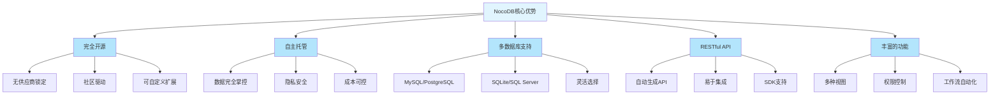

### 适用场景

- 📊 **内部工具开发**：快速构建CRM、项目管理、库存系统等
- 🔒 **数据隐私敏感**：需要自主托管，完全掌控数据
- 💰 **成本控制**：避免SaaS订阅费用，长期成本更低
- 🔧 **定制需求**：需要深度定制和扩展功能
- 👥 **团队协作**：提供完善的权限控制和协作功能
- 🚀 **快速原型**：快速验证想法，构建MVP

### 开始使用

1. **快速体验**：使用Docker一键部署
2. **生产部署**：使用Auto-upstall或Docker Compose
3. **学习API**：阅读官方文档，尝试API调用
4. **构建应用**：结合前端框架，构建完整应用
5. **加入社区**：GitHub、Discord、论坛

### 相关资源

- 🌐 [官方网站](https://nocodb.com) - 产品介绍和演示
- 📚 [官方文档](https://docs.nocodb.com) - 详细使用指南
- 💻 [GitHub仓库](https://github.com/nocodb/nocodb) - 源代码和问题追踪
- 💬 [Discord社区](https://discord.gg/5RgZmkW) - 实时交流和支持
- 🎥 [视频教程](https://www.youtube.com/@nocodb) - 官方视频教程
- 📖 [API文档](https://nocodb.com/api) - REST API参考

NocoDB让数据库管理变得简单而强大，无论你是开发者、产品经理还是数据分析师，都能从中受益。立即开始，构建属于你的智能数据库应用！

