## Skill Seekers 简介

Skill Seekers 是一个开源的文档转换工具，能够将各种来源的文档（网站文档、GitHub仓库、PDF文件）自动转换为Claude AI可以使用的技能包（Skills）。该项目在GitHub上已获得6.2k+星标，支持智能内容提取、自动分类、AI增强和冲突检测等强大功能。

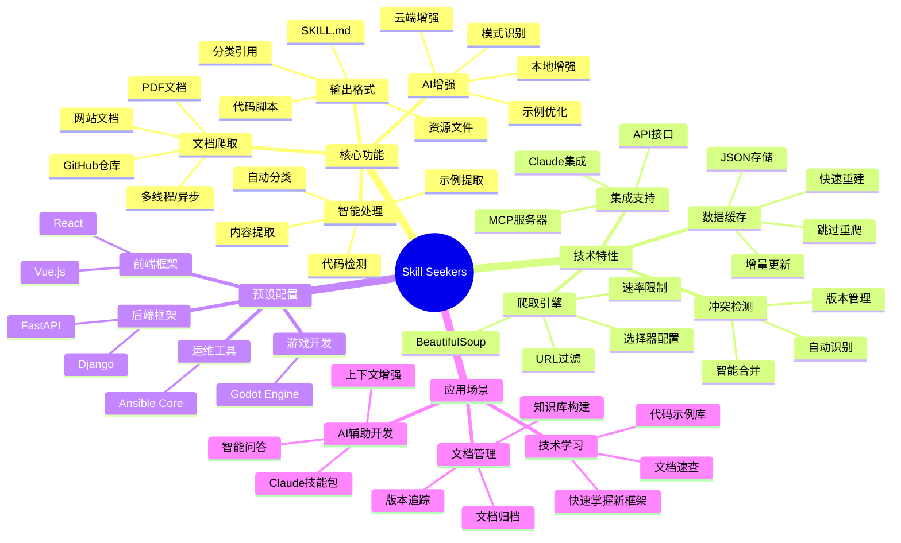

### 核心优势

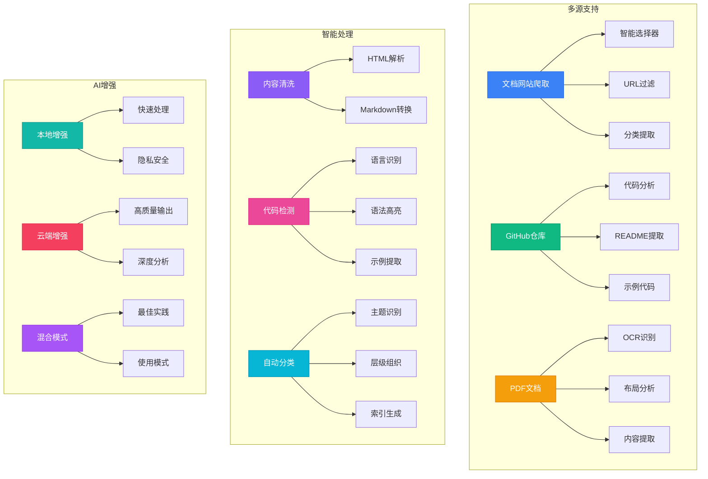

## 快速开始

### 系统要求

- **Python**: 3.8 或更高版本
- **操作系统**: Windows、macOS、Linux
- **可选**: Claude API密钥（用于云端AI增强）

### 安装步骤

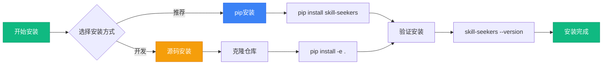

#### 方法1：使用 pip 安装（推荐）

```bash
# 安装 Skill Seekers
pip install skill-seekers

# 验证安装
skill-seekers --version
```

#### 方法2：从源码安装

```bash
# 克隆仓库
git clone https://github.com/yusufkaraaslan/Skill_Seekers.git
cd Skill_Seekers

# 安装依赖
pip install -e .

# 验证安装
skill-seekers --version
```

### 30秒快速体验

使用预设配置快速生成技能包：

```bash
# 生成 React 技能包
skill-seekers scrape --config configs/react.json

# 增强技能包（可选）
skill-seekers enhance output/react/

# 打包
skill-seekers package output/react/

# 完成！获得 react.zip
```

## 核心功能详解

### 1. 文档爬取

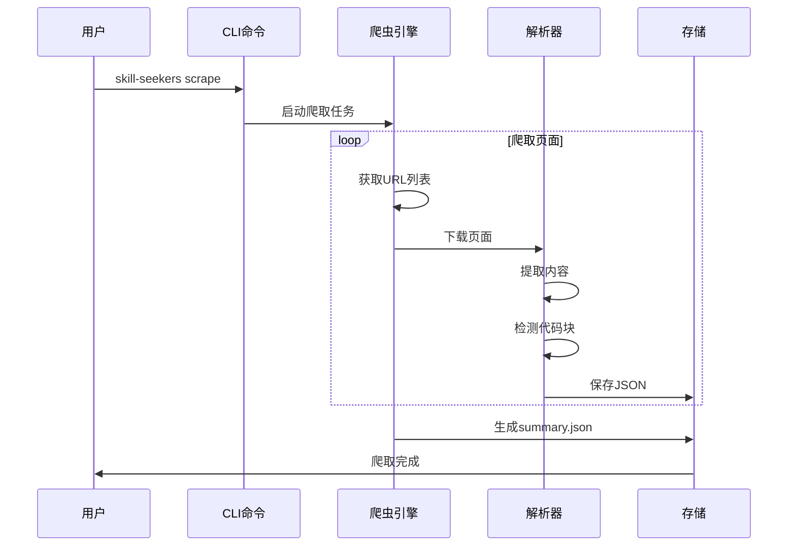

#### 基础用法

```bash
# 交互式爬取（推荐新手）
skill-seekers scrape --interactive

# 使用配置文件
skill-seekers scrape --config configs/godot.json

# 快速模式（指定URL）
skill-seekers scrape --name myframework --url https://docs.example.com/

# 带描述
skill-seekers scrape \
  --name react \
  --url https://react.dev/ \
  --description "React框架用于构建用户界面"
```

#### 高级选项

```bash
# 异步模式（2-3倍速度提升）
skill-seekers scrape --config configs/godot.json --async

# 跳过爬取（使用现有数据）
skill-seekers scrape --config configs/godot.json --skip-scrape

# 限制页面数量（测试用）
skill-seekers scrape --config configs/react.json --max-pages 50

# 自定义输出目录
skill-seekers scrape --config configs/vue.json --output ./my_skills/
```

### 2. AI增强功能

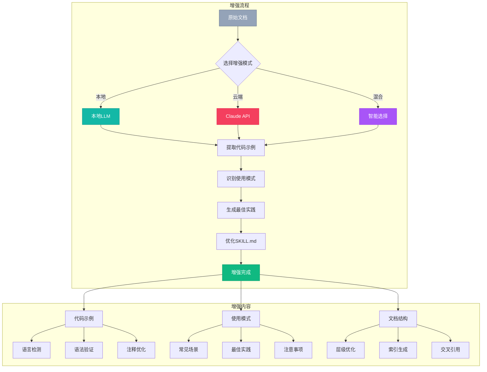

#### 本地增强（快速、免费）

```bash
# 使用本地LLM增强
skill-seekers enhance output/godot/ --local

# 指定本地模型
skill-seekers enhance output/godot/ --local --model ollama:llama2
```

**优点**：
- ⚡ 快速处理（60-120秒）
- 🔒 数据隐私安全
- 💰 完全免费
- 🌐 无需网络

**适用场景**：
- 快速原型开发
- 敏感文档处理
- 网络受限环境

#### 云端增强（高质量）

```bash
# 配置Claude API密钥
export ANTHROPIC_API_KEY='your-api-key'

# 使用Claude增强
skill-seekers enhance output/godot/

# 指定模型
skill-seekers enhance output/godot/ --model claude-3-opus-20240229
```

**优点**：
- 🎯 高质量输出
- 📊 深度分析
- 💡 智能建议
- 📝 详细文档

**适用场景**：
- 生产环境
- 重要项目
- 需要高质量文档

### 3. 配置文件详解

#### 配置文件结构

```json
{
  "name": "myframework",
  "description": "何时使用此技能的说明",
  "base_url": "https://docs.myframework.com/",
  "selectors": {
    "main_content": "article",
    "title": "h1",
    "code_blocks": "pre code",
    "navigation": "nav.sidebar"
  },
  "url_patterns": {
    "include": ["/docs", "/guide", "/api"],
    "exclude": ["/blog", "/about", "/changelog"]
  },
  "categories": {
    "getting_started": ["intro", "quickstart", "installation"],
    "core_concepts": ["concepts", "architecture", "fundamentals"],
    "api": ["api", "reference", "methods"],
    "guides": ["guide", "tutorial", "how-to"],
    "examples": ["example", "demo", "sample"]
  },
  "rate_limit": 0.5,
  "max_pages": 500,
  "user_agent": "SkillSeekersBot/1.0"
}
```

#### 选择器配置技巧

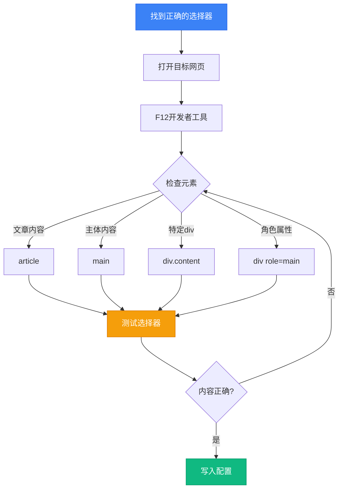

**测试选择器代码**：

```python
from bs4 import BeautifulSoup
import requests

# 测试URL
url = "https://docs.example.com/page"
soup = BeautifulSoup(requests.get(url).content, 'html.parser')

# 尝试不同的选择器
print("article:", soup.select_one('article'))
print("main:", soup.select_one('main'))
print("div[role='main']:", soup.select_one('div[role="main"]'))
print("div.content:", soup.select_one('div.content'))

# 检查代码块
code_blocks = soup.select('pre code')
print(f"找到 {len(code_blocks)} 个代码块")
```

### 4. 预设配置使用

Skill Seekers 提供了多个常用框架的预设配置：

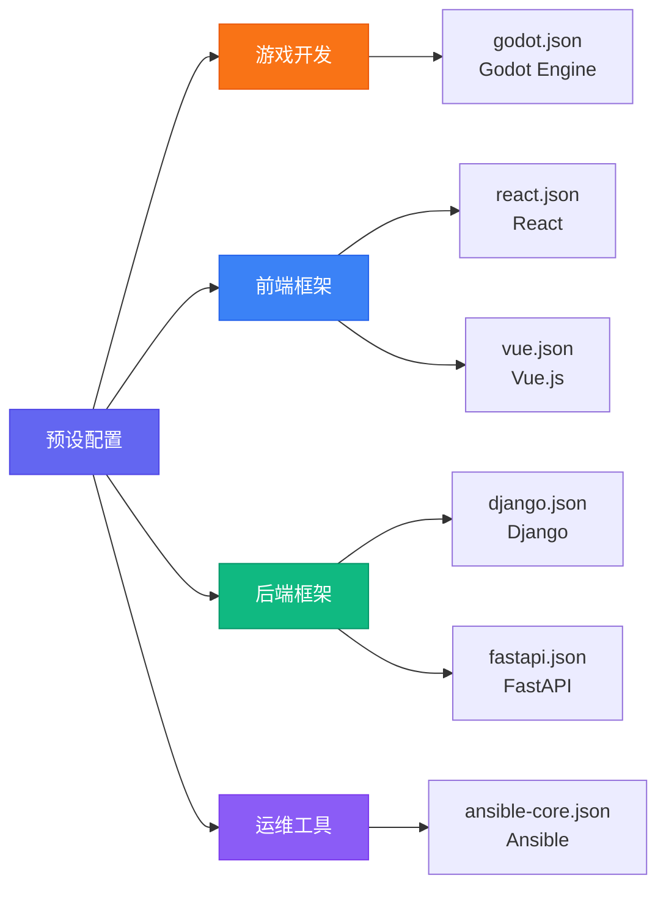

#### 使用预设配置

```bash
# Godot Engine
skill-seekers scrape --config configs/godot.json

# React
skill-seekers scrape --config configs/react.json

# Vue.js
skill-seekers scrape --config configs/vue.json

# Django
skill-seekers scrape --config configs/django.json

# FastAPI
skill-seekers scrape --config configs/fastapi.json

# Ansible Core
skill-seekers scrape --config configs/ansible-core.json
```

#### 自定义配置

```bash
# 方法1：复制并编辑预设
cp configs/react.json configs/myframework.json
nano configs/myframework.json

# 方法2：交互式创建
skill-seekers scrape --interactive
# 程序会引导你创建配置

# 使用自定义配置
skill-seekers scrape --config configs/myframework.json
```

## 完整工作流程

### 方法1：标准流程（带AI增强）

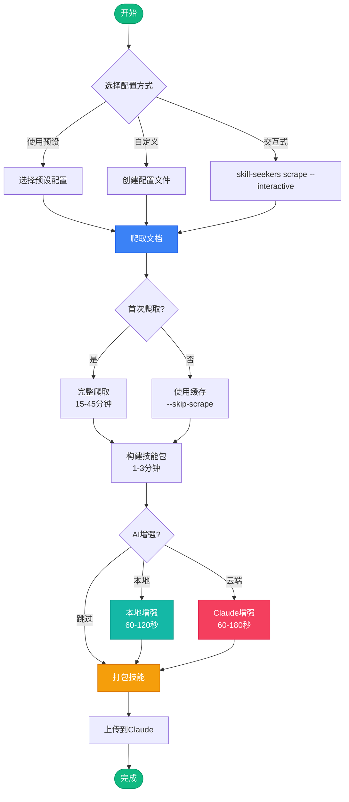

**完整命令序列**：

```bash
# 步骤1：爬取文档（首次）
skill-seekers scrape --config configs/godot.json
# 预计时间：20-40分钟

# 步骤2：AI增强（推荐）
skill-seekers enhance output/godot/
# 预计时间：60-120秒

# 步骤3：打包
skill-seekers package output/godot/
# 预计时间：5-10秒

# 步骤4：上传到Claude
# 在Claude中上传 output/godot.zip
```

### 方法2：快速流程（使用缓存）

```bash
# 步骤1：使用现有数据重建
skill-seekers scrape --config configs/godot.json --skip-scrape
# 预计时间：1-3分钟

# 步骤2：增强
skill-seekers enhance output/godot/ --local
# 预计时间：60秒

# 步骤3：打包
skill-seekers package output/godot/
# 预计时间：5-10秒

# 总计：2-4分钟
```

### 方法3：基础流程（无增强）

```bash
# 一步完成
skill-seekers scrape --config configs/godot.json
skill-seekers package output/godot/

# 注意：SKILL.md将使用基础模板
```

## 实际应用示例

### 示例1：为React项目创建技能包

```bash
# 1. 爬取React文档
skill-seekers scrape --config configs/react.json

# 输出结构：
# output/react_data/        # 原始数据
# ├── pages/               # 每个页面的JSON
# │   ├── page_001.json
# │   ├── page_002.json
# │   └── ...
# └── summary.json         # 爬取摘要
#
# output/react/            # 技能包
# ├── SKILL.md            # 主文档
# ├── references/         # 分类引用
# │   ├── index.md
# │   ├── getting_started.md
# │   ├── hooks.md
# │   ├── components.md
# │   └── api.md
# ├── scripts/            # 脚本目录
# └── assets/             # 资源目录

# 2. 增强技能包
skill-seekers enhance output/react/ --model claude-3-5-sonnet-20241022

# 增强内容：
# ✓ 提取真实代码示例
# ✓ 识别使用模式
# ✓ 生成最佳实践
# ✓ 优化文档结构

# 3. 打包
skill-seekers package output/react/
# 生成：output/react.zip

# 4. 上传到Claude
# 在Claude项目设置中上传react.zip
```

### 示例2：处理大型文档（10K+页面）

```bash
# 1. 首次爬取（使用异步模式）
skill-seekers scrape \
  --config configs/large-docs.json \
  --async \
  --max-workers 10

# 2. 监控进度
tail -f output/large_framework_data/scraping.log

# 3. 分批增强（避免超时）
skill-seekers enhance output/large_framework/ \
  --batch-size 50 \
  --local

# 4. 打包
skill-seekers package output/large_framework/
```

### 示例3：创建自定义框架技能包

```bash
# 1. 交互式创建配置
skill-seekers scrape --interactive

# 问答示例：
# ? 框架名称: MyAwesomeFramework
# ? 文档URL: https://docs.myframework.com/
# ? 描述: A modern web framework for Python
# ? 主内容选择器: article.content
# ? 包含路径（逗号分隔）: /docs,/guide,/api
# ? 排除路径（逗号分隔）: /blog,/about
# ? 最大页面数: 300

# 2. 配置会自动保存到：
# configs/myawesomeframework.json

# 3. 测试小规模爬取
skill-seekers scrape \
  --config configs/myawesomeframework.json \
  --max-pages 20

# 4. 检查输出质量
cat output/myawesomeframework/references/index.md

# 5. 满意后进行完整爬取
skill-seekers scrape --config configs/myawesomeframework.json

# 6. 增强并打包
skill-seekers enhance output/myawesomeframework/
skill-seekers package output/myawesomeframework/
```

### 示例4：GitHub仓库转技能包

```bash
# 1. 爬取GitHub仓库
skill-seekers scrape \
  --name awesome-repo \
  --url https://github.com/username/repo \
  --description "Awesome project description"

# 自动提取：
# ✓ README.md
# ✓ Wiki页面
# ✓ 文档目录
# ✓ 代码示例
# ✓ API文档

# 2. 增强
skill-seekers enhance output/awesome-repo/ --local

# 3. 打包
skill-seekers package output/awesome-repo/
```

### 示例5：更新现有技能包

```bash
# 1. 删除旧数据
rm -rf output/react_data/

# 2. 重新爬取
skill-seekers scrape --config configs/react.json --async

# 3. 重新增强
skill-seekers enhance output/react/

# 4. 重新打包
skill-seekers package output/react/

# 5. 版本对比
diff output/react.zip output/react.old.zip
```

## 输出结构详解

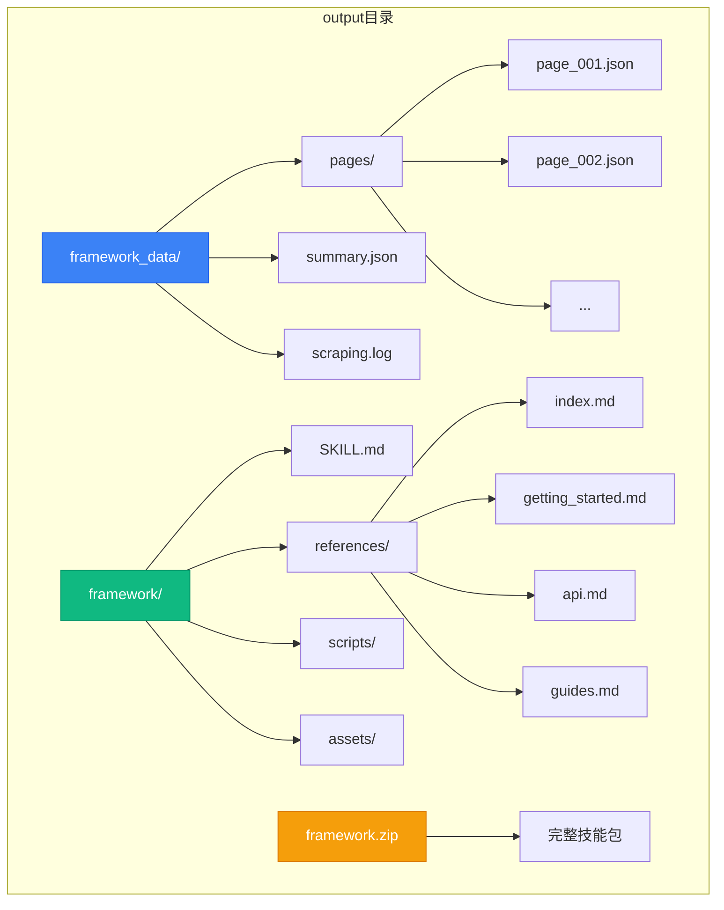

### 文件说明

#### 1. framework_data/ - 原始数据

**pages/*.json** - 每个页面的结构化数据：
```json
{
  "url": "https://docs.example.com/page",
  "title": "页面标题",
  "content": "提取的内容...",
  "code_blocks": [
    {
      "language": "python",
      "code": "def hello():\n    print('Hello')"
    }
  ],
  "category": "getting_started",
  "timestamp": "2026-03-01T10:00:00Z"
}
```

**summary.json** - 爬取摘要：
```json
{
  "total_pages": 150,
  "categories": {
    "getting_started": 10,
    "api": 45,
    "guides": 60,
    "examples": 35
  },
  "code_blocks": 380,
  "scrape_time": "2026-03-01T10:00:00Z",
  "duration": "1234.56"
}
```

#### 2. framework/ - 技能包

**SKILL.md** - 主技能文档（增强版示例）：
```markdown
# MyFramework Skill

## Overview
MyFramework is a modern web framework...

## When to Use This Skill
Use this skill when:
- Building web applications with Python
- Need fast API development
- Require async support

## Key Concepts

### Core Architecture
[从文档中提取的真实示例]

### Request Handling
```python
from myframework import App

app = App()

@app.route('/')
async def hello(request):
    return {'message': 'Hello World'}
```

## Common Patterns

### Pattern 1: API Endpoints
[真实使用模式]

### Pattern 2: Database Integration
[最佳实践示例]

## References
See the references/ directory for detailed documentation.
```

**references/** - 分类文档：
- `index.md` - 目录和概述
- `getting_started.md` - 入门指南
- `core_concepts.md` - 核心概念
- `api.md` - API参考
- `guides.md` - 使用指南
- `examples.md` - 示例代码

## 高级特性

### 1. 冲突检测

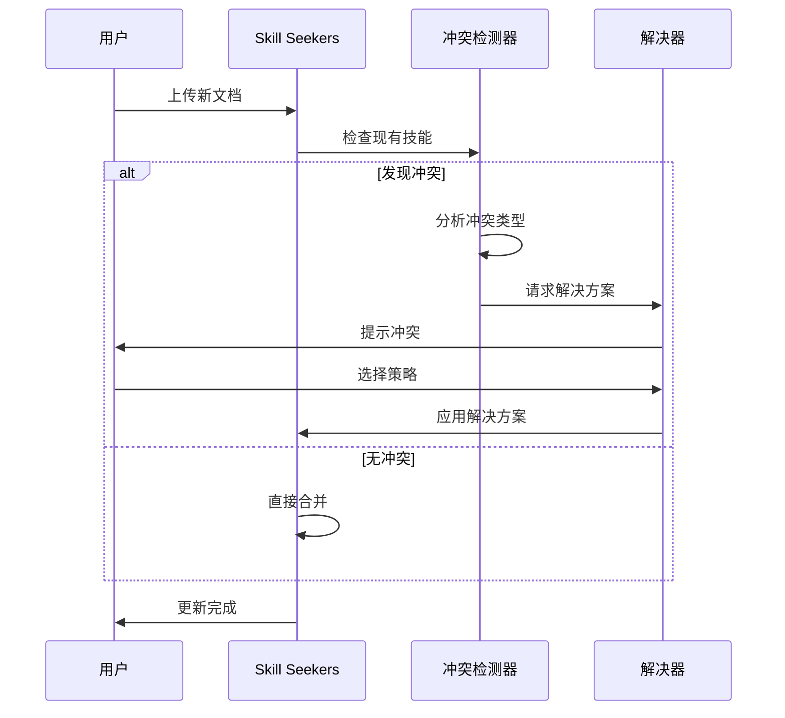

**冲突类型**：
- **命名冲突**：相同名称的不同技能
- **版本冲突**：同一技能的不同版本
- **内容冲突**：重复或矛盾的内容

**解决策略**：
```bash
# 自动合并
skill-seekers merge --auto

# 交互式解决
skill-seekers merge --interactive

# 保留所有版本
skill-seekers merge --keep-all

# 使用最新版本
skill-seekers merge --use-latest
```

### 2. MCP集成

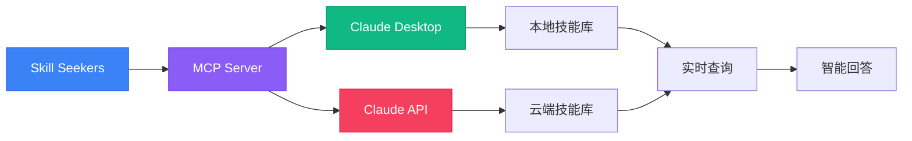

**配置MCP服务器**：

```bash
# 1. 安装MCP支持
pip install skill-seekers[mcp]

# 2. 启动MCP服务器
skill-seekers mcp start --port 3000

# 3. 配置Claude Desktop
# 编辑 ~/Library/Application Support/Claude/claude_desktop_config.json
```

**claude_desktop_config.json**：
```json
{
  "mcpServers": {
    "skill-seekers": {
      "command": "skill-seekers",
      "args": ["mcp", "serve"],
      "env": {
        "SKILLS_PATH": "/path/to/output/"
      }
    }
  }
}
```

### 3. API使用

```python
from skill_seekers import SkillBuilder, Enhancer

# 创建技能构建器
builder = SkillBuilder(
    name="myframework",
    base_url="https://docs.example.com/"
)

# 配置爬取选项
builder.configure(
    selectors={
        "main_content": "article",
        "title": "h1"
    },
    url_patterns={
        "include": ["/docs"],
        "exclude": ["/blog"]
    }
)

# 执行爬取
builder.scrape(async_mode=True, max_pages=500)

# 增强技能
enhancer = Enhancer(model="claude-3-5-sonnet-20241022")
enhancer.enhance(builder.output_dir)

# 打包
builder.package()

print(f"技能包已生成：{builder.package_path}")
```

## 性能优化

### 爬取性能对比


### 优化建议

```bash
# 1. 使用异步模式
skill-seekers scrape --config configs/large.json --async

# 2. 增加工作线程
skill-seekers scrape --config configs/large.json --max-workers 16

# 3. 启用缓存
skill-seekers scrape --config configs/large.json --cache

# 4. 分批处理
skill-seekers scrape --config configs/large.json --batch-size 100

# 5. 跳过已爬取的页面
skill-seekers scrape --config configs/large.json --resume
```

### 性能对比表

| 任务           | 同步模式    | 多线程模式  | 异步模式   |
| -------------- | ----------- | ----------- | ---------- |
| 爬取（500页）  | 15-45分钟   | 10-30分钟   | 5-15分钟   |
| 构建技能包     | 1-3分钟     | 1-3分钟     | 1-3分钟    |
| 本地增强       | 60-120秒    | 60-120秒    | 60-120秒   |
| 云端增强       | 60-180秒    | 60-180秒    | 60-180秒   |
| 打包           | 5-10秒      | 5-10秒      | 5-10秒     |
| **总计**       | **20-50分** | **15-40分** | **10-25分**|

## 最佳实践

### 1. 配置优化

```json
{
  "name": "optimized-config",
  "selectors": {
    "main_content": "article.doc-content",
    "title": "h1.page-title",
    "code_blocks": "pre code[class*='language-']",
    "navigation": "nav.sidebar",
    "breadcrumbs": "nav.breadcrumb"
  },
  "url_patterns": {
    "include": [
      "/docs/",
      "/guide/",
      "/api/",
      "/tutorial/"
    ],
    "exclude": [
      "/blog/",
      "/news/",
      "/about/",
      "/changelog/",
      "/*.pdf",
      "/*.zip"
    ]
  },
  "categories": {
    "getting_started": [
      "introduction",
      "quickstart",
      "installation",
      "setup",
      "getting-started"
    ],
    "core_concepts": [
      "concept",
      "architecture",
      "fundamental",
      "core",
      "principle"
    ],
    "api_reference": [
      "api",
      "reference",
      "method",
      "class",
      "function"
    ],
    "guides": [
      "guide",
      "tutorial",
      "how-to",
      "walkthrough",
      "example"
    ],
    "advanced": [
      "advanced",
      "expert",
      "optimization",
      "performance",
      "internals"
    ]
  },
  "rate_limit": 0.5,
  "max_pages": 1000,
  "timeout": 30,
  "retry_attempts": 3,
  "user_agent": "SkillSeekersBot/1.0 (+https://github.com/yusufkaraaslan/Skill_Seekers)"
}
```

### 2. 增量更新策略

```bash
# 1. 首次完整爬取
skill-seekers scrape --config configs/framework.json

# 2. 每周增量更新
skill-seekers scrape --config configs/framework.json --incremental

# 3. 只更新变化的页面
skill-seekers scrape --config configs/framework.json --check-modified

# 4. 重新增强
skill-seekers enhance output/framework/ --force

# 5. 版本管理
skill-seekers package output/framework/ --version 2.0.0
```

### 3. 质量检查清单

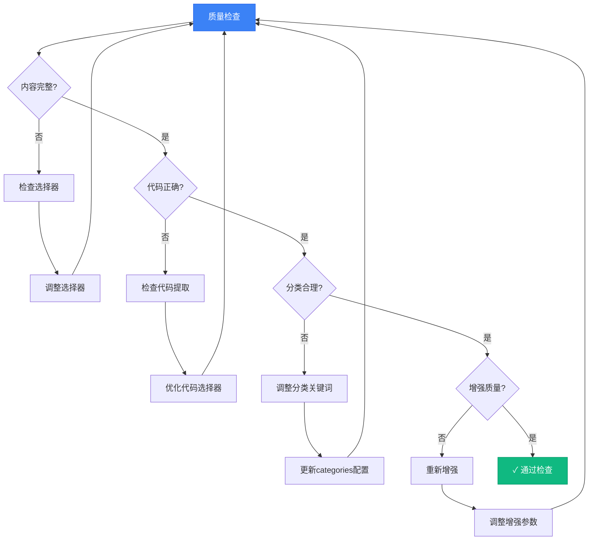

**检查命令**：

```bash
# 1. 检查爬取质量
skill-seekers validate output/framework_data/

# 2. 检查内容完整性
skill-seekers check output/framework/ --completeness

# 3. 检查代码块
skill-seekers check output/framework/ --code-blocks

# 4. 生成质量报告
skill-seekers report output/framework/
```

### 4. 团队协作

```bash
# 1. 提交配置文件到Git
git add configs/myframework.json
git commit -m "Add MyFramework configuration"

# 2. 忽略输出目录
echo "output/" >> .gitignore

# 3. 分享配置
git push origin main

# 4. 团队成员使用
git pull
skill-seekers scrape --config configs/myframework.json
```

## 故障排除

### 常见问题

#### 1. 无法提取内容

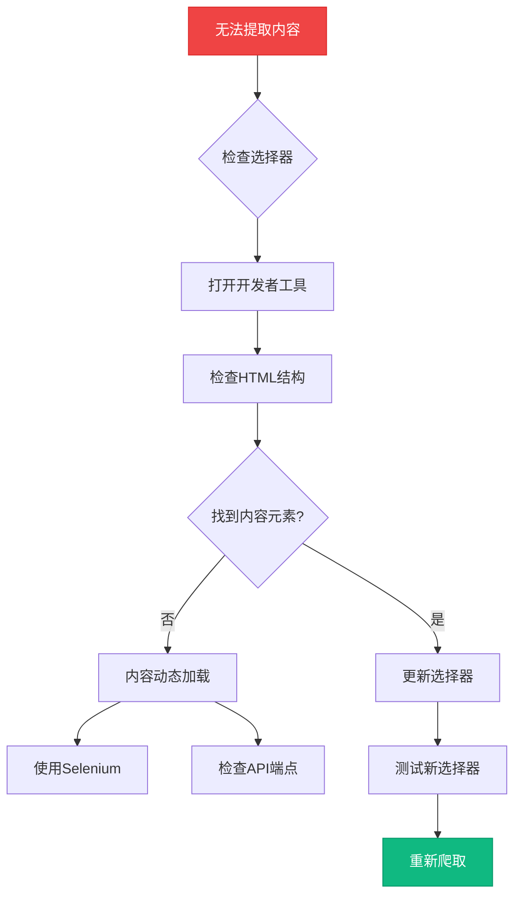

**解决方法**：

```python
# 测试选择器
from bs4 import BeautifulSoup
import requests

url = "https://docs.example.com/page"
response = requests.get(url)
soup = BeautifulSoup(response.content, 'html.parser')

# 尝试不同的选择器
selectors = [
    'article',
    'main',
    'div[role="main"]',
    'div.content',
    'div#main-content',
    '.documentation-content'
]

for selector in selectors:
    element = soup.select_one(selector)
    if element:
        print(f"✓ {selector}: {len(element.text)} 字符")
    else:
        print(f"✗ {selector}: 未找到")
```

#### 2. 爬取速度慢

**原因分析**：
- ❌ 速率限制过严格
- ❌ 同步模式
- ❌ 单线程
- ❌ 网络延迟

**解决方案**：

```bash
# 1. 使用异步模式
skill-seekers scrape --config configs/slow.json --async

# 2. 增加工作线程
skill-seekers scrape --config configs/slow.json --max-workers 16

# 3. 调整速率限制
# 在配置文件中：
{
  "rate_limit": 0.1  # 从0.5减少到0.1
}

# 4. 使用代理池（如果被限制）
skill-seekers scrape --config configs/slow.json --proxy-list proxies.txt
```

#### 3. 增强失败

**错误信息**：
```
Error: API rate limit exceeded
Error: Model not found
Error: Connection timeout
```

**解决方案**：

```bash
# 1. 检查API密钥
echo $ANTHROPIC_API_KEY

# 2. 切换到本地增强
skill-seekers enhance output/framework/ --local

# 3. 使用不同的模型
skill-seekers enhance output/framework/ --model claude-3-haiku-20240307

# 4. 分批处理
skill-seekers enhance output/framework/ --batch-size 10 --delay 5

# 5. 重试失败的部分
skill-seekers enhance output/framework/ --retry-failed
```

#### 4. 包大小过大

**问题**：生成的zip文件超过25MB（Claude限制）

**解决方案**：

```bash
# 1. 检查大小
du -sh output/framework/

# 2. 清理不必要的文件
skill-seekers clean output/framework/ --remove-images

# 3. 压缩代码块
skill-seekers optimize output/framework/ --compress-code

# 4. 分割成多个技能包
skill-seekers split output/framework/ --max-size 20MB

# 5. 只包含关键内容
skill-seekers package output/framework/ --essential-only
```

### 调试模式

```bash
# 启用详细日志
skill-seekers scrape --config configs/debug.json --verbose

# 启用调试模式
skill-seekers scrape --config configs/debug.json --debug

# 保存调试信息
skill-seekers scrape --config configs/debug.json --debug --log-file debug.log

# 查看日志
tail -f debug.log
```

## 社区资源

### 官方资源

- **GitHub仓库**: [github.com/yusufkaraaslan/Skill_Seekers](https://github.com/yusufkaraaslan/Skill_Seekers)
- **文档**: 查看README和docs目录
- **问题追踪**: GitHub Issues
- **讨论区**: GitHub Discussions

### 统计数据

- ⭐ **GitHub星标**: 6.2k+
- 🍴 **Forks**: 634
- 👥 **贡献者**: 25+
- 📦 **预设配置**: 6个主流框架
- 📝 **许可证**: MIT

### 贡献指南

```bash
# 1. Fork仓库
# 访问 GitHub 点击 Fork

# 2. 克隆你的Fork
git clone https://github.com/YOUR_USERNAME/Skill_Seekers.git
cd Skill_Seekers

# 3. 创建特性分支
git checkout -b feature/awesome-feature

# 4. 提交更改
git add .
git commit -m "Add awesome feature"

# 5. 推送到Fork
git push origin feature/awesome-feature

# 6. 创建Pull Request
# 访问GitHub创建PR
```

## 实用技巧汇总

### 快速参考卡片

```bash
# ========== 基础命令 ==========

# 交互式创建
skill-seekers scrape --interactive

# 使用预设
skill-seekers scrape --config configs/react.json

# 快速模式
skill-seekers scrape --name myfw --url https://docs.example.com/

# ========== 高级选项 ==========

# 异步爬取（快速）
skill-seekers scrape --config configs/fw.json --async

# 跳过爬取（使用缓存）
skill-seekers scrape --config configs/fw.json --skip-scrape

# 限制页面（测试）
skill-seekers scrape --config configs/fw.json --max-pages 20

# ========== 增强 ==========

# 本地增强（快速/免费）
skill-seekers enhance output/fw/ --local

# Claude增强（高质量）
skill-seekers enhance output/fw/

# 指定模型
skill-seekers enhance output/fw/ --model claude-3-opus-20240229

# ========== 打包 ==========

# 基础打包
skill-seekers package output/fw/

# 带版本号
skill-seekers package output/fw/ --version 1.0.0

# 只包含核心内容
skill-seekers package output/fw/ --essential-only

# ========== 维护 ==========

# 增量更新
skill-seekers scrape --config configs/fw.json --incremental

# 清理旧数据
rm -rf output/fw_data/

# 验证质量
skill-seekers validate output/fw_data/

# 生成报告
skill-seekers report output/fw/
```

### 配置模板

```json
{
  "name": "{{ FRAMEWORK_NAME }}",
  "description": "{{ WHEN_TO_USE }}",
  "base_url": "{{ DOCS_URL }}",
  "selectors": {
    "main_content": "article",
    "title": "h1",
    "code_blocks": "pre code"
  },
  "url_patterns": {
    "include": ["/docs", "/guide"],
    "exclude": ["/blog", "/about"]
  },
  "categories": {
    "getting_started": ["intro", "quickstart"],
    "api": ["api", "reference"],
    "guides": ["guide", "tutorial"]
  },
  "rate_limit": 0.5,
  "max_pages": 500
}
```

## 总结

Skill Seekers 是一个功能强大的工具，能够帮助你快速将任何技术文档转换为Claude AI可以理解和使用的技能包。通过合理配置和使用，你可以：

✅ **快速学习新技术** - 让AI帮你理解复杂文档  
✅ **提高开发效率** - AI助手具备项目相关知识  
✅ **构建知识库** - 系统化管理技术文档  
✅ **团队协作** - 分享配置和技能包  
✅ **持续更新** - 轻松同步最新文档  

### 推荐工作流程

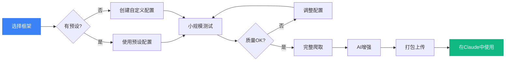

### 下一步

1. 🚀 **立即开始**: 使用预设配置体验
2. 📚 **深入学习**: 阅读官方文档
3. 🛠️ **自定义**: 为你的项目创建配置
4. 🤝 **参与贡献**: 分享你的配置文件
5. 💬 **加入社区**: GitHub Discussions

---

**相关链接**：
- [GitHub仓库](https://github.com/yusufkaraaslan/Skill_Seekers)
- [DeepWiki文档](https://deepwiki.com/yusufkaraaslan/Skill_Seekers)
- [Claude AI](https://claude.ai)

**许可证**: MIT License  
**作者**: Yusuf Karaaslan 及社区贡献者

Happy Skill Building! 🎉

