## A2UI 简介

A2UI (Agent-to-User Interface) 是 Google 推出的开源项目，它为 AI Agent 提供了一种安全、高效的方式来生成和更新用户界面。与直接生成代码不同，A2UI 采用声明式 JSON 格式描述 UI 意图，由客户端负责渲染，实现了"像数据一样安全，像代码一样表达"的设计理念。

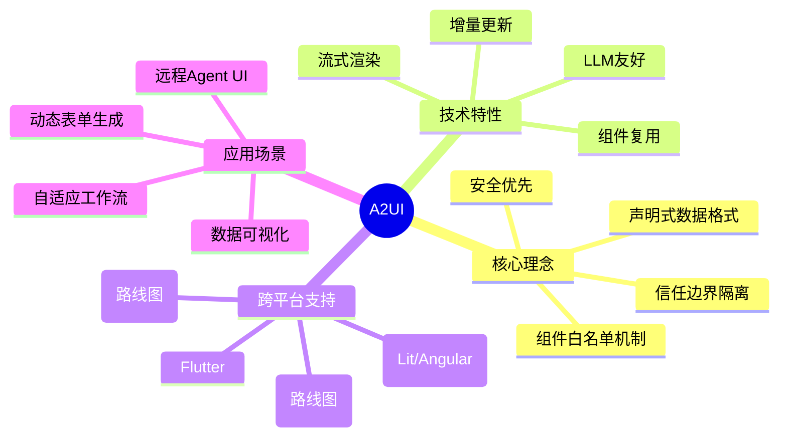

### 为什么需要 A2UI？

在 AI Agent 时代，传统的 UI 生成方式面临诸多挑战：

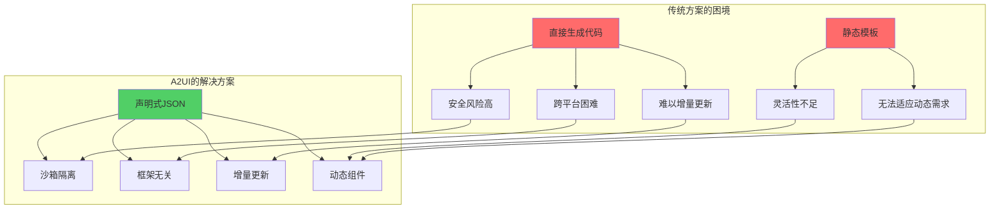

## 核心概念

### 架构设计

A2UI 采用分离式架构，将 UI 生成与 UI 执行完全解耦：

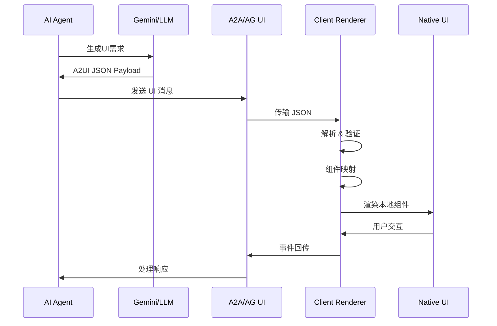

### 协议版本

A2UI 目前有两个版本：

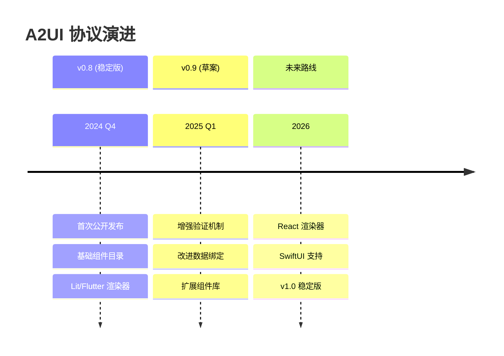

### 组件模型

A2UI 采用扁平化组件模型，便于 LLM 生成和增量更新：

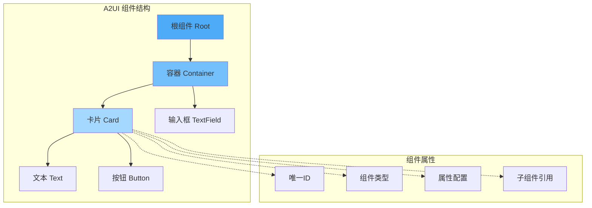

## 安全模型

A2UI 的安全性是其核心设计原则：

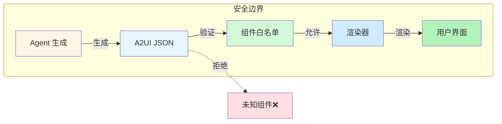

关键安全特性：

1. **组件白名单机制**：只能使用预定义的组件
2. **数据格式验证**：严格的 JSON Schema 验证
3. **沙箱隔离**：Agent 代码不在客户端执行
4. **信任边界清晰**：客户端完全控制渲染逻辑

## 快速开始

### 环境准备

```bash
# 克隆仓库
git clone https://github.com/google/A2UI.git
cd A2UI

# 设置 Gemini API Key
export GEMINI_API_KEY="your_gemini_api_key"
```

### 运行餐厅查找示例

这是一个完整的端到端示例，展示了 Agent 如何生成动态 UI：

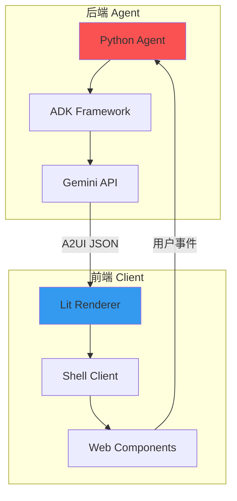

#### 1. 启动后端 Agent

```bash
# 进入 Agent 目录
cd samples/agent/adk/restaurant_finder

# 使用 uv 运行
uv run .
```

#### 2. 启动前端 Client

```bash
# 新建终端窗口

# 构建 Lit 渲染器
cd renderers/lit
npm install
npm run build

# 运行 Shell 客户端
cd ../../samples/client/lit/shell
npm install
npm run dev
```

### A2UI 消息示例

以下是一个典型的 A2UI JSON 消息结构：

```json
{
  "components": [
    {
      "id": "root",
      "type": "column",
      "children": ["card-1", "button-1"]
    },
    {
      "id": "card-1",
      "type": "card",
      "properties": {
        "title": "餐厅推荐",
        "subtitle": "根据您的偏好生成"
      },
      "children": ["text-1"]
    },
    {
      "id": "text-1",
      "type": "text",
      "properties": {
        "value": "我们为您推荐以下餐厅..."
      }
    },
    {
      "id": "button-1",
      "type": "button",
      "properties": {
        "label": "查看更多",
        "eventId": "load-more"
      }
    }
  ],
  "dataModel": {
    "restaurants": [
      {"name": "Restaurant A", "rating": 4.5},
      {"name": "Restaurant B", "rating": 4.8}
    ]
  }
}
```

## Agent 开发指南

### 使用 Python ADK 构建 Agent

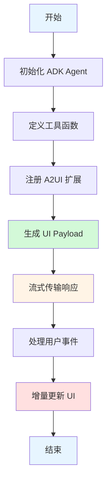

#### Python Agent 示例

```python
from google.genai.agents import Agent
from google.genai.a2ui import A2UIExtension

# 创建 Agent
agent = Agent(
    model="gemini-2.0-flash-exp",
    system_instruction="""
    你是一个餐厅推荐助手。
    使用 A2UI 组件创建美观的用户界面。
    支持的组件：card, button, text-field, column, row
    """
)

# 注册 A2UI 扩展
agent.register_extension(A2UIExtension())

# 定义工具函数
@agent.tool
def search_restaurants(cuisine: str, location: str) -> list:
    """搜索餐厅"""
    # 实现搜索逻辑
    return [
        {"name": "Restaurant A", "rating": 4.5},
        {"name": "Restaurant B", "rating": 4.8}
    ]

# 处理用户请求
async def handle_request(user_message: str):
    response = await agent.generate_content(
        user_message,
        stream=True
    )
    
    async for chunk in response:
        if chunk.a2ui_payload:
            # 发送 UI 更新
            yield chunk.a2ui_payload
```

### 增量更新机制

A2UI 支持高效的增量更新，无需重新渲染整个 UI：

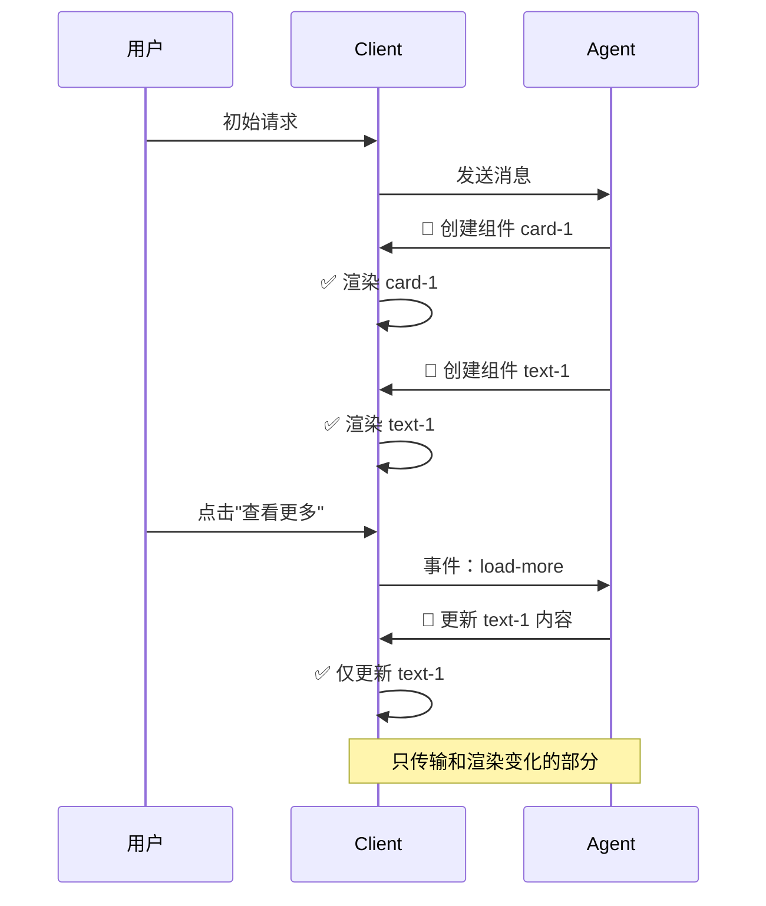

## Client 渲染器开发

### Lit 渲染器架构

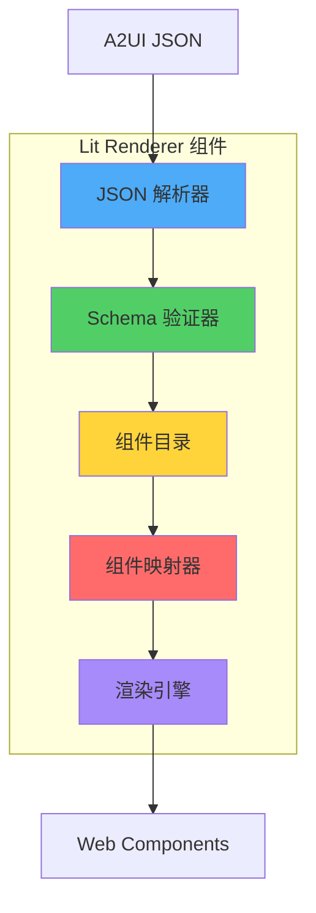

### 创建自定义组件

```typescript
import { LitElement, html, css } from 'lit';
import { customElement, property } from 'lit/decorators.js';

@customElement('a2ui-restaurant-card')
export class RestaurantCard extends LitElement {
  @property({ type: String }) name = '';
  @property({ type: Number }) rating = 0;
  @property({ type: String }) cuisine = '';
  
  static styles = css`
    :host {
      display: block;
      border: 1px solid #e0e0e0;
      border-radius: 8px;
      padding: 16px;
      margin: 8px 0;
    }
    
    .name {
      font-size: 18px;
      font-weight: bold;
      margin-bottom: 8px;
    }
    
    .rating {
      color: #f59e0b;
    }
  `;
  
  render() {
    return html`
      <div class="card">
        <div class="name">${this.name}</div>
        <div class="rating">⭐ ${this.rating}</div>
        <div class="cuisine">${this.cuisine}</div>
      </div>
    `;
  }
}

// 注册到 A2UI 目录
import { registerComponent } from '@a2ui/renderer-lit';

registerComponent('restaurant-card', RestaurantCard);
```

### 数据绑定示例

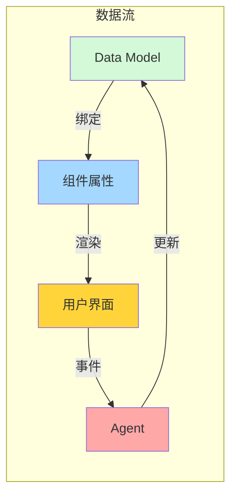

使用数据绑定的 JSON 示例：

```json
{
  "components": [
    {
      "id": "text-1",
      "type": "text",
      "properties": {
        "value": "{{dataModel.restaurantName}}"
      }
    }
  ],
  "dataModel": {
    "restaurantName": "Golden Dragon"
  }
}
```

## 标准组件目录

A2UI v0.8 提供的标准组件：

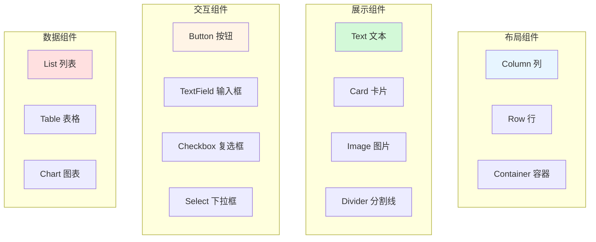

### 组件使用示例

#### Card 卡片组件

```json
{
  "id": "card-1",
  "type": "card",
  "properties": {
    "title": "餐厅详情",
    "subtitle": "查看完整信息",
    "elevation": 2,
    "padding": "16px"
  },
  "children": ["content-1"]
}
```

#### Button 按钮组件

```json
{
  "id": "button-1",
  "type": "button",
  "properties": {
    "label": "预订餐厅",
    "variant": "contained",
    "color": "primary",
    "eventId": "book-restaurant",
    "disabled": false
  }
}
```

#### TextField 输入框组件

```json
{
  "id": "input-1",
  "type": "text-field",
  "properties": {
    "label": "餐厅名称",
    "placeholder": "请输入餐厅名称",
    "value": "{{dataModel.searchQuery}}",
    "required": true,
    "eventId": "search-changed"
  }
}
```

## 实战案例

### 案例 1：动态表单生成

Agent 根据用户需求动态生成预订表单：

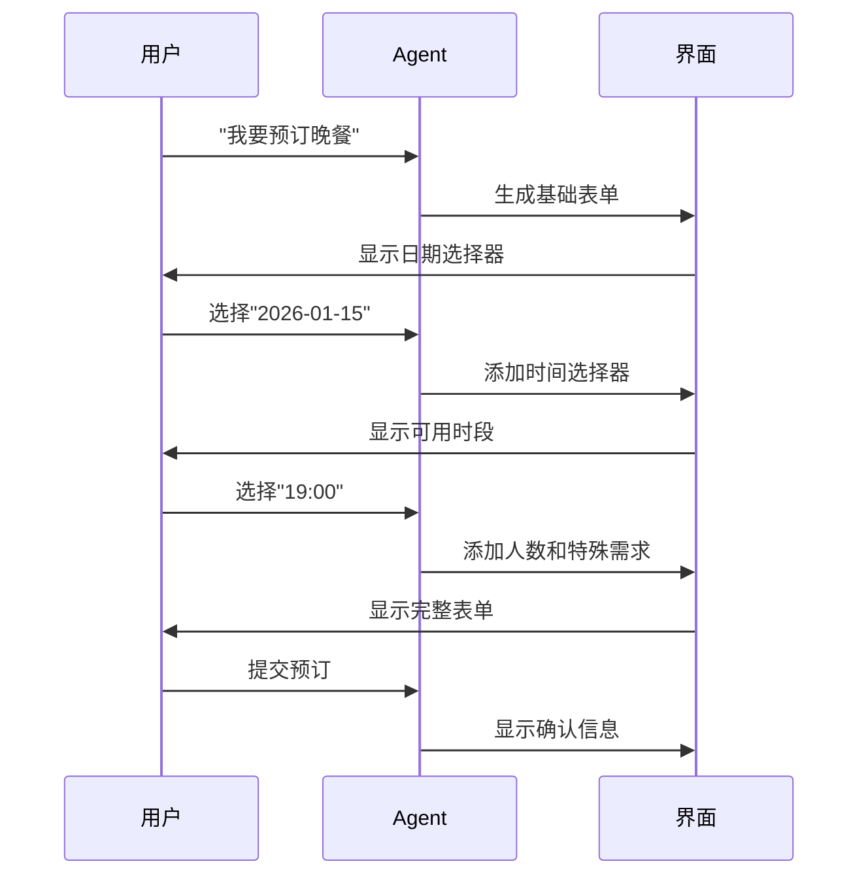

对应的 A2UI 实现：

```python
@agent.tool
async def create_booking_form(date: str = None):
    """创建动态预订表单"""
    components = [
        {
            "id": "form-container",
            "type": "column",
            "children": ["date-picker"]
        },
        {
            "id": "date-picker",
            "type": "date-picker",
            "properties": {
                "label": "选择日期",
                "value": date,
                "eventId": "date-selected"
            }
        }
    ]
    
    # 如果已选择日期，添加时间选择器
    if date:
        components[0]["children"].append("time-picker")
        components.append({
            "id": "time-picker",
            "type": "select",
            "properties": {
                "label": "选择时间",
                "options": ["18:00", "19:00", "20:00"],
                "eventId": "time-selected"
            }
        })
    
    return {"components": components}
```

### 案例 2：数据可视化仪表板

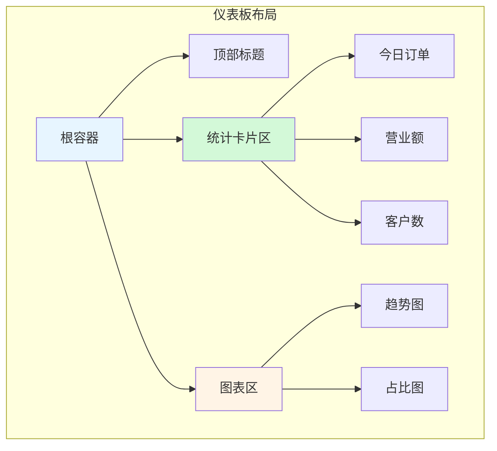

A2UI JSON 结构：

```json
{
  "components": [
    {
      "id": "dashboard",
      "type": "column",
      "properties": {
        "spacing": "16px"
      },
      "children": ["header", "stats-row", "charts-row"]
    },
    {
      "id": "stats-row",
      "type": "row",
      "properties": {
        "spacing": "16px"
      },
      "children": ["stat-1", "stat-2", "stat-3"]
    },
    {
      "id": "stat-1",
      "type": "card",
      "properties": {
        "title": "今日订单",
        "value": "{{dataModel.todayOrders}}",
        "icon": "shopping_cart"
      }
    }
  ],
  "dataModel": {
    "todayOrders": 128,
    "revenue": 45600,
    "customers": 89
  }
}
```

### 案例 3：多 Agent 协作

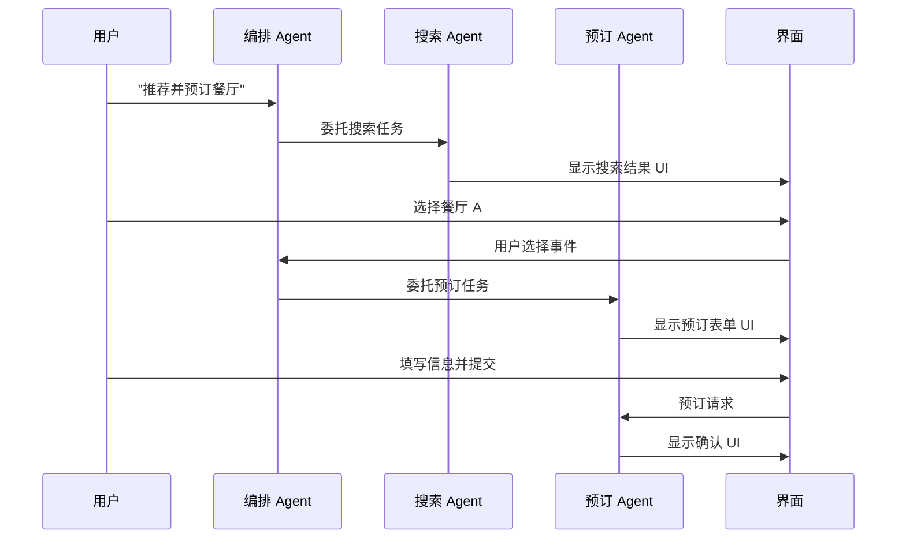

## 传输协议集成

### A2A 协议集成

A2UI 可以通过 A2A (Agent-to-Agent) 协议传输：

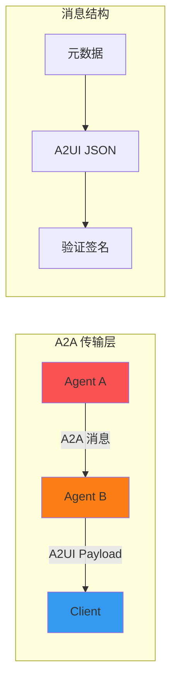

### AG UI 集成

```typescript
import { AgUiClient } from '@a2ui/ag-ui';

const client = new AgUiClient({
  endpoint: 'wss://agent-server.example.com',
  onMessage: (a2uiPayload) => {
    // 渲染 A2UI
    renderer.render(a2uiPayload);
  }
});

// 发送用户事件
client.sendEvent({
  eventId: 'button-clicked',
  data: { buttonId: 'submit-btn' }
});
```

## 性能优化

### 增量渲染优化

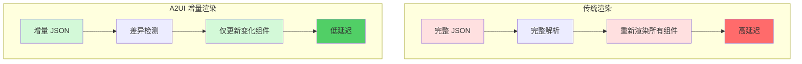

### 组件缓存策略

```typescript
class A2UIRenderer {
  private componentCache = new Map();
  
  render(payload: A2UIPayload) {
    for (const component of payload.components) {
      const cached = this.componentCache.get(component.id);
      
      if (cached && this.isSame(cached, component)) {
        // 跳过未改变的组件
        continue;
      }
      
      // 渲染或更新组件
      this.renderComponent(component);
      this.componentCache.set(component.id, component);
    }
  }
}
```

## 主题和样式

### 全局主题配置

```typescript
import { ThemeProvider } from '@a2ui/renderer-lit';

const theme = {
  palette: {
    primary: '#1976d2',
    secondary: '#dc004e',
    background: '#ffffff',
    text: '#000000'
  },
  typography: {
    fontFamily: '"Roboto", "Helvetica", "Arial", sans-serif',
    fontSize: 14
  },
  spacing: {
    unit: 8
  }
};

const app = html`
  <theme-provider .theme=${theme}>
    <a2ui-renderer .payload=${a2uiPayload}></a2ui-renderer>
  </theme-provider>
`;
```

### 组件级样式

```json
{
  "id": "styled-card",
  "type": "card",
  "properties": {
    "title": "自定义样式卡片",
    "styles": {
      "backgroundColor": "#f0f9ff",
      "borderRadius": "12px",
      "padding": "24px",
      "boxShadow": "0 4px 6px rgba(0,0,0,0.1)"
    }
  }
}
```

## 最佳实践

### Agent 开发最佳实践

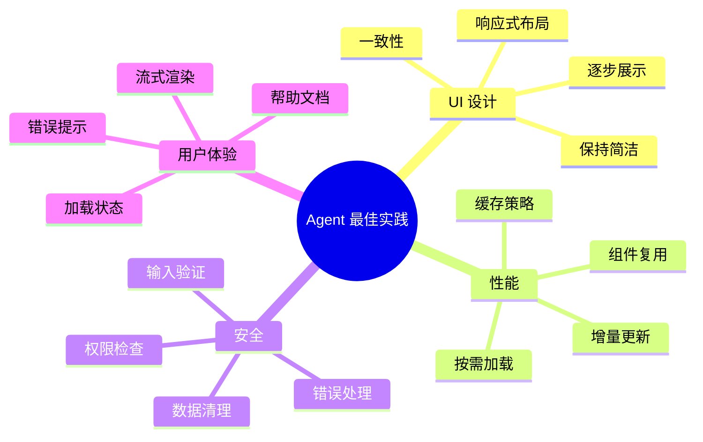

### 组件设计原则

1. **单一职责**：每个组件只做一件事
2. **可组合性**：组件可以灵活组合
3. **可重用性**：避免重复定义相似组件
4. **可扩展性**：支持自定义属性和样式

### 错误处理

```typescript
class A2UIRenderer {
  async render(payload: A2UIPayload) {
    try {
      // 验证 payload
      this.validate(payload);
      
      // 渲染组件
      await this.renderComponents(payload.components);
      
    } catch (error) {
      if (error instanceof ValidationError) {
        // 显示验证错误
        this.showError('UI 数据格式错误');
      } else if (error instanceof ComponentNotFoundError) {
        // 组件未注册
        this.showError(`未知组件: ${error.componentType}`);
      } else {
        // 其他错误
        this.showError('渲染失败');
        console.error(error);
      }
    }
  }
}
```

## 调试技巧

### 启用调试模式

```typescript
import { A2UIRenderer } from '@a2ui/renderer-lit';

const renderer = new A2UIRenderer({
  debug: true,
  logger: {
    log: (message, data) => console.log(message, data),
    warn: (message, data) => console.warn(message, data),
    error: (message, data) => console.error(message, data)
  }
});
```

### 可视化 UI 树

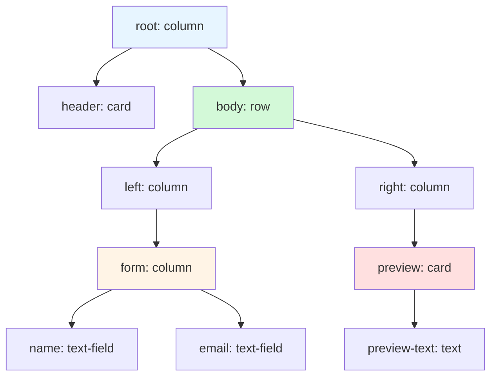

### Chrome DevTools 集成

```javascript
// 在浏览器控制台调试 A2UI
window.__A2UI_DEBUG__ = {
  // 查看当前渲染的组件树
  getComponentTree: () => renderer.getComponentTree(),
  
  // 查看数据模型
  getDataModel: () => renderer.getDataModel(),
  
  // 模拟事件
  triggerEvent: (eventId, data) => renderer.handleEvent(eventId, data),
  
  // 导出当前 payload
  exportPayload: () => JSON.stringify(renderer.currentPayload, null, 2)
};
```

## 迁移指南

### 从 v0.8 迁移到 v0.9

主要变化：

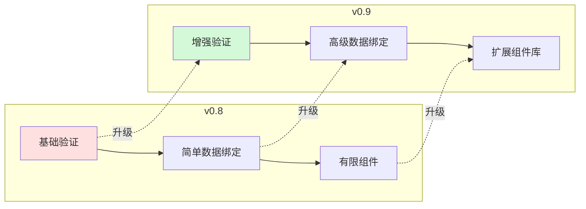

迁移步骤：

1. **更新依赖包**

```bash
npm update @a2ui/renderer-lit@latest
npm update @a2ui/types@latest
```

2. **更新组件定义**

v0.8:
```json
{
  "type": "text",
  "properties": {
    "text": "Hello"
  }
}
```

v0.9:
```json
{
  "type": "text",
  "properties": {
    "value": "Hello",
    "variant": "body1"
  }
}
```

3. **更新事件处理**

v0.8:
```typescript
renderer.on('event', (eventId, data) => { ... });
```

v0.9:
```typescript
renderer.addEventListener('a2ui-event', (event) => {
  const { eventId, data } = event.detail;
  // ...
});
```

## 社区和生态

### 相关项目

```mermaid
graph TB
    A2UI[A2UI Core]
    
    subgraph "官方渲染器"
        Lit[Lit Renderer]
        Flutter[Flutter Renderer]
        Angular[Angular Renderer]
    end
    
    subgraph "集成工具"
        ADK[Agent Development Kit]
        Genkit[Firebase Genkit]
        LangGraph[LangGraph]
    end
    
    subgraph "UI 框架"
        GenUI[GenUI SDK]
        CopilotKit[CopilotKit Widget]
    end
    
    A2UI --> Lit
    A2UI --> Flutter
    A2UI --> Angular
    
    A2UI --> ADK
    A2UI --> Genkit
    A2UI --> LangGraph
    
    A2UI --> GenUI
    A2UI --> CopilotKit
    
    style A2UI fill:#4dabf7
    style Lit fill:#51cf66
    style Flutter fill:#74c0fc
    style ADK fill:#ffd43b
    style GenUI fill:#ff6b6b
```

### 在线资源

- **官方网站**: [a2ui.org](https://a2ui.org/)
- **GitHub**: [github.com/google/A2UI](https://github.com/google/A2UI)
- **文档**: [deepwiki.com/google/A2UI](https://deepwiki.com/google/A2UI)
- **示例集合**: [samples](https://github.com/google/A2UI/tree/main/samples)

## 路线图

```mermaid
timeline
    title A2UI 发展路线图
    section 2025 Q1
        v0.9 发布 : 增强验证机制
                : 改进数据绑定
    section 2025 Q2
        React 支持 : React 渲染器
                 : 组件库扩展
    section 2025 Q3
        移动端增强 : SwiftUI 支持
                 : Jetpack Compose
    section 2025 Q4
        v1.0 稳定版 : 规范冻结
                  : 生产就绪
    section 2026
        生态扩展 : 更多框架支持
              : 企业级特性
```

## 常见问题

### Q: A2UI 与直接生成 HTML/JSX 有什么区别？

**A:** 核心区别在于安全性和可移植性：

- **A2UI**: 声明式数据，客户端控制渲染，跨平台，安全沙箱
- **生成代码**: 可执行代码，安全风险高，平台绑定，难以验证

### Q: A2UI 支持哪些框架？

**A:** 当前支持：
- ✅ Web: Lit, Angular
- ✅ Mobile: Flutter
- 🚧 计划中: React, Vue, SwiftUI, Jetpack Compose

### Q: 如何处理复杂的业务逻辑？

**A:** A2UI 专注于 UI 层，复杂业务逻辑应该在 Agent 端处理：

```mermaid
graph LR
    UI[UI 层] -->|用户事件| Agent[Agent 层]
    Agent -->|业务逻辑| Backend[后端服务]
    Backend -->|数据| Agent
    Agent -->|更新 UI| UI
    
    style UI fill:#d0ebff
    style Agent fill:#ffd43b
    style Backend fill:#ffe0e0
```

### Q: 性能如何？能处理大型 UI 吗？

**A:** A2UI 采用多种优化策略：
- 增量更新：只传输变化部分
- 组件缓存：避免重复渲染
- 虚拟滚动：处理大型列表
- 懒加载：按需加载组件

### Q: 如何调试 Agent 生成的 UI？

**A:** 提供多种调试工具：
- Chrome DevTools 集成
- 调试模式日志
- UI 树可视化
- Payload 导出功能

## 总结

A2UI 代表了 AI Agent 时代 UI 生成的新范式：

```mermaid
mindmap
  root((A2UI 价值))
    安全性
      沙箱隔离
      组件白名单
      数据验证
      信任边界
    开发效率
      LLM 友好
      快速原型
      跨平台复用
      低代码
    用户体验
      流式渲染
      增量更新
      响应迅速
      适应性强
    可扩展性
      自定义组件
      插件机制
      多框架支持
      生态开放
```

### 适用场景

✅ **适合使用 A2UI：**
- Agent 生成动态 UI
- 跨平台应用
- 安全要求高的场景
- 需要流式渲染

❌ **不适合使用 A2UI：**
- 纯静态页面
- 极致性能要求（游戏等）
- 不需要 Agent 生成 UI

### 下一步

1. **快速开始**: 运行官方示例，体验 A2UI
2. **学习文档**: 深入理解核心概念和最佳实践
3. **构建 Agent**: 使用 ADK 创建自己的 Agent
4. **自定义组件**: 扩展组件库满足业务需求
5. **加入社区**: 贡献代码，分享经验

A2UI 正在重新定义 Agent 与用户界面的交互方式，让我们一起构建 AI Agent 的未来！

## 参考资源

- [A2UI GitHub 仓库](https://github.com/google/A2UI)
- [A2UI 官方文档](https://a2ui.org/)
- [DeepWiki A2UI 指南](https://deepwiki.com/google/A2UI)
- [Agent Development Kit (ADK)](https://github.com/google/generative-ai-python)
- [GenUI SDK](https://github.com/google/genui)
- [CopilotKit A2UI Widget](https://github.com/CopilotKit/CopilotKit)

---

*本文档基于 A2UI v0.8 (Public Preview) 编写，内容随项目发展持续更新。*

