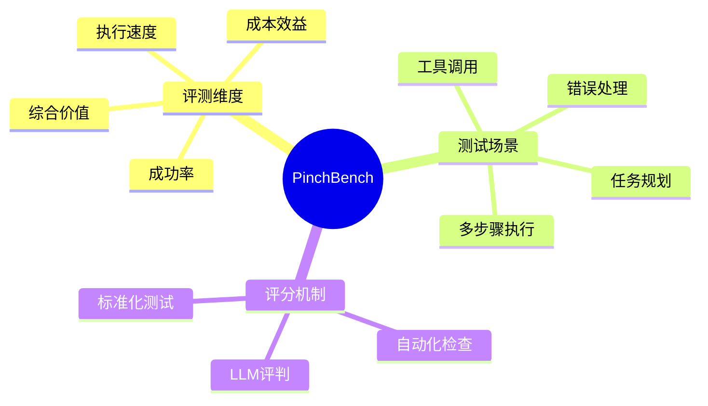
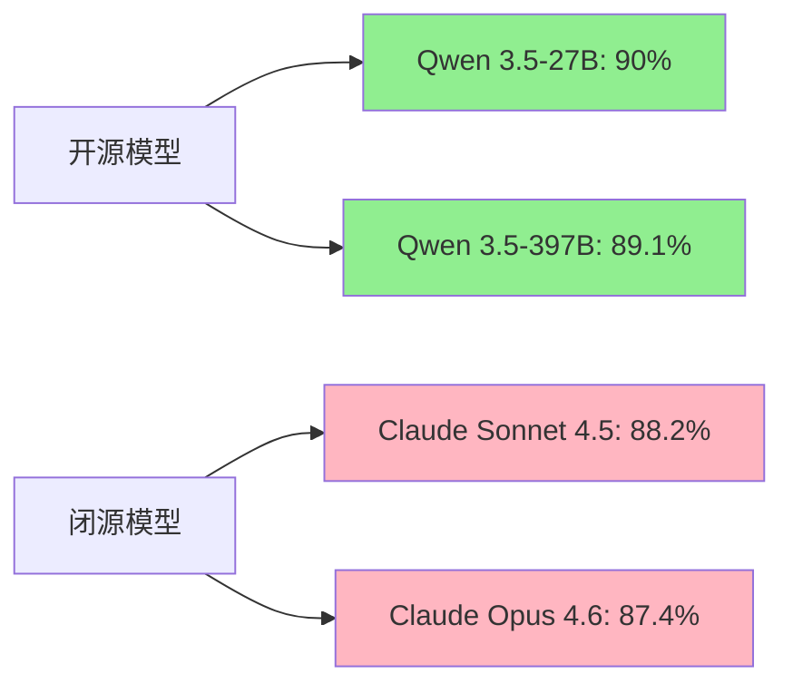

## PinchBench 概述

PinchBench 是一个专门用于评估大语言模型在 OpenClaw 智能体框架中执行真实任务能力的基准测试平台。该平台通过标准化的测试任务和自动化评分系统，对当前主流的大语言模型进行全面评估。

### 什么是 OpenClaw？

OpenClaw 是一个开源的智能体测试框架，旨在评估大语言模型在实际任务执行中的表现。与传统的文本生成评测不同，OpenClaw 专注于测试模型作为智能体（Agent）时的综合能力，包括：

- 任务规划与分解
- 工具使用能力
- 上下文理解
- 错误处理与恢复
- 多步骤任务执行

## 评测方法论

### 评分标准

PinchBench 采用多维度的评分体系：

1. **成功率（Success Rate）**：模型成功完成任务的百分比
   - 最佳成绩（Best %）：单次运行的最高成功率
   - 平均成绩（Avg %）：多次运行的平均成功率

2. **速度（Speed）**：任务执行的平均时间

3. **成本（Cost）**：每次运行的平均成本

4. **价值（Value）**：综合性价比指标

### 测试任务

所有测试任务和评分标准均为开源，确保评测的透明性和可重复性。任务涵盖了智能体在实际应用中可能遇到的各种场景。

## 评测结果分析

截至 2026 年 3 月 19 日，PinchBench 已对 50 个大语言模型进行了评测，完成了 515 次运行。以下是详细的评测结果。

### 顶级模型排行榜

#### TOP 10 模型表现

| 排名 | 模型 | 提供商 | 最佳成功率 | 平均成功率 | 特点 |
|------|------|--------|-----------|-----------|------|
| 🦞1 | qwen/qwen3.5-27b | Qwen | 90.0% | 78.5% | 最高成功率，开源领先 |
| 🦀2 | qwen/qwen3.5-397b-a17b | Qwen | 89.1% | 80.4% | 最高平均成功率 |
| 🦐3 | anthropic/claude-sonnet-4.5 | Anthropic | 88.2% | 80.1% | 闭源最佳表现 |
| 4 | anthropic/claude-opus-4.6 | Anthropic | 87.4% | 81.9% | 高平均成功率 |
| 5 | anthropic/claude-sonnet-4.6 | Anthropic | 86.9% | 79.2% | 稳定性出色 |
| 6 | minimax/minimax-m2.5 | MiniMax | 86.6% | 78.1% | 国产模型优秀表现 |
| 7 | z-ai/glm-5 | ZhipuAI | 86.4% | 79.7% | GLM 系列突破 |
| 8 | openai/gpt-5.4 | OpenAI | 86.4% | 80.6% | GPT-5 系列稳定 |
| 9 | minimax/minimax-m2.7 | MiniMax | 86.2% | 80.4% | 版本迭代优化 |
| 10 | qwen/qwen3.5-plus-02-15 | Qwen | 85.8% | 79.1% | Plus 版本增强 |

### 完整模型排名

以下是所有 49 个评测模型的完整排名：

#### 第一梯队（85%+）

| 排名 | 模型 | 提供商 | 最佳成功率 | 平均成功率 |
|------|------|--------|-----------|-----------|
| 1 | qwen/qwen3.5-27b | Qwen | 90.0% | 78.5% |
| 2 | qwen/qwen3.5-397b-a17b | Qwen | 89.1% | 80.4% |
| 3 | anthropic/claude-sonnet-4.5 | Anthropic | 88.2% | 80.1% |
| 4 | anthropic/claude-opus-4.6 | Anthropic | 87.4% | 81.9% |
| 5 | anthropic/claude-sonnet-4.6 | Anthropic | 86.9% | 79.2% |
| 6 | minimax/minimax-m2.5 | MiniMax | 86.6% | 78.1% |
| 7 | z-ai/glm-5 | ZhipuAI | 86.4% | 79.7% |
| 8 | openai/gpt-5.4 | OpenAI | 86.4% | 80.6% |
| 9 | minimax/minimax-m2.7 | MiniMax | 86.2% | 80.4% |
| 10 | qwen/qwen3.5-plus-02-15 | Qwen | 85.8% | 79.1% |
| 11 | z-ai/glm-4.5-air | ZhipuAI | 85.7% | 76.5% |
| 12 | nvidia/nemotron-3-super-120b-a12b | NVIDIA | 85.6% | 76.8% |
| 13 | xiaomi/mimo-v2-omni | Xiaomi | 85.6% | 81.2% |
| 14 | qwen/qwen3.5-122b-a10b | Qwen | 85.5% | 80.8% |
| 15 | anthropic/claude-opus-4.5 | Anthropic | 85.4% | 78.4% |

#### 第二梯队（80%-85%）

| 排名 | 模型 | 提供商 | 最佳成功率 | 平均成功率 |
|------|------|--------|-----------|-----------|
| 16 | z-ai/glm-5-turbo | ZhipuAI | 84.9% | 80.6% |
| 17 | moonshotai/kimi-k2.5 | Moonshot AI | 84.8% | 78.5% |
| 18 | minimax/minimax-m2.1 | MiniMax | 84.3% | 79.7% |
| 19 | xiaomi/mimo-v2-pro | Xiaomi | 84.0% | 81.1% |
| 20 | openrouter/hunter-alpha | OpenRouter | 83.3% | 77.3% |
| 21 | google/gemini-3.1-pro-preview | Google | 83.2% | 75.0% |
| 22 | stepfun/step-3.5-flash | StepFun | 82.6% | 75.4% |
| 23 | mistralai/devstral-2512 | Mistral AI | 82.0% | 74.4% |
| 24 | anthropic/claude-haiku-4.5 | Anthropic | 82.0% | 76.0% |
| 25 | deepseek/deepseek-v3.2 | DeepSeek | 81.9% | 68.1% |
| 26 | openrouter/healer-alpha | OpenRouter | 80.8% | 77.3% |
| 27 | xiaomi/mimo-v2-flash | Xiaomi | 80.8% | 62.1% |
| 28 | anthropic/claude-sonnet-4 | Anthropic | 80.5% | 80.5% |
| 29 | qwen/qwen3-max-thinking | Qwen | 80.3% | 71.8% |
| 30 | google/gemini-3-flash-preview | Google | 80.0% | 72.8% |
| 31 | x-ai/grok-4.1-fast | xAI | 80.0% | 70.0% |

#### 第三梯队（70%-80%）

| 排名 | 模型 | 提供商 | 最佳成功率 | 平均成功率 |
|------|------|--------|-----------|-----------|
| 32 | qwen/qwen3-coder-next | Qwen | 79.1% | 79.1% |
| 33 | qwen/qwen3.5-35b-a3b | Qwen | 78.4% | 71.7% |
| 34 | openai/gpt-5-mini | OpenAI | 78.3% | 67.7% |
| 35 | arcee-ai/trinity-large-preview:free | Arcee AI | 77.7% | 65.1% |
| 36 | openai/gpt-4o-mini | OpenAI | 75.0% | 62.0% |
| 37 | nvidia/nemotron-3-super-120b-a12b:free | NVIDIA | 75.0% | 69.6% |
| 38 | arcee-ai/trinity-large-preview | Arcee AI | 74.3% | 65.4% |
| 39 | deepseek/deepseek-chat | DeepSeek | 71.7% | 62.6% |
| 40 | openai/gpt-4o | OpenAI | 71.1% | 52.2% |
| 41 | google/gemini-3-pro-preview | Google | 70.7% | 67.7% |
| 42 | mistralai/mistral-large-2512 | Mistral AI | 70.0% | 64.1% |

#### 第四梯队（50%-70%）

| 排名 | 模型 | 提供商 | 最佳成功率 | 平均成功率 |
|------|------|--------|-----------|-----------|
| 43 | google/gemini-2.5-flash | Google | 69.8% | 57.6% |
| 44 | openai/gpt-5-nano | OpenAI | 68.8% | 56.5% |
| 45 | google/gemini-2.5-pro | Google | 68.6% | 64.4% |
| 46 | openai/gpt-oss-20b | OpenAI | 65.6% | 46.4% |
| 47 | openai/gpt-oss-120b | OpenAI | 54.0% | 44.5% |

#### 第五梯队（50%以下）

| 排名 | 模型 | 提供商 | 最佳成功率 | 平均成功率 |
|------|------|--------|-----------|-----------|
| 48 | meta-llama/llama-4-maverick | Meta | 46.1% | 34.8% |
| 49 | qwen/qwen-2.5-7b-instruct | Qwen | 40.3% | 34.1% |

## 关键发现

### 1. 开源模型的崛起

**Qwen 3.5 系列表现卓越**，其中 27B 参数版本达到了 90% 的最高成功率，超越了所有闭源模型。这标志着开源模型在智能体任务执行能力上已经达到甚至超越商业模型的水平。

### 2. 国产模型表现强劲

多个国产模型进入第一梯队：
- **Qwen 系列**：占据榜首和第二位
- **MiniMax M2 系列**：三个版本均进入前 20 名
- **智谱 GLM 系列**：GLM-5 和 GLM-5-turbo 表现优异
- **小米 MIMO 系列**：多个版本进入前 20 名
- **月之暗面 Kimi K2.5**：稳定在第一梯队

### 3. Anthropic Claude 系列稳定性高

Claude 系列模型在平均成功率上表现出色：
- **Claude Opus 4.6** 平均成功率达到 81.9%，为所有模型中最高
- **Xiaomi MIMO-v2-omni** 平均成功率 81.2%
- **Claude Sonnet 4** 保持 80.5% 的稳定成功率

这表明 Claude 系列在实际生产环境中可能更加可靠。

### 4. 模型规模并非唯一决定因素

**Qwen 3.5-27B**（27B 参数）击败了 **Qwen 3.5-397B**（397B 参数），说明：
- 模型架构优化比单纯增加参数更重要
- 针对智能体任务的专门训练至关重要
- 较小模型可能在推理效率和成本上更具优势

### 5. 专业化模型的优势

一些专门优化的模型表现出色：
- **DeepSeek-v3.2**：最佳成功率 81.9%，但平均成功率较低（68.1%），显示出高方差特性
- **Qwen3-coder-next**：作为编程专用模型，达到 79.1% 的一致成功率
- **Mistral Devstral-2512**：开发专用模型，成功率 82%

### 6. 成本与性能的权衡

根据不同应用场景选择合适的模型：
- **高可靠性场景**：选择 Claude Opus 4.6 或 Xiaomi MIMO-v2-omni（高平均成功率）
- **成本敏感场景**：选择 Qwen 3.5-27B（开源，高性能）
- **快速迭代场景**：选择 Flash 系列或 Mini 系列模型

## 不同厂商模型对比

### Anthropic Claude 系列

Claude 系列在稳定性和平均表现上占据优势：

| 模型 | 最佳成功率 | 平均成功率 | 排名 |
|------|-----------|-----------|------|
| Claude Sonnet 4.5 | 88.2% | 80.1% | 3 |
| Claude Opus 4.6 | 87.4% | 81.9% | 4 |
| Claude Sonnet 4.6 | 86.9% | 79.2% | 5 |
| Claude Opus 4.5 | 85.4% | 78.4% | 15 |
| Claude Haiku 4.5 | 82.0% | 76.0% | 24 |
| Claude Sonnet 4 | 80.5% | 80.5% | 28 |

**特点**：稳定性高，平均成功率普遍较高，适合生产环境。

### Qwen 系列

Qwen 系列在最高成功率上领先：

| 模型 | 最佳成功率 | 平均成功率 | 排名 |
|------|-----------|-----------|------|
| Qwen 3.5-27B | 90.0% | 78.5% | 1 |
| Qwen 3.5-397B-a17b | 89.1% | 80.4% | 2 |
| Qwen 3.5-Plus-02-15 | 85.8% | 79.1% | 10 |
| Qwen 3.5-122B-a10b | 85.5% | 80.8% | 14 |
| Qwen 3-Max-Thinking | 80.3% | 71.8% | 29 |
| Qwen 3-Coder-Next | 79.1% | 79.1% | 32 |
| Qwen 3.5-35B-a3b | 78.4% | 71.7% | 33 |
| Qwen 2.5-7B-Instruct | 40.3% | 34.1% | 49 |

**特点**：开源领先，27B 模型性价比极高，大规模模型表现卓越。

### OpenAI GPT 系列

GPT 系列表现分化明显：

| 模型 | 最佳成功率 | 平均成功率 | 排名 |
|------|-----------|-----------|------|
| GPT-5.4 | 86.4% | 80.6% | 8 |
| GPT-5-Mini | 78.3% | 67.7% | 34 |
| GPT-4o-Mini | 75.0% | 62.0% | 36 |
| GPT-4o | 71.1% | 52.2% | 40 |
| GPT-5-Nano | 68.8% | 56.5% | 44 |
| GPT-OSS-20B | 65.6% | 46.4% | 46 |
| GPT-OSS-120B | 54.0% | 44.5% | 47 |

**特点**：GPT-5.4 表现优秀，但旧版本 GPT-4o 系列在智能体任务上相对落后。

### Google Gemini 系列

Gemini 系列在预览版本上表现不一：

| 模型 | 最佳成功率 | 平均成功率 | 排名 |
|------|-----------|-----------|------|
| Gemini 3.1-Pro-Preview | 83.2% | 75.0% | 21 |
| Gemini 3-Flash-Preview | 80.0% | 72.8% | 30 |
| Gemini 3-Pro-Preview | 70.7% | 67.7% | 41 |
| Gemini 2.5-Flash | 69.8% | 57.6% | 43 |
| Gemini 2.5-Pro | 68.6% | 64.4% | 45 |

**特点**：较新的 3.x 预览版本表现更好，但整体在智能体任务上略显不足。

### 国产其他厂商

#### MiniMax M2 系列
| 模型 | 最佳成功率 | 平均成功率 | 排名 |
|------|-----------|-----------|------|
| MiniMax M2.5 | 86.6% | 78.1% | 6 |
| MiniMax M2.7 | 86.2% | 80.4% | 9 |
| MiniMax M2.1 | 84.3% | 79.7% | 18 |

#### 智谱 GLM 系列
| 模型 | 最佳成功率 | 平均成功率 | 排名 |
|------|-----------|-----------|------|
| GLM-5 | 86.4% | 79.7% | 7 |
| GLM-4.5-Air | 85.7% | 76.5% | 11 |
| GLM-5-Turbo | 84.9% | 80.6% | 16 |

#### 小米 MIMO 系列
| 模型 | 最佳成功率 | 平均成功率 | 排名 |
|------|-----------|-----------|------|
| MIMO-v2-Omni | 85.6% | 81.2% | 13 |
| MIMO-v2-Pro | 84.0% | 81.1% | 19 |
| MIMO-v2-Flash | 80.8% | 62.1% | 27 |

#### 其他
- **月之暗面 Kimi K2.5**：84.8% / 78.5%（排名 17）
- **DeepSeek V3.2**：81.9% / 68.1%（排名 25）
- **DeepSeek Chat**：71.7% / 62.6%（排名 39）
- **阶跃星辰 Step-3.5-Flash**：82.6% / 75.4%（排名 22）

## 应用场景建议

### 生产环境部署

**推荐模型**：
1. **Claude Opus 4.6**：最高平均成功率（81.9%），稳定性最佳
2. **Xiaomi MIMO-v2-Omni**：平均成功率 81.2%，国产选择
3. **Claude Sonnet 4.5**：综合表现均衡（88.2% / 80.1%）

### 成本敏感型应用

**推荐模型**：
1. **Qwen 3.5-27B**：开源免费，90% 最高成功率
2. **Qwen 3.5-122B-a10b**：85.5% / 80.8%，开源高性能
3. **GLM-4.5-Air**：85.7% / 76.5%，轻量级选择

### 高性能计算场景

**推荐模型**：
1. **Qwen 3.5-397B-a17b**：89.1% / 80.4%，大规模模型最佳
2. **Claude Opus 4.6**：87.4% / 81.9%，闭源大模型首选
3. **NVIDIA Nemotron-3-Super-120B**：85.6% / 76.8%，AI 算力优化

### 快速原型开发

**推荐模型**：
1. **GPT-5-Mini**：78.3% / 67.7%，OpenAI 生态完善
2. **Claude Haiku 4.5**：82.0% / 76.0%，快速响应
3. **Xiaomi MIMO-v2-Flash**：80.8% / 62.1%，国产快速模型

### 编程与开发场景

**推荐模型**：
1. **Qwen 3-Coder-Next**：79.1% 一致性表现
2. **Mistral Devstral-2512**：82.0% / 74.4%，开发专用
3. **Claude Sonnet 4.5**：88.2% / 80.1%，代码理解能力强

## 评测数据的局限性

在使用这些评测结果时，需要注意以下几点：

### 1. 特定场景评测

PinchBench 专注于 OpenClaw 智能体框架的任务执行，这些结果可能不能完全代表模型在其他场景下的表现，如：
- 纯文本生成
- 创意写作
- 数学推理
- 多模态理解

### 2. 评测任务的覆盖范围

虽然 OpenClaw 提供了标准化的测试任务，但实际生产环境中的任务可能更加复杂多样。建议：
- 在自己的数据集上进行额外评测
- 进行实际场景的 A/B 测试
- 关注模型的稳定性和可靠性

### 3. 模型版本更新

大语言模型更新迭代快速，评测结果会随着模型版本更新而变化。建议：
- 定期关注最新的评测结果
- 对关键应用场景进行持续监控
- 建立自己的评测基准

### 4. 成本与性能的实际权衡

评测结果展示了性能指标，但实际部署时还需考虑：
- API 调用成本
- 推理延迟
- 并发处理能力
- 部署难度（开源 vs 闭源）
- 数据隐私要求

## 趋势分析

### 1. 开源模型持续进步

Qwen 3.5-27B 的成功证明开源模型已经具备了与顶级闭源模型竞争的能力，这一趋势预计将持续：
- 更多开源模型将达到 85%+ 的成功率
- 开源社区的优化和微调技术将进一步缩小差距
- 成本优势将推动开源模型在生产环境中的广泛应用

### 2. 智能体专用优化成为主流

越来越多的模型开始针对智能体任务进行专门优化：
- 工具使用能力的强化训练
- 多步骤规划能力的提升
- 错误处理和自我修正能力的增强

### 3. 平均性能比峰值性能更重要

从评测结果可以看出，用户更关注模型的稳定性而非单次最高表现：
- Claude Opus 4.6 的高平均成功率使其成为生产环境首选
- 高方差模型（如 DeepSeek-v3.2）虽有高峰值但平均表现不稳定

### 4. 模型规模的理性回归

Qwen 3.5-27B 击败了更大参数的模型，说明：
- 行业正在从"参数竞赛"转向"效能优化"
- 中等规模的高质量模型更具实用价值
- 训练数据质量和方法比单纯增加参数更重要

## 总结

PinchBench 的评测结果为我们选择合适的大语言模型提供了重要参考。主要结论如下：

### 核心要点

1. **开源模型崛起**：Qwen 3.5-27B 以 90% 的成功率证明开源模型已达到行业领先水平

2. **稳定性至关重要**：Claude Opus 4.6 的 81.9% 平均成功率说明稳定性在生产环境中的价值

3. **国产模型强势**：多个国产模型进入第一梯队，显示中国 AI 产业的快速发展

4. **专业化趋势明显**：针对特定任务（如编程、智能体）优化的模型表现更好

5. **性价比成为关键**：在保证性能的前提下，成本控制变得越来越重要

### 选型建议

- **追求极致性能**：Qwen 3.5-27B（开源）或 Claude Sonnet 4.5（闭源）
- **追求高稳定性**：Claude Opus 4.6 或 Xiaomi MIMO-v2-Omni
- **追求性价比**：Qwen 3.5 系列开源模型
- **国产化要求**：Qwen、MiniMax、GLM-5、MIMO 系列均为优秀选择

### 未来展望

随着大语言模型技术的快速发展，我们可以期待：
- 更多 90%+ 成功率的模型出现
- 开源与闭源模型差距进一步缩小
- 智能体专用模型成为独立的发展方向
- 成本持续下降，使 AI 智能体在更多场景中普及

## 参考资源

- **PinchBench 官网**：[https://pinchbench.com/](https://pinchbench.com/)
- **OpenClaw GitHub**：查看完整的测试任务和评分标准
- **评测方法论**：所有任务和评分标准均为开源

---

**数据更新时间**：2026 年 3 月 19 日上午 5:19

**评测模型总数**：50 个模型

**总运行次数**：515 次

**评测平台**：PinchBench (Made with 🦀 in Maryland and Amsterdam)

*注：本文基于 PinchBench 公开数据整理，评测结果会随着模型更新而变化，请访问官网获取最新数据。*
