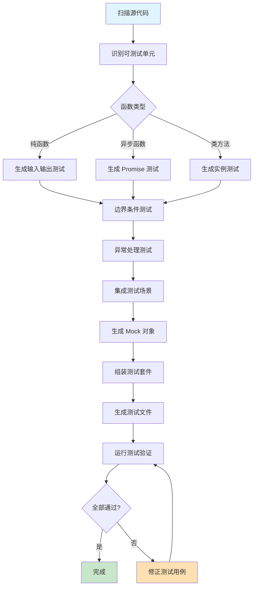

## 引言

OpenCode 是一款革命性的开源 AI 编码代理，由 Anomaly 团队开发。它不仅提供了强大的代码生成和编辑能力，更重要的是，它是 100% 开源的，不绑定任何特定的 AI 提供商。无论您是使用 Claude、OpenAI、Google 还是本地模型，OpenCode 都能为您提供一致且强大的编码体验。

本文将全面介绍 OpenCode 的核心功能、安装配置、使用技巧以及实践案例，帮助您充分发挥这一创新工具的潜力。

## OpenCode 核心特性

### 产品定位

OpenCode 是一个开源的 AI 编码代理，与 Claude Code 相似但具有独特优势：


### 核心优势

1. **完全开源**：代码公开透明，可自由修改和扩展
2. **模型无关**：支持多种 AI 提供商，不被锁定
3. **原生 LSP**：开箱即用的语言服务器协议支持
4. **终端优先**：由 Neovim 用户打造，TUI 体验极致
5. **分布式架构**：客户端/服务器分离，支持远程使用

## 安装指南

### 快速安装

OpenCode 提供多种安装方式，适配不同操作系统和使用习惯：

#### 一键安装（推荐）

```bash
# YOLO 安装（自动选择最佳路径）
curl -fsSL https://opencode.ai/install | bash
```

#### 包管理器安装

```bash
# Node.js 包管理器
npm i -g opencode-ai@latest
# 或使用 bun
bun add -g opencode-ai@latest
# 或使用 pnpm
pnpm add -g opencode-ai@latest
# 或使用 yarn
yarn global add opencode-ai@latest

# macOS 和 Linux (Homebrew - 推荐)
brew install anomalyco/tap/opencode
# 或使用官方 Homebrew formula
brew install opencode

# Windows (Scoop)
scoop bucket add extras
scoop install extras/opencode

# Windows (Chocolatey)
choco install opencode

# Arch Linux
paru -S opencode-bin

# 跨平台工具管理器
mise use -g opencode

# Nix
nix run nixpkgs#opencode
# 或使用最新开发版本
nix run github:anomalyco/opencode
```

### 桌面应用安装（BETA）

OpenCode 提供桌面应用版本，适合喜欢图形界面的用户：

| 平台 | 下载链接 | 格式 |
|------|---------|------|
| macOS (Apple Silicon) | opencode.ai/download | .dmg |
| macOS (Intel) | opencode.ai/download | .dmg |
| Windows | opencode.ai/download | .exe |
| Linux | opencode.ai/download | .deb, .rpm, AppImage |

```bash
# macOS Homebrew 安装桌面版
brew install --cask opencode-desktop
```

### 自定义安装路径

安装脚本支持自定义安装目录，按以下优先级选择：

```bash
# 1. 自定义安装目录（最高优先级）
OPENCODE_INSTALL_DIR=/usr/local/bin curl -fsSL https://opencode.ai/install | bash

# 2. XDG 规范路径
XDG_BIN_DIR=$HOME/.local/bin curl -fsSL https://opencode.ai/install | bash

# 3. 标准用户二进制目录（如果存在）
# $HOME/bin

# 4. 默认回退路径
# $HOME/.opencode/bin
```

### 版本升级

```bash
# 卸载旧版本（0.1.x 之前）
npm uninstall -g opencode-ai
# 或
brew uninstall opencode

# 安装最新版本
npm i -g opencode-ai@latest
# 或
brew upgrade opencode
```

## 基础使用

### 启动 OpenCode

```bash
# 启动交互式终端界面
opencode

# 在指定项目目录启动
opencode /path/to/project

# 非交互模式执行任务
opencode "创建一个 Express.js 服务器"
```

### 工作流程


### 三种内置代理

OpenCode 包含三种代理模式，可以通过 `Tab` 键切换：

#### 1. Build 代理（开发模式）

默认代理，拥有完整的文件系统访问权限：

```bash
# 使用场景示例
"创建一个 React 组件库"
"修复登录功能的 bug"
"重构用户认证模块"
"添加单元测试"
```

**特点**：
- ✅ 完整的文件读写权限
- ✅ 可执行 bash 命令
- ✅ 适合日常开发工作
- ✅ 自动化程度高

#### 2. Plan 代理（规划模式）

只读代理，专注于代码分析和规划：

```bash
# 使用场景示例
"分析这个项目的架构"
"评估代码质量和潜在问题"
"制定重构计划"
"审查安全隐患"
```

**特点**：
- 🔒 默认拒绝文件编辑
- ⚠️ 运行命令前需要确认
- 🔍 适合探索陌生代码库
- 📋 适合制定开发计划

#### 3. General 子代理

用于复杂搜索和多步骤任务的内部代理：

```bash
# 在消息中调用
"@general 分析整个项目中的 API 调用模式"
"@general 找出所有待办事项并分类"
```

**特点**：
- 🔧 内部使用
- 🔄 处理复杂任务
- 🎯 精确搜索
- 📊 多维度分析

### 代理切换演示


## 核心功能详解

### 1. 智能代码生成

OpenCode 可以根据自然语言描述生成高质量代码：

```bash
# 示例任务
"创建一个用户认证系统，包括注册、登录和密码重置功能"
```

**生成流程**：


### 2. 代码重构

OpenCode 支持智能代码重构，保持功能一致性：

```bash
# 示例任务
"将这个组件从类组件重构为函数组件"
"提取重复代码为可复用的工具函数"
"优化数据库查询性能"
```

**重构策略**：


### 3. Bug 修复

利用 LSP 支持，OpenCode 可以快速定位和修复问题：

```bash
# 示例任务
"修复用户登录时的认证错误"
"解决内存泄漏问题"
"修复跨浏览器兼容性问题"
```

### 4. 文档生成

自动生成代码文档和注释：

```bash
# 示例任务
"为所有公共 API 添加 JSDoc 注释"
"生成项目的 README.md"
"创建 API 使用文档"
```

### 5. 测试编写

自动生成单元测试和集成测试：

```bash
# 示例任务
"为用户服务模块编写单元测试"
"创建 API 端点的集成测试"
"生成端到端测试用例"
```

## 高级配置

### 配置文件位置

OpenCode 使用配置文件来管理设置，默认位置：

```bash
# Linux/macOS
~/.opencode/config.json

# Windows
%USERPROFILE%\.opencode\config.json
```

### 基础配置示例

```json
{
  "model": {
    "provider": "anthropic",
    "name": "claude-sonnet-4",
    "apiKey": "your-api-key"
  },
  "editor": {
    "defaultAgent": "build",
    "autoSave": true,
    "lsp": {
      "enabled": true,
      "languages": ["typescript", "python", "rust"]
    }
  },
  "ui": {
    "theme": "dark",
    "showLineNumbers": true,
    "fontSize": 14
  }
}
```

### 多模型配置

```json
{
  "models": [
    {
      "id": "claude",
      "provider": "anthropic",
      "name": "claude-sonnet-4",
      "apiKey": "${ANTHROPIC_API_KEY}"
    },
    {
      "id": "gpt4",
      "provider": "openai",
      "name": "gpt-4",
      "apiKey": "${OPENAI_API_KEY}"
    },
    {
      "id": "local",
      "provider": "ollama",
      "name": "llama3",
      "endpoint": "http://localhost:11434"
    }
  ],
  "defaultModel": "claude"
}
```

### 代理配置

```json
{
  "agents": {
    "build": {
      "enabled": true,
      "permissions": {
        "fileWrite": true,
        "commandExecution": true,
        "networkAccess": true
      }
    },
    "plan": {
      "enabled": true,
      "permissions": {
        "fileWrite": false,
        "commandExecution": "confirm",
        "networkAccess": "confirm"
      }
    },
    "general": {
      "maxSearchDepth": 5,
      "concurrentTasks": 3
    }
  }
}
```

## 实践案例

### 案例 1：创建 RESTful API

**任务描述**：创建一个完整的用户管理 API

```bash
opencode "创建一个 Express.js RESTful API，包含用户 CRUD 操作，使用 MongoDB 数据库和 JWT 认证"
```

**执行流程**：


**生成的项目结构**：

```
api-project/
├── package.json
├── .env.example
├── src/
│   ├── app.js
│   ├── config/
│   │   └── database.js
│   ├── models/
│   │   └── User.js
│   ├── middleware/
│   │   └── auth.js
│   ├── routes/
│   │   └── users.js
│   ├── controllers/
│   │   └── userController.js
│   └── utils/
│       └── validation.js
├── tests/
│   └── user.test.js
└── README.md
```

### 案例 2：代码审查和优化

**任务描述**：审查并优化现有代码

```bash
# 使用 Plan 代理进行分析
# 按 Tab 切换到 Plan 模式
"分析当前项目，找出性能瓶颈、安全隐患和代码异味"
```

**分析流程**：


### 案例 3：重构遗留代码

**任务描述**：重构老旧的 jQuery 代码为 React

```bash
"将 public/js/legacy.js 中的 jQuery 代码重构为 React 组件"
```

**重构步骤**：


### 案例 4：自动化测试生成

**任务描述**：为现有代码生成测试

```bash
"为 src/utils 目录下的所有工具函数生成 Jest 单元测试"
```

**测试生成架构**：



### 案例 5：多文件协同重构

**任务描述**：跨文件重构 API 接口

```bash
"将所有 API 调用从 Axios 迁移到 Fetch API，并统一错误处理"
```

**协同重构流程**：


## 最佳实践

### 1. 任务描述技巧

**清晰具体的描述**：

```bash
# ❌ 不好的描述
"改进代码"
"修复 bug"
"优化性能"

# ✅ 好的描述
"重构 UserService 类，将数据访问逻辑抽取到单独的 Repository 层"
"修复登录表单在 Safari 浏览器中提交时的验证错误"
"优化 getUsers API，添加分页和索引，将响应时间减少到 200ms 以内"
```

### 2. 代理选择策略


### 3. 安全性考虑

```bash
# 在处理敏感操作时使用 Plan 代理
# 1. 按 Tab 切换到 Plan 模式
# 2. 先分析影响范围
"分析删除用户数据操作的影响范围和依赖关系"

# 3. 确认无误后切换到 Build 模式执行
```

### 4. 版本控制集成

```bash
# 在重要操作前创建分支
git checkout -b feature/opencode-refactor

# 使用 OpenCode 进行开发
opencode "实现新功能"

# 审查 OpenCode 的更改
git diff

# 提交更改
git commit -m "feat: 使用 OpenCode 实现的新功能"
```

### 5. 性能优化建议


## 故障排除

### 常见问题

#### 1. 安装失败

```bash
# 清除旧版本
npm uninstall -g opencode-ai
rm -rf ~/.opencode

# 重新安装
npm i -g opencode-ai@latest

# 验证安装
opencode --version
```

#### 2. API 密钥问题

```bash
# 设置环境变量
export ANTHROPIC_API_KEY="your-api-key"
export OPENAI_API_KEY="your-api-key"

# 或在配置文件中设置
vim ~/.opencode/config.json
```

#### 3. LSP 不工作

```bash
# 确保安装了对应语言的 LSP 服务器
npm install -g typescript-language-server
npm install -g pyright

# 在配置中启用 LSP
{
  "editor": {
    "lsp": {
      "enabled": true,
      "languages": ["typescript", "python"]
    }
  }
}
```

#### 4. 性能问题

```bash
# 限制并发任务数
{
  "agents": {
    "general": {
      "concurrentTasks": 2
    }
  }
}

# 使用更快的模型
{
  "model": {
    "name": "claude-haiku"
  }
}
```

### 诊断流程


## 社区与生态

### 项目信息

- **GitHub**: [anomalyco/opencode](https://github.com/anomalyco/opencode)
- **官网**: [opencode.ai](https://opencode.ai)
- **许可证**: MIT License
- **Stars**: 66.3k+ ⭐
- **Forks**: 5.7k+
- **贡献者**: 550+

### 技术栈


### 社区资源

- **Discord 社区**: 加入讨论和获取支持
- **X.com (Twitter)**: 关注最新动态
- **文档**: 详细的使用指南
- **博客**: 技术文章和案例分享

### 贡献指南

如果您想为 OpenCode 做出贡献：

1. 阅读 `CONTRIBUTING.md`
2. Fork 项目仓库
3. 创建功能分支
4. 提交 Pull Request
5. 参与代码审查

## 对比分析

### OpenCode vs Claude Code


### 核心差异

| 特性 | OpenCode | Claude Code |
|-----|----------|-------------|
| 开源性 | ✅ 100% 开源 | ❌ 闭源 |
| 模型支持 | ✅ 多模型 | ❌ 仅 Claude |
| LSP 支持 | ✅ 原生支持 | ⚠️ 有限支持 |
| 界面 | 🖥️ TUI 优先 | 🖱️ GUI 为主 |
| 架构 | 🔄 客户端/服务器 | 📱 单机应用 |
| 远程访问 | ✅ 支持 | ❌ 不支持 |
| 定制性 | ✅ 高度可定制 | ⚠️ 有限选项 |
| 成本 | 💰 按模型计费 | 💰 订阅制 |

## 未来展望

### 即将推出的功能


### 技术演进方向

1. **增强的 AI 能力**
   - 更精准的代码理解
   - 更智能的重构建议
   - 更强的上下文感知

2. **扩展的平台支持**
   - iOS/Android 应用
   - Web 版本
   - IDE 插件

3. **企业级特性**
   - 团队协作
   - 权限管理
   - 审计日志
   - 私有部署

4. **生态系统建设**
   - 插件开发框架
   - 自定义代理市场
   - 社区模板库

## 总结

OpenCode 作为一个开源的 AI 编码代理，具有以下显著优势：

### 核心价值


### 适用场景

- ✅ **个人开发者**: 提高编码效率，减少重复劳动
- ✅ **开源项目**: 透明可控，社区支持
- ✅ **技术团队**: 灵活定制，集成现有工作流
- ✅ **学习者**: 理解 AI 辅助编程原理和实践
- ✅ **隐私敏感项目**: 可使用本地模型，数据不出本地

### 开始使用

```bash
# 快速开始
curl -fsSL https://opencode.ai/install | bash
opencode

# 加入社区
# Discord: https://discord.gg/opencode
# GitHub: https://github.com/anomalyco/opencode
```

OpenCode 代表了 AI 辅助编程工具的新方向：开放、灵活、强大。无论您是经验丰富的开发者还是编程新手，OpenCode 都能成为您可靠的编码伙伴。让我们一起探索 AI 时代的编程新范式！

---

## 参考资源

- [OpenCode 官方网站](https://opencode.ai)
- [OpenCode GitHub 仓库](https://github.com/anomalyco/opencode)
- [OpenCode 文档](https://github.com/anomalyco/opencode#documentation)
- [贡献指南](https://github.com/anomalyco/opencode/blob/dev/CONTRIBUTING.md)
- [代理说明](https://github.com/anomalyco/opencode/blob/dev/AGENTS.md)
- [安全政策](https://github.com/anomalyco/opencode/blob/dev/SECURITY.md)

---

*本文档基于 OpenCode 最新版本编写，内容可能随软件更新而变化。建议访问官方文档获取最新信息。*

