## 引言

在 AI 编码助手的时代，如何让 AI 准确理解需求、避免生成不符合预期的代码，成为开发者面临的新挑战。OpenSpec 提供了一个创新的解决方案：通过规格驱动开发（Spec-Driven Development, SDD），在编写代码之前先定义清晰的行为规格。

本文将全面介绍 OpenSpec 的核心概念、使用方法和最佳实践，帮助您和 AI 助手更高效地协作开发。

## 什么是 OpenSpec

### 核心理念

OpenSpec 是一个专为 AI 编码助手设计的规格驱动开发框架。它通过结构化的规格文件，让 AI 在编码前就明确了解需求，从而生成更准确、更符合预期的代码。


### 解决的问题

**传统 AI 编码的痛点：**

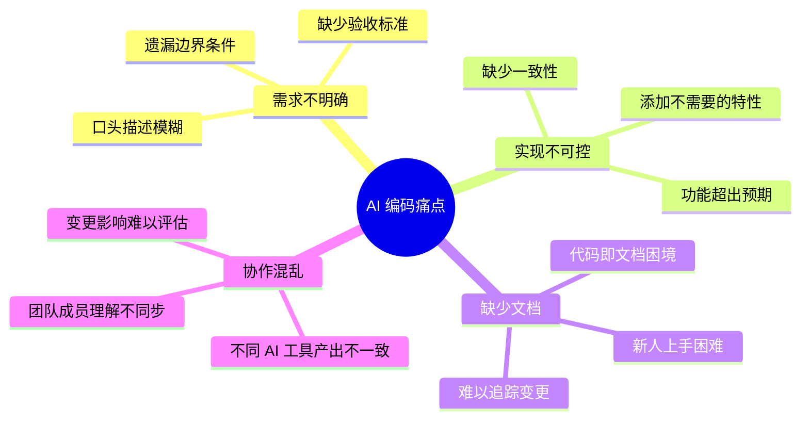

**OpenSpec 的解决方案：**

1. **规格先行** - 在编码前明确定义行为
2. **Delta 模型** - 清晰追踪每次变更
3. **任务分解** - 将需求转化为可执行的清单
4. **版本管理** - 规格与代码同步演进

### 核心特性

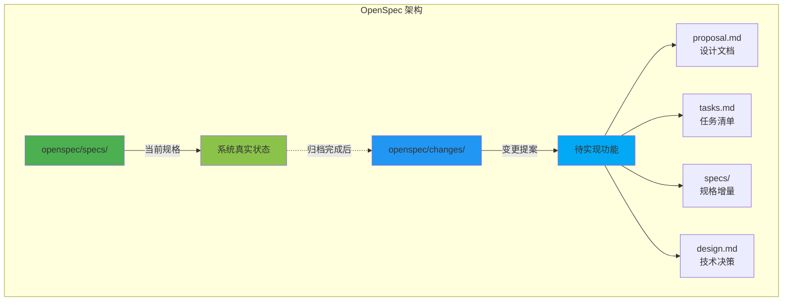

## 快速开始

### 安装

```bash
# 使用 npm 全局安装
npm install -g @fission-ai/openspec

# 验证安装
openspec --version
```

### 初始化项目

```bash
# 在项目根目录初始化
cd your-project
openspec init

# 初始化后的目录结构
# openspec/
# ├── specs/          # 当前系统规格
# ├── changes/        # 待实现的变更
# └── archive/        # 已完成的变更历史
```

### 配置 AI 助手

OpenSpec 支持多种 AI 编码工具，运行以下命令更新 AI 指令：

```bash
openspec update
```

这会根据您使用的工具（Claude Code、Cursor、Copilot 等）自动配置相应的指令。

## 核心工作流程

### 完整开发循环

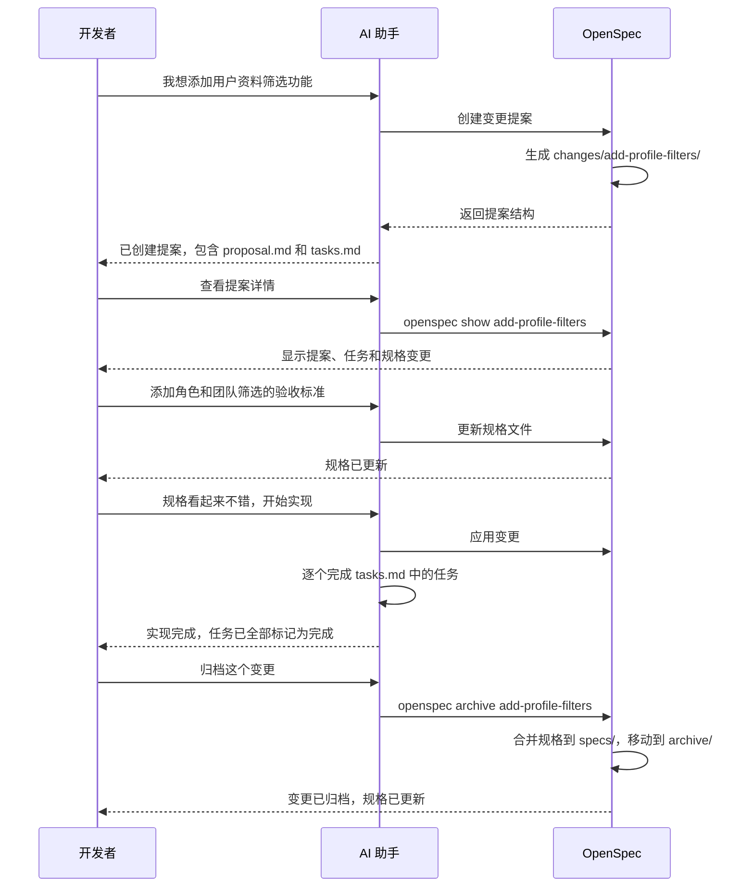

### 第一步：创建变更提案

与 AI 助手对话，描述您的需求：

```
您：我想为用户资料页面添加按角色和团队筛选的功能

AI：我将为您创建一个 OpenSpec 变更提案。
    [创建 openspec/changes/add-profile-filters/]
    
    ✓ proposal.md - 记录变更动机和目标
    ✓ tasks.md - 实现任务清单
    ✓ specs/profile/spec.md - 规格增量
```

**自动生成的 `proposal.md`：**

```markdown
# Add Profile Filters

## Motivation
用户需要快速找到特定角色或团队的成员资料，当前只能浏览所有用户。

## Goals
- 添加按角色筛选功能
- 添加按团队筛选功能
- 保持响应式设计
- 支持多选筛选

## Non-Goals
- 不包括高级搜索（如模糊匹配）
- 不涉及权限控制
```

**自动生成的 `tasks.md`：**

```markdown
## 1. 数据模型
- [ ] 1.1 确认 User 模型包含 role 和 team 字段
- [ ] 1.2 创建筛选参数的类型定义

## 2. 后端 API
- [ ] 2.1 更新 /api/profiles 端点支持筛选参数
- [ ] 2.2 添加单元测试

## 3. 前端组件
- [ ] 3.1 创建 ProfileFilter 组件
- [ ] 3.2 集成到 ProfileList 页面
- [ ] 3.3 添加筛选状态管理

## 4. UI/UX
- [ ] 4.1 实现筛选器 UI
- [ ] 4.2 添加清除筛选按钮
- [ ] 4.3 显示当前筛选状态
```

**自动生成的规格增量 `specs/profile/spec.md`：**

```markdown
# Delta for Profile

## ADDED Requirements

### Requirement: Profile Filtering
系统 MUST 支持按角色和团队筛选用户资料。

#### Scenario: 按角色筛选
- WHEN 用户选择一个或多个角色
- THEN 只显示匹配这些角色的用户资料

#### Scenario: 按团队筛选
- WHEN 用户选择一个或多个团队
- THEN 只显示属于这些团队的用户资料

#### Scenario: 组合筛选
- WHEN 用户同时选择角色和团队
- THEN 显示同时满足两个条件的用户资料

#### Scenario: 清除筛选
- WHEN 用户点击清除按钮
- THEN 所有筛选条件被重置，显示所有用户
```

### 第二步：验证提案

```bash
# 列出所有变更
openspec list

# 验证规格格式
openspec validate add-profile-filters

# 查看详细信息
openspec show add-profile-filters
```

**命令输出示例：**

```
📋 Change: add-profile-filters

📝 Proposal
───────────
Motivation: 用户需要快速找到特定角色或团队的成员资料...
Goals: 
  - 添加按角色筛选功能
  - 添加按团队筛选功能
  ...

✅ Tasks (0/9 complete)
───────────────────────
□ 1.1 确认 User 模型包含 role 和 team 字段
□ 1.2 创建筛选参数的类型定义
...

📐 Spec Changes
───────────────
profile/spec.md:
  + Requirement: Profile Filtering
  + 4 scenarios
```

### 第三步：细化规格

与 AI 继续对话，完善规格：

```
您：能否为角色和团队筛选添加详细的验收标准？

AI：我将更新规格增量，添加更详细的场景描述。
    [编辑 specs/profile/spec.md 和 tasks.md]
```

### 第四步：实现变更

```
您：规格看起来不错，开始实现这个变更吧。
    （快捷命令：/openspec:apply add-profile-filters）

AI：我将按照 tasks.md 中的任务清单进行实现。
    [实现任务并标记完成状态]
    ✓ Task 1.1 完成
    ✓ Task 1.2 完成
    ✓ Task 2.1 完成
    ...
```

### 第五步：归档变更

实现完成后，归档变更到规格库：

```
您：请归档这个变更
    （快捷命令：/openspec:archive add-profile-filters）

AI：我将归档 add-profile-filters 变更。
    [运行：openspec archive add-profile-filters --yes]
    ✓ 变更已归档
    ✓ 规格已更新到 openspec/specs/
    ✓ 历史已保存到 openspec/archive/
```

**归档后的变化：**

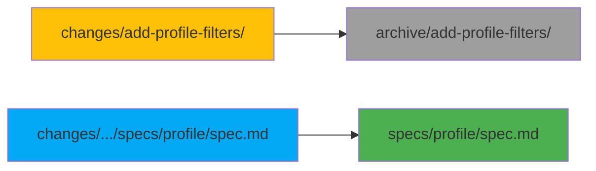

## 规格文件格式

### Spec.md 结构

```markdown
# [模块名称] Specification

## Purpose
模块的用途和职责描述。

## Requirements

### Requirement: [需求名称]
系统 SHALL/MUST/SHOULD [需求描述]。

#### Scenario: [场景名称]
- GIVEN [前置条件]
- WHEN [触发动作]
- THEN [预期结果]

#### Scenario: [另一个场景]
- WHEN [触发动作]
- THEN [预期结果]
- AND [额外结果]
```

**关键字说明：**

- **SHALL/MUST** - 必须满足的硬性要求
- **SHOULD** - 推荐但非强制的要求
- **MAY** - 可选的要求

### Delta 格式

变更文件夹中的规格文件使用 Delta 格式：

```markdown
# Delta for [模块名称]

## ADDED Requirements
### Requirement: [新增需求]
[需求描述和场景]

## MODIFIED Requirements
### Requirement: [修改的需求]
[完整的更新后需求描述]

## REMOVED Requirements
### Requirement: [删除的需求]
[说明删除原因]
```

**实际示例：**

```markdown
# Delta for Authentication

## ADDED Requirements

### Requirement: Two-Factor Authentication
系统 MUST 在登录时要求第二因素验证。

#### Scenario: OTP 验证
- WHEN 用户提交有效的用户名和密码
- THEN 系统提示输入 OTP 验证码
- AND 发送 OTP 到用户的注册手机

#### Scenario: OTP 过期
- GIVEN 用户收到了 OTP
- WHEN 5 分钟后才输入 OTP
- THEN 系统拒绝该 OTP 并提示重新发送

## MODIFIED Requirements

### Requirement: Password Requirements
系统 MUST 要求密码至少 12 个字符（原先是 8 个）。

#### Scenario: 密码长度验证
- WHEN 用户设置少于 12 个字符的密码
- THEN 系统拒绝并显示错误信息

## REMOVED Requirements

### Requirement: Security Questions
移除安全问题功能，因为 2FA 提供了更好的安全性。
```

## 命令参考

### 基础命令

```bash
# 列出所有活跃的变更
openspec list

# 交互式查看规格和变更
openspec view

# 显示特定变更的详情
openspec show <change-name>

# 验证规格格式
openspec validate <change-name>

# 归档已完成的变更
openspec archive <change-name> [--yes|-y]

# 更新 AI 助手指令
openspec update
```

### 高级用法

```bash
# 查看特定模块的规格
openspec show <change-name> --spec profile

# 只显示任务清单
openspec show <change-name> --tasks

# 归档时跳过确认
openspec archive <change-name> --yes

# 查看归档历史
ls openspec/archive/
```

## 实战示例

### 示例 1：添加两步验证

**需求描述：**

```
您：我们需要为登录流程添加两步验证功能。

AI：我将创建一个 OpenSpec 提案。
```

**生成的目录结构：**

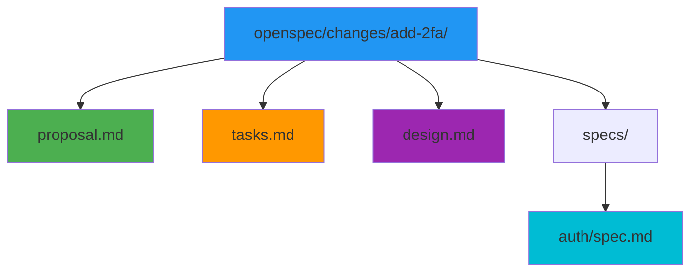

**proposal.md：**

```markdown
# Add Two-Factor Authentication

## Motivation
增强账户安全性，防止密码泄露导致的未授权访问。

## Goals
- 实现基于 TOTP 的两步验证
- 支持备用恢复码
- 提供启用/禁用 2FA 的用户界面

## Non-Goals
- 不支持 SMS 验证（考虑安全性）
- 不强制所有用户启用（可选功能）
```

**tasks.md：**

```markdown
## 1. 数据库变更
- [ ] 1.1 添加 otp_secret 字段到 users 表
- [ ] 1.2 创建 otp_backup_codes 表
- [ ] 1.3 添加 2fa_enabled 布尔字段

## 2. 后端实现
- [ ] 2.1 安装 speakeasy 库生成 OTP
- [ ] 2.2 创建 /api/auth/2fa/setup 端点
- [ ] 2.3 创建 /api/auth/2fa/verify 端点
- [ ] 2.4 修改登录流程集成 2FA 检查
- [ ] 2.5 实现备用恢复码生成和验证

## 3. 前端实现
- [ ] 3.1 创建 2FA 设置页面
- [ ] 3.2 显示 QR 码组件
- [ ] 3.3 创建 OTP 输入组件
- [ ] 3.4 实现备用码下载功能

## 4. 测试
- [ ] 4.1 单元测试：OTP 生成和验证
- [ ] 4.2 集成测试：完整登录流程
- [ ] 4.3 E2E 测试：用户启用 2FA 流程
```

**specs/auth/spec.md（Delta）：**

```markdown
# Delta for Auth

## ADDED Requirements

### Requirement: Two-Factor Authentication Setup
系统 MUST 允许用户启用和配置两步验证。

#### Scenario: 首次设置 2FA
- WHEN 用户访问 2FA 设置页面
- THEN 系统生成唯一的 TOTP secret
- AND 显示 QR 码供用户扫描
- AND 提供手动输入的 secret 密钥

#### Scenario: 验证 2FA 设置
- WHEN 用户输入当前的 6 位 OTP 验证码
- THEN 系统验证 OTP 是否正确
- AND 启用用户的 2FA 功能
- AND 生成 10 个备用恢复码

### Requirement: Two-Factor Authentication Login
系统 MUST 在登录时对启用 2FA 的用户进行额外验证。

#### Scenario: 2FA 登录流程
- GIVEN 用户已启用 2FA
- WHEN 用户提交正确的用户名和密码
- THEN 系统提示输入 6 位 OTP 验证码
- AND 不授予访问权限直到 OTP 验证通过

#### Scenario: 使用备用恢复码
- GIVEN 用户无法获取 OTP（如丢失设备）
- WHEN 用户输入有效的备用恢复码
- THEN 系统授予访问权限
- AND 标记该恢复码为已使用

#### Scenario: OTP 验证失败
- WHEN 用户输入错误的 OTP 连续 5 次
- THEN 系统暂时锁定账户 15 分钟
- AND 发送安全警告邮件到用户邮箱

## MODIFIED Requirements

### Requirement: User Login
系统 MUST 支持两种登录模式：标准密码登录和 2FA 增强登录。

#### Scenario: 标准登录（未启用 2FA）
- WHEN 用户提交有效的用户名和密码
- AND 用户未启用 2FA
- THEN 系统立即授予访问权限并发放 JWT

#### Scenario: 2FA 增强登录（已启用 2FA）
- WHEN 用户提交有效的用户名和密码
- AND 用户已启用 2FA
- THEN 系统进入 2FA 验证阶段（见 Two-Factor Authentication Login）
```

**实现流程：**

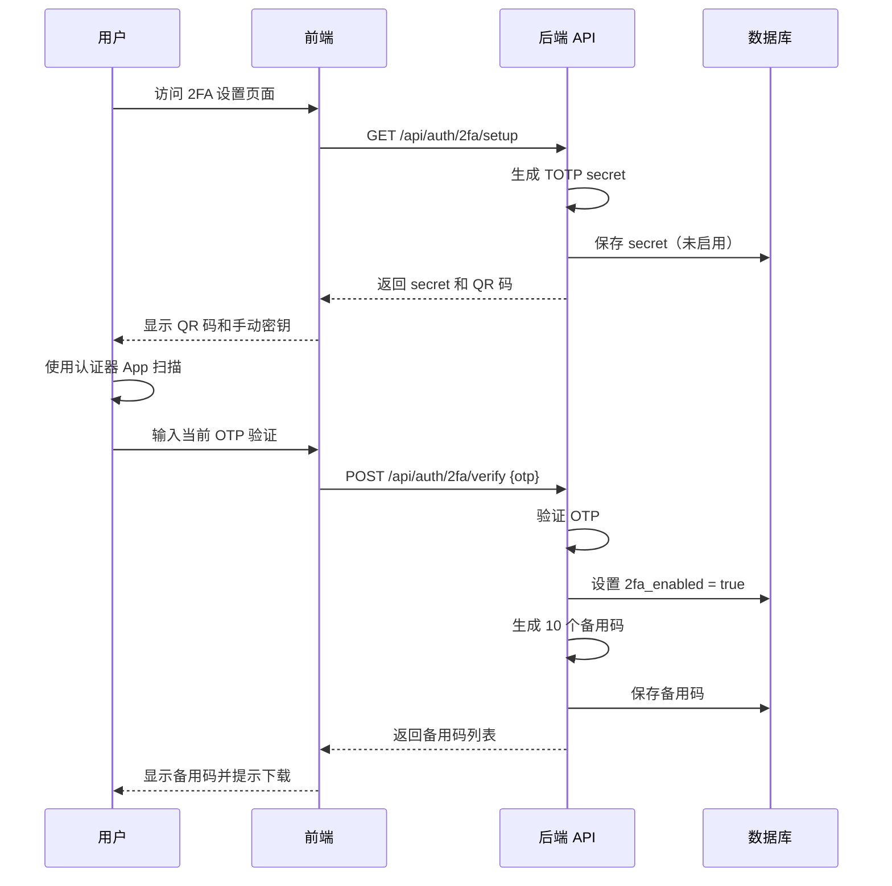

### 示例 2：重构用户认证模块

**需求描述：**

```
您：当前的认证模块使用了过时的 JWT 实现，
    我想重构为更安全的 RS256 签名，并添加 refresh token。

AI：这是一个涉及现有功能修改的变更，我将创建提案。
```

**proposal.md：**

```markdown
# Refactor Authentication with RS256 and Refresh Tokens

## Motivation
当前使用 HS256 对称加密，存在密钥泄露风险。
使用 RS256 非对称加密和 refresh token 机制可以提高安全性。

## Goals
- 迁移到 RS256 JWT 签名
- 实现 refresh token 机制
- 保持向后兼容（过渡期）
- 添加 token 撤销功能

## Non-Goals
- 不修改用户登录界面
- 不影响第三方 OAuth 集成

## Migration Strategy
1. 生成 RSA 密钥对
2. 新 token 使用 RS256，旧 token 仍可验证
3. 逐步淘汰 HS256 token（30 天过渡期）
```

**specs/auth/spec.md（Delta）：**

```markdown
# Delta for Auth

## MODIFIED Requirements

### Requirement: JWT Token Issuance
系统 MUST 使用 RS256 算法签发 JWT access token，
并同时发放 refresh token。

#### Scenario: 成功登录
- WHEN 用户提交有效凭证
- THEN 系统发放 RS256 签名的 access token（15 分钟有效期）
- AND 发放 refresh token（30 天有效期）
- AND 将 refresh token 存储到数据库

#### Scenario: Access token 过期
- WHEN 客户端的 access token 过期
- THEN 客户端使用 refresh token 请求新的 access token
- AND 系统验证 refresh token 有效性
- AND 发放新的 access token（不发新 refresh token）

### Requirement: Token Verification
系统 MUST 使用公钥验证 RS256 JWT token。

#### Scenario: API 请求验证
- WHEN 客户端携带 access token 请求 API
- THEN 系统使用 RS256 公钥验证签名
- AND 检查 token 是否在黑名单中

## ADDED Requirements

### Requirement: Token Revocation
系统 MUST 支持撤销 refresh token。

#### Scenario: 用户登出
- WHEN 用户点击登出
- THEN 系统将该用户的所有 refresh token 标记为已撤销
- AND 将当前 access token 加入黑名单

#### Scenario: 检测到可疑活动
- WHEN 系统检测到异常登录行为
- THEN 自动撤销该用户的所有 refresh token
- AND 发送安全警告通知

## REMOVED Requirements

### Requirement: HS256 Token Signing
移除 HS256 签名支持（30 天过渡期后）。
```

**实现技术决策（design.md）：**

```markdown
# Authentication Refactor - Technical Design

## RSA Key Management

### Key Generation
```bash
# 生成 2048 位 RSA 密钥对
openssl genrsa -out private.pem 2048
openssl rsa -in private.pem -pubout -out public.pem
```

### Key Storage
- 私钥：环境变量或 AWS Secrets Manager
- 公钥：可公开，内嵌于应用配置

## Token Structure

### Access Token
```json
{
  "sub": "user_id",
  "exp": 1234567890,
  "iat": 1234567000,
  "type": "access",
  "alg": "RS256"
}
```

### Refresh Token
```json
{
  "sub": "user_id",
  "exp": 1237258890,
  "iat": 1234567000,
  "type": "refresh",
  "jti": "unique_token_id"
}
```

## Database Schema

```sql
CREATE TABLE refresh_tokens (
    id UUID PRIMARY KEY,
    user_id UUID REFERENCES users(id),
    token_id VARCHAR(255) UNIQUE NOT NULL, -- jti claim
    expires_at TIMESTAMP NOT NULL,
    revoked BOOLEAN DEFAULT FALSE,
    created_at TIMESTAMP DEFAULT NOW()
);

CREATE INDEX idx_refresh_tokens_user_id ON refresh_tokens(user_id);
CREATE INDEX idx_refresh_tokens_token_id ON refresh_tokens(token_id);
```

## Migration Plan

### Phase 1: 准备（第 1-3 天）
- 生成 RSA 密钥对
- 部署 refresh_tokens 表
- 实现双算法验证逻辑

### Phase 2: 并行运行（第 4-30 天）
- 新登录发放 RS256 token
- 同时接受 HS256 和 RS256 token
- 监控错误率

### Phase 3: 完全迁移（第 31+ 天）
- 停止接受 HS256 token
- 移除 HS256 验证代码
```

**实现后的流程对比：**

```mermaid
graph TB
    subgraph "旧流程 (HS256)"
        A1[用户登录] --> B1[验证凭证]
        B1 --> C1[生成 HS256 JWT]
        C1 --> D1[返回 Token]
        D1 --> E1[客户端存储]
        E1 --> F1[每次请求携带]
        F1 --> G1[服务端用共享密钥验证]
    end
    
    subgraph "新流程 (RS256 + Refresh)"
        A2[用户登录] --> B2[验证凭证]
        B2 --> C2[生成 RS256 Access Token<br/>15分钟]
        C2 --> D2[生成 Refresh Token<br/>30天]
        D2 --> E2[存储 Refresh Token 到 DB]
        E2 --> F2[返回两个 Token]
        F2 --> G2[客户端存储]
        G2 --> H2[请求携带 Access Token]
        H2 --> I2[用公钥验证签名]
        
        J2[Access Token 过期] --> K2[用 Refresh Token 换新]
        K2 --> L2[验证 Refresh Token]
        L2 --> M2[发放新 Access Token]
    end
    
    style A1 fill:#FFC107
    style A2 fill:#4CAF50
    style C1 fill:#FF5722
    style C2 fill:#2196F3
    style D2 fill:#9C27B0
```

## 与其他工具对比

### OpenSpec vs. Traditional Spec Documents

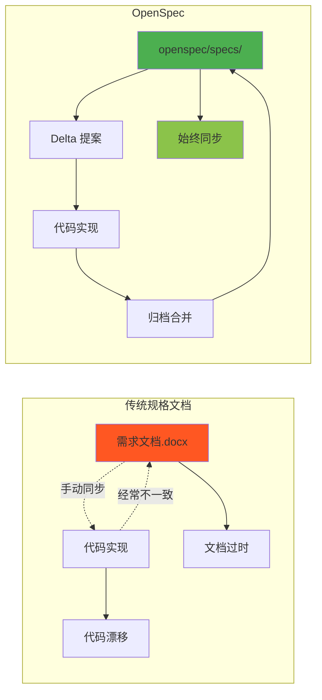

**对比表：**

| 特性 | 传统规格文档 | OpenSpec |
|------|------------|----------|
| 与代码同步 | ❌ 手动维护 | ✅ 强制同步 |
| AI 可读性 | ⚠️ 格式不统一 | ✅ 结构化标准 |
| 变更追踪 | ❌ 依赖版本控制注释 | ✅ Delta 模型 |
| 任务管理 | ❌ 需要外部工具 | ✅ 内置 tasks.md |
| 团队协作 | ⚠️ 需要文档规范 | ✅ 统一工作流 |

### OpenSpec vs. spec-kit

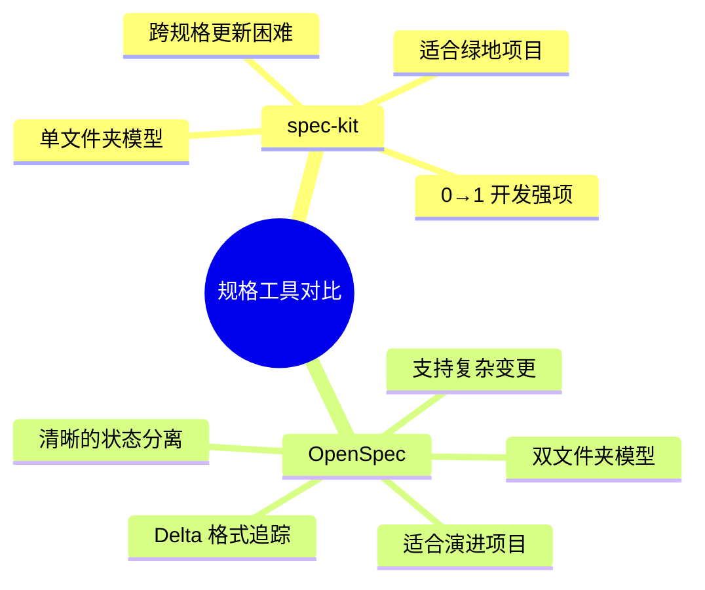

**适用场景：**

- **spec-kit**：新项目从零开始，需求相对简单
- **OpenSpec**：现有项目持续演进，需要管理复杂的功能变更

### OpenSpec vs. Kiro.dev

| 特性 | Kiro.dev | OpenSpec |
|------|----------|----------|
| 变更组织 | 分散在多个规格文件夹 | 集中在一个变更文件夹 |
| 功能追踪 | ⚠️ 需要手动关联 | ✅ 自然聚合 |
| 变更归档 | ❌ 无明确归档机制 | ✅ archive/ 目录 |
| 适合规模 | 中小型项目 | 中大型项目 |

## 团队协作实践

### 多人协作流程

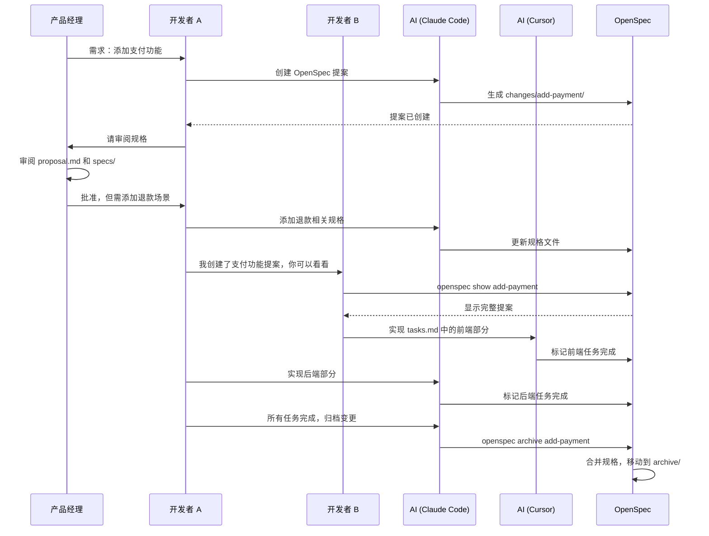

### 建立团队规范

**1. 提交前检查清单：**

```bash
# 验证规格格式
openspec validate <change-name>

# 确保所有任务已完成
grep "\[ \]" openspec/changes/<change-name>/tasks.md

# 归档前的最终审查
openspec show <change-name>
```

**2. Git 工作流集成：**

```bash
# Feature 分支包含 OpenSpec 变更
git checkout -b feature/add-payment
# ... 创建 OpenSpec 提案和实现 ...
git add openspec/changes/add-payment/
git commit -m "feat: add payment feature (OpenSpec)"

# PR 合并后归档
git checkout main
git pull
openspec archive add-payment --yes
git add openspec/specs/ openspec/archive/
git commit -m "docs: archive add-payment change"
```

**3. Code Review 要点：**

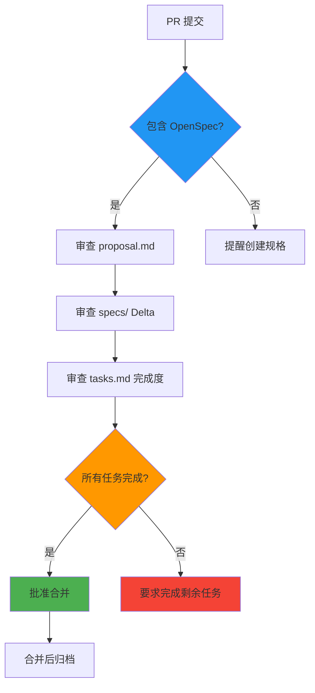

### 不同 AI 工具共存

OpenSpec 支持多种 AI 编码工具，团队成员可以使用各自喜欢的工具：

```bash
# 开发者 A 使用 Claude Code
cd project
openspec update  # 自动检测并配置 Claude Code

# 开发者 B 使用 Cursor
cd project
openspec update  # 自动检测并配置 Cursor

# 开发者 C 使用 GitHub Copilot
cd project
openspec update  # 自动配置通用 AGENTS.md
```

**支持的工具：**

- ✅ Claude Code（完整支持，包括快捷命令）
- ✅ Cursor
- ✅ CodeBuddy
- ✅ Codex
- ✅ Qoder
- ✅ RooCode
- ✅ 其他兼容 AGENTS.md 的工具

## 最佳实践

### 1. 规格编写原则

**DO - 推荐做法：**

✅ 使用清晰的需求分层结构
```markdown
### Requirement: User Registration
系统 MUST 验证邮箱地址的唯一性。

#### Scenario: 重复邮箱注册
- WHEN 用户使用已存在的邮箱注册
- THEN 系统拒绝注册并提示邮箱已被使用
```

✅ 每个需求至少包含一个场景
✅ 使用具体的验收标准（GIVEN-WHEN-THEN）
✅ 明确区分功能性和非功能性需求

**DON'T - 避免做法：**

❌ 模糊的需求描述
```markdown
### Requirement: Good User Experience
系统应该提供良好的用户体验。（太模糊！）
```

❌ 缺少场景的需求
❌ 在规格中混入实现细节
❌ 使用不一致的术语

### 2. Delta 更新策略

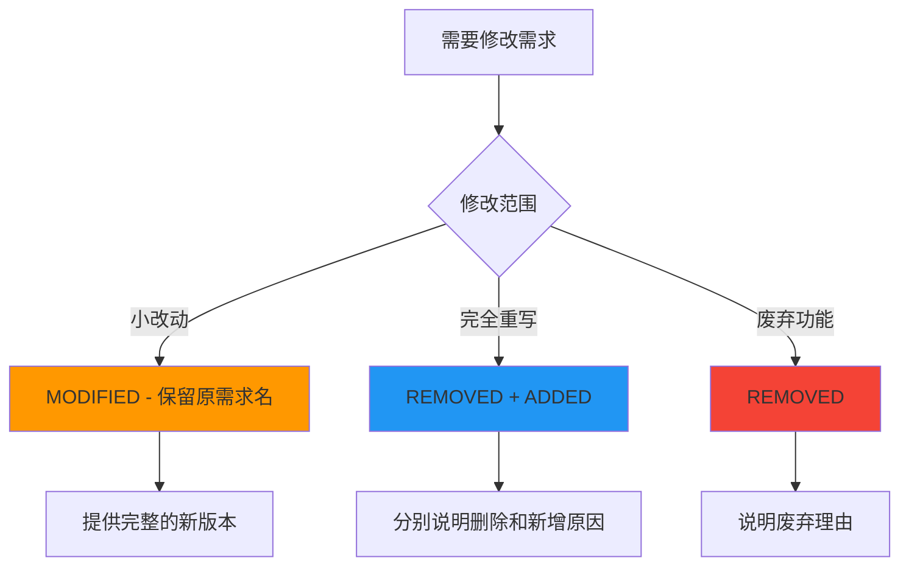

**示例：小修改使用 MODIFIED**

```markdown
## MODIFIED Requirements

### Requirement: Password Complexity
系统 MUST 要求密码包含至少一个大写字母、一个小写字母、
一个数字和一个特殊字符，总长度至少 12 个字符。

（原先要求：8 个字符，无特殊字符要求）

#### Scenario: 弱密码拒绝
- WHEN 用户设置不满足复杂度的密码
- THEN 系统显示具体的密码要求
- AND 高亮未满足的条件
```

**示例：重大改动使用 REMOVED + ADDED**

```markdown
## REMOVED Requirements

### Requirement: Session-based Authentication
移除基于 session 的认证机制，迁移到 JWT token 认证以支持无状态架构。

## ADDED Requirements

### Requirement: JWT Token Authentication
系统 MUST 使用 JWT token 进行无状态认证。

#### Scenario: Token 发放
- WHEN 用户成功登录
- THEN 系统发放包含用户信息的 JWT token
- AND token 有效期为 24 小时
```

### 3. 任务分解技巧

**按层次分解：**

```markdown
## 1. 数据层
- [ ] 1.1 Schema 设计
- [ ] 1.2 Migration 脚本
- [ ] 1.3 Model 定义

## 2. 业务逻辑层
- [ ] 2.1 Service 实现
- [ ] 2.2 Validation 规则
- [ ] 2.3 Error handling

## 3. API 层
- [ ] 3.1 Endpoint 定义
- [ ] 3.2 Request/Response DTO
- [ ] 3.3 API 文档

## 4. 前端
- [ ] 4.1 UI 组件
- [ ] 4.2 State 管理
- [ ] 4.3 API 集成

## 5. 测试
- [ ] 5.1 单元测试
- [ ] 5.2 集成测试
- [ ] 5.3 E2E 测试
```

**粒度控制：**


- ✅ 推荐：每个任务 15-60 分钟完成
- ⚠️ 警惕：任务超过 3 小时应拆分
- ❌ 避免：任务描述过于细碎（如"导入库"）

### 4. 设计文档使用时机

**何时需要 design.md：**

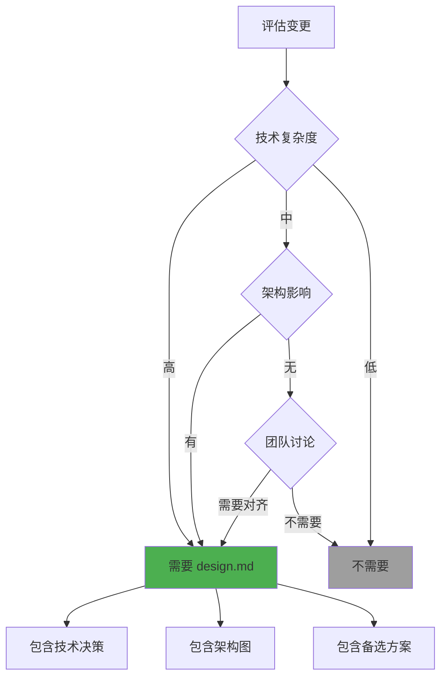

**design.md 应包含：**

1. **技术选型** - 使用的库、框架、工具
2. **架构决策** - 为什么选择这种设计
3. **备选方案** - 考虑过但未采用的方案
4. **权衡分析** - 各方案的优缺点
5. **风险评估** - 可能的技术风险

**示例：**

```markdown
# Payment Integration - Technical Design

## Technology Stack
- Stripe SDK v10 - 支付处理
- Bull Queue - 异步任务队列
- Redis - 临时状态存储

## Architecture Decision

### Decision: 使用异步队列处理支付回调

**背景：**
Stripe webhook 可能在用户关闭页面后才到达，
需要异步处理避免阻塞用户体验。

**方案对比：**

| 方案 | 优点 | 缺点 |
|------|------|------|
| 同步处理 | 简单直接 | 用户需要等待 |
| 异步队列 | 不阻塞用户 | 需要额外基础设施 |
| Serverless | 弹性扩展 | 冷启动延迟 |

**选择：** 异步队列（Bull + Redis）

**理由：**
- 可靠性高（重试机制）
- 可观测性好（队列监控）
- 成本可控（复用现有 Redis）

## Data Flow

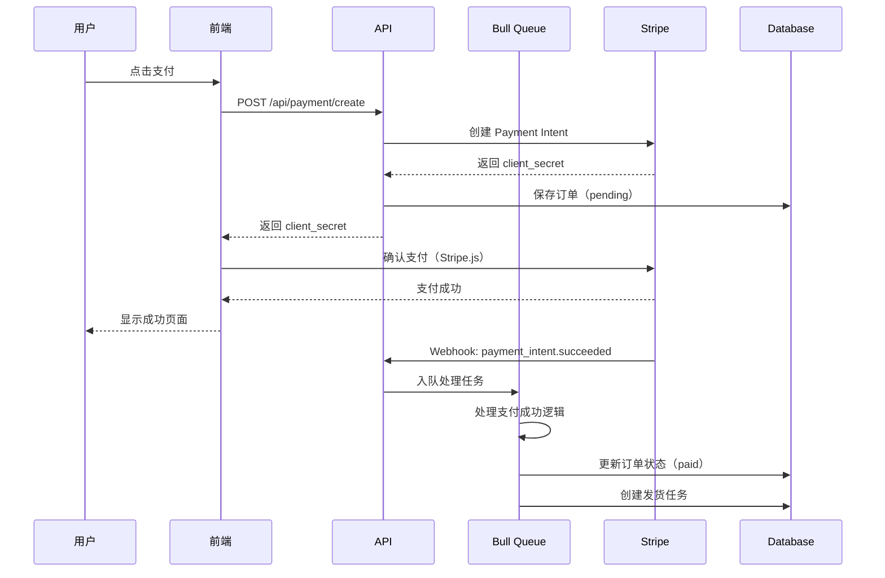

## Risk Mitigation

### Risk: Webhook 丢失
**概率：** 低  
**影响：** 高  
**缓解：**
- 实现幂等性检查
- 定期扫描 pending 订单
- Stripe Dashboard 手动触发重试

### Risk: 重复支付
**概率：** 中  
**影响：** 高  
**缓解：**
- 使用 idempotency key
- 数据库唯一约束
- 前端防重复点击
```

### 5. 归档时机

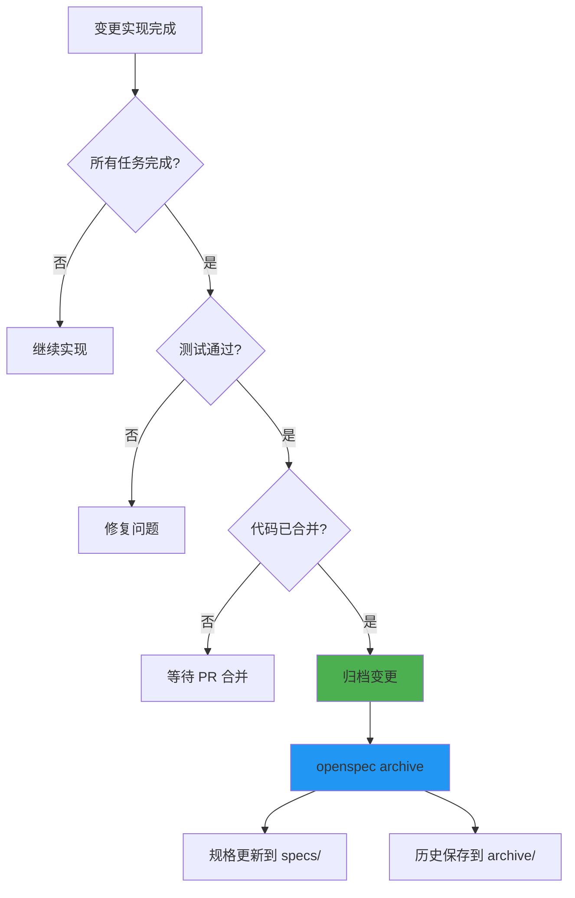

**归档检查清单：**

- [ ] 所有 tasks.md 任务已标记为完成
- [ ] 代码已通过 Code Review
- [ ] 单元测试和集成测试通过
- [ ] 变更已合并到主分支
- [ ] 相关文档已更新

## 常见问题

### Q1: OpenSpec 适合我的项目吗？

**适合场景：**
- ✅ 使用 AI 编码助手的团队
- ✅ 需要明确需求规格的项目
- ✅ 多人协作的中大型项目
- ✅ 需要追踪功能演进历史

**不适合场景：**
- ❌ 个人小型一次性脚本
- ❌ 完全探索性的实验项目
- ❌ 需求极度不确定的早期原型

### Q2: 必须使用特定的 AI 工具吗？

**不必须。** OpenSpec 支持多种 AI 工具：

- Claude Code（推荐，完整支持）
- Cursor
- GitHub Copilot
- 其他兼容 AGENTS.md 的工具

运行 `openspec update` 会自动适配您的工具。

### Q3: 如何处理紧急 Bug 修复？

紧急 Bug 可以跳过 OpenSpec 流程，修复后补充规格：

```bash
# 1. 快速修复 Bug
git checkout -b hotfix/critical-bug
# ... 修复代码 ...
git commit -m "fix: critical bug"
git push

# 2. 修复后创建 OpenSpec 记录
# 与 AI 对话：创建一个 OpenSpec 提案记录这个 Bug 修复

# 3. 更新规格并归档
openspec archive fix-critical-bug --yes
```

### Q4: OpenSpec 文件要提交到 Git 吗？

**推荐做法：**

```bash
# 提交到版本控制
git add openspec/
git commit -m "docs: update OpenSpec"

# .gitignore 中可以忽略临时文件（如果有）
echo "openspec/.temp" >> .gitignore
```

**原因：**
- ✅ 团队共享规格
- ✅ 追踪历史变更
- ✅ Code Review 包含规格审查
- ✅ CI/CD 可以验证规格一致性

### Q5: 如何迁移现有项目？


**迁移策略：**

1. **初始化：** `openspec init`
2. **选择起点：** 不必一次性为所有代码创建规格
3. **新功能优先：** 新开发的功能使用 OpenSpec
4. **逐步回填：** 修改老代码时补充规格
5. **核心模块优先：** 先为核心模块创建规格

**示例对话：**

```
您：我想为现有的用户认证模块创建 OpenSpec 规格。

AI：我将基于当前代码为 auth 模块创建规格。
    [分析代码并生成 openspec/specs/auth/spec.md]
    
    ✓ 已识别 3 个主要需求：
    - User Login
    - Password Reset
    - Session Management
```

### Q6: 规格和代码不同步怎么办？

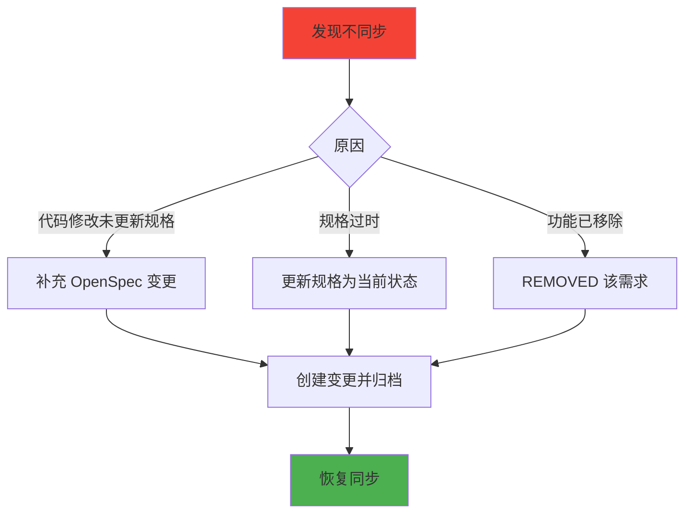

**解决方法：**

```
您：当前的登录代码已支持 OAuth，但规格中没有记录。

AI：我将创建一个变更来补充 OAuth 规格。
    [创建 openspec/changes/document-oauth/]
    [添加 ADDED Requirements for OAuth]
    [立即归档，因为代码已实现]
```

## 高级话题

### 实验性功能：OPSX

OpenSpec 提供了实验性的 OPSX 工作流（目前仅 Claude Code 支持），提供更灵活的迭代方式。

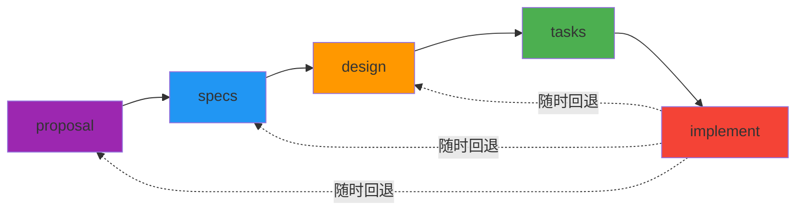

**OPSX 命令：**

```bash
/opsx:new          # 创建新变更
/opsx:continue     # 生成下一个 artifact
/opsx:ff           # 快进（一次生成所有 artifact）
/opsx:apply        # 实现并允许更新 artifact
/opsx:archive      # 归档
```

**启用方法：**

```bash
openspec artifact-experimental-setup
```

**适用场景：**
- 需要频繁调整规格的探索性开发
- 想要自定义工作流模板的团队
- 需要更细粒度的 artifact 控制

### 隐私与遥测

OpenSpec 收集匿名使用统计，帮助改进工具：

**收集内容：**
- ✅ 命令名称（如 `openspec list`）
- ✅ OpenSpec 版本号

**不收集：**
- ❌ 项目路径
- ❌ 文件内容
- ❌ 个人信息
- ❌ 命令参数

**禁用方法：**

```bash
# 方法 1：环境变量
export OPENSPEC_TELEMETRY=0

# 方法 2：通用 Do Not Track
export DO_NOT_TRACK=1

# 方法 3：永久配置（添加到 .bashrc 或 .zshrc）
echo 'export OPENSPEC_TELEMETRY=0' >> ~/.bashrc
```

CI 环境会自动禁用遥测。

### CI/CD 集成

**验证规格格式：**

```yaml
# .github/workflows/openspec.yml
name: OpenSpec Validation

on: [pull_request]

jobs:
  validate:
    runs-on: ubuntu-latest
    steps:
      - uses: actions/checkout@v3
      
      - name: Install OpenSpec
        run: npm install -g @fission-ai/openspec
      
      - name: Validate all changes
        run: |
          for change in openspec/changes/*/; do
            openspec validate $(basename $change)
          done
      
      - name: Check for unar chived changes
        run: |
          if [ "$(ls -A openspec/changes/)" ]; then
            echo "Warning: Unarchived changes detected"
            openspec list
          fi
```

**强制归档检查：**

```yaml
- name: Ensure changes are archived
  run: |
    if [ "$(ls -A openspec/changes/)" ]; then
      echo "Error: All changes must be archived before merging"
      exit 1
    fi
```

### 自定义工作流

如果您的团队有特定的工作流程需求，可以自定义 AGENTS.md：

```bash
# 生成默认 AGENTS.md
openspec update

# 编辑 AGENTS.md 添加自定义指令
vim AGENTS.md
```

**示例自定义：**

```markdown
## Team-Specific Rules

### Before Creating OpenSpec Changes
1. Check JIRA ticket exists
2. Link ticket ID in proposal.md
3. Tag relevant team members

### Spec Review Process
1. Technical review by @tech-lead
2. Product review by @product-owner
3. Security review for auth-related changes

### Archiving Requirements
1. All tests must pass
2. Documentation updated
3. Deployment runbook created (if needed)
```

## 资源链接

- **官方网站：** [openspec.dev](https://openspec.dev/)
- **GitHub 仓库：** [github.com/Fission-AI/OpenSpec](https://github.com/Fission-AI/OpenSpec)
- **文档：** [docs.openspec.dev](https://docs.openspec.dev/)
- **讨论社区：** [GitHub Discussions](https://github.com/Fission-AI/OpenSpec/discussions)

## 总结

OpenSpec 通过规格驱动开发（SDD），将 AI 编码助手的能力提升到新的高度：

```mermaid
mindmap
  root((OpenSpec 价值))
    提高准确性
      需求明确
      验收标准清晰
      减少返工
    增强协作
      团队统一理解
      支持多种 AI 工具
      规格即文档
    保持一致性
      规格与代码同步
      Delta 追踪变更
      历史可追溯
    加速开发
      AI 生成更准确
      任务清单指导
      减少沟通成本
```

**核心价值：**

1. **AI 友好** - 结构化规格让 AI 更准确理解需求
2. **同步保证** - 规格与代码强制同步，避免文档过时
3. **变更可追踪** - Delta 模型清晰记录每次演进
4. **工具中立** - 支持多种 AI 编码工具
5. **渐进采用** - 可从单个功能开始，逐步推广

**开始使用：**

```bash
# 1. 安装
npm install -g @fission-ai/openspec

# 2. 初始化
cd your-project
openspec init

# 3. 配置 AI 工具
openspec update

# 4. 开始第一个变更
# 与 AI 对话：创建一个 OpenSpec 提案添加 [您的功能]
```

立即开始使用 OpenSpec，让 AI 编码助手成为更可靠的协作伙伴！

---

*本文档基于 OpenSpec v0.19.0 编写，最后更新：2026-03-26*

