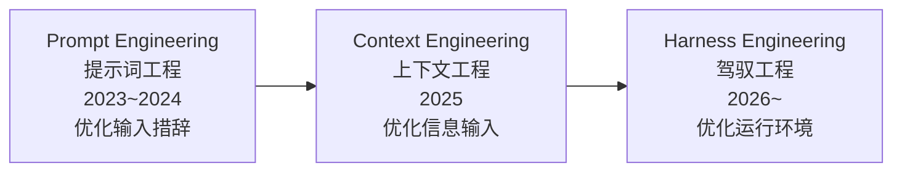
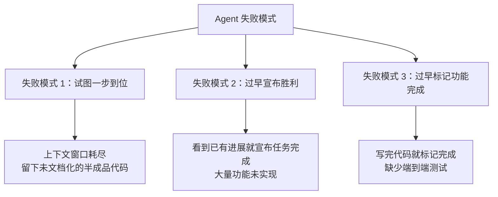
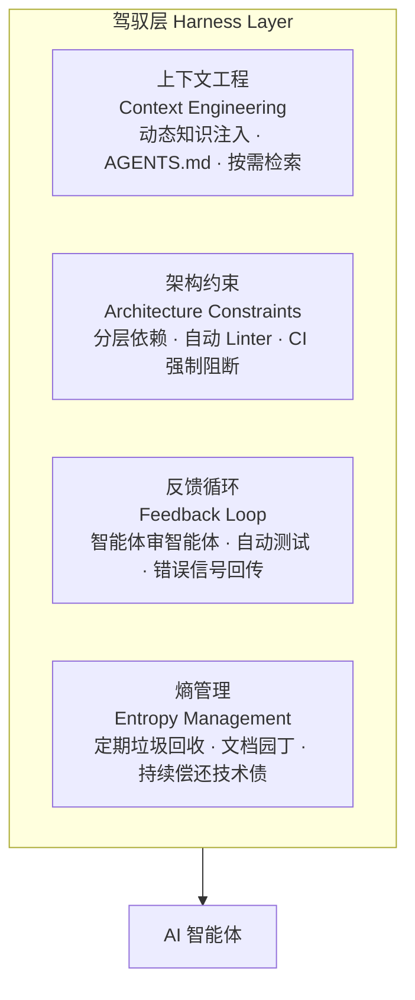
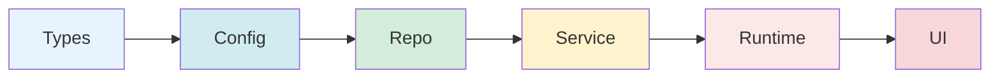
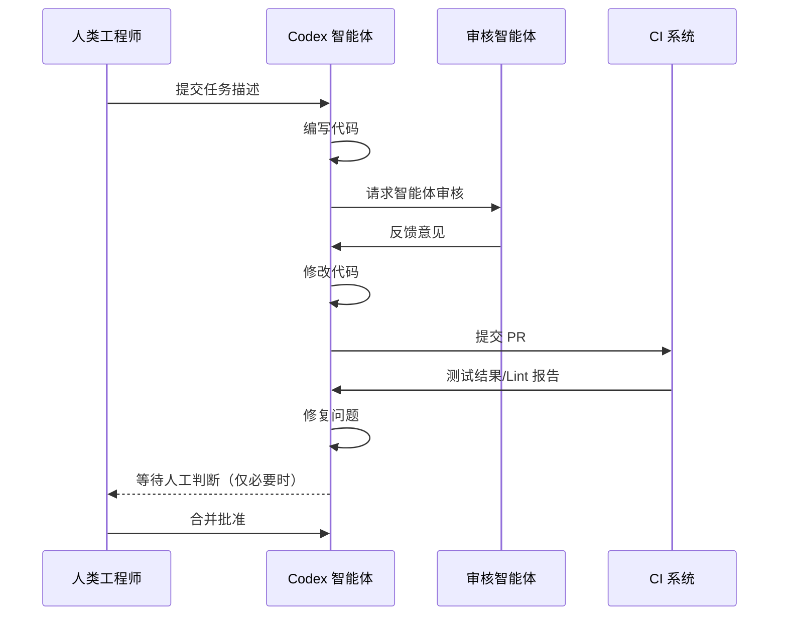
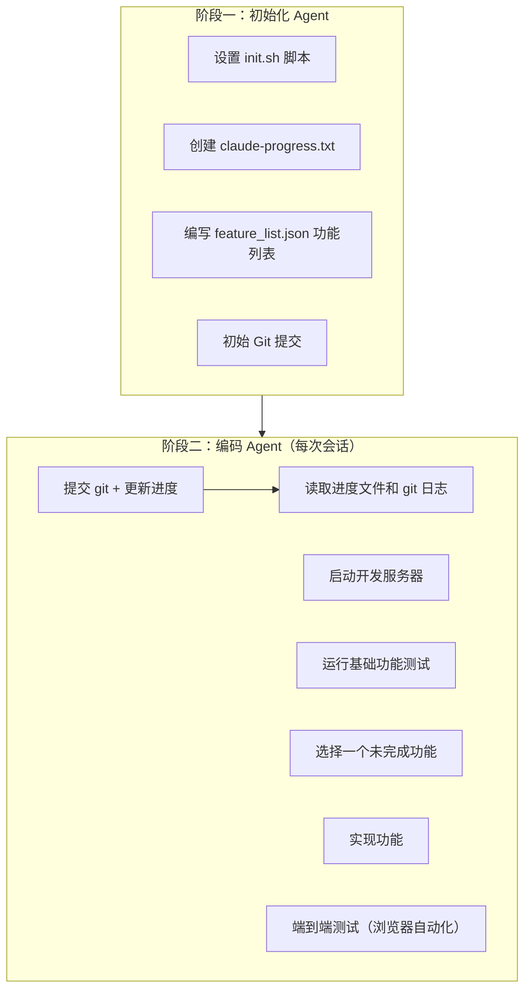
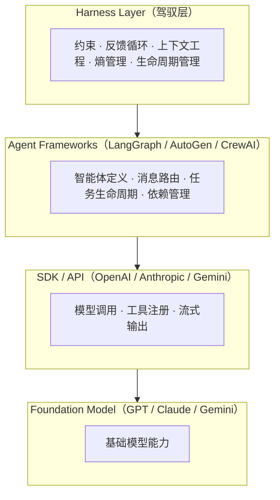
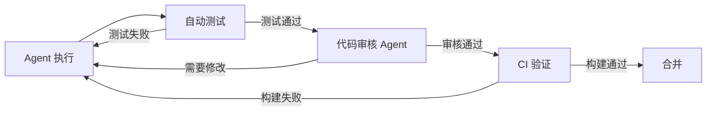
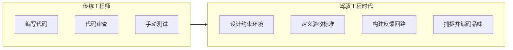

## 什么是 Harness Engineering？

**Harness Engineering（驾驭工程）** 是围绕 AI 智能体设计和构建**约束机制、反馈回路、工作流控制和持续改进循环**的系统工程实践。它不优化模型本身，而是优化模型运行的"环境"。

> "Harness engineering is the idea that anytime you find an agent makes a mistake, you take the time to engineer a solution such that the agent will not make that mistake again in the future."
>
> —— Mitchell Hashimoto，HashiCorp 联合创始人

"Harness"一词来自马具——缰绳、马鞍、嚼子——这是一套引导强大但不可预测的动物的完整装备。**驾驭工程不是去削弱 AI 的能力，而是为它打造一套黄金缰绳，让它跑得又快又稳。**

核心哲学八个字：**人类掌舵，智能体执行（Human Steer, Agent Execute）。**

这个概念由 Mitchell Hashimoto 在 2026 年 2 月 5 日首次提出，六天后 OpenAI 在百万行代码实验报告中正式采用这一术语，随后 Martin Fowler 撰文深度分析，一个月内成为开发者社区的高频词。

---

## AI 工程范式的三次跃迁

要理解驾驭工程为何重要，需要先看清楚 AI 工程的演进历程：



| 范式 | 核心问题 | 优化对象 | 交互模式 |
|------|----------|----------|----------|
| **提示词工程** | 怎么把话说清楚 | Prompt 的措辞、格式、示例 | 一问一答 |
| **上下文工程** | 怎么给 AI 喂信息 | 文档、代码片段、历史对话 | 信息注入 → 生成 |
| **驾驭工程** | 怎么让 Agent 可靠工作 | 约束、反馈回路、控制系统 | 人类掌舵，Agent 执行 |

一个好记的类比：

- **Prompt Engineering** —— 对马喊话的技巧
- **Context Engineering** —— 给马看的地图
- **Harness Engineering** —— 给马造一条高速公路，配上护栏、限速牌和加油站

---

## 为什么需要驾驭工程？真实数据

### OpenAI 的百万行代码实验

OpenAI 工程师 Ryan Lopopolo 在 2026 年 2 月分享了一项惊人实验：一个由 3~7 名工程师组成的团队，花五个月时间构建并交付了一款软件产品的内部 beta 版，其中**没有一行代码是人工编写的**。

- 代码仓库最终拥有约 **100 万行代码**
- 约 **1,500 个 Pull Request** 被打开与合并
- 人均每日处理 **3.5 个 PR** 的吞吐量
- 仅用了手工编写代码所需时间的约 **1/10**

### LangChain 的性能跃升

LangChain 的案例尤其有说服力：底层模型**一个参数都没动**，仅仅通过优化外部驾驭环境（文档结构、验证回路、追踪系统），编码 Agent 在 Terminal Bench 2.0 的得分从 **52.8% 飙升至 66.5%**，全球排名从第 **30** 位跃升至第 **5** 位。

五个独立团队得出了相同结论：**瓶颈不在模型智能，而在基础设施。**

---

## Agent 常见失败模式

Anthropic 工程师在长时间运行 Agent 的过程中，总结了三种典型的"翻车"姿势：



**失败模式 1：试图一步到位（One-shotting）**

Agent 倾向于在一个会话里把所有功能都做完。结果是上下文窗口耗尽，留下一堆没有文档的半成品代码，下一个会话启动时只能花大量时间猜测之前发生了什么。

**失败模式 2：过早宣布胜利**

在项目后期，当部分功能已经完成后，Agent 会环顾四周，看到已有进展就直接宣布任务完成——即使还有大量功能未实现。

**失败模式 3：过早标记功能完成**

在没有明确提示的情况下，Agent 写完代码就标记为"完成"，却没有做端到端测试。单元测试或 curl 命令通过了不代表功能真正可用。

此外，Agent 还有一个危险特性：**它非常擅长模式复制**。代码库里有什么模式，它就忠实地复制并放大——包括坏模式和架构漂移。这意味着不加约束的 Agent 会以惊人的速度积累技术债务。

---

## 驾驭工程的四大护栏

综合 OpenAI、Anthropic、LangChain 和 Martin Fowler 的实践，Harness 可以归纳为四个核心组件：



### 护栏一：上下文工程（Context Engineering）——新员工手册

就像给新员工一本详细的工作手册，**AGENTS.md** 是 AI 智能体进入代码仓库时看到的第一份指南。但这不是一本静态的千页说明书——上下文是稀缺资源，过多的指导反而会挤掉任务、代码和相关文档的空间，变成"陈旧规则的坟场"。

OpenAI 团队学到的核心教训很简单：**要给 Codex 的是一张地图，而不是一本 1,000 页的说明书。**

他们曾尝试"一个大型的 AGENTS.md"方法，结果失败了：

- 上下文是一种稀缺资源，巨大的指令文件会挤掉任务、代码和相关文档
- 过多的指导反而变得无效——当一切都"重要"时，一切都不重要了
- 它会立即腐烂，变成陈旧规则的坟场
- 它很难核实，单个 blob 不适合进行机械检查

更好的做法是：提供一个稳定、小巧的入口点（约 100 行的 AGENTS.md），然后"教" Agent 根据当前任务按需检索和拉取更多的上下文。

```
AGENTS.md
ARCHITECTURE.md
docs/
├── design-docs/
│   ├── index.md
│   ├── core-beliefs.md
│   └── ...
├── exec-plans/
│   ├── active/
│   ├── completed/
│   └── tech-debt-tracker.md
├── product-specs/
│   ├── index.md
│   └── ...
├── DESIGN.md
├── FRONTEND.md
├── PLANS.md
└── QUALITY_SCORE.md
```

Mitchell Hashimoto 的 Ghostty 项目 AGENTS.md 里每一行都对应一个历史 Agent 失败案例——**文档是活的反馈循环，不是静态制品。**

### 护栏二：架构约束（Architecture Constraints）——缰绳

OpenAI 团队建立了严格的层级依赖模型：



**下层不能反向依赖上层。** 所有架构规则被编码为自定义 Linter 规则，违反即 CI 阻止合并——无论代码是人写的还是 AI 写的。

有个关键细节：Linter 的错误信息本身也是上下文工程。它不只说"你违反了规则 X"，而是解释"为什么这个规则存在、正确做法是什么"，这样 Agent 读到错误后就能自我理解并修正，不需要人类介入。

这种架构通常要等到你拥有数百名工程师时才会考虑，但对于编码智能体来说，这是一个**早期的先决条件**：有了约束，速度才不会下降，架构才不会漂移。

### 护栏三：反馈循环（Feedback Loop）——智能体审智能体

传统开发中，人类工程师负责代码审查（Code Review）。在驾驭工程中，这个工作变成了"智能体对智能体"的方式：



如果 AI 写的测试用例"通过"了带有 Bug 的代码，Harness 就会判定测试无效，强迫它重新思考测试边界。

### 护栏四：熵管理（Entropy Management）——垃圾回收

随着时间推移，软件系统会逐渐混乱（熵增），技术债务会积累。OpenAI 采用持续小额偿还的策略，而不是等问题严重时集中处理——他们把这个方法形象地称为"**垃圾回收**"，并认为技术债务就像高息贷款。

具体措施：
- 定期运行后台 Codex 任务扫描偏差、更新质量等级、发起针对性重构 PR
- 专门的 **Doc-gardening Agent**（文档园丁代理）：在后台自动扫描文档与代码之间的不一致，发现过时内容就自动提交 PR 修复

人类的品味一旦被捕捉，就会持续应用于每一行代码。这也使团队能够每天发现并解决不良模式，而不是让它们在代码库中传播数天或数周。

---

## Anthropic 的长时间运行 Agent 方案

Anthropic 工程师在实践中开发了一套两阶段解决方案，专门用于跨多个上下文窗口的长时间运行 Agent。

### 核心问题

长时间运行 Agent 面临的核心挑战是：它们必须在离散的会话中工作，而每个新会话都以没有任何记忆开始。就像一个由轮班工程师组成的软件项目，每个新工程师到来时对上一班发生的事情一无所知。

### 两阶段解决方案



### 功能列表文件（feature_list.json）

功能列表使用 JSON 格式（而非 Markdown），因为模型不太可能不适当地更改或覆盖 JSON 文件：

```json
{
    "category": "functional",
    "description": "New chat button creates a fresh conversation",
    "steps": [
      "Navigate to main interface",
      "Click the 'New Chat' button",
      "Verify a new conversation is created",
      "Check that chat area shows welcome state",
      "Verify conversation appears in sidebar"
    ],
    "passes": false
}
```

所有功能初始都标记为 "failing"，Agent 只通过将 `passes` 字段改为 `true` 来更新状态，并有强制性说明："删除或编辑测试是不可接受的，因为这可能导致缺失或有 Bug 的功能。"

### 典型会话启动流程

```
[助手] 我将首先了解当前项目状态。
[工具调用] pwd
[工具调用] 读取 claude-progress.txt
[工具调用] 读取 feature_list.json
[助手] 让我查看 git 日志了解最近的工作。
[工具调用] git log --oneline -20
[助手] 现在让我检查 init.sh 脚本重启服务器。
[启动开发服务器]
[助手] 很好！现在让我导航到应用程序并验证基本功能是否仍然正常工作。
[测试基本功能]
[助手] 根据验证测试，我可以看到核心功能运行良好。现在让我找到下一个要实现的功能。
[开始处理新功能]
```

### 失败模式与解决方案对照

| 问题 | 初始化 Agent 行为 | 编码 Agent 行为 |
|------|------------------|----------------|
| Claude 过早宣布整个项目完成 | 设置功能列表文件：基于输入规格，建立包含端到端功能描述的结构化 JSON 文件 | 在会话开始时读取功能列表文件，选择单个功能开始处理 |
| Claude 留下有 Bug 或未文档化进度的环境 | 写入初始 git 仓库和进度记录文件 | 通过读取进度文件和 git 提交日志开始会话，并运行基础测试以发现未文档化的 Bug；以 git 提交和进度更新结束会话 |
| Claude 过早将功能标记为完成 | 设置功能列表文件 | 自我验证所有功能，仅在仔细测试后才将功能标记为"通过" |
| Claude 需要花时间弄清楚如何运行应用 | 写入能运行开发服务器的 init.sh 脚本 | 会话开始时读取 init.sh |

---

## 六大行业共识

综合 OpenAI、Anthropic、LangChain、Stripe、HashiCorp 等多个独立信息源，业界在以下六个方面已形成明确共识：

| # | 共识 | 核心观点 |
|---|------|----------|
| 1 | **瓶颈在基础设施，不在模型智能** | 五个独立团队得出相同结论。仅改变 Harness 工具格式，就能让模型得分从 6.7% 跳到 68.3% |
| 2 | **文档必须是活的反馈循环** | 静态文档是坟场，动态文档才有价值。让后台 Agent 定期清理过时文档并提交 PR |
| 3 | **思考与执行分离** | 复杂任务不可能在单个上下文窗口内完成，需要 Orchestrator + Worker 分层架构，状态持久化到外部存储 |
| 4 | **上下文不是越多越好** | 上下文是稀缺资源。巨大的指令文件会挤掉任务空间，应按需检索、动态注入 |
| 5 | **约束必须自动化** | 人工 Review 是瓶颈。护栏要编码为 Linter、CI、类型系统，让机器来执行而非人 |
| 6 | **工程师角色在转变** | 从"代码的编写者"变成"环境的建筑师"。最大的工程挑战是设计让 Agent 可靠工作的控制系统 |

---

## Harness 与传统框架的关系

Harness 不是 SDK、脚手架或 Agent 框架的替代品，而是**位于它们之上的一层**：



传统框架解决的是"**如何构建 AI 智能体**"，而驾驭层解决的是完全不同的问题：**"智能体如何可靠地运行"**。

模型正在逐渐吸收框架约 80% 的功能（智能体定义、消息路由、任务生命周期……），但剩余 20%——**持久化、确定性重放、成本控制、可观测性、错误恢复**——正是驾驭层存在的价值。

---

## 实践指南：如何构建你的 Harness

### 第一步：建立活文档体系

```
项目根目录/
├── AGENTS.md          # 约 100 行，作为目录入口
├── ARCHITECTURE.md    # 架构概览
└── docs/
    ├── design-docs/   # 设计文档（带验证状态）
    ├── exec-plans/    # 执行计划（活跃/已完成/技术债务）
    └── references/    # 外部参考文档
```

关键原则：
- AGENTS.md 保持简短，作为地图而非百科全书
- 每条规则都应能追溯到一个历史 Agent 失败案例
- 建立文档园丁 Agent 自动维护文档

### 第二步：实施架构约束

为你的项目建立清晰的层级依赖规则：
1. 定义架构层级（如 Types → Config → Service → UI）
2. 将规则编码为 Linter 规则（含有意义的错误信息）
3. 在 CI 中强制执行，违规则阻止合并

### 第三步：建立反馈回路



### 第四步：管理熵增

- 建立"黄金原则"文档，编码技术品味
- 定期运行后台清理 Agent
- 将技术债务视为高息贷款——持续小额偿还

---

## 工程师角色的转变

随着 Harness Engineering 的兴起，软件工程师的核心工作正在发生根本性转变：



**从"代码的编写者"转变为"环境的建筑师"。**

OpenAI 的 Ryan Lopopolo 对此有精辟的总结：

> "构建软件仍然需要纪律，但纪律更多地体现在支撑结构上，而不是代码上。保持代码库一致性的工具、抽象和反馈回路变得越发重要。"

Birgitta Böckeler 则做了一个绝妙的比喻：

> "为了获得更高的 AI 自主性，运行时必须受到更严格的约束。增加信任需要的不是更多自由，而是更多限制。"
>
> 就像高速公路上的护栏——正是因为有护栏，你才敢踩到 120 码。

---

## 总结

| 核心组件 | 解决的问题 | 代表实践 |
|----------|-----------|----------|
| **上下文工程** Context | Agent 不知道该看什么、怎么找 | AGENTS.md 活文档、按需检索 |
| **架构约束** Constraints | Agent 复制并放大坏模式 | 分层依赖、自定义 Linter、CI 强制阻断 |
| **反馈循环** Feedback | Agent 不知道自己做错了 | Agent-to-Agent Review、自动测试套件 |
| **熵管理** Entropy | 技术债务和文档腐烂 | Doc-gardening Agent、持续垃圾回收 |

Harness Engineering 不是某一家公司的实验，而是整个行业正在经历的范式转移。软件开发的未来，可能不再是关于"我们能写多快多好的代码"，而是关于"**我们能设计多聪明、多鲁棒的系统来驾驭 AI 代理的巨大能量**"。

---

## 参考资料

- [Effective harnesses for long-running agents - Anthropic Engineering](https://www.anthropic.com/engineering/effective-harnesses-for-long-running-agents)
- [工程技术：在智能体优先的世界中利用 Codex - OpenAI](https://openai.com/zh-Hans-CN/index/harness-engineering/)
- [Harness Engineering（驾驭工程）- 菜鸟教程](https://www.runoob.com/ai-agent/harness-engineering.html)
