## 引言

在数字化转型的时代，持续学习成为职业发展的关键。Google Learn Your Way 是 Google 推出的免费在线学习平台，旨在帮助用户掌握数字技能，提升职业竞争力。本指南将全面介绍如何使用这个平台，打造属于你的个性化学习路径。

## 什么是 Learn Your Way

### 平台概述

Google Learn Your Way 是一个免费的在线学习平台，提供涵盖数字技能、职业发展、技术应用等多个领域的课程。平台特点包括：

- **完全免费**：所有课程内容均可免费访问
- **自主学习**：按照自己的节奏和时间安排学习
- **权威内容**：由 Google 及合作伙伴提供专业课程
- **实用导向**：注重实际技能的培养和应用

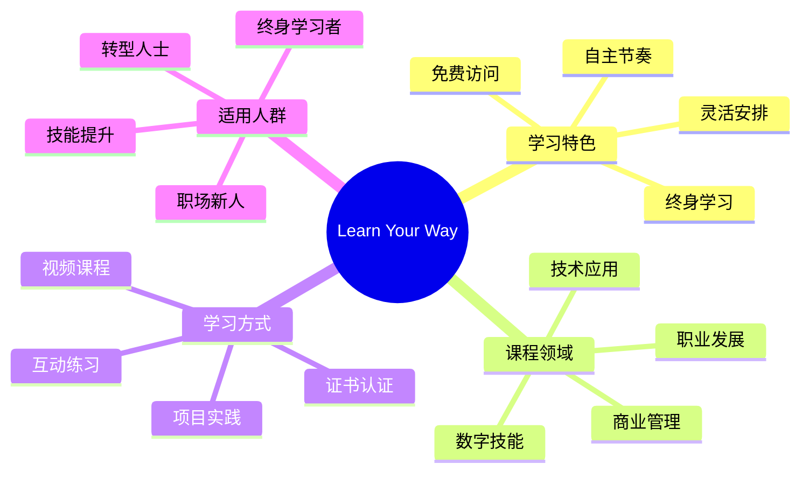
```mermaid
mindmap
  root((Learn Your Way))
    学习特色
      免费访问
      自主节奏
      灵活安排
      终身学习
    课程领域
      数字技能
      职业发展
      技术应用
      商业管理
    学习方式
      视频课程
      互动练习
      项目实践
      证书认证
    适用人群
      职场新人
      转型人士
      技能提升
      终身学习者
```

### 核心价值

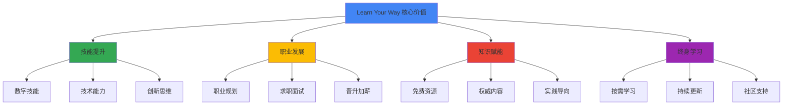
```mermaid
graph TB
    A[Learn Your Way 核心价值] --> B[技能提升]
    A --> C[职业发展]
    A --> D[知识赋能]
    A --> E[终身学习]
    
    B --> B1[数字技能]
    B --> B2[技术能力]
    B --> B3[创新思维]
    
    C --> C1[职业规划]
    C --> C2[求职面试]
    C --> C3[晋升加薪]
    
    D --> D1[免费资源]
    D --> D2[权威内容]
    D --> D3[实践导向]
    
    E --> E1[按需学习]
    E --> E2[持续更新]
    E --> E3[社区支持]
    
    style A fill:#4285F4
    style B fill:#34A853
    style C fill:#FBBC04
    style D fill:#EA4335
    style E fill:#9C27B0
```

## 快速开始

### 注册与登录流程

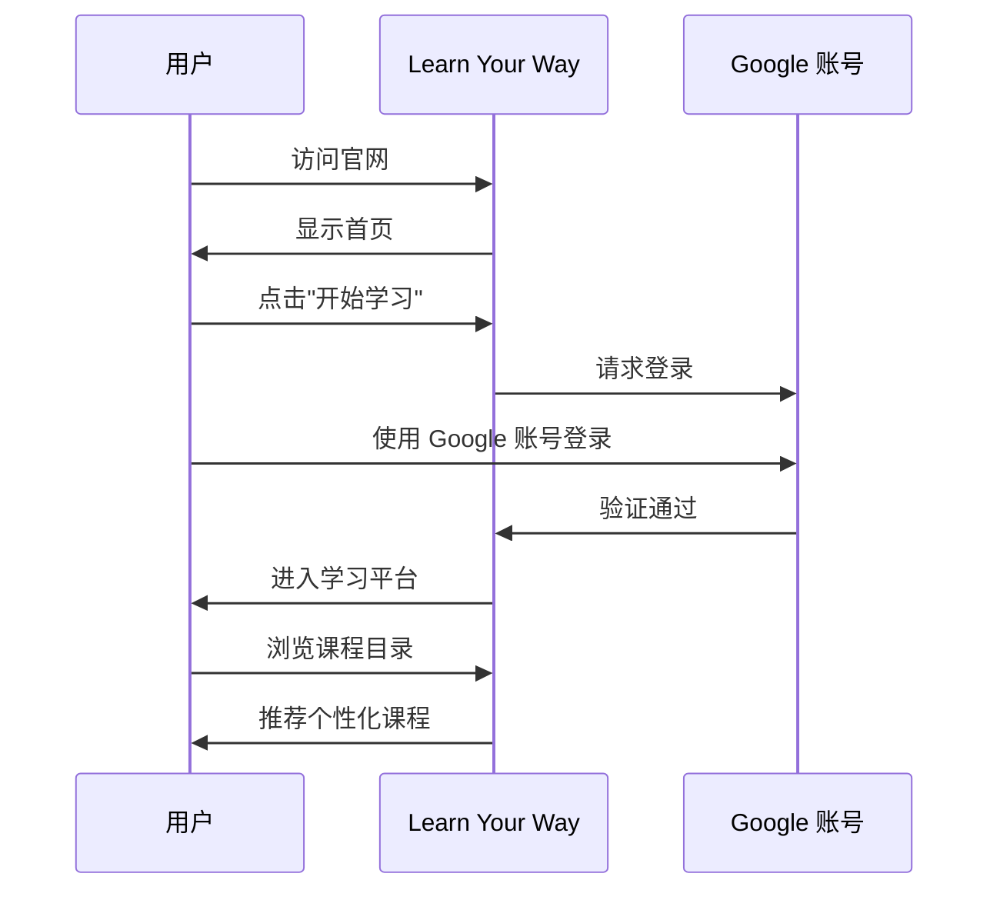
```mermaid
sequenceDiagram
    participant U as 用户
    participant W as Learn Your Way
    participant G as Google 账号
    
    U->>W: 访问官网
    W->>U: 显示首页
    U->>W: 点击"开始学习"
    W->>G: 请求登录
    U->>G: 使用 Google 账号登录
    G->>W: 验证通过
    W->>U: 进入学习平台
    U->>W: 浏览课程目录
    W->>U: 推荐个性化课程
```

**详细步骤：**

1. **访问平台**
   - 打开浏览器，访问 [https://learnyourway.withgoogle.com/](https://learnyourway.withgoogle.com/)
   - 平台支持多语言，可根据需要选择语言

2. **账号登录**
   - 点击页面右上角的"登录"或"开始学习"按钮
   - 使用现有 Google 账号登录
   - 如无 Google 账号，需先注册一个

3. **完善个人信息**
   - 首次登录会提示完善学习目标
   - 选择感兴趣的领域和技能方向
   - 设置学习偏好和时间安排

### 界面导航

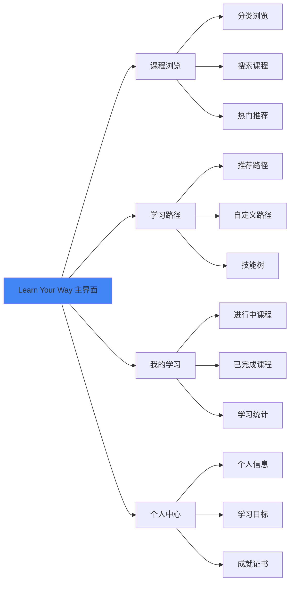
```mermaid
graph LR
    A[Learn Your Way 主界面] --> B[课程浏览]
    A --> C[学习路径]
    A --> D[我的学习]
    A --> E[个人中心]
    
    B --> B1[分类浏览]
    B --> B2[搜索课程]
    B --> B3[热门推荐]
    
    C --> C1[推荐路径]
    C --> C2[自定义路径]
    C --> C3[技能树]
    
    D --> D1[进行中课程]
    D --> D2[已完成课程]
    D --> D3[学习统计]
    
    E --> E1[个人信息]
    E --> E2[学习目标]
    E --> E3[成就证书]
    
    style A fill:#4285F4
```

## 核心功能详解

### 1. 课程浏览与选择

#### 课程分类体系

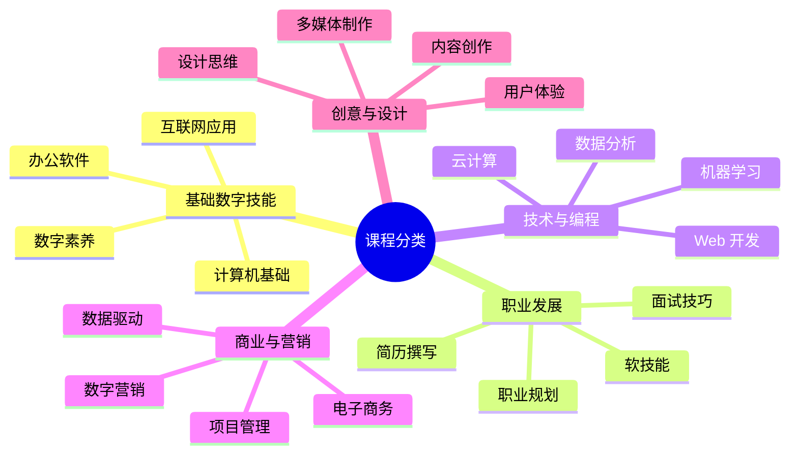
```mermaid
mindmap
  root((课程分类))
    基础数字技能
      计算机基础
      互联网应用
      办公软件
      数字素养
    职业发展
      简历撰写
      面试技巧
      职业规划
      软技能
    技术与编程
      Web 开发
      数据分析
      云计算
      机器学习
    商业与营销
      数字营销
      电子商务
      数据驱动
      项目管理
    创意与设计
      设计思维
      用户体验
      内容创作
      多媒体制作
```

#### 选课建议流程

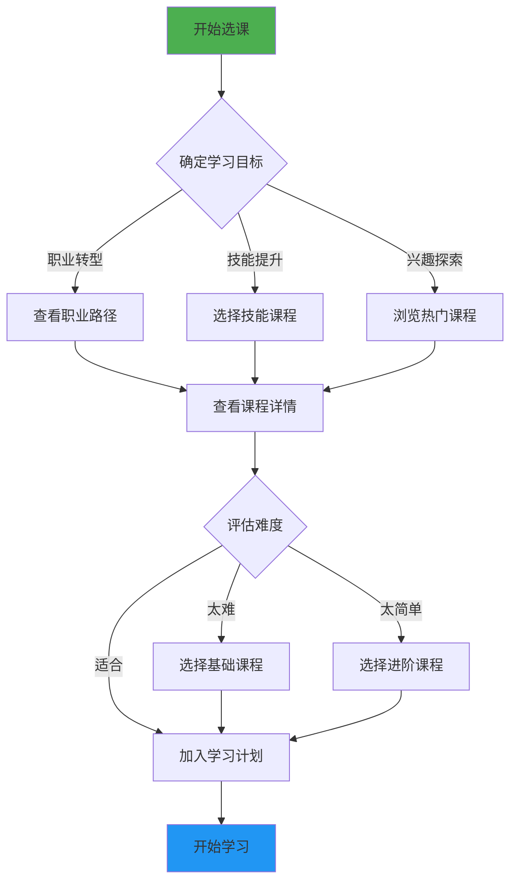
```mermaid
flowchart TD
    Start[开始选课] --> A{确定学习目标}
    A -->|职业转型| B[查看职业路径]
    A -->|技能提升| C[选择技能课程]
    A -->|兴趣探索| D[浏览热门课程]
    
    B --> E[查看课程详情]
    C --> E
    D --> E
    
    E --> F{评估难度}
    F -->|适合| G[加入学习计划]
    F -->|太难| H[选择基础课程]
    F -->|太简单| I[选择进阶课程]
    
    H --> G
    I --> G
    
    G --> J[开始学习]
    
    style Start fill:#4CAF50
    style J fill:#2196F3
```

### 2. 学习路径规划

#### 学习路径类型

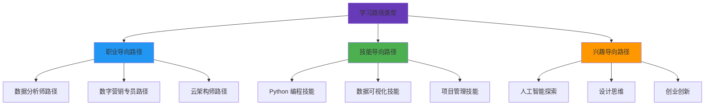
```mermaid
graph TD
    A[学习路径类型] --> B[职业导向路径]
    A --> C[技能导向路径]
    A --> D[兴趣导向路径]
    
    B --> B1[数据分析师路径]
    B --> B2[数字营销专员路径]
    B --> B3[云架构师路径]
    
    C --> C1[Python 编程技能]
    C --> C2[数据可视化技能]
    C --> C3[项目管理技能]
    
    D --> D1[人工智能探索]
    D --> D2[设计思维]
    D --> D3[创业创新]
    
    style A fill:#673AB7
    style B fill:#2196F3
    style C fill:#4CAF50
    style D fill:#FF9800
```

#### 创建个性化路径

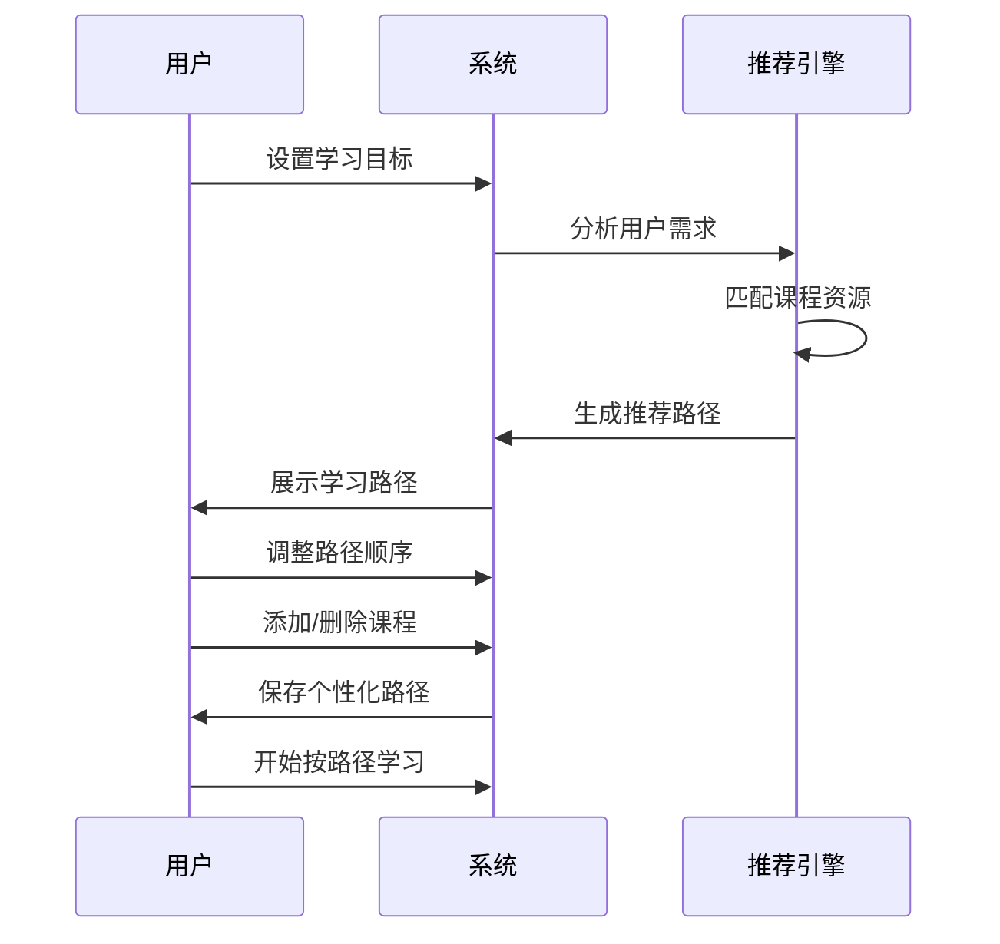
```mermaid
sequenceDiagram
    participant U as 用户
    participant S as 系统
    participant R as 推荐引擎
    
    U->>S: 设置学习目标
    S->>R: 分析用户需求
    R->>R: 匹配课程资源
    R->>S: 生成推荐路径
    S->>U: 展示学习路径
    U->>S: 调整路径顺序
    U->>S: 添加/删除课程
    S->>U: 保存个性化路径
    U->>S: 开始按路径学习
```

### 3. 学习进度管理

#### 进度跟踪系统

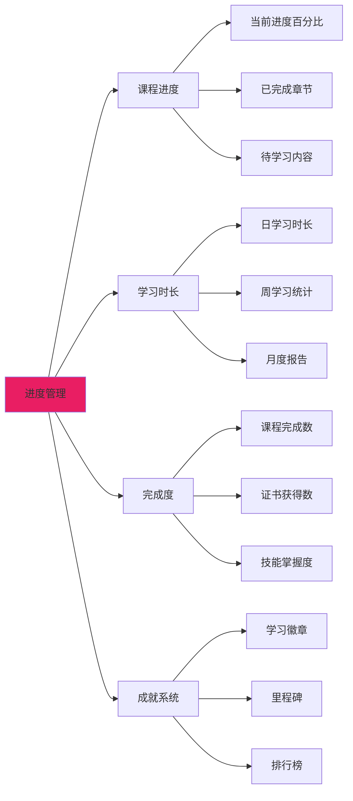
```mermaid
graph LR
    A[进度管理] --> B[课程进度]
    A --> C[学习时长]
    A --> D[完成度]
    A --> E[成就系统]
    
    B --> B1[当前进度百分比]
    B --> B2[已完成章节]
    B --> B3[待学习内容]
    
    C --> C1[日学习时长]
    C --> C2[周学习统计]
    C --> C3[月度报告]
    
    D --> D1[课程完成数]
    D --> D2[证书获得数]
    D --> D3[技能掌握度]
    
    E --> E1[学习徽章]
    E --> E2[里程碑]
    E --> E3[排行榜]
    
    style A fill:#E91E63
```

#### 学习数据可视化

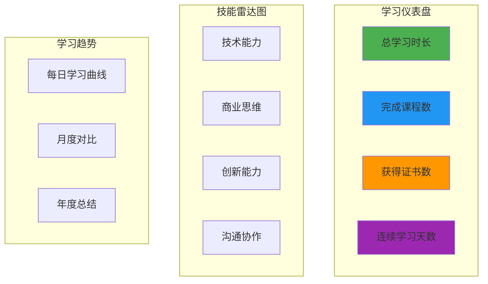
```mermaid
graph TB
    subgraph 学习仪表盘
        A[总学习时长] 
        B[完成课程数]
        C[获得证书数]
        D[连续学习天数]
    end
    
    subgraph 技能雷达图
        E[技术能力]
        F[商业思维]
        G[创新能力]
        H[沟通协作]
    end
    
    subgraph 学习趋势
        I[每日学习曲线]
        J[月度对比]
        K[年度总结]
    end
    
    style A fill:#4CAF50
    style B fill:#2196F3
    style C fill:#FF9800
    style D fill:#9C27B0
```

### 4. 互动学习功能

#### 学习方式

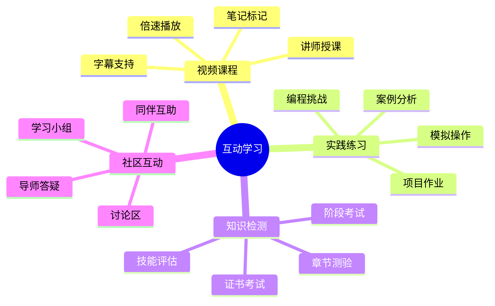
```mermaid
mindmap
  root((互动学习))
    视频课程
      讲师授课
      字幕支持
      倍速播放
      笔记标记
    实践练习
      编程挑战
      案例分析
      模拟操作
      项目作业
    知识检测
      章节测验
      阶段考试
      技能评估
      证书考试
    社区互动
      讨论区
      学习小组
      导师答疑
      同伴互助
```

#### 学习循环

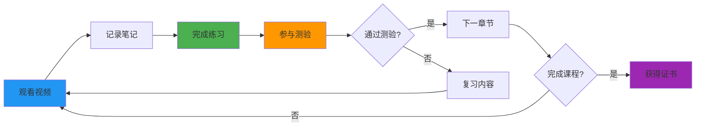
```mermaid
flowchart LR
    A[观看视频] --> B[记录笔记]
    B --> C[完成练习]
    C --> D[参与测验]
    D --> E{通过测验?}
    E -->|是| F[下一章节]
    E -->|否| G[复习内容]
    G --> A
    F --> H{完成课程?}
    H -->|否| A
    H -->|是| I[获得证书]
    
    style A fill:#2196F3
    style C fill:#4CAF50
    style D fill:#FF9800
    style I fill:#9C27B0
```

## 热门课程推荐

### 数字技能基础

#### 课程结构

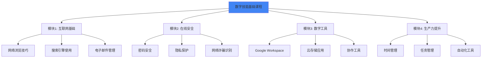
```mermaid
graph TD
    A[数字技能基础课程] --> B[模块1: 互联网基础]
    A --> C[模块2: 在线安全]
    A --> D[模块3: 数字工具]
    A --> E[模块4: 生产力提升]
    
    B --> B1[网络浏览技巧]
    B --> B2[搜索引擎使用]
    B --> B3[电子邮件管理]
    
    C --> C1[密码安全]
    C --> C2[隐私保护]
    C --> C3[网络诈骗识别]
    
    D --> D1[Google Workspace]
    D --> D2[云存储应用]
    D --> D3[协作工具]
    
    E --> E1[时间管理]
    E --> E2[任务管理]
    E --> E3[自动化工具]
    
    style A fill:#4285F4
```

### 数据分析路径

#### 学习路线图

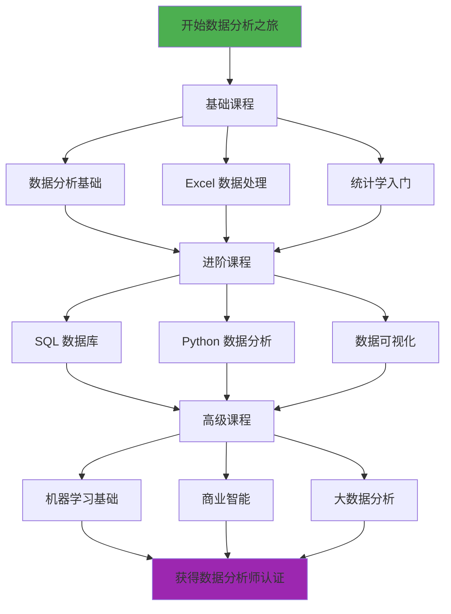
```mermaid
flowchart TB
    Start[开始数据分析之旅] --> A[基础课程]
    
    A --> A1[数据分析基础]
    A --> A2[Excel 数据处理]
    A --> A3[统计学入门]
    
    A1 --> B[进阶课程]
    A2 --> B
    A3 --> B
    
    B --> B1[SQL 数据库]
    B --> B2[Python 数据分析]
    B --> B3[数据可视化]
    
    B1 --> C[高级课程]
    B2 --> C
    B3 --> C
    
    C --> C1[机器学习基础]
    C --> C2[商业智能]
    C --> C3[大数据分析]
    
    C1 --> End[获得数据分析师认证]
    C2 --> End
    C3 --> End
    
    style Start fill:#4CAF50
    style End fill:#9C27B0
```

### 数字营销课程

#### 营销知识体系

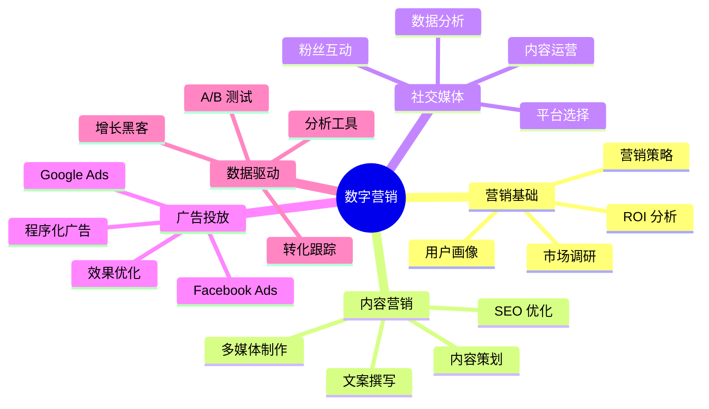
```mermaid
mindmap
  root((数字营销))
    营销基础
      市场调研
      用户画像
      营销策略
      ROI 分析
    内容营销
      内容策划
      文案撰写
      多媒体制作
      SEO 优化
    社交媒体
      平台选择
      内容运营
      粉丝互动
      数据分析
    广告投放
      Google Ads
      Facebook Ads
      程序化广告
      效果优化
    数据驱动
      分析工具
      转化跟踪
      A/B 测试
      增长黑客
```

## 实战案例

### 案例1: 职业转型 - 从传统行业到数据分析

#### 学习路径设计

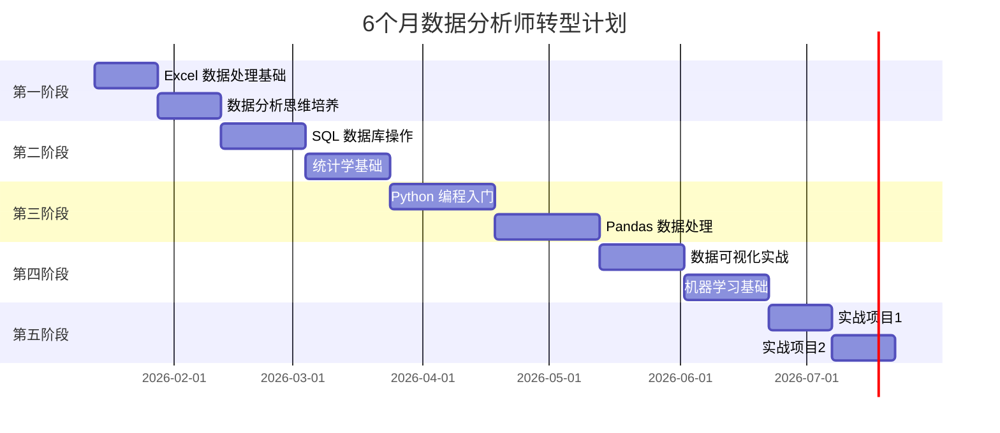
```mermaid
gantt
    title 6个月数据分析师转型计划
    dateFormat YYYY-MM-DD
    section 第一阶段
    Excel 数据处理基础          :a1, 2026-01-13, 15d
    数据分析思维培养            :a2, after a1, 15d
    section 第二阶段
    SQL 数据库操作             :a3, after a2, 20d
    统计学基础                  :a4, after a3, 20d
    section 第三阶段
    Python 编程入门            :a5, after a4, 25d
    Pandas 数据处理            :a6, after a5, 25d
    section 第四阶段
    数据可视化实战              :a7, after a6, 20d
    机器学习基础                :a8, after a7, 20d
    section 第五阶段
    实战项目1                  :a9, after a8, 15d
    实战项目2                  :a10, after a9, 15d
```

#### 学习成果

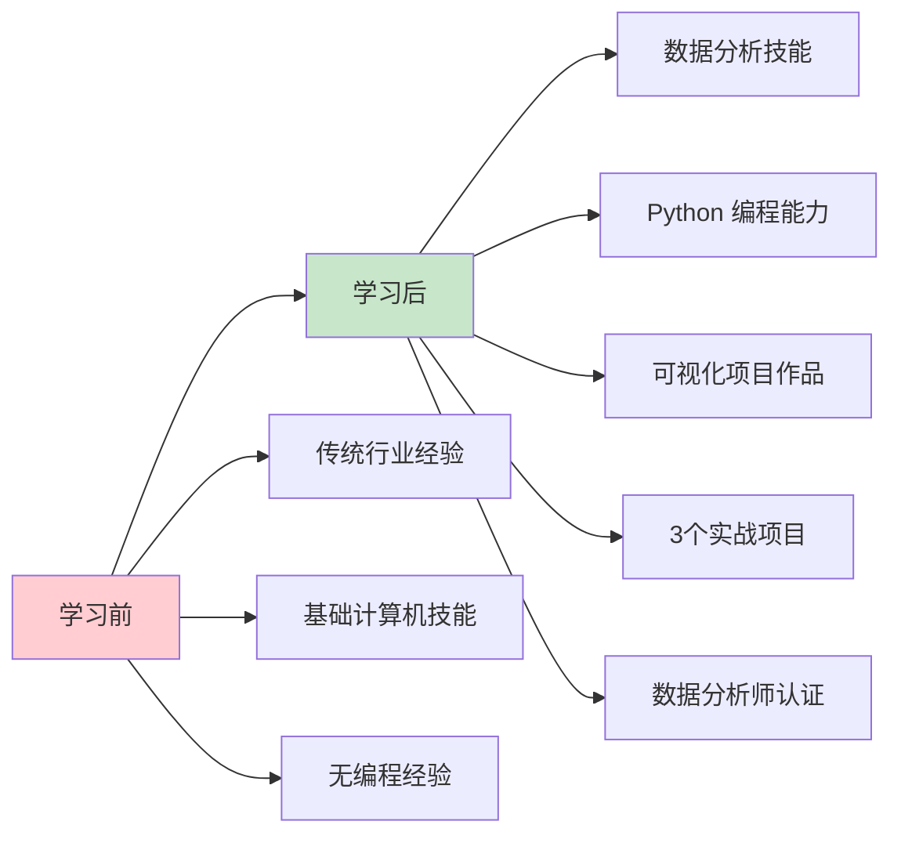
```mermaid
graph LR
    A[学习前] --> B[学习后]
    
    A --> A1[传统行业经验]
    A --> A2[基础计算机技能]
    A --> A3[无编程经验]
    
    B --> B1[数据分析技能]
    B --> B2[Python 编程能力]
    B --> B3[可视化项目作品]
    B --> B4[3个实战项目]
    B --> B5[数据分析师认证]
    
    style A fill:#FFCDD2
    style B fill:#C8E6C9
```

### 案例2: 技能提升 - 市场人员学习数字营销

#### 学习策略

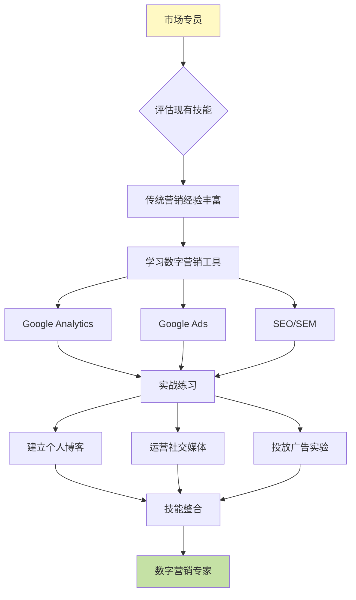
```mermaid
flowchart TD
    Start[市场专员] --> A{评估现有技能}
    
    A --> B[传统营销经验丰富]
    B --> C[学习数字营销工具]
    
    C --> C1[Google Analytics]
    C --> C2[Google Ads]
    C --> C3[SEO/SEM]
    
    C1 --> D[实战练习]
    C2 --> D
    C3 --> D
    
    D --> D1[建立个人博客]
    D --> D2[运营社交媒体]
    D --> D3[投放广告实验]
    
    D1 --> E[技能整合]
    D2 --> E
    D3 --> E
    
    E --> F[数字营销专家]
    
    style Start fill:#FFF9C4
    style F fill:#C5E1A5
```

#### 学习时间分配

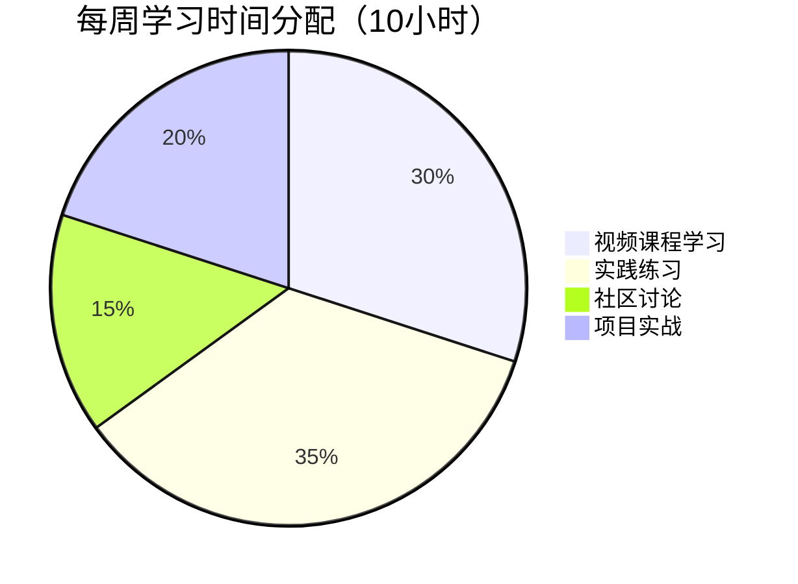
```mermaid
pie title 每周学习时间分配（10小时）
    "视频课程学习" : 30
    "实践练习" : 35
    "社区讨论" : 15
    "项目实战" : 20
```

### 案例3: 团队学习 - 企业数字化转型培训

#### 团队学习架构

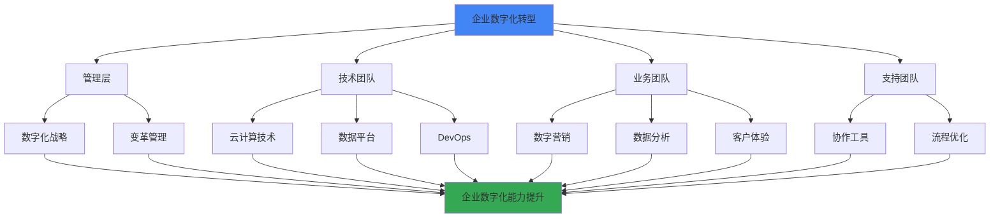
```mermaid
graph TB
    A[企业数字化转型] --> B[管理层]
    A --> C[技术团队]
    A --> D[业务团队]
    A --> E[支持团队]
    
    B --> B1[数字化战略]
    B --> B2[变革管理]
    
    C --> C1[云计算技术]
    C --> C2[数据平台]
    C --> C3[DevOps]
    
    D --> D1[数字营销]
    D --> D2[数据分析]
    D --> D3[客户体验]
    
    E --> E1[协作工具]
    E --> E2[流程优化]
    
    B1 --> F[企业数字化能力提升]
    B2 --> F
    C1 --> F
    C2 --> F
    C3 --> F
    D1 --> F
    D2 --> F
    D3 --> F
    E1 --> F
    E2 --> F
    
    style A fill:#4285F4
    style F fill:#34A853
```

## 证书与认证

### 证书体系

```mermaid
graph TD
    A[Learn Your Way 证书体系] --> B[课程完成证书]
    A --> C[技能认证证书]
    A --> D[专业资格证书]
    
    B --> B1[单课程证书]
    B --> B2[系列课程证书]
    
    C --> C1[基础技能认证]
    C --> C2[中级技能认证]
    C --> C3[高级技能认证]
    
    D --> D1[Google 官方认证]
    D --> D2[行业合作认证]
    
    style A fill:#9C27B0
    style B fill:#2196F3
    style C fill:#4CAF50
    style D fill:#FF9800
```

### 获取证书流程

```mermaid
sequenceDiagram
    participant U as 学员
    participant C as 课程系统
    participant E as 考试系统
    participant CS as 证书系统
    
    U->>C: 完成所有课程内容
    C->>C: 验证学习进度 100%
    C->>E: 解锁结业考试
    U->>E: 参加结业考试
    E->>E: 评分
    E->>U: 返回成绩
    alt 考试通过
        E->>CS: 触发证书生成
        CS->>CS: 生成数字证书
        CS->>U: 颁发证书
        U->>CS: 下载/分享证书
    else 考试不通过
        E->>U: 显示复习建议
        U->>C: 重新学习
        U->>E: 再次参加考试
    end
```

### 证书价值

```mermaid
mindmap
  root((证书价值))
    职业发展
      简历加分
      面试优势
      晋升资本
      薪资谈判
    技能证明
      能力认证
      学习成果
      专业水平
      持续学习
    个人品牌
      LinkedIn 展示
      社交媒体
      个人网站
      行业认可
    网络拓展
      学习社区
      专业人脉
      合作机会
      导师资源
```

## 学习技巧与最佳实践

### 高效学习方法

```mermaid
flowchart LR
    A[高效学习方法] --> B[制定计划]
    A --> C[主动学习]
    A --> D[刻意练习]
    A --> E[及时复习]
    A --> F[输出分享]
    
    B --> B1[设定目标]
    B --> B2[时间规划]
    B --> B3[里程碑设置]
    
    C --> C1[带问题学习]
    C --> C2[记录笔记]
    C --> C3[思考总结]
    
    D --> D1[项目实践]
    D --> D2[错题回顾]
    D --> D3[技能强化]
    
    E --> E1[艾宾浩斯曲线]
    E --> E2[间隔重复]
    E --> E3[知识梳理]
    
    F --> F1[写学习笔记]
    F --> F2[社区分享]
    F --> F3[教别人]
    
    style A fill:#FF5722
```

### 学习时间管理

#### 番茄工作法应用

```mermaid
gantt
    title 番茄工作法学习时间安排
    dateFormat HH:mm
    axisFormat %H:%M
    
    section 上午学习
    学习阶段1           :a1, 09:00, 25m
    短休息              :milestone, m1, 09:25, 0m
    学习阶段2           :a2, 09:30, 25m
    短休息              :milestone, m2, 09:55, 0m
    学习阶段3           :a3, 10:00, 25m
    短休息              :milestone, m3, 10:25, 0m
    学习阶段4           :a4, 10:30, 25m
    长休息              :milestone, m4, 10:55, 0m
    
    section 下午学习
    学习阶段5           :a5, 14:00, 25m
    短休息              :milestone, m5, 14:25, 0m
    学习阶段6           :a6, 14:30, 25m
    短休息              :milestone, m6, 14:55, 0m
    学习阶段7           :a7, 15:00, 25m
    短休息              :milestone, m7, 15:25, 0m
    学习阶段8           :a8, 15:30, 25m
```

### 学习资源整合

```mermaid
graph TB
    A[学习资源整合] --> B[平台内资源]
    A --> C[外部补充资源]
    A --> D[实践资源]
    A --> E[社区资源]
    
    B --> B1[课程视频]
    B --> B2[配套文档]
    B --> B3[练习题库]
    
    C --> C1[技术博客]
    C --> C2[开源项目]
    C --> C3[技术文档]
    
    D --> D1[练习平台]
    D --> D2[实战项目]
    D --> D3[竞赛挑战]
    
    E --> E1[学习小组]
    E --> E2[问答论坛]
    E --> E3[线下活动]
    
    style A fill:#00BCD4
```

## 常见问题解答

### FAQ 分类

```mermaid
mindmap
  root((常见问题))
    账号相关
      注册登录
      密码找回
      账号安全
      信息修改
    课程相关
      课程选择
      难度评估
      学习方式
      进度同步
    证书相关
      获取条件
      证书类型
      有效期
      使用场景
    技术问题
      视频播放
      下载问题
      浏览器兼容
      移动端使用
```

### 问题解决流程

```mermaid
flowchart TD
    Start[遇到问题] --> A{问题类型}
    
    A -->|技术问题| B[检查网络连接]
    A -->|学习问题| C[查看课程FAQ]
    A -->|账号问题| D[联系客服]
    
    B --> B1{问题解决?}
    B1 -->|是| End[继续学习]
    B1 -->|否| E[清除缓存/换浏览器]
    
    C --> C1{找到答案?}
    C1 -->|是| End
    C1 -->|否| F[社区提问]
    
    D --> D1[提交工单]
    D1 --> D2[等待回复]
    D2 --> End
    
    E --> E1{问题解决?}
    E1 -->|是| End
    E1 -->|否| D
    
    F --> F1{获得帮助?}
    F1 -->|是| End
    F1 -->|否| D
    
    style Start fill:#FFCDD2
    style End fill:#C8E6C9
```

## 移动端学习

### 移动学习场景

```mermaid
graph LR
    A[移动学习] --> B[通勤时间]
    A --> C[碎片时间]
    A --> D[户外场景]
    A --> E[离线学习]
    
    B --> B1[地铁/公交]
    B --> B2[自驾等待]
    
    C --> C1[午休时间]
    C --> C2[排队等候]
    C --> C3[睡前学习]
    
    D --> D1[咖啡厅]
    D --> D2[图书馆]
    D --> D3[公园]
    
    E --> E1[提前下载]
    E --> E2[离线播放]
    E --> E3[数据同步]
    
    style A fill:#4CAF50
```

### 移动端功能

```mermaid
graph TD
    A[移动端功能] --> B[课程学习]
    A --> C[进度同步]
    A --> D[消息通知]
    A --> E[社区互动]
    
    B --> B1[视频播放]
    B --> B2[音频模式]
    B --> B3[倍速播放]
    B --> B4[字幕设置]
    
    C --> C1[多端同步]
    C --> C2[书签管理]
    C --> C3[笔记云存储]
    
    D --> D1[学习提醒]
    D --> D2[作业通知]
    D --> D3[互动消息]
    
    E --> E1[讨论回复]
    E --> E2[问题提问]
    E --> E3[经验分享]
    
    style A fill:#2196F3
```

## 学习社区与支持

### 社区生态

```mermaid
graph TB
    A[Learn Your Way 社区] --> B[学习小组]
    A --> C[讨论论坛]
    A --> D[导师计划]
    A --> E[线下活动]
    
    B --> B1[按课程分组]
    B --> B2[按地区分组]
    B --> B3[按兴趣分组]
    
    C --> C1[技术讨论]
    C --> C2[经验分享]
    C --> C3[问题求助]
    
    D --> D1[行业专家]
    D --> D2[优秀学员]
    D --> D3[一对一指导]
    
    E --> E1[城市见面会]
    E --> E2[技术沙龙]
    E --> E3[职业发展讲座]
    
    style A fill:#9C27B0
```

### 社区互动模式

```mermaid
sequenceDiagram
    participant N as 新学员
    participant C as 社区
    participant M as 导师
    participant P as 同伴
    
    N->>C: 加入学习小组
    C->>N: 分配导师
    N->>M: 请教问题
    M->>N: 提供指导
    N->>C: 分享学习心得
    C->>P: 推送给小组成员
    P->>N: 点赞和评论
    N->>P: 互相鼓励
    P->>N: 分享资源
    N->>C: 参与线下活动
    C->>N: 获得社区徽章
```

## 未来发展与趋势

### 平台演进路线图

```mermaid
timeline
    title Learn Your Way 发展路线图
    2024 : 平台正式发布
         : 基础课程上线
         : 建立学习社区
    2025 : 增加AI辅助学习
         : 推出移动应用
         : 拓展合作伙伴
    2026 : 个性化学习路径
         : VR/AR 实践课程
         : 全球化扩展
    2027 : AI 导师功能
         : 元宇宙学习空间
         : 企业定制解决方案
```

### 技术创新方向

```mermaid
mindmap
  root((未来创新))
    AI 技术
      个性化推荐
      智能答疑
      自适应学习
      学习分析
    沉浸式体验
      VR 实训
      AR 辅助
      3D 交互
      虚拟实验室
    社交学习
      协作项目
      同伴学习
      导师制度
      社区激励
    移动优先
      轻量化应用
      离线功能
      语音学习
      碎片化内容
```

## 成功案例与学员故事

### 学员成长曲线

```mermaid
graph LR
    A[入门阶段<br/>0-1个月] --> B[成长阶段<br/>1-3个月]
    B --> C[突破阶段<br/>3-6个月]
    C --> D[精通阶段<br/>6-12个月]
    
    A --> A1[了解平台]
    A --> A2[选择课程]
    A --> A3[建立习惯]
    
    B --> B1[系统学习]
    B --> B2[完成项目]
    B --> B3[获得证书]
    
    C --> C1[深度学习]
    C --> C2[实战应用]
    C --> C3[职业发展]
    
    D --> D1[成为专家]
    D --> D2[回馈社区]
    D --> D3[持续学习]
    
    style A fill:#FFEB3B
    style B fill:#8BC34A
    style C fill:#2196F3
    style D fill:#9C27B0
```

### 职业转型成功率

```mermaid
pie title 学员职业转型情况统计
    "成功转型" : 45
    "获得晋升" : 30
    "薪资提升" : 15
    "持续学习中" : 10
```

## 总结与建议

### 学习成功要素

```mermaid
graph TD
    A[学习成功要素] --> B[明确目标]
    A --> C[持续坚持]
    A --> D[实践应用]
    A --> E[社区支持]
    A --> F[反思总结]
    
    B --> G[职业发展]
    C --> G
    D --> G
    E --> G
    F --> G
    
    G[学习成功]
    
    style A fill:#4285F4
    style G fill:#34A853
```

### 行动建议

1. **立即开始**
   - 访问 Learn Your Way 官网
   - 注册并完善个人信息
   - 浏览课程目录，选择第一门课程

2. **制定计划**
   - 设定 3-6 个月的学习目标
   - 每周至少投入 5-10 小时学习时间
   - 建立学习打卡习惯

3. **主动实践**
   - 完成每个课程的练习
   - 参与实战项目
   - 将所学应用到工作中

4. **积极互动**
   - 加入学习小组
   - 在社区分享经验
   - 寻找学习伙伴

5. **持续改进**
   - 定期回顾学习进度
   - 调整学习策略
   - 拓展学习领域

```mermaid
flowchart LR
    A[开始学习] --> B[制定目标]
    B --> C[选择课程]
    C --> D[持续学习]
    D --> E[实践应用]
    E --> F[获得认证]
    F --> G[职业提升]
    G --> H[继续学习]
    H --> D
    
    style A fill:#4CAF50
    style G fill:#2196F3
```

## 资源链接

- **官方网站**: [https://learnyourway.withgoogle.com/](https://learnyourway.withgoogle.com/)
- **Google 职业证书**: [https://grow.google/certificates/](https://grow.google/certificates/)
- **Google 数字技能培训**: [https://learndigital.withgoogle.com/](https://learndigital.withgoogle.com/)
- **YouTube 学习频道**: Google Career Certificates
- **社区论坛**: Learn Your Way Community

---

通过本指南，您已经全面了解了 Google Learn Your Way 平台的使用方法。记住，最重要的是开始行动并保持学习的热情。祝您学习愉快，职业发展顺利！🚀
