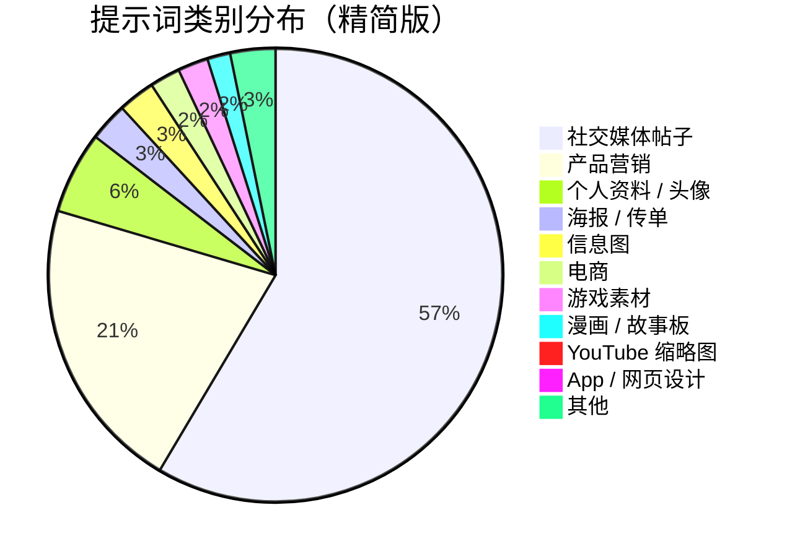
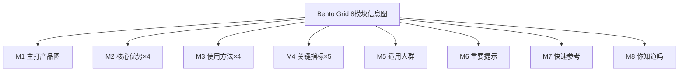
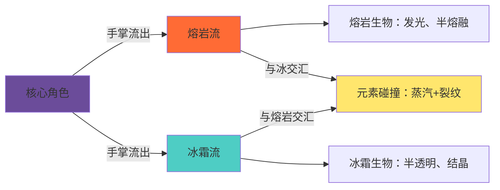
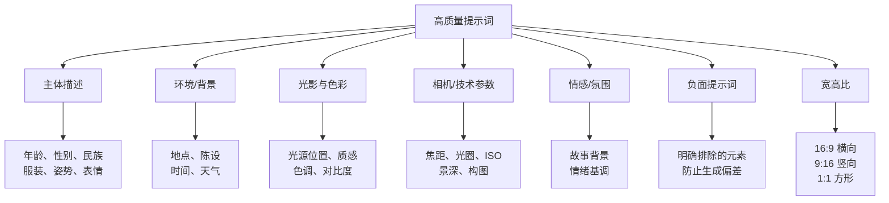

> **Nano Banana Pro**（即 Google Gemini 图像生成模型）正在被全球创作者用来生成各类高质量图像。[YouMind](https://youmind.com/zh-CN/nano-banana-pro-prompts) 维护了一个收录超过 12,000 条精选提示词的社区库，每日更新。本文从中筛选出各类别典型案例，并整理写作技巧，供参考使用。

---

## 提示词库概览

[YouMind Nano Banana Pro 提示词库](https://youmind.com/zh-CN/nano-banana-pro-prompts) 目前总计收录 **12,419 条**提示词，涵盖以下主要类别：



该库还配套了开源的 [AI Skill 工具](https://github.com/YouMind-OpenLab/nano-banana-pro-prompts-recommend-skill)，支持在 Cursor、Claude Code、OpenClaw 等 AI 编程工具中智能搜索提示词。

---

## 信息图与社交媒体类

### 宽幅名人金句引言卡

**作者**：@Nicolechan（Nov 2025）  
**适用场景**：社交媒体分享卡、激励语海报

```
一张宽幅的名人金句卡，棕色背景，衬线体浅金色"保持饥饿，保持愚蠢"，小字"——Steve Jobs"，
文字前面带一个大的淡淡的引号。人物头像在左边，文字在右边，文字占画面比例 2/3，人物占 1/3，
人物有一点渐变过渡的感觉。
```

**提示词要点**：
- 明确背景颜色（棕色）和字体风格（衬线体浅金色）
- 给出精确的构图比例（文字 2/3，人物 1/3）
- 用"渐变过渡"描述人物边缘处理方式

---

### 高级液态玻璃 Bento 网格产品信息图（8 模块）

**作者**：@Mansi Sanghani（Jan 2026）  
**适用场景**：产品展示、科普信息图、电商详情页

**核心结构**：



**提示词模板**（变量化设计）：

```
输入变量：[插入产品名称] 语言：[插入语言]

系统指令：
创建一个包含 8 个模块的优质液态玻璃 Bento 网格产品信息图。

1) 产品分析：
→ 识别产品的主导自然色 → "主色调"
→ 识别类别：食品 / 药品 / 科技

2) 调色板（源自主色调）：
→ 产品 + 强调色：完全饱和的主色调
→ 图标、边框：柔和的主色调（30-40% 饱和度，绝不使用黑色）

3) 视觉风格：
→ 卡片：Apple 液态玻璃（85-90% 透明），带有极细边框和微妙的阴影
→ 不对称 Bento 网格，16:9 横向
→ 主卡片：28-30% | 信息模块：70-72%

输出：1 张图片，16:9 横向，超优质液态玻璃信息图。
```

**技巧总结**：使用变量占位符 `[插入产品名称]` 让提示词可复用；按类别（食品/药品/科技）提供不同的数据格式规范。

---

### 黑板风格 AI 新闻摘要

**作者**：@ひでもん（Nov 2025）  
**适用场景**：知识科普图、学习笔记可视化

```
使用以下内容，以黑板风格、手写体的外观总结新闻，并像老师写的一样，
用图表和易于理解的表达方式进行分解。
—— [插入新闻内容]
```

---

## 肖像与人像类

### 详细镜子自拍场景（御宅族电脑角落）

**作者**：@宝玉（Oct 2025）  
**适用场景**：角色扮演、写实人物摄影

这是一个高度结构化的提示词示例，展示了如何用分层结构描述复杂场景：

```
### 场景
镜子自拍，御宅族电脑角落，蓝色调

### 主体
- 性别表现: 女性
- 年龄段: 25岁左右
- 种族: 东亚
- 身材: 苗条，腰线分明；身材比例自然
- 发型:
  - 长度: 及腰长发
  - 样式: 直发，发尾微卷
  - 颜色: 中等棕色

### 相机
- 模式: 智能手机后置摄像头通过镜子拍摄（无肖像/虚化模式）
- 等效焦距 (mm): 26
- 光圈 (f): 1.8
- 感光度 (ISO): 100

### 负面提示词
- 任何地方出现粉色/品红色
- 美颜滤镜/磨皮皮肤；没有毛孔的外观
- 夸张或扭曲的人体结构
- NSFW，透视面料，走光
```

**结构化提示词的优势**：通过 `###` 分节，明确区分主体、环境、灯光、相机参数和负面提示，避免歧义，大幅提升生成质量。

---

### 高定时尚大片（全黑男士）

**作者**：@Harboris（Apr 2026）  
**适用场景**：时尚摄影、品牌宣传图

```
一位身着利落全黑装束的时尚男士在纯黑背景前自信地摆出姿势。
他穿着定制的黑色西装，黑色衬衫领口微敞，颈间佩戴着一条精致的金色项链。
他戴着金色太阳镜，留着修剪整齐的胡须，散发出迷人而神秘的气质。
左手腕上的奢华腕表闪烁着微光，戏剧性的灯光突显出他的面部轮廓并投下柔和的阴影，
营造出大胆且极具高定时尚感的大片视觉效果。
```

---

### 海边男士黑白肖像

**作者**：@Harboris（Apr 2026）  
**适用场景**：艺术摄影、写真头像

```
在不改变面部特征的前提下进行肖像创作。
一张美观的男士黑白肖像。他坐在海边的木椅上，神情放松，注视着镜头。
他身穿一件解开扣子的白色宽松衬衫和蓝色阔腿牛仔裤，体格健壮。
画面呈现戏剧性的柔和光影、高对比度及胶片颗粒感。
背景为模糊的海浪与阴天。高度细节化，艺术摄影风格。
```

---

### 结构化街拍人像（JSON 格式）

**作者**：@Lore（Apr 2026）  
**适用场景**：生活方式摄影、网红风格图

```json
{
  "prompt": "一位时尚的年轻金发女性，留着波浪长发，站在欧洲城市街道上，背景是一辆黑色梅赛德斯 G-Wagon。",
  "style": "照片级真实感，奢华生活方式，网红审美",
  "camera": "iPhone 拍摄效果，50mm 镜头质感，浅景深",
  "lighting": "自然日光，柔和阴天，漫射光",
  "quality": "超写实，8k 分辨率，高细节",
  "composition": "主体居中，全身照，微侧姿势，街拍视角",
  "aspect_ratio": "9:16"
}
```

**JSON 格式提示词**：适合有明确参数需求的场景，每个字段独立控制一个维度，便于批量修改。

---

## 艺术风格与插画类

### 江户时代浮世绘风格现代场景

**作者**：@VoxcatAI（Dec 2025）  
**适用场景**：跨时代艺术创作、文化融合插画

```
一幅日本江户时代的浮世绘木版画。整体感觉是葛饰北斋和歌川广重等大师的超现实合作，
通过古老的视角重新构想现代科技。

场景：繁忙的涩谷十字路口

江户时代转换逻辑：
- 智能手机是发光的、精心绘制的纸质卷轴
- 地铁站和火车是巨大的铰接式木制蜈蚣车厢
- 摩天大楼被重新构想成无尽的高耸木制宝塔
- 机器人和机甲以巨大的木版傀儡形象出现

纹理要求：
- 清晰可见的木纹纹理和粗糙的纸纤维
- 印刷缺陷：颜料渗色明显，轻微颜色错位
- 色彩调色板：严格限于普鲁士蓝、朱红色和柔和的赭黄色

宽高比：3:4 竖向海报，包含竖排日文书法和传统红色艺术家印章
```

**技巧**：通过"转换逻辑"明确每个现代元素的古代对应物，保持世界观一致性。

---

### 深色单色插画（复古蚀刻风格）

**作者**：@Ai Prompts Lab（Apr 2026）  
**适用场景**：书籍插图、哥特风格艺术

```
以上传的照片作为参考，深色单色插画风格，精细的雕版线条艺术，复古蚀刻技术，
高对比度蓝灰色调，手绘墨水插画，超精细毛发纹理，复杂的线条阴影，排线和刮板画风格，
戏剧性的阴影光效，古籍插画质感，写实的解剖结构与风格化线条，中世纪雕版画美学，
粗犷的墨水笔触，高纹理表面，深邃阴影，细腻线条，古典版画风格，哥特式插画氛围，
暗黑奇幻写实主义，精细的皱纹和胡须纹理，锐利的轮廓，柔和的冷色调，
专业的木刻雕版风格，超精细，高分辨率，电影级光效，情绪化氛围。--ar 9:16
```

---

### 手绘风格标题图片

**作者**：@セミナー講師専門AIコンシェルジュ（Nov 2025）  
**适用场景**：博客封面、文章配图

```
完全重塑上传的人物。
将其作为一篇笔记文章的标题图片，该人物在文章中介绍"Nano Banana Pro"。
长宽比：横向 16:9。
风格和颜色：简洁、手绘风格、斜体，带有蓝绿色渐变。
标题文字："深入解读 Google 全新 AI 'Nano Banana Pro'"。
```

---

## 产品与商业类

### Knolling 风格平铺产品拆解图

**作者**：@Tischeins（Apr 2026）  
**适用场景**：产品展示、电商详情、设计素材

```
超写实 8K 俯视产品摄影，采用精确的 Knolling 构图，
从提供的参考图像中提取物体，并将其完全拆解为 8 到 12 个核心组件，
以 90 度垂直俯视视角呈现。

每个部件在极简哑光灰或原木色桌面上以精确间距进行规整的网格或平衡的放射状布局，
完美对齐，无重叠，无无关道具。

采用柔和的漫射多光源设置，带有轻微且受控的阴影，色彩中性真实，边缘极其锐利。
高度真实的材质渲染，包括拉丝金属、模塑塑料、橡胶握把、裸露的电路板、螺丝及小型五金件。

每个组件均由细白矩形框勾勒，并配有简洁的英文无衬线字体标签，
标签置于部件旁且不遮挡主体。注释清晰、易读、低调，无水印，无 Logo，画面整洁。
```

---

### 复古专利文件风格

**作者**：@Alexandra Aisling（Dec 2025）  
**适用场景**：历史美学设计、品牌故事图、艺术装饰

```
一份关于 [INVENTION] 的复古专利文件，其风格仿照 19 世纪末美国专利局的备案文件。
页面上印有精确的技术图纸，并带有编号标注（图 1、图 2、图 3），展示了正面、侧面和分解视图。
钢笔墨水手写批注描述了机械装置。
纸张呈陈旧的象牙色，带有锈斑和柔和的折痕。
角落处有一个官方浮雕印章和红色蜡封。
底部有发明者的手写签名和日期。
整个图像给人一种从档案中找回的权威、历史且略带神秘感的文件之感。
```

---

## 奇幻与电影类

### 电影级暗黑奇幻场景（元素碰撞）

**作者**：@Edizkan（Apr 2026）  
**适用场景**：游戏概念图、奇幻插画、角色扮演素材

这是一个极为详细的复杂场景提示词，关键要素：



**核心提示词片段**：

```
形象完整性（关键）：
- 保留上传角色的确切身份
- 保持精确的比例、眼型、间距、风格化特征
- 不要将其人类化，不要修改面部结构
- 身份必须保持一眼可辨

角色姿态与情感：
- 角色坐着，静止，内省，情感疲惫
- 头部微垂，双肩承载无形的重压
- 不是胜利的施法姿态，而是安静的哀愁

照明：
- 主光：头顶一盏微弱的冷色地下室灯
- 辅助光：熔岩本身的橙红色底光
- 冰霜贡献：微弱的蓝白色边缘高光

负面约束：
- 无英雄战斗姿态，无欢快的奇幻照明
- 无对称的中心构图，无通用的火球或魔法光环
- 宽高比：ar 16:9
```

---

## 特别专题类

### 节日四格拼图（2026 元旦）

**作者**：@松果先森（Dec 2025）  
**适用场景**：节日祝福图、多格创意合成

```
[关键:保持精确的面部特征,保留原始脸部结构,图中角色与上传参考图完全一致]

高级摄影棚 2x2 宫格写真：

左上格（海军蓝背景）：人物穿海军蓝色制服风连衣裙，双手托举拼图块"20"，
  背景有海军条纹、"启航新年"字样

右上格（樱花粉背景）：同一女性穿粉色蕾丝连衣裙，双手托举拼图块"26"，
  背景有粉色樱花、"美好相遇"字样

左下格（薄荷绿背景）：同一女性穿薄荷绿棉麻连衣裙，双手托举拼图块"元旦"，
  背景有绿色植物、"希望生长"字样

右下格（柠檬黄背景）：同一女性穿黄色向日葵连衣裙，双手托举拼图块"快乐"，
  完成后画面中心爆出金色光芒

拍摄参数：清透妆容，明亮环形光，85mm镜头，f/1.8光圈，时尚杂志风格
```

---

## 教育与地图类

### 水彩风格德国地图

**作者**：@Florian Gallwitz（Nov 2025）  
**适用场景**：教育插图、信息图、地理可视化

```
生成一张水彩风格的德国地图，并在地图上用圆珠笔标出所有联邦州。
```

这是一个极简提示词的典型案例——有时候简洁清晰比过度描述更有效。

---

## 提示词写作技巧总结

### 结构化框架



### 按复杂度选择策略

| 场景类型 | 建议策略 | 示例 |
|---------|---------|------|
| 简单场景 | 一句话描述 | "水彩风格的德国地图" |
| 人像摄影 | 分节结构（主体/环境/相机/负面提示） | 御宅族镜子自拍 |
| 复杂奇幻 | 多维度详细描述 + 负面约束 | 元素碰撞暗黑奇幻 |
| 可复用模板 | 变量化设计 `[插入XXX]` | Bento 产品信息图 |
| 精确参数控制 | JSON 格式 | G-Wagon 街拍 |

### 关键写作原则

1. **颜色要具体**：不要说"暖色调"，要说"橙红色底光"、"浅金色衬线字体"
2. **构图要量化**：用"文字占 2/3，人物占 1/3"替代"文字在右边"
3. **相机要参数化**：明确焦距（50mm）、光圈（f/1.8）、ISO（100）
4. **负面提示要明确**：列出你不想要的元素，如"无英雄战斗姿态"、"无美颜滤镜"
5. **情感要具象化**：不说"表情悲伤"，而说"头部微垂，双肩承载着无形的重压"
6. **风格参照要具体**：引用"葛饰北斋和歌川广重"比说"浮世绘风格"更有效

---

## 资源与工具

### 在哪里使用这些提示词

1. **[YouMind](https://youmind.com/zh-CN/nano-banana-pro-prompts)**：直接选择 Nano Banana Pro 模型，复制提示词即可生成
2. **Google AI Studio / Gemini API**：使用 `gemini-2.0-flash-preview-image-generation` 模型
3. **AI Skill 工具**：安装 [nano-banana-pro-prompts-recommend-skill](https://github.com/YouMind-OpenLab/nano-banana-pro-prompts-recommend-skill)，在 AI 助手中智能搜索提示词

### AI Skill 安装方式

```bash
# Claude Code
npx skills i YouMind-OpenLab/nano-banana-pro-prompts-recommend-skill

# Cursor / 其他 AI 助手（通用安装器）
npx skills i YouMind-OpenLab/nano-banana-pro-prompts-recommend-skill
```

安装后，你可以直接在对话中描述需求：

```
"帮我找一个赛博朋克风格的头像提示词"
"我需要 YouTube 科技评测视频的缩略图提示词"
"给这篇文章生成一个封面图的提示词：[粘贴文章内容]"
```

### 本站相关文章

- [Nano Banana Pro 完整指南：专业资产制作的 10 大技巧](/2025-11-10-nano-banana-pro-complete-reference)
- [Nano Banana 入门指南](/2025-08-17-nano-banana-guide)

---

## 参考来源

- YouMind 提示词库：[https://youmind.com/zh-CN/nano-banana-pro-prompts](https://youmind.com/zh-CN/nano-banana-pro-prompts)
- GitHub 开源 AI Skill：[https://github.com/YouMind-OpenLab/nano-banana-pro-prompts-recommend-skill](https://github.com/YouMind-OpenLab/nano-banana-pro-prompts-recommend-skill)
- 提示词作者：@Nicolechan、@Mansi Sanghani、@宝玉、@VoxcatAI、@Alexandra Aisling、@松果先森、@Tischeins、@Lore、@Harboris、@Ai Prompts Lab、@Shah、@Edizkan、@Filschics、@Florian Gallwitz、@KAWAI 等社区创作者
