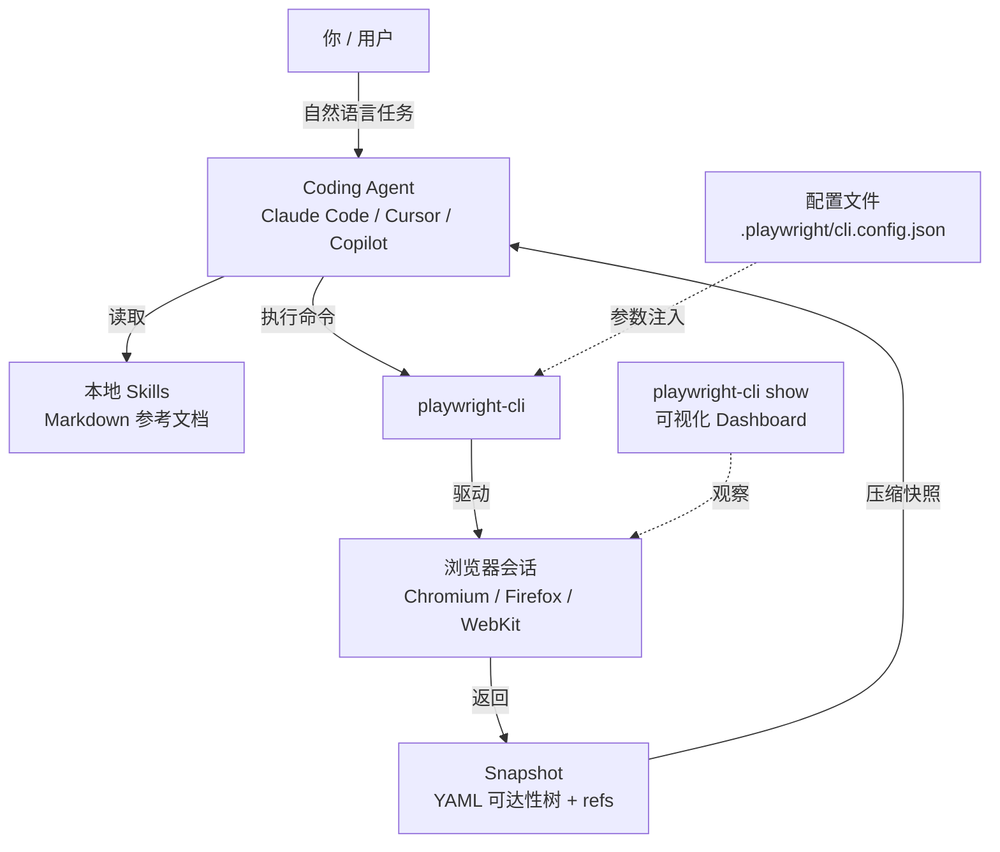
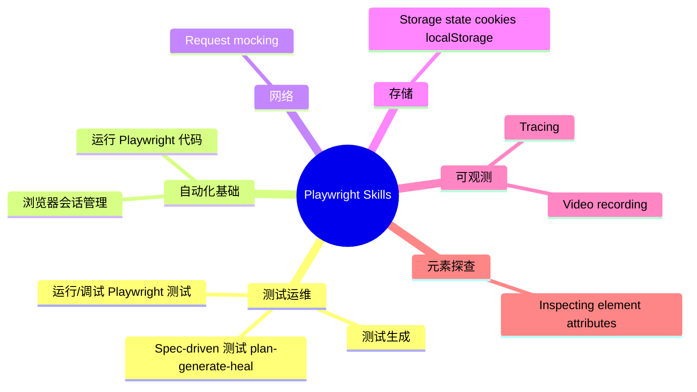
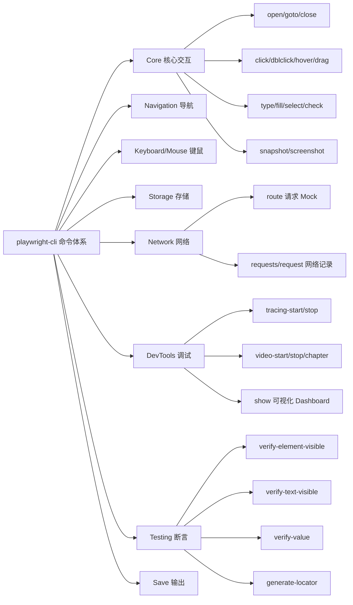
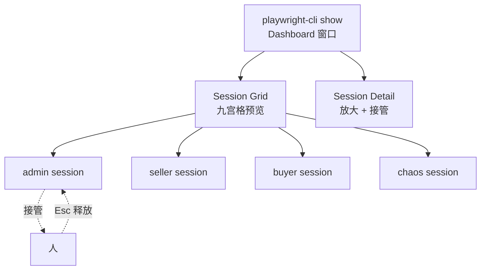
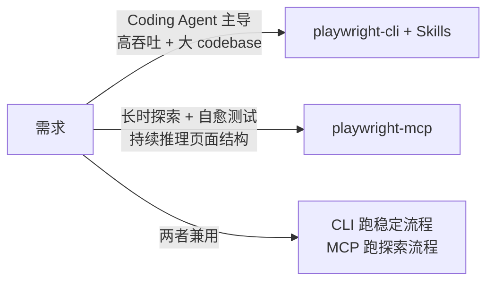

> 本文系统整理自 Playwright 官方文档 [Agent CLI / Skills](https://playwright.dev/agent-cli/skills) 与 GitHub 仓库 [microsoft/playwright-cli](https://github.com/microsoft/playwright-cli)，并结合 YouTube 上 Playwright 团队的 [Skills 演示视频](https://www.youtube.com/watch?v=nlK7-zuYDcs) 进行实战拆解。所有命令均基于 `@playwright/cli@latest`（v0.1.11+）验证。

---

## 一、为什么 2026 年的浏览器自动化必须"为 AI Agent 而生"

过去几年我们用 Playwright 写 UI 测试，主要的痛点是：

- 手写 selector，DOM 一改就全挂；
- 录制工具产出的代码冗长、不可读；
- 接入 LLM 时，把整个 DOM 塞进 prompt，单次调用就能烧掉几千 token。

2026 年 5 月，Playwright 团队把答案直接塞进了官方仓库：**`playwright-cli` + Skills 机制**——一套专门服务 AI 编码 Agent（Claude Code、Cursor、GitHub Copilot 等）的浏览器自动化"瑞士军刀"。

它的核心设计哲学只有一条：

> **不要把页面塞进模型上下文，让模型通过简洁、可组合的 CLI 命令去操作浏览器。**

| 维度 | 传统 Playwright 脚本 | Playwright MCP | **Playwright CLI + Skills** |
|------|---------------------|----------------|------------------------------|
| 调用方式 | 写 `.ts` / `.py` 脚本 | 暴露 MCP Tools | 直接命令行 |
| Token 占用 | 与代码量正相关 | 高（工具 schema + 大块快照） | **极低**（仅 ref 短串） |
| 状态保持 | 进程内 | 持久会话 | **后台命名 Session** |
| 与 Agent 集成 | 需自己写 Wrapper | 需 MCP 客户端 | 任何能执行 shell 的 Agent |
| 适用场景 | 固化测试 | 长时探索性流程 | **高吞吐编码 + 自动化混合** |

官方原话说得很直接：

> "CLI invocations are more token-efficient: they avoid loading large tool schemas and verbose accessibility trees into the model context."

简而言之：**编码 Agent 应该用 CLI + Skills，长时探索性 Agent 才用 MCP。**

---

## 二、整体架构：CLI、Skills、Agent 三者如何协作



三个关键角色：

1. **playwright-cli**：基于 Playwright 的命令行工具，封装了导航、点击、填写、截图、Mock、Tracing 等 80+ 命令。
2. **Skills**：一组本地 Markdown 文件，告诉 Agent "在什么场景下用哪些命令、按什么顺序"。
3. **Snapshot + Ref 机制**：每次命令执行后输出一棵带 `e15`、`e21` 之类短引用的可达性树，Agent 只需要把这些短 ref 喂回来，无需理解完整 DOM。

---

## 三、入门配置：从零启动你的第一个会话

### 3.1 环境要求

| 依赖 | 最低版本 | 说明 |
|------|---------|------|
| Node.js | 20+ | LTS 即可 |
| Coding Agent | Claude Code / Cursor / Copilot / 任何能跑 shell 的 Agent | 用于读取 Skills |
| 系统 | macOS / Linux / Windows | 全平台支持 |

### 3.2 安装 CLI

**方式一：全局安装（推荐）**

```bash
npm install -g @playwright/cli@latest
playwright-cli --help
```

**方式二：免安装（npx）**

```bash
npx playwright-cli --help
```

> 项目里如果已经把 `@playwright/cli` 加进 devDependencies，可以用 `npx --no-install playwright-cli` 强制使用本地版本，避免污染全局。

### 3.3 安装浏览器

CLI 首次运行会自动下载，但建议手动预装以避免 CI 中阻塞：

```bash
playwright-cli install-browser               # 默认 chromium
playwright-cli install-browser firefox       # 指定浏览器
playwright-cli install-browser --with-deps   # Linux 下连同系统依赖一起装
playwright-cli install-browser --list        # 查看可用浏览器
playwright-cli install-browser --dry-run     # 预演不执行
```

### 3.4 安装 Skills（关键步骤）

```bash
playwright-cli install --skills
```

执行后会在本地生成一组 Markdown 文档，**Claude Code、Cursor、GitHub Copilot 等支持本地 Skills 的 Agent 会自动发现并加载**，从此它们写出来的命令会更稳、更省 token。

官方目前提供的 Skills 涵盖以下 10 大主题：



### 3.5 验证安装

```bash
playwright-cli open https://demo.playwright.dev/todomvc/ --headed
playwright-cli snapshot
```

如果终端打印出了一棵以 `- generic [ref=e1]:` 开头的 YAML 可达性树，恭喜你，环境已就绪。

---

## 四、核心概念：Snapshot、Ref 与 Session

要让 AI Agent 高效工作，必须先理解 CLI 反馈给它的 3 样东西。

### 4.1 Snapshot：替代 DOM 的可达性快照

每个命令执行完，CLI 都会输出类似这样的内容：

```text
### Page
- Page URL: https://demo.playwright.dev/todomvc/#/
- Page Title: React - TodoMVC
### Snapshot
[Snapshot](.playwright-cli/page-2026-05-17T11-22-42-679Z.yml)
```

打开 YAML 文件可以看到：

```yaml
- main [ref=e3]:
    - heading "todos" [ref=e5]
    - textbox "What needs to be done?" [ref=e8]
    - list [ref=e12]:
        - listitem [ref=e15]:
            - checkbox [ref=e18]
            - text: "Buy groceries"
```

**关键点**：

- 这是 ARIA Accessibility Tree，不是 DOM；
- 每个可交互元素分配一个稳定的短 ref（`e3`、`e18` 等），Agent 用它来定位；
- 默认 ref + 偶尔降级到 CSS / `getByRole` / `getByTestId` 即可。

### 4.2 控制快照体积，省 Token 的 4 个开关

```bash
playwright-cli snapshot --depth=4           # 限制层级深度
playwright-cli snapshot "#main"             # 只快照某个 CSS 子树
playwright-cli snapshot e34                 # 只快照某个 ref 节点
playwright-cli snapshot --filename=after-login.yaml --boxes
```

`--boxes` 会附带每个节点的 `[box=x,y,w,h]`，做视觉自动化时很有用。

### 4.3 Session：让多个 Agent 各开各的浏览器

Playwright CLI 内部用 **命名 Session** 管理多个浏览器实例：

```bash
playwright-cli open https://playwright.dev                          # 默认 session
playwright-cli -s=todo open https://demo.playwright.dev/todomvc/    # todo session
playwright-cli -s=admin open https://admin.example.com --persistent # admin，持久化用户目录
playwright-cli list                                                  # 列出所有 session
```

把 session 名通过环境变量传给 Agent，它就会乖乖只动这一个浏览器：

```bash
PLAYWRIGHT_CLI_SESSION=todo-app cursor .
PLAYWRIGHT_CLI_SESSION=admin-panel claude .
```

> **小窍门**：Session 名 = 浏览器隔离单元。本地开发时，给每条业务线（user / admin / payment）各开一个 session，多个 Agent 并行跑互不干扰。

---

## 五、命令地图：80+ 命令按职能分类

官方按"Capability 能力组"组织命令，这里整理成开发者更熟悉的视角：



**记忆口诀**：

- "找元素"用 `snapshot` → 拿 ref；
- "动元素"用 `click / fill / check / drag`；
- "看数据"用 `console / requests / requests <i>`；
- "做断言"用 `verify-*`；
- "出测试代码"用 `generate-locator`；
- "看场景"用 `show / video-start / tracing-start`。

完整命令参考可以直接 `playwright-cli --help`，或翻阅本文末尾的"附录：命令速查表"。

---

## 六、实战案例一：5 分钟完成 TodoMVC 端到端测试

我们先从官方 demo 开始，**全程让 Cursor / Claude Code 自动驱动**。

### 6.1 准备工作

```bash
cd ~/playground
mkdir todo-test && cd todo-test
playwright-cli install --skills      # 让本目录的 Agent 也能识别 Skills
```

### 6.2 一句话指令（让 Agent 自己干活）

打开 Cursor / Claude Code，输入：

```text
使用 playwright skills 测试 https://demo.playwright.dev/todomvc/。
覆盖：添加 3 条 TODO、标记其中 1 条完成、清空已完成项。
全程在 .playwright-cli/screenshots 目录截图，最后生成一份 markdown 测试报告。
```

Agent 内部会自动展开成下面这套命令（你可以在终端看到它一条条执行）：

```bash
playwright-cli -s=todo open https://demo.playwright.dev/todomvc/ --headed
playwright-cli -s=todo type "Buy groceries"
playwright-cli -s=todo press Enter
playwright-cli -s=todo type "Water flowers"
playwright-cli -s=todo press Enter
playwright-cli -s=todo type "Write blog"
playwright-cli -s=todo press Enter
playwright-cli -s=todo snapshot                 # 拿到三条 todo 的 ref
playwright-cli -s=todo check e21                # 勾选 "Buy groceries"
playwright-cli -s=todo screenshot --filename=.playwright-cli/screenshots/01-checked.png
playwright-cli -s=todo click "getByRole('button', { name: 'Clear completed' })"
playwright-cli -s=todo verify-text-visible "2 items left"
playwright-cli -s=todo screenshot --filename=.playwright-cli/screenshots/02-cleared.png
```

### 6.3 验证：手动 + 自动断言

```bash
playwright-cli -s=todo verify-element-visible textbox "What needs to be done?"
playwright-cli -s=todo verify-list-visible 2     # 列表中应剩 2 项
playwright-cli -s=todo verify-text-visible "Water flowers"
```

`verify-*` 命令返回非 0 退出码时，Agent 会自动重试或修正——这正是 Skills 文档里 "self-healing" 模式的关键。

### 6.4 一键导出可重放的 Playwright 测试

```bash
playwright-cli -s=todo generate-locator e21 > tests/todo.spec.ts
```

然后告诉 Agent：

```text
基于刚才在 todo session 中的所有操作，生成一个完整的 Playwright Test 文件，
保存到 tests/todomvc.spec.ts，使用 expect-style 断言。
```

Agent 会读取 `.playwright-cli/` 目录下的 snapshot 记录与 generate-locator 输出，拼出可直接 `npx playwright test` 运行的脚本。

---

## 七、实战案例二：登录态持久化与复用

绝大多数业务场景都得先登录才能干活。Playwright CLI 提供了**两套**登录持久化方案，差别明显：

| 方案 | 命令 | 适用场景 |
|------|------|---------|
| Storage State（推荐） | `state-save` / `state-load` | 跨机器、跨 session、可入库 |
| Persistent Profile | `open --persistent` | 单机重启，类似常驻 Chrome |

### 7.1 第一次：人工登录 + 保存状态

```bash
playwright-cli -s=admin open https://admin.example.com --headed
# 此时手动在浏览器里登录（输账号密码 / 扫码 / SSO）
playwright-cli -s=admin state-save .secrets/admin-state.json
```

`state-save` 会把所有 cookie、localStorage、sessionStorage 全部导出，单文件即可分享给 CI 或别的 Agent。

> **安全**：把 `.secrets/` 加进 `.gitignore`，永远不要 commit 状态文件。

### 7.2 之后：任何环境秒级恢复

```bash
playwright-cli -s=admin open https://admin.example.com
playwright-cli -s=admin state-load .secrets/admin-state.json
playwright-cli -s=admin reload                    # 状态生效
playwright-cli -s=admin snapshot                  # 直接进后台
```

### 7.3 细粒度操作

如果只想改一两个值，不用整存整取：

```bash
playwright-cli cookie-set token "ey..." --domain=.example.com --httpOnly
playwright-cli localstorage-set theme dark
playwright-cli sessionstorage-set "tour-seen" "1"

playwright-cli cookie-list --domain=.example.com
playwright-cli localstorage-list
```

### 7.4 让 Agent 自动管理多角色登录

在仓库根目录建 `playwright-roles.md`：

```markdown
# 角色与登录态映射
| Session 名 | 角色 | 状态文件 |
| --- | --- | --- |
| admin   | 平台管理员 | .secrets/admin-state.json |
| seller  | 商家 | .secrets/seller-state.json |
| buyer   | 普通买家 | .secrets/buyer-state.json |

约定：执行任何业务操作前，先 `state-load` 对应文件，禁止重新输入密码。
```

Cursor / Claude Code 读到这份文档后，每次开新 session 都会自动调用对应的 `state-load`，避免重复登录浪费时间。

---

## 八、实战案例三：网络请求 Mock 与录制

`playwright-cli route` 是测试边缘场景（断网、慢速、错误响应、A/B）必备工具。

### 8.1 三种 Mock 模式

```bash
# 1. 返回固定 JSON
playwright-cli route "**/api/products" --status=200 \
  --body='{"items":[{"id":1,"name":"Mock 商品"}]}'

# 2. 注入延迟模拟慢网
playwright-cli route "**/api/**" --delay=3000

# 3. 直接拒绝（模拟接口宕机）
playwright-cli route "**/api/payment" --status=500 \
  --body='{"error":"service unavailable"}'

playwright-cli route-list
playwright-cli unroute "**/api/payment"
```

### 8.2 实际抓包：找出"页面卡住"的元凶

让 Agent 干这件事最爽：

```text
打开 https://my-app.example.com 的结算页，下完单后页面一直转圈。
帮我用 playwright-cli 把卡住期间所有失败的网络请求列出来，给出可能的根因。
```

Agent 会按顺序执行：

```bash
playwright-cli open https://my-app.example.com/checkout --headed
# (跟随 Agent 完成下单)
playwright-cli requests             # 列出全部请求
playwright-cli request 17           # 查看具体某条
playwright-cli console error        # 抓 error 级以上的控制台
```

`requests` 输出包含状态码、耗时、响应大小、failure reason，对排查"加载慢/请求挂死"特别高效。

### 8.3 配合 Mock 写"故障注入测试"

```bash
playwright-cli -s=chaos route "**/api/order" --status=503
playwright-cli -s=chaos goto https://shop.example.com/cart
playwright-cli -s=chaos click "getByRole('button', { name: '提交订单' })"
playwright-cli -s=chaos verify-text-visible "请稍后重试"
playwright-cli -s=chaos screenshot --filename=screenshots/chaos-503.png
```

这一套组合拳过去要写 50 行 Playwright Test，现在 5 行命令搞定，AI Agent 可以批量生成。

---

## 九、实战案例四：可视化 Dashboard 与多 Agent 编排

当多个 Coding Agent 同时在跑浏览器时，你需要一个"上帝视角"。

### 9.1 启动 Dashboard

```bash
playwright-cli show
```

会打开一个独立窗口（不是网页），分两个视图：

- **Session Grid**：所有正在运行的 session 实时缩略图 + URL + Title；
- **Session Detail**：点开任一 session 后看到全屏 live view，可以**直接接管鼠键**（按 Esc 释放回 Agent）。



### 9.2 多 Agent 并行实战

场景：让 3 个 Agent 同时跑同一个商城的不同角色操作。

**步骤 1**：分配 session

```bash
playwright-cli -s=admin   open https://shop.example.com/admin
playwright-cli -s=seller  open https://shop.example.com/seller
playwright-cli -s=buyer   open https://shop.example.com
```

**步骤 2**：3 个终端分别启动 Agent

```bash
# 终端 1
PLAYWRIGHT_CLI_SESSION=admin cursor . --workspace=admin-tasks

# 终端 2
PLAYWRIGHT_CLI_SESSION=seller cursor . --workspace=seller-tasks

# 终端 3
PLAYWRIGHT_CLI_SESSION=buyer cursor . --workspace=buyer-tasks
```

**步骤 3**：在第 4 个终端起 Dashboard 观察

```bash
playwright-cli show
```

九宫格里能同时看到三个 session 的实时操作，任何一个跑飞了，立刻点进去接管修正。

### 9.3 资源清理

```bash
playwright-cli close-all     # 优雅关闭所有 session
playwright-cli kill-all      # 强制 kill（卡死时用）
playwright-cli delete-data   # 删除默认 session 的用户数据
playwright-cli -s=buyer delete-data
```

---

## 十、实战案例五：录制 Trace 与视频，做"事后复盘"

AI Agent 偶尔会执行不可解释的操作，必须留底。

### 10.1 录制 Playwright Trace（推荐）

```bash
playwright-cli -s=ci tracing-start
# ...执行一连串操作...
playwright-cli -s=ci tracing-stop      # 输出到 .playwright-cli/trace-xxx.zip
```

打开 trace：

```bash
npx playwright show-trace .playwright-cli/trace-2026-05-17.zip
```

Trace 包含 DOM 快照、网络瀑布、Console 日志、源码定位——比看视频还高效。

### 10.2 录制视频（适合给非工程师看）

```bash
playwright-cli video-start demo.webm
playwright-cli video-chapter "登录"
# 登录操作
playwright-cli video-chapter "下单"
# 下单操作
playwright-cli video-stop
```

`video-chapter` 会在视频里打书签，方便老板/产品快速跳到关键节点。

### 10.3 一条龙：Agent 自查的"黑盒"流程

```text
请帮我用 playwright-cli 跑一遍商品搜索→加购→结算的完整流程，
全程录视频并打章节标记，任何 verify-* 断言失败时立刻 dump 一份 trace。
最终输出一份 markdown 总结，包含每一步耗时、截图、失败原因。
```

Agent 内部组合：

```bash
playwright-cli -s=qa tracing-start
playwright-cli -s=qa video-start qa-run.webm

playwright-cli -s=qa video-chapter "搜索"
playwright-cli -s=qa goto https://shop.example.com
playwright-cli -s=qa fill "getByPlaceholder('搜索商品')" "iPhone"
playwright-cli -s=qa press Enter
playwright-cli -s=qa verify-list-visible 1

playwright-cli -s=qa video-chapter "加购"
playwright-cli -s=qa click e34
playwright-cli -s=qa click "getByRole('button', { name: '加入购物车' })"
playwright-cli -s=qa verify-text-visible "已添加到购物车"

playwright-cli -s=qa video-chapter "结算"
# ...

playwright-cli -s=qa video-stop
playwright-cli -s=qa tracing-stop
```

跑完直接生成 `qa-run.webm` + `trace.zip`，复盘和提 bug 都齐了。

---

## 十一、进阶：配置文件 `.playwright/cli.config.json`

每次都敲一堆 `--headed --browser=...` 太啰嗦。建一个 `.playwright/cli.config.json` 把环境配置入仓：

```json
{
  "browser": {
    "browserName": "chromium",
    "isolated": false,
    "launchOptions": {
      "channel": "chrome",
      "headless": false,
      "args": ["--lang=zh-CN"]
    },
    "contextOptions": {
      "viewport": { "width": 1440, "height": 900 },
      "locale": "zh-CN",
      "timezoneId": "Asia/Shanghai"
    }
  },
  "outputDir": ".playwright-cli",
  "outputMode": "file",
  "console": { "level": "warning" },
  "network": {
    "blockedOrigins": ["https://*.googletagmanager.com"]
  },
  "testIdAttribute": "data-qa",
  "timeouts": {
    "action": 8000,
    "navigation": 60000
  },
  "saveVideo": { "width": 1280, "height": 720 },
  "codegen": "typescript"
}
```

放在仓库根目录，CLI 会自动加载——所有 Agent 跑出来的浏览器行为都对齐。

### 11.1 用环境变量覆盖

CLI 提供了一整套 `PLAYWRIGHT_MCP_*` 环境变量，用来在 CI 里临时覆盖：

```bash
PLAYWRIGHT_MCP_HEADLESS=true \
PLAYWRIGHT_MCP_BROWSER=chromium \
PLAYWRIGHT_MCP_VIEWPORT_SIZE=1920x1080 \
playwright-cli goto https://example.com
```

完整变量参考 `playwright-cli --help` 或仓库 README。

### 11.2 安全沙箱：限制网络与文件访问

```json
{
  "network": {
    "allowedOrigins": ["https://*.mycompany.com", "https://api.stripe.com"],
    "blockedOrigins": ["https://*.facebook.com", "https://*.doubleclick.net"]
  },
  "allowUnrestrictedFileAccess": false
}
```

让 Agent 操作浏览器时只能访问业务域名，禁止下载到工作目录外的文件——AI 自主操作时的最低安全线。

---

## 十二、CI 集成：把 AI 自动化测试塞进 GitHub Actions

`.github/workflows/playwright-ai.yml`：

```yaml
name: AI Browser QA

on:
  pull_request:
  schedule:
    - cron: "0 2 * * *"

jobs:
  ai-qa:
    runs-on: ubuntu-latest
    steps:
      - uses: actions/checkout@v4
      - uses: actions/setup-node@v4
        with:
          node-version: "20"

      - name: 安装 Playwright CLI
        run: npm install -g @playwright/cli@latest

      - name: 安装浏览器
        run: playwright-cli install-browser --with-deps

      - name: 加载登录状态
        run: |
          mkdir -p .secrets
          echo "${{ secrets.ADMIN_STATE_JSON }}" > .secrets/admin-state.json

      - name: 让 Agent 跑 P0 用例
        env:
          ANTHROPIC_API_KEY: ${{ secrets.ANTHROPIC_API_KEY }}
        run: |
          npx @anthropic-ai/claude-code \
            --prompt "$(cat tasks/p0-smoke-test.md)" \
            --max-turns 30 \
            --output-format stream-json

      - uses: actions/upload-artifact@v4
        with:
          name: playwright-cli-artifacts
          path: .playwright-cli/
```

`tasks/p0-smoke-test.md` 里写自然语言任务描述（"覆盖登录、下单、退款三条主路径，失败时 dump trace"），Agent 会自动调用 playwright-cli 完成。

---

## 十三、与 Playwright MCP 的取舍

很多人会问："我已经在用 [Playwright MCP](https://github.com/microsoft/playwright-mcp) 了，要不要切？"



**官方建议**：

- 写代码的同时穿插浏览器自动化（Cursor、Claude Code 主场景）→ **CLI**；
- 让 Agent 长时间盯着一个浏览器自我探索（QA 自动化平台）→ **MCP**；
- 二者底层共用同一套 Playwright，迁移成本极低。

---

## 十四、最佳实践清单

把下面这套规范沉淀到团队 `AGENTS.md` 或 `.cursor/rules/playwright.md`，避免 Agent 反复犯错：

### 14.1 操作规范

1. **每次开新会话先 `snapshot`，再交互**——别凭记忆点 ref；
2. **优先 `getByRole` / `getByTestId`**，再 CSS，最后 ref；
3. **多角色场景用命名 session**，禁止默认 session 跑业务流程；
4. **大快照用 `--depth` / `--filename` 拆分**，避免上下文爆炸；
5. **失败立刻 `tracing-stop` + `screenshot`**，再决定下一步。

### 14.2 安全规范

1. `.secrets/` 永远在 `.gitignore` 里；
2. CI 中状态文件用 Secrets 注入，绝不持久化；
3. 生产域名通过 `allowedOrigins` 显式白名单；
4. `allowUnrestrictedFileAccess: false` 是默认值，不要改。

### 14.3 性能规范

1. 测试型任务走 `headless`（默认就是）；
2. 调试型任务走 `--headed --persistent`；
3. 并行 Agent 数 ≤ CPU 核数 × 0.75；
4. 跑完后 `close-all` 或 CI 里加上 `playwright-cli kill-all` 兜底。

---

## 十五、附录：高频命令速查表

```bash
playwright-cli open <url> [--headed] [--persistent] [--browser=chrome]
playwright-cli goto <url>
playwright-cli snapshot [ref] [--depth=N] [--filename=...] [--boxes]
playwright-cli click <ref|locator>
playwright-cli fill <ref> <text> [--submit]
playwright-cli type <text>
playwright-cli press <key>
playwright-cli check|uncheck <ref>
playwright-cli drag <startRef> <endRef>
playwright-cli upload <file>
playwright-cli screenshot [--filename=...]
playwright-cli pdf [--filename=...]

playwright-cli route <pattern> [--status=...] [--body=...] [--delay=ms]
playwright-cli unroute [pattern]
playwright-cli requests
playwright-cli request <index>
playwright-cli console [error|warning|info|debug]

playwright-cli state-save [file]
playwright-cli state-load <file>
playwright-cli cookie-list|get|set|delete|clear
playwright-cli localstorage-list|get|set|delete|clear

playwright-cli tracing-start|stop
playwright-cli video-start [file]
playwright-cli video-chapter <title>
playwright-cli video-stop
playwright-cli show [--annotate]
playwright-cli generate-locator <ref>

playwright-cli -s=<name> <command>
playwright-cli list
playwright-cli close|close-all|kill-all|delete-data
```

---

## 十六、结语：让 AI 真正"动手开浏览器"的临界点

2026 年是浏览器自动化的拐点年——MCP 让 Agent 看见页面，Skills + CLI 让 Agent **高效、可审计、可复用**地操作页面。

如果你正在做：

- 内部业务系统的回归测试自动化；
- 数据采集 / 智能填表 / RPA 替代；
- AI 客服 + 浏览器代操作；
- 编码 Agent 写 E2E 测试；

那么把 `playwright-cli install --skills` 加进你的项目初始化脚本，几乎是 2026 年最高 ROI 的一行命令。

**今天就动手**：

```bash
npm install -g @playwright/cli@latest
playwright-cli install-browser
playwright-cli install --skills
playwright-cli open https://demo.playwright.dev/todomvc/ --headed
```

剩下的，交给你的 Coding Agent。

---

## 参考资料

- [Playwright Agent CLI 官方文档 - Skills](https://playwright.dev/agent-cli/skills)
- [Playwright Agent CLI - Installation](https://playwright.dev/agent-cli/installation)
- [Playwright Agent CLI - Quick Start](https://playwright.dev/agent-cli/quick-start)
- [Playwright Agent CLI - Capabilities](https://playwright.dev/agent-cli/capabilities)
- [microsoft/playwright-cli GitHub 仓库](https://github.com/microsoft/playwright-cli)
- [Playwright Skills 视频演示](https://www.youtube.com/watch?v=nlK7-zuYDcs)
- [Playwright MCP（对比阅读）](https://github.com/microsoft/playwright-mcp)
