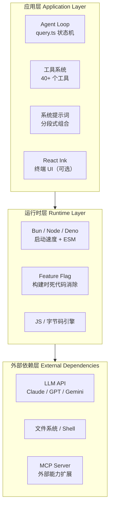
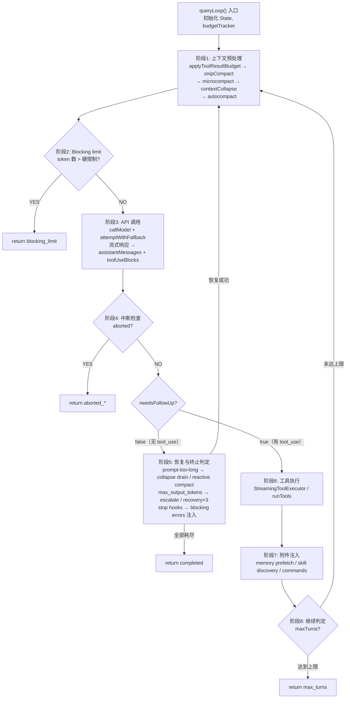
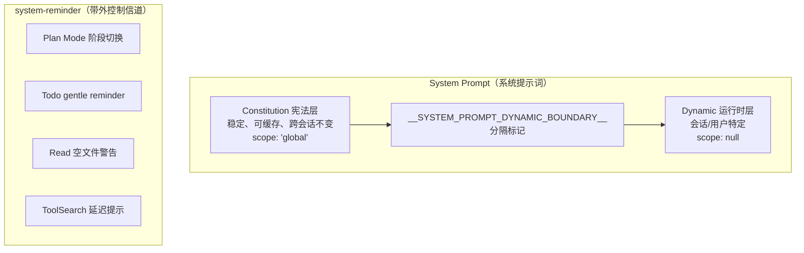
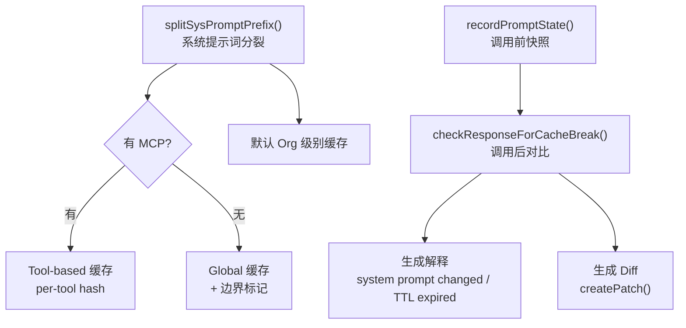
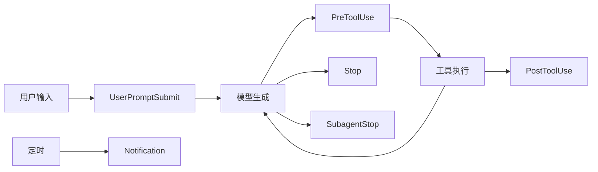
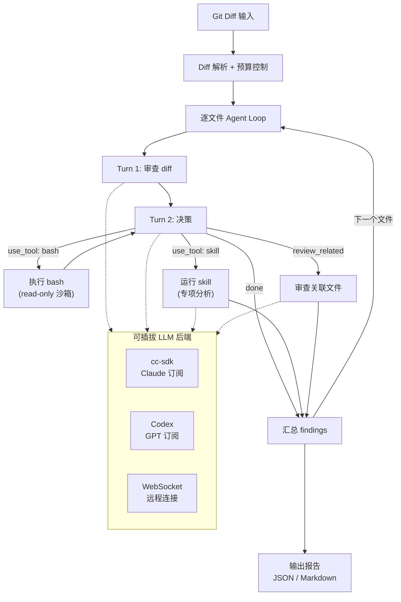
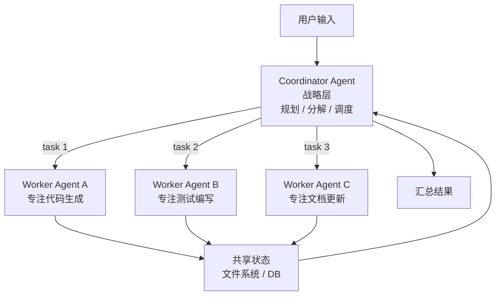
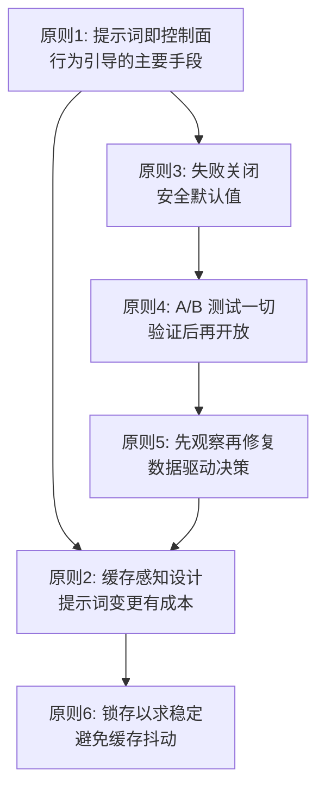

> 本文系统整理自 [ZhangHanDong / harness-engineering-from-cc-to-ai-coding](https://github.com/ZhangHanDong/harness-engineering-from-cc-to-ai-coding)（《驾驭工程 — 从 Claude Code 源码到 AI 编码最佳实践》，中文别名《马书》）。原书基于 Claude Code `v2.1.88` 公开发布包与 source map 还原结果，共 30 章、7 篇，覆盖从架构选型到生产实践的完整链路。本文按"入门 → 进阶 → 实战"的顺序，把全书精华浓缩为一份适合 Agent 开发者的速查手册。如果你想看完整源码级分析，强烈建议阅读 [在线版原书](https://zhanghandong.github.io/harness-engineering-from-cc-to-ai-coding/)。

---

## 一、为什么 2026 年每个开发者都该读懂 Agent 内部机制

过去两年，"AI Coding Agent"已经从玩具变成基础设施：Cursor、Claude Code、Codex、Cline、Aider……几乎每一家都在卷"自主编码能力"。但当你试图自己造一个，或者在现有产品基础上做深度集成时，会立刻撞上一堵墙：

- 模型调用 ≠ Agent。一个 `while` 循环加几次 `tool_use` 远远不够。
- 上下文窗口看起来很大（200K），实际跑两轮就吃干净。
- 提示词缓存是省钱命脉，但任何一个微小改动都能让 50K token 的前缀失效。
- 安全和权限不做"失败关闭"，一次错误的 `rm -rf` 就能让用户卸载你的产品。

《马书》之所以叫"驾驭工程（Harness Engineering）"，正是因为它告诉你：**不要继续优化模型本身，而是优化模型运行的"环境"**——约束、反馈回路、缓存、上下文、权限的整套基础设施。这一点和我之前写的 [Harness Engineering 入门](/2026-03-28-harness-engineering-guide) 是一脉相承的，但这次我们要进入"源码级落地"。

| 范式 | 关注点 | 代表产物 |
|------|--------|----------|
| Prompt Engineering（2023~2024） | 怎么把话说清楚 | Prompt 模板、Few-shot |
| Context Engineering（2025） | 怎么给 AI 喂信息 | RAG、AGENTS.md |
| **Harness Engineering（2026~）** | **怎么让 Agent 可靠工作** | **Agent Loop、缓存断点、权限模型、Hooks** |

下文按四个阶段递进展开：


---

## 二、阶段 1：入门认知 —— Agent 不是 REPL，是自修改状态机

### 2.1 一句话理解 AI 编码 Agent

> **AI 编码 Agent = LLM（大脑） + 工具系统（双手） + Agent Loop（神经系统） + Harness（骨骼）**

传统 REPL（Read-Eval-Print Loop）是无状态的三步循环：读取、求值、打印。而 Agent Loop 完全不同——它在每次迭代中都可能改写自身的运行条件：

| 维度 | 传统 REPL | Claude Code Agent Loop |
|------|----------|------------------------|
| 状态模型 | 无状态或仅保留历史 | 10 个可变字段的 `State` 类型，跨迭代传递 |
| 循环退出 | 用户显式退出 | 7 种 `Continue` 转换 + 10 种 `Terminal` 终止原因 |
| 错误处理 | 打印错误并继续 | 自动降级、模型切换、reactive compact、重试上限 |
| 上下文管理 | 无 | snip → microcompact → context collapse → autocompact 四级管线 |
| 工具执行 | 无 | 流式并行执行、权限检查、结果预算裁剪 |
| 对话容量 | 无限增长直到 OOM | token 预算追踪、自动压缩、blocking limit 硬限制 |

这就是为什么《马书》说 Agent Loop **不是循环，是一个自修改状态机（self-modifying state machine）**。

### 2.2 三层架构：Agent 系统的解剖图

Claude Code 的整体架构可以拆为三层，无论你用 TypeScript、Python 还是 Rust，这个模型都适用：



**关键洞察**：你正在构建的 Agent，必须把"模型作为一等公民"贯穿到每一层。比如类型定义直接生成 JSON Schema，发送给模型——类型定义、运行时验证、模型指令三者合一。

### 2.3 Agent Loop 状态机总览

下面这张图是全书锚点——后续所有章节都在解释循环中某个阶段的细节：



**记住三件事**：
1. **每次迭代都重新组装上下文**——不要假设上次迭代留下的内容还在窗口里。
2. **每个分支都有终止原因**——别用 `throw new Error('unreachable')`，把每种失败都显式建模。
3. **State 对象在每个 continue 点完整重建**——禁止"我只改一个字段"，强迫开发者考虑全局。

---

## 三、阶段 2：入门配置 —— 搭建你的第一个 Agent

### 3.1 技术栈选择决策表

构建 Agent 时第一道选择题就是技术栈。下表是《马书》第 1 章的提炼，可以直接抄作业：

| 选型维度 | Claude Code 的选择 | 备选 | 适用场景 |
|----------|-------------------|------|----------|
| 应用语言 | TypeScript | Python / Rust / Go | TS：类型定义直接生成 JSON Schema |
| UI 框架 | React Ink（终端） | Textual / Rich / Bubble Tea | 复杂流式 UI 选 Ink，简单 CLI 用 spinner 即可 |
| 运行时 | Bun | Node / Deno | Bun 启动快（CLI 命脉）+ 构建时 DCE |
| 构建工具 | `bun:bundle.feature()` | Webpack / Vite | 需要 Feature Flag 的构建时消除 |
| 后端模型 | Anthropic Messages API | OpenAI / Gemini / Bedrock | 哪家都行，但要选支持 prompt cache 的 |

> 如果你不打算复刻 Claude Code 这种重型 CLI Agent，Python + `pydantic` + `httpx` 也完全够用——核心是 **三层架构** 这个抽象模型，不是某个具体语言。

### 3.2 第一个配置文件：AGENTS.md（不是 README）

`AGENTS.md`（或 `CLAUDE.md`）是 Agent 进入仓库时看到的"新员工手册"。OpenAI 团队踩过的大坑总结成一句话：**给 Agent 的应该是地图，而不是一本 1000 页的说明书**。

错误示范（不要写）：
- 把所有团队规范、编码风格、历史决策塞进一个 3000 行的文件
- 包含大量"应该…必须…禁止…"的空泛规则
- 把过时内容留着不删

正确的 AGENTS.md（≈ 100 行）：

```markdown
# Project: my-awesome-product

## 当前状态
- Tech stack: Next.js 16 + Postgres + Vercel
- 主分支：main，开发用 feature 分支
- 测试：`pnpm test`，端到端用 Playwright

## 关键文件入口
- 路由：app/**/page.tsx
- 数据层：lib/db/*.ts
- 业务规则：lib/domain/*.ts

## 必须做的
- 编辑前先 read 文件
- 跑 lint：`pnpm lint --fix`
- 提交信息用 conventional commits

## 必须不做的
- 不要新增 utility / helper 模块（YAGNI）
- 不要给 SQL 表加字段，找 @data-team 改 schema
- 不要跑 `git push --force`

## 想要更多上下文
- 架构文档：docs/architecture/index.md
- 设计决策：docs/decisions/
- 当前 sprint：docs/exec-plans/active/
```

**核心原则**：
1. **≈ 100 行硬上限**——超过就拆到 `docs/` 子目录，让 Agent 按需检索
2. **每条规则都能追溯到一个失败案例**——否则就是"过时规则的坟场"
3. **保持活的反馈循环**——加一个文档园丁 Agent 定期清理过时内容

### 3.3 工具系统：你的 Agent 的"双手"

Claude Code 有 40+ 个工具，但你的第一个 Agent 通常只需要 4 大类：

| 类别 | 典型工具 | `isReadOnly` | `isConcurrencySafe` |
|------|---------|---------------|----------------------|
| 读取 | FileRead、Grep、Glob、WebFetch | ✅ | ✅ |
| 写入 | FileEdit、Write、Bash | ❌ | ❌ |
| 计划/思考 | TodoWrite、Plan | ✅ | ✅ |
| 委派 | Task（子 Agent）、Skill | 视情况 | ❌（默认） |

**关键设计：`buildTool()` 工厂的失败关闭默认值**

```typescript
// 来自 Claude Code 源码 Tool.ts:748-761
const TOOL_DEFAULTS = {
  isEnabled: () => true,
  isConcurrencySafe: (_input?: unknown) => false,  // ← 默认不可并行
  isReadOnly: (_input?: unknown) => false,         // ← 默认会写
  isDestructive: (_input?: unknown) => false,
  checkPermissions: () => ({ behavior: 'allow', updatedInput: undefined }),
  toAutoClassifierInput: () => '',                  // ← 跳过分类器，安全相关工具必须 override
};
```

新工具默认不可并发——`partitionToolCalls()` 会把没显式声明 `isConcurrencySafe: true` 的工具放进串行队列。即使 `isConcurrencySafe` 抛异常，catch 块也返回 `false`——**保守方向兜底**。这是后面要反复看到的「失败关闭」原则。

### 3.4 最小可运行 Agent（伪代码）

不管你用什么语言，第一个 Agent 大概长这样：

```typescript
async function runAgent(userQuery: string) {
  const state = {
    messages: [{ role: 'user', content: userQuery }],
    turnCount: 0,
    budget: { used: 0, max: 200_000 },
  };

  while (true) {
    if (state.turnCount > 50) return { reason: 'max_turns' };
    if (state.budget.used > state.budget.max) return { reason: 'blocking_limit' };

    state.messages = await preprocessContext(state.messages, state.budget);

    const resp = await callModel({
      system: SYSTEM_PROMPT,
      messages: state.messages,
      tools: TOOLS,
    });
    state.messages.push(resp.assistantMessage);

    const toolUses = resp.assistantMessage.content.filter(c => c.type === 'tool_use');
    if (toolUses.length === 0) return { reason: 'completed' };

    const toolResults = await executeTools(toolUses, { permissionMode: 'default' });
    state.messages.push({ role: 'user', content: toolResults });
    state.turnCount++;
  }
}
```

这 30 行代码就是一个能跑的 Agent。后续所有内容都是在告诉你「如何让这 30 行在生产环境中不会出事」。

---

## 四、阶段 3：核心机制 —— 让 Agent 真的能跑下去

### 4.1 上下文管理：把窗口当内存来管

200K token 看起来充裕，但实际工作场景中：
- 系统提示词约 15~20K
- 每次工具调用结果 5~50K
- 几轮文件读取 + 代码搜索就用掉一半

《马书》第 26 章把上下文管理提到 **核心竞争力** 的高度，提炼了 6 条原则：

#### 原则 1：为一切设定预算

```typescript
// 来自 Claude Code 源码 constants/toolLimits.ts
export const DEFAULT_MAX_RESULT_SIZE_CHARS = 50_000;        // 单工具结果
export const MAX_TOOL_RESULTS_PER_MESSAGE_CHARS = 200_000;  // 单消息聚合
export const MAX_TOOL_RESULT_TOKENS = 100_000;              // token 级别上限
```

注意 **同时有"单项"和"总量"两层预算**——10 个并行工具每个 50K 字符就是 500K，单消息预算就是阻止这种"合法但危险"的组合。

#### 原则 2：上下文卫生（子 Agent 不继承全部）

`Explore`/`Plan` 这类只读子 Agent **主动省掉 CLAUDE.md、gitStatus** 等高成本内容。原因：搜索代码用不上提交规范、PR 规则；过期 `git status` 不帮搜索决策。

**反模式**：给每个子 Agent 都塞完整提示词，每次只读查询都重复支付一份昂贵前缀。

#### 原则 3：保留重要内容（压缩后选择性恢复）

```typescript
// 来自 services/compact/compact.ts:122
export const POST_COMPACT_MAX_FILES_TO_RESTORE = 5;
```

压缩后只恢复 **最近 5 个文件，单文件 ≤5K token，总计 ≤50K**。不是全恢复（=没压缩）也不是全丢弃（=压缩过度）。

#### 原则 4：告知而非隐藏

工具结果被截断时，**必须告诉模型完整内容在哪里**：

```typescript
// 来自 utils/toolResultStorage.ts
export const PERSISTED_OUTPUT_TAG = '<persisted-output>';
export const TOOL_RESULT_CLEARED_MESSAGE = '[Old tool result content cleared]';
```

模型因此知道：(1) 当前看到的不是全部，(2) 如何获取全部。**反模式：静默截断**，模型会基于不完整信息编造答案。

#### 原则 5：熔断失控循环

```typescript
// 来自 services/compact/autoCompact.ts
// BQ 2026-03-10: 1,279 sessions had 50+ consecutive failures (up to 3,272)
// in a single session, wasting ~250K API calls/day globally.
const MAX_CONSECUTIVE_AUTOCOMPACT_FAILURES = 3;
```

源码注释里直接挂着 BigQuery 数据——加这个常量之前每天浪费 25 万次 API 调用。**所有自动重试都必须有熔断**。

#### 原则 6：保守估算

Token 计数永远向上取整。比如简单估算可以用 `(text.length + 3) / 4`，对非 ASCII 内容会高估，但这种"略微浪费"远比"溢出导致 API 报错"安全。

### 4.2 上下文预处理管线（五级流水线）

每次 Agent Loop 迭代开始时，原始消息要经过五级处理：


**顺序不可互换**：先裁剪内容再压缩，因为后续的 `cached microcompact` 只通过 `tool_use_id` 操作不检查内容；先 snip 释放 token 再 autocompact，让阈值判断能感知已释放的空间。

### 4.3 提示词分层：宪法 vs 运行时

《马书》第 25 章原则一：**提示词即控制面**——用文本引导行为，不要用代码硬编码。但提示词必须分两层：



**关键设计**：高频变化的引导**不要放系统提示词**，放到 `system-reminder` 这种条件注入的元消息里。源码里有个专门的标记函数：

```typescript
// 来自 systemPromptSections.ts:32-38
export function DANGEROUS_uncachedSystemPromptSection(
  name: string,
  compute: ComputeFn,
  _reason: string,  // ← 强制填写"为什么要破坏缓存"
): SystemPromptSection {
  return { name, compute, cacheBreak: true };
}
```

`DANGEROUS_` 前缀不是装饰——它通过函数签名约束行为，**任何需要每轮重算的段落必须显式声明原因**。这是工程上"用代码约束代码作者"的精妙体现。

### 4.4 提示词缓存：把成本压到 1/10 的关键

Claude Code 通过 prompt cache 把 API 成本降低约 90%。但缓存设计极其脆弱——**任何一个字段变化都可能让 50~70K token 的前缀失效**。

#### 缓存断点的四级管线



#### 锁存（Latch）：状态抖动比次优状态更有害

| 锁存项 | 一旦…… | 之后…… |
|--------|---------|--------|
| Beta Header | 会话中首次发送 | 永远继续发送，即使功能已关闭 |
| TTL 资格 | 会话开始时算一次 | 锁存到会话结束 |
| 自动压缩失败 | 连续 3 次失败 | 锁存到会话结束，停止压缩 |
| YOLO 分类器 | 连续 3 次/总 20 次拒绝 | 回退到用户手动确认 |

**为什么取消发送 Beta Header 反而更糟？** 因为它改变请求签名，导致缓存前缀失效——**几百 KB 的缓存损失，远超功能本身的收益**。

#### 日期记忆化的反直觉设计

会话跨越午夜时，模型看到的日期是"过期"的。这不是 bug——`getSessionStartDate()` 把日期锁定在会话开始，因为日期字符串变化会打断缓存前缀。**正确性 vs 缓存稳定性的取舍**，这里选了后者。

---

## 五、阶段 4：安全与权限 —— 给 Agent 配上缰绳

### 5.1 权限模式：从最严到最宽

```typescript
// 来自 types/permissions.ts:16-22
export const EXTERNAL_PERMISSION_MODES = [
  'acceptEdits',
  'bypassPermissions',
  'default',
  'dontAsk',
  'plan',
] as const;
```

按限制程度由强到弱：

| 模式 | 行为 | 适用场景 |
|------|------|----------|
| `plan` | 只规划不执行，规划完弹批准对话框 | 探索性任务、未知代码库 |
| `default` | 每次危险操作都确认 | 日常开发 |
| `acceptEdits` | 编辑自动接受，shell 仍确认 | 信任度较高的会话 |
| `dontAsk` | 拒绝所有未预批准的工具 | CI 流水线、纯文本分析 |
| `bypassPermissions` | 完全自主，YOLO | 沙箱环境、e2e 测试 |

**渐进式自主**——用户根据信任度逐步放权，系统默认值是 `default`。

### 5.2 YOLO 分类器：自动判定危险操作

Claude Code 用一个小模型自动分类每次工具调用是否危险。当连续被拒绝 3 次或累计 20 次时，**自动回退到人类确认**：

```typescript
// 来自 utils/permissions/denialTracking.ts:12-15
export const DENIAL_LIMITS = {
  CONSECUTIVE: 3,
  TOTAL: 20,
};
```

调试时可以打开 `CLAUDE_CODE_DUMP_AUTO_MODE=1`，导出完整的分类器输入输出——这是 **"先观察再修复"** 原则的实践：在优化任何东西之前，先能看到它。

### 5.3 Hooks：用户自定义拦截点

Hooks 是用户在 Agent 工作流中插入自定义脚本的官方机制。Claude Code 提供六个事件：



**典型场景**：
- `PreToolUse`：拦截 `git push --force`，自动改为 `--force-with-lease`
- `PostToolUse`：每次 `git commit` 后自动跑 `pnpm test`
- `Stop`：会话结束时自动归档 transcript 到 S3
- `UserPromptSubmit`：把用户消息里的 `@file.md` 自动展开成文件内容

Hooks 返回非零退出码就会阻塞继续——这是 **"用户优先"** 设计哲学：用户可以单方面叫停 Agent 的任何动作。

### 5.4 CLAUDE.md：用户指令作为覆盖层

`AGENTS.md`/`CLAUDE.md` 在系统中的角色不只是"配置文件"，而是 **覆盖层（Overlay）**——它的优先级高于内置系统提示词，可以推翻默认行为。

层级顺序（从高到低）：
1. 工作目录的 `CLAUDE.local.md`（仓库 git 不追踪）
2. 工作目录的 `CLAUDE.md`（仓库共享）
3. 父目录递归向上的 `CLAUDE.md`
4. `~/.claude/CLAUDE.md`（用户全局）
5. 内置系统提示词

**为什么这样设计？** 因为内置规则永远跟不上千变万化的项目需求。让用户在自己的文件里说"这个项目里不要用 `any`"，比让 Anthropic 维护一万条 if/else 划算得多。

### 5.5 失败关闭（Fail-Closed）的六个体现

这是《马书》第 25 章原则三，贯穿整个安全体系：

| 场景 | 不安全方向 | 安全方向（默认值） |
|------|------------|------------------|
| 工具并发 | 默认可并行 | **默认串行**（`isConcurrencySafe: false`） |
| 工具读写 | 默认可写 | **默认会写需确认**（`isReadOnly: false`） |
| 权限模式 | bypass | **default**（每次确认） |
| YOLO 分类器异常 | 自动允许 | **回退人工** |
| 自动压缩失败 | 无限重试 | **3 次后停止** |
| 子 Agent 上下文 | 全量继承 | **按需裁剪** |

记住一句话：**新增组件时，问自己"如果用户什么都不配，系统行为是最安全的还是最危险的？"**

---

## 六、阶段 5：实战案例 —— 用 Rust 构建一个代码审查 Agent

理论讲完，进入《马书》第 30 章的实战项目。这个项目刻意选了完全不同的场景（代码审查 vs 编码助手）、不同的语言（Rust vs TypeScript）、不同的运行方式（自己控制 Agent Loop vs 委托给 CC），就是要验证 **模式可以跨场景迁移**。

### 6.1 项目定义

- **输入**：unified diff 文件（来自 `git diff` 或 PR）
- **输出**：结构化审查报告（JSON/Markdown），每条 finding 含文件、行号、严重级别、分类、修复建议
- **约束**：只读、有 token 预算、可追踪
- **关键架构决策**：Agent Loop 在我们自己代码中，LLM 后端可插拔（Claude / GPT / WebSocket 都行）



### 6.2 六层架构的代码映射

| 代码模块 | 对应层级 | 核心模式 |
|----------|---------|----------|
| `prompts.rs` | L1 提示词架构 | 提示词即控制面、带外控制信道 |
| `context.rs` | L2 上下文管理 | 为一切设定预算、上下文卫生、告知而非隐藏 |
| `agent.rs` + `tools.rs` | L3 工具与搜索 | 编辑前先读取、结构化搜索 |
| `llm.rs` + `tools.rs` | L4 安全与权限 | 失败关闭、渐进式自主 |
| `resilience.rs` | L5 韧性 | 有限重试预算、熔断失控循环 |
| `agent.rs`（tracing） | L6 可观测性 | 先观察再修复、结构化验证 |

### 6.3 第一层：提示词架构（宪法 + 运行时）

```rust
// examples/code-review-agent/src/prompts.rs
pub fn build_system_prompt(pr_info: &PrInfo) -> String {
    let constitution = build_constitution();
    let runtime = build_runtime_section(pr_info);
    format!("{constitution}\n\n---\n\n{runtime}")
}

fn build_constitution() -> String {
    r#"# Code Review Agent — Constitution

You are a code review agent. Your job is to review diffs and produce
a structured list of findings.

# Review Principles
1. **Correctness first**: Flag logic errors, off-by-one bugs...
2. **Security**: Identify injection vulnerabilities...
3. **Performance**: Note O(n²) when O(n) is achievable...

# Output Format
You MUST output a JSON array of finding objects with the following schema:
{
  "file": string,
  "line": number | null,
  "severity": "critical" | "warning" | "info",
  "category": "correctness" | "security" | "performance" | "style",
  "message": string,
  "suggestion": string
}"#.to_string()
}

fn infer_language_rules(files: &[String]) -> String {
    let mut rules = Vec::new();
    let mut seen_rust = false;
    for file in files {
        if !seen_rust && file.ends_with(".rs") {
            seen_rust = true;
            rules.push("## Rust-Specific Rules\n- Check for `.unwrap()` in non-test code\n- Flag `mem::transmute` usage\n- Warn on missing `Drop` for resource-holding types");
        }
    }
    rules.join("\n\n")
}
```

**对应 CC 源码**：宪法层 ≈ `systemPromptSection()`（可缓存），运行时层 ≈ `DANGEROUS_uncachedSystemPromptSection()`（每次重算）。

### 6.4 第二层：上下文管理（双层预算 + 截断元信息）

```rust
// examples/code-review-agent/src/context.rs
pub struct ContextBudget {
    pub max_total_tokens: usize,
    pub max_file_tokens: usize,
    pub used_tokens: usize,
}

impl ContextBudget {
    pub fn remaining(&self) -> usize {
        self.max_total_tokens.saturating_sub(self.used_tokens)
    }

    pub fn try_consume(&mut self, tokens: usize) -> bool {
        if self.used_tokens + tokens <= self.max_total_tokens {
            self.used_tokens += tokens;
            true
        } else {
            false
        }
    }
}

pub fn apply_budget(diff: &DiffContext, budget: &mut ContextBudget) -> (DiffContext, usize) {
    let mut files = Vec::new();
    let mut skipped = 0;

    for file in &diff.files {
        if budget.remaining() == 0 {
            warn!(file = %file.path, "Skipping file — total token budget exhausted");
            skipped += 1;
            continue;
        }
        let effective_max = budget.max_file_tokens.min(budget.remaining());
        let (content, was_truncated) = truncate_file_content(&file.diff, effective_max);
        if was_truncated {
            // 告知而非隐藏
            let total_lines = file.diff.lines().count();
            let lines_shown = content.lines().count();
            content.push_str(&format!(
                "\n[Truncated: full file has {total_lines} lines, showing first {lines_shown}]"
            ));
        }
        files.push(file.clone());
    }
    (DiffContext { files }, skipped)
}

pub fn estimate_tokens(text: &str) -> usize {
    (text.len() + 3) / 4  // 保守估算
}
```

### 6.5 第三层：工具系统（白名单 + 黑名单双保险）

```rust
// examples/code-review-agent/src/tools.rs
const ALLOWED_COMMANDS: &[&str] = &[
    "cat", "head", "tail", "wc", "grep", "find", "ls", "sort", "awk", "sed",
];

const BLOCKED_COMMANDS: &[&str] = &[
    "rm", "mv", "curl", "python", "bash", "npm",
];

const SHELL_METACHARACTERS: &[char] = &[';', '|', '&', '`', '$', '(', ')'];

pub enum AgentAction {
    Done,
    ReviewRelated { file: String, reason: String },
    UseTool { tool: String, input: String, reason: String },
}

pub fn execute_tool(tool: &str, input: &str) -> ToolResult {
    if input.contains(SHELL_METACHARACTERS) {
        return ToolResult::blocked("Shell metacharacters not allowed");
    }
    let parts: Vec<&str> = input.split_whitespace().collect();
    let program = parts.first().unwrap_or(&"");
    if !ALLOWED_COMMANDS.contains(program) || BLOCKED_COMMANDS.contains(program) {
        return ToolResult::blocked(format!("Command '{program}' not allowed"));
    }
    // 不经过 sh -c，直接 Command::new 执行
    let mut cmd = Command::new(program);
    cmd.args(&parts[1..]);
    // ... 设置 30s 超时、限制输出 50KB
    run_with_timeout(cmd)
}
```

**安全设计要点**：
1. **白名单 + 黑名单双保险**：即使白名单失误，黑名单仍能拦截
2. **不用 `sh -c`**：直接 `Command::new(program).args(args)`，避免 shell 元字符注入
3. **元字符拦截**：在命令到达执行前就拒绝 `;|&\`$()` 等
4. **每文件最多 3 次工具调用**：防止 LLM 进入工具调用死循环

### 6.6 第五层：韧性（重试 + 熔断）

```rust
// examples/code-review-agent/src/resilience.rs
pub async fn with_retry<F, Fut, T>(config: &RetryConfig, mut operation: F) -> Result<T>
where
    F: FnMut() -> Fut,
    Fut: Future<Output = Result<T>>,
{
    let mut last_error: Option<anyhow::Error> = None;
    for attempt in 0..=config.max_retries {
        match operation().await {
            Ok(value) => return Ok(value),
            Err(e) => {
                if attempt < config.max_retries {
                    let delay_ms = (config.base_delay_ms * 2u64.saturating_pow(attempt))
                        .min(MAX_BACKOFF_MS);
                    warn!(attempt, delay_ms, error = %e, "Operation failed, retrying");
                    tokio::time::sleep(Duration::from_millis(delay_ms)).await;
                }
                last_error = Some(e);
            }
        }
    }
    Err(last_error.expect("at least one attempt must have been made"))
}

pub struct CircuitBreaker {
    max_failures: u32,
    failures: AtomicU32,
}

impl CircuitBreaker {
    pub fn check(&self) -> bool {
        self.failures.load(Ordering::Relaxed) < self.max_failures
    }
    pub fn record_failure(&self) {
        let n = self.failures.fetch_add(1, Ordering::Relaxed) + 1;
        if n >= self.max_failures {
            warn!(failures = n, "Circuit breaker OPENED");
        }
    }
    pub fn record_success(&self) {
        self.failures.store(0, Ordering::Relaxed);
    }
}

// 在主循环中集成
let circuit_breaker = CircuitBreaker::new(3);
for file in &constrained_diff.files {
    if !circuit_breaker.check() {
        warn!("Circuit breaker OPEN — skipping remaining files");
        break;
    }
    match call_llm_with_retry(&file).await {
        Ok(_) => circuit_breaker.record_success(),
        Err(_) => circuit_breaker.record_failure(),
    }
}
```

### 6.7 自举：让 Agent 审查自己的代码

让代码审查 Agent 审查自己的工具系统代码（`tools.rs`），Codex 后端返回了 2 个 **Critical**：

> **Shell 命令注入（Critical）**：bash 工具通过 `sh -c` 执行命令，所以 shell 元字符会被解释——即使第一个 token 在白名单里。`cat file; uname -a`、`grep foo $(id)` 或反引号替换都能绕过 `is_command_allowed`。

修复方案就是 6.5 节展示的最终版——不再用 `sh -c`、拦截元字符、补 5 个注入测试用例。

**这就是 Agent 驱动开发的完整闭环**：Agent 审查 → 发现漏洞 → 开发者修复 → Agent 验证修复。更重要的启示：**没有任何系统能仅靠设计保证安全，持续的审查循环才是真正的防线**。

### 6.8 演示输出

```
$ cargo run -- --diff /tmp/new-code-review.diff

review_started  diff=/tmp/new-code-review.diff max_tokens=50000
Parsed diff into per-file chunks  file_count=5
Budget applied  files_to_review=5 files_skipped=0 tokens_used=10171
Reviewing file  file=context.rs   tokens=2579
File review complete  file=context.rs   findings=5
Reviewing file  file=main.rs      tokens=1651
File review complete  file=main.rs      findings=5
...
review_completed  25 findings (0 critical, 10 warnings, 15 info) across 5 files in 128.3s
```

整套 ~800 行 Rust 代码、5 个源文件、128 秒审查 1261 行 diff，发现 25 个真实问题。**模式从 TypeScript 迁移到 Rust 完全成立**——这就是《马书》第 30 章想证明的事情。

---

## 七、阶段 6：生产模式 —— 让 Agent 进入真实业务

### 7.1 多 Agent 编排：Coordinator + Worker

当单个 Agent 装不下任务时，按角色拆分：



**关键设计**：
- Coordinator 只决策、不执行——所有重活由 Worker 完成
- Worker 之间不直接通信，通过共享状态（FS、Redis、Postgres）协作
- 状态必须 **持久化到外部存储**，防止单个 Agent 崩溃丢失全部进度

### 7.2 跨会话记忆：从遗忘到持久学习

Claude Code 的跨会话记忆通过 `~/.claude/memory/` 实现，但记忆 ≠ 全量历史：

| 记忆类型 | 写入触发 | 读取触发 | 典型内容 |
|----------|---------|---------|---------|
| Session memory | 会话结束 stop hook | 下次会话开始 prefetch | 「上次工作到 LoginForm 第 3 步」 |
| Skill memory | Skill 内显式 `remember()` | Skill 启动时 | 「用户偏好 yarn 不是 npm」 |
| CLAUDE.md | 用户手动编辑 / Agent PR | 每次会话开始 | 项目规范 |

**反模式**：把所有历史塞进记忆——会迅速污染上下文。**保留判断力**：只记录"下一次需要的"，不记录"过去发生的"。

### 7.3 可观测性：先观察再修复

《马书》第 29 章把可观测性提到一等公民。三个核心原则：

#### 类型安全的事件日志

```typescript
// 来自 services/analytics/index.ts:133-144
export function logEvent(
  eventName: string,
  // intentionally no strings unless
  // AnalyticsMetadata_I_VERIFIED_THIS_IS_NOT_CODE_OR_FILEPATHS,
  // to avoid accidentally logging code/filepaths
  metadata: LogEventMetadata,
): void { /* ... */ }
```

`metadata` 只允许 `boolean | number | undefined`——**从类型层面排除 `string`**，防止意外把代码或文件路径写入遥测。需要传 string？显式用一个名字很长的标记类型——逼你 code review 时看见。

#### BigQuery 驱动的设计决策

源码注释里到处是 BigQuery 数据：

```typescript
// 77% of tool breaks per BQ 2026-03-22 came from AgentTool's dynamic agent lists
perToolHashes: Record<string, number>

// BQ 2026-03-10: 1,279 sessions had 50+ consecutive failures
const MAX_CONSECUTIVE_AUTOCOMPACT_FAILURES = 3
```

**任何"魔法数字"都应该挂上数据来源**——这是后人维护代码时唯一能信赖的注释。

#### 缓存中断检测（Cache Break Detection）

调用前 `recordPromptState()` 记录近 20 个字段快照，调用后 `checkResponseForCacheBreak()` 对比、找出哪个字段变化、生成人类可读原因（"system prompt changed"、"TTL likely expired"）、生成 diff。

**全部职责是观察和报告，不修复任何问题**——这就是"先观察再修复"的极致体现。

### 7.4 性能调优速查表

| 症状 | 可能原因 | 排查方向 |
|------|---------|---------|
| 缓存命中率突然下降 | Beta Header 切换 / TTL 过期 / MCP 工具列表变化 | 看 `promptCacheBreakDetection` 报告 |
| 单轮工具调用超过 5 个 | 提示词没有「先思考再执行」引导 | 加 plan-first 段落 |
| 自动压缩频繁触发 | 工具结果太大 / 文件读得太多 | 调小 `DEFAULT_MAX_RESULT_SIZE_CHARS` |
| 模型反复读取同一文件 | 没用 microcompact + restore 机制 | 启用 `cache_edits` 微压缩 |
| API 报 `prompt-too-long` | 没设 token budget tracker | 在 Agent Loop 加 blocking limit |

### 7.5 Feature Flag：A/B 测试一切

Claude Code 有 89 个 Feature Flag。最值得学的不是数量，而是 **门控模式**：

```typescript
// 先在内部用户验证
...(process.env.USER_TYPE === 'ant'
  ? [
      `Default to writing no comments. Only add one when the WHY is non-obvious...`,
      // @[MODEL LAUNCH]: capy v8 thoroughness counterweight
      // (PR #24302) — un-gate once validated on external via A/B
      `Before reporting a task complete, verify it actually works...`,
    ]
  : []),
```

注释 `un-gate once validated on external via A/B` 清晰展示了流程：**内部验证 → 数据确认 → A/B 测试 → 灰度推广**。

**反模式**：Big Bang 发布。在 AI Agent 领域，行为变更的影响通常不是"崩溃"而是"不够好"或"太激进"——必须靠对照组才能发现。

---

## 八、驾驭工程六大原则总结（《马书》第 25 章）

这是全书的精华，挂在你的工位上反复看：

| 原则 | 一句话 | 反模式 |
|------|--------|--------|
| **1. 提示词即控制面** | 用文本引导行为，不要用代码硬编码 | 为每种不希望的行为写检测器 |
| **2. 缓存感知设计** | 每次提示词变更都有 cache_creation 成本 | Agent 列表内联占 10.2% cache_creation token |
| **3. 失败关闭** | 默认值选最安全选项，显式声明才开放 | 默认开放，出竞态再修 |
| **4. A/B 测试一切** | 先内部验证、数据确认、灰度推广 | Big Bang 发布给所有用户 |
| **5. 先观察再修复** | 添加可观测性优先级高于添加功能 | 凭直觉修复，不看数据回滚 |
| **6. 锁存以求稳定** | 进入某状态就不再摇摆 | 每次请求重新计算所有状态 |

原则之间的关系：



---

## 九、推荐阅读路径（按角色定制）

《马书》原作者给了三条路径，按你的目标选一条：

### 路径 A：Agent 构建者（构建自己的 AI Agent）

```
第1章（技术栈） → 第3章（Agent Loop） → 第5章（系统提示词）
  → 第9章（自动压缩） → 第20章（Agent 派生） → 第25-27章（模式提炼）
    → 第30章（Rust 实战）
```

覆盖架构 → 循环 → 提示词 → 上下文 → 多 Agent → 实战的完整链路。

### 路径 B：安全工程师（关注 AI Agent 的安全边界）

```
第16章（权限系统） → 第17章（YOLO 分类器） → 第18章（Hooks）
  → 第19章（CLAUDE.md） → 第4章（工具编排） → 第25章（失败关闭原则）
```

聚焦纵深防御——从权限模型到自动分类到用户拦截点。

### 路径 C：性能优化（关注成本和延迟）

```
第9章（自动压缩） → 第11章（微压缩） → 第12章（Token 预算）
  → 第13章（缓存架构） → 第14章（缓存中断检测） → 第15章（缓存优化）
    → 第21章（Effort/Thinking）
```

理解 Claude Code 如何把 API 成本降低 90%。

---

## 十、行动清单：今天就可以做的事

如果你看完整篇文章只能记住 10 件事，那就是这 10 件：

1. **写一个 ≈ 100 行的 `AGENTS.md`**，作为目录入口，而不是 1000 页说明书
2. **每个工具显式声明** `isReadOnly` 和 `isConcurrencySafe`，默认 `false`
3. **每个内容来源设 token 预算**：单工具结果、单消息聚合、全局上下文
4. **Agent Loop 加 max_turns 和 blocking_limit**，避免无限循环烧钱
5. **系统提示词分两层**：宪法层可缓存，运行时层用 `system-reminder` 信道注入
6. **任何自动重试都加熔断器**：连续 3 次失败就停止
7. **新建组件问自己**：用户什么都不配，行为是最安全还是最危险？
8. **加日志优先级高于加功能**：缓存命中率、token 消耗、工具调用次数、模型选择
9. **用 Feature Flag 做灰度**：内部 → A/B → 全量，三步走
10. **每条魔法数字都挂一行注释**：写明来源（BQ 数据、PR 链接、issue 编号）

---

## 十一、参考资料

- 原书 GitHub 仓库：[ZhangHanDong / harness-engineering-from-cc-to-ai-coding](https://github.com/ZhangHanDong/harness-engineering-from-cc-to-ai-coding)
- 在线阅读（中文）：[https://zhanghandong.github.io/harness-engineering-from-cc-to-ai-coding/](https://zhanghandong.github.io/harness-engineering-from-cc-to-ai-coding/)
- 在线阅读（英文预览）：[https://zhanghandong.github.io/harness-engineering-from-cc-to-ai-coding/en/](https://zhanghandong.github.io/harness-engineering-from-cc-to-ai-coding/en/)
- Anthropic 官方博文：[Effective harnesses for long-running agents](https://www.anthropic.com/engineering/effective-harnesses-for-long-running-agents)
- OpenAI 官方博文：[工程技术：在智能体优先的世界中利用 Codex](https://openai.com/zh-Hans-CN/index/harness-engineering/)
- 本博客延伸阅读：
  - [Harness Engineering：驾驭 AI 智能体的工程方法论](/2026-03-28-harness-engineering-guide)
  - [Agent Skills 完全指南](/2026-02-02-agent-skills-complete-guide)
  - [Claude Code 最佳实践指南](/2025-08-12-claude-code-best-practices-guide)
  - [Compound Engineering 插件指南](/2026-01-31-compound-engineering-plugin-guide)
  - [Playwright AI 浏览器自动化完全指南](/2026-04-23-playwright-ai-browser-automation-guide)
  - [Everything Claude Code 指南](/2026-01-30-everything-claude-code-guide)
  - [Claude Agent 最佳实践指南](/2025-12-12-claude-agent-best-practices-guide)

---

## 后记

《马书》最打动我的不是它讲了哪些"高深技术"，而是它把 Claude Code 这种顶级 AI Coding 产品 **拆成了普通工程师也能复用的模式**。

源码逆向不只是为了猎奇，而是为了让"模式"沉淀下来——只有当你能用 Rust 复现 TypeScript 的设计、用 Python 实现 React Ink 的等价功能、用 Go 改写 Bun 的启动优化策略时，这些模式才真正属于你。

> "Agent 的瓶颈从来不在模型智能，而在基础设施。" —— 五个独立团队的共同结论

不要再等模型变得"更聪明"了，去给你的 Agent 打造一副结实的"马具"吧。
