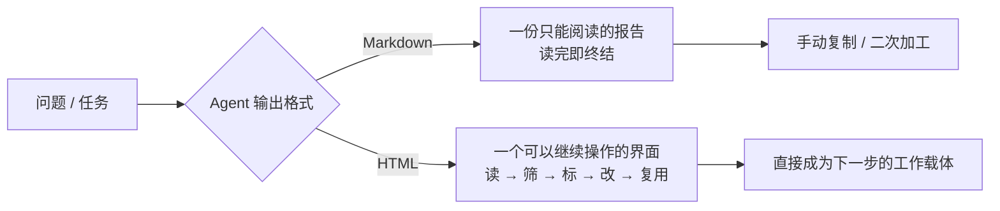
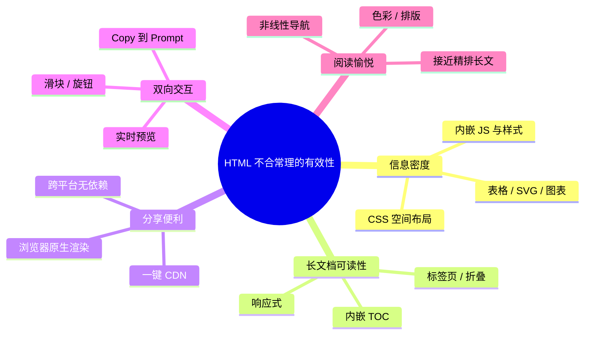
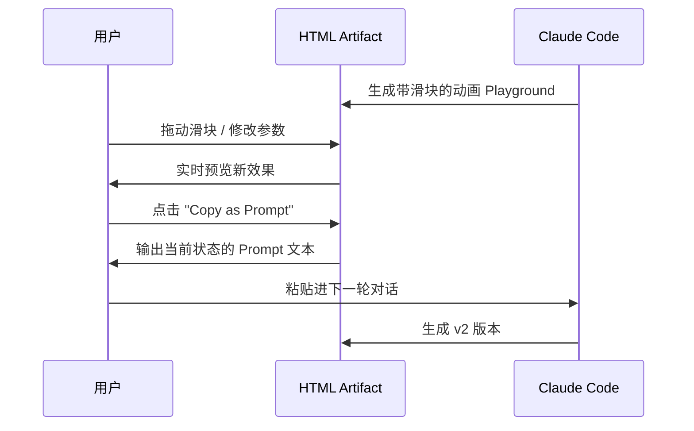
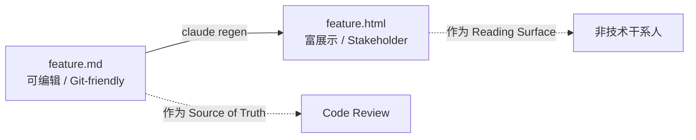
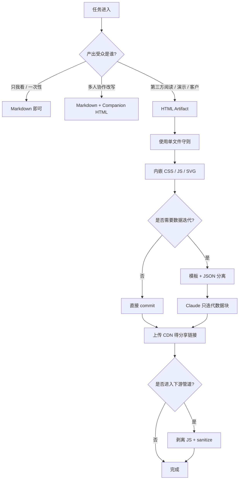

> 本文系统整理自 Anthropic Claude Code 工程负责人 Thariq Shihipar 在 2026 年 5 月 8 日发布的长文 [Using Claude Code: The Unreasonable Effectiveness of HTML](https://x.com/trq212/status/2052809885763747935)、配套示例站 [thariqs.github.io/html-effectiveness](https://thariqs.github.io/html-effectiveness/)，以及 Simon Willison、StableLearn 等社区的实战补充，并结合中文开发者的本地化场景做了重写。

---

## 一、为什么 2026 年是 Agent 输出格式的拐点？

过去三年，几乎所有 LLM 输出都默认走 Markdown：从 ChatGPT 的回答、Cursor 的解释、Claude Code 的计划，到 GitHub Copilot 的 PR 评论。这是 **8K Token 时代留下的历史包袱**——Markdown 极致省 Token，简单、可读、可复制。

但 2026 年情况已经彻底变化：

- **Opus 4.7 把上下文窗口拉到 1M Token**：HTML 多用几千 Token 已经不痛不痒；
- **Claude Code 等编码 Agent 越来越多地输出"计划 / 复盘 / 评审 / 报告"**，篇幅动辄数百行；
- **真实用户行为**：没人会真的读完一个 100 行以上的 Markdown 文件——包括写它的人。

Thariq Shihipar（Claude Code 工程负责人）在 5 月 8 日发布了一篇长文，给出了一个反直觉但极其犀利的结论：

> **如果一个输出需要被"审阅、点击、对比、编辑、分享"，HTML 几乎永远比 Markdown 更接近真正的工作面。**

这篇文章 48 小时内累计阅读量超过 900 万，HackerNews 讨论冲到 1000+ 分，并直接推动了一批社区 Skill（如 `dogum/html-artifacts`）的诞生。我们今天就来系统拆解这个"小转变带来的大变化"。

---

## 二、核心洞察：Markdown 是终点，HTML 是界面



| 维度 | Markdown | HTML |
|------|----------|------|
| 信息密度 | 段落、列表、表格、代码块 | + SVG、CSS、JS、交互、空间布局 |
| 长文档可读性 | 100 行后开始失效 | 标签页 / 折叠 / TOC / 响应式 |
| 分享 | 浏览器无法原生渲染 | 上传 CDN 即得链接 |
| 双向交互 | 不支持 | 滑块、按钮、Copy-Prompt |
| 阅读愉悦感 | 平淡 | 接近读一篇精排长文 |
| Token 占用 | 极低 | 2~5 倍 |
| Git Diff 友好度 | 高 | 低（需模板+数据分离） |
| 可被他人协同编辑 | 高 | 低（需前端能力） |

> 一句话总结：**Markdown 是 Report，HTML 是 Interface。Report 用于阅读，Interface 用于继续工作。**

---

## 三、Thariq 提出的五大理由



### 3.1 信息密度：Markdown 力所不能及的事

Markdown 能优雅地处理段落、列表、链接、代码块和简单表格——然后就到边界了。一切超出范围的需求（图示、颜色、组件状态、空间布局）都要靠 ASCII Art、外链图片或者干脆嵌入 HTML 块来补救，反而失去了 Markdown 的便携性。

Thariq 在文章里给了一个有趣的截图：当 Claude Code 被要求"在 Markdown 里展示一组颜色"时，它只能用 Unicode 字符近似，结果令人哭笑不得。这就是格式的硬天花板。

而 HTML 在单个自包含文件里就能渲染：

- 带 sticky header 的复杂表格；
- Inline SVG 矢量图；
- `<script>` 标签里可执行的代码；
- 绑定 DOM 的 JS 交互；
- 绝对定位 / Canvas 的空间布局；
- Base64 内嵌图片；
- 限定作用域的样式表。

### 3.2 100 行 Markdown 极限

> "没人真的会看完一个超过 100 行的 Markdown 文件，包括我自己。"  
> —— Thariq Shihipar

这是一个统计学事实，也是一个工程师的诚实自白。问题是，自 Opus 4.7 开放 1M Token 上下文以来，Claude 产出的实施方案和技术规格动辄数百上千行——**Markdown 已经撑不住产出体量了**。

HTML 文档之所以能扛长度，是因为：

- 内嵌 TOC、Tab 切换、可折叠区块；
- 响应式布局（桌面分栏，移动堆叠）；
- 内部锚点跳转 + 阅读进度高亮；
- 颜色和图标自然拆分内容层级。

### 3.3 分享：Markdown 真正的瓶颈

`.md` 文件在浏览器里无法原生渲染。邮件附件需要装编辑器，截图丢失结构，转 PDF 又丢失代码高亮。**HTML 上传到 S3 / R2 / GitHub Pages，立刻得到一个谁都点得开的链接**，手机也能看。

Thariq 的观察是：**输出格式从 MD 换成 HTML 后，文档被真正读完的概率呈非线性上升。** 对带分布式团队的人来说，这一条几乎是无法反驳的实战收益。

### 3.4 双向交互：HTML 既是输出也是输入



只要几行 JavaScript，Claude Code 就能生成一个**带滑块、按钮、复制功能的微型工具**，让你像调参一样探索一个决策空间，再把"当前状态"转成 Prompt 喂回给 Agent。**输出不再是静态艺术品，而是新一轮迭代的输入。**

### 3.5 阅读愉悦感

一份排版好的 HTML 文档，读起来更像在读一篇精心制作的长文，而不是一坨括号和井号。这一条听起来软，但它直接决定文档是被"扫一眼"还是"读完看完想完"。

---

## 四、9 大场景、20 个真实案例

Thariq 在 [示例站](https://thariqs.github.io/html-effectiveness/) 上放出了 20 个完全由 Claude Code 生成的 HTML 单文件示例，覆盖 9 个真实工程场景。下表是中文化的速查表：

| # | 类别 | 示例 | 价值点 |
|---|------|------|--------|
| 01 | 探索 & 计划 | 三套代码方案并排对比 | 三选一 vs. 读三段墙 |
| 02 | 探索 & 计划 | 多套视觉方案 Live Preview | 用看的，不用想象 |
| 03 | 探索 & 计划 | 实施方案（含时间线/数据流/风险表） | 实施人能真正看的 Plan |
| 04 | 代码评审 | 带边注的 Pull Request | 比终端滚 diff 容易扫 |
| 05 | 代码评审 | 给 Reviewer 的 PR 写作 | 写作者侧的引导 |
| 06 | 代码评审 | 模块地图（盒子+箭头） | 陌生包的"导览图" |
| 07 | 设计 | Living Design System | Token 即 swatch，可复制 |
| 08 | 设计 | 组件变体合集 | 一张图看完所有状态 |
| 09 | 原型 | 动画 Sandbox | duration / easing 实时调 |
| 10 | 原型 | 4 屏可点击流程 | 五秒看出交互是否对 |
| 11 | 插图 | SVG 配图合集 | 博客配图可直接复用 |
| 12 | 插图 | 部署流水线流程图 | 每步可点查时长/失败路径 |
| 13 | 演示 | 键盘翻页 PPT | 一个 HTML 一次会议 |
| 14 | 研究 | 功能讲解器 | TL;DR + 折叠步骤 + 配置 Tab |
| 15 | 研究 | 概念讲解器 | 一致性哈希 Live Ring + 词汇表 |
| 16 | 报告 | 周报 | 含小图表，周一一扫即懂 |
| 17 | 报告 | 事故复盘 | 分钟级时间线 + 日志摘要 |
| 18 | 编辑器 | Ticket Triage 拖拽板 | 拖完导出 Markdown |
| 19 | 编辑器 | Feature Flag 编辑器 | 含依赖告警 + diff 导出 |
| 20 | 编辑器 | Prompt 微调器 | 模板 + 三组样本实时渲染 |

> 这些 HTML 不是 "产品"，而是 **一次性工具（Throwaway UI）**——用来"理解任务 + 完成任务"，用完即扔。这正是 Claude Code 加 HTML 最颠覆性的能力。

---

## 五、上手就能用的 3 个 Prompt 模板

### 5.1 探索式：多方案对比

```text
我还没想好 Onboarding 页面到底要做成什么样。
请生成 6 个明显不同的设计方向，在布局、语气、信息密度上各有侧重。
把它们放进一个单文件 HTML 里，用网格并排呈现，方便我对比。
每个方案下面用一行小字说明它在做什么取舍。
```

### 5.2 代码评审：HTML PR Artifact

```text
帮我 review 这个 PR，输出成一个 HTML artifact。
我对 streaming/backpressure 的逻辑不熟，请重点分析这一块。
渲染真实的 diff，在两边加上边注；
按严重程度对每条 finding 用颜色编码；
其他你觉得有助于说清楚问题的元素也加上。
```

### 5.3 概念讲解：HTML Explainer

```text
我搞不清楚我们的 rate limiter 是怎么工作的。
请读相关代码，产出一个 HTML 讲解页：
- 顶部一个 token-bucket 流程图（SVG）；
- 中间 3-4 段关键代码片段，旁边带注释；
- 底部一个 "Gotchas" 模块，列易踩的坑；
为"一次性深读"优化，不需要可折叠。
```

> 经验法则：**先用 Prompt 试出有效模式，再考虑沉淀成 Skill。** Thariq 自己也反对一上来就写 Skill。

---

## 六、单文件架构守则（Single-File Rule）

> "今天能跑起来、半年后还能跑，才叫好的 HTML Artifact。"

Claude 默认产出的 HTML 经常会引用 unpkg、Google Fonts、CDN 图片——这意味着两年后 CDN 一变，整篇文档报废。社区早期实践已经收敛成以下五条铁律，**把它们写进 `CLAUDE.md` 或一个私人 Skill 里**：

| 守则 | 反面教材 | 正确做法 |
|------|----------|----------|
| **CSS 内联** | `<link href="cdn..."/>` | `<style>...</style>` 写在 `<head>` 里 |
| **JS 内联** | `import 'jsdelivr'` | `<script>...</script>` 直接写 |
| **图片自包含** | 远程 URL | Base64 内联 / Inline SVG |
| **系统字体** | Google Fonts | `system-ui, sans-serif, monospace` |
| **零网络调用** | runtime fetch | 完全离线可用 |

参考 prompt 片段（建议放进 `~/.claude/snippets/html-rules.md`，每次 `@html-rules` 引用即可）：

```text
When generating HTML artifacts, always follow:
1. Single .html file, fully self-contained.
2. All CSS inline in <style>; no external sheets, no CDNs.
3. All JS inline in <script>; no imports.
4. Images as base64 or inline SVG.
5. Only system fonts.
6. No runtime network calls; must work offline and air-gapped.
7. Respect WCAG 2.2 AA: descriptive alt text, ≥4.5:1 contrast, logical focus order.
```

---

## 七、Token 成本实测：HTML 真的贵吗？

针对"HTML 太贵"的批评，我们用同一个 PR（4 文件、280 行变更、3 处 finding）跑了三种格式的输出：

| 输出格式 | Output Tokens | 占 1M 窗口比例 | Opus 输出成本 |
|----------|--------------:|----------------:|--------------:|
| 纯 Markdown | ~1,140 | 0.11% | $0.017 |
| Lean Semantic HTML | ~2,760 | 0.28% | $0.041 |
| Full HTML（含 CSS + diff 渲染 + 严重度徽章） | ~5,480 | 0.55% | $0.082 |

结论：

- **绝对数额很小**：Full HTML 也才用 0.55% 的上下文窗口，单次八美分；
- **真正贵的是时间**：rich HTML 生成耗时是 MD 的 4~5 倍，在对话流里这个延迟会被明显感知；
- **Pro / Max 订阅用户**：成本完全被打包进固定月费，无需关心；
- **API 按量计费**：30 个复杂 Artifact / 月，月差额低于 $3。

> **结论：贵的是时间，不是钱。**对延迟敏感的对话场景酌情使用，对"做完即审"的高价值产出，全 HTML 完全值得。

---

## 八、解决 Git Diff 噪声：Template + Data 模式

HTML 最大的缺点是 git diff 噪声大。社区收敛出来的解法是 **模板 + 数据分离**：HTML 当模板，JSON 当数据，浏览器打开时再渲染。

```html
<!-- report-template.html -->
<!DOCTYPE html>
<html>
<head>
  <style>/* 内联样式 */</style>
</head>
<body>
  <h1 id="title"></h1>
  <table id="rows"></table>

  <script type="application/json" id="data">
  {
    "title": "Q2 安全审计",
    "rows": [
      {"k": "高危漏洞", "v": "0"},
      {"k": "中危漏洞", "v": "3"},
      {"k": "低危漏洞", "v": "12"}
    ]
  }
  </script>

  <script>
    const data = JSON.parse(document.getElementById('data').textContent);
    document.getElementById('title').textContent = data.title;
    const table = document.getElementById('rows');
    data.rows.forEach(r => {
      const tr = document.createElement('tr');
      tr.innerHTML = `<td>${r.k}</td><td>${r.v}</td>`;
      table.appendChild(tr);
    });
  </script>
</body>
</html>
```

这样做的双重收益：

1. **Git Review 只看 JSON**：和审 YAML 配置一样干净；
2. **同一模板可复用**：换 JSON 块即可生成 100 份不同报告，Claude 也只需要迭代数据。

---

## 九、Companion 模式：HTML 和 Markdown 并存

> 不是 HTML vs Markdown，而是 HTML × Markdown。

成熟团队的真实工作流是**双文件 Companion 模式**：



| 角色 | 看哪个 |
|------|--------|
| 工程师 Review | `feature.md`（diff 干净） |
| 产品经理 / 设计师 | `feature.html`（一键点开） |
| 客户 / 投资人 | `feature.html`（CDN 链接） |
| 半年后回看 | `feature.md`（Grep 友好） |

Git 流程很简单：

```bash
# 编辑 MD
$ vim docs/feature.md

# 让 Claude Code 读 MD 后重新生成 HTML
$ claude regen docs/feature

# 提交两者
$ git add docs/feature.md docs/feature.html
$ git commit -m "feat(docs): rate limiter design v2"
```

---

## 十、什么时候 **不** 应该用 HTML？

Thariq 的热情不该掩盖 Markdown 仍然占优的场景。下面这些情况，**硬上 HTML 只会自找麻烦**：

| 场景 | 推荐格式 | 原因 |
|------|----------|------|
| 仓库 README | Markdown | GitHub/GitLab 原生渲染；多人编辑 |
| Slack / Discord 代码片段 | Markdown | code-fence 全平台统一 |
| 给其他 LLM 的输入文档 | Markdown | 模型训练语料多为 MD；RAG 也更友好 |
| 长期 Git Blame 的文件 | Markdown | 逐行追溯不被噪声淹没 |
| 个人备忘 / 草稿 | Markdown | 重新生成 HTML 反而是负担 |
| RSS / 邮件 Newsletter | Markdown | 邮件客户端 HTML 渲染不可控 |

> **判断口诀**：文档有"第三方读者且不修改" → HTML；文档需要"协作 / 索引 / 自动管道消费" → Markdown。

---

## 十一、安全：HTML 是新的攻击面

HTML Artifact 里可以放 JS，JS 在浏览器里会执行。Markdown 没这个问题。三种现实风险要警惕：

### 11.1 Refeed 注入

把上次会话的 HTML 文件作为新会话上下文喂回 Claude——如果文件里藏了注释或 `data-*` 里的隐藏指令，会被当作 Prompt 解析。

**缓解**：refeed 前用脚本剥离 `<!-- -->` 注释和 `<script>`；优先 refeed 对应的 MD 摘要。

### 11.2 共享报告的 XSS

把 HTML 上传到带认证的企业域名 → 等同于在该域 cookie 上下文里执行任意 JS。

**缓解**：

- 用独立的沙盒子域名（`artifacts.example.com`）；
- 或在响应头加 `Content-Security-Policy: script-src 'none'`。

### 11.3 下游管道污染

HTML 被解析器/爬虫/RAG 当输入消费时，继承了对 Markdown 的"信任"——但其实它带可执行内容。

**缓解**：把 Agent 产出的 HTML 统一视为 **不可信输入**，先 sanitize 再入库。

---

## 十二、社区生态：相关 Skill 与工具

| 项目 | 用途 | 链接 |
|------|------|------|
| `dogum/html-artifacts` | 教 Claude 何时该用 HTML Artifact 替代 MD | [GitHub](https://github.com/dogum/html-artifacts) |
| Anthropic Skills 官方文档 | Skill 生命周期 + 最佳实践 | [docs.claude.com](https://docs.claude.com/en/docs/agents-and-tools/agent-skills/best-practices) |
| Simon Willison: HTML Tools | 用 HTML 构造交互式个人工具集 | [simonwillison.net](https://simonwillison.net/2025/Dec/10/html-tools/) |
| Thariq 示例站 | 20 个 HTML 示例可下载学习 | [thariqs.github.io](https://thariqs.github.io/html-effectiveness/) |

---

## 十三、Print-Ready HTML：被低估的隐藏副本

一个 Thariq 没展开但极有价值的场景：**给客户的合同 / 审计报告 / 投标书**。

用 `@media print` 写一份 HTML，能同时满足：

- 屏幕阅读：可滚动表格 + 交互链接；
- 打印 / 导 PDF：A4 排版、页眉页脚、页码、可控分页符。

```css
@media print {
  body { font-size: 11pt; color: #000; }
  .no-print { display: none !important; }
  .page-break { page-break-after: always; }
  @page {
    size: A4;
    margin: 18mm 16mm;
    @bottom-center { content: counter(page); }
  }
  a[href]::after { content: " (" attr(href) ")"; font-size: 9pt; }
}
```

`Ctrl + P` 即得专业级 PDF，源文件仍然是 Prompt 可改的 HTML——这是 Word 生成 PDF 永远做不到的可迭代性。

---

## 十四、典型工作流图谱

把上面所有要点串成一个落地工作流，长这样：



---

## 十五、给中国开发者的本地化建议

1. **CDN 选型**：S3 / R2 不便利的话，HTML Artifact 直接放到 [Cloudflare Pages](https://pages.cloudflare.com/) 或者 [Vercel](https://vercel.com/)，国内访问可叠加 [腾讯云 EdgeOne](https://edgeone.ai/) / [七牛云](https://www.qiniu.com/)；
2. **字体策略**：`system-ui` 在 macOS 是苹方、Windows 是微软雅黑、Linux 是 Noto Sans CJK——对中文展示已经够好，**避免 Google Fonts**（被墙且慢）；
3. **演示场景**：周会 / 月度复盘把"HTML Slide Deck"作为 PPT 平替，链接发到企微 / 飞书 / 钉钉，谁都能点开；
4. **客户交付**：审计、咨询、外包项目用 Print-Ready HTML 出 PDF，源 HTML 仍可作为后续修改的载体，**告别 Word 排版地狱**；
5. **结合本土 Agent**：[iFlow CLI](https://rubiklife.github.io/iflow-cli-guide/)、[OpenCode](https://rubiklife.github.io/opencode-complete-guide/) 等本土编码 Agent 都支持系统 Prompt 注入，把"单文件守则"写进项目级 `AGENTS.md` 即可全员复用。

---

## 十六、结语：从优化 Prompt 到优化 Artifact

过去两年我们花了大量精力**优化输入侧**——更好的 Prompt、更长的上下文、更精的工具调用。**Thariq 的洞察提醒我们也要优化输出侧**：

> 不要只优化 Prompt，**也要优化 Agent 还给你的那个"东西"**。

Markdown 是 8K Token 时代的省钱设计；HTML 是 1M Token 时代的可读性投资。当你的 Agent 输出已经常态化超过 100 行，是时候问一问：

- 这个产出会被审吗？→ 上 HTML；
- 这个产出会被多人对比吗？→ 上 HTML；
- 这个产出会被点击 / 筛选 / 标注吗？→ 上 HTML；
- 这个产出会反过来变成下一轮迭代的输入吗？→ 上 HTML，加 Copy-Prompt 按钮；
- 还是说只有你自己看一眼？→ Markdown 即可。

**立刻可以做的三件事**：

```bash
# 1. 在 ~/.claude/CLAUDE.md 末尾加上单文件守则
echo '
## HTML Artifact Rules
- Single self-contained .html file
- Inline CSS/JS/SVG, system fonts only
- No network calls at runtime
- WCAG 2.2 AA accessibility
' >> ~/.claude/CLAUDE.md

# 2. 把本文 5.x 节的三个 Prompt 模板存进 ~/.claude/snippets/
mkdir -p ~/.claude/snippets
# 写入 html-explore.md / html-pr-review.md / html-explainer.md

# 3. 下一次给 Claude Code 派活时，结尾加一句
#    "Output as a single-file HTML artifact following @html-rules."
```

剩下的，交给 Claude Code。

---

## 参考资料

- [Thariq Shihipar 原文 - Using Claude Code: The Unreasonable Effectiveness of HTML](https://x.com/trq212/status/2052809885763747935)
- [HTML Effectiveness 示例站（20 个真实案例）](https://thariqs.github.io/html-effectiveness/)
- [Simon Willison: The Unreasonable Effectiveness of HTML](https://simonwillison.net/2026/May/8/unreasonable-effectiveness-of-html/)
- [Simon Willison: Useful patterns for building HTML tools](https://simonwillison.net/2025/Dec/10/html-tools/)
- [StableLearn: Claude Code Should Output HTML, Not Just Markdown](https://stable-learn.com/en/claude-code-html-output/)
- [HTML vs Markdown in Claude Code - Pasquale Pillitteri](https://pasqualepillitteri.it/en/news/2243/html-vs-markdown-claude-code-thariq-anthropic)
- [Anthropic Skills 官方最佳实践](https://docs.claude.com/en/docs/agents-and-tools/agent-skills/best-practices)
- [dogum/html-artifacts - HTML Artifact Skill](https://github.com/dogum/html-artifacts)
- [Claude Code 最佳实践完整使用指南（本站）](https://rubiklife.github.io/claude-code-best-practices-guide/)
- [Everything Claude Code：黑客松冠军的完整配置指南（本站）](https://rubiklife.github.io/everything-claude-code-guide/)
