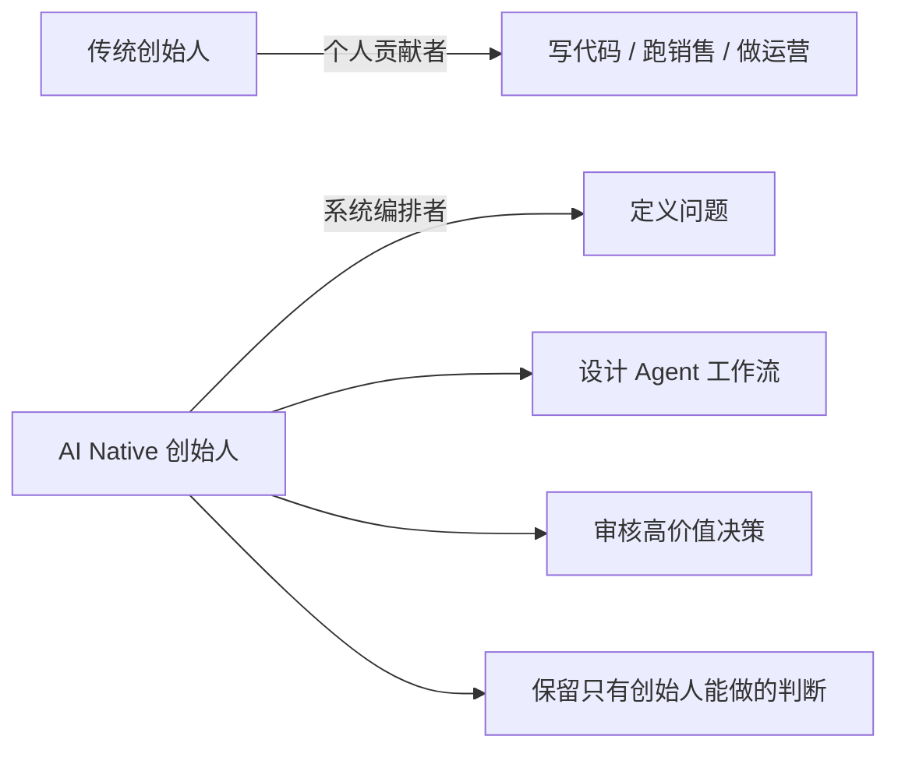
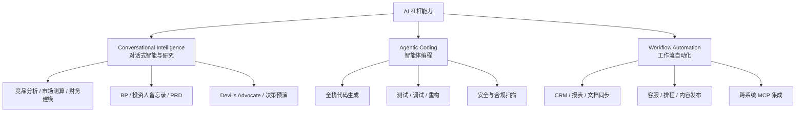
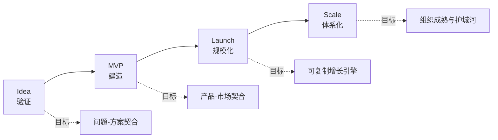
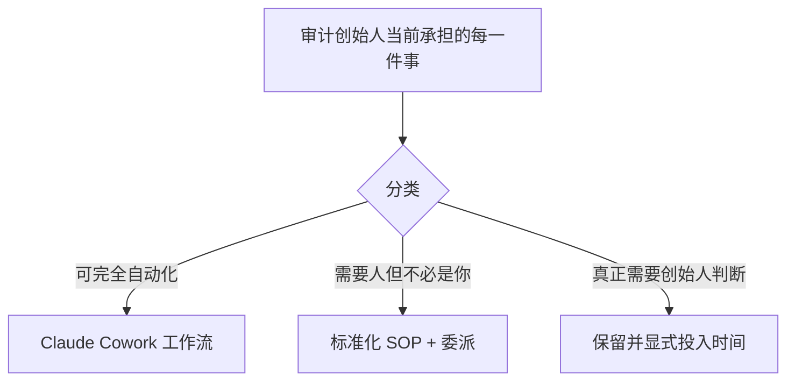
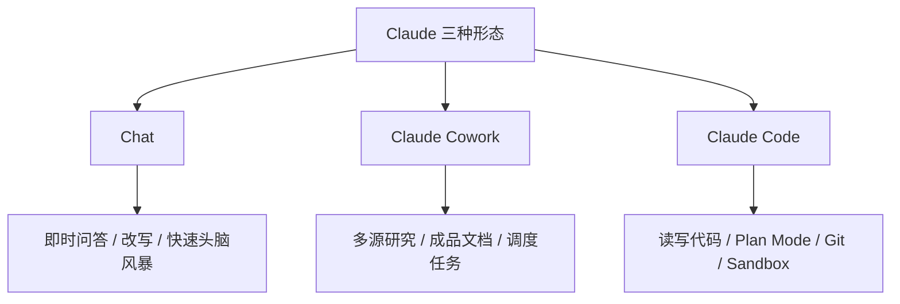
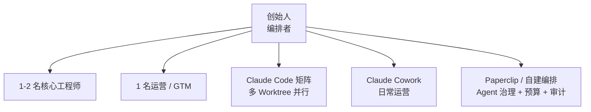

> 本文系统改写自 Anthropic 2026 年 5 月发布的 [The Founder's Playbook: Building an AI-Native Startup](https://claude.com/blog/the-founders-playbook)（含其[官方 PDF](https://cdn.prod.website-files.com/6889473510b50328dbb70ae6/69fe2a55b93bb0732b1fe33c_The-Founders-Playbook-05062026_v3%20(1).pdf)），并补充了中国创业者本地化的视角与可执行清单。

---

## 一、为什么 2026 年的创业范式被彻底重写？

过去 20 年，"硅谷标准剧本"是：**验证 → 融资 → 招人 → 开发 → 再融资 → 增长 → 再招人**。每一个新阶段都假设——你需要更大的团队、更多的钱、更专业的人。

2026 年，这套假设被 AI 彻底击穿：

- 一个完全不写代码的人，用 Claude Code 可以独立交付生产级应用；
- 一名只懂技术的工程师，用 Claude 可以独立完成市场分析、GTM 策略与投资人 PPT；
- "10 人独角兽" 从极客传奇变成了**主动选择的设计模式**。

| 维度 | 传统创业（≤ 2023） | AI Native 创业（2026） |
|------|------|------|
| 验证一个问题 | 需要数月用户访谈 | 几天内完成结构化访谈与分析 |
| 上线 MVP | 至少 1 个工程师 + 数月 | 创始人独立完成，按周计 |
| 运营杂活 | 招 OP / 运营 / 客服 | 工作流自动化 Agent 处理 |
| 增长瓶颈 | 资金、招聘 | **"该做什么"的判断力** |

> Anthropic 在原文中给出的关键论断：**瓶颈不再是「你能做出什么」，而是「你选择做什么」。**

---

## 二、创始人角色的本质转变：从执行者到编排者



历史上，创始人按"能做什么"被定义——技术创始人写代码，非技术创始人跑业务。AI Native 时代溶解了这堵墙：

- **非技术创始人** 用 Claude Code 把领域知识直接变成生产级产品；
- **技术创始人** 用 Claude 在一天内完成财务模型、GTM 策略与 BP。

创始人的注意力必须沿着价值链**向上走**：从"我亲手做"变成"我设计系统去做"。

> 最革命性的结果是：创始人池突破了工程师/MBA 的窄管道。拥有真实行业 Know-how 的医生、律师、护工、加工厂主管，开始解决主流科技圈过去根本不关心、甚至看不见的真问题。

---

## 三、AI 给创业公司的三大杠杆能力



### 3.1 对话式智能：随叫随到的全域专家

创始人第一年要面对的问题——"如何配置工资单？" "怎么规划产品冲刺？" "投资人备忘录怎么写？"——过去只有两条路：花时间问朋友，或烧钱请顾问。现在，**每个领域都有一位 7×24 的顾问随时可用**。

### 3.2 Agentic Coding：永远在线、永不阻塞的工程师

"我有一个想法 → 我有一个产品"的链路被压缩到天数级，且不再依赖技术联合创始人或外包团队。

### 3.3 工作流自动化：按需调用的运营团队

排程、CRM 更新、周报、合规追踪、文档同步——这些不会消失的杂活，过去全部压在创始人头上。Claude Cowork 把它们沉淀为可调度、可追踪、可审计的自动化工作流。

---

## 四、AI Native 创业生命周期总览



> 每个阶段都包含三件事：**阶段目标 → 退出标准 → 典型陷阱**。下面逐阶段拆解。

---

## 五、Idea 阶段：在写第一行代码前赢得 80% 的胜负

### 5.1 阶段目标

**研究驱动的验证**：在投入资源建造之前，用真实证据证明问题存在、且你的方案确实能解决它。

围绕四个递进问题展开：

1. 这个问题是否真实、具体、足够频繁？
2. 谁有这个问题？这是不是一个市场？
3. 别人在怎么做？做得如何？
4. 解决这个问题的方案需要做到什么？我的想法做到了吗？

四个问题加起来回答唯一的终极问题：**这值得做吗？**

> "人们苦于报销" 是观察；"中型公司的财务经理每周花 4 小时以上做报销对账，因为现有工具不能集成会计系统" 才是**可测试假设**。

### 5.2 退出标准（三个全是"是"才能离开）

| # | 检查点 | 必须能精确回答 |
|---|------|----------------|
| 1 | 问题是否真实且具体？ | 谁、多频繁、多严重、目前怎么应对 |
| 2 | 方案是否针对真实问题？ | 不是你假设的问题，而是验证后的问题 |
| 3 | 是否有足够信号支持建造？ | 不是确定性，但足以让"建 MVP"是理性决策 |

### 5.3 三大典型陷阱

| 陷阱 | 表现 | 解药 |
|------|------|------|
| **把"建造"当成"验证"** | 用 Claude Code 半天搓出原型，把原型存在本身当成需求被验证 | 原型只是访谈道具，对话才是证据 |
| **过早规模化** | 在没验证前就把工程做到 v2，AI 让你"无意识地"跑偏 | sense-making 必须永远跑在 building 前面 |
| **失去客观性** | 让 AI 找支持证据，它一定找得到 | 用同一把 AI 做 Devil's Advocate，主动找反证 |

> 在 Agentic Coding 之前，42% 的初创公司死于"建了没人要的东西"。AI 时代如果不警觉，这个数字只会更高——因为现在伪装出一个像产品的东西，只要一个下午。

### 5.4 Idea 阶段的 Claude 实操

#### 练习一：把问题陈述磨成可测试假设

```
角色：你是一位苛刻的种子轮投资人。
任务：审视我的问题陈述，要求达到以下精度——
1. 谁（具体到职位、公司规模、团队结构）
2. 多频繁（每周几次 / 每月几次）
3. 多严重（量化时间 / 金钱 / 风险损失）
4. 目前如何应对（具体工具与流程）

我的问题陈述：<填入>

如果任何一项不够具体，请提出最尖锐的问题逼我把它写清楚。
```

#### 练习二：让 Claude 当反方辩手

```
你是一位竞争对手 CEO，你坚信我的项目会失败。
请基于公开信息找出 5 个最有杀伤力的反对意见。
每条都要给出：论据、对应市场证据、我应该如何反驳。
```

#### 练习三：竞品分层映射

让 Claude Cowork 自动抓取并分类：

- **直接竞品**：同问题同方案；
- **间接竞品**：同问题不同方案；
- **潜在收购方**：可能整合此场景的大厂；
- **侧翼玩家**：未来可能跨界进入的相邻产品。

> 接着对每一层都问："为什么他们威胁是真实的？" 而不是"为什么他们不行？"

#### 练习四：客户访谈五件套

1. **目标画像**：精确到职位 + 公司形态 + 组织层级，而不是一长串通讯录；
2. **触达点**：他们出没的 LinkedIn 群、Slack、行业大会、播客；
3. **访谈框架**：问"上一次发生这个问题是什么时候"，**不要**问"你会不会用这种产品"；
4. **追问设计**：让 Claude 标出哪些问题诱导、过宽、容易获得"社交友好答案"；
5. **会后整理**：每 5 个访谈跑一轮分析，强制 Claude 输出"支持假设"和"挑战假设"两列证据。

#### 练习五：用 Claude Code 做最小验证原型

定义你的方案中**唯一一个核心交互**，只让 Claude Code 实现这一个交互，然后拿给 5 个目标用户上手。你从这 5 个反应里学到的东西，决定继续 build 还是回炉。

---

## 六、MVP 阶段：在"飞快建造"与"未来要还的债"之间走钢丝

### 6.1 阶段目标

把已验证的问题翻译成**真用户真用**的最小可用产品。同时埋好两件事：

1. **不积累注定爆雷的技术债**（尤其是 Agentic 技术债）；
2. **从第一天就建立持久上下文**（CLAUDE.md / 架构决策 / 规格文档）。

### 6.2 退出标准

**真正的 PMF 证据**：一群可识别的用户愿意因为它而**回访（留存）、付费（收入）、推荐（裂变）**。

判断 PMF 的两个轻量级试金石：

| 测试 | 标准 |
|------|------|
| **Sean Ellis 测试** | 问活跃用户："如果再也用不了这个产品你会怎样？" >40% 回答"非常失望" = 强 PMF 信号 |
| **Effort Test（费力度）** | PMF 之前是你推着用户走，PMF 之后是产品自己拉着用户走。能感觉到"从推变成拉"，就是质变 |

### 6.3 四大典型陷阱

#### 陷阱一：Agentic 技术债

传统技术债是线性累加，AI 写出来的技术债是**复利累加**。原因是——如果你没有把规格和架构原则写到 AI 能读到的地方，**每一次新会话都会从零重新推导基础决策，并悄悄漂移**。

> 你最后得到的，不是某段代码有问题，而是**整套代码缺乏统一心智模型**。

#### 陷阱二：误把早期热度当 PMF

朋友的捧场、投资人对接的友情试用、Hacker News 头条带来的脉冲流量——都是**易碎能量**。第 6 周、第 12 周的留存曲线才是答案。

#### 陷阱三：零摩擦的需求蔓延

当 Agentic Coding 让"再加一个功能"只要一个下午，**每个新增需求都看起来无害**。然而方向感与节奏感会在你毫无察觉中坍塌。

**解药**：MVP 启动前写下**反向产品规格**——"我们刻意不做什么"+"什么样的用户证据才能解锁新功能"。

#### 陷阱四：经验缺失型不安全

AI 写出来的代码**能跑 ≠ 安全**。功能漏洞会自己报错，安全漏洞要被攻破才暴露。**MVP 上线给真实用户前必须做安全评审**，这是最低底线。

### 6.4 MVP 阶段的 Claude 实操

#### 6.4.1 在动手前先定义架构

在打开 Claude Code **之前**，先和 Claude 聊清楚：

```
我要建造的核心问题：...
目标用户：...
未来 6 个月真实预期的规模：...

请帮我定义：
1. 这个 MVP 应该遵循的 3-5 个架构原则
2. 在当前约束下应当避免的依赖
3. 我们正在自觉接受的权衡及其代价
```

然后把输出**保存为 `CLAUDE.md`**——这是你这个项目的"持久记忆"，后续每个 Claude Code 会话都会自动读取。

#### 6.4.2 范围文档（Scope Doc）

包含三段：

1. 产品**做什么**；
2. 产品**刻意不做什么**；
3. **修改范围的证据门槛**——"什么样的用户信号才能让我们解锁新需求"。

把决策点从"应该做这个吗？"升级为"已经有足够多用户告诉我没有它就用不下去吗？"。

#### 6.4.3 上线前的安全检查清单

| 维度 | 必做项 |
|------|--------|
| 认证与会话 | JWT 签名密钥、刷新机制、超时策略 |
| API 数据暴露 | 是否返回了不该返回的字段（密码 hash、内部 ID） |
| 输入校验 | SQL 注入 / XSS / SSRF / 文件上传 |
| 依赖漏洞 | `npm audit` / `pip-audit` / Snyk |
| 凭证 | 是否硬编码进仓库？是否进 git 历史？ |

#### 6.4.4 在第一个用户出现前建立度量框架

PMF 误判几乎都来自：**先上线，再回头挑数据来支持"看起来很顺"的故事**。

| 必须先定义 | 示例 |
|-----------|------|
| 留存基线 | D7 ≥ 40%、D30 ≥ 25% |
| 激活定义 | 新用户 24h 内完成 X 行为 |
| 收入质量 | 留存性收入（recurring）占比 |
| **假阳性长什么样** | 注册不激活、付费不留存、热度不复购 |

每次拉数据后强制问 Claude："如果我是怀疑论者，我会怎样攻击这组数字？"

---

## 七、Launch 阶段：从"产品配得上存在"到"业务配得上增长"

### 7.1 阶段目标

把早期牵引转化为**可复制、可持续的增长引擎**，同时把产品下方的基础设施真正硬化。

Idea / MVP 阶段以创始人为中心是合理的（必须保持紧密反馈环）；Launch 阶段如果还继续亲自扛所有事，**创始人就变成瓶颈**。目标不是"撤出公司"，而是"建立运营系统，把注意力解放给只有你能做的决策"。

### 7.2 退出标准

| # | 标准 | 含义 |
|---|------|------|
| 1 | 增长可复制、来自渠道 | CAC / LTV / 回收期已知且可辩护 |
| 2 | 产品能扛生产流量 | 安全、合规、可靠性达到真实环境要求 |
| 3 | 运营脱离创始人瓶颈 | 客服 / 排期 / 报表都已自动化或交付 |

### 7.3 典型陷阱

| 陷阱 | 表现 |
|------|------|
| **MVP 技术债到期** | 当初为速度让位的捷径开始收利息 |
| **创始人成为瓶颈** | "一周决策"代替了"一小时决策"，因为只有你能拍板 |
| **安全合规拖不动** | 真用户、真数据、真企业合同进场，理论风险瞬间变成现实风险 |
| **过早扩张** | 进入新市场前没稳住原有市场，所有变量同时变动，数据无法解读 |

### 7.4 Launch 阶段的 Claude 实操

#### 7.4.1 系统化偿还技术债

1. 让 Claude Code 跑一次**架构审计**：识别脆弱点、捷径、测试覆盖盲区；
2. 把审计结果交给 Claude，让它**排序**：本次冲刺必须修的 / 可与下次特性开发并行的 / 可暂缓的；
3. 把当初活在你脑子里的架构决策**正式落到 `CLAUDE.md`**——这是 Launch 阶段最高 ROI 的文档投资。

#### 7.4.2 建立"取代创始人注意力"的运营系统



> 信号判断：如果你不在公司一周，**哪些事情就停了**？停掉的部分就是你目前还在做架构者本不该做的事。

#### 7.4.3 把安全与合规并入产品工作流

不再是上线前的一次性项目，而是与开发周期并行的常设工作流：

- 用 Claude Code 扫描 SOC 2 / GDPR / HIPAA / 等保 常见的代码层问题；
- 用 Claude 起草采购方会要求的控制清单、审计日志、访问管理规范；
- 准备好独立安全评估时所需的材料包。

#### 7.4.4 上线最轻量的产品管理操作系统

- **冲刺节奏**（双周/单周）；
- **最小规格模板**（用户故事 + 验收标准 + 非功能约束）；
- **Bug 三层分类决策树**（P0 立即 / P1 当周 / P2 入 backlog）；
- **每周指标简报**（从已连接的数据源自动聚合）。

设计完后，把"定时执行"交给 Claude Cowork，**让它自己跑**。

---

## 八、Scale 阶段：从赌博到生意，从产品到组织

### 8.1 阶段目标

从"千级用户"到"百万级"、从"一个市场"到"多个市场"。同时维持**精益 AI 原生结构**这一战略优势——人少不等于事少。

护城河来自累积深度：

- **领域专家深度**（创始人 Know-how 注入产品）；
- **系统集成深度**（用户工作流深度嵌入你的产品）；
- **数据飞轮深度**（用户行为反过来训练产品）。

### 8.2 退出标准

不再是单一里程碑，而是**门槛事件**：

| 形式 | 通向哪里 |
|------|---------|
| 可持续盈利不再需要外部资本 | 永续独立运营 |
| IPO 就绪 | 公开市场 |
| 战略收购 | 并入更大生态 |

三种路径共同要求：增长可审计、护城河可被尽调、组织运营可持续。

### 8.3 典型陷阱

| 陷阱 | 解决路径 |
|------|---------|
| **运营层授权困难** | 系统先成熟、再相信；不要把关键决策上下文一起授权出去 |
| **技术运营升级** | 不是只有 Codebase 要硬化，**Codebase 周边**（监控、SLA、文档）才是企业客户买单的 |
| **组织职能扩张** | 财务、合规、人事、法务、客户成功，缺一不可 |
| **从未建过 GTM 引擎** | 创始人式销售有天花板，必须建真正的 Go-To-Market 体系 |

### 8.4 Scale 阶段的 Claude 实操

#### 8.4.1 把日常交给 Claude Cowork

```
练习：用 Claude 画出你当前的"瓶颈地图"——
所有当前还经过你的工作流、决策、审批。
对每一项追问：如果创始人离开一周，它会怎样？
卡住的那些，才是你还没真正交付出去的事。
```

#### 8.4.2 让技术运营进化为企业级基础设施

- **Claude**：起草并维护文档、SLA、客户支持 Playbook；
- **Claude Code**：硬化代码以符合企业合约要求，搭建日志、监控、事故响应；
- **Claude Cowork**：跑工单路由、续约追踪、客户成功节奏。

三者叠加，让小团队拥有大组织的支持姿态。

#### 8.4.3 构建真正的 GTM 引擎

| 维度 | Claude 怎么帮 |
|------|--------------|
| 市场细分 / 信息架构 | Claude 草拟 + 你审批 |
| 销售剧本 / 分析师叙事 | Claude 起草 + 你打磨语言风格 |
| 内容流水线 / 外呼序列 | Claude Cowork 调度执行 |
| 互动 Demo / API 文档 / Sandbox | Claude Code 直接生成 |

> 一个建好的 Demo 环境，能在你开董事会的同时**异步成交**。

#### 8.4.4 把领域知识沉淀成"AI 上下文资产"

非技术创始人在垂直行业最大的优势，是数十年沉淀下来的 Know-how。务必：

1. 用 Claude 长期对话把行业黑话、监管陷阱、边界案例**显性化**；
2. 用 Skills 把"我审一份商业租约的步骤"或"我分诊一份病历的流程"**固化为可重用 Routine**；
3. 每次发现一个**通用 AI 一定会做错的边界用例**，写成测试用例固化进去——**你的测试套件最终就是你的护城河地图**。

#### 8.4.5 用工作流锁定（Workflow Lock-in）创造离不开的产品

数据飞轮让产品更难复制，工作流锁定让产品**更难离开**：

- 用户在你的产品上搭了自动化；
- 培训了同事使用；
- 接了上下游系统；
- 沉淀了一整套 Prompt 与标准输出。

迁移从"产品决策"变成"全公司级项目"。

---

## 九、Chat / Claude Cowork / Claude Code：在每个阶段用对工具



| 任务类型 | 选哪个 | 为什么 |
|---------|--------|--------|
| 一句话提问、随手改写、临场 brainstorm | **Chat** | 零设置、对话式、上下文极轻 |
| 跨文件夹研究、跨工具产出成品文档 | **Claude Cowork** | 文件夹访问、连接器、Skills、定时任务 |
| 写代码、做测试、上线代码、跨仓库重构 | **Claude Code** | Codebase 直连、Diff / Git / 沙箱环境 |

| 阶段 | 主力工具 | 配角 |
|------|---------|------|
| Idea | Chat + Claude Cowork（研究/访谈） | Claude Code（仅末尾做轻量原型） |
| MVP | Claude Code（主战场） | Chat（架构对齐）、Cowork（反馈漏斗） |
| Launch | 三者并用 | Cowork 成为"代你处理"的核心 |
| Scale | 三者协同，沉淀为系统 | Cowork 成为公司操作系统 |

> 三者的底层是同一个 Claude，**变化的只是它工作时所在的工作台**。

---

## 十、AI Native 创业者的"反直觉"心法 8 条

1. **先验证再建造**：原型只是访谈道具，不是结论；
2. **可读性是基础设施**：CLAUDE.md / 架构决策 / Spec 写得越早，复利越大；
3. **每一次"再加一个功能"都是政治决策**：要有书面证据门槛；
4. **同一把 AI 既能验证你，也能反驳你**：默认让它做 Devil's Advocate；
5. **能跑 ≠ 能上线**：上线前一定要跑一遍安全清单；
6. **真实留存才是 PMF**：早期热度是噪声，第 6 / 12 周才是信号；
7. **创始人的瓶颈往往不是能力，而是"舍不得撒手"**：定期做"我消失一周"模拟；
8. **护城河 = 累积深度 × 工作流锁定 × 数据飞轮**：三者都要"从第一天就开始转"。

---

## 十一、中国创业者的本地化补充

原文以美国生态为默认背景，在中国语境下还要叠加几点考量：

### 11.1 模型与合规

| 维度 | 海外（Claude 默认场景） | 中国本地化建议 |
|------|---------|---------|
| 主力模型 | Claude / GPT / Gemini | 可叠加 DeepSeek / Qwen / GLM 国内可用模型 |
| 数据合规 | GDPR / CCPA / HIPAA | 个保法、数据出境评估、行业等保 2.0/3.0 |
| 支付与开票 | Stripe + Plaid | 微信支付 / 支付宝 / 抖音小程序 / 企业服务发票 |
| 客户沟通 | Email + Slack + Loom | 企微 / 飞书 / 钉钉 / 视频号 / 小红书 |

### 11.2 渠道与冷启动

- 海外 PLG = Hacker News / Product Hunt；
- 国内 PLG = 即刻 / 小红书 / 视频号 / B 站 / 微信公众号深度长文 + 行业垂直社群（如即刻"独立开发者"圈、阿里 / 字节系开发者群、飞书文档社区）。

### 11.3 GTM 的隐形税

- 国内企业级销售常常需要驻场 POC、关系维护、定制开发，**AI 工作流自动化不能替代关系建立，但能彻底解放对"杂事"的占用时间**——这是中国 SaaS 创始人最该投入 Claude Cowork 的地方；
- 政企客户对**国产化 / 私有化 / 信创**要求极高，从 Day 1 就要考虑 Self-Hosted Agent（如 OpenClaw / Paperclip 等）作为对外可交付的形态。

### 11.4 团队结构建议（10 人以内）



国内独立开发者团队 ≤ 5 人就能做出营收 ¥10 万 / 月的产品，这一模板在 2026 年正变成新常态。

---

## 十二、立刻可执行的 30 天行动清单

### Week 1 — Idea 端

- [ ] 用 Claude 把你的核心问题打磨成可测试假设；
- [ ] 让 Claude 找 5 个最有杀伤力的反驳；
- [ ] 用 Claude Cowork 自动整理目标客户清单，发出 20 封约访邮件；
- [ ] 完成 5 场 30 分钟访谈。

### Week 2 — 架构与范围

- [ ] 写出 `CLAUDE.md`（架构原则 + 决策日志）；
- [ ] 写出 `SCOPE.md`（做什么 / 不做什么 / 解锁标准）；
- [ ] 定义 PMF 度量框架（D7、D30、激活、假阳性）。

### Week 3 — MVP 与安全

- [ ] 用 Claude Code 完成核心交互的端到端实现；
- [ ] 跑一次安全清单（认证 / API 暴露 / 输入校验 / 依赖漏洞）；
- [ ] 发布给前 5 位真实用户。

### Week 4 — 反馈与迭代

- [ ] Claude Cowork 跑用户反馈漏斗 + 每周综合简报；
- [ ] 用 Claude 跑 Sean Ellis 测试与"力度测试"自检；
- [ ] 完成下一轮迭代的优先级排序。

---

## 十三、原书核心金句精选

> "The traditional startup growth arc assumes that the path from idea to scale is validate → raise → hire → build → raise again → grow → hire more → repeat. AI has erased the expectation that each new phase requires a bigger team."

> "AI follows your direction, which means a founder who isn't asking hard questions can now construct an elaborate, well-researched-looking case for a bad idea faster than ever before."

> "A prototype is easy to mistake as concrete evidence that you're solving a real problem, but it's not. **Your prototype is a useful pressure-testing prop for conversations with potential users. These conversations themselves are the real evidence.**"

> "**The bottlenecks are no longer what you can build, but what you choose to build.**"

---

## 十四、延伸阅读

- 原文博客：[The founder's playbook: Building an AI-native startup](https://claude.com/blog/the-founders-playbook)
- 完整 PDF（约 33 页，英文）：[The-Founders-Playbook-05062026_v3.pdf](https://cdn.prod.website-files.com/6889473510b50328dbb70ae6/69fe2a55b93bb0732b1fe33c_The-Founders-Playbook-05062026_v3%20(1).pdf)
- Anthropic Startups Program：[claude.com/programs/startups](https://claude.com/programs/startups)
- Claude Code 文档：[platform.claude.com/docs](https://platform.claude.com/docs)
- 站内相关阅读：
    - [Paperclip 完全使用指南：从入门配置到 AI 公司实战]()
    - [Claude Code 最佳实践完整使用指南]()
    - [Agent Skills 完全指南：为 Claude 构建专业技能的实践手册]()

---

> AI Native 创业的核心不是"AI 替代人"，而是**让每一个有真问题、真洞察的人，拥有过去只有大公司才有的杠杆**。
>
> 创始人的工作没有变——找到真问题、建造解决方案、长成一家重要的公司。变的，只是抵达那里的路径。
