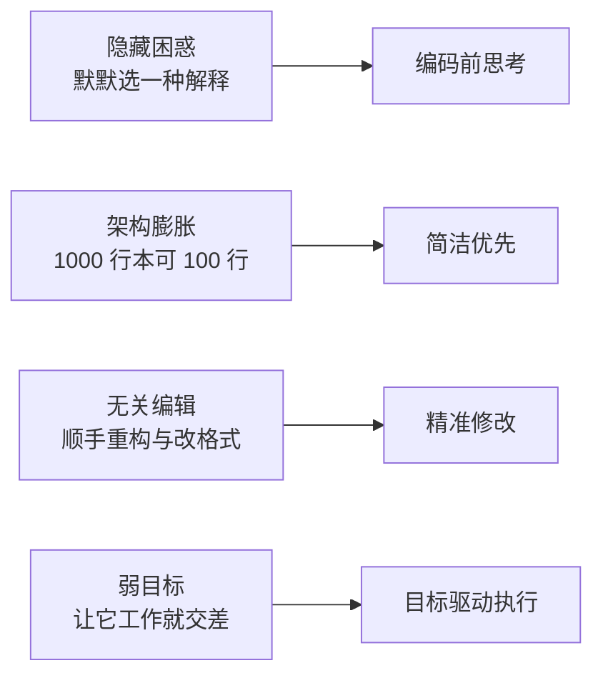
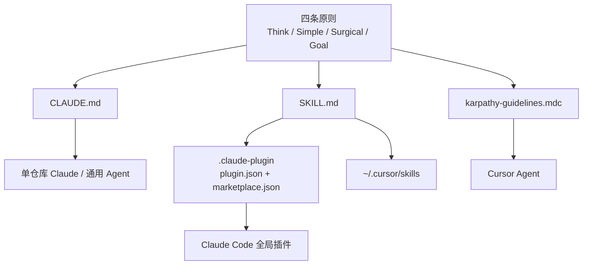
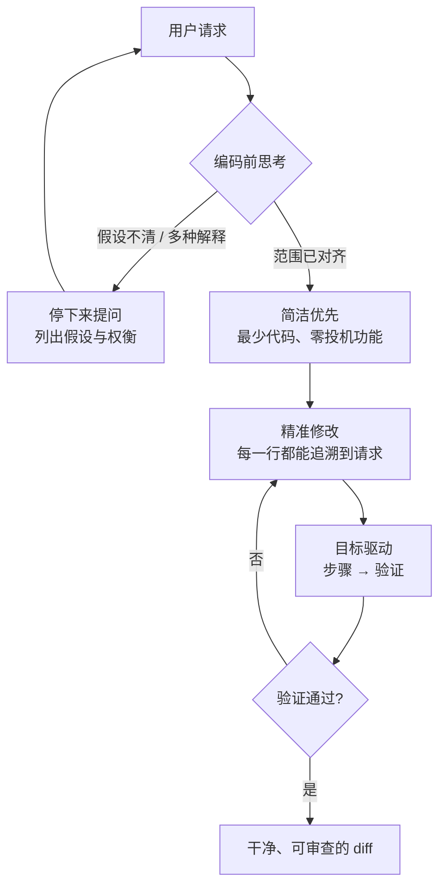
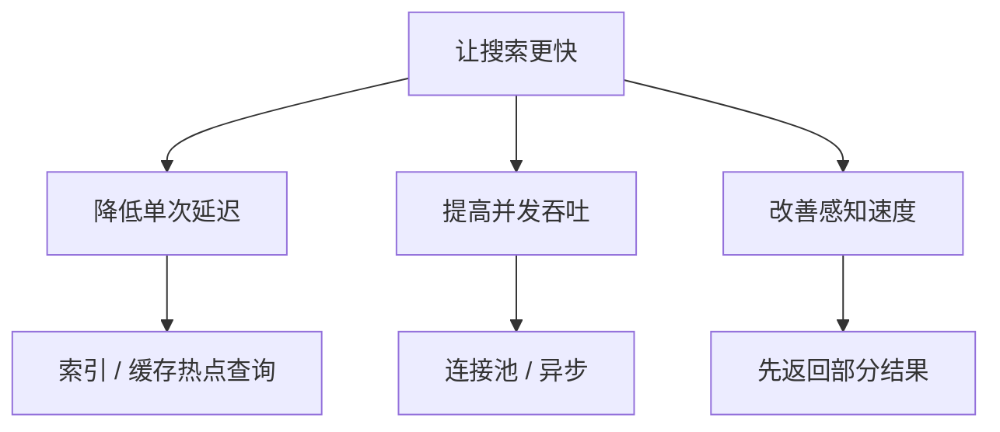
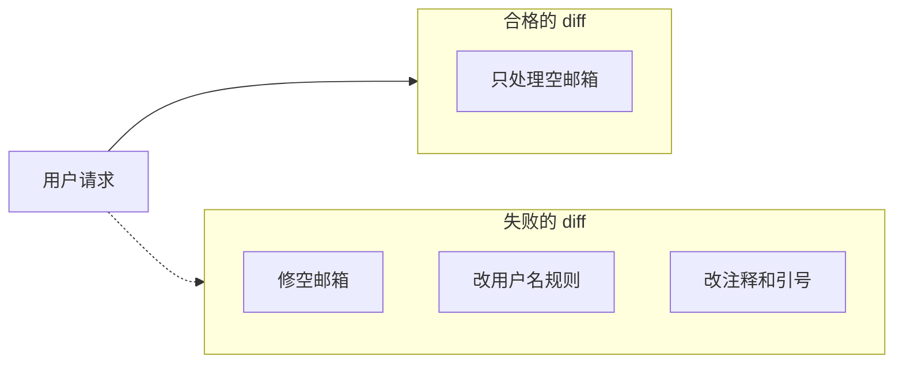
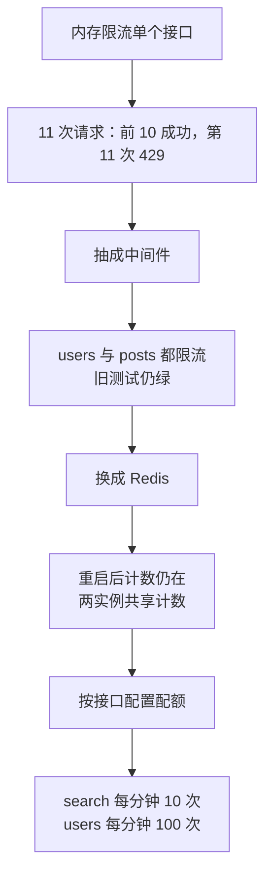
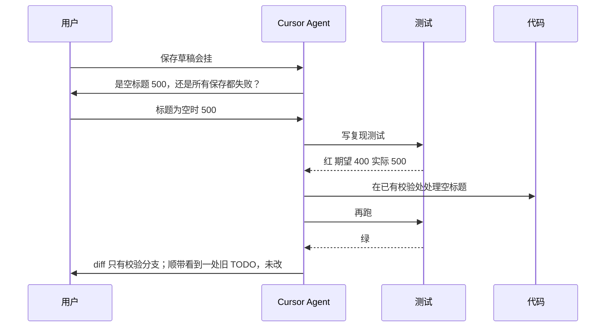
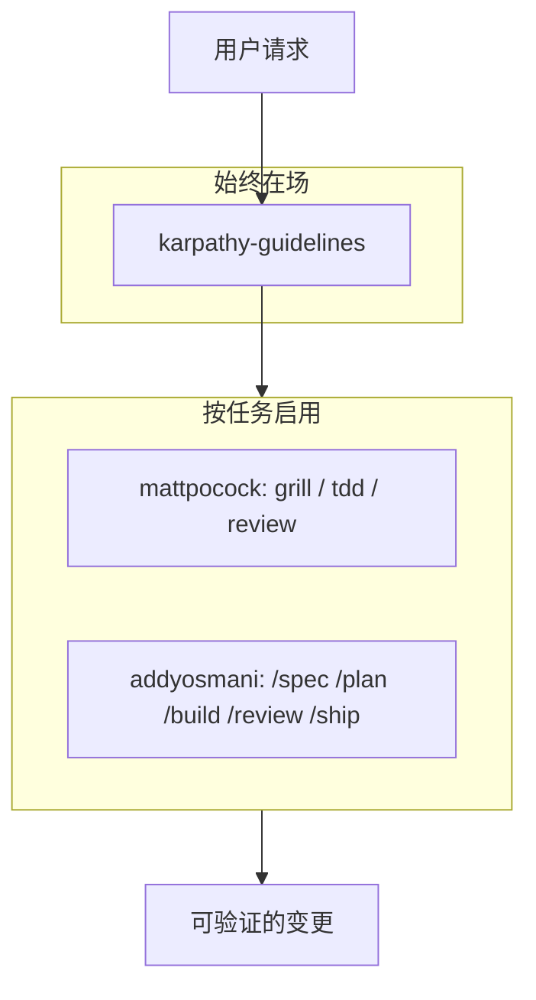
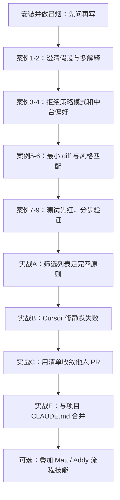

> **andrej-karpathy-skills** 不是又一套“让 Agent 写出更多代码”的技能包。它把 Andrej Karpathy 在 2026 年 1 月那条长推里指出的 LLM 编码慢性病，压缩成一份可注入上下文的行为指南：先把假设说出来，用最少代码解决问题，只改必须改的行，并把任务改写成可验证的成功标准。

本文依据 [GitHub 仓库](https://github.com/multica-ai/andrej-karpathy-skills) 与 [DeepWiki 源码解析](https://deepwiki.com/multica-ai/andrej-karpathy-skills) 整理，对照仓库中的 `CLAUDE.md`、`SKILL.md`、`EXAMPLES.md` 与 Cursor 规则。内容状态截至 **2026 年 8 月**；安装命令请以当前 README 为准。

---

## 一、这套技能解决什么问题

Karpathy 在 [2026 年 1 月 27 日的长文推](https://x.com/karpathy/status/2015883857489522876) 里记录了自己几个星期内的工作流翻转：11 月大约是 **80% 手写 + 20% Agent**，12 月变成 **80% Agent + 20% 润色**。他几乎在用英语编程。语法错误基本消失了，取而代之的是一种更危险的东西：**略显草率的初级工程师会犯的概念性错误**。

他点名的三类失败，正是这份技能要对准的靶子：

1. **隐藏困惑**：模型替你选一种解释，不核对就往下跑。它们不管理困惑、不求澄清、不呈现矛盾、不展示权衡，该反驳时也不反驳，还略微过于奉承。
2. **架构膨胀**：明明 100 行能做完，非要堆出 1000 行臃肿、脆弱、过度抽象的构造。你随口一句“能不能简单点”，它立刻改成 100 行，还说“当然可以”。
3. **顺手改无关代码**：即使与当前任务正交，模型仍会改注释、删自己没看懂的代码、顺带“美化”相邻文件。

Karpathy 自己也试过在 `CLAUDE.md` 里写几句纠正，效果有限。`andrej-karpathy-skills` 做的事更窄、也更可执行：把纠正写成 **四条始终在场的行为原则**，而不是一篇“最佳实践散文”。



它和 [mattpocock/skills]()、[addyosmani/agent-skills]() 的定位不同：后两者是完整工程流程（澄清、规格、TDD、审查、发布），Karpathy Skills 是一层 **始终生效的行为约束**。你可以单独用，也可以垫在其他技能包下面。

---

## 二、仓库是什么，不是什么

仓库当前只有 **一个技能**：`karpathy-guidelines`。没有斜杠命令矩阵，没有 24 个 SDLC 技能，没有 Persona 扇出。它刻意保持极小，方便复制到任何项目。

同一套原则以四种载体分发，避免“只在某个工具里生效”：

| 载体 | 路径 | 适用场景 |
|------|------|----------|
| Claude Code 插件 | `.claude-plugin/` + `skills/karpathy-guidelines/` | 全局安装，跨项目生效 |
| 项目指令 | `CLAUDE.md` | Claude Code 项目级；其他只认根目录指令文件的工具 |
| Cursor 规则 | `.cursor/rules/karpathy-guidelines.mdc` | `alwaysApply: true`，打开项目即注入 |
| 可复用 Skill | `skills/karpathy-guidelines/SKILL.md` | 拷到 `~/.cursor/skills` 或个人技能库 |



DeepWiki 把这件事概括得很准确：**同一份自然语言纪律，投影到不同宿主的配置文件里。** 贡献者改原则时，必须同步 `CLAUDE.md`、`.mdc` 和 `SKILL.md`，否则会出现“Cursor 谨慎、Claude 仍乱改”的行为漂移。

**它不是：**

- 不会替你写规格、切 Ticket、跑浏览器验证。
- 不会在琐碎拼写修复上强制走完整流程（仓库明确偏向谨慎，但要求你对 trivial 任务自行判断）。
- 不是 Karpathy 本人维护的官方仓库。原作者是 [forrestchang](https://x.com/jiayuan_jy)，现托管在 [multica-ai](https://github.com/multica-ai/andrej-karpathy-skills)。README 里部分安装命令仍写旧账号 `forrestchang/...`，GitHub 通常会重定向；优先使用 `multica-ai` 路径更稳妥。

---

## 三、四条原则怎么在一次对话里串起来

把四条原则当成 Agent 的生命周期，而不是四段互不相干的口号：



Karpathy 的关键洞察是第四条的底色：

> LLM 非常擅长循环执行直到达成特定目标。不要告诉它该做什么，给它成功标准，然后看着它完成。

指令式任务（“修这个 bug”）把 Agent 变成听话的打字机；声明式目标（“先写一条能复现的测试，再让它变绿”）把 Agent 变成带反馈的循环。强成功标准让模型自己转圈；弱标准（“让它能用”）会把澄清成本全部推回给你。

---

## 四、入门安装

### 4.1 Claude Code 插件（推荐，跨项目）

在 Claude Code 里先加市场，再装插件：

```text
/plugin marketplace add multica-ai/andrej-karpathy-skills
/plugin install andrej-karpathy-skills@karpathy-skills
```

如果当前 CLI 仍只认旧路径，可用 README 里的写法：

```text
/plugin marketplace add forrestchang/andrej-karpathy-skills
/plugin install andrej-karpathy-skills@karpathy-skills
```

插件清单里的关键字段：

- 市场 ID：`karpathy-skills`
- 插件名：`andrej-karpathy-skills`
- 技能路径：`./skills/karpathy-guidelines`
- 分类：`workflow`

装好后，该技能会在匹配“写代码 / 审查 / 重构”时被注入。它的 `description` 写得很直白：避免过度复杂、做精准修改、把假设说出来、定义可验证的成功标准。

### 4.2 单项目 `CLAUDE.md`

适合不想全局安装、或团队要把纪律写进仓库的场景。

新项目：

```bash
curl -o CLAUDE.md https://raw.githubusercontent.com/multica-ai/andrej-karpathy-skills/main/CLAUDE.md
```

已有 `CLAUDE.md` 时追加，不要覆盖项目自己的约定：

```bash
echo "" >> CLAUDE.md
curl https://raw.githubusercontent.com/multica-ai/andrej-karpathy-skills/main/CLAUDE.md >> CLAUDE.md
```

Windows PowerShell：

```powershell
Invoke-WebRequest -Uri "https://raw.githubusercontent.com/multica-ai/andrej-karpathy-skills/main/CLAUDE.md" -OutFile CLAUDE.md
```

### 4.3 Cursor 规则

Cursor **默认不读** `CLAUDE.md` 和 `.claude-plugin/`。要用 Cursor Agent 执行同一套纪律，把规则文件拷进项目：

```text
.cursor/rules/karpathy-guidelines.mdc
```

该文件 front matter 含 `alwaysApply: true`，打开仓库后应出现在 **Settings → Rules**。复制到其他项目时，按需与现有规则合并，避免两条互相打架的“永远应用”规则。

也可以把 `skills/karpathy-guidelines/SKILL.md` 放到个人技能目录 `~/.cursor/skills/karpathy-guidelines/`，作为可复用技能而不是项目规则。

### 4.4 五分钟确认它生效

装完不要直接丢一个大需求。用下面这条提示做冒烟测试：

```text
给用户加一个导出功能。先不要写代码。
请按 Karpathy guidelines：列出你的假设、可能的多种解释，以及更简单的方案。
有不清楚的地方先问我。
```

**生效的信号：** Agent 先问范围、格式、字段、体量，而不是立刻创建 `ExportService` + Strategy + Redis 缓存。

**没生效的信号：** 直接开写，顺带改了三个无关文件的引号风格。这时检查规则是否 `alwaysApply`、插件是否启用、`CLAUDE.md` 是否真的在仓库根目录。

---

## 五、原则 1：编码前思考

**口令：不要假设。不要隐藏困惑。呈现权衡。**

LLM 的默认策略是“选一个听起来合理的解释并全速前进”。这条原则强迫它把选择公开。

落地动作只有四句：

- 不确定就问，不要猜。
- 存在多种解释时，列出来，不要默默挑一个。
- 有更简单的做法时，说出来并反驳复杂方案。
- 困惑时停下来，点名哪里不清楚。

### 入门案例 1：用户说“加一个导出用户数据的功能”

这是仓库 `EXAMPLES.md` 的经典反例。未受约束的模型会默默假设：导出全部用户、写到本地文件、字段是 `id/email/name`、JSON 和 CSV 都要。

看起来能跑的实现：

```python
def export_users(format='json'):
    users = User.query.all()
    if format == 'json':
        with open('users.json', 'w') as f:
            json.dump([u.to_dict() for u in users], f)
    elif format == 'csv':
        with open('users.csv', 'w') as f:
            writer = csv.DictWriter(f, fieldnames=['id', 'email', 'name'])
            writer.writeheader()
            writer.writerows([u.to_dict() for u in users])
    return f"Exported {len(users)} users"
```

问题不在语法，在**没问就替你做了产品决策**：隐私范围、文件落点、敏感字段、数据量。正确反应是代码之前的一段澄清：

```text
实现前需要确认：

1. 范围：全部用户，还是按权限/筛选条件导出？涉及隐私。
2. 形态：浏览器下载、后台任务发邮件，还是 API 返回数据？
3. 字段：哪些可以出站？手机号、地址是否包含？
4. 体量：大概多少行？这决定要不要分页或异步。

当前最简单的做法：加一个分页 JSON API。
文件导出需要更多信息。你更倾向哪一种？
```

把这条原则变成你自己的提示模板：

```text
在动手之前：
1. 用条目列出你准备采用的假设。
2. 如果请求有 2 种以上合理解释，全部列出来并给出工作量估计，不要自行选择。
3. 如果存在明显更简单的方案，先提出来。
4. 有任何一点不清楚，停下来问我，不要开始改文件。
```

### 入门案例 2：“让搜索更快”有三种完全不同的意思

未受约束的模型会同时加上缓存、数据库索引和异步，写 200 行“优化”。这三种“快”对应的是延迟、吞吐和主观体验，方案与代价完全不同。



合格的回复应当像一份微型选项单，而不是一份已经写完的 PR：当前基线是多少、三种解释各要几小时、你选哪一个。**没有基线数字的“优化”，通常是在猜。**

---

## 六、原则 2：简洁优先

**口令：用最少的代码解决问题。不要为明天的需求预支抽象。**

明确禁止：

- 没被要求的功能
- 一次性代码上的抽象层
- 没人要的“灵活性 / 可配置性”
- 不可能发生的错误处理
- 200 行其实能写成 50 行的实现

检验句只有一句：**资深工程师会觉得这过于复杂吗？会，就简化。**

### 入门案例 3：只要一个折扣计算

用户说“加一个计算折扣的函数”。模型却交出策略模式、Protocol、配置对象和计算器类——用 80 行完成一次乘法。

真正需要的常常是：

```python
def calculate_discount(amount: float, percent: float) -> float:
    """计算折扣金额。percent 取值 0-100。"""
    return amount * (percent / 100)
```

多种折扣类型、最低消费、折扣上限，等需求真正出现再重构。仓库把这点写得很狠：**过度设计的例子并不是“写错了”，它们遵循了设计模式；错在时机——在需要之前引入复杂度。**

好代码解决今天的问题，而不是提前解决明天的问题。

### 入门案例 4：保存偏好，不要顺手做中台

“把用户偏好存进数据库”被实现成带缓存、校验器、合并开关、变更通知的 `PreferenceManager`。用户要的是一次 `UPDATE`。

```python
def save_preferences(db, user_id: int, preferences: dict):
    db.execute(
        "UPDATE users SET preferences = ? WHERE id = ?",
        (json.dumps(preferences), user_id),
    )
```

缓存等性能真成问题再加；校验等脏数据出现再加；合并等产品明确要求再加。**Yagni 对 Agent 比对人类更重要**，因为 Agent 生成样板的边际成本接近于零，而阅读和回滚的成本仍完全由你承担。

---

## 七、原则 3：精准修改

**口令：只碰必须碰的。只清理自己造成的混乱。**

编辑已有代码时：

- 不要“改进”相邻代码、注释或格式
- 不要重构没坏的东西
- 匹配现有风格，即使你更喜欢另一种
- 发现无关死代码：提一句，不要擅自删除

你的改动制造出孤儿时：

- 删除**因你的改动**而变得无用的 import / 变量 / 函数
- 不要删除预先存在的死代码，除非被要求

检验句：**每一行修改都应该能直接追溯到用户请求。** DeepWiki 把预先存在的死代码处理单独叫做 **Orphan Management（孤儿管理）**：你制造的垃圾你清；别人留下的遗迹先报告。

### 入门案例 5：空邮箱让校验崩溃

用户只要修 `email` 为空或全空白时的崩溃。错误做法是顺手加强邮箱正则、给用户名加长度和字符集校验、改注释、补 docstring。审查者看到的是“修 bug 变成了重写校验器”。

精准 diff 只动与空邮箱相关的行：

```diff
  def validate_user(user_data):
      # Check email format
-     if not user_data.get('email'):
+     email = user_data.get('email', '')
+     if not email or not email.strip():
          raise ValueError("Email required")

      # Basic email validation
-     if '@' not in user_data['email']:
+     if '@' not in email:
          raise ValueError("Invalid email")

      # Check username
      if not user_data.get('username'):
          raise ValueError("Username required")

      return True
```

用户名规则、注释措辞、docstring 都不在请求里，就不要出现在 diff 里。

### 入门案例 6：给上传函数加日志，不要顺便“现代化”

“加日志”常被模型理解成：加上类型注解、改成双引号、重排空白、改布尔返回逻辑、补 docstring。这叫 **drive-by refactoring（顺手重构）**，也是 Karpathy 点名的副作用。

正确做法：沿用单引号、不新增类型注解、保留原有 `if/else return` 结构，只把 `print` 换成 logger，并在成功/失败路径各打一条日志。

**风格漂移是精准修改最常见的失败。** Agent 训练数据里“漂亮 Python”的引力，比你仓库里的真实风格更强。这条原则就是在对抗那股引力。



---

## 八、原则 4：目标驱动执行

**口令：定义成功标准。循环直到验证通过。**

把祈使句改写成可检验目标：

| 不要这样说 | 改写成 |
|------------|--------|
| 添加验证 | 先为非法输入写测试，再让测试通过 |
| 修复这个 bug | 先写一条能复现的测试，再让它变绿 |
| 重构 X | 重构前后测试套件都保持绿色 |

多步骤任务必须带验证列：

```text
1. [步骤] → 验证: [检查]
2. [步骤] → 验证: [检查]
3. [步骤] → 验证: [检查]
```

### 入门案例 7：“修复认证系统”不是一个任务

模糊计划是：“我先看代码，找出问题，做改进，再测试。”这等于没有成功标准。

合格计划先逼问具体故障。例如故障是“改密码后旧会话仍有效”：

```text
1. 写测试：改密码 → 旧 session 必须失效
   验证：测试失败（复现 bug）
2. 实现：改密码时作废 session
   验证：上述测试通过
3. 边角：多设备同时在线、并发改密
   验证：补充测试通过
4. 回归：现有认证测试仍绿
   验证：全量测试套件通过
```

没有第 1 步的“修复”，你无法区分“修对了”和“看起来修了”。

### 入门案例 8：限流要可分步交付，不要一次 300 行

“给 API 加限流”被一次性实现成 Redis + 多策略 + 配置系统 + 监控，无法验证哪一层是坏的。目标驱动把它切成可独立验证、可独立上线的台阶：



每一步都有失败时你能指着看的检查。弱标准“加完限流”会让 300 行一次提交，出问题只能整段回滚。

### 入门案例 9：同分排序先复现，再改一行

“分数相同时排序会乱”时，模型常直接改 `sorted` 的 key，却从未证明过 bug 存在。正确顺序：

1. 写一条包含并列分数的测试，连续跑多次，确认顺序不稳定。
2. 再用稳定 key（分数降序，姓名升序）修复。
3. 再跑多次，确认稳定。

```python
def test_sort_with_duplicate_scores():
    scores = [
        {"name": "Alice", "score": 100},
        {"name": "Bob", "score": 100},
        {"name": "Charlie", "score": 90},
    ]
    result = sort_scores(scores)
    assert result[0]["score"] == 100
    assert result[1]["score"] == 100
    assert result[2]["score"] == 90
```

**先看见红，再追求绿。** 这是 Karpathy 说的“把 Agent 放进循环里”的最小实例。

---

## 九、如何判断它在起作用

仓库给出的验收信号非常具体，建议当成团队的“Agent 卫生指标”：

| 信号 | 含义 |
|------|------|
| diff 里无关改动变少 | 只有被请求的行出现 |
| 因过度复杂而重写的次数变少 | 第一次就写简单 |
| 澄清问题出现在实现之前 | 而不是你在 PR 里发现它猜错了 |
| PR 干净、体量小 | 没有顺手重构和“顺便改进” |

如果装完之后 Agent 仍然：先写 400 行、再问“要不要我再简化一下”，说明规则没有进入上下文，或被更长的系统提示淹没。此时把四条原则缩成项目规则里的硬性检查清单，比再贴一篇长文更有效。

---

## 十、从入门到实战：四条原则合练

前面的例子按原则切开，是为了建立肌肉记忆。真实任务里四条同时生效。下面用同一条产品请求走完一遍。

### 实战 A：给已有 REST API 加“按作者列出文章”

**用户原话：** “给文章列表加一个按作者筛选。”

#### 步骤 1：编码前思考（先问，再选）

Agent 应当停下来，而不是直接在 `GET /posts` 上加 `?author=`：

```text
“按作者列出文章”至少有三种实现：

1. 给现有 GET /posts 增加 query：?authorId=123
   工作量小，但会改变现有列表的缓存键与文档。
2. 新增 GET /authors/:id/posts
   REST 更干净，但多一个路由。
3. 前端过滤已拉取的列表
   只适合数据量很小的管理后台。

当前 /posts 已有分页和状态筛选。我倾向方案 1，
并复用现有分页参数。作者是用户 id 还是 nickname？
未匹配作者时返回空列表还是 404？
```

把未说明的产品决策公开，是这条技能最值钱的部分。

#### 步骤 2：把请求改写成可验证目标

```text
成功标准：
1. GET /posts?authorId=1 只返回该作者的文章，分页仍然有效
   验证：集成测试；authorId 不存在时返回 200 + 空数组
2. 不传 authorId 时行为与现在完全一致
   验证：现有列表测试全部保持绿色
3. 不新增抽象层、不改无关序列化逻辑
   验证：diff 只涉及路由处理与查询函数
```

#### 步骤 3：简洁实现

```python
@app.get("/posts")
def list_posts(author_id: int | None = None, page: int = 1, size: int = 20):
    q = Post.query
    if author_id is not None:
        q = q.filter_by(author_id=author_id)
    items = q.order_by(Post.id.desc()).offset((page - 1) * size).limit(size).all()
    return {"items": [p.to_dict() for p in items], "page": page}
```

不要新建 `PostFilterStrategy`、不要加 Elasticsearch、不要顺手把 `to_dict()` 重写成 Pydantic。

#### 步骤 4：精准修改与孤儿清理

如果旧代码里有一个未使用的 `filter_posts_by_tag`，**提一句，不要删**。如果你自己加了又发现用不上的 helper，则必须删掉。diff 里不应出现把单引号改成双引号、给相邻函数补类型注解这类噪音。

#### 步骤 5：验证闭环

```text
pytest tests/test_posts.py -q
# 新增用例红 → 实现 → 绿
# 全量 tests/test_posts.py 仍绿
```

这一趟下来，你得到的不是“Agent 很勤快”，而是一条可审查、可回滚、可回归的变更。

---

### 实战 B：在 Cursor 里修一个会静默失败的表单

场景：站点后台“保存草稿”在标题为空时 500，用户只说“保存草稿会挂”。

推荐提示词（可直接贴进 Cursor Agent）：

```text
保存草稿在标题为空时会 500。请遵循 karpathy-guidelines：

1. 先不要改生产代码。写一条能稳定复现 500 的测试或最小复现脚本。
2. 列出你对根因的假设；若有多种可能，先问我。
3. 用最少改动修复；不要重构整个表单模块，不要改无关格式。
4. 修复后让复现测试变绿，并跑与草稿相关的现有测试。
5. 若发现无关死代码，只报告，不删除。
```

一条合格的执行轨迹：



如果你看到 Agent 同时“修好了空标题、把表单改成受控组件、换了 UI 库按钮文案”，精准修改已经失败。叫停，让它按 `git diff` 把无关 hunk 撤掉。

---

### 实战 C：用四原则当 PR 审查清单

技能不只用于生成代码，也适合审查 **别的 Agent 或同事** 交来的 diff。把下面清单存成 Cursor 规则或 GitHub PR 模板：

```markdown
## Karpathy 审查

- [ ] 编码前思考：作者是否把假设写进 PR 描述？有没有默默做了产品决策？
- [ ] 简洁优先：有没有 Strategy / Manager / 配置对象其实只服务一个调用点？
- [ ] 精准修改：有没有与需求无关的格式、注释、重命名、顺手重构？
- [ ] 目标驱动：有没有可失败的测试或手工验证步骤？还是只有“已自测”？
- [ ] 孤儿管理：新增的未使用符号删了吗？预先存在的死代码被误删了吗？
```

实战用法：把 Agent 的 PR 扔回去，只回复：

```text
请用 karpathy-guidelines 自审这一次 diff。
把无法追溯到需求的行全部撤回。
在 PR 描述里补上：假设、放弃的更复杂方案、验证命令与结果。
```

很多时候不需要你亲自改代码。让同一套纪律作用在“生成”和“收敛”两端，PR 体积会明显下降。

---

### 实战 D：给限流做最小可上线切片

把案例 8 放到真实服务里。假设你有一个 Flask/FastAPI 服务，生产是单实例，用户说“搜索接口被刷了，先限一下”。

**错误路径：** 直接上 Redis + 网关 + 监控仪表盘。  
**Karpathy 路径：** 今天的问题是单实例被刷，内存计数就够。

```python
from time import time
from collections import defaultdict

_window = defaultdict(list)
LIMIT, SPAN = 10, 60.0

def allow(ip: str) -> bool:
    now = time()
    hits = [t for t in _window[ip] if now - t < SPAN]
    if len(hits) >= LIMIT:
        _window[ip] = hits
        return False
    hits.append(now)
    _window[ip] = hits
    return True
```

对应验证：

```text
1. 对 /search 连续请求 11 次 → 验证: 第 11 次返回 429
2. 等待 60s 后再请求 → 验证: 重新 200
3. /health 不走限流 → 验证: 现有健康检查测试仍绿
```

多实例和 Redis 是下一步的目标，不是这一步的范围。**把“以后肯定要做”从本次 diff 里拿掉，就是简洁优先。**

---

### 实战 E：与项目约定合并，而不是覆盖

仓库鼓励把行为原则和项目规则并排放。一份可工作的 `CLAUDE.md` 结构：

```markdown
# CLAUDE.md

## Karpathy behavioral guidelines
（粘贴四条原则，或声明：遵循 skills/karpathy-guidelines）

## 项目特定指南
- TypeScript strict
- API 变更必须带测试
- 错误处理复用 src/utils/errors.ts，不要新建 Error 框架
- 不要引入新的状态库
- 提交信息用中文，聚焦 why
```

冲突时的裁决顺序建议写成明文，避免两条“永远应用”的规则互相抵消：

1. 安全、隐私、不可逆操作：项目规则优先。
2. 行为卫生（假设、简洁、精准、验证）：Karpathy 原则优先。
3. 风格：匹配文件现有风格，而不是你的偏好。

---

### 实战 F：和 Matt Pocock / Addy Osmani 技能包一起用

Karpathy Skills 解决的是 **每一次改代码时的姿态**；另外两套解决的是 **要不要写规格、如何切任务、如何审查发布**。不要把它们当成互斥品。



一套可执行的组合：

1. 用 Karpathy 原则挡住“没问就写、写了又膨胀、膨胀了还顺手重构”。
2. 需求含糊时，再调用 Matt 的追问技能或 Addy 的 `/spec`。
3. 实现阶段继续用目标驱动 + TDD。
4. 审查阶段用 Karpathy 清单扫 diff 噪音，再用另一套技能做规格符合性与安全审查。

如果只能装一个，先装 Karpathy：它短、始终在场、对所有语言和仓库都有效。等团队已经受不了“没有规格的功能”时，再叠加流程型技能包。

---

## 十一、给 Agent 的即用提示词

即使暂时不装插件，也可以把下面这段放进对话、Cursor 规则或自定义命令。它是四条原则的可粘贴压缩版：

```text
请按以下纪律工作（谨慎优先于速度；拼写级修改可简化流程）：

1. 编码前思考
   - 明确写出假设；不确定就问。
   - 多种解释全部列出，不要默默选择。
   - 有更简单方案必须提出并反驳复杂方案。
   - 困惑时停止，点名不清楚的点。

2. 简洁优先
   - 不实现未要求的功能、抽象、配置、不可能的错误分支。
   - 200 行能写成 50 行就重写。
   - 问自己：资深工程师会觉得过度复杂吗？

3. 精准修改
   - 不改无关格式、注释、重构。
   - 匹配现有风格。
   - 无关死代码只报告不删除；自己产生的孤儿必须清理。
   - 每一行 diff 都能追溯到我的请求。

4. 目标驱动
   - 把任务改写成可验证目标（测试先红后绿，或给出具体检查）。
   - 多步骤使用：步骤 → 验证。
   - 弱目标“让它工作”不可接受。
```

修 bug 时追加一句：

```text
先写/跑一条能复现问题的测试或脚本，确认它失败，再改生产代码。
```

加功能时追加一句：

```text
先用条目列出不在范围内的事项，并保证它们不会出现在 diff 里。
```

---

## 十二、常见失败与排查

| 现象 | 更可能的原因 | 处理 |
|------|----------------|------|
| 装了插件仍直接开写 | 技能未注入，或被更长的项目规则覆盖 | 做第 4.4 节冒烟测试；把四条原则放到更短、alwaysApply 的规则里 |
| Cursor 不遵守、Claude 遵守 | Cursor 不读 `CLAUDE.md` | 复制 `.mdc` 到 `.cursor/rules/` |
| 简单拼写也被盘问三分钟 | 把 trivial 任务也套了完整流程 | 仓库允许判断：一行修复不必走测试循环 |
| 模型先写复杂版再“愿意简化” | 简洁优先没有卡在动手之前 | 在提示里加：先给 20 行方案，未经同意不得写抽象层 |
| diff 仍充满格式化 | 编辑器 format-on-save 或 Agent 重写整文件 | 要求最小 hunk；对整文件重写直接拒绝 |
| 测试补在实现之后且一次通过 | 目标驱动被跳过 | 强制先看失败输出，再允许改生产代码 |
| 误删多年没人碰的死代码 | 把“清理”理解成职责 | 重申孤儿管理：只清自己制造的垃圾 |

权衡要写进团队共识：这套指南 **偏向谨慎而非速度**。目标是减少非琐碎工作上的昂贵返工，不是让改一处错别字也走完四阶段。Karpathy 本人也强调：对真正在意的代码，要像鹰一样盯着 Agent，旁边保留大 IDE。技能降低噪声，不取消监督。

---

## 十三、建议的学习路径



第一次使用不要同时启用三套庞大技能包。最小可工作集是：

```text
karpathy-guidelines          # 始终在场
一条能跑的测试命令           # 让目标驱动有牙齿
项目特定的 5 条硬约束        # 语言、错误处理、禁止事项
```

当你已经能稳定看到“先问、后写、diff 很瘦”，再引入规格、Ticket 和发布技能。

---

## 十四、总结

`andrej-karpathy-skills` 的价值不在于技能数量，而在于它把 Karpathy 观察到的、几乎每个编码 Agent 都会犯的病写成了可执行的四条约束：

- **编码前思考** 对抗隐藏困惑：假设公开，歧义停手。
- **简洁优先** 对抗 1000 行幻想：先交 50 行能用的。
- **精准修改** 对抗顺手重构：每一行都能指回需求。
- **目标驱动** 对抗“让它工作”：先有可失败的检查，再循环到绿。

LLM 已经擅长不眠不休地试。缺的不是更多努力，而是你把成功标准钉死，并禁止它在标准之外发挥。装上这份指南之后，理想的工作方式接近 Karpathy 自己的现场布置：左边几个 Agent 会话在跑循环，右边大 IDE 里人盯着 diff。技能负责降低噪声，人负责不可逆的判断。

---

## 参考资源

- [multica-ai/andrej-karpathy-skills GitHub 仓库](https://github.com/multica-ai/andrej-karpathy-skills)
- [DeepWiki：andrej-karpathy-skills](https://deepwiki.com/multica-ai/andrej-karpathy-skills)
- [CLAUDE.md 原文](https://github.com/multica-ai/andrej-karpathy-skills/blob/main/CLAUDE.md)
- [EXAMPLES.md 正反例](https://github.com/multica-ai/andrej-karpathy-skills/blob/main/EXAMPLES.md)
- [CURSOR.md Cursor 集成说明](https://github.com/multica-ai/andrej-karpathy-skills/blob/main/CURSOR.md)
- [SKILL.md 技能定义](https://github.com/multica-ai/andrej-karpathy-skills/blob/main/skills/karpathy-guidelines/SKILL.md)
- [Andrej Karpathy 原推：LLM 编码观察](https://x.com/karpathy/status/2015883857489522876)
- [Multica：可复用技能的编码 Agent 平台](https://github.com/multica-ai/multica)
- [Matt Pocock Skills 指南]()
- [Addy Osmani Agent Skills 指南]()
- [Agent Skills 开放规范](https://agentskills.io/)

> 仓库的插件 ID、市场路径和文件布局仍可能微调。安装时请核对当前 README；原则文本以 `CLAUDE.md`、`.cursor/rules/karpathy-guidelines.mdc` 与 `skills/karpathy-guidelines/SKILL.md` 三者保持同步为准。
