> **kepano/obsidian-skills** 不是又一套“让 Agent 多写代码”的技能包。它由 Obsidian CEO [Steph Ango（kepano）](https://stephango.com/) 维护，目标更窄也更硬：把 Agent 教成能在你的保险库里正确读写开放格式的协作者——`.md`、`.base`、`.canvas`，外加 CLI 操控和网页剪藏。

默认的编码 Agent 打开一个 vault 时，往往会写出 GitHub Flavored Markdown：外链、普通标题、没有 properties。Obsidian 认的是另一套方言：`[[wikilink]]`、`![[embed]]`、`> [!callout]`、YAML 属性、Bases 公式、Canvas 的 16 位 hex ID。格式差一点，图谱就断、重命名不跟踪、Base 视图报 YAML 错。这套技能要补的，就是这层**库内格式纪律**。

本文依据 [GitHub 仓库](https://github.com/kepano/obsidian-skills) 与 [DeepWiki 源码解析](https://deepwiki.com/kepano/obsidian-skills) 整理，对照五个 `SKILL.md`、插件清单和官方开放格式文档。内容状态截至 **2026 年 8 月**：插件版本 **1.0.1**，仓库约 **4.6 万星**。安装命令请以当前 README 为准。

---

## 一、这套技能解决什么问题

Agent 写笔记时最常见的三类失败，和它写代码时很像：看起来能跑，但不符合宿主约定。

1. **把 Obsidian 当成普通 Markdown 编辑器。** 用 `[文本](Note.md)` 连内部笔记，重命名后链接全部失效；不用 properties，Bases 和图谱搜不到。
2. **凭感觉编数据库和画布。** `.base` 文件是 YAML，公式里引号嵌套、Duration 当数字用就会静默坏掉；`.canvas` 是 JSON Canvas 1.0，ID 碰撞或边指向不存在的节点，Obsidian 打不开。
3. **用整页 HTML 喂模型。** 抓一篇博客时连导航、广告、脚注脚本一起塞进上下文，token 浪费在噪声上，摘要质量反而下降。

装了 obsidian-skills 之后，Agent 按技能规范工作：先选对格式，再按检查表验证，而不是“先写一版再看 Obsidian 报不报错”。

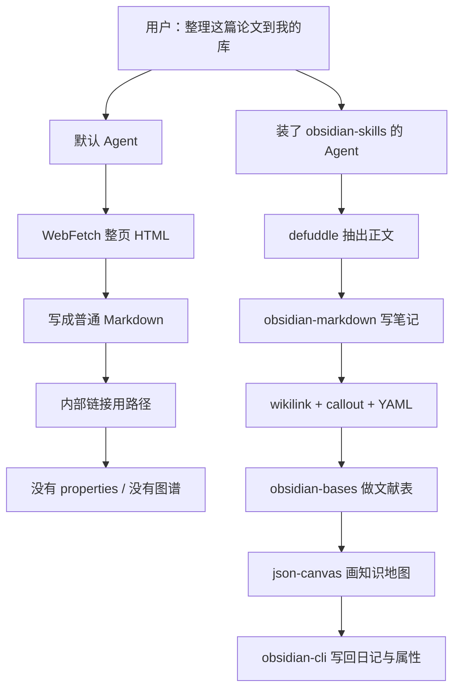

它和 [addyosmani/agent-skills]()、[mattpocock/skills]() 的定位不同：后两者管软件工程流程（规格、TDD、审查）。obsidian-skills 管 **PKM 宿主协议**。可以单独用，也可以垫在工程技能包下面——写代码的那套不变，写库的那套单独生效。

---

## 二、仓库是什么，不是什么

仓库当前提供 **五个技能**，全部遵循 [Agent Skills 规范](https://agentskills.io/specification)，因此 Claude Code、Codex、OpenCode、Cursor 以及任何兼容该规范的 Agent 都能加载，不必改技能正文。

| 技能 | 目标文件 / 工具 | 触发关键词 |
|------|-----------------|------------|
| `obsidian-markdown` | `.md` | wikilink、callout、frontmatter、embed、Obsidian 笔记 |
| `obsidian-bases` | `.base` | Bases、表格视图、卡片、过滤、公式 |
| `json-canvas` | `.canvas` | Canvas、思维导图、流程图、节点和边 |
| `obsidian-cli` | `obsidian` CLI | 读库、搜索、日记、插件热重载、截图 |
| `defuddle` | Defuddle CLI | 网页转 Markdown、剪藏、省 token |

DeepWiki 把架构概括得很准确：技能是 Agent 与 vault 之间的**接口层**。Agent 并不内置 Obsidian 方言；它在任务匹配时加载对应 `SKILL.md`，再按规范生成或修改库内文件。

**它不是：**

- 不是 Obsidian 插件，也不会替换 Dataview / Templater。它教的是 Agent 如何写出 Obsidian 已经认识的开放格式。
- 不是 MCP 服务器。CLI 技能假定本机已安装 [Obsidian CLI](https://help.obsidian.md/cli)，并且 **Obsidian 正在运行**。
- 不会替你设计信息架构。文件夹怎么切、笔记怎么原子化，仍是你的 PKM 决策；技能保证的是格式正确。

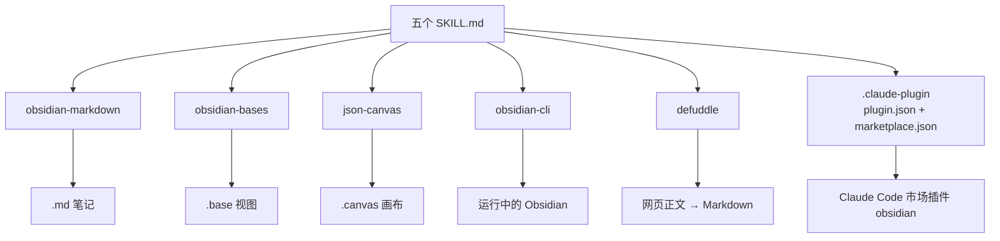

作者是 Steph Ango，插件清单里的名字是 `obsidian`，市场仓库是 `kepano/obsidian-skills`，当前版本 `1.0.1`，许可证 MIT。

---

## 三、系统架构：Agent 如何碰到正确的技能

五个技能按 **progressive disclosure** 工作：启动时只把 `name` + `description` 放进上下文；任务匹配后才加载完整 `SKILL.md`；需要细节时再读 `references/`（例如 Bases 的函数表、Canvas 的完整示例、Markdown 的 callout 清单）。这避免把整份 Obsidian 手册一次性塞进窗口。

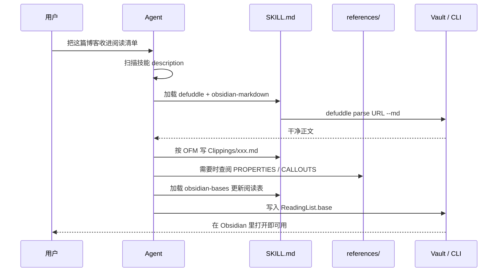

文件落点也有纪律：

| 路径 | 作用 |
|------|------|
| `skills/*/SKILL.md` | 技能正文：何时激活、工作流、校验清单 |
| `skills/*/references/` | 按需加载的完整语法与示例 |
| `.claude-plugin/plugin.json` | Claude 插件元数据（name=`obsidian`） |
| `.claude-plugin/marketplace.json` | 市场注册（name=`obsidian-skills`） |
| `README.md` | 跨平台安装说明 |

DeepWiki 强调：技能遵守同一份规范，所以**改技能文件本身就能适配新 Agent**，不必为 Cursor 再写一份方言。Cursor 扫的是 `.cursor/skills/` 或 `~/.cursor/skills/` 下的 `SKILL.md`；把五个技能文件夹拷过去即可。

---

## 四、入门安装

选一条和你日常 Agent 对齐的路径。vault 既可以是工作区根目录，也可以是 Agent 通过 CLI 操作的“远端”库。

### 4.1 Claude Code 市场（推荐）

```text
/plugin marketplace add kepano/obsidian-skills
/plugin install obsidian@obsidian-skills
```

装好后插件 ID 是 `obsidian`，五个子技能按需加载：`obsidian:obsidian-markdown`、`obsidian:obsidian-bases`、`obsidian:json-canvas`、`obsidian:obsidian-cli`、`obsidian:defuddle`。

### 4.2 npx skills（跨工具）

```bash
npx skills add https://github.com/kepano/obsidian-skills
```

SSH 源：

```bash
npx skills add git@github.com:kepano/obsidian-skills.git
```

这条路径适合已经用 [Skills CLI](https://github.com/vercel-labs/skills) 管理技能库的人，一次安装可分发到多个兼容 Agent。

### 4.3 Claude Code 手动：把技能放进 vault

把仓库内容放到保险库根目录的 `.claude/`（或你用 Claude Code 打开的那个文件夹）。官方 Claude Skills 文档也是这个约定。适合“vault 就是项目”的工作方式：打开库，Agent 立刻认识 OFM。

### 4.4 Codex

把 `skills/` 目录拷到 Codex 技能路径，通常是 `~/.codex/skills`。保持每个技能一个文件夹、内含 `SKILL.md`。

### 4.5 OpenCode

必须克隆**整个仓库**，不要只拷里面的 `skills/`：

```bash
git clone https://github.com/kepano/obsidian-skills.git ~/.opencode/skills/obsidian-skills
```

目标结构是：

```text
~/.opencode/skills/obsidian-skills/skills/<skill-name>/SKILL.md
```

OpenCode 会递归发现所有 `SKILL.md`，不用改 `opencode.json`。重启后生效。

### 4.6 Cursor

Cursor 默认不读 `.claude-plugin/`。把五个技能文件夹放到个人目录或当前 vault 项目里：

```text
~/.cursor/skills/obsidian-markdown/SKILL.md
~/.cursor/skills/obsidian-bases/SKILL.md
~/.cursor/skills/json-canvas/SKILL.md
~/.cursor/skills/obsidian-cli/SKILL.md
~/.cursor/skills/defuddle/SKILL.md
```

以 vault 为工作区、希望团队共享时，用项目级路径：

```text
<vault>/.cursor/skills/obsidian-markdown/SKILL.md
...
```

Windows 示例（PowerShell，在 vault 根目录执行）：

```powershell
git clone --depth 1 https://github.com/kepano/obsidian-skills.git $env:TEMP\obsidian-skills
Copy-Item -Recurse $env:TEMP\obsidian-skills\skills\* .\.cursor\skills\
```

`references/` 要一起拷，Bases 的函数表和 Canvas 示例都在那里。新开一轮 Agent 对话或 Reload Window 后，技能会出现在 Cursor 的 Skills 列表里。需要时也可以用 `/obsidian-markdown` 显式调用。

### 4.7 依赖：Defuddle 与 Obsidian CLI

| 技能 | 额外依赖 | 没有它会怎样 |
|------|----------|--------------|
| `defuddle` | `npm install -g defuddle` | Agent 只能退回 WebFetch，噪声大 |
| `obsidian-cli` | 安装 [Obsidian CLI](https://help.obsidian.md/cli)，且 Obsidian 已打开 | 只能直接改磁盘上的文件，不能热重载插件、截图、eval |
| 其余三个 | 无 | Agent 直接读写 vault 文件即可 |

### 4.8 五分钟确认它生效

不要一上来就丢“重构我整个第二大脑”。用这条提示做冒烟测试（把路径换成你的库）：

```text
在当前 Obsidian vault 新建笔记 Inbox/技能冒烟测试.md。
必须使用 Obsidian Flavored Markdown：YAML properties（tags、status）、
至少一条 [[wikilink]]、一个折叠 callout、一个任务列表。
不要用 [文本](Note.md) 做内部链接。写完列出你用了哪几条 OFM 语法。
```

**生效的信号：** 文件以 `---` frontmatter 开头，内部链接是 `[[...]]`，callout 是 `> [!...]`。

**没生效的信号：** 普通 Markdown 外链、没有 properties、还问你“要不要用 Notion 风格数据库”。这时检查技能是否被发现、工作区是不是 vault 根目录、对话是否新开。

---

## 五、五个技能怎么分工

可以记成一条流水线：**剪藏 → 笔记 → 视图 → 画布 → 库操作**。

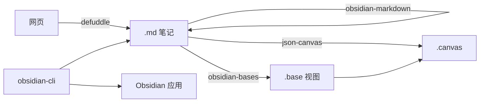

| 你想做的事 | 先激活 | 不要先做 |
|------------|--------|----------|
| 写/改一篇笔记 | `obsidian-markdown` | 不要用标准 MD 链接连内部笔记 |
| 把 URL 变成可读正文 | `defuddle` | 不要对已经是 `.md` 的 URL 用 Defuddle |
| 按标签/属性出表 | `obsidian-bases` | 不要手写 HTML 表格当数据库 |
| 空间化一张图 | `json-canvas` | 不要把流程图只画在 Mermaid 里然后说“这就是 Canvas” |
| 搜库、改属性、热重载插件 | `obsidian-cli` | 不要在 Obsidian 没开的时候狂发 CLI |

下面按难度递进：先会写一篇合格笔记，再剪藏、再出表、再画布，最后用 CLI 把日常动作闭环。

---

## 六、obsidian-markdown：把笔记写成库认识的方言

技能声明只覆盖 **Obsidian 扩展**，默认你已经会 CommonMark / GFM（标题、加粗、列表、代码块、表格）。Agent 的工作流是固定的六步：

1. 顶部写 properties
2. 正文用标准 Markdown 搭结构
3. 库内用 `[[wikilink]]`，外链才用 `[text](url)`
4. 需要引用时用 `![[embed]]`
5. 强调信息用 callout
6. 在阅读视图里确认能渲染

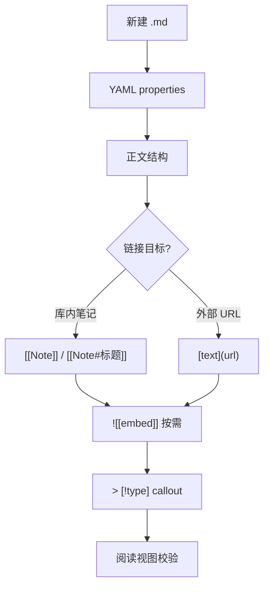

### 6.1 必须记住的语法

内部链接：

```markdown
[[笔记名]]
[[笔记名|显示文本]]
[[笔记名#标题]]
[[笔记名#^block-id]]
[[#本笔记内标题]]
```

块引用要先打锚点。段落末尾写成 `这段话。 ^my-block-id`；列表和引用把 `^id` 单独放在块后面一行。

嵌入（任意 wikilink 前加 `!`）：

```markdown
![[笔记名]]
![[笔记名#标题]]
![[image.png|300]]
![[document.pdf#page=3]]
```

Callout：

```markdown
> [!note]
> 普通说明。

> [!warning] 自定义标题
> 注意截止时间。

> [!faq]-
> 默认折叠。`-` 折叠，`+` 展开。
```

常用类型：`note`、`tip`、`warning`、`info`、`example`、`quote`、`bug`、`danger`、`success`、`failure`、`question`、`abstract`、`todo`。别名例如 `important` → `tip`，`faq` → `question`。

Properties 最小集：

```yaml
---
title: 项目 Alpha
date: 2026-08-18
tags:
  - project
  - active
aliases:
  - Alpha
status: in-progress
---
```

默认属性里，`tags` 可搜索，`aliases` 参与链接建议，`cssclasses` 控制样式。标签也可以写在正文：`#tag`、`#nested/tag`。不能以数字开头。

其它扩展：`==高亮==`、`%%注释%%`、`$行内公式$` 与 `$$块公式$$`、脚注、以及笔记内的 Mermaid。要把 Mermaid 节点链到库内笔记，给节点加 `class NodeName internal-link;`。

### 入门案例 1：把一次会议变成可图谱化的笔记

**场景：** 你刚开完产品会，vault 里已有 `项目/工作流改进.md` 和 `会议/2026-08-10 决策.md`。

**提示词：**

```text
根据下面会议要点，在 会议/2026-08-18 产品同步.md 写一篇 Obsidian 笔记。
要求：YAML（title、date、tags、status）、用 [[wikilink]] 连到
《工作流改进》和《2026-08-10 决策》，关键截止日期用 warning callout，
待办用任务列表，技术复杂度用行内 LaTeX。不要用标准 Markdown 内部链接。

要点：
- 目标：改进工作流，对齐 1 月 30 日里程碑
- 已完成：初始规划
- 待做：后端、前端
- 算法复杂度 O(n log n)，细节见算法笔记的 Sorting 节
```

**合格产物（技能自带完整示例的本地化版本）：**

```markdown
---
title: 2026-08-18 产品同步
date: 2026-08-18
tags:
  - meeting
  - project
status: in-progress
---

# 2026-08-18 产品同步

本次对齐 [[工作流改进]] 的下一阶段，承接 [[2026-08-10 决策#决议]]。

> [!warning] 关键截止日期
> 第一里程碑是 ==2026-08-30==，后端必须可演示。

## 任务

- [x] 初始规划
- [ ] 开发
  - [ ] 后端实现
  - [ ] 前端设计

## 备注

排序算法复杂度为 $O(n \log n)$。细节见 [[算法笔记#Sorting]]。
```

对照检查：有 properties、内部全是 wikilink、callout 类型合法、任务列表可在 Bases 里被 `file.tags` 或自定义 `status` 过滤。

### 入门案例 2：修正一篇“能看但不能链”的旧笔记

把 Agent 当成格式 lint，而不是作家：

```text
阅读 Notes/散乱草稿.md。只做 Obsidian 格式修复：
1. 把内部 [文本](xxx.md) 改成 [[wikilink]]
2. 补 YAML：tags、aliases
3. 把“注意：”段落改成 [!warning] callout
4. 不要改措辞，不要重构结构
```

这能验证技能的“精确修改”：它应当只碰格式，不顺手改文风。若它开始重写全文，在提示里加一句“禁止改除格式外的任何句子”。

---

## 七、defuddle：先把网页变成能进库的正文

`defuddle` 技能的核心判断只有一句：**标准网页用 Defuddle，已经是 `.md` 的 URL 用 WebFetch。** 它调用 [kepano/defuddle](https://github.com/kepano/defuddle)，去掉导航、广告、页脚，再转成 Markdown，专门为省 token 设计。

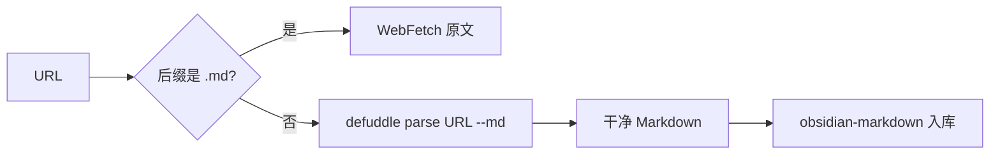

安装：

```bash
npm install -g defuddle
```

常用命令：

```bash
defuddle parse https://example.com/article --md
defuddle parse https://example.com/article --md -o Clippings/article.md
defuddle parse https://example.com/article -p title
defuddle parse https://example.com/article -p description
defuddle parse https://example.com/article -p domain
```

| 参数 | 输出 |
|------|------|
| `--md` | Markdown（默认应选这个） |
| `--json` | 含 HTML 与 Markdown 的 JSON |
| 无格式旗标 | HTML |
| `-p <字段>` | 只要某一项元数据 |

### 入门案例 3：剪藏一篇文档并写成文献笔记

**提示词：**

```text
用 defuddle 抓取 https://agentskills.io/specification ，只要正文 Markdown。
然后在 Clippings/Agent Skills 规范.md 写成 Obsidian 笔记：
- properties：title、source、clipped、tags: [clipping, agent-skills]
- 开头用 [!abstract] 写 5 行以内摘要
- 原文关键术语用 [[wikilink]] 链到尚未创建也可以的概念笔记
- 文末用 quote callout 引用一句原文
不要把导航或页脚写进笔记。
```

Agent 应先跑 `defuddle parse ... --md`，再套 OFM，而不是把整页 HTML 贴进笔记。若它使用 WebFetch，明确说：“按 defuddle 技能，标准网页不要用 WebFetch。”

剪藏类笔记建议统一文件夹 `Clippings/`，用 `source` 属性保存 URL，后面 Bases 才能按来源过滤。

---

## 八、obsidian-bases：让笔记自己排成表

Bases 是 Obsidian 的数据库视图：`.base` 文件是 YAML，**行是符合过滤条件的笔记，列是 properties / 文件元数据 / 公式**。技能的工作流是：建文件 → 定义 `filters` → 可选 `formulas` → 配置 `views` → 校验 YAML → 在 Obsidian 打开确认。

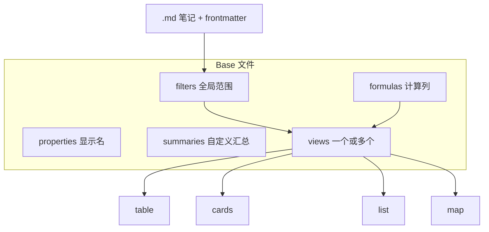

### 8.1 三种属性

| 类型 | 写法 | 例子 |
|------|------|------|
| 笔记属性 | frontmatter 字段 | `status`、`author`、`due` |
| 文件属性 | `file.*` | `file.name`、`file.mtime`、`file.tags`、`file.backlinks` |
| 公式属性 | `formula.名称` | `formula.days_until_due` |

常用文件属性：`file.name`、`file.basename`、`file.path`、`file.folder`、`file.ext`、`file.size`、`file.ctime`、`file.mtime`、`file.tags`、`file.links`、`file.backlinks`、`file.embeds`、`file.properties`。

`this` 的含义随位置变：主内容区指 base 自己；被嵌入时指嵌入它的那篇笔记；侧边栏指当前活动文件。

### 8.2 过滤、公式、视图

过滤器可以是一句字符串，或恰好含一个键的对象：`and` / `or` / `not`，可递归嵌套。

```yaml
filters:
  and:
    - 'status == "active"'
    - not:
        - 'file.hasTag("archived")'
```

公式里最容易踩坑的是 **日期相减得到 Duration，不是数字**。必须先取 `.days` / `.hours` 再 `round`：

```yaml
formulas:
  days_old: '(now() - file.ctime).days'
  days_until_due: 'if(due, (date(due) - today()).days, "")'
```

视图类型：`table`、`cards`、`list`、`map`（地图需要经纬度 + Maps 社区插件）。每张视图可有自己的 `filters`、`order`、`groupBy`、`limit`、`summaries`。

内置汇总：数字用 Average / Min / Max / Sum / Range / Median / Stddev；日期用 Earliest / Latest / Range；布尔用 Checked / Unchecked；任意类型用 Empty / Filled / Unique。

YAML 引号规则：公式里有双引号时，**整段公式用单引号包起来**。

在 Markdown 里嵌入：

```markdown
![[MyBase.base]]
![[MyBase.base#Active Tasks]]
```

### 实战案例 4：任务看板 Base

假设任务笔记都带 `#task`，frontmatter 有 `status`、`priority`、`due`。

**提示词：**

```text
在 Bases/ActiveTasks.base 创建 Obsidian Base。
全局过滤：带 task 标签的 md 文件。
公式：days_until_due、is_overdue、priority_label（1 红 2 黄 其它绿）。
两个 table 视图：Active Tasks（status != done，按 status 分组），Completed。
公式里有字符串时按技能要求用单引号包裹。写完自检 YAML 和 formula.X 是否都已定义。
```

**合格产物：**

```yaml
filters:
  and:
    - file.hasTag("task")
    - 'file.ext == "md"'

formulas:
  days_until_due: 'if(due, (date(due) - today()).days, "")'
  is_overdue: 'if(due, date(due) < today() && status != "done", false)'
  priority_label: 'if(priority == 1, "🔴 High", if(priority == 2, "🟡 Medium", "🟢 Low"))'

properties:
  status:
    displayName: Status
  formula.days_until_due:
    displayName: "Days Until Due"
  formula.priority_label:
    displayName: Priority

views:
  - type: table
    name: "Active Tasks"
    filters:
      and:
        - 'status != "done"'
    order:
      - file.name
      - status
      - formula.priority_label
      - due
      - formula.days_until_due
    groupBy:
      property: status
      direction: ASC
    summaries:
      formula.days_until_due: Average

  - type: table
    name: "Completed"
    filters:
      and:
        - 'status == "done"'
    order:
      - file.name
      - completed_date
```

对应的任务笔记最小形状：

```markdown
---
tags:
  - task
status: doing
priority: 1
due: 2026-08-25
---

# 实现 Bases 技能冒烟测试
```

### 实战案例 5：阅读清单（卡片 + 表格）

技能自带 Reading List 示例，适合剪藏流水线的第二步。

```yaml
filters:
  or:
    - file.hasTag("book")
    - file.hasTag("article")

formulas:
  reading_time: 'if(pages, (pages * 2).toString() + " min", "")'
  status_icon: 'if(status == "reading", "📖", if(status == "done", "✅", "📚"))'
  year_read: 'if(finished_date, date(finished_date).year, "")'

views:
  - type: cards
    name: "Library"
    order:
      - cover
      - file.name
      - author
      - formula.status_icon
    filters:
      not:
        - 'status == "dropped"'

  - type: table
    name: "Reading List"
    filters:
      and:
        - 'status == "to-read"'
    order:
      - file.name
      - author
      - pages
      - formula.reading_time
```

日记索引可以用文件夹 + 文件名正则：

```yaml
filters:
  and:
    - file.inFolder("Daily Notes")
    - '/^\d{4}-\d{2}-\d{2}$/.matches(file.basename)'
```

打开 `.base` 若报 YAML 错，优先查：未加引号的 `:`、公式内外层都用了双引号、`order` 里写了未定义的 `formula.X`。

---

## 九、json-canvas：在无限画布上放节点和边

`.canvas` 遵守 [JSON Canvas 1.0](https://jsoncanvas.org/spec/1.0/)，顶层只有两个数组：

```json
{
  "nodes": [],
  "edges": []
}
```

`nodes` 的数组顺序就是 z-index：先出现的在底下。坐标无限，`x` 向右、`y` 向下，定位点是左上角。ID 必须是 **16 位小写十六进制**，节点和边的 ID 全局唯一。

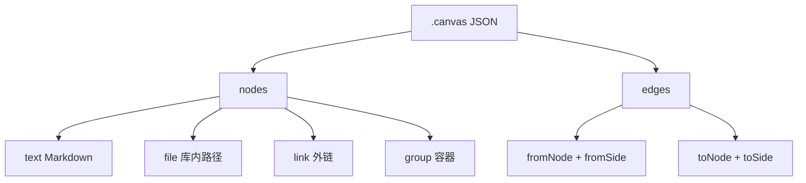

| 节点类型 | 必填除通用字段外 | 用途 |
|----------|------------------|------|
| `text` | `text` | 卡片上的 Markdown |
| `file` | `file`（库内路径） | 预览笔记、PDF、图；可用 `subpath` |
| `link` | `url` | 外部网页预览 |
| `group` | 无（常用 `label`） | 视觉分组，子节点放进边界内 |

通用必填：`id`、`type`、`x`、`y`、`width`、`height`。可选 `color`：预设 `"1"`–`"6"`（红橙黄绿青紫）或 hex。

边：`fromNode` / `toNode` 必须指向已有节点。`fromSide` / `toSide` 为 `top|right|bottom|left`。默认终点有箭头（`toEnd: arrow`），起点无箭头。

布局经验：节点间距 50–100px，组内留 20–50px 边距，对齐到 10/20 的倍数。中等文本卡片约 300–450 × 150–300。

**JSON 换行陷阱：** 文本里要用真正的 `\n`。写成 `\\n` 时，Obsidian 会显示反斜杠和字母 n。

校验清单（每次写完都要过）：

1. 所有 id 唯一
2. 每条边的两端都存在
3. 各类型必填字段齐全
4. `type` / `side` / `end` / `color` 枚举合法
5. JSON 可解析

### 实战案例 6：一张能打开的知识地图

**提示词：**

```text
创建 Canvas/Agent Skills 地图.canvas。
中间一个 text 节点“主概念”，右侧两个支撑点，用边连过去。
ID 用 16 位 hex，节点不要重叠，间距至少 80px。
写完验证：JSON 可解析、边引用的节点都存在。
不要把换行写成 \\n。
```

精简结构如下（ID 可换成随机 16 hex）：

```json
{
  "nodes": [
    {
      "id": "8a9b0c1d2e3f4a5b",
      "type": "text",
      "x": 0,
      "y": 0,
      "width": 300,
      "height": 150,
      "text": "# 主概念\n\nAgent Skills 是按需加载的工作流。"
    },
    {
      "id": "1a2b3c4d5e6f7a8b",
      "type": "text",
      "x": 400,
      "y": -100,
      "width": 250,
      "height": 100,
      "text": "## 格式纪律\n\nOFM / Bases / Canvas"
    },
    {
      "id": "2b3c4d5e6f7a8b9c",
      "type": "text",
      "x": 400,
      "y": 100,
      "width": 250,
      "height": 100,
      "text": "## 剪藏\n\nDefuddle 去噪声"
    }
  ],
  "edges": [
    {
      "id": "3c4d5e6f7a8b9c0d",
      "fromNode": "8a9b0c1d2e3f4a5b",
      "fromSide": "right",
      "toNode": "1a2b3c4d5e6f7a8b",
      "toSide": "left"
    },
    {
      "id": "4d5e6f7a8b9c0d1e",
      "fromNode": "8a9b0c1d2e3f4a5b",
      "fromSide": "right",
      "toNode": "2b3c4d5e6f7a8b9c",
      "toSide": "left"
    }
  ]
}
```

仓库 `references/EXAMPLES.md` 里还有三种可直接改的模板：

- **分组看板：** 三个 `group`（To Do / In Progress / Done）套 text 卡片，无边，颜色 `"1"` / `"3"` / `"4"`
- **研究画布：** 中心 text + `file`（PDF、笔记 `#标题`）+ `link` + 图片，边上加 `supports` / `informs` 标签
- **流程图：** Start → 采集 → Decision，Yes/No 两条边，失败路径绕回；注意回边要把 `fromEnd` 设为 `none`

改已有画布时，流程是：读入 JSON → 按 id 定位 → 改属性 → 新节点避开重叠 → 再跑校验。不要整文件重写，除非用户明确要求重建。

---

## 十、obsidian-cli：让运行中的 Obsidian 听命令

CLI 技能面向**已经打开的 Obsidian**。参数用 `=`，含空格的值加引号；布尔开关没有值。多行内容用 `\n` 和 `\t`。

```bash
obsidian create name="My Note" content="Hello world"
obsidian create name="My Note" silent overwrite
```

文件定位：

- `file=` 像 wikilink：只给名字，不必路径和扩展名
- `path=` 从库根开始的精确路径，例如 `folder/note.md`
- 都不给：操作当前活动文件

库定位：默认最近聚焦的 vault。多库时把 `vault=` 放在最前：

```bash
obsidian vault="My Vault" search query="test"
```

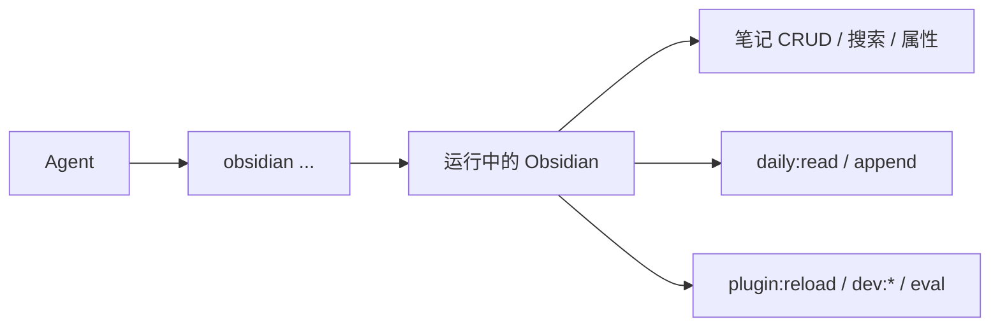

### 10.1 日常库操作

```bash
obsidian read file="My Note"
obsidian create name="New Note" content="# Hello" template="Template" silent
obsidian append file="My Note" content="New line"
obsidian search query="search term" limit=10
obsidian daily:read
obsidian daily:append content="- [ ] New task"
obsidian property:set name="status" value="done" file="My Note"
obsidian tasks daily todo
obsidian tags sort=count counts
obsidian backlinks file="My Note"
```

任意命令可加 `--copy` 把输出拷到剪贴板；`silent` 避免弹出文件；列表命令加 `total` 只要计数。最新命令以 `obsidian help` 为准。

### 实战案例 7：把今日待办写进 Daily Note

前提：Obsidian 已开，Daily Notes 可用。

**提示词：**

```text
用 Obsidian CLI，不要直接改文件：
1. 读取今天的 daily note
2. 追加三条任务：复习 obsidian-markdown、写一个 Base、画一张 Canvas
3. 搜索 vault 里带 tag clipping 的笔记，limit=5
4. 把《技能冒烟测试》的 status 属性设为 done
每一步先给出将要执行的命令，再执行。
```

期望命令序列类似：

```bash
obsidian daily:read
obsidian daily:append content="- [ ] 复习 obsidian-markdown\n- [ ] 写一个 Base\n- [ ] 画一张 Canvas"
obsidian search query="tag:#clipping" limit=5
obsidian property:set name="status" value="done" file="技能冒烟测试"
```

若 CLI 报找不到应用，先手动聚焦一次 vault 窗口，或显式传 `vault=`。

### 实战案例 8：插件热重载闭环

适合在 vault 里开发社区插件或主题的人。技能规定的循环是：改代码 → reload → 看错误 → 截图/DOM → 看 console。

```bash
obsidian plugin:reload id=my-plugin
obsidian dev:errors
obsidian dev:screenshot path=screenshot.png
obsidian dev:dom selector=".workspace-leaf" text
obsidian dev:console level=error
obsidian eval code="app.vault.getFiles().length"
obsidian dev:css selector=".workspace-leaf" prop=background-color
obsidian dev:mobile on
```

**提示词：**

```text
我刚改了插件 my-plugin 的 src/main.ts。
按 obsidian-cli 技能走开发循环：reload → 拉错误 → 若无错误则截图工作区。
不要跳过错误检查。有报错就停下来给我看，不要继续截图。
```

`eval` 能在应用上下文跑 JS，相当于调试后门。只用来探查 `app.vault` 这类只读问题；不要让 Agent 用它批量删除笔记。

---

## 十一、综合实战：一条“研究入库”流水线

把五个技能串起来。目标不是演示语法，而是周末能复用的工作流：**读一篇文章 → 进库 → 进文献表 → 进地图 → 写回日记**。

建议先在 vault 里准备最小骨架（没有就让 Agent 建）：

```text
Clippings/
Notes/
Bases/
Canvas/
Daily Notes/     # 或你现有的日记文件夹
```

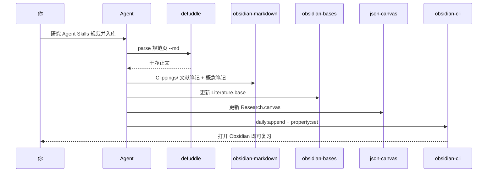

### 11.1 一次性提示词

把下面整段贴进 Claude Code / Cursor Agent（替换 URL 和库名）：

```text
你正在我的 Obsidian vault 中工作。按 kepano/obsidian-skills 执行，不要发明格式。

目标：把 Agent Skills 规范沉淀成可复习的知识模块。

步骤：
1. 用 defuddle（不要 WebFetch）抓取 https://agentskills.io/specification
2. 写成 Clippings/Agent Skills 规范.md
   - YAML：title、source、clipped（今天）、status: to-read、
     tags: [clipping, article, agent-skills]
   - [!abstract] 摘要不超过 8 行
   - 文中概念用 wikilink 链到 Notes/Skill.md、Notes/Progressive Disclosure.md
   - 那两篇概念笔记如果不存在就各写一页 stub（定义 + 来源链接 + todo callout）
3. 创建或更新 Bases/Literature.base：
   - 过滤 tag 为 clipping 或 article 的 md
   - 公式 status_icon
   - cards 视图 Library，table 视图 To Read（status == to-read）
4. 创建 Canvas/Agent Skills 研究.canvas：
   - 中心 text：研究问题
   - file 节点指向刚写的 clipping 和两篇概念笔记
   - 一条 link 节点指向规范 URL
   - 边带 label：supports / defines
   - 校验 JSON 与 ID
5. 若 Obsidian 已打开：daily:append 一行“已入库 Agent Skills 规范”，
   并把 clipping 的 status 保持 to-read（等我读完再改）。
   若 CLI 不可用，跳过并说明原因。

约束：
- 内部链接只用 [[wikilink]]
- Base 公式含双引号时用单引号包裹
- Canvas 换行用 \n，ID 16 位 hex，节点不重叠
- 不要修改与本次研究无关的已有笔记正文
```

### 11.2 验收清单

| 检查 | 通过标准 |
|------|----------|
| 剪藏 | 笔记里没有网站导航残片；有 `source` URL |
| 概念 stub | 两篇 Notes 存在，被 clipping wikilink 指向 |
| Base | Obsidian 打开无 YAML 错误；To Read 能看到新笔记 |
| Canvas | 能打开；四个节点可见；边不是悬空的 |
| 日记 | 当天 daily 多了一条入库记录（CLI 可用时） |

第一次跑通后，把提示词存成自己的技能或 Cursor 命令，例如 `/research-clip`。以后只换 URL 和中心问题。

### 11.3 进阶变体：从“一篇”变成“主题”

同一套流水线可以改成主题研究：

```text
主题：JSON Canvas 1.0
来源：
- https://jsoncanvas.org/spec/1.0/
- 再让 Agent 用 defuddle 抓 1–2 篇相关博文
产物：
- 每篇一篇 clipping
- 一篇 Notes/JSON Canvas.md 作为 MOC（Map of Content），
  用 wikilink + embed 挂上 clipping 和 Literature.base#Library
- Canvas 用 group 分成 Spec / Examples / Open questions
```

MOC 笔记里嵌入 Base 的某一视图，阅读时不用来回跳文件：

```markdown
# JSON Canvas

> [!todo] 未决问题
> 和 Mermaid 的分工：空间编排用 Canvas，线性因果用 Mermaid。

![[Literature.base#Library]]

相关：[[Agent Skills 规范]] · [[Skill]]
```

---

## 十二、和工程技能包怎么叠

obsidian-skills 不管 TDD，也不管 PR 尺寸。推荐叠法：

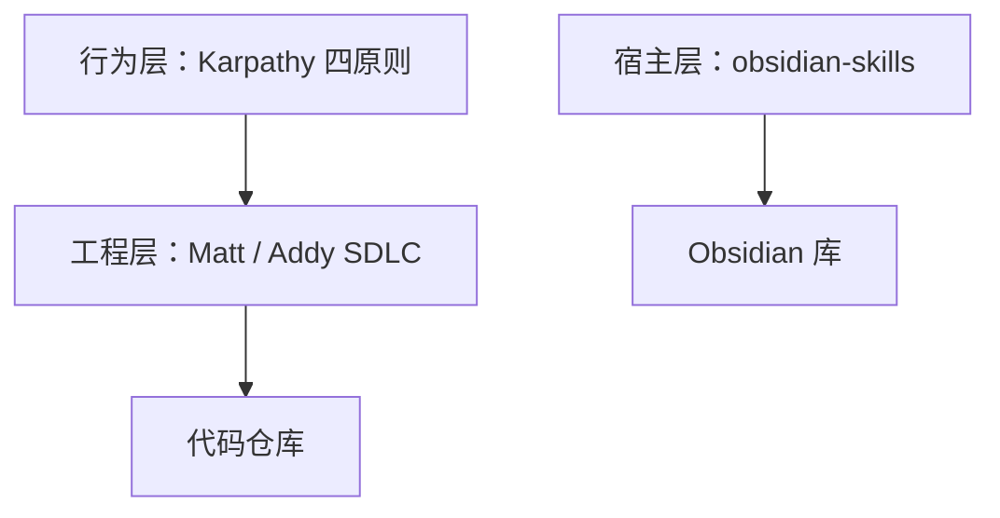

- 在代码仓库里继续用工程技能。
- 打开 vault 工作区时只依赖 obsidian-skills。
- 需要“把设计决策写回第二大脑”时，在工程会话末尾显式说：`用 obsidian-markdown 把结论写入 Notes/xxx.md`。

不要指望一套 SDLC 技能自动写出合法 `.base`——那是另一门方言，需要这五个技能在场。

---

## 十三、常见陷阱与排查

| 现象 | 可能原因 | 处理 |
|------|----------|------|
| 内部链接改名后断裂 | 用了 Markdown 路径链接 | 全部改为 `[[wikilink]]` |
| Base 打开即 YAML 错 | 未加引号的 `:`，或公式内外都是双引号 | 显示名加引号；公式用单引号包双引号 |
| `formula.X` 不显示 | `formulas:` 里没定义 `X` | 先定义再写入 `order` |
| 日期公式报错 | 把 Duration 当 number | `(date(due)-today()).days` 再 round |
| 空属性让公式崩溃 | 没做 `if(due, ..., "")` | 所有可能缺失的字段都守门 |
| Canvas 打不开 | 非法 JSON、重复 ID、边悬空 | 按技能清单校验 |
| 画布文本出现 `\n` 字面量 | 写成了 `\\n` | JSON 字符串里用真正换行转义 |
| Defuddle 把 `.md` URL 洗坏 | 对原始 Markdown 源用了 Defuddle | 技能写明：`.md` 用 WebFetch |
| CLI 无响应 | Obsidian 没开，或聚焦了别的库 | 打开应用；加 `vault=` |
| Cursor 不加载技能 | 文件不在 `.cursor/skills/<name>/SKILL.md` | 五个文件夹平铺，references 一起拷 |
| OpenCode 找不到技能 | 只拷了内层 `skills/` | 克隆整个仓库，保持嵌套路径 |
| Callout 不渲染 | 写成了 `> [note]` 或类型乱造 | 必须 `> [!type]`，类型用文档表 |
| 标签无效 | `#1tag` 或含空格 | 不能以数字开头；层级用 `/` |

技能自己强调的 YAML 反例值得直接贴在团队约定里：

```yaml
# 错误
displayName: Status: Active
formulas:
  label: "if(done, "Yes", "No")"

# 正确
displayName: "Status: Active"
formulas:
  label: 'if(done, "Yes", "No")'
```

---

## 十四、提示词模板与学习路径

第一次不要五个技能一起上。按这条路径加负荷：

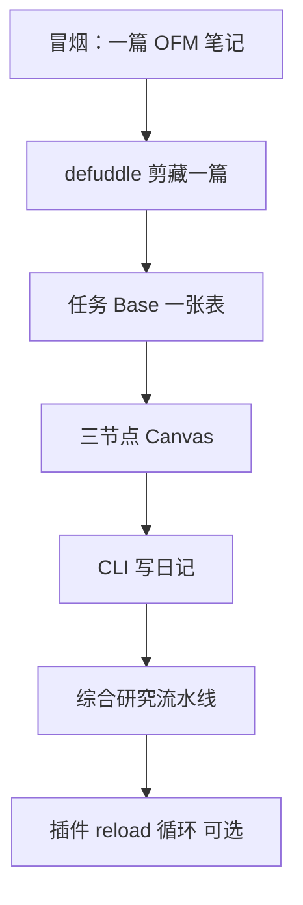

可复用的短提示：

**只写笔记**

```text
用 obsidian-markdown。库内链接必须 [[wikilink]]。先写 YAML。
```

**只剪藏**

```text
用 defuddle parse --md，不要 WebFetch。再按 OFM 入库 Clippings/。
```

**只改 Base**

```text
编辑这个 .base：保持原有视图名，只加一个过滤条件。改完自检 YAML 与公式引用。
```

**只改 Canvas**

```text
读取现有 .canvas，追加一个 text 节点并连到中心节点。ID 不冲突，不重叠，不重写全文。
```

**显式点名技能（Cursor / Claude）**

```text
/obsidian-markdown 把这段会议记录格式化入库
/obsidian-bases 给 #book 做一张 cards 视图
/json-canvas 画这个决策流程
/defuddle 抓这个 URL
/obsidian-cli 追加到今天的 daily note
```

---

## 十五、总结

kepano/obsidian-skills 的价值不是让 Agent “更会做笔记”，而是让它 **不再用错误的文件方言损坏你的库**。五个技能覆盖 Obsidian 开放格式的主路径：

- **obsidian-markdown** 把 wikilink、embed、callout、properties 写成库可以跟踪的结构。
- **obsidian-bases** 用 YAML 视图把已有笔记变成表、卡片和汇总，而不是另建一套数据。
- **json-canvas** 按 spec 写出可校验的节点和边，避免坏 JSON。
- **defuddle** 在正文进入模型之前切掉页面噪声。
- **obsidian-cli** 在应用开着时读写、搜、改属性、热重载插件。

最小可工作集是：安装技能 → 冒烟写一篇 OFM 笔记 → 剪藏一篇文章。Base 和 Canvas 等你真的有一批带 properties 的笔记再上。综合研究流水线是这套技能该有的日常形态：网页进来，笔记、表、图、日记一起更新。

技能文件本身就是规范。遇到新语法，优先读对应 `SKILL.md` 和 `references/`，而不是让模型回忆一年前的 Dataview 查询。格式对了，图谱、重命名、Bases 和 Canvas 才会站在你这边。

---

## 参考资源

- [kepano/obsidian-skills GitHub 仓库](https://github.com/kepano/obsidian-skills)
- [DeepWiki：kepano/obsidian-skills](https://deepwiki.com/kepano/obsidian-skills)
- [Agent Skills 规范](https://agentskills.io/specification)
- [Obsidian Flavored Markdown](https://help.obsidian.md/obsidian-flavored-markdown)
- [Bases 语法](https://help.obsidian.md/bases/syntax)
- [JSON Canvas 1.0](https://jsoncanvas.org/spec/1.0/)
- [Obsidian CLI](https://help.obsidian.md/cli)
- [kepano/defuddle](https://github.com/kepano/defuddle)
- [Steph Ango](https://stephango.com/)
- [Agent Skills 生态系统]()
- [Addy Osmani Agent Skills]()
- [Matt Pocock Skills]()
- [Andrej Karpathy Skills]()
- [DeepWiki 使用指南]()
- [Mermaid 指南]()
- [Claude Code 最佳实践]()
- [OpenCode 完全指南]()
