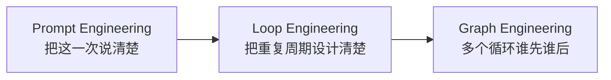
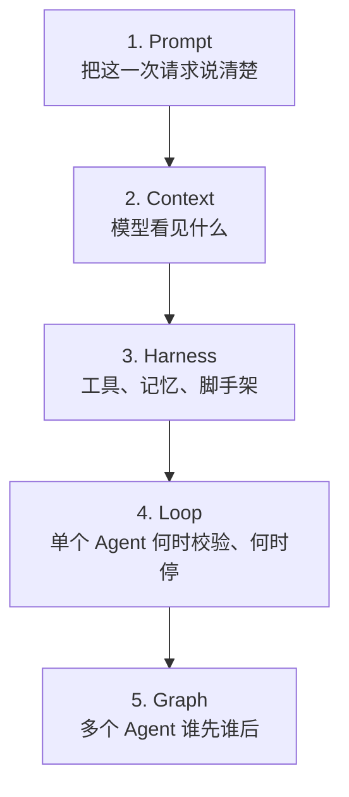
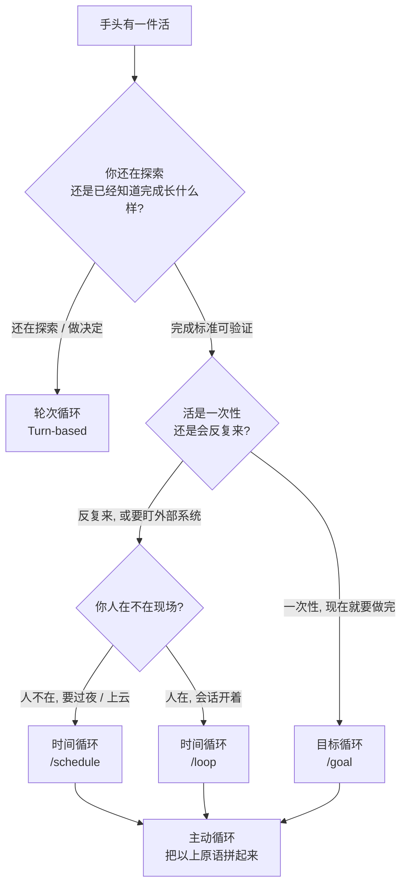
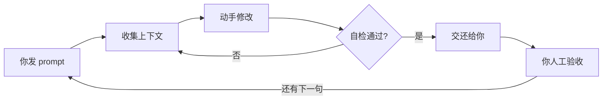
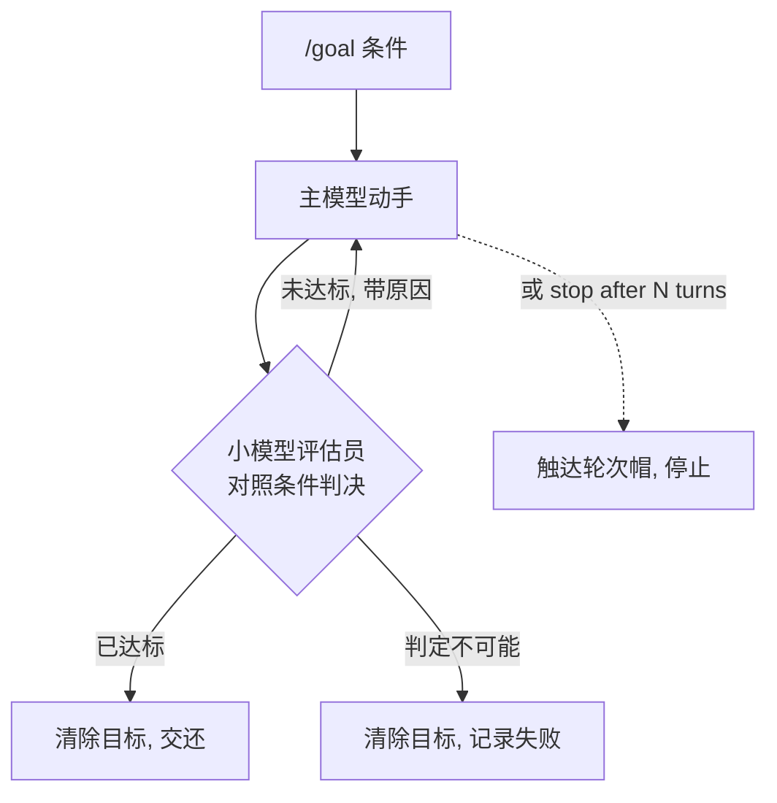
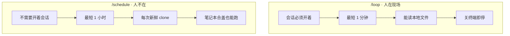
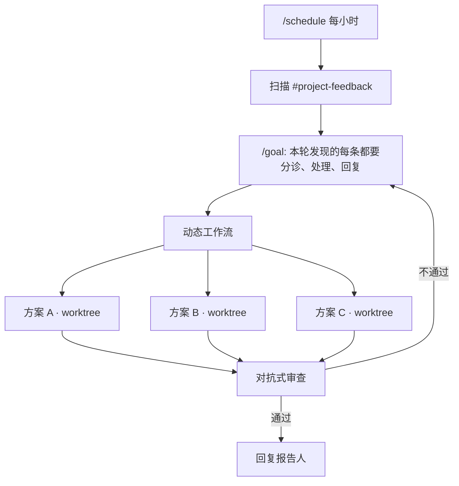
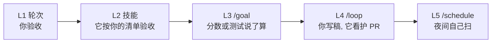
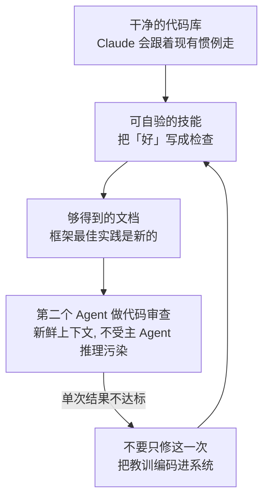

> **Loop Engineering（循环工程）** 是给编码智能体设计「干活 → 检查 → 再干活」的重复周期，直到停止条件成立。你交出去的不再是下一句 prompt，而是校验方式、完成标准、触发时机，甚至整段无人值守的例行任务。

本文依据 Anthropic Claude Code 团队的 [Loop engineering: Getting started with loops](https://claude.com/blog/getting-started-with-loops)，并对照官方文档 [`/goal`](https://code.claude.com/docs/en/goal)、[`/loop`](https://code.claude.com/docs/en/scheduled-tasks) 与 [`/schedule`](https://code.claude.com/docs/en/web-scheduled-tasks) 整理。内容状态截至 **2026 年 8 月**。相关下层请先看本站的 [Harness Engineering]()；循环不够用、要拆成多 Agent 时，再看 [Graph Engineering]()。

---

## 一、先记住这一句

Claude Code 团队给循环下的定义很短：

**循环 = 智能体重复干活，直到停止条件成立。**

X 上「loop engineering」这个词有很多说法。有人把它理解成「少写 prompt、多写 cron」；有人把它理解成「让 Agent 自己给自己派活」。官方口径更窄，也更好用：按 **怎么触发、怎么停、用哪条原语、适合哪类任务** 来分类。

一句话对照：

| 你以前在做的事 | Loop Engineering 改成什么 |
|----------------|---------------------------|
| 每一步都自己写下一句 prompt | 把「检查」交给技能或测试 |
| 凭感觉判断「差不多了」 | 把「完成」写成可验证条件 |
| 自己盯着 CI / 评论 / 队列 | 把「触发」交给时间或事件 |
| 自己当调度员 | 把「整段例行工作」交给主动循环 |

Boris Cherny（Claude Code 作者）有一句流传很广的话：**我不再 prompt Claude 了。我写循环，循环再去 prompt Claude。** 循环工程要做的，就是把这句话落成可复制的设计，而不是口号。



不是所有任务都需要复杂循环。**先用最简单的方案，再按需升级。** 这是全文最重要的约束。

---

## 二、它在五层栈里的位置

每年 AI 工程的杠杆都往模型外面挪一层。Loop 是「单个 Agent 何时检查、何时停止」这一层，夹在 Harness 和 Graph 之间。



| 层级 | 你在工程什么 | 核心问题 | 你交出去的东西 |
|------|-------------|----------|----------------|
| Prompt | 单次请求 | 我问得好吗？ | 措辞 |
| Context | 模型可见信息 | 它有没有该看的材料？ | 文档、代码、历史 |
| Harness | 工具、记忆、约束 | 它能不能动手、会不会记住？ | 环境 |
| **Loop** | **单 Agent 重复周期** | **何时检查、何时停止？** | **校验、目标、触发器** |
| Graph | 多 Agent 协调 | 谁做什么、什么顺序？ | 岗位与交接 |

五层是叠加上去的，不是互相替代。循环里的每一步仍需要一套 Harness（工具、权限、记忆）；图里的每个节点，内部仍是一个 Loop。下层没打牢，上层只是把失败放大。

---

## 三、四种循环，一张图看懂

Claude Code 团队按触发方式和停止条件，把循环分成四类。先看总览，再逐个拆。



官方对照表可以记成「你交出去哪一块」：

| 循环类型 | 你交出去 | 什么时候用 | 伸手去拿 |
|----------|----------|------------|----------|
| 轮次循环 | **检查** | 还在探索或做决定 | 自定义验证技能 |
| 目标循环 | **停止条件** | 你已经知道「完成」长什么样 | `/goal` |
| 时间循环 | **触发器** | 工作在项目外、按时间发生 | `/loop`、`/schedule` |
| 主动循环 | **整段 prompt** | 工作反复出现，且边界清楚 | 以上全部 + 动态工作流 |

三种动词也值得单独记住，社区里最常搞混的就是它们：

| 动词 | 含义 | Claude Code 命令 | 一句话 |
|------|------|------------------|--------|
| Goal | 做到为止 | `/goal` | until done |
| Loop | 我看着，你重复 | `/loop` | while I watch |
| Routine | 我不在，你继续 | `/schedule` | while I am gone |

选错动词的典型事故：把需要你盯着的 `/loop` 丢在关了的终端里；或者把还需要你拍板的活丢给过夜的 `/schedule`。

---

## 四、轮次循环：你仍在方向盘上

- **触发**：你发一条 prompt
- **停止**：Claude 自己判断做完了，或需要更多上下文
- **最适合**：短任务，不属于固定流程或日程
- **控用量**：把 prompt 写具体；把你的人工验收写成技能，减少来回轮次

你发出的每一条 prompt，都在启动一次**手动循环**：Claude 收集上下文、动手、检查、不够就再来一轮，最后把结果交还给你。官方把这个最小周期叫做 **agentic loop（智能体循环）**。



### 4.1 入门案例：给页面加一个点赞按钮

你说：「给首页加一个点赞按钮。」Claude 读代码、改文件、跑测试，交回一个它认为能用的实现。然后**你**去点一下、看控制台、再写下一句 prompt。

这就是最朴素的轮次循环。它没有错，只是「检查」还在你手里。

### 4.2 把人工验收写成技能

循环工程的第一级升级，不是上 `/goal`，而是把你每次都会做的验收步骤写进 `SKILL.md`，让 Claude 自己把活验完再交卷。检查越可量化，它越容易自证。

把下面这份技能放到项目的 `.claude/skills/verify-frontend-change/SKILL.md`（或个人技能目录）：

```markdown
---
name: verify-frontend-change
description: Verify any UI change end-to-end before declaring it done.
---

# 验收前端改动

不要只因为文件改成功了，就声称 UI 改动完成。按人类评审员的方式验收：

1. 启动开发服务器，在浏览器里打开被改过的页面。
2. 直接操作这个改动。对新控件（按钮、输入框、开关）：点一下，确认状态变化，并截下改前 / 改后。
3. 检查浏览器控制台：不能新增 error 或 warning。
4. 用 Chrome DevTools MCP 跑一次性能追踪，审计 Core Web Vitals。

任一步失败，就修复并从第 1 步重跑 —— 不要交回半验证的工作。
```

技能要能落地，得配上让 Claude **看见、量到、摸到**结果的工具：浏览器、测试命令、Lighthouse、CI 日志。没有这些，技能只是一篇更长的 prompt。技能、钩子、子智能体怎么选，见 Anthropic 的 [steering Claude Code](https://code.claude.com/docs) 指南；技能写法也可对照本站的 [Agent Skills 完全指南]()。

轮次循环的质量上限，取决于你有没有把「完成」从主观感受改成可重复的检查。Karpathy 那套「目标驱动执行」说的是同一件事，见 [Andrej Karpathy Skills]()。

---

## 五、目标循环：你交出停止条件

- **触发**：你现在发一条 prompt
- **停止**：目标达成，**或**达到你设的轮次上限
- **最适合**：有可验证退出条件的任务
- **控用量**：写清完成标准，并显式加轮次帽，例如「5 次尝试后停止」

复杂任务往往一轮做不完。智能体在能迭代的时候表现更好。`/goal` 做的事，是把「怎样算做完」写死，这样 Claude 就不必自己决定「够好了」然后提前收工。

每次 Claude 想停下来，都会有一个**独立的评估模型**对照你的条件再判一次，不合格就把它打发回去继续干，直到达标或触达你设的上限。



这一点值得单独强调：**干活的模型不给自己的作业打分。** 评估员默认是会话配置里的小而快模型（Claude API 上一般是 Haiku）。它不跑命令、不读文件，只看对话里已经出现的证据。所以条件必须写成「Claude 自己的输出能证明」的东西——「`test/auth` 里的测试全部通过」有效，因为 Claude 会跑测试，结果会进 transcript。

### 5.1 怎么写一条过硬的条件

官方建议一条能扛很多轮的条件，通常有三块，实战里建议再加第四块「上限」：

| 组成部分 | 作用 | 例子 |
|----------|------|------|
| 一个可度量的终态 | 评估员知道看什么 | 测试结果、构建退出码、文件数量、空队列 |
| 一种陈述过的检查 | Claude 知道怎么证明 | `` `npm test` 退出码为 0 ``、`` `git status` 干净 `` |
| 一路上不能破坏的约束 | 防止「删测试充绿」 | 不改其他测试文件、不改公共 API |
| 轮次或时间上限 | 防止烧钱空转 | `or stop after 5 tries` |

条件最长 4,000 字符。一条会话里同时只能有一个活动目标。

### 5.2 命令速查

```text
/goal all tests in test/auth pass and the lint step is clean
/goal
/goal clear
```

- `/goal <条件>`：立刻按该条件开一轮，无需再发一条 prompt
- 光敲 `/goal`：看当前条件、已跑轮次、token 花销、评估员最近一次理由
- `/goal clear`：中途拆掉目标（`stop` / `off` / `cancel` 都是别名）

无头模式也能跑到结束：

```bash
claude -p "/goal CHANGELOG.md has an entry for every PR merged this week"
```

`/goal` **不改变权限模式**。要让它在你走开时继续跑，需要开 [auto mode](https://code.claude.com/docs/en/auto-mode-config)：auto mode 去掉「每个工具都问你」；`/goal` 去掉「每一轮都问你」。两者互补。

### 5.3 进阶案例 A：首页 Lighthouse ≥ 90

官方示例直接能用：

```text
/goal get the homepage Lighthouse score to 90 or above, stop after 5 tries.
```

为什么这类条件特别有效：分数是确定性的。评估员不用猜「页面是不是更快了一点」，它看 transcript 里那次 Lighthouse 跑分。五次上限把「优化到破产」挡在外面。

把验收写细一点，循环会更稳：

```text
/goal homepage Lighthouse performance score is 90 or above.
Proof: run `npx lighthouse http://localhost:4000 --preset=desktop --chrome-flags=--headless`
and paste the Performance category score.
Do not disable images or remove analytics to game the score.
Stop after 5 tries if the score is still below 90, and report the last score plus the remaining bottlenecks.
```

### 5.4 进阶案例 B：认证模块测试全绿

```text
/goal all tests in test/auth pass and the lint step is clean.
Proof: `npm test -- test/auth` exits 0 and `npm run lint` exits 0.
Do not modify any test file outside test/auth.
Stop after 20 turns.
```

「不许改别的测试文件」是防自我评分的硬约束。没有它，模型有时会删掉失败用例，然后宣称完成。

### 5.5 进阶案例 C：按设计文档实现，直到验收条款成立

```text
/goal implement docs/auth-refresh.md until every acceptance criterion in that doc holds.
After each turn, quote the criterion you just satisfied and the command or screenshot that proves it.
Do not expand scope beyond the doc.
Stop after 20 turns or when all criteria are checked off.
```

适合「你知道完成长什么样，但中间步骤很多」的活：模块迁移、大文件拆分、按标签清空 issue 队列。

---

## 六、时间循环：你交出触发器

- **触发**：指定的时间间隔
- **停止**：你取消，或工作本身做完（PR 合并、队列清空）
- **最适合**：重复性工作，或对接外部系统
- **控用量**：把间隔拉长；能按事件响应就不要按时间空转

有两类工作不适合「做到为止」：

1. **活本身不变，输入一直在变**：每天早上总结 Slack。
2. **外部系统在动，你得定期去看**：PR 收到评审、CI 变红。

这时用 `/loop` 按间隔重跑一条 prompt。`/loop` 跑在你的电脑上，关机就停。要搬到云上，用 `/schedule` 建成 routine。



### 6.1 `/loop`：三种写法

| 你提供什么 | 例子 | 实际行为 |
|------------|------|----------|
| 间隔 + prompt | `/loop 5m check the deploy` | 按固定节奏跑你的 prompt |
| 只有 prompt | `/loop check the deploy` | 间隔由 Claude 自己选（1 分钟到 1 小时） |
| 什么都不给 | `/loop` | 跑内置维护 prompt，或你的 `loop.md` |

固定间隔示例：

```text
/loop 5m check my PR, address review comments, and fix failing CI
```

自调节间隔更省 token：构建还在跑、PR 还热闹时等得短；安静下来就等得长。每一轮结束时会打印「下次等多久、为什么」。

光敲 `/loop` 时，内置维护顺序是：

1. 接着做对话里没做完的事
2. 照看当前分支的 PR：评审意见、失败的 CI、合并冲突
3. 没事可做时，跑一轮清理（找 bug、简化）

它不会自己开新项目；推送、删除这类不可逆动作，只在对话里已经授权过时才会继续。

按 `Esc` 可以清掉下一次唤醒。固定间隔的 loop 会一直跑到你停掉，或满 **7 天**自动过期——这是防止遗忘循环无限烧钱的硬边界。

### 6.2 用 `loop.md` 换成你的默认维护词

Claude 按这个顺序找文件，用找到的第一份：

| 路径 | 作用域 |
|------|--------|
| `.claude/loop.md` | 项目级，优先 |
| `~/.claude/loop.md` | 用户级，给没写项目文件的仓库用 |

文件就是一段普通 Markdown，当成你要打进 `/loop` 的那句话来写。超过 25,000 字节会被截断。改文件后下一轮就生效，循环跑着时也能调。

```markdown
# .claude/loop.md

Check the `release/next` PR. If CI is red, pull the failing job log,
diagnose, and push a minimal fix. If new review comments have arrived,
address each one and resolve the thread. If everything is green and
quiet, say so in one line.
```

### 6.3 `/loop` 与 `/schedule` 怎么选

| | `/loop` | `/schedule`（云端 routine） | 桌面定时任务 |
|--|---------|------------------------------|--------------|
| 跑在哪 | 你的机器 | Anthropic 云 | 你的机器 |
| 要不要开机 | 要 | 不要 | 要 |
| 要不要开着会话 | 要 | 不要 | 不要 |
| 本地文件 | 能访问 | 不能（新鲜 clone） | 能访问 |
| 最短间隔 | 1 分钟 | 1 小时 | 1 分钟 |
| 权限询问 | 继承当前会话 | 自主跑，不问 | 按任务可配 |

现场盯部署、看护当前 PR：用 `/loop`。每天早上分诊、夜间扫 PR、人不在也得跑：用 `/schedule`。既要无人值守、又要碰本地文件：用桌面定时任务。

### 6.4 实战案例 A：看护当前 PR

你开着会话写别的东西，让循环去处理评审和 CI：

```text
/loop 5m check my PR, address review comments, and fix failing CI
```

或让它自己选间隔，CI 安静后少跑几次：

```text
/loop check whether CI passed and address any review comments.
If the PR is merged, stop. If comments are ambiguous, list them for me and do not guess.
```

自调节模式里，Claude 判断活已经做完时，可以自己停循环。固定间隔则必须你来停，或等 7 天过期。

### 6.5 实战案例 B：五分钟仓库维护员

Peter Steinberger 常用的形状：每五分钟做一件**小而可验证**的清理。清什么由模型根据仓库现状决定，而不是写死脚本。

```text
/loop 5m make one small verified repository improvement: a flaky test, a stale comment, a missing type.
One change, one commit, tests green. Never touch anything risky.
If nothing obvious is safe, say so in one line and wait.
```

「一次只改一件、测试必须绿、碰风险就停」是这个循环能在你工作时并行跑的原因。没有这三条，五分钟维护员会变成五分钟破坏员。

### 6.6 实战案例 C：夜间 PR 清扫（`/schedule`）

```text
/schedule every night at 2am: watch my open PRs.
Auto-fix build failures, address review comments in a fresh worktree, and rebase what is stale.
Leave anything ambiguous for me with a short note.
Do not merge.
```

Routine 每次跑都会新鲜 clone，工作在 `claude/` 前缀的分支上。触发可以是 cron（最短 1 小时）、GitHub 事件（开 PR、打标签、发版）或 API。管理用 `/schedule list`、`/schedule update`、`/schedule run`，完整 transcript 在 [claude.ai/code/routines](https://claude.ai/code/routines)。

---

## 七、主动循环：你交出整段例行工作

- **触发**：事件或日程，实时没有人盯着
- **停止**：每一件任务在自己的目标达成时退出；routine 本身一直跑到你关掉
- **最适合**：边界清楚的重复工作流：缺陷报告、issue 分诊、迁移、依赖升级
- **控用量**：例行任务路由到更小、更快的模型；判断题才上最强模型

前面三条原语，加上 auto mode 和动态工作流（research preview），可以拼成一条长时间跑的主动循环。



官方拼装示例：

```text
/schedule every hour: check #project-feedback for bug reports.
/goal: don't stop until every report found this run is triaged, actioned, and responded to.
When fixing a bug, use a workflow to explore three solutions in parallel worktrees
and have a judge adversarially review them.
```

四个零件各自负责一块：

| 零件 | 负责 |
|------|------|
| `/schedule` | 没人盯着时，按时来看一眼 |
| `/goal` + skills | 「做完」长什么样、怎么验收 |
| 动态工作流 | 分诊、修复、审查的多 Agent 编排 |
| Auto mode | 不要每一步都停下来问权限 |

这已经踩在 Graph 的门口：三个 worktree 并行探索、一个审查员对抗打分，就是 [Graph Engineering]() 里的扇出-扇入。主动循环是「循环的极限形态」，不是「一上来就该用的默认形态」。队列形状稳定、验收便宜、误修代价可接受，再上这一级。

---

## 八、从入门到实战：一条可以照着做的升级路径

下面用同一个场景串起来：**你维护一个 Jekyll 博客（比如本站），想让 Claude 少问你、多自己把活做完。** 每一级只多交出一块控制权。



### L1 · 入门：还是你来验收

```text
给文章页加一个「复制引用」按钮：点击后把标题、链接、引用格式写进剪贴板，并显示 2 秒「已复制」。
```

你打开页面点一下，看控制台，再决定下一句。适合你还没想清楚交互细节的时候。

### L2 · 入门加强：验收清单进技能

把第四节那份 `verify-frontend-change` 放进仓库，然后说：

```text
给文章页加「复制引用」按钮。完成前按 verify-frontend-change 技能验收，不要只改文件就交卷。
```

你交出去的是**检查**。循环次数通常会下降，因为 Claude 会自己点、自己截图、自己看控制台。

### L3 · 进阶：把「完成」写成目标

交互已经定了，质量可以用分数说话：

```text
/goal article page Lighthouse performance is 90 or above on desktop,
and the new copy-citation button still works in the browser check.
Proof: paste the Lighthouse Performance score and a screenshot of the
button showing the "copied" state.
Do not remove fonts or images to game the score.
Stop after 5 tries.
```

你交出去的是**停止条件**。评估员看的是跑分和截图，不是 Claude 的自我感觉。

### L4 · 实战：人在现场，循环看护 PR

你把改动开成 PR，自己去写下一篇文章，留一个 loop 看护：

```text
/loop check whether CI passed and address any review comments on the
copy-citation PR. If CI is red, fix the minimal cause and push.
If a comment is about copy or design taste, list it for me — do not guess.
If the PR is merged, stop.
```

你交出去的是**触发器**。会话还开着，出了品味问题会回到你手里。

### L5 · 实战：夜间例行清扫

你已经信任「修 CI、回技术评论、不动文案」这套边界，可以过夜：

```text
/schedule every weekday at 7am: check open PRs in this repo.
Fix failing CI with minimal diffs. Address review comments that have a
clear technical interpretation. Skip anything about tone, design, or
scope. Open a follow-up issue for skipped items instead of guessing.
Do not merge.
```

你交出去的是**整段例行工作**。人味相关的判断，仍然刻意留在循环外面。

四级升级的口诀：**先交出检查，再交出停止条件，再交出触发器，最后才交出整段 prompt。** 跳级的代价是循环在你看不见的地方「好心办坏事」。

---

## 九、循环的输出质量，取决于循环外面的系统

官方写得很干脆：循环产出的质量，取决于它周围的系统。设计时盯这四件事。



1. **代码库本身要干净。** Claude 跟着已经存在的模式走。混乱的仓库会让循环稳定地复制混乱。
2. **给 Claude 自验的办法。** 用技能把「对你和团队来说，好是什么」写下来。
3. **文档要够得着。** 框架和库的文档里有最新实践；循环里该检索就检索，不要靠训练记忆。
4. **用第二个 Agent 做代码审查。** 审查员带着新鲜上下文，不会被主 Agent 的推理带着走。可以用内置 `/code-review`，或 GitHub 上的 Code Review。**写代码的循环，需要检查代码的循环。**

单次结果不达标时，不要停在修这一处。把失败编码进技能、钩子或 `loop.md`，让以后每一次迭代都自动避开。这和 [Harness Engineering]() 的核心句是同一件事：Agent 每犯一次错，你就工程化一回，让它下次不再犯。

独立审查为什么必要：主模型一旦「相信自己做对了」，就倾向于把失败测试删掉、把警告关掉、把验收标准解释宽。第二双眼睛、另一套权重、只读工具，是循环里最值钱的那一段，不是锦上添花。

---

## 十、Token 用量：给循环画边界

循环没有天花板，就会变成 `while (you have tokens): burn them`。官方给的边界都很具体，建议写成检查清单。

| 做法 | 为什么有效 |
|------|------------|
| 选对原语和模型 | 小事不需要多 Agent、多循环；有的活用更便宜、更快的模型就够 |
| 写清成功标准和停止条件 | 具体的「完成」让 Claude 更快到达，也不会太早收工 |
| 大规模跑之前先试点 | 动态工作流可以拉起上百个 Agent；先在一小片工作上估用量 |
| 确定性工作用脚本 | 跑脚本比让模型每次重新推理更便宜。例如 PDF 填表技能附带脚本，而不是每次重写代码 |
| 例行任务别跑得比变化更快 | 间隔匹配「你在看的那个东西」实际变动的频率 |
| 回头看用量 | `/usage` 按技能、子智能体、MCP 拆最近用量；光敲 `/goal` 能看到已用轮次和 token；`/workflows` 能看到每个 Agent 的用量，随时可停 |

模型和 effort 档位，是循环成本最大的两根杠杆。例行分诊、格式转换、日志分类走小模型；架构判断、对抗审查再上最强模型。

再补三条实战里反复救人的约束：

1. **每条 `/goal` 都写轮次帽。** `stop after 5 tries` 不是悲观，是保险丝。
2. **`/loop` 默认会在 7 天后过期**，但 7 天仍然很长。现场看护用完就 `Esc`。
3. **`/schedule` 最短 1 小时。** 不要为了「更实时」去空转；CI 失败这类事件，用 GitHub 触发或 Channels 推送，比每小时轮询更准、更便宜。

---

## 十一、怎么开始

回到官方那张表，问自己手头正在做的事，你能交出哪一块：

| 循环 | 你交出去 | 用它，当…… | 伸手去拿 |
|------|----------|------------|----------|
| 轮次 | 检查 | 你还在探索或做决定 | 自定义验证技能 |
| 目标 | 停止条件 | 你知道完成长什么样 | `/goal` |
| 时间 | 触发器 | 工作在项目外、按时间发生 | `/loop`、`/schedule` |
| 主动 | 整段 prompt | 工作反复出现且边界清楚 | 以上全部 + 动态工作流 |

起步方法也很具体：看你已经在做的工作，挑一件**你自己是瓶颈**的任务，问能交出哪一块——

- 验收步骤能写成技能吗？
- 目标够清楚、能让评估员判决吗？
- 这活是按时间到来的吗？

有了想法就跑起来，观察它在哪里卡住、哪里越权，然后改循环本身。不要怕迭代循环——循环工程的对象就是循环，不是单次回答。

今晚只做三件事就够构成一套最小循环栈：

1. 给一个前端改动配上验证技能（交出检查）
2. 用 `/goal` 把「测试全绿」跑到停（交出停止条件）
3. 开着会话 `/loop` 看护当前 PR（交出触发器）

三件都稳了，再把第三条升级成 `/schedule`。

更多官方材料：并行跑 Agent、[`/loop`](https://code.claude.com/docs/en/scheduled-tasks)、[`/schedule`](https://code.claude.com/docs/en/web-scheduled-tasks)、[`/goal`](https://code.claude.com/docs/en/goal)、动态工作流，以及用技能做[可重复的验证循环](https://code.claude.com/docs)。本站相关阅读：[Harness Engineering]()、[智能体设计模式]()、[Graph Engineering]()、[Ralph]()（更早的「做到为止」循环形态）。

---

## 参考资料

- Delba de Oliveira, Michael Segner, [Loop engineering: Getting started with loops](https://claude.com/blog/getting-started-with-loops), Claude Blog, 2026-06-30
- Claude Code 文档：[Keep Claude working toward a goal (`/goal`)](https://code.claude.com/docs/en/goal)
- Claude Code 文档：[Run prompts on a schedule (`/loop`)](https://code.claude.com/docs/en/scheduled-tasks)
- Claude Code 文档：[Scheduled routines (`/schedule`)](https://code.claude.com/docs/en/web-scheduled-tasks)
- Anthropic, [Building Effective Agents](https://www.anthropic.com/engineering/building-effective-agents)
