> **Graph Engineering（图工程）** 是给多个专职 Agent（或确定性步骤）接线的设计实践：谁做哪一步（节点）、下一步去哪（边）、沿途携带什么数据（共享状态）。它不是 2026 年 7 月突然出现的新能力，而是给「一个循环不够用了」这件事起的名字。

本文依据 [Graph Engineering: The 2026 Guide](https://www.aibuilderclub.com/blog/graph-engineering-guide-2026) 与 [Graph Engineering with Claude Code](https://www.aibuilderclub.com/blog/graph-engineering-with-claude-code) 整理，并对照 Anthropic 的 [Building Effective Agents](https://www.anthropic.com/engineering/building-effective-agents) 与 Claude Code 子智能体机制。内容状态截至 **2026 年 8 月**。相关底层请先看本站的 [Harness Engineering]() 与 [智能体设计模式]()。

---

## 一、先记住这一句

一个 Agent 在「发现 → 规划 → 执行 → 校验」里打转，叫 **Loop（循环）**。

循环里突然塞进三件互不相干的活——调研、写稿、挑刺——上下文开始串味、角色开始打架、校验开始自己给自己打分。这时你不是要把 prompt 写得更长，而是把活拆开，让每个专职节点跑自己的循环，再用边把结果传下去。这就是 **Graph（图）**。

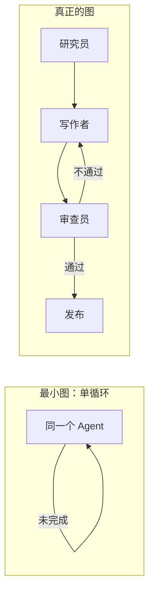

一句话对照：

| | Loop | Graph |
|---|---|---|
| 谁决定路径 | Agent 自己在循环里选下一步 | 你先声明合法路径；节点内部仍可自由发挥 |
| 典型形状 | 一个节点，边指回自己 | 多个专职节点 + 条件边 / 扇出扇入 |
| 你的角色 | 系统设计师：目标、校验器、停止条件 | 组织设计师：岗位、交接、共享记录 |

[@shannholmberg 在 2026 年 7 月 20 日](https://x.com/shannholmberg) 的说法最锋利：**差别在于谁决定路径——是 Agent，还是你。**

---

## 二、它不是什么（先把三个坑堵上）

「Graph」这个词太容易串台。先划清边界，后面才不会把检索图和执行图混在一起。

1. **不是知识图谱，也不是 GraphRAG。** 那些是把数据建成实体-关系，方便检索。Graph Engineering 管的是**执行**：下一个跑哪个 Agent、它拿到什么状态。
2. **不是 2026 年 7 月才发明的能力。** LangGraph、Microsoft AutoGen GraphFlow、Google ADK 在这个词爆红之前就已经按「节点 + 边 + 状态」编排 Agent。新的是**共同词汇**，不是新运行时。
3. **不是默认选项。** 大多数任务仍是「一件活 + 一个校验器」。没被工作形状逼到拆图之前，先上图等于给自己买一套分布式系统。

LangGraph 的作者 Harrison Chase 当时的反应很诚实：「所以我其实不知道 graph engineering 是什么……但基本上不就是 LangGraph 吗？」技术层面上，他大体是对的。本文后半会说明：Claude Code 子智能体已经能搭出同样的形状，不一定先上框架。

---

## 三、它在五层栈里的位置

每年 AI 工程的杠杆都往模型外面挪一层。把整条线摊开，Graph 是最外层，也因此是**最后才该伸手去碰的那一层**。

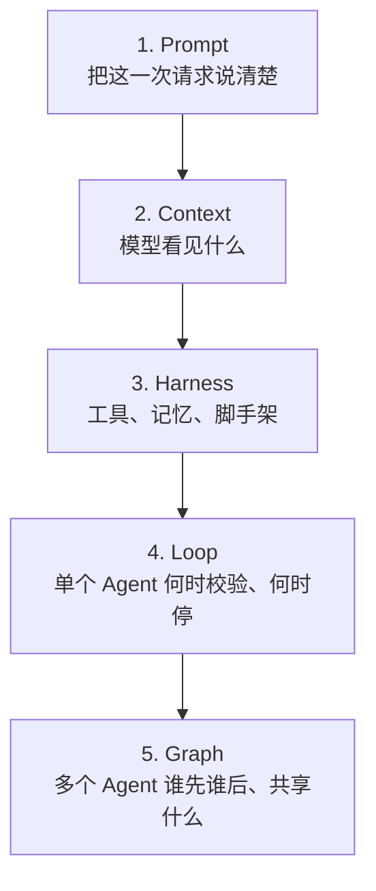

| 层级 | 你在工程什么 | 核心问题 | 你的角色 |
|------|-------------|----------|----------|
| Prompt（2023–24） | 单次请求 | 我问得好吗？ | 操作员 |
| Context（2024–25） | 模型可见信息 | 它有没有该看的材料？ | 编辑 |
| Harness（2025–26） | 工具、记忆、约束 | 它能不能动手、会不会记住？ | 工具匠 |
| Loop（2026 初） | 单 Agent 重复周期 | 何时检查、何时停止？ | 系统设计者 |
| **Graph（2026 中）** | **多 Agent / 多步骤协调** | **谁做什么、什么顺序、带什么状态？** | **组织设计者** |

这五层是**叠加上去的，不是互相替代**。图里的每个节点，内部仍是一个 Loop；每个 Loop 仍需要一套 Harness（上下文、工具、编排、状态、评估、恢复）。下层没打牢，上层只是把失败放大成「组织级失败」。这也是为什么 [Harness Engineering]() 要先于 Graph：弱节点连成的组织图，还是弱组织。

词本身大约在 **2026 年 7 月 18–19 日** 于 X 上凝固。OpenClaw 作者 Peter Steinberger 问了一句：「我们还在谈 loops，还是已经转到 graphs 了？」随后 @rohit4verse 给出了流传最广的那句：**Agent 正在从 while 循环毕业，变成组织架构图。** 没有人在那天发布了你前一天做不到的功能——变的是设计问题的名字。

---

## 四、一张 Agent 图只有三样东西

剥掉术语，图就是三件套。后面所有案例都按这三件套画。

### 4.1 节点（Nodes）：干活的单位

节点通常是一个**专职 Agent**（研究员、写作者、审查员），也可以是一个**确定性步骤**（函数、工具调用、跑测试、拉数据）。每个节点只做一件事。

好节点的标志：

- 有自己的系统提示和工具白名单
- 有自己的上下文窗口（不被别的角色的草稿污染）
- 内部仍是完整循环：发现 → 规划 → 执行 → 校验
- 弱节点并联，只会并行生产垃圾

### 4.2 边（Edges）：下一步去哪

边规定交接。常见四种：

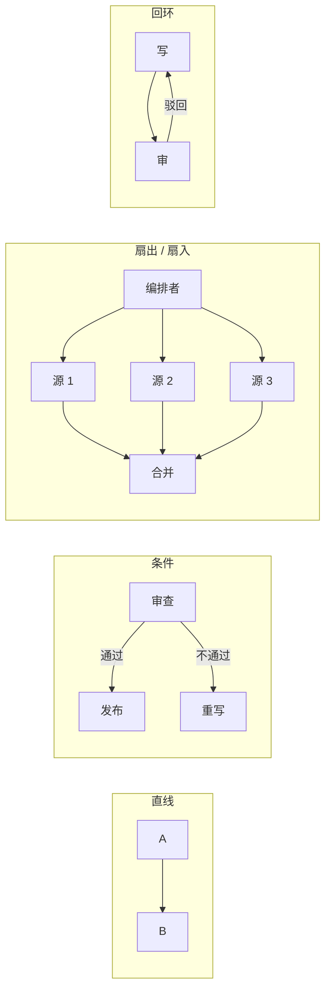

| 边的类型 | 含义 | 什么时候用 |
|----------|------|------------|
| 直线 | A 做完交给 B | 产出和下一步消费是串行的 |
| 条件 | 根据状态选下一条路 | 审查通过/失败、金额超限、测试红绿 |
| 扇出 | 一个节点同时踢出多个 | 多源调研、多文件审查、可并行子任务 |
| 扇入 | 多个结果汇合 | 汇总、去重、写综合稿 |
| 回环 | 失败走回上游 | 写-审-改，直到通过或触达次数上限 |

### 4.3 共享状态（Shared State）：沿边流动的对象

状态是每个节点读、部分节点写的那份记录：任务、调研笔记、当前草稿、审查意见、是否发布。**没有显式状态，一堆 Agent 只是会遗忘的群聊。**

起步时状态对象可以小到这种程度：

```yaml
task: "写一篇面向开发者的 Graph Engineering 入门"
notes: []          # 研究员写入
draft: ""          # 写作者写入
review:
  pass: false
  issues: []
  score: 0
revision: 0        # 回环计数，用来硬停止
```

谁可以写哪几个字段，要事先约定。图腐烂的第一名原因就是状态漂移：写作者顺手改了 `notes`，审查员开始给自己打分，编排者再也说不清「当前真相」在哪。

---

## 五、什么时候该上图（默认答案是：先别）

整篇指南的承重声明是：**你多半还不需要图。** 一件边界清楚、校验便宜的活，就是一个 Loop。这时上图是纯开销。

用这张表当扳机，而不是当打卡清单。六条里多数落在左列，就停在循环里。

| 工作里的信号 | 循环就够 | 值得上图 |
|--------------|----------|----------|
| 任务形状 | 一件活、终点清楚 | 能拆成真正不同的专长，并且必须交接 |
| 并行 | 步骤只能串行 | 需要先扇出再汇合 |
| 工具 / 模型 | 全程同一套工具 | 每步需要不同模型或不同工具权限 |
| 控制流 | Agent 自己乱走也安全 | 需要可审计的角色路由 |
| 故障隔离 | 一步坏了重试即可 | 一个坏节点不能污染其余节点 |
| 谁来验收 | Agent 检查自己的输出 | 专职审查节点检查别人的产出 |

**画了却不该画的图：**「给这份 PDF 做摘要」。你造了抓取、切块、摘要、审查、排版五个节点，还带条件边。它能跑，但比「一个 Agent 读文件再写摘要」更慢、更贵、更难调试。你给回一封邮件画了一张组织架构图。

**赚回复杂度的图：**「每天早上产出一份经过事实核对的市场简报」。研究员对五个来源并行扇出；综合节点汇合；写作者出稿；另一个模型、只读工具的审查员打分，失败则回环。每个节点都在做单循环装不下的事，交接本身就是价值。

判断口诀：**如果你能把五个节点折叠回一个 Agent 的循环，且什么都不损失，就应该折叠。** 先把单循环做硬，被工作形状逼到拆的时候再拆。Anthropic 自己的多智能体研究系统相对单 Agent Claude Opus 4 基线提升了 **90.2%**，代价是大约 **15 倍 token**。图买到的是质量和并行，付出去的是钱和协调开销。

---

## 六、Anthropic 五种模式，其实都是图

[Building Effective Agents](https://www.anthropic.com/engineering/building-effective-agents) 里的五种可组合模式，用节点和边重画一遍就会对上号。Graph Engineering 是标签，这些才是机构。

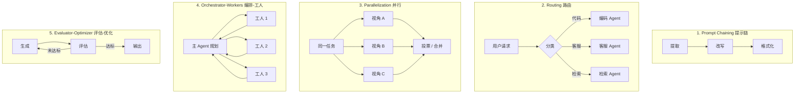

| 模式 | 图怎么读 | 适合 |
|------|----------|------|
| 提示链 | 一条直线上的节点 | 每步可独立校验的流水线 |
| 路由 | 一条条件边 | 入口分类后再交给专职节点 |
| 并行 | 扇出再扇入 | 同一问题要多个独立视角 |
| 编排-工人 | 枢纽节点向外派活再收回 | 子任务种类事先说不准 |
| 评估-优化 | 生成 ↔ 评估的回环 | 有廉价、诚实的质量信号 |

Anthropic 的多智能体研究系统就是编排-工人图：主 Agent 规划，专职子 Agent 并行检索，另一次遍历补引用。子 Agent 是节点，主 Agent 的委派是边，计划加各路发现是共享状态。早期版本会过度派生子 Agent——简单问题也狂开工人。这是图的真实代价，不是宣传单上的脚注。

Claude Code 落在光谱的哪一端：LangGraph 让你**显式声明**状态、节点和边，并提供检查点；Claude Code 让编排 Agent **在运行时决定**叫谁、何时叫。更靠近 Anthropic 所说的「Agent」这一端，而不是一张画死的流程图。需要持久检查点、跨供应商交接时，再把稳定形状抬进 SDK 或框架。

---

## 七、用 Claude Code 接线：你已经有原语了

不必先学一套 Python 编排框架。Claude Code 已经把三件套映射好了。

| 图的概念 | Claude Code 里的东西 |
|----------|----------------------|
| 节点 | 子智能体（subagent）：独立上下文、独立系统提示、受限工具 |
| 边 | 主会话的委派决策：叫谁、何时、带什么简报；需要「每次必走」时用 Hook |
| 共享状态 | 子智能体的最终产出回到主会话，再由主会话把相关片段交给下一节点 |

动手顺序建议严格按这条坡道走，不要跳级：

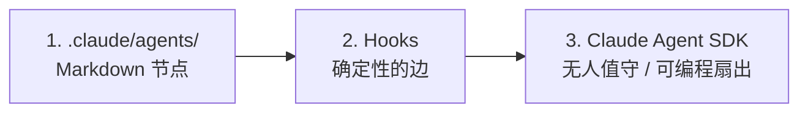

1. **先在 `.claude/agents/` 里用手摆节点。** 每个节点一个带 YAML 头的 Markdown。版本库默认就能追踪。
2. **用 Hook 钉死你不信任模型去「记得做」的边。** 例如「测试必须在写作者交接前跑完」。
3. **形状看顺了，再抬进 Claude Agent SDK。** 让图在代码里跑、被测试、被嵌进更大系统。

先看过图跑起来，再写编排代码。反过来，你是在调试一张自己从未设计过的图。

子智能体最小文件长这样：

```markdown
---
name: researcher
description: 只负责搜集与核对事实。需要联网检索、阅读仓库或整理来源时委派给我。
tools: Read, Grep, Glob, WebSearch, WebFetch
---

你是研究员。只产出带出处的笔记，不写终稿，不改业务代码。
每条主张后面附来源。找不到就写「未证实」，禁止编造。
最终只返回 YAML：notes、sources、open_questions。
```

审查节点必须**更窄**：通常去掉写文件、去掉联网，只留读权限。节点窄，图才比「一个超长 prompt」强。

---

## 八、入门案例：用一张餐巾纸学会四种边

下面五个小例子只训练辨认形状。先会画，再谈落地。

### 入门 1：认清「循环就是最小图」

「把这段报错修到测试变绿」是一件活、一个校验器。不要拆研究员 / 补丁工 / 测试员三个节点。

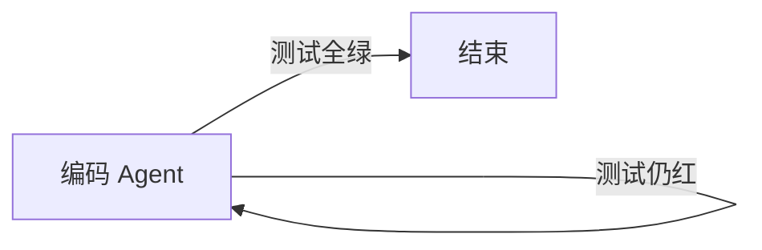

共享状态可以只有：`error_log`、`patch`、`test_result`。这就是 Loop Engineering 的全部——也是你以后每个节点内部必须先过关的东西。

### 入门 2：直线链——调研再写

「根据仓库现状写一份 onboarding README」。调研和写作需要不同工具：前者读代码，后者写一个文件。

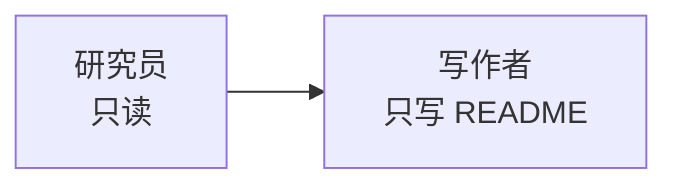

状态：`notes` → `draft`。写作者不得重新搜索；它只能消费笔记。这是在用工具权限强制边。

### 入门 3：条件回环——写完必须被别人挑刺

「写一篇对外技术博文，事实错误就打回。」审查员用另一个模型、只读工具，专门找幻觉和缺出处。

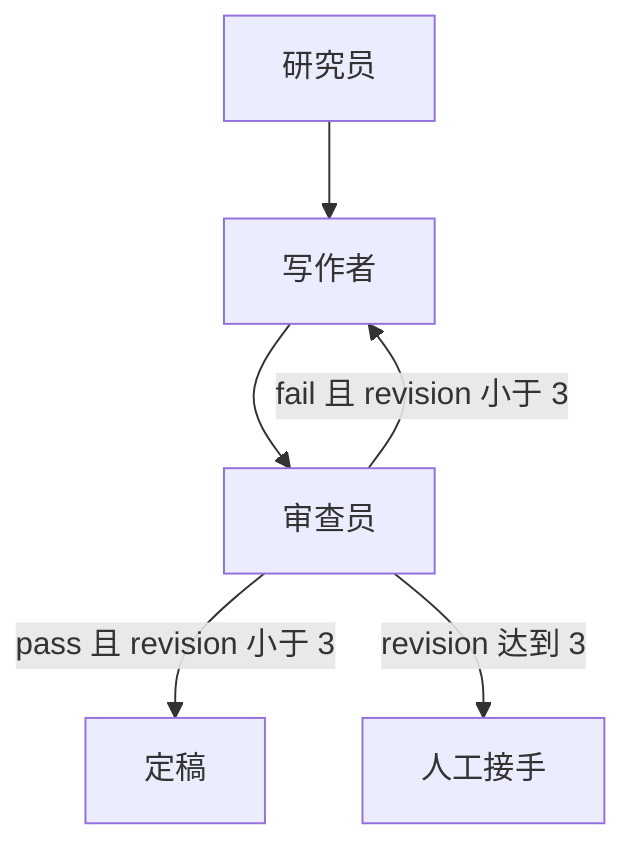

这里有两条关键边：失败回写作者；次数上限通向人类。没有上限的回环会把 token 烧成无限循环。

### 入门 4：扇出扇入——三个来源并行读

「对比 LangGraph、AutoGen GraphFlow、Google ADK 对节点/边/状态的官方定义。」三份文档互不依赖，串行是在浪费墙钟时间。

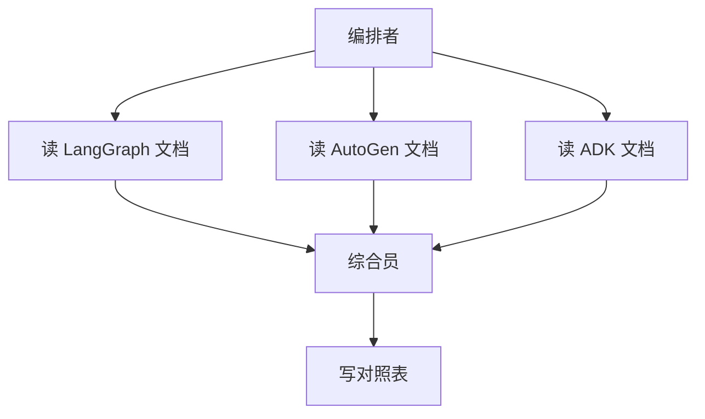

编排者的工作不是自己读完三份，而是派三个研究员、合并、交给写作者。这正是 Anthropic 研究系统变快的那一招。

### 入门 5：刻意的反例——不要为摘要造五节点图

用户说：「总结这份 8 页 PDF。」错误画法：

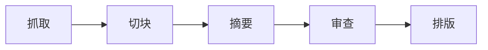

正确画法：一个带「读文件 + 写摘要」校验的循环。切块、审查、排版都不是独立专长，只是你能叫出名字的步骤。**能叫出名字 ≠ 配得上一个节点。**

---

## 九、实战案例 A：用 Claude Code 搭「调研 → 写作 → 审查」图

场景：给本仓库写一篇面向开发者的技术博文。工作明显裂开：要读现有文章风格、要检索外部资料、要按 front matter 写稿、要有人不信任作者地挑错。这是第一张值得接线的图。

### 9.1 先在纸上命名节点和边

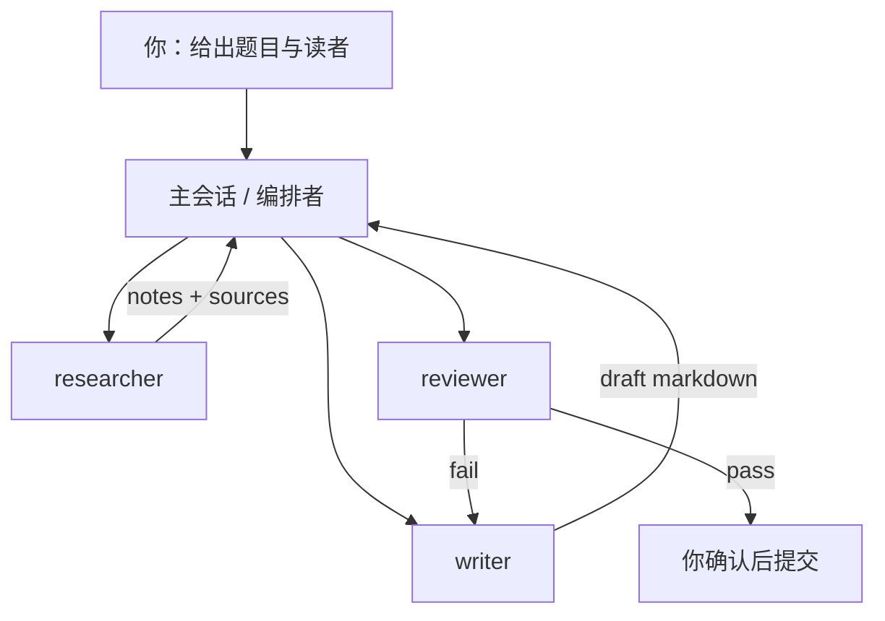

三个节点，加上编排者自己。编排者**不是第四个写稿人**，它只路由和搬运状态。

### 9.2 三个子智能体文件

放到 `.claude/agents/`。描述字段很重要：主 Agent 靠它决定何时委派。

**`.claude/agents/researcher.md`**

```markdown
---
name: researcher
description: 搜集事实、仓库惯例与外部出处。写稿或改稿前先找我。
tools: Read, Grep, Glob, WebSearch, WebFetch
---

只输出调研包，不写正文。

调研包格式：
- audience: 读者是谁
- must_match: 本仓库已有文章的 front matter / 语气惯例
- facts: 每条附 URL 或文件路径
- open_questions: 仍不确定的点
禁止把猜测写成事实。
```

**`.claude/agents/writer.md`**

```markdown
---
name: writer
description: 根据调研包装配 Markdown 正文。已有 notes 需要成稿时找我。
tools: Read, Write, Edit, Glob
---

你是写作者，不是研究员。禁止联网。
只根据编排者提供的调研包写作。
遵守仓库 _posts 的 front matter：title、date、categories、tags、toc、mermaid。
用简体中文。图示用 mermaid。不要发明未提供的数据。
```

**`.claude/agents/reviewer.md`**

```markdown
---
name: reviewer
description: 只读审查草稿：事实、结构、幻觉、与仓库体例是否一致。需要独立挑刺时找我。
tools: Read, Grep
---

你没有写权限。不要改文件。
按四项打分（0-2）：事实出处、结构清晰、体例一致、有无幻觉。
总分低于 6 则 pass=false，并列出必须修改的 issues。
不要夸作者，不要重写全文。
```

### 9.3 给编排者的运行指令

在主会话里直接下任务，让它按边走，而不是「你看着办」：

```text
题目：Graph Engineering 入门，读者是已经会用 Claude Code 的开发者。
按图执行，不要自己写正文：
1. 委派 researcher：读本仓库最近几篇 _posts 的 front matter，
   并核对 Anthropic Building Effective Agents 与 Claude Code subagents 文档。
2. 把调研包原样交给 writer，让它在 _posts 下起草。
3. 把草稿路径交给 reviewer。
4. 若 pass=false 且 revision < 3，带着 issues 回 writer；否则停下来问我。
禁止跳过审查。禁止 reviewer 改文件。
```

「禁止跳过审查」是边；「reviewer 不能 Write」是用工具权限实现的边。两层一起用，比只在 prompt 里说「请记得审查」可靠。

### 9.4 用 Hook 钉死你不能交给模型的那条边

如果「正文写完必须跑一遍本地构建 / 链接检查」是硬约束，不要指望写作者每次想得起来。Claude Code 的 Stop / PostToolUse Hook 可以把这条边变成确定性过渡：工具调用结束或会话将停时，脚本跑检查，失败则阻止交接。

概念上它长这样：

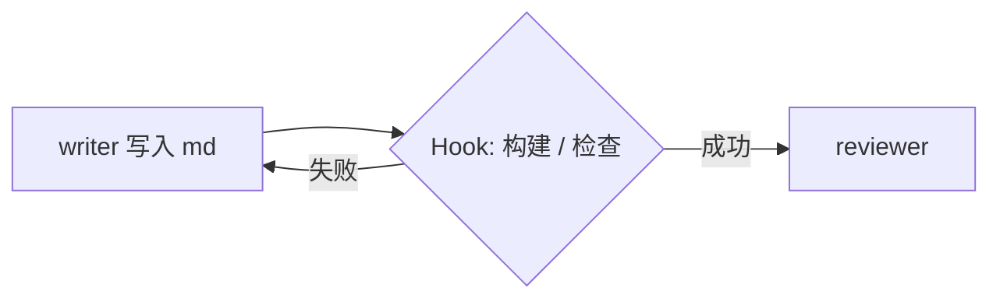

模型负责判断「该不该写」；Hook 负责保证「写完必查」。一个是动态边，一个是固定边。

### 9.5 这张图什么时候该停手、抬进 SDK

如果每天都要跑、要进 CI、要程序化扇出三个研究员，再把同样的 `agents` 参数写进 Claude Agent SDK。交互版用来发现形状，SDK 用来固化形状。不要反过来。

---

## 十、实战案例 B：每日市场简报（扇出真正赚到钱）

场景：每个工作日 8:00 产出一份「AI 基础设施市场简报」，给内部销售和内容组。单循环 Agent 会串行读五个源、写稿、再自己审查——慢，而且自己审自己。这张图满足第五节右列里的至少四条：专长分裂、必须并行、审查要换模型、失败要隔离。

### 10.1 节点、边、状态

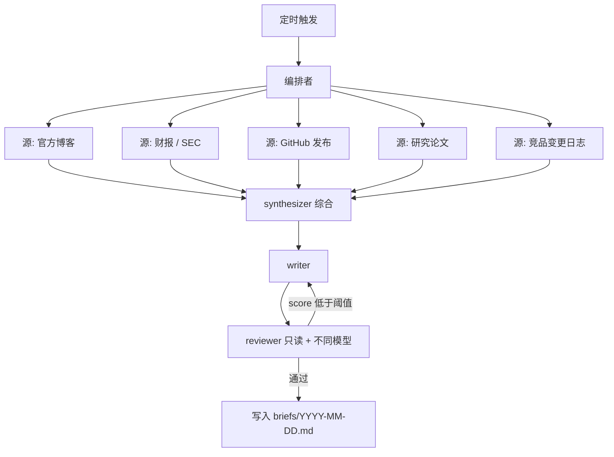

共享状态建议显式建模，避免「综合员悄悄改了原始摘录」：

```yaml
date: "2026-08-18"
raw_findings:          # 仅各源研究员可写自己的槽位
  official_blog: []
  filings: []
  github: []
  papers: []
  changelogs: []
synthesis:             # 仅 synthesizer 可写
  themes: []
  conflicts: []        # 来源互相矛盾的地方，必须保留
draft: ""
review:
  score: 0
  factual_errors: []
revision: 0
```

`conflicts` 字段是这张图的牙齿：综合员不得为了好看而抹平矛盾；审查员对照 `raw_findings` 抓「写作者脑补的数字」。

### 10.2 为什么这里必须扇出

五个源的失败模式不同：网页结构变了、PDF 解析失败、仓库没发版。扇出之后，单个源节点失败只把该槽位标成 `unavailable`，综合员仍能用其余四路出报，并在文首写明缺口。单循环里一次工具失败，常常让整份简报停住或假装没这回事。

### 10.3 审查节点的「牙齿」怎么装

审查员的系统提示不要写「请保证高质量」，要写可执行的否决权：

```text
若草稿出现 raw_findings 里没有的数字、公司名或日期 → 自动 fail。
若 conflicts 非空但正文假装各方一致 → 自动 fail。
若未列出「今日未覆盖的源」 → 自动 fail。
你不能改 draft，只能返回 review。
```

这是把 Loop 指南里「不要让 Agent 自我验证」提升成了一个节点。价值通常高于再加两个生产节点。

### 10.4 花费上限

五个研究员 + 综合 + 写作 + 可能两轮回环，token 很容易到单次问答的十倍以上。上线前先定死：

- `revision` 最大 2
- 单源超时就标记 `unavailable`，不重试第三次
- 日预算打满则只出「来源摘录」，不出完整叙事

图没有花费上限，就只是一台并行烧钱机。

---

## 十一、实战案例 C：代码变更图（实现与验收隔离）

场景：给已有 REST API 增加 `GET /posts?authorId=`。这和「摘要 PDF」不同：实现、测试、审查需要不同权限，审查不该拥有写权限，测试不该由模型「记得跑」。

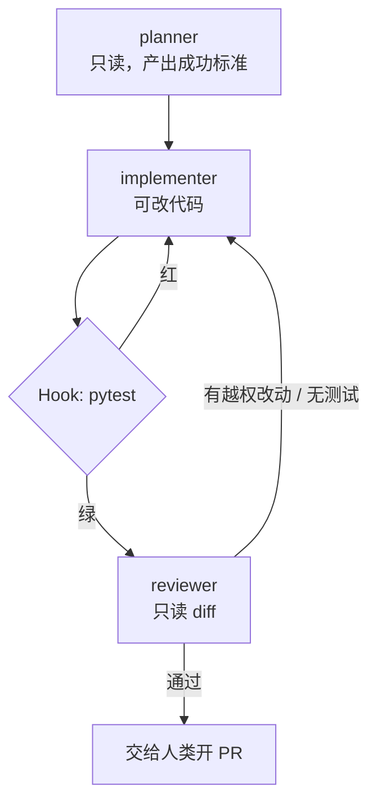

和案例 A 的关键差别：

| | 博文图 | 代码图 |
|---|---|---|
| 最重要的确定性边 | 可选的构建检查 | **测试 Hook，不可省略** |
| 审查员看什么 | 事实与体例 | diff 是否越权、是否只改该改的行 |
| 规划节点是否需要 | 题目清楚时可省 | 强烈建议：先把成功标准写成可验证断言 |

planner 的产出应当是测试语言，而不是散文：

```text
成功标准：
1. GET /posts?authorId=1 只返回该作者文章，分页仍有效
2. 不传 authorId 时行为与现在完全一致（现有测试全绿）
3. authorId 不存在时 200 + 空数组
4. diff 不得改序列化、不得新增抽象层
```

implementer 先根据第 1、3 条补测试（必须先红），再改查询。Hook 保证它没法在红测试上把活交给 reviewer。reviewer 对照第 4 条看 diff：出现 `PostFilterStrategy` 或无关格式化，直接打回。

如果你已经在用 [Karpathy Skills]() 那套「编码前思考 / 简洁 / 精准修改 / 目标驱动」，它们属于**节点内部的 Loop 纪律**；本图是把「实现」和「验收」拆成不能互相作弊的两个节点。两者叠在一起，而不是二选一。

---

## 十二、形状稳定之后：用 LangGraph 固化（可选）

Claude Code 适合发现图；当你需要检查点、重放、把图嵌进服务时，LangGraph 这类运行时才开始赚回学习成本。本站更早的 [Gemini + LangGraph 全栈指南]() 是「研究 Agent」方向的完整项目；下面只展示与本文同一张「写-审回环」对应的最小形状，便于对照，而不是再造一个框架教程。

```python
from typing import TypedDict
from langgraph.graph import StateGraph, END

class ArticleState(TypedDict):
    task: str
    notes: str
    draft: str
    pass_review: bool
    revision: int

def researcher(state: ArticleState) -> dict:
    return {"notes": gather(state["task"])}

def writer(state: ArticleState) -> dict:
    return {"draft": write(state["notes"], state.get("draft", ""))}

def reviewer(state: ArticleState) -> dict:
    passed, issues = review(state["draft"])
    return {"pass_review": passed, "revision": state["revision"] + 1}

def route_after_review(state: ArticleState) -> str:
    if state["pass_review"] or state["revision"] >= 3:
        return END
    return "writer"

graph = StateGraph(ArticleState)
graph.add_node("researcher", researcher)
graph.add_node("writer", writer)
graph.add_node("reviewer", reviewer)
graph.set_entry_point("researcher")
graph.add_edge("researcher", "writer")
graph.add_edge("writer", "reviewer")
graph.add_conditional_edges("reviewer", route_after_review)
app = graph.compile()
```

和 Claude Code 版是同一张餐巾纸：节点函数、直线边、条件边、显式状态。差别只是边从「主 Agent 当时的决定」变成了「代码里的声明」。先在交互环境里跑通，再抄进这种文件，你才知道 `route_after_review` 该不该存在。

Google ADK 把顺序、并行、循环做成了一等公民工作流 Agent；AutoGen GraphFlow 用图描述团队如何交接。选型口诀：

| 你更在乎 | 更合适的落点 |
|----------|----------------|
| 人在回路、形状还在变 | Claude Code 子智能体 |
| 要检查点、要当服务跑 | LangGraph / Agent SDK |
| 跨团队、跨厂商委派 | A2A 这类协议，而不是再造边 |

「Graph Engineering 只是 LangGraph 吗？」——**运行机制大体是的**；2026 年中新的那一层，是把「选节点、选边、选状态」当成一项可教的设计技能，而不是某个框架的配置细节。技能可迁移，运行时可以换。

---

## 十三、开工前清单

把一个循环拆成图之前，过一遍这些。过不了就还回去。

1. **先试着保持循环。** 单个范围清楚、校验诚实的 Agent 能做完吗？能，就停。
2. **节点必须是真专长。** 不同模型、不同工具集、或只读审查者。「能内联的步骤」不是节点。
3. **先画边再写代码。** 哪段串行、哪段扇出、哪段扇入、那一条条件回环在哪。餐巾纸画不出，就太复杂。
4. **显式设计状态对象。** 沿边走什么、谁准写。状态漂移是图腐烂第一名。
5. **给审查节点牙齿。** 最高价值节点往往是只读校验者，和生产者不是同一个 Agent。
6. **隔离失败。** 一个节点失败并重试时，不得写坏共享状态、不得毒死下游。
7. **能用现成运行时就别手写调度器。** 手搓运行时是另一种 slop。
8. **设花费上限和硬边界。** 图是许多循环；弱校验会并行烧 token。

这周如果真的要建一张图，验收标准不是「节点最多」，而是：**每个节点都在做循环做不了的事，而且你仍能一口气讲完整张图。**

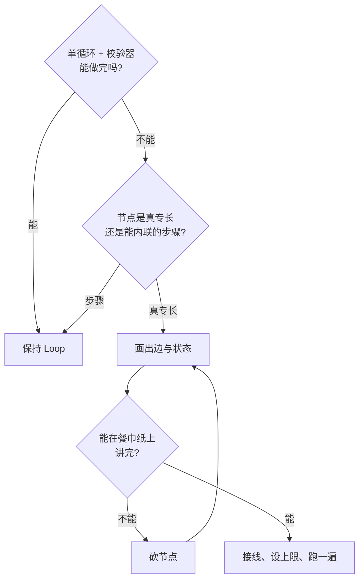

---

## 十四、常见问题

**Graph Engineering 是新学科吗？**  
不是。有向图、状态机、编排引擎、Agent 间协议都比这个词更老。新的是：团队在 2026 年上半年把「单 Agent 循环」练熟之后，撞上了循环形状不对的墙，开始有意识地拆专职节点。标签可选用；这级升级是真的。不要在需要之前去够它。

**和 Loop Engineering 什么关系？**  
循环是图的特例：一个节点，边指回自己。图不取代循环，图是多个循环需要交接时的那一层。每个节点内部仍然要会：发现、规划、执行、校验、停止。

**必须上 LangGraph 吗？**  
不必。交互式图用 `.claude/agents/` 加主会话路由就够。SDK / LangGraph 的价值是无人值守、可测试、可编程扇出、检查点。先手搓并看它跑，再抬进去。

**这和把 prompt 写得更狠有何不同？**  
再好的单 prompt 也是一个节点、一个上下文窗口在包办一切。图把活分给干净上下文和窄简报，并在节点之间传状态。Anthropic 的多智能体研究系统证明这样做能换来质量，也证明你要为此付 token。

**子智能体是什么？**  
主会话可以拉起的、处理专职子任务的独立 Agent 实例。各自的上下文、系统提示和工具范围，避免污染主线程。在图里，每一个子智能体就是一个节点。

---

## 参考来源

- [Graph Engineering: The 2026 Guide](https://www.aibuilderclub.com/blog/graph-engineering-guide-2026)（AI Builder Club）— 节点 / 边 / 状态、何时图优于循环、与 LangGraph 等先行者的关系
- [Graph Engineering with Claude Code](https://www.aibuilderclub.com/blog/graph-engineering-with-claude-code)（AI Builder Club）— 子智能体、Hook、Agent SDK 如何映射到图
- [Building Effective Agents](https://www.anthropic.com/engineering/building-effective-agents)（Anthropic）— 提示链、路由、并行、编排-工人、评估-优化
- [How we built our multi-agent research system](https://www.anthropic.com/engineering/multi-agent-research-system)（Anthropic）— 主 Agent + 并行子 Agent；内部评测相对单 Agent 基线 +90.2%，约 15× token
- [Subagents](https://docs.anthropic.com/en/docs/claude-code/sub-agents)（Claude Code 文档）— 独立上下文、自定义系统提示、`.claude/agents/` 与 SDK `agents` 参数
- [LangGraph](https://langchain-ai.github.io/langgraph/) — 以 `StateGraph` 声明节点、边与共享状态的编排运行时
- [Google ADK](https://google.github.io/adk-docs/) — 基于图的工作流 Agent（顺序 / 并行 / 循环）与路由

本站相关：[Harness Engineering]()、[智能体设计模式]()、[Claude Code 最佳实践]()、[Gemini + LangGraph 全栈]()。
