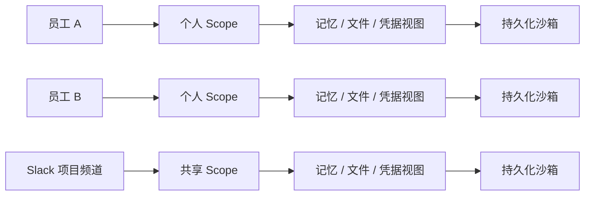
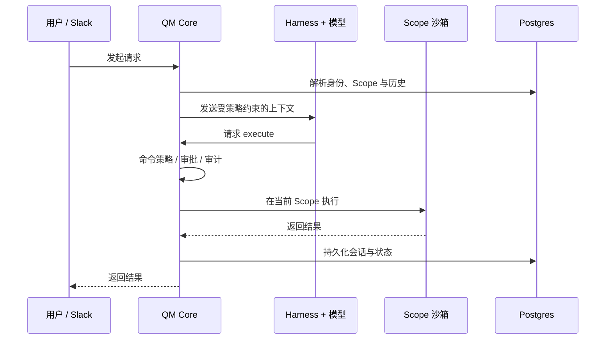
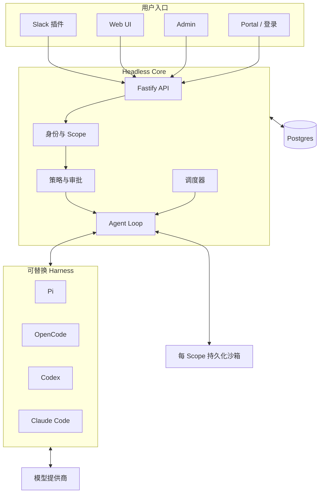
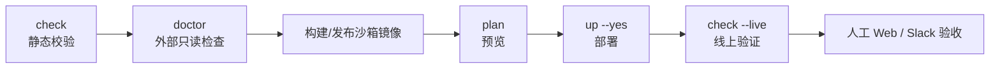
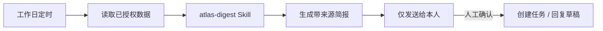
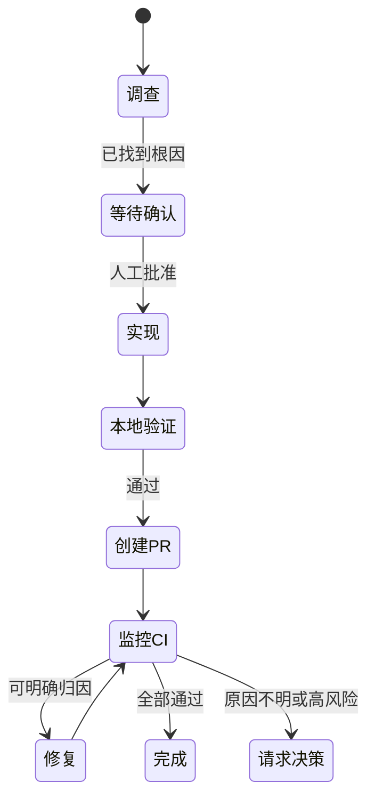

> [QM](https://github.com/yc-software/qm) 是一个面向组织工作的多人 Agent Harness。它让每位员工、每个 Slack 房间和每个项目拥有相互隔离的记忆、文件、凭据视图、权限、后台任务、Web 应用与持久化沙箱，同时通过 Slack 和 Web 提供统一体验。

本文依据 [QM GitHub 仓库](https://github.com/yc-software/qm)、[DeepWiki 代码解析](https://deepwiki.com/yc-software/qm) 及仓库中的部署、安全和 CLI 文档整理。内容状态截至 **2026 年 8 月**。QM 官方明确将其描述为早期实验性软件；生产使用前应完成组织自己的安全评审。

---

## 一、QM 解决什么问题

个人 Agent 通常围绕“一个用户、一个工作区、一组凭据”设计。把它直接接入公司 Slack 后，会立即遇到几个问题：

- 私聊、频道和项目之间的上下文是否会串线？
- 两位员工使用 Agent 时，能否看到彼此的文件或凭据？
- 定时任务应该以谁的身份运行？
- Agent 创建的内部应用应该向谁开放？
- 更换模型或 Agent Harness 后，历史数据能否继续使用？
- 谁可以安装工具、共享 Skill 或放宽安全策略？

QM 的答案是把 **Scope（作用域）** 作为最基本的隔离与授权单位，而不是维护一个全公司共享的“超级对话”。



因此，QM 更接近“组织级 Agent 操作系统”，而不是一个新的聊天机器人：

- **多人使用**：每个人可以拥有自己的 Agent，也能在频道和项目中协作。
- **跨入口连续**：Slack 与 Web 使用同一身份和配置。
- **Harness 可替换**：Pi、OpenCode、Codex 与 Claude Code 可以接入同一个核心。
- **模型可替换**：组织按部署选择 Anthropic、OpenAI 或 OpenRouter。
- **状态持久化**：会话、记忆、队列等关键状态写入 Postgres。
- **后台执行**：Cron 和 Watch 可以在无人在线时继续工作。
- **组织治理**：管理员控制安全模式、可用模型、Harness、Skill 与授权。

### QM 不适合哪些场景

QM 当前并不是：

- 面向匿名公众的成熟多租户 SaaS 边界；
- 可以替代云账号、网络和身份系统安全治理的产品；
- 能保证模型永不泄漏数据或永不受提示注入影响的安全沙箱；
- 安装后无需运维的桌面应用；
- 只想在本机偶尔使用一次编码 Agent 的最轻量方案。

如果只是个人在单个仓库中使用 Claude Code、Codex 或 OpenCode，直接使用对应工具通常更简单。QM 的价值出现在“多人、多个协作空间、共享能力、后台任务和组织治理”同时存在时。

---

## 二、核心概念

### 2.1 Scope：隔离与协作的边界

每个请求都会解析到一个 `ScopeId`。Scope 可以属于：

- 一位用户的个人空间；
- 一个 Slack 频道或群聊；
- 一个项目房间；
- 通过授权共享给其他人的协作空间。

一个 Scope 拥有自己的：

- 会话与长期记忆；
- 文件和工作目录；
- Keychain/连接器凭据视图；
- 权限与授权；
- Cron、Watch 等后台工作；
- 已发布 Web 应用；
- 持久化 Agent 沙箱。

**Scope 隔离并不意味着绝对安全。** 管理员是特权内容读取者；已授权的管理员读取会被审计，但不需要用户再次批准。组织在上线前必须明确告知员工这一点。

### 2.2 持久化沙箱：每个 Scope 的 Agent Computer

Agent 不直接在 QM Core 进程里执行任意命令。Core 只向模型提供一个小而固定的工具面，其中 `execute` 会把命令发送到当前 Scope 的隔离沙箱。



沙箱是“持久化电脑”：安装过的工具和保存的文件可跨会话继续存在。不同 Scope 使用不同沙箱，降低个人任务、频道任务和项目任务相互污染的风险。

### 2.3 Harness、模型与 Core

这三个概念不要混淆：

- **Core**：负责身份、Scope、策略、调度、API 和持久化。
- **Harness**：驱动 Agent 循环的宿主，如 Pi、OpenCode、Codex、Claude Code。
- **模型**：真正生成推理和工具调用的模型服务。

QM 的 Headless Core 不绑定单一 Harness。更换 Harness 或模型时，Scope、会话、记忆与部署层仍由同一个 Core 管理。

### 2.4 Surface 与插件

QM 的交互入口建立在 Core 之上：

- **Web UI**：聊天、文件、记忆、Cron、Keychain、部署和 Skill 管理。
- **Admin**：品牌、模型、连接器、安全和组织配置。
- **Portal**：登录和对外访问入口。
- **Slack**：可选的进程内插件，使用 Bolt，通过 Socket Mode 连接。

Slack 登录和 Slack Bot 是两个独立选择：

- 可以使用 Slack 登录，但不把 Agent Bot 加入工作区。
- 可以使用其他 OIDC 登录，同时启用 Slack Bot。

---

## 三、系统架构



技术实现上，Core 使用 Node.js 直接运行 TypeScript，以 Fastify 提供 HTTP API；Slack 插件基于 Bolt；Web UI 使用 Vite 和 Lit。关键状态默认进入 Postgres，因此蓝绿部署不能依赖某个进程的内存状态。

---

## 四、部署前的选择

### 4.1 运行目标

QM CLI 支持三个目标：

| 目标 | 适用场景 | 关键依赖 | 生产建议 |
| --- | --- | --- | --- |
| Docker | 本机快速体验 | Node 24、Docker、Postgres 容器或 DSN | 仅测试 |
| Fly.io | 中小团队、希望较快上线 | Fly 组织、Flyctl、镜像构建能力 | 无偏好时官方部署流程优先推荐 |
| AWS | 已有 AWS 平台治理的组织 | ECS、ECR、RDS、ALB、Cloud Map、IAM 等 | 能承担更复杂运维时使用 |

生产实例运行在组织自己的云账户中。`qm init` 不会生成部署 CI，QM 源仓库也没有替你部署生产环境的工作流。

### 4.2 必备环境

至少准备：

- Node.js 24 或更高版本；
- npm、Git、Docker Buildx 和 OpenSSL；
- Fly.io 或 AWS 账号及对应 CLI；
- 一个模型提供商账号与 API Key；
- 管理员工作邮箱；
- 登录方式：内置邮件登录、Slack OpenID 或外部 OIDC；
- 启用 Slack Bot 时所需的 Bot Token 和 App Token。

模型提供商支持：

- `anthropic`
- `openai`
- `openrouter`

初始化时选定 `modelProvider` 后，对应 Key 会成为部署必需的 Secret。若省略它，则需在 Admin 页面稍后配置模型；这会导致部署初期无法正常完成第一轮对话，因此不应作为默认流程。

### 4.3 登录方式

**内置 Auth Broker**

通过一次性邮件链接登录。需要管理员邮箱、已验证发件人，以及 Resend Key 或 SMTP 凭据。已有企业邮箱或邮件中继时，SMTP 通常最省事。

**Slack 登录**

适合本来就在 Slack 工作的团队，不需要邮件发送域名。它需要单独创建 Slack SSO App，并绑定允许登录的工作区。

**外部 OIDC**

可以接入 Google Workspace 等提供商。必须注册精确的 `/auth/callback` 回调地址，并设置允许的工作邮箱或域。

---

## 五、十分钟本地体验

> Docker 目标用于本机试用，不应被包装成正式生产方案。

新建一个空目录后执行：

```bash
mkdir qm-demo
cd qm-demo

npm exec --yes --package=@yc-software/qm@latest -- \
  qm init . --org qm-demo --target docker --model-provider openai

npm install
```

初始化会生成类似结构：

```text
qm-demo/
├── qm.config.jsonc
├── package.json
├── package-lock.json
├── deployment.md
├── .codex/skills/deploy-qm/
├── .env.example
├── .env
├── slack-app-manifest.yml
├── sandbox/
│   ├── Dockerfile
│   ├── tools/
│   └── skills/
└── plugins/
```

接下来遵循生成的 `deployment.md` 和 `.codex/skills/deploy-qm/`。它们与当前锁定的 QM 版本匹配，优先级高于博客中的静态命令。

把真实 Secret 写入已被 Git 忽略的 `.env`，不要放进 `qm.config.jsonc`：

```dotenv
OPENAI_API_KEY=...
ADMIN_GRANTS=admin@example.com:org_admin
```

然后按生命周期执行：

```bash
npm exec qm -- check
npm exec qm -- doctor
npm exec qm -- plan
npm exec qm -- up --yes
npm exec qm -- check --live
npm exec qm -- conformance
npm exec qm -- outputs --json
```

各命令职责：

- `check`：离线校验配置、Secret 名称、工具、Skill 与插件。
- `doctor`：只读检查外部资源和真实凭据。
- `plan`：渲染部署计划，不修改云资源。
- `up --yes`：执行部署；AWS 要求显式 `--yes`。
- `check --live`：检查真实基础设施、健康状态和端到端私有会话。
- `conformance`：核对静态部署契约与 Core 解析结果。
- `outputs --json`：输出 Web、Admin、连接器等入口。

部署成功后：

1. 打开 `adminOnboardingUrl`，确认模型提供商已配置。
2. 打开 `webUiUrl` 并以管理员身份登录。
3. 发送一个具体任务，而不只是“你好”。
4. 确认收到了真实模型响应，并生成了会话标题。
5. 让 Agent 在工作区创建一个带随机 UUID 的文件，再从沙箱外独立验证文件。

---

## 六、生产部署标准流程

### 6.1 初始化组织部署仓库

```bash
npm exec --yes --package=@yc-software/qm@latest -- \
  qm init . --org acme --target fly --model-provider anthropic

npm install
```

AWS 将 `--target fly` 改为 `--target aws`。初始化目录以后不要直接修改 `target` 来迁移提供商，因为不同目标的配置、Secret 规则、生成文件和销毁流程不同；应在一个新的空目录中重新初始化。

`package.json` 会精确锁定用于生成目录的 `@yc-software/qm` 版本，`package-lock.json` 锁定依赖。团队检出仓库后应使用：

```bash
npm ci
npm exec qm -- version
```

### 6.2 配置与 Secret 边界

部署仓库应遵守：

- `qm.config.jsonc` 可以提交，但不得包含 Secret 值。
- `.env.example` 只记录变量名和说明，可以提交。
- `.env` 保存真实值，必须被 Git 忽略。
- `qm secrets push` 把 Secret 上传至 Fly Secrets 或 AWS Secrets Manager，且不打印值。
- AWS 的 `DATABASE_URL` 由 Terraform 管理。

推荐在加入 Secret 前确认：

```bash
git check-ignore --quiet .env
```

不要把 Key 粘贴进 Agent 对话、终端输出、Issue 或提交记录。

### 6.3 推荐发布门禁



Docker/Fly 使用：

```bash
npm exec qm -- sandbox publish
```

AWS 默认沙箱基于 Lambda MicroVM，使用：

```bash
npm exec qm -- infra render
npm exec qm -- infra build-image
```

最终门禁至少包含：

```bash
npm exec qm -- check --live
npm exec qm -- conformance
npm exec qm -- outputs --json
```

`check --live` 不只是探测 HTTP 健康页，还会执行一次私有端到端 Agent 会话，验证回复、持久化 Transcript、自动标题和会话错误日志。

### 6.4 Slack Bot

当组织需要在 Slack 中直接使用 Agent：

```bash
npm exec qm -- slack render
npm exec qm -- outputs
```

然后：

1. 使用输出的 Manifest 创建 Slack App。
2. 配置 Bot Token 与 App Token。
3. 把 Bot 邀请到测试频道。
4. `@Bot` 发起一个具体任务。
5. 确认回复出现在正确频道，而不是个人 Scope。

当 `publicUrl` 改变后，重新执行 `qm slack render` 更新 Manifest。

---

## 七、三种安全模式

组织选择一个安全姿态，较小的 Scope 只能收紧，不能绕过组织下限。

### Strict

除两个无副作用的回合结束工具外，每次 Harness 工具调用都暂停等待人工批准。

适合：

- 刚接入真实代码仓库和生产系统；
- 高敏感数据或强合规团队；
- 新增高权限连接器后的观察期。

代价是后台自动化能力明显降低。

### Auto（默认）

带来源标签的外部数据和受支持工具结果会先经过分类器筛查，再进入模型。可以使用内置模型分类器，也可以配置组织自己的 HTTPS Security Screen Proxy。

Auto 是风险与效率的折中，但它是启发式防御，不是提示注入免疫系统。命令输出、多模态结果、原始 Webhook 等路径并非全部覆盖。

### Dangerous

不做内容筛查，也不在工具调用之间暂停。即便如此，预声明命令策略中的硬拒绝和审批规则仍然生效。

它不适合因为“嫌审批麻烦”而在真实组织数据上直接启用。

### 所有模式都应理解的限制

- 命令策略可以被混淆、编码或“先写脚本再执行”绕过。
- 浏览器操作不一定重新进入 Core 命令审批。
- 凭据在沙箱进程使用时会以明文文件或环境变量存在。
- Egress 描述在部署契约 v1 中可能只有校验，没有完整运行时强制。
- 管理员可以读取敏感 Scope 内容，行为会被审计。
- 会话、模型请求和文件可能比用户预期保存更久。
- 已发布应用的 Capability Link 是 Bearer Authorization，获得链接的人即可访问对应应用。

因此，安全模式必须和最小权限凭据、短期 Token、独立云账号、审计、预算上限以及数据保留策略一起使用。

---

## 八、日常使用方法

### 8.1 个人 Scope

适合个人知识、私有草稿、个人连接器和持续任务。

示例请求：

```text
读取我已连接的邮件与项目笔记，整理今天需要我亲自处理的事项。
按“阻塞团队 / 等待外部 / 本周可完成”分类，先只生成建议，不发送消息。
```

第一轮先要求只读分析。确认数据源和分类质量后，再通过审批或受限 Skill 增加写操作。

### 8.2 频道或项目 Scope

在项目频道中使用时，记忆和文件属于频道 Scope，而不是某个发起人的个人空间。

```text
总结本频道过去 7 天的决策、未解决问题和负责人。
把每条结论链接回来源消息；不确定的负责人标为“待确认”，不要猜测。
```

频道成员可以围绕同一份上下文继续工作，而不会自动读取某位员工的个人记忆。

### 8.3 Web 与 Slack 接力

同一身份和配置可以跨 Web 与 Slack 使用：

1. 在 Slack 频道发起项目调查。
2. 在 Web UI 打开对应会话，查看长输出和文件。
3. 在 Web 中继续生成报告或内部应用。
4. 回到 Slack 发布面向团队的简版结果。

需要注意：跨入口保持身份并不等于任意个人会话会自动变成频道会话。每次都应确认当前 Scope。

### 8.4 Cron 与 Watch

- **Cron**：按固定时间或周期触发，例如每个工作日 09:00 生成摘要。
- **Watch**：监控某个外部状态，在变化时触发处理，例如 CI 失败或文档更新。

后台任务仍属于创建它的 Scope，并以该 Scope 可用的权限和凭据运行。创建前应明确：

- 触发条件；
- 允许读取的数据；
- 是否允许产生外部副作用；
- 结果发送到哪里；
- 连续失败如何停止；
- 每日预算上限。

QM 的具体管理界面仍在演进，创建时以 Web UI 和当前部署版本显示的字段为准，不要根据旧博客猜测 Cron 表达式或 Watch 事件名。

---

## 九、Skill、工具与组织复用

### 9.1 Skill 的三种范围

QM 的 Skill 是 Scope 所有的能力资产：

1. **私有 Skill**：只在当前 Scope 使用。
2. **授权共享**：所有者通过 Grant 分享给指定对象。
3. **组织级 Skill**：经过管理员审核后推广到整个组织。

还可以从 Git 仓库导入 Skill Pack。第三方 Skill 能引导 Agent 读取文件、调用工具并产生副作用，因此导入前应像审查代码依赖一样审查它。

### 9.2 在部署层添加 Skill

部署目录中的结构为：

```text
sandbox/
└── skills/
    └── incident-summary/
        ├── SKILL.md
        ├── template.md
        └── references.md
```

一个最小 `SKILL.md`：

```markdown
---
name: incident-summary
description: 将事故材料整理成组织标准复盘报告
---

# Incident Summary

1. 只读取当前 Scope 已授权的数据。
2. 区分事实、推断和待确认项。
3. 使用 template.md 输出时间线、影响、根因、修复和行动项。
4. 在用户确认前不得发送报告或修改 Issue。
```

部署层 Skill 要求 Front Matter 至少包含 `name` 与 `description`。普通 `up` 会把完整文本 Skill Tree 和工具描述同步到 Core，并以内容哈希版本化。

### 9.3 添加组织工具

```text
sandbox/
└── tools/
    └── acme-cli/
        ├── tool.json
        └── acme
```

工具描述可以声明：

- 可读名称和向模型展示的提示；
- 登录检测与重新认证命令；
- 凭据文件路径；
- 非 Secret 环境变量；
- Egress 主机名；
- 额外拒绝或审批规则；
- 沙箱中必须存在的二进制文件。

工具自己的审批规则只能收紧，不能覆盖管理员策略或增加更宽松的 Allow。`egress` 在契约 v1 中主要用于校验，不能仅凭它宣称已完成网络隔离。

---

## 十、从入门到实战的五个案例

### 案例一：个人研究助手

**目标**：把邮件、内部文档和 Web 搜索汇总成每日研究简报。

**第一阶段：只读试运行**

```text
从我已授权的邮件与文档中，找出过去 24 小时与“Project Atlas”有关的新信息。
输出：
1. 已确认事实；
2. 相互矛盾的信息；
3. 需要我判断的问题；
4. 每条信息的来源。
禁止发送邮件、修改文档或创建任务。
```

**第二阶段：固化为 Skill**

把分类规则、来源格式和“禁止外部写操作”的约束写入 `atlas-digest` Skill，使输出稳定。

**第三阶段：创建 Cron**

在个人 Scope 中配置工作日定时执行，结果只投递给本人。先在 Strict 或 Auto 模式观察一周，再决定是否允许创建草稿任务。



**验收标准**

- 不读取其他员工的个人 Scope。
- 所有重要结论有来源。
- 未经确认不产生外部写操作。
- 失败时只报告一次，不反复消耗预算。

### 案例二：Slack 项目频道助理

**目标**：维护一个共享项目的决策记录和每周状态。

在项目频道中发起：

```text
建立本项目的共享状态文档。先回顾本频道已有消息，
提取目标、已确认决策、风险、负责人和截止日期。
任何没有明确来源的内容都标记为“待确认”。
```

后续团队成员在同一频道补充信息：

```text
把刚才确认的 API 冻结日期更新到项目状态，并列出受影响的三个任务。
```

每周 Cron：

```text
根据本频道 Scope 的项目状态和本周消息生成周报。
只发布新增变化；没有变化时不要重复整份报告。
```

**关键点**

- 任务创建在频道 Scope，而不是发起人的个人 Scope。
- 所有频道成员围绕共享记忆协作。
- 若频道包含外部参与者，应先确认组织对外部成员的例外策略。
- 不要把个人 Keychain 凭据默认授予频道 Scope。

### 案例三：代码仓库与 CI 监控

**目标**：在独立沙箱中修改代码、运行测试、创建 PR 并监控 CI。

先接入 GitHub CLI 或组织自有代码平台工具，并为当前项目 Scope 授予最小权限凭据。任务提示：

```text
调查仓库中失败的 payment-service 测试。
先复现并说明根因；确认后再修改。
修改必须包含回归测试，不得跳过 Git Hook，不得强推。
完成后提交 PR，并在本频道汇报测试结果和风险。
```

再建立 Watch：

```text
监控该 PR 的 CI。
成功时发布一次摘要；失败时分析具体失败检查，
只有明确属于本次改动且修复风险低时才修改代码，否则请求人工决定。
```



**安全配置建议**

- 禁止 Force Push、递归删除和破坏性数据库命令。
- 登录命令设为拒绝，凭据由管理员预置或通过连接器授权。
- PR 创建与普通读取分开授权。
- Watch 设置最大重试次数和预算。

### 案例四：定时邮件分流与回复草稿

**目标**：自动加标签并生成回复草稿，但不自动发送。

个人 Scope 中配置邮件连接器后：

```text
每 30 分钟处理新邮件：
- 将账单、安全、客户升级和普通通知分类；
- 安全与客户升级标为高优先级；
- 学习我已发送邮件的语气，为需要回复的邮件创建草稿；
- 永远不要自动发送；
- 无法判断时保留原状并加入待确认列表。
```

分阶段授权：

1. 仅允许读取和分类。
2. 验证一周后允许加标签。
3. 再允许创建草稿。
4. 仍不授予发送权限，或始终要求 Strict 审批。

这种“权限逐步扩大”的方式比一开始交出完整邮箱权限更符合 QM 的安全模型。

### 案例五：构建并发布内部应用

**目标**：把分散的项目数据做成团队可访问的内部状态页。

在项目 Scope 中：

```text
基于当前项目文件和已授权的数据源，创建一个只读状态页：
- 显示里程碑、风险、负责人和最近更新时间；
- 所有数值标明数据来源；
- 数据缺失时显示未知，不得填造；
- 先在沙箱中运行并提供预览，不要直接发布。
```

预览通过后：

```text
把应用发布给 Project Atlas 团队，不要设为全组织可见。
发布前列出访问范围、应用环境变量和它能读取的数据。
```

**风险检查**

- 发布应用是独立信任边界，QM 不审查应用代码。
- 不要把作者的 Ambient Credential 注入应用。
- Capability Link 持有者即可访问对应应用，不应放进公开文档。
- 应用访问范围变化不一定撤销已复制的链接，应配合组织自己的轮换流程。

---

## 十一、运维、回滚与升级

常用命令：

```bash
# 查看状态
npm exec qm -- status

# 查看某项服务日志
npm exec qm -- logs core --tail 200

# 持续查看日志
npm exec qm -- logs core -f

# 推送 Secret
npm exec qm -- secrets push --from .env

# 查看输出入口
npm exec qm -- outputs --json

# 下线
npm exec qm -- down
```

AWS 回滚：

```bash
npm exec qm -- rollback
npm exec qm -- rollback --to <manifest-id-or-release-label>
```

AWS 的 `up` 会在首次变更前创建 RDS 手工快照，并把它记录在部署 Manifest 中。`rollback` 只恢复代码和配置，不自动恢复数据；CLI 会打印与该部署对应的数据库快照，数据恢复仍需运维人员执行。

Fly 可以恢复沙箱镜像 Pin。Docker 目标不承诺回滚。

升级时不要让每位运维人员临时使用不同的全局 CLI。更新部署仓库中精确锁定的 `@yc-software/qm` 版本和 Lockfile，审查变更后重新执行完整门禁。

---

## 十二、私有定制仓库

组织有两种方式：

1. **独立部署仓库**：只依赖发布的 `@yc-software/qm`，无需检出源码，适合多数组织。
2. **私有下游仓库**：把完整 QM 源码和组织定制放在一起，适合需要深入定制的团队。

官方强调不要使用 GitHub 的 Fork 按钮创建所谓“私有 Fork”。公开仓库的 GitHub Fork 不能真正变成独立私有对象网络。正确做法是创建一个普通私有仓库，再通过 Bare Clone/Mirror Push 导入历史。

所有组织特有内容应放在 `deploy/layers/<org>/`：

- 配置；
- 沙箱工具与 Skill；
- 插件镜像；
- 基础设施；
- 生成的 Slack Manifest。

Core 代码保持与上游逐字节一致，可显著降低同步冲突，也能防止组织标识和 Secret 混入上游提交。

---

## 十三、上线检查清单

### 基础设施

- [ ] 生产环境选择 Fly.io 或 AWS，而不是 Docker 体验目标。
- [ ] Node、Docker、云 CLI 和账号权限满足要求。
- [ ] Postgres、对象存储、网络与域名由组织控制。
- [ ] 已评估持续云资源和模型调用成本。

### 身份与权限

- [ ] 首位管理员使用已验证的工作身份。
- [ ] 登录方式和精确回调地址已验证。
- [ ] 个人、频道和项目 Scope 的授权边界清晰。
- [ ] 团队知道管理员可以审计并读取敏感内容。
- [ ] 外部用户不被当作普通内部成员接入。

### Secret 与数据

- [ ] `.env` 已被 Git 忽略且从未进入聊天或日志。
- [ ] 凭据遵循最小权限，并有轮换和撤销方案。
- [ ] 已评估模型、浏览器和 Security Screen 服务商的数据保留政策。
- [ ] 已定义会话、模型请求、文件和应用数据的保留策略。

### Agent 安全

- [ ] 选择了合适的 Strict 或 Auto 安全模式。
- [ ] 破坏性命令和高风险工具有硬拒绝或人工审批。
- [ ] 第三方 Skill、Skill Pack 和工具描述已经审查。
- [ ] Cron/Watch 有预算、失败停止和结果投递规则。
- [ ] 没有把 Egress 描述误认为完整网络强制。

### 验证

- [ ] `check`、`doctor`、`plan` 均通过。
- [ ] `check --live` 与 `conformance` 通过。
- [ ] 管理员可以登录并收到真实模型回复。
- [ ] 会话标题和持久化 Transcript 正常。
- [ ] 沙箱文件已通过独立方式验证。
- [ ] 启用的连接器完成一次真实 OAuth。
- [ ] Slack Bot 在测试频道正确回复。
- [ ] 状态、日志、回滚和下线命令已交接。

---

## 十四、常见误区

### “一个 Slack Bot 就应该共享全公司的所有记忆”

错误。QM 用 Scope 把个人与协作上下文分开。共享应通过明确的频道 Scope、Grant 或组织级 Skill 完成。

### “Dangerous 模式会关闭所有安全限制”

不完全正确。它关闭内容筛查与工具间暂停，但预声明命令策略中的硬拒绝和审批规则仍然存在。

### “使用了 Auto 就不怕提示注入”

错误。Auto 是启发式内容筛查，覆盖范围有限，也不是授权机制。

### “配置了工具 Egress 就已经完成网络隔离”

错误。部署契约 v1 对部分 Egress 内容只做校验，运行时强制取决于沙箱后端和网络配置。

### “回滚会自动恢复数据库”

错误。AWS 回滚恢复代码和配置，数据库快照恢复需要运维人员单独执行。

### “Slack 登录和 Slack Bot 是同一个 App”

错误。登录用 SSO App，Agent 进频道使用 Bot App，它们可以独立启用。

---

## 十五、命令速查

```bash
# 初始化
qm init [dir] --org <id> --target docker|fly|aws

# 校验与诊断
qm check [--json] [--live]
qm doctor
qm conformance [dir] [--static]

# 基础设施与部署
qm infra render|build-image|delete-image|delete-task-definitions
qm plan
qm up --yes
qm down [--purge]
qm rollback [--to <revision-or-sha>]

# 沙箱
qm sandbox build [--dry-run]
qm sandbox publish [--dry-run]

# Slack 与入口
qm slack render
qm outputs [--json]

# Secret 与运维
qm secrets push [--from <file>]
qm status
qm logs [service] [-f] [--tail <n>]
```

在通过 npm 固定版本的部署仓库中，应使用 `npm exec qm -- <command>`，例如：

```bash
npm exec qm -- check --live
```

---

## 结语

QM 的核心价值不是“让更多人共用一个 Bot”，而是让组织在共享 Agent 能力时，仍保留清晰的身份、Scope、凭据、沙箱和审计边界。

推荐采用渐进路线：

1. 用 Docker 理解 Scope、Web UI 和持久化沙箱。
2. 在 Fly.io 或 AWS 建立独立测试组织。
3. 先接入一个模型和少量内部用户。
4. 用 Strict 或 Auto 从只读任务开始。
5. 验证后再增加 Slack、连接器、Cron、Watch 和写操作。
6. 把成熟流程固化为 Skill，再经管理员审核推广。
7. 最后构建内部应用和跨系统自动化。

如果把 QM 当成“拥有组织权限的自动化运行平台”来治理，而不是当成普通聊天插件来安装，它才能真正发挥多人 Agent 协作的价值。

---

## 参考资料

- [yc-software/qm GitHub 仓库](https://github.com/yc-software/qm)
- [QM DeepWiki](https://deepwiki.com/yc-software/qm)
- [Getting Started](https://github.com/yc-software/qm/blob/main/docs/getting-started.md)
- [QM CLI](https://github.com/yc-software/qm/blob/main/cli/README.md)
- [Deployment Directory Contract](https://github.com/yc-software/qm/blob/main/docs/deploy-directory.md)
- [Security Policy](https://github.com/yc-software/qm/blob/main/SECURITY.md)
