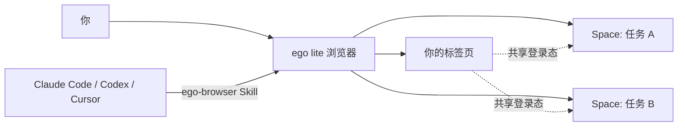
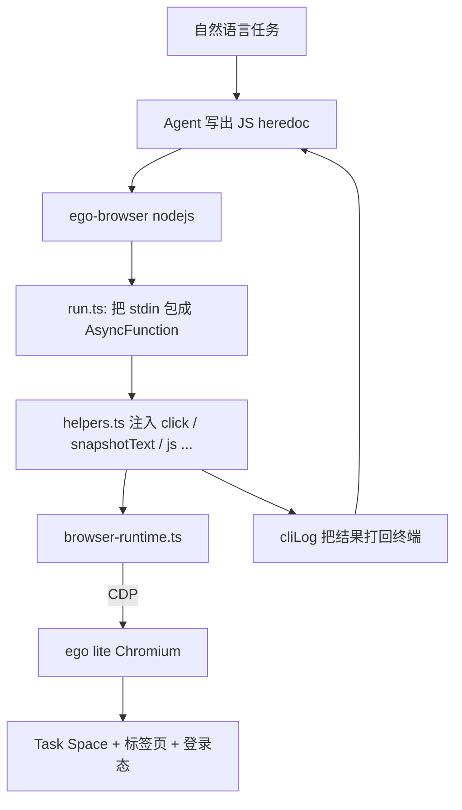
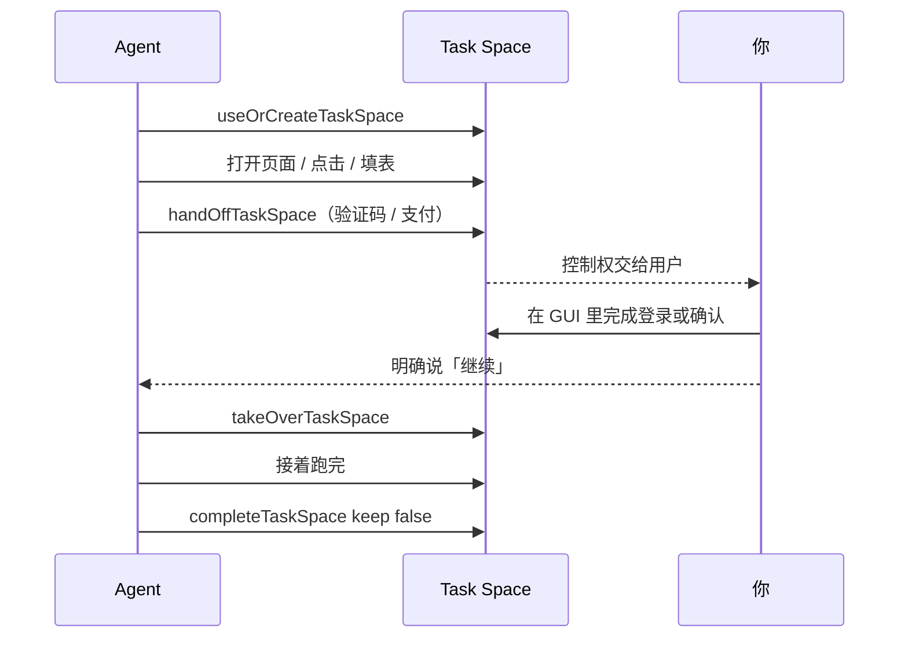
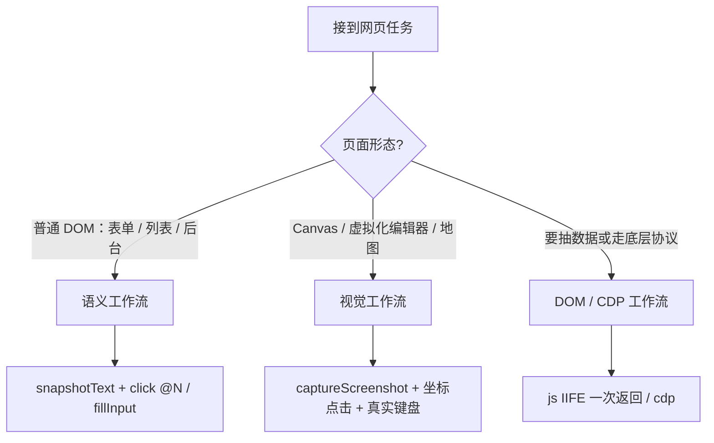
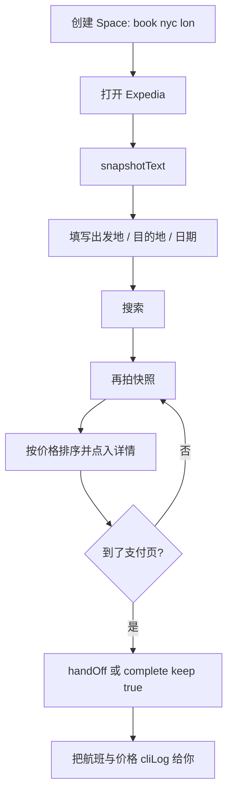

> **ego lite** 是一款为人与 AI Agent 并行工作设计的 Chromium 浏览器：你继续用自己的标签页，Agent 在独立 Space 里操作网页，并复用你已有的登录态、Cookie 和扩展。本文依据 [citrolabs/ego-lite](https://github.com/citrolabs/ego-lite)、[DeepWiki 代码解析](https://deepwiki.com/citrolabs/ego-lite)、[官方文档](https://lite.ego.app/document/) 与演示视频 [ego lite 基础到进阶](https://www.youtube.com/watch?v=wBN2BniLoHM) 整理。功能状态截至 **2026 年 8 月**：浏览器目前仅支持 macOS，Windows / Linux 仍在路线图上；开源仓库是 MIT 的 Skill 与运行时，浏览器本体是免费但闭源的独立下载。

---

## 一、为什么需要 ego lite

浏览器自动化并不稀缺。真正卡住日常使用的，通常是两件事：

1. **登录摩擦**：Playwright、Puppeteer、Browser-Use、Vercel agent-browser 都会另起一个空白浏览器。CRM、后台、邮箱、社媒一旦要登录，自动化就停住。
2. **抢标签页**：Agent 一启动就跳窗口、夺焦点、翻你的标签。你本来想把时间还给自己，结果只能盯着它点鼠标。

ego lite 的答案不是再做一个自动化库，而是把浏览器本身做成「人和 Agent 共用的工作台」：

- 安装时把 Chrome 的登录态、Cookie、扩展、书签和 Profile 迁过来。
- 每个任务占用独立 Space，不碰你正在看的页面。
- 任意外部 Agent（Claude Code、Codex、Cursor、OpenCode、Hermes Agent 等）都通过 `ego-browser` Skill 驱动它，而不是绑定内置助手。



官方内部对照 Vercel agent-browser 的四项复杂任务里，ego lite 完成速度最高约 **2.5×～3.45×**，Token 也更少；任务越复杂，差距越大。这些是官方自测数字，选型时仍建议拿自己的真实站点跑一遍。

### 1.1 它在产品谱系里的位置

| 能力 | ego lite | Browser-Use | agent-browser (Vercel) | ChatGPT Atlas | Perplexity Comet |
|---|:---:|:---:|:---:|:---:|:---:|
| 多任务并行 Space | ✓ | — | — | — | — |
| 继承 Chrome 数据 | ✓ | — | — | ✓ | ✓ |
| 同一浏览器、独立工作区 | ✓ | — | — | — | — |
| 外部 Agent 可驱动 | ✓ | ✓ | ✓ | — | — |
| 日常浏览器 | ✓ | — | — | ✓ | ✓ |
| 数据留在本机 | ✓ | ✓ | ✓ | — | — |
| 免费 | ✓ | ✓ | ✓ | — | — |

一句话：自动化框架没有自己的日常浏览器，AI 浏览器又不让你自带 Agent。ego lite 同时做这两件事。

---

## 二、核心架构：无状态脚本，有状态浏览器

开源仓库 [citrolabs/ego-lite](https://github.com/citrolabs/ego-lite) **不包含浏览器二进制**。它提供两块：

1. `package/ego-browser/`：Node.js 运行时，通过 Chrome DevTools Protocol（CDP）连到 ego lite。
2. `skills/ego-browser/`：给 Agent 读的 `SKILL.md`、安装脚本，以及站点经验包 `learnings/`。

浏览器本体由 [lite.ego.app](https://lite.ego.app/) 单独下载。Agent 每次调用 `ego-browser nodejs <<'EOF' ... EOF'`，都会拉起一个**全新的 Node 进程**执行这段脚本；标签页、Cookie、Task Space 则一直活在浏览器里。



DeepWiki 把这件事概括成：**无状态的执行前端 + 有状态的浏览器后端**。

- Node 进程不记得上一轮的变量。下一轮必须再调 `useOrCreateTaskSpace(nameOrId)` 才能接回同一个 Space。
- 浏览器记住 Cookie、标签页、滚动位置和登录态。
- `globalThis.ego` 是浏览器暴露给 Node 的底层桥：发 CDP、挂会话、缓冲页面事件。

这也是它比「一步一个 CLI 命令」更快的原因：Agent 把导航、观察、点击、抽取写成一段代码，一次提交执行，而不是「跑一条命令 → 读输出 → 再跑下一条」。

---

## 三、安装与第一次启动

目前官方安装脚本只支持 **macOS**（Apple Silicon 与 Intel）。Windows / Linux 见[路线图](https://lite.ego.app/roadmap)。浏览器和 Skill 是配套的，装其中一个会带上另一个。

### 3.1 三种安装方式

**方式一：下载 macOS 应用**

1. 打开 [lite.ego.app](https://lite.ego.app/) 下载 DMG。
2. 把 ego lite 拖进「应用程序」。
3. 打开应用，完成 onboarding。

首次启动会扫描本机已安装的 Agent，把 `ego-browser` Skill 写进 `~/.agents/skills`、`~/.claude/skills/` 等目录。

**方式二：只装 Skill**

```bash
npx skills add citrolabs/ego-lite
```

或指定 Skill 路径：

```bash
npx skills add github:CitroLabs/ego-lite/skills/ego-browser
```

第一次让 Agent 跑浏览器任务时，它会按 `skills/ego-browser/references/install.md` 引导你安装应用。

**方式三：让 Agent 自己装**

把下面这段直接发给 Claude Code / Codex / Cursor：

```text
Set up ego lite for me: https://github.com/citrolabs/ego-lite

Read skills/ego-browser/references/install.md and follow the steps to install ego lite.
```

安装脚本会按 CPU 架构下载 DMG、装到 `/Applications`（必要时回退到 `~/Applications`）、去掉隔离属性，并启动应用。Onboarding 必须你在 GUI 里点完。

### 3.2 迁移 Chrome 数据

首次启动会问要不要迁移浏览器数据。这一步建议选 **是**，否则 Agent 拿不到登录态，整套方案价值会少一大半。

可迁移内容包括：Cookie / Session、书签、保存的密码、扩展、标签组和 Profile。onboarding 可能要求输入系统密码，只为完成本地迁移。

隐私边界：浏览数据留在本机；ego lite 安装时只记录「是否选择了从 Chrome 迁移」。不需要注册账号，也没有云端会话。

### 3.3 权限与 PATH

- Codex / Claude Code 建议把权限设为 **Full access**：`ego-browser` 需要在沙箱外启动本机应用。
- 命令通常装到 `~/.local/bin`。若提示找不到命令：

```bash
export PATH="$HOME/.local/bin:$PATH"
command -v ego-browser
```

最小连通性检查：

```bash
ego-browser nodejs <<'EOF'
cliLog('ego-browser ready')
EOF
```

终端打印 `ego-browser ready` 即表示运行时可用。

---

## 四、三个必须先懂的概念

### 4.1 Space：给 Agent 的独立工位

Space 是同一个 ego lite 进程里的并行工作区。每个任务一个原生 BrowserContext：标签页、cookie、storage 隔离，但共享浏览器基础设施和你已有的登录环境。

它**不是**：

- 新开一个浏览器窗口或新的 Chrome Profile
- headless Chrome / 屏幕外渲染
- 云端浏览会话

官方做过一次 6 并发、只打开 `about:blank` 的对照：独立浏览器实例 + Profile 副本大约多占 15 GB、84 个进程；Space 大约多占 0.9 GB、6 个进程。数字只说明资源模型，真实页面会更重。

适合放进 Space 的任务：登录后的后台、需要点击翻页上传下载、任务结束后还要复核路径。只查公开资料时，普通网页搜索更轻。

右上角的 Space 面板可以看到哪个 Space 正在被 Agent 操作（通常带蓝色光晕）。你可以随时切进去看、接管或停掉，而不影响自己的标签页。

### 4.2 Snapshot：Agent 如何「看见」页面

把整页 HTML 塞进模型，一个后台页动辄上万 Token，而且大部分是样式和脚本。Snapshot 从 Chromium 无障碍树生成紧凑语义文本，典型页面大约 **200～400 Token**，并为可交互元素分配临时编号 `@N`。

```text
Page: Example - Log in
URL: https://example.com/login

@1 [heading] "Log in"
@2 [form]
  @3 [input type="email"] placeholder="Email"
  @4 [input type="password"] placeholder="Password"
  @5 [button type="submit"] "Continue"
  @6 [link] "Forgot password?"
```

Agent 看到这份结构后，直接 `fillInput('@3', '...')`、`click('@5')`，不必猜 CSS class。快照在内核里生成，而不是叠一层 JS shim，所以深层 iframe、shadow DOM、Stripe / Salesforce / Intercom / React portal 这类场景更稳。

`@N` 只对**最近一次** `snapshotText()` 有效。页面跳转、提交、切标签、局部重渲染后都要重新拍。需要跨多轮引用同一个元素时，用快照里的 `loc=css:...` / `loc=role:...` / `loc=href:...`，或直接写 CSS。

### 4.3 Task Space 与控制权交接

Task Space 是脚本侧对 Space 的句柄。每次 heredoc 开头都要声明它，因为 Node 进程退出后变量全丢：

```js
const task = await useOrCreateTaskSpace('inspect example page')
```

`nameOrId` 可以是短任务名、数字 id。后续轮次优先用返回的 `task.id`，避免重名。同一目标的追问、纠错、复核都应复用原 Space，不要为同一件事新建一个。

所有权是 `agent` / `agentDelegatedToUser` / `user` 三态。人和 Agent **同一时刻只有一方握着控制权**：



关键规则：

- 需要你介入（验证码、扫码、支付、不可逆操作）时，Agent 应调用 `handOffTaskSpace`，并写清楚你要做什么。
- 只有在你明确说「继续」之后，才能 `takeOverTaskSpace`。不要自行抢回控制权。
- 浏览器 GUI 里你随时可以接管，效果等同 Agent 调用了 handoff。此时 Agent 必须停下询问，而不是重试失败操作。
- `completeTaskSpace(nameOrId, { keep })` 必须单独放在**最后一轮** heredoc。默认 `{ keep: false }` 关闭 Space；只有你要求留着页面、或结果必须靠当场查看时才 `{ keep: true }`。

---

## 五、ego-browser 怎么用

`ego-browser` 不是给人点的 GUI，也不是 Playwright 替代品。目标读者是 LLM Agent：它通过 CDP 连到真实会话，把 helper 预注入脚本作用域，Agent 用 Bash 工具跑 heredoc。**不要先把代码写到 `.js` 文件再执行。**

### 5.1 最小循环

```bash
ego-browser nodejs <<'EOF'
const task = await useOrCreateTaskSpace('inspect example page')
cliLog('task space id: ' + task.id)

await openOrReuseTab('https://example.com', { wait: true, timeout: 20 })
cliLog(await snapshotText())
EOF
```

五步：声明 Space → 打开或复用标签 → 拍 Snapshot → 用 `@N` / CSS 操作 → `cliLog` 输出。`cliLog` 是 heredoc 里唯一的输出通道，最终结果都必须走它。

heredoc 体内是 Node；`js(...)` 里才是页面上下文。导航、等待、`cliLog` 写在外面；`document` / `window` 写在 `js()` 里面。

### 5.2 三种工作流



1. **语义工作流（默认）**：普通网站用 `snapshotText()` + `@N` / `loc=`。
2. **视觉工作流**：Google Docs、Sheets、飞书文档、Notion 主编辑区、Figma、白板、地图等。这些表面上看起来有输入框，实际可编辑内容往往在 canvas / 虚拟层。先做一次极小写入探测，再用截图确认文字落在正确位置；探错了就改截图 + 坐标 + `pressKey` / `typeText`。
3. **DOM / CDP 工作流**：压缩抽取、自定义遍历、helper 覆盖不到的协议能力。浏览器内逻辑包成一个 IIFE，一次返回，不要拆成多次 `js()`。

`wait()` 和 `timeout` 的单位是**秒**；只有名字以 `Ms` 结尾的参数才是毫秒。

### 5.3 Helper 速查

所有 helper 都是 camelCase，无需 `import`。不确定用法时：`cliLog(help('click'))`。

| 类别 | 常用 helper |
|---|---|
| Task Space | `listTaskSpaces`、`useOrCreateTaskSpace`、`claimTaskSpace`、`handOffTaskSpace`、`takeOverTaskSpace`、`waitForAgentControl`、`completeTaskSpace` |
| 导航 | `listTabs`、`openOrReuseTab`、`gotoAndWait`、`switchTab`、`closeTab`、`pageInfo`、`ensureRealTab` |
| 观察 | `snapshotText`、`captureScreenshot`、`drainEvents` |
| 鼠标 / 滚动 | `click`、`doubleClick`、`hover`、`dragMouse`、`scrollBy`、`scroll`、`scrollToBottomUntil` |
| 键盘 | `typeText`、`fillInput`、`pressKey`、`dispatchKey` |
| 文件 / 网络 | `uploadFile`、`serverFetch`、`browserFetch` |
| 等待 | `wait`、`waitForLoad`、`waitForElement`、`waitForNetworkIdle` |
| 底层 | `js`、`cdp` |
| 输出 | `cliLog`、`help` |

点击目标支持 CSS、`xpath=...`、`@N` / `ref=N`、`loc=...`、`[x, y]`，以及 `{ selector, x, y }` 相对偏移。`options.label` 会在页面上打出高亮动画，方便你在 Space 里看 Agent 点了哪里。

`pageInfo()` 通常返回 `{ url, title, w, h, sx, sy, pw, ph }`。若原生对话框挡住了页面 JS，它会变成 `{ dialog: ... }`，此时先：

```js
await cdp('Page.handleJavaScriptDialog', { accept: true })
```

若 `w` 或 `h` 为 0，先切到真实标签、刷新或用 CDP 修 viewport，再截图或点坐标。

---

## 六、在 Agent 里怎么下指令

多数时候你不需要手写 heredoc。在 Claude Code、Codex、Cursor 对话框里输入 `/ego-browser`，后接自然语言即可。Skill 会让 Agent 自己生成脚本。

写任务时把边界讲清楚，比「帮我看看网页」可靠得多：

- 目标站点 / 页面
- 要读、填、点、下载什么
- **不允许**做什么（删除、发布、付款、发邮件）
- 验证码、支付、授权时是否暂停
- 结果形态（表格、摘要、截图、本地路径）

模糊 vs 可执行：

```text
# 太模糊
/ego-browser 帮我收集今天的 AI 新闻

# 可执行
/ego-browser 打开 X 我的关注时间线，抓过去 24 小时互动量前 20 的 AI 相关帖子。
按话题去重（同一事件只留互动最高的一条）。
输出：标题 + 链接 + 一句话摘要。
不要点赞、不要转发、不要发帖。
```

---

## 七、入门案例

下面案例都可以直接丢给 Agent；同时也给出 Agent 实际会跑的 heredoc，方便你对照或自己调试。

### 案例 1：连通性检查

**你说：**

```text
/ego-browser 打开 https://example.com，把页面标题、URL 和快照前 30 行打给我。
```

**Agent 大致会跑：**

```bash
ego-browser nodejs <<'EOF'
const task = await useOrCreateTaskSpace('inspect example page')
await openOrReuseTab('https://example.com', { wait: true, timeout: 20 })

const info = await pageInfo()
const snap = await snapshotText()
cliLog({ url: info.url, title: info.title })
cliLog(String(snap).split('\n').slice(0, 30).join('\n'))
EOF
```

能看到标题和带 `@N` 的结构，说明浏览器、Skill、PATH 都通了。

### 案例 2：总结两家公司最新博客

这是官方快速开始任务，也适合当第一条「真任务」。

```text
使用 ego-browser 打开 OpenAI 和 Anthropic 的博客，检查是否有值得关注的新信息，并快速总结最新文章的核心内容。
```

Agent 会新建 Space，分别打开两家博客、读最新文章、整理要点。你自己的标签页不动。想看过程时点右上角 Space。

更稳的写法：

```text
/ego-browser 分别打开 https://openai.com/blog 和 https://www.anthropic.com/news。
各取最新 3 篇：标题、发布日期、链接、三句话摘要。
不要登录、不要订阅、不要点站外广告。
结果用 Markdown 表格返回。
```

### 案例 3：关注 X 账号

官方 README 的第一条演示，仓库里也有 `learnings/x-com` 站点经验包。

```text
/ego-browser follow @ego_agent on x.com for me
```

对应脚本形态：

```bash
ego-browser nodejs <<'EOF'
const task = await useOrCreateTaskSpace('follow ego agent')
await openOrReuseTab('https://x.com/ego_agent', { wait: true, timeout: 20 })

const snap = await snapshotText()
cliLog(snap)

// 实际 ref 以当次快照为准，不要抄死 @92
await click('@92', { label: 'follow ego agent' })
cliLog('clicked follow')
EOF
```

若未登录，Agent 应 `handOffTaskSpace`，请你在 Space 里登录后再说「继续」。不要让它猜密码。

---

## 八、进阶实战

### 案例 4：GitHub 待 review 清单（只读）

```text
打开我的 GitHub Notifications，筛选出需要我 review 的 PR。
列出仓库名、标题、链接。不要归档，不要标记已读。
```

```bash
ego-browser nodejs <<'EOF'
const task = await useOrCreateTaskSpace('github review inbox')
await openOrReuseTab('https://github.com/notifications', { wait: true, timeout: 25 })

const snap = await snapshotText()
cliLog(snap)

const rows = await js(String.raw`(() => {
  const links = [...document.querySelectorAll('a')]
    .map(a => ({ text: (a.innerText || '').trim(), href: a.href }))
    .filter(x => /pull/i.test(x.href) && x.text)
  const seen = new Set()
  return links.filter(x => {
    if (seen.has(x.href)) return false
    seen.add(x.href)
    return true
  }).slice(0, 20)
})()`)

cliLog(rows)
EOF
```

注意：`js()` 返回的是求值结果，不要再 `JSON.parse`。页面若已登录，Space 会直接进通知页；这正是「继承 Chrome 登录态」的价值。

### 案例 5：机票检索到支付页停下

演示视频里的典型进阶流程：人继续写文档，Agent 在自己的 Space 里把订票表单填到支付前。你不要求它真的付钱。

```text
/ego-browser 打开 Expedia，搜索纽约到伦敦的往返机票。
出发约 4 周后、停留 7 天，2 名成人经济舱。
选出总价最低且起飞时段合理的一班，一路走到支付页。
不要提交支付，不要保存信用卡。到达支付页后停下，把航班号、时刻、总价和当前 URL 发给我。
```

流程可以画成：



实现时注意三点：

1. 日历、下拉、动态筛选都要「操作后再 `snapshotText()`」，不要沿用旧 `@N`。
2. 支付、下单属于必须停下的步骤，用 `handOffTaskSpace` 或 `{ keep: true }` 把页面留给你。
3. 结果里要有可核对字段（航班号、时刻、金额、URL），不要只说「已经帮你选好了」。

### 案例 6：登录接管

内部后台、企业 SSO、扫码登录几乎总会碰到人机协作。

```text
/ego-browser 打开 https://admin.example.com/reports，导出本周用户活跃 CSV。
如果出现 SSO、验证码或扫码登录，立刻把控制权交给我，告诉我要在哪个 Space 操作。
我完成登录并回复「继续」后，再筛选本周、下载文件，并把本地路径发给我。
不要改任何配置。
```

Agent 侧正确节奏：

```bash
# 第一轮：打开并检测是否已登录
ego-browser nodejs <<'EOF'
const task = await useOrCreateTaskSpace('export weekly report')
cliLog('task.id=' + task.id)
await openOrReuseTab('https://admin.example.com/reports', { wait: true, timeout: 30 })
cliLog(await snapshotText())
cliLog(await pageInfo())
EOF
```

若快照里是登录页或验证码：

```bash
ego-browser nodejs <<'EOF'
const task = await useOrCreateTaskSpace('export weekly report')
const result = await handOffTaskSpace(task.id)
cliLog(result)
cliLog('请在该 Space 完成登录或验证码，然后回复「继续」。')
EOF
```

你完成后：

```bash
ego-browser nodejs <<'EOF'
const task = await takeOverTaskSpace('export weekly report')
await waitForLoad()
cliLog(await snapshotText())
# ... 筛选、下载 ...
cliLog({ file: '下载完成后的本地路径' })
EOF
```

最后一轮单独关闭：

```bash
ego-browser nodejs <<'EOF'
await completeTaskSpace('export weekly report', { keep: true })
cliLog('space kept for audit')
EOF
```

`waitForAgentControl` 只在**当前 heredoc 内**阻塞等待你交还控制权，它本身不会抢控制权。

### 案例 7：滚动加载后抽取列表

信息流、招聘页、商品列表经常要滚到底。`scrollToBottomUntil` 把「滚一步 + 等一秒 + 数节点」收进一次调用。

```bash
ego-browser nodejs <<'EOF'
const task = await useOrCreateTaskSpace('collect hn front page')
await openOrReuseTab('https://news.ycombinator.com/', { wait: true, timeout: 20 })

await scrollToBottomUntil(
  async () => await js(String.raw`document.querySelectorAll('.titleline').length`) >= 30,
  { step: 900, wait: 1, maxSteps: 8 }
)

const items = await js(String.raw`(() => {
  return [...document.querySelectorAll('.titleline a')].slice(0, 20).map(a => ({
    title: a.innerText.trim(),
    url: a.href,
  }))
})()`)

cliLog(items)
EOF
```

### 案例 8：多 Space 并行竞品采集

Space 的辨识度就在并行。串行是时间相加，并行接近「最慢的那一个」。

**你说：**

```text
同时开 3 个 Space：
1. 打开竞品 A 的定价页，抽出套餐名、月价、年价。
2. 打开竞品 B 的定价页，同样抽取。
3. 打开竞品 C 的 changelog，列出最近 5 条。
全部只读，不要点试用、不要提交表单。
最后汇总成一张对比表。
```

每个 Space 一段独立 heredoc（可由两个 Agent 同时发，或同一个 Agent 连续发）：

```bash
ego-browser nodejs <<'EOF'
const task = await useOrCreateTaskSpace('competitor a pricing')
await openOrReuseTab('https://competitor-a.example/pricing', { wait: true, timeout: 25 })
cliLog(await snapshotText())
const data = await js(String.raw`(() => {
  return [...document.querySelectorAll('[data-plan], .plan, .pricing-card')].map(el => ({
    name: (el.querySelector('h2,h3,.name')?.innerText || '').trim(),
    text: el.innerText.slice(0, 400),
  }))
})()`)
cliLog(data)
EOF
```

三个任务的 `@N` **不共享**。官方示例里 Claude Code 可以在 10 个 Space 补全 10 条线索，Codex 再开 5 个 Space 抓竞品，你的鼠标还停在原来的位置。

### 案例 9：求职投递填到提交前

```text
/ego-browser 打开这个职位申请页：<ATS URL>
用我桌面上的 resume.pdf 上传简历，按页面字段填写姓名、邮箱、地点。
「为什么适合」用下面这段草稿，不要自行发挥。
走到最终 Submit 之前停下，截图给我确认。不要点 Submit。
```

```bash
ego-browser nodejs <<'EOF'
const task = await useOrCreateTaskSpace('fill job application')
await openOrReuseTab('https://jobs.example.com/apply/123', { wait: true, timeout: 30 })

cliLog(await snapshotText())
await fillInput('@3', 'Ada Example')
await fillInput('@4', 'ada@example.com')
await uploadFile('input[type="file"]', '/Users/you/Desktop/resume.pdf')

await captureScreenshot('application-before-submit.png')
cliLog({ screenshot: 'application-before-submit.png', next: 'waiting for user confirm' })
EOF
```

文件路径必须是绝对路径。最终提交属于不可逆操作，保持 `{ keep: true }` 并把控制权交给你。

### 案例 10：视觉工作流写 Notion / Google Docs

语义快照对普通后台很强，但富文本编辑器经常把正文放在 canvas 或隐藏 textarea 里。`fillInput` 可能把字打进标题栏或搜索框。

正确顺序：

1. 打开文档，先 `captureScreenshot()`。
2. 双击正文区域坐标，用 `typeText` 写入一句探测文字，例如 `probe-123`。
3. 再截图或走导出/读回路径确认。
4. 探测失败就停用 DOM 输入，改截图引导的鼠标 + 真实键盘。

```bash
ego-browser nodejs <<'EOF'
const task = await useOrCreateTaskSpace('draft notion page')
await openOrReuseTab('https://www.notion.so', { wait: true, timeout: 30 })

await captureScreenshot('notion-before.png')
await click([640, 420], { label: 'focus document body' })
await typeText('probe-123')
await wait(1)
await captureScreenshot('notion-probe.png')
cliLog('check notion-probe.png: text must land in the page body, not the title or search')
EOF
```

### 案例 11：每日简报流水线

把「登录态 + 后台采集 + 本地产物」串起来，才是每天愿意跑的自动化。

```text
每天用 ego-browser：
1. 打开 Reddit r/LocalLLaMA 热门，取 10 条标题和链接。
2. 打开 Hacker News 首页，取 10 条。
3. 按标题去重，写成本地 Markdown：日期、来源、标题、链接、一句话摘要。
不要发帖、不要投票、不要打开站外广告。
文件写到 ~/notes/ai-briefing-YYYY-MM-DD.md。
```

采集仍在浏览器里完成；过滤、去重、写文件可以在同一段 heredoc 用 Node 做完，不要再开第二个 `node` 脚本处理同一批数据。这是官方推荐的「一次提交一段脚本」。

---

## 九、站点经验包 Learnings

仓库把站点知识做成 Learning Pack，运行时按当前 URL 匹配域名并注入 notes 与工具。目前捆绑了：

| Pack | 域名 | 能力示例 |
|---|---|---|
| `google` | `google.com`、`*.google.com` | `search_and_extract` 抽取自然结果；浏览器侧自动补全建议 |
| `x-com` | `x.com`、`twitter.com` | 时间线抽帖、搜用户、从当前焦点元素提取推文 |

包结构：

```text
learnings/<site>/
├── manifest.json        # id / domains / notes / nodeTools / browserTools
├── notes/*.md           # 给人（和 Agent）读的站点地图
├── tools/*.js           # 跑在 Node 进程里
└── browser-tools/*.js   # 注入页面执行
```

`nodeTools` 通过动态 `import()` 加载；`browserTools` 读成源码字符串，包成 IIFE 后在页面求值。可用环境变量覆盖工作区：

```bash
EGO_BROWSER_AGENT_WORKSPACE=/path/to/ego-browser ego-browser nodejs <<'EOF'
cliLog(await siteSkills())
EOF
```

自己加站点包时：只写稳定 URL 和稳定选择器；不要写像素坐标、密钥或某次任务的流水账。官方原则是「地图，不是日记」。校验：

```bash
cd package/ego-browser
npm run validate:site-skills
```

Experience 自动沉淀（成功路径变成可复用 tool / workflow，复杂任务二次执行最高约 5×）目前仍标为 **coming soon / 小范围测试**。

---

## 十、调试、安全与常见坑

### 10.1 调试开关

在 `package/ego-browser` 本地构建时：

| 标志 / 变量 | 作用 |
|---|---|
| `--doctor` | 检查浏览器与连接 |
| `--reload` | 强制重建 CDP 连接 |
| `--debug-clicks` / `EGO_BROWSER_DEBUG_CLICKS=1` | 点击调试日志 |
| `EGO_BROWSER_NAME` | 浏览器实例名，默认 `default` |
| `EGO_BROWSER_AGENT_WORKSPACE` | Skill / learnings 根目录 |

技术栈是 Node 22+、纯 ESM、esbuild + rollup，**不依赖 Playwright / Puppeteer**。运行时依赖几乎只有 `acorn`（给 `help()` 解析 JSDoc）。

### 10.2 安全边界

ego lite 给 Agent 的是**真实浏览器控制权**，权限约等于「已经登录的你」。建议：

- 只接入你信任的 Agent。
- 支付、删除、发布、授权第三方，一律要求暂停确认。
- 任务描述写明只读还是允许修改。
- Agent 通过 Cookie / Session 访问站点，通常不会去读系统密码管理器，但能操作你已登录的页面。
- 复核时看：访问过哪些 URL、结果是否含可核对字段、下载是否给出路径、Space 里页面是否还在。

### 10.3 常见错误

| 现象 | 原因 | 处理 |
|---|---|---|
| `command not found: ego-browser` | 未安装或 `~/.local/bin` 不在 PATH | 先读 `references/install.md`，不要空转同一段 heredoc |
| `Unknown ref` | 快照之后 DOM 变了，或元素滚出视口 | 重新 `snapshotText()`；跨轮用 `loc=` / CSS |
| `user is controlling` | 你已接管 Space | 硬停止，询问后等「继续」，再用 `takeOverTaskSpace` |
| 对话框卡住页面 | 原生 `alert` / `confirm` | `pageInfo()` 看到 `dialog` 后用 CDP 处理 |
| 视口 `w: 0` / `h: 0` | 还在内部页或标签未就绪 | `ensureRealTab()` / 刷新后再截图 |
| `js()` 结果异常 | 当成 Playwright `evaluate(fn, args)` 来用 | 传字符串；复杂逻辑写成 `(() => { ... })()` |
| 正则失效 | 模板字符串里反斜杠被吃掉 | `String.raw` 或写成 `\\d` |
| Gatekeeper 拦截 | macOS 隔离属性 | 系统设置 → 隐私与安全性里允许；安装脚本会尝试去掉 quarantine |

用户已经明确要求用 ego-browser 时，不要先 `which ego-browser`、`node -v` 或 dump help。第一次真正报错再查环境。

---

## 十一、给 Agent 的最佳实践清单

1. 每一轮 heredoc 都以 `useOrCreateTaskSpace` 开头，优先复用 `task.id`。
2. 同一用户目标不换 Space；新目标才新建。
3. 页面变化后重新 Snapshot，不要缓存 `@N`。
4. 能在一段脚本里完成的观察 + 动作 + 抽取，不要拆成多次微型探测。
5. 也不要强行把整个不确定任务塞进一个超长脚本：下一步依赖新页面状态或人机交接时，分轮是对的。
6. 临时搜索页、对照页用完就 `closeTab`，`{ keep: true }` 时只留下值得给人看的标签。
7. `completeTaskSpace` 单独最后一轮，默认关闭。
8. 富文本 / canvas 先视觉探测，再决定是否继续用 DOM helper。
9. 最终结果全部 `cliLog`，并带上 URL、数量、金额、文件路径这类可验证字段。

---

## 十二、常见问题

**只支持 macOS 吗？**  
目前是。Windows 和 Linux 在路线图上。跨平台 CI 或无 GUI 环境仍应使用 Playwright 一类方案。

**开源的是什么？**  
[citrolabs/ego-lite](https://github.com/citrolabs/ego-lite) 是 MIT 的 Skill 与 Node 运行时。浏览器应用免费下载，但源码不在这个仓库里。

**和 Playwright / agent-browser 怎么选？**  
固化测试、CI、无登录的公开页，Playwright 更成熟。需要「用我已经登录的日常浏览器、还不抢标签」时，ego lite 更合适。Vercel agent-browser 仍是 CLI 一步一调的自动化层，不提供日常浏览器和 Space。

**任务结束后标签会关吗？**  
默认策略是任务真正完成后关闭 Space。你要求复核、或结果必须停在活页面上时，用 `{ keep: true }`。Space 面板里随时可以进去看路径。

**Agent 会不会改我正在看的页面？**  
不会。它在自己的 Space 里工作。你的焦点和鼠标不被夺走。

**Experience 积累能用了吗？**  
站点 Learning Pack（Google / X）已经能加载；「越用越快、自动沉淀 workflow」仍是即将推出。

---

## 十三、延伸阅读

- 仓库：[github.com/citrolabs/ego-lite](https://github.com/citrolabs/ego-lite)
- 产品站与下载：[lite.ego.app](https://lite.ego.app/)
- 文档：[快速开始](https://lite.ego.app/document/zh/docs/quick-start)、[产品介绍](https://lite.ego.app/document/zh/docs/product-introduce)、[Space](https://lite.ego.app/document/zh/docs/space)、[Snapshot](https://lite.ego.app/document/zh/docs/snapshot)、[ego-browser](https://lite.ego.app/document/zh/docs/ego-browser)、[Skills](https://lite.ego.app/document/zh/docs/skills)
- 代码导读：[DeepWiki · citrolabs/ego-lite](https://deepwiki.com/citrolabs/ego-lite)
- Agent 操作手册：仓库内 `skills/ego-browser/SKILL.md`
- 演示：[YouTube · 基础使用 / 技术原理 / 进阶实战](https://www.youtube.com/watch?v=wBN2BniLoHM)
- 社区：[Discord](https://discord.gg/5eGZVvHbTq) · [GitHub Discussions](https://github.com/citrolabs/ego-lite/discussions) · [X @ego_agent](https://x.com/ego_agent)

ego lite 解决的不是「能不能自动点网页」，而是自动化时怎么继续做你自己的事：登录态已经在、Space 不抢焦点、一段代码跑完整条链路，卡住了再把浏览器还给你。
