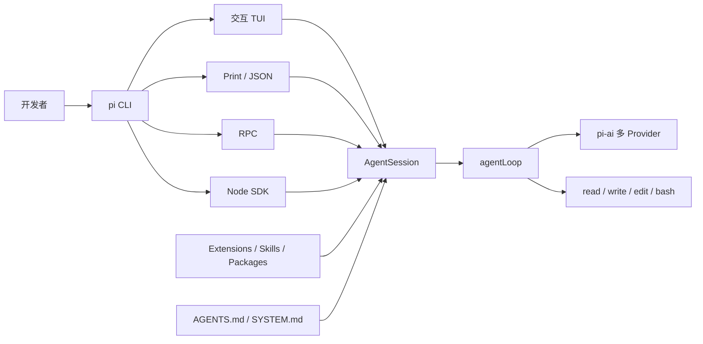
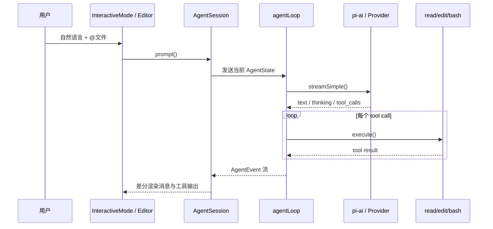
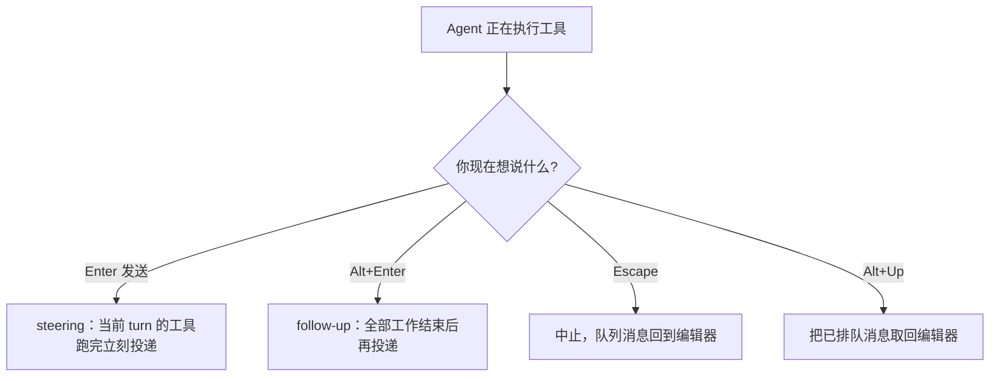
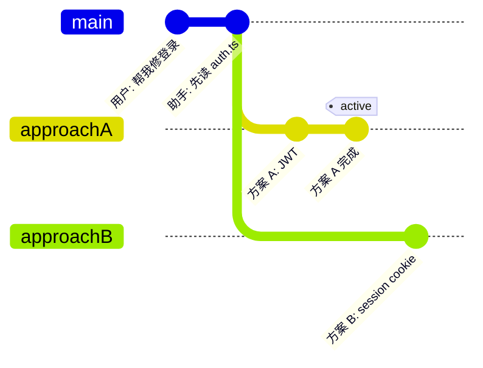
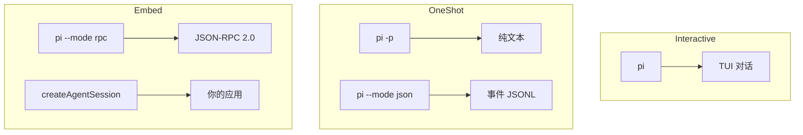
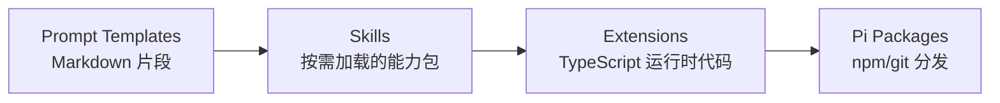
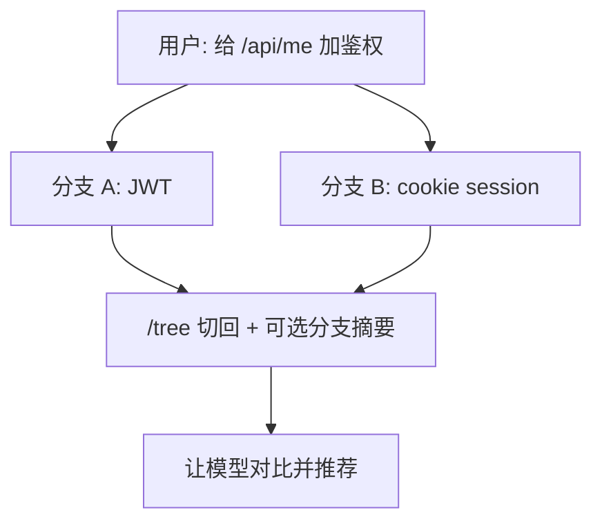

> **Pi** 是一套最小、可自扩展的终端编程 Agent Harness。核心只提供统一 LLM API、Agent 循环、TUI 和四个默认工具（`read` / `write` / `edit` / `bash`），其余能力通过 TypeScript Extensions、Skills、Prompt Templates、Themes 和 Pi Packages 按需叠加。它不替你规定工作流，而是让你把 Agent 改成自己的工具。

本文依据 [Pi GitHub 仓库](https://github.com/earendil-works/pi/)、[官方文档](https://pi.dev/docs/latest) 与 [DeepWiki 代码解析](https://deepwiki.com/earendil-works/pi/) 整理，覆盖安装、架构、交互使用、会话管理、扩展系统和从入门到实战的具体案例。文中功能状态截至 **2026 年 8 月**，对应 npm 包 `@earendil-works/pi-coding-agent` 约 **0.84.x**。

---

## 一、为什么需要 Pi

Claude Code、Codex、Cursor Agent 等工具把子 Agent、Plan Mode、权限弹窗、MCP、TODO 都做进了核心。这对“开箱即用”很方便，代价是工作流被产品绑定：你很难改压缩策略、换一套权限门、或把 Agent 嵌进自己的 CI/聊天机器人。

Pi 的选择相反：

- **核心保持很小**：默认只有读写文件和跑 shell。
- **用扩展补功能**：需要 Plan Mode、子 Agent、MCP、权限确认时，自己写或安装第三方包。
- **四种运行方式**：交互 TUI、一次性 print/JSON、stdin/stdout RPC、以及 Node SDK。
- **会话是树，不是线性日志**：可以原地分支、回退、克隆，不必另开一堆聊天窗口。

### Pi 与“功能齐全的 Coding Agent”的区别



Pi 的关键不是“再做一个 Claude Code”，而是把 **Agent 循环、Provider 抽象、会话树、TUI** 做成可嵌入的工具箱。官方哲学是：不内置 MCP、子 Agent、权限弹窗、Plan Mode、后台 bash；这些都可以用扩展或容器自己做。

---

## 二、核心架构

Pi 是 npm workspace 单体仓库，按层拆包。DeepWiki 把代码关系归纳成四层：

| 包 | 职责 | 关键实体 |
|---|---|---|
| `@earendil-works/pi-ai` | 统一多 Provider LLM API、模型发现、鉴权 | `Models`、`streamSimple`、`CredentialStore` |
| `@earendil-works/pi-agent-core` | Agent 循环、状态、工具调用、会话存储契约 | `Agent`、`agentLoop`、`AgentState`、`SessionRepo` |
| `@earendil-works/pi-tui` | 差分渲染 TUI、编辑器、快捷键 | `TUI`、`Editor`、`KeybindingsManager` |
| `@earendil-works/pi-coding-agent` | CLI、编程工具、SDK、会话管理 | `AgentSession`、`createAgentSession`、`InteractiveMode` |

另有 `@earendil-works/pi-telemetry`（遥测契约）以及独立仓库 [pi-chat](https://github.com/earendil-works/pi-chat)（Slack/聊天自动化）。

### 2.1 一次请求怎么走到工具执行



`pi-agent-core` 负责一轮（turn）生命周期：把消息转成 LLM 格式、流式解析、并行执行工具，并按助手消息中的原始顺序落盘结果。`pi-coding-agent` 再叠上 JSONL 会话树、压缩、项目信任、资源发现（Skills / Extensions / AGENTS.md）。

### 2.2 内置工具

默认暴露给模型的是四个工具；另外三个只读工具可通过 `--tools` 或 `defaultTools` 打开：

| 工具 | 作用 | 实现要点 |
|---|---|---|
| `read` | 读文件，支持图片 | 头部截断，约 50KB / 2000 行 |
| `write` | 创建或覆盖文件 | 按路径串行写入，避免并发损坏 |
| `edit` | 精确搜索替换 | 模糊匹配智能引号/破折号，尽量保留未改行 |
| `bash` | 执行 shell | 流式输出、ANSI 清洗、超限写临时日志 |
| `grep` | 文本搜索 | 优先走 ripgrep |
| `find` | glob 找文件 | 优先走 `fd` |
| `ls` | 列目录 | 带元数据 |

工具层支持 **Pluggable Operations**：同一套 `read`/`bash` 可以改接到 SSH、Docker 或 Gondolin 微虚拟机，这是沙箱扩展的基础。

---

## 三、安装与第一次会话

### 3.1 安装

需要 Node.js。官方推荐全局安装时带 `--ignore-scripts`，避免依赖生命周期脚本：

```bash
npm install -g --ignore-scripts @earendil-works/pi-coding-agent
```

也可以用安装脚本：

```bash
curl -fsSL https://pi.dev/install.sh | sh
```

卸载 CLI 不会删除 `~/.pi/agent/` 里的配置、凭据、会话和已装包。

### 3.2 Windows 注意

Pi 在 Windows 上需要 bash。查找顺序：

1. `~/.pi/agent/settings.json` 里的 `shellPath`
2. Git Bash：`C:\Program Files\Git\bin\bash.exe`
3. PATH 上的 `bash.exe`（Cygwin / MSYS2 / WSL）

多数情况安装 [Git for Windows](https://git-scm.com/download/win) 即可。自定义路径：

```json
{
  "shellPath": "C:/Program Files/Git/bin/bash.exe"
}
```

Windows Terminal 默认把 `Alt+Enter` 映射成全屏，会挡住 Pi 的 follow-up 快捷键，需要在终端设置里改掉。多行输入用 `Ctrl+Enter`，粘贴图片用 `Alt+V`。

### 3.3 认证

两种方式：订阅登录，或 API Key。

**订阅（推荐已有 Claude / ChatGPT / Copilot 的用户）：**

```text
pi
/login
```

内置订阅：Anthropic Claude Pro/Max、OpenAI ChatGPT Plus/Pro（Codex）、GitHub Copilot。

**API Key：**

```bash
export ANTHROPIC_API_KEY=sk-ant-...
pi
```

也可以在 `/login` 里选 API-key Provider，密钥会写入 `~/.pi/agent/auth.json`。国内常用的 DeepSeek、Kimi For Coding、MiniMax、ZAI Coding Plan、Xiaomi MiMo 等都在内置列表中。完整清单见 [providers.md](https://github.com/earendil-works/pi/blob/main/packages/coding-agent/docs/providers.md)。

启动前可用 `pi auth check` 预检凭据。

### 3.4 第一次对话

在项目目录启动：

```bash
cd /path/to/project
pi
```

然后输入：

```text
Summarize this repository and tell me how to run its checks.
```

模型会用 `ls`/`find`/`read`/`bash` 自己摸清仓库。完成后用 `/quit` 或连按两次 `Ctrl+C` 退出。会话会自动保存在 `~/.pi/agent/sessions/`，下次可用 `pi -c` 继续。

---

## 四、交互界面与日常操作

界面从上到下：

1. **启动头**：快捷键提示、已加载的 `AGENTS.md`、prompt templates、skills、extensions
2. **消息区**：用户消息、助手回复、工具调用与结果、通知、扩展 UI
3. **编辑器**：边框颜色表示 thinking 级别
4. **页脚**：工作目录、会话名、token/缓存用量（`↑` 输入、`↓` 输出、`R`/`W` 缓存读写、`CH` 命中率）、费用、上下文占用、当前模型

### 4.1 编辑器技巧

| 操作 | 方法 |
|---|---|
| 引用项目文件 | 输入 `@` 模糊搜索 |
| 路径补全 | Tab |
| 多行 | macOS/Linux：`Shift+Enter`；Windows Terminal：`Ctrl+Enter` |
| 外部编辑器 | `Ctrl+G`（`$VISUAL` / `$EDITOR` / Notepad / nano） |
| 粘贴图片 | `Ctrl+V`（Windows：`Alt+V`），或拖入终端 |
| 把命令输出发给模型 | `!npm run lint` |
| 只跑命令、不进上下文 | `!!git status` |

命令行也可以直接带文件：

```bash
pi @README.md "Summarize this"
pi @src/app.ts @src/app.test.ts "Review these together"
pi -p @screenshot.png "What's in this image?"
```

### 4.2 常用斜杠命令

| 命令 | 作用 |
|---|---|
| `/login` `/logout` | 管理 Provider 凭据 |
| `/model` | 切换模型（也可用 `Ctrl+L`） |
| `/llama` | 管理 llama.cpp 路由上的本地模型 |
| `/settings` | thinking、主题、消息投递、transport |
| `/resume` `/new` `/name` | 恢复、新建、命名会话 |
| `/session` | 查看会话文件、ID、token、费用 |
| `/tree` | 在会话树任意节点继续 |
| `/fork` `/clone` | 从旧提示分出新会话 / 复制当前分支 |
| `/compact [prompt]` | 手动压缩上下文 |
| `/trust` | 保存项目信任决定（需重启生效） |
| `/export` `/import` `/share` | 导出 HTML/JSONL、导入、分享 gist |
| `/reload` | 热加载 keybindings、extensions、skills、prompts、context files |
| `/hotkeys` | 显示全部快捷键 |

### 4.3 消息队列：边跑边纠正

Agent 还在干活时，不必干等：



`steeringMode` / `followUpMode` 可设为 `one-at-a-time`（默认）或 `all`。

常用快捷键：`Escape` 中止，连按两次打开 `/tree`；`Shift+Tab` 循环 thinking；`Ctrl+P` 在 scoped models 间切换；`Ctrl+O` 折叠工具输出；`Ctrl+T` 折叠思考块。

---

## 五、会话、分支与压缩

会话以 JSONL 存储，每条记录有 `id` 和 `parentId`，因此是一棵树，而不是只能往后追加的聊天记录。

```bash
pi -c                  # 继续最近一次会话
pi -r                  # 浏览并选择历史会话
pi --no-session        # 临时会话，不落盘
pi --name "my task"    # 启动时命名
pi --session <path|id> # 打开指定会话
pi --fork <path|id>    # 把指定会话整棵树复制成新文件
```

### 5.1 `/tree`、`/fork`、`/clone`



| 能力 | 结果 | 典型用途 |
|---|---|---|
| `/tree` | 同一文件内跳转 | 在原地试 A/B，历史全保留 |
| `/fork` | 新会话文件，从某条用户消息开始 | 把旧提示改一改另开一条线 |
| `/clone` | 新会话文件，复制当前活动分支 | 先备份再继续改 |

`/tree` 离开旧分支时，可以选择把被放弃的分支做成摘要挂到新位置，避免上下文丢失。

### 5.2 压缩（Compaction）

长会话会撑爆上下文。默认开启自动压缩：当 `contextTokens > contextWindow - reserveTokens` 时触发。默认预留 16384 token 给回复，保留最近约 20000 token 不摘要。

压缩是有损的，但完整历史仍在 JSONL 里，可用 `/tree` 回去。摘要格式固定为 Goal / Constraints / Progress / Decisions / Next Steps，并累计跟踪读过和改过的文件。

```json
{
  "compaction": {
    "enabled": true,
    "reserveTokens": 16384,
    "keepRecentTokens": 20000
  }
}
```

手动压缩：`/compact 重点保留 API 契约和失败的测试`。

---

## 六、给项目立规矩：Context Files 与信任

### 6.1 AGENTS.md

启动时 Pi 会拼接这些文件：

- `~/.pi/agent/AGENTS.md`（全局）
- 从 cwd 向上走的 `AGENTS.md` 或 `CLAUDE.md`
- 若某目录有 `AGENTS.override.md`，则覆盖该目录的 `AGENTS.md`/`CLAUDE.md`

```markdown
# Project Instructions

- 改代码后运行 `npm run check`。
- 不要在本地跑生产环境 migration。
- 回复保持简洁，先给结论再给改动。
- 不要提交 `.env` 和密钥文件。
```

系统提示本身可以用 `.pi/SYSTEM.md` 或 `~/.pi/agent/SYSTEM.md` 整份替换，或用 `APPEND_SYSTEM.md` 追加。禁用上下文文件：`--no-context-files` / `-nc`。

### 6.2 项目信任

交互模式遇到含 `.pi/settings.json`、项目扩展或 `.agents/skills` 的目录时，会询问是否信任。信任后才会加载项目级资源和扩展。

非交互模式（`-p`、`--mode json`、`--mode rpc`）不弹窗，走 `defaultProjectTrust`：`ask`/`never` 忽略项目资源，`always` 信任。单次覆盖：

```bash
pi -p --approve "Review this repo"
pi -p --no-approve "Review this repo"
```

`/trust` 只写入 `~/.pi/agent/trust.json`，当前进程不会重载，需要重启 Pi。

---

## 七、四种运行模式



### 7.1 Print 模式

适合脚本和 CI：

```bash
pi -p "Summarize this codebase"
cat README.md | pi -p "Summarize this text"
pi --name "release audit" -p "Audit this repository"
pi --tools read,grep,find,ls -p "Review the code, do not modify files"
```

### 7.2 JSON / RPC

`--mode json` 把所有事件打成 JSON lines，便于自己解析。`--mode rpc` 走 stdin/stdout 的 JSON-RPC 2.0，给非 Node 语言嵌入。RPC 必须按 `\n` 切记录，不要用会把 Unicode 分隔符当换行的 `readline`。

### 7.3 SDK

```typescript
import { createAgentSession, ModelRuntime, SessionManager } from "@earendil-works/pi-coding-agent";

const modelRuntime = await ModelRuntime.create();
const { session } = await createAgentSession({
  sessionManager: SessionManager.inMemory(),
  modelRuntime,
});

session.subscribe((event) => {
  if (event.type === "message_update" && event.assistantMessageEvent.type === "text_delta") {
    process.stdout.write(event.assistantMessageEvent.delta);
  }
});

await session.prompt("What files are in the current directory?");
```

需要换会话、fork、import 时，用 `createAgentSessionRuntime()`；这是内置 interactive / print / RPC 共用的一层。真实集成可参考 [openclaw/openclaw](https://github.com/openclaw/openclaw)。

---

## 八、定制系统：Templates、Skills、Extensions、Packages

Pi 把“可分享的能力”分成四层，由近到远、由轻到重：



### 8.1 Prompt Templates

把高频提示写成 Markdown，文件名即命令。`~/.pi/agent/prompts/review.md`：

```markdown
---
description: Review staged git changes
---
Review the staged changes (`git diff --cached`). Focus on:
- Bugs and logic errors
- Security issues
- Error handling gaps
Focus extra attention on: ${1:-the current diff}
```

在编辑器里输入 `/review auth` 就会展开。支持 `$1`、`$@`、`${1:-default}`。

### 8.2 Skills

遵循 [Agent Skills](https://agentskills.io) 标准：启动时只把 name/description 放进系统提示，真正执行时再 `read` 完整 `SKILL.md`（渐进披露）。

```
~/.pi/agent/skills/release-check/SKILL.md
```

```markdown
---
name: release-check
description: Run the pre-release checklist: tests, lint, changelog, and git cleanliness. Use when preparing a release.
---

# Release Check

1. Run `npm run check` and `npm test`.
2. Confirm `CHANGELOG.md` has an Unreleased section.
3. Ensure working tree is clean except intended files.
4. Summarize remaining blockers.
```

调用：`/skill:release-check`。也可以把 Claude Code / Codex 的 skill 目录挂进 settings：

```json
{
  "skills": ["~/.claude/skills", "~/.codex/skills"]
}
```

现成仓库：[badlogic/pi-skills](https://github.com/badlogic/pi-skills)、[anthropics/skills](https://github.com/anthropics/skills)。

### 8.3 Extensions

Extensions 是真正的运行时代码：自定义工具、命令、快捷键、事件拦截、TUI 组件。放在 `~/.pi/agent/extensions/` 或项目 `.pi/extensions/`，可用 `/reload` 热加载。

最小例子 `~/.pi/agent/extensions/hello.ts`：

```typescript
import type { ExtensionAPI } from "@earendil-works/pi-coding-agent";
import { Type } from "typebox";

export default function (pi: ExtensionAPI) {
  pi.on("session_start", async (_event, ctx) => {
    ctx.ui.notify("Extension loaded!", "info");
  });

  pi.registerTool({
    name: "greet",
    label: "Greet",
    description: "Greet someone by name",
    parameters: Type.Object({
      name: Type.String({ description: "Name to greet" }),
    }),
    async execute(_toolCallId, params) {
      return {
        content: [{ type: "text", text: `Hello, ${params.name}!` }],
        details: {},
      };
    },
  });

  pi.registerCommand("hello", {
    description: "Say hello",
    handler: async (args, ctx) => {
      ctx.ui.notify(`Hello ${args || "world"}!`, "info");
    },
  });
}
```

临时测试：`pi -e ./hello.ts`。官方 `examples/extensions/` 里有权限门、git checkpoint、plan-mode、SSH、子 Agent、甚至 Doom overlay。

### 8.4 Pi Packages

把上面三类资源打成包，用 npm 或 git 安装：

```bash
pi install npm:@foo/pi-tools
pi install git:github.com/user/repo@v1
pi list
pi update --all
pi config
```

`-l` 安装到项目 `.pi/`。**第三方包拥有当前用户的完整权限**，安装前必须审源码。`package.json` 用 `pi` 字段声明资源目录，没有清单时会按 `extensions/`、`skills/`、`prompts/`、`themes/` 约定目录自动发现。

---

## 九、入门到实战案例

下面按难度递进。前三个案例不需要写任何扩展；后面逐步引入模板、Skill、Extension、SDK 和沙箱。

### 案例 1：十分钟摸清一个陌生仓库

目标：第一次打开仓库，先搞清楚怎么跑、测什么、改哪里。

```bash
cd ~/src/unknown-app
pi --name "repo recon"
```

提示词：

```text
先不要改文件。总结这个仓库：技术栈、目录职责、如何安装和跑测试。
给出我接下来最该读的 5 个文件。
```

只读更稳妥：

```bash
pi --tools read,grep,find,ls --name "repo recon"
```

看完后 `/name 仓库侦察`，下次 `pi -r` 能按名字找回。

### 案例 2：对着两个文件做代码审查

```bash
pi @src/auth/login.ts @src/auth/login.test.ts "这两份文件一起看：登录逻辑有没有绕过测试的路径？只给问题和建议，先不要改代码。"
```

交互里也可以输入 `@login` 选文件。如果模型开始改文件，用 `Escape` 中止，再发一条 steering：`不要改代码，只输出审查清单。`

### 案例 3：用 AGENTS.md 固定团队约定

在仓库根目录放 `AGENTS.md`：

```markdown
# 约定

- 包管理器用 pnpm，不要生成 package-lock.json。
- 测试用 Vitest，改逻辑必须补测试。
- UI 文案用中文，代码标识符用英文。
- 提交信息格式：`type(scope): summary`。
```

重启或 `/reload`。之后让 Pi 修 bug，它会按约定选命令和风格。这是投入产出比最高的一步，建议每个仓库都做。

### 案例 4：只读 CI 审查

在 PR 检查里跑 Pi，不允许写文件：

```bash
export ANTHROPIC_API_KEY=...
git diff origin/main...HEAD > /tmp/pr.diff

pi -p --no-session --approve \
  --tools read,grep,find,ls \
  --thinking low \
  @/tmp/pr.diff \
  "根据 diff 列出必须修复的缺陷。按严重程度排序。不要给风格意见。"
```

没有保存的信任决定时，非交互模式默认忽略项目 `.pi` 资源；CI 里显式 `--approve` 或 `--no-approve`，避免行为随仓库变化。

### 案例 5：同一会话里试两条实现路径

需求：登录态可以走 JWT，也可以走 cookie session，先都试再决定。

```text
你: 给 /api/me 加上鉴权，先用 JWT。
（Pi 改完，测试通过）
你: /tree
     选回“加上鉴权”那条用户消息，改成：改用 httpOnly cookie session。
（新分支出现）
你: 对比两个分支的测试覆盖和迁移成本，推荐一个。
```



不要用 `/new` 开两个互不相干的会话——树结构的价值就是公共前缀可复用，费用和上下文都更省。

### 案例 6：把“评审暂存区”做成模板

`~/.pi/agent/prompts/review.md`：

```markdown
---
description: Review staged git changes
argument-hint: "[focus]"
---
运行 `git diff --cached` 和 `git status`。
按下面结构输出，不要直接 commit：

## 必须修
## 建议改
## 可以忽略

额外关注：$1
```

日常：改完代码，输入 `/review SQL 注入和鉴权`。模板负责稳定输出结构，模型负责看 diff。

### 案例 7：把发布检查做成 Skill

`~/.pi/agent/skills/release-check/SKILL.md` 用第八节的内容即可。准备发版时：

```text
/skill:release-check
```

Skill 比模板更适合“带步骤、可能跑脚本”的流程；模板适合“一段可展开的提示”。description 要写清 **何时使用**，否则模型不会自动加载。

进阶：把 `scripts/check.sh` 放进 skill 目录，在 SKILL.md 里写相对路径，让模型去执行，而不是把长脚本塞进上下文。

### 案例 8：危险命令确认门

Pi 默认没有权限弹窗。若你在本机裸跑，至少加一个确认扩展 `.pi/extensions/permission-gate.ts`：

```typescript
import type { ExtensionAPI } from "@earendil-works/pi-coding-agent";

const DANGEROUS = /\b(rm\s+-rf|git\s+push\s+--force|drop\s+table|mkfs)\b/i;

export default function (pi: ExtensionAPI) {
  pi.on("tool_call", async (event, ctx) => {
    if (event.toolName !== "bash") return;
    const command = String(event.input.command ?? "");
    if (!DANGEROUS.test(command)) return;

    const ok = await ctx.ui.confirm("危险命令", `允许执行？\n${command}`);
    if (!ok) return { block: true, reason: "用户拒绝危险命令" };
  });
}
```

项目里第一次启动会问是否信任；信任后这个扩展才会加载。官方示例还有 `protected-paths.ts`（禁止写 `.env`）、`git-checkpoint.ts`（每轮 stash）。

### 案例 9：把 Pi 嵌进自己的 Node 脚本

场景：每晚对仓库做一次“失败测试解读”，结果写到 `reports/`。

```typescript
import { mkdir, writeFile } from "node:fs/promises";
import { createAgentSession, ModelRuntime, SessionManager } from "@earendil-works/pi-coding-agent";

const modelRuntime = await ModelRuntime.create();
const { session } = await createAgentSession({
  cwd: process.cwd(),
  tools: ["read", "bash", "grep", "ls"],
  sessionManager: SessionManager.inMemory(),
  modelRuntime,
});

let report = "";
session.subscribe((event) => {
  if (event.type === "message_update" && event.assistantMessageEvent.type === "text_delta") {
    report += event.assistantMessageEvent.delta;
  }
});

await session.prompt(
  "运行 npm test。若失败，定位根因并给出最小修复步骤。不要修改源码，只写报告。",
);

await mkdir("reports", { recursive: true });
await writeFile(`reports/test-${Date.now()}.md`, report);
session.dispose();
```

`tools` 白名单里不要放 `write`/`edit`，从工具层禁止改代码。需要持久会话时把 `SessionManager.inMemory()` 换成 `SessionManager.create(cwd)`。

### 案例 10：Docker 沙箱里跑 Pi

Pi 默认继承启动它的用户权限。要隔离文件系统和网络，最简单的是把整个进程放进容器：

```dockerfile
FROM node:24-bookworm-slim

RUN apt-get update \
  && apt-get install -y --no-install-recommends bash ca-certificates git ripgrep \
  && rm -rf /var/lib/apt/lists/*
RUN npm install -g --ignore-scripts @earendil-works/pi-coding-agent

WORKDIR /workspace
ENTRYPOINT ["pi"]
```

```bash
docker build -t pi-sandbox -f Dockerfile.pi .

docker run --rm -it \
  -e ANTHROPIC_API_KEY \
  -v "$PWD:/workspace" \
  -v pi-agent-home:/root/.pi/agent \
  pi-sandbox
```

当前目录挂到 `/workspace`，改动会写回宿主机；用 named volume 存容器内的 `~/.pi/agent`，避免把宿主机的 `auth.json` 暴露进去。

需要“Pi 留在宿主机、工具进微虚拟机”时，用官方 Gondolin 扩展：认证和 TUI 在本机，`read`/`bash`/`!` 命令进 VM。更强的策略沙箱可看 NVIDIA OpenShell。

### 案例 11：用 llama.cpp 跑本地模型

适合内网或想把推理留在本机的场景。

1. 启动 **router 模式**（不要加 `--model`）：

```bash
llama-server \
  --models-dir ~/models \
  --no-models-autoload \
  --jinja \
  --host 127.0.0.1 \
  --port 8080 \
  -ngl 999 \
  -c 32768
```

2. 在 Pi 里：

```text
/login llama.cpp
# URL 默认 http://127.0.0.1:8080
/llama          # 加载或从 Hugging Face 下载 GGUF
/model          # 选已加载的模型
```

环境变量等价配置：`LLAMA_BASE_URL`、`LLAMA_API_KEY`。只有 **已加载** 的模型会出现在 `/model` 列表。可用 `curl http://127.0.0.1:8080/health` 排查路由是否起来。

### 案例 12：Windows 上的最小可用配置

```json
{
  "shellPath": "C:/Program Files/Git/bin/bash.exe",
  "defaultProvider": "anthropic",
  "defaultThinkingLevel": "medium",
  "theme": "dark",
  "httpProxy": "http://127.0.0.1:7890",
  "externalEditor": "code --wait"
}
```

把以上内容写入 `%USERPROFILE%\.pi\agent\settings.json`。若走代理，`httpProxy` 只在全局设置生效。VS Code 作外部编辑器时必须加 `--wait`，否则 Pi 会立刻继续。

验证：

```powershell
pi --version
pi auth check
cd D:\Code\my-app
pi "List the top-level files and how to run tests."
```

---

## 十、常用 CLI 速查

```bash
pi [options] [@files...] [messages...]
```

| 类别 | 常用选项 |
|---|---|
| 模式 | 默认交互；`-p` 打印；`--mode json`；`--mode rpc` |
| 模型 | `--provider anthropic`；`--model openai/gpt-4o`；`--model sonnet:high`；`--thinking high` |
| 会话 | `-c` / `-r` / `--session` / `--fork` / `--name` / `--no-session` |
| 工具 | `--tools read,grep`；`--exclude-tools bash`；`--no-builtin-tools`；`--no-tools` |
| 资源 | `-e ./ext.ts`；`--skill ./skill`；`--no-extensions`；`-nc` |
| 信任 / 网络 | `-a` / `-na`；`--offline` |
| 包管理 | `pi install` / `remove` / `list` / `update --all` / `config` |

环境变量：`PI_CODING_AGENT_DIR` 改配置目录；`PI_OFFLINE=1` 关闭启动时全部联网；`PI_SKIP_VERSION_CHECK=1` 只关版本检查；`PI_TELEMETRY=0` 关闭安装遥测（不影响版本检查）；`PI_CACHE_RETENTION=long` 延长 prompt cache。

---

## 十一、设计取舍：哪些功能故意不做

Pi 把这些能力留给扩展或外部工具，而不是写进核心：

| 常见 Agent 功能 | Pi 的替代 |
|---|---|
| MCP | 给 CLI 工具写 README/Skill，或自己写 MCP 扩展 |
| 子 Agent | tmux 再开一个 `pi`，或安装/自写 subagent 扩展 |
| 权限弹窗 | 容器 / Gondolin / 自己的 `tool_call` 门 |
| Plan Mode | 把计划写进文件，或用官方 `plan-mode/` 示例 |
| 内置 TODO | `TODO.md`，官方认为内置 TODO 会干扰模型 |
| 后台 bash | 用 tmux，可观察、可直接交互 |

这不是功能缺失清单，而是边界：核心保持可推理、可嵌入；工作流差异用包解决。作者说明见 [What if you don't need MCP?](https://mariozechner.at/posts/2025-11-02-what-if-you-dont-need-mcp/) 与 [Pi coding agent](https://mariozechner.at/posts/2025-11-30-pi-coding-agent/)。

---

## 十二、实践建议

1. **先写 `AGENTS.md`，再写扩展。** 大多数项目只需要约定命令和禁区。
2. **默认只给四个工具；审查任务收紧到只读。** `--tools read,grep,find,ls` 比事后后悔更便宜。
3. **长任务用 `/name` + `/tree`。** 命名方便找回，树比开五个会话更清晰。
4. **压缩有损，重要结论自己记到文件。** JSONL 里有全文，但模型下次只看到摘要。
5. **项目扩展等于在跑任意代码。** 只信任自己或审过的包；CI 用 `--no-approve` 除非你明确需要项目扩展。
6. **本机裸跑就加确认门或上容器。** 核心故意没有权限系统。
7. **Windows 先保证 Git Bash，再调快捷键。** 大量“跑不了命令”其实是找不到 bash。
8. **Steer 纠正方向，Follow-up 追加收尾。** 不要把“做完后再跑测试”用 Enter 插进当前 turn。
9. **本地模型走 llama.cpp router，不要 single-model 模式。** 加了 `--model` 就没有 `/llama` 列表。
10. **升级后以当前 `pi --help` 和文档为准。** Provider 列表和 CLI 旗标更新很快。

建议的学习路线：


---

## 十三、总结

Pi 适合这些人：

- 希望终端里有一个 **可改、可嵌、可不绑架工作流** 的 Coding Agent。
- 已经有 Claude / ChatGPT / Copilot 订阅，或有一堆国内 API Key，想用同一套 TUI。
- 需要把 Agent 放进脚本、CI、聊天机器人，而不是永远停在交互窗口。
- 愿意用少量 TypeScript 换来 Plan Mode、权限、沙箱，而不是接受产品内置的那一套。

不适合的情况也很明确：你只想要开箱即用的权限弹窗、MCP 市场和子 Agent 面板，那直接用 Claude Code 一类产品更省事。

先把 Pi 当成“带四个工具的可恢复终端 Agent”用起来，再按需加模板、Skill 和扩展。核心保持最小，能力按项目生长，这就是 Pi 的用法。

---

## 参考资源

- [earendil-works/pi](https://github.com/earendil-works/pi/)
- [pi.dev](https://pi.dev) 与 [最新文档](https://pi.dev/docs/latest)
- [DeepWiki：earendil-works/pi](https://deepwiki.com/earendil-works/pi/)
- [coding-agent README](https://github.com/earendil-works/pi/blob/main/packages/coding-agent/README.md)
- [Quickstart](https://github.com/earendil-works/pi/blob/main/packages/coding-agent/docs/quickstart.md)
- [Extensions](https://github.com/earendil-works/pi/blob/main/packages/coding-agent/docs/extensions.md)
- [Skills](https://github.com/earendil-works/pi/blob/main/packages/coding-agent/docs/skills.md)
- [SDK](https://github.com/earendil-works/pi/blob/main/packages/coding-agent/docs/sdk.md)
- [Sessions](https://github.com/earendil-works/pi/blob/main/packages/coding-agent/docs/sessions.md)
- [Compaction](https://github.com/earendil-works/pi/blob/main/packages/coding-agent/docs/compaction.md)
- [Containerization](https://github.com/earendil-works/pi/blob/main/packages/coding-agent/docs/containerization.md)
- [llama.cpp](https://github.com/earendil-works/pi/blob/main/packages/coding-agent/docs/llama-cpp.md)
- [Windows](https://github.com/earendil-works/pi/blob/main/packages/coding-agent/docs/windows.md)
- [npm：@earendil-works/pi-coding-agent](https://www.npmjs.com/package/@earendil-works/pi-coding-agent)
- [badlogic/pi-skills](https://github.com/badlogic/pi-skills)
- [RFC](https://rfc.earendil.com/keyword/pi/)

> Pi 仍在快速迭代。Provider 列表、CLI 旗标与会话格式可能随版本变化；自动化和扩展请以当前安装版本的 `pi --help`、`pi --version` 和 [官方文档](https://pi.dev/docs/latest) 为准。
