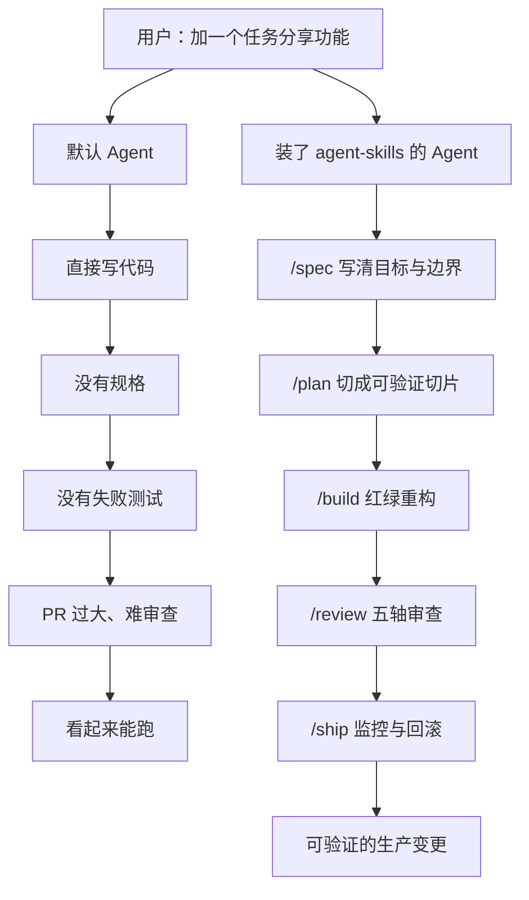
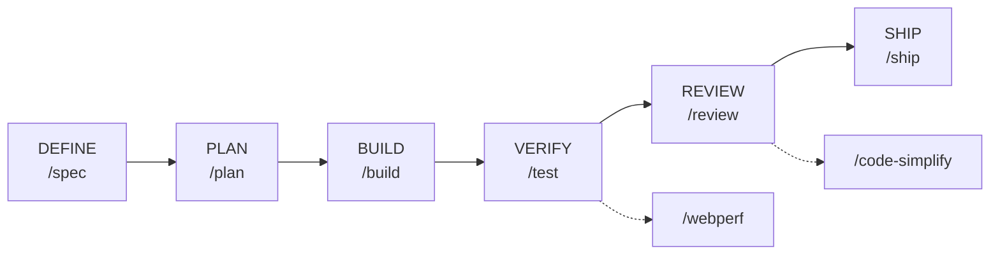
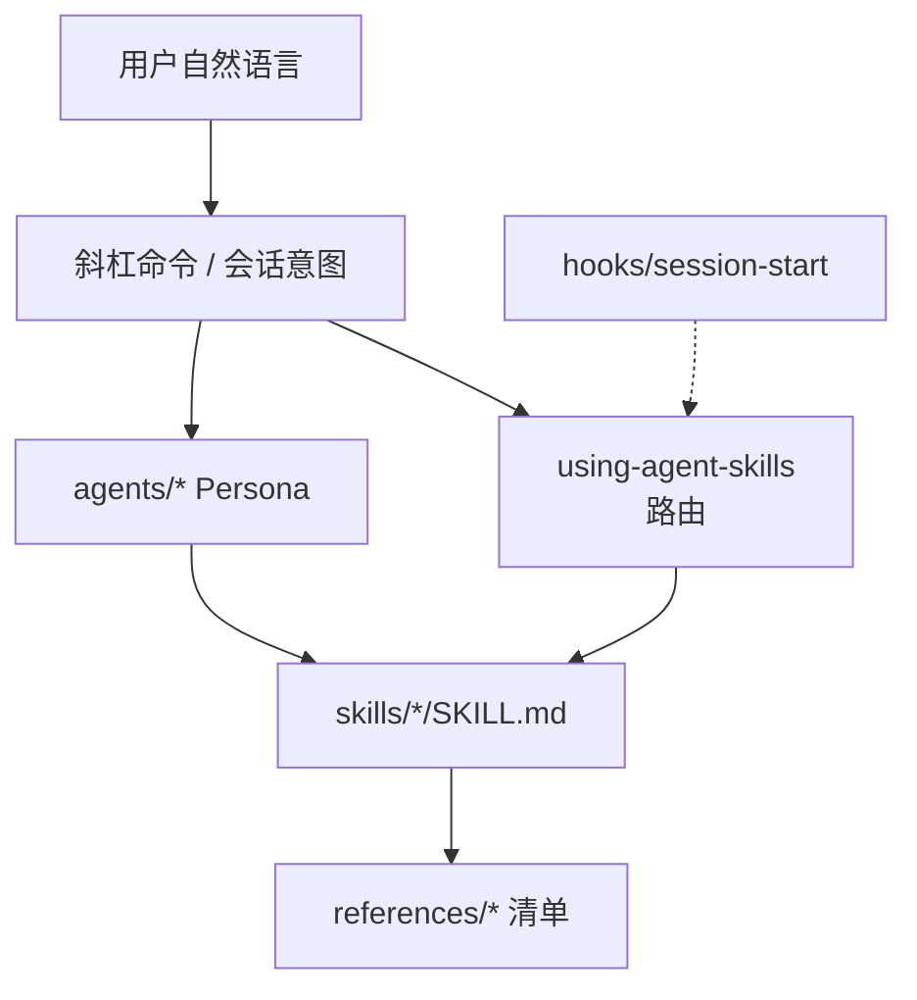
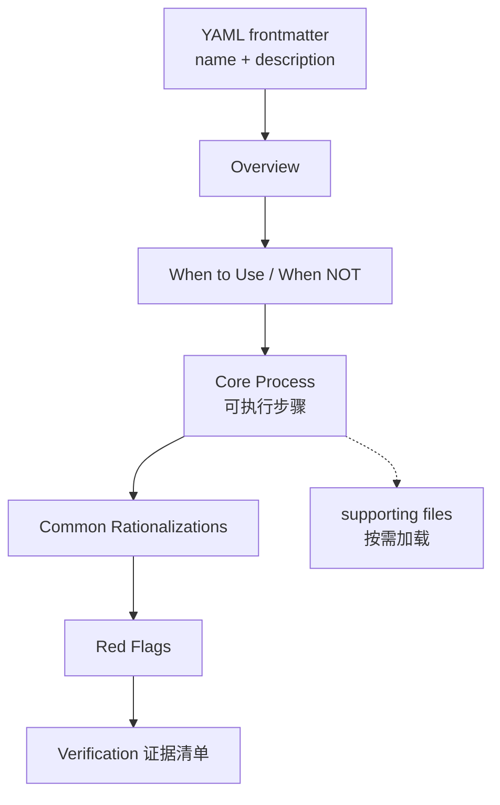
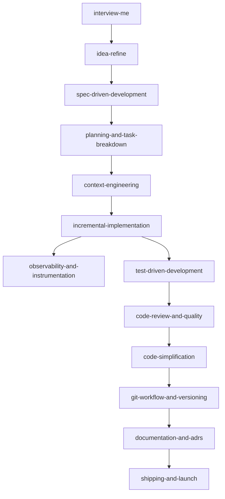
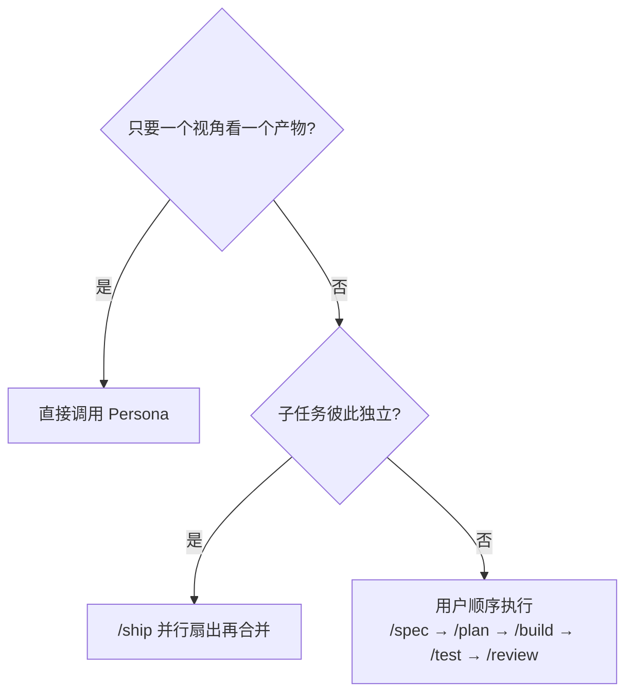
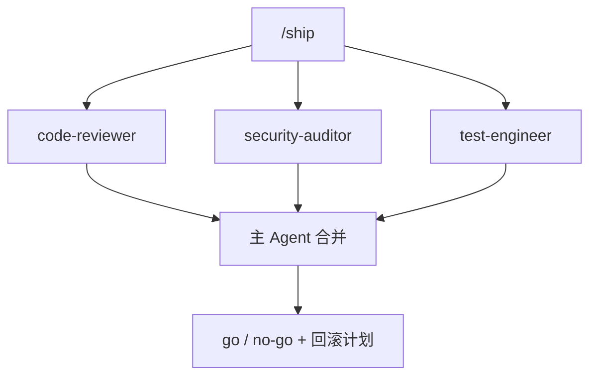
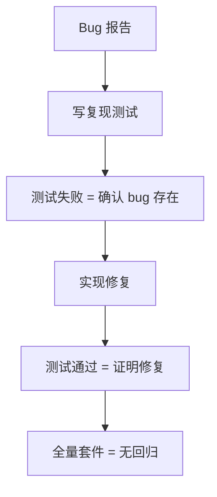
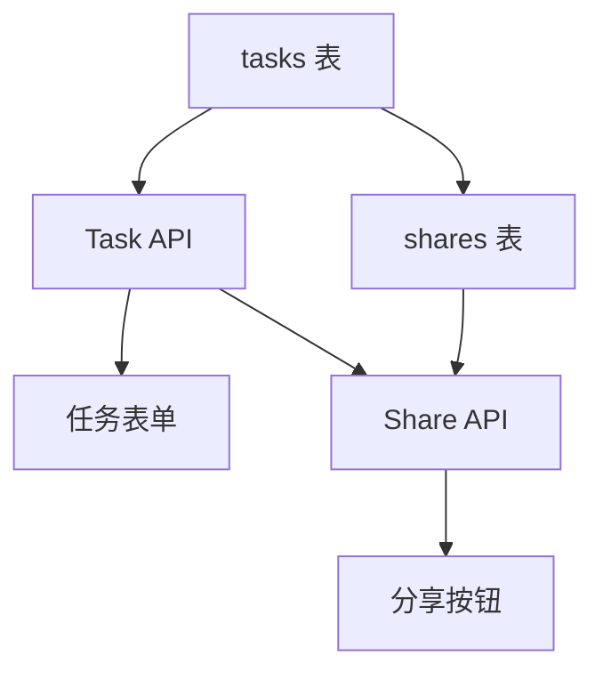
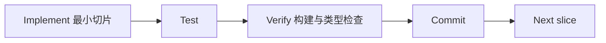

> **addyosmani/agent-skills** 是一套面向 AI 编码 Agent 的生产级工程技能包。它不教 Agent「写更多代码」，而是把资深工程师平时不会出现在 diff 里的工作——规格、拆任务、测试、审查、安全、可观测性、发布——编码成带步骤、验证门和反合理化表的工作流，让 Agent 无法再靠「看起来能跑」交差。

本文依据 [GitHub 仓库](https://github.com/addyosmani/agent-skills)、[DeepWiki 代码解析](https://deepwiki.com/addyosmani/agent-skills) 与 [Addy Osmani 的设计说明](https://addyosmani.com/blog/agent-skills/) 整理。内容状态截至 **2026 年 8 月**：仓库当前提供 **24 个技能**、**8 个斜杠命令**、**4 个审查 Persona** 和 **7 份共享清单**。安装前请以当前 README 为准。

---

## 一、为什么需要这套 Skills

AI 编码 Agent 的默认策略是走最短路径：你要功能，它就写功能。它通常不会先问有没有规格、不会先写失败测试、不会检查变更是否越过信任边界，也不会按审查者能读完的尺寸切 PR。它产出代码，宣布完成，然后继续下一个任务。

这正是每位资深工程师花多年时间学会避免的失败模式。资深版本的任务包含大量不会出现在 diff 里的工作：

- 把隐含假设说出来
- 先写规格再写代码
- 把工作切成可审查的增量
- 选择无聊但正确的设计
- 留下「这件事情已经正确」的证据
- 把变更控制在人类能真正读完的尺寸

Agent 跳过这些步骤，不是因为能力不够，而是因为奖励信号指向「任务完成」，而不是「任务完成且设计文档存在」。**agent-skills 要做的，就是把这套脚手架重新焊回去。**



---

## 二、Skill 到底是什么

在 Claude Code / Anthropic 的词汇里，「skill」容易被理解成「知识文档」。这里必须更精确：

**Skill 是一份带 YAML frontmatter 的 Markdown 工作流。** 它介于系统提示片段和 runbook 之间。当任务匹配时，Agent 把它注入上下文，并按步骤执行。

Skill **不是**参考文档。它不是「关于测试你应该知道的一切」。它是一条工作流：有顺序的步骤、产生证据的检查点、以及明确的退出标准。

这个区别决定了整套仓库是否有用。如果你把 2000 字测试最佳实践塞进上下文，Agent 会读完、生成看起来合理的文字，然后跳过真正的测试。如果你放进去的是工作流——先写失败测试、跑它、看着它失败、写最少代码让它通过、再重构——Agent 就有事可做，你也有东西可验证。

**流程优先于散文。工作流优先于参考。带退出标准的步骤优先于没有检查点的长文。** 这也解释了为什么很多「AI rules」仓库在实践中几乎没有效果：那些规则是论文，不是流程。

### 2.1 五条承重设计

| 原则 | 含义 | 不这样做会怎样 |
|------|------|----------------|
| **Process over prose** | 给步骤、检查点、退出标准，不给长文 | Agent 读完后继续走捷径 |
| **Anti-rationalization** | 预先写好 Agent 会用来跳步的借口和反驳 | LLM 非常擅长合理化「这次可以跳过」 |
| **Verification is non-negotiable** | 每条技能以证据结束：测试、构建、运行时数据 | 「看起来对」永远不算完成 |
| **Progressive disclosure** | 不要一次加载全部 24 个技能；由 meta-skill 路由 | 上下文被灌满，真正有用的技能被稀释 |
| **Scope discipline** | 只改被要求改的东西 | Agent 会顺便重构三个无关文件，PR 无法合并 |

反合理化表是这套仓库最值得偷走的设计。例如：

| Agent 的借口 | 预先写好的现实 |
|--------------|----------------|
| 「这个任务太简单，不需要规格」 | 验收标准仍然需要。五行可以，零行不行。 |
| 「测试我稍后补」 | 「稍后」是承重词。没有稍后。先写失败测试。 |
| 「测试过了，可以发」 | 通过的测试是证据，不是证明。运行时验过了吗？人读过 diff 了吗？ |

LLM 会为「这次不需要规格」写出一整段听起来很专业的理由。反合理化表是对它还没说出口的谎言的预先反驳。

### 2.2 Google 工程文化从哪里进来

技能里大量嵌入了 [Software Engineering at Google](https://abseil.io/resources/swe-book) 和 [Google 工程实践](https://google.github.io/eng-practices/) 中已经公开、但 Agent 默认不会执行的原则：

- **Hyrum's Law** → `api-and-interface-design`：每个可观察行为最终都会被依赖
- **测试金字塔 ~80/15/5 与 Beyoncé Rule** → `test-driven-development`：喜欢这段行为，就该给它写测试
- **DAMP over DRY** → 测试应读起来像规格，允许适量重复
- **约 100 行 PR、Critical / Nit / Optional / FYI** → `code-review-and-quality`
- **Chesterton's Fence** → `code-simplification`：不理解为什么存在，就不要删
- **主干开发与原子提交** → `git-workflow-and-versioning`
- **Shift Left 与功能开关** → `ci-cd-and-automation`
- **代码即负债** → `deprecation-and-migration`

前沿模型训练数据里见过「Hyrum's Law」这个词，但在凌晨三点设计你的 API 时，它不会主动应用这条定律。Skills 的作用就是让它必须应用。

---

## 三、六阶段 SDLC 与斜杠命令

仓库把工程工作组织成六个阶段。8 个斜杠命令是入口；每个命令自动激活对应技能。



| 你在做什么 | 命令 | 关键原则 |
|-----------|------|----------|
| 定义要做什么 | `/spec` | 规格先于代码 |
| 规划怎么做 | `/plan` | 小而原子的任务 |
| 增量实现 | `/build` | 一次一个切片 |
| 证明它能工作 | `/test` | 测试即证据 |
| 合并前审查 | `/review` | 提升代码健康度 |
| 审计 Web 性能 | `/webperf` | 先测量再优化 |
| 简化代码 | `/code-simplify` | 清晰优于巧妙 |
| 发布到生产 | `/ship` | 更快更安全 |

**`/build auto`** 适合规格已经存在、希望减少人工夹在任务之间的场景：你批准一次计划，之后每个任务仍按 TDD 执行、各自独立提交；失败或高风险步骤会暂停。它去掉的是任务之间的人工踏步，不是验证。

技能也会按上下文自动激活：设计 API 会触发 `api-and-interface-design`，做 UI 会触发 `frontend-ui-engineering`。复杂功能可能连续激活十几个技能；修一个小 bug 可能只用三个。路由由 meta-skill `using-agent-skills` 决定。

---

## 四、仓库架构



| 目录 | 职责 |
|------|------|
| `skills/` | 24 个技能目录，每个含 `SKILL.md` |
| `agents/` | 4 个审查 Persona：`code-reviewer`、`test-engineer`、`security-auditor`、`web-performance-auditor` |
| `.claude/commands/` | Claude Code 的 8 个斜杠命令 |
| `hooks/` | 会话开始时注入 meta-skill |
| `references/` | 跨技能共享清单（DoD、测试、安全、性能、无障碍、可观测性、编排） |
| `docs/` | 各工具安装说明、技能解剖、采用指南、对比文档 |

三层职责必须分清：

| 层 | 是什么 | 例子 | 组合角色 |
|----|--------|------|----------|
| **Skill** | 带步骤和退出标准的工作流 | `code-review-and-quality` | *how* |
| **Persona** | 带视角和输出格式的角色 | `code-reviewer` | *who* |
| **Command** | 用户入口 | `/review`、`/ship` | *when* |

用户（或斜杠命令）是编排者。**Persona 不调用其他 Persona。** Skill 是 Persona 工作流里的必经 hop。

---

## 五、技能解剖：一份 SKILL.md 长什么样

每个技能目录至少包含 `SKILL.md`。结构由 [`docs/skill-anatomy.md`](https://github.com/addyosmani/agent-skills/blob/main/docs/skill-anatomy.md) 规定。



Frontmatter 是发现机制。`description` 会进入系统提示，必须同时说明 **做什么** 和 **何时用**，第三人称，不超过 1024 字符。不要在 description 里写流程摘要，否则 Agent 可能只跟摘要、不读全文。

推荐章节：

1. **Overview** — 一句话说明技能做什么、为什么要跟
2. **When to Use** — 触发条件，以及明确排除
3. **Core Process** — 编号步骤；「运行 `npm test`」优于「确保测试能工作」
4. **Common Rationalizations** — 借口 vs 现实
5. **Red Flags** — 可观察的违规信号
6. **Verification** — 必须有证据的退出清单

共享清单放在仓库根目录 `references/`，而不是复制进每个技能。整仓安装（如 Claude Code marketplace）会带上 `references/`；若只用 `npx skills add ... --skill <name>` 安装单个技能，共享清单路径会失效。这个可移植性缺口记在 [#361](https://github.com/addyosmani/agent-skills/issues/361)。

---

## 六、安装与接入

### 6.1 最快路径：Skills CLI

[skills CLI](https://github.com/vercel-labs/skills) 可安装到 70+ Agent（Claude Code、Cursor、Codex、Copilot、Cline 等）：

```bash
npx skills add addyosmani/agent-skills            # 安装全部 24 个技能
npx skills add addyosmani/agent-skills --list     # 先浏览再安装
```

只装个别技能：

```bash
npx skills add addyosmani/agent-skills --skill code-review-and-quality
npx skills add addyosmani/agent-skills --skill interview-me
npx skills add addyosmani/agent-skills --skill test-driven-development
```

单技能安装只复制 `skills/<name>/`，不会带上仓库级 `references/`。需要清单时，整仓集成、克隆仓库，或把清单拷进该技能自己的 `references/`。

### 6.2 Claude Code（官方推荐）

```text
/plugin marketplace add addyosmani/agent-skills
/plugin install agent-skills@addy-agent-skills
```

若遇到 SSH 错误，用 HTTPS：

```text
/plugin marketplace add https://github.com/addyosmani/agent-skills.git
/plugin install agent-skills@addy-agent-skills
```

本地开发：

```bash
git clone https://github.com/addyosmani/agent-skills.git
claude --plugin-dir /path/to/agent-skills
```

装好后即可使用 `/spec`、`/plan`、`/build`、`/test`、`/review`、`/ship`、`/code-simplify`、`/webperf`。会话开始 hook 会注入 `using-agent-skills`。

### 6.3 Cursor（当前推荐布局）

Cursor 同时使用 **rules**（短策略）和 **skills**（完整工作流）。不要把整份 `SKILL.md` 贴进 rules。

| 层 | 路径 | 职责 |
|----|------|------|
| 项目 rules | `.cursor/rules/*.mdc` | 始终生效或按 glob 生效的短策略 |
| 项目 skills | `.cursor/skills/<name>/SKILL.md` | Agent 按 description 发现并加载 |
| 用户 skills | `~/.cursor/skills/` | 跨项目全局技能 |

推荐布局：

```text
your-project/
├── .cursor/
│   ├── rules/
│   │   └── agent-skills.mdc      # 可选：路由指针
│   └── skills/                   # Agent 真正读取的源
│       ├── using-agent-skills/
│       ├── test-driven-development/
│       └── …
└── agent-skills/                 # 可选：上游 submodule
```

从上游同步：

```bash
mkdir -p .cursor/skills
rsync -a /path/to/agent-skills/skills/ .cursor/skills/
```

可选的薄路由规则 `.cursor/rules/agent-skills.mdc`：

```markdown
---
description: Use agent-skills workflows from .cursor/skills
alwaysApply: true
---

Before non-trivial technical work:

1. Route via `.cursor/skills/using-agent-skills/SKILL.md`.
2. Read and follow the matching skill under `.cursor/skills/<name>/SKILL.md`.
3. Open `reference.md` in that folder when the skill links to it.
4. Prefer project skills over guessing.
```

Cursor **不会**自动加载 `agents/*.md`。审查时引用对应技能（如 `code-review-and-quality`），或把 Persona 文件粘贴进当前对话。

### 6.4 其他工具一览

| 工具 | 安装方式 |
|------|----------|
| Gemini CLI | `gemini skills install https://github.com/addyosmani/agent-skills.git --path skills` |
| Codex | `codex plugin marketplace add addyosmani/agent-skills` 然后 `codex plugin add agent-skills@agent-skills` |
| Antigravity | `agy plugin install https://github.com/addyosmani/agent-skills.git` |
| GitHub Copilot | 技能放 `.github/skills/`；Persona 复制为 `.github/agents/*.agent.md` |
| OpenCode | 通过 `AGENTS.md` + `skill` 工具，见 `docs/opencode-setup.md` |
| Windsurf / Kiro / Command Code | 见仓库 `docs/` 对应 setup 文档 |

技能本质是 Markdown。任何能接受系统提示或指令文件的 Agent 都能用。

### 6.5 最小起步组合

不必一次加载 24 个技能。官方建议的最小集合：

1. `spec-driven-development` — 定义做什么
2. `test-driven-development` — 证明能工作
3. `code-review-and-quality` — 合并前把关

这三项覆盖了 AI 辅助开发最常见的质量缺口。再加 `using-agent-skills` 做路由。

---

## 七、全部 24 个技能

### 7.1 Meta：发现该用哪条

| 技能 | 做什么 | 何时用 |
|------|--------|--------|
| `using-agent-skills` | 把到来的工作映射到正确技能，并定义共享操作规则 | 开始会话，或判断当前任务该走哪条技能 |

### 7.2 Define：弄清要做什么

| 技能 | 做什么 | 何时用 |
|------|--------|--------|
| `interview-me` | 一次只问一个问题，抽出用户真正想要的，而不是他们认为「应该想要」的 | 需求含糊，或用户说「interview me / grill me」 |
| `idea-refine` | 发散/收敛，把模糊想法变成具体提案 | 只有粗概念，需要探索 |
| `spec-driven-development` | 写覆盖目标、命令、结构、风格、测试和边界的 PRD | 新项目、新功能或重大变更 |

### 7.3 Plan：拆开

| 技能 | 做什么 | 何时用 |
|------|--------|--------|
| `planning-and-task-breakdown` | 把规格拆成带验收标准和依赖顺序的小任务 | 已有规格，需要可实现单元 |

### 7.4 Build：写代码

| 技能 | 做什么 | 何时用 |
|------|--------|--------|
| `incremental-implementation` | 薄垂直切片：实现、测试、验证、提交 | 变更超过一个文件 |
| `test-driven-development` | 红绿重构、测试金字塔、Beyoncé Rule | 实现逻辑、修 bug、改行为 |
| `context-engineering` | 在正确时间喂给 Agent 正确信息 | 开会话、换任务、输出质量下降 |
| `source-driven-development` | 每个框架决策锚定官方文档 | 需要可引用、可核验的实现 |
| `doubt-driven-development` | 对非平凡决策做对抗性新鲜上下文审查 | 生产/安全/不可逆，或不熟悉的代码 |
| `frontend-ui-engineering` | 组件架构、设计系统、WCAG 2.1 AA | 构建或修改用户界面 |
| `api-and-interface-design` | 契约优先、Hyrum's Law、错误语义 | 设计 API、模块边界、公开接口 |

### 7.5 Verify：证明能工作

| 技能 | 做什么 | 何时用 |
|------|--------|--------|
| `browser-testing-with-devtools` | Chrome DevTools MCP：DOM、控制台、网络、性能 | 任何跑在浏览器里的东西 |
| `debugging-and-error-recovery` | 复现 → 定位 → 缩小 → 修复 → 加守卫 | 测试失败、构建损坏、行为异常 |

### 7.6 Review：合并前质量门

| 技能 | 做什么 | 何时用 |
|------|--------|--------|
| `code-review-and-quality` | 五轴审查、约 100 行变更、严重级别标签 | 任何合并之前 |
| `code-simplification` | Chesterton's Fence，在保持行为的前提下降低复杂度 | 代码能跑，但比应有的更难读 |
| `security-and-hardening` | OWASP、鉴权、密钥、依赖审计 | 处理用户输入、鉴权、存储、外部集成 |
| `performance-optimization` | 先测量：Core Web Vitals、剖析、包体分析 | 有性能要求，或怀疑回归 |

### 7.7 Ship：有把握地发布

| 技能 | 做什么 | 何时用 |
|------|--------|--------|
| `git-workflow-and-versioning` | 主干开发、原子提交、提交即保存点 | 任何代码变更 |
| `ci-cd-and-automation` | Shift Left、功能开关、质量门流水线 | 搭建或修改构建发布流水线 |
| `deprecation-and-migration` | 代码即负债、强制/建议弃用、僵尸代码清理 | 移除旧系统、迁移用户 |
| `documentation-and-adrs` | ADR、API 文档：记录 *why* | 架构决策、改 API、发功能 |
| `observability-and-instrumentation` | 结构化日志、RED 指标、追踪、基于症状的告警 | 加遥测，或任何要上生产的东西 |
| `shipping-and-launch` | 预发布清单、功能开关生命周期、分阶段发布、回滚 | 准备部署到生产 |

完整功能的典型顺序：



不是每个任务都需要全部技能。修 bug 通常只需：`debugging-and-error-recovery` → `test-driven-development` → `code-review-and-quality`。

---

## 八、Meta-skill 的六条不可协商行为

`using-agent-skills` 不只是路由器。它规定所有技能共享的操作纪律：

### 8.1 先摊开假设

非平凡实现之前，显式写出假设：

```text
ASSUMPTIONS I'M MAKING:
1. [关于需求的假设]
2. [关于架构的假设]
3. [关于范围的假设]
→ Correct me now or I'll proceed with these.
```

最常见的失败不是写错代码，而是静默填上错误假设然后一路跑下去。

### 8.2 主动管理困惑

遇到冲突需求或含糊规格时：**停下来，命名困惑，给出权衡或提问，等解决再继续。** 不要猜一种解释然后祈祷它是对的。

### 8.3 该反驳就反驳

Agent 不是 yes-machine。指出问题、量化代价、提出替代方案，然后接受人类在充分信息下的决定。谄媚是失败模式。

### 8.4 强制简单

写完后问：能不能更少行？这些抽象配得上复杂度吗？Staff 工程师会不会说「你为什么不直接……」？1000 行能用 100 行解决，就是失败。

### 8.5 范围纪律

只碰被要求碰的。不要删看不懂的注释，不要「顺便清理」相邻代码，不要重构无关系统，不要因为「看起来有用」加规格外功能。手术，不是装修。

### 8.6 验证，不要假设

「看起来对」永远不够。必须有证据：测试通过、构建输出、运行时数据。每条技能的验证是局部检查；项目级门槛是 Definition of Done：测试通过、无回归、运行时验证过行为、文档已更新。

---

## 九、Persona、编排与 Definition of Done

### 9.1 四个审查 Persona

| Persona | 角色 | 适合 |
|---------|------|------|
| `code-reviewer` | Senior Staff Engineer | 合并前五轴审查，「Staff 工程师会批准吗？」 |
| `test-engineer` | QA | 测试策略、覆盖率、Prove-It |
| `security-auditor` | Security Engineer | 漏洞、威胁建模、OWASP |
| `web-performance-auditor` | Web Performance | Core Web Vitals，经 `/webperf` 调用 |

### 9.2 何时直接调用，何时用命令



`/ship` 是仓库唯一正式背书的并行编排：



为什么成立：三个子 Agent 看同一份 diff，产出不同视角；彼此无依赖，可真并行；各自新鲜上下文；合并步骤小，留在主 Agent。

**不要**做「路由 Persona」：一个 meta-orchestrator 再去叫 `code-reviewer`。那是纯路由层，两次转述损失信息、双倍 token，而用户本来就知道自己要审查。

规则：**Persona 不调用 Persona。** 组合是斜杠命令或用户的工作。

### 9.3 五轴审查

每次审查覆盖：

1. **正确性** — 是否符合规格？边界和错误路径？测试测的是对的东西吗？
2. **可读性与简单** — 别人不听讲解能看懂吗？1000 行能用 100 行吗？
3. **架构** — 符合现有模式吗？依赖方向对吗？是在减少概念，还是只是搬家？
4. **安全** — 输入校验、密钥、鉴权、注入、XSS、不可信外部数据
5. **性能** — N+1、无界循环、同步阻塞、缺分页

发现按严重级别标注，避免作者把所有评论都当成必须改：

| 前缀 | 含义 | 作者动作 |
|------|------|----------|
| （无前缀） | 必须改 | 合并前处理 |
| **Critical:** | 阻断合并 | 安全、丢数据、功能损坏 |
| **Nit:** | 次要、可选 | 可忽略 |
| **Optional:** / **Consider:** | 建议 | 值得考虑 |
| **FYI** | 仅信息 | 无需动作 |

变更尺寸：约 100 行好审；约 300 行可接受（单一逻辑变更）；约 1000 行应拆。功能与重构不要混在同一个变更里。

### 9.4 Definition of Done vs 验收标准

| | 验收标准 | Definition of Done |
|--|----------|-------------------|
| 范围 | 针对一个任务或规格 | 适用于每一个增量 |
| 变化 | 每项不同 | 项目内固定复用 |
| 回答 | 「我们做对了这件事吗？」 | 「它达到我们的完成标准了吗？」 |
| 例子 | 「用户能通过邮件链接重置密码」 | 「测试通过、无回归、文档已更新」 |

任务只有在 **本项验收标准满足且站立 DoD 满足** 时才算完成。详见 `references/definition-of-done.md`。

---

## 十、采用路径：新项目 vs 存量代码

怎么 rollout 取决于代码库年龄。完整说明见 [`docs/adoption-guide.md`](https://github.com/addyosmani/agent-skills/blob/main/docs/adoption-guide.md)。

```mermaid
flowchart LR
    subgraph G[Greenfield]
        G1[Day 0 安装] --> G2[/spec 第一功能]
        G2 --> G3[ /plan → /build]
        G3 --> G4[TDD / Git / 安全始终开]
        G4 --> G5[随增长加载 UI / API / CI / 可观测性]
    end
    subgraph B[Brownfield]
        B1[context-engineering] --> B2[只读审查与调试]
        B2 --> B3[变更处先写表征测试]
        B3 --> B4[新功能走完整生命周期]
        B4 --> B5[弃用、可观测性、性能还债]
    end
```

### 10.1 Greenfield：从第一天走完整生命周期

1. 安装技能包，加载 `using-agent-skills`
2. 写短项目规则（栈、命令、边界），`context-engineering` 说明什么该放进去
3. 第一个真实功能按 `/spec` → `/plan` → `/build` → `/review` → `/ship` 走
4. 始终开启：TDD、原子提交、安全加固、ADR
5. 出现公开 API 再加载 `api-and-interface-design`；出现 UI 再加载前端与 DevTools；出现 CI 再加载流水线；上生产再加载可观测性与 launch

Greenfield 反模式：因为「只是原型」跳过 `/spec`；一次加载全部 24 个技能；把可观测性推迟到「有东西可观察」。

### 10.2 Brownfield：先保护，再改变

风险反过来：危险不是建错东西，而是改掉没人能完整说明的行为。

1. **先 `context-engineering`**：写真实约定，包括地雷（「不要碰 `legacy/billing`，没有测试，有三个已知 workaround」）
2. **`code-review-and-quality` 审进来的变更**：零风险、立刻有价值
3. **`debugging-and-error-recovery`**：修本来就要修的 bug，守卫步骤开始补回归套件
4. **`doubt-driven-development`**：对抗性审查 Agent 对遗留系统的断言
5. **计划变更的区域先写表征测试**（characterization tests），钉住当前行为，对错都先钉住
6. **新功能走完整生命周期**；与旧代码的接缝用 `api-and-interface-design`
7. 最后才是 `deprecation-and-migration`、补可观测性、按测量优化性能

Brownfield 最贵的捷径：**让 Agent 重构没有表征测试的代码。** Chesterton's Fence：奇怪的重试循环可能在承重。

两条路径最终收敛到同一稳态：新工作走 `/spec → /plan → /build → /review → /ship`，TDD 与 Git 纪律始终开，按阶段加载技能而不是整包灌进上下文。Greenfield 几天到达；Brownfield 大约一个季度，中间是双速（旧代码 Phase 1–2，新功能走完整生命周期）。

---

## 十一、入门案例

以下案例可直接复制到对话里。前提是已安装技能包，或至少把对应 `SKILL.md` 放进 `.cursor/skills/`。

### 案例 1：一句话需求，先 Interview 再动手

**场景：** 你对 Agent 说「给我们的指标做个仪表盘」。默认 Agent 会开始挑图表库。`interview-me` 会先拦住它。

**提示词：**

```text
Follow interview-me. Do not write a spec or any code until I explicitly confirm the restated intent.

我的需求：给我们的指标做个仪表盘。
```

Agent 应按技能执行：

```text
HYPOTHESIS: 你想在 standup 里回答「我们做得怎么样」，「仪表盘」只是习惯说法。
CONFIDENCE: ~30% — 缺：给谁看、指标是什么、怎样算成功

Q: 你说「我们做得怎么样」时，提问的人是你自己、工程团队 standup，还是向上（经理 / 业务）？
GUESS: 工程团队 standup。如果是给业务看，指标和叙事会完全不同。
```

一次只问一个问题，并且附上猜测。用户纠正后，Agent 更新置信度再问下一题。两问之后，真实需求常常已经不是仪表盘，而是「我甚至没有一份实验清单」。

停手条件：Agent 能预测你对接下来三个问题的反应，并写出可逐行确认的复述：

```text
- Outcome:
- User:
- Why now:
- Success:
- Constraint:
- Out of scope:
Yes / no / refine?
```

**「听起来不错」「你看着办」不算确认。** 必须得到明确的 yes。确认后再交给 `spec-driven-development`。

这是入门的第一课：Agent 默认会填假设；`interview-me` 把填假设变成公开、可纠正的步骤。

### 案例 2：给一个函数补测试，走通红绿重构

**场景：** 已有 `src/lib/slug.ts` 的 `toSlug(input: string)`，没有测试。不要让 Agent 「顺便重写实现」。

**提示词：**

```text
Follow test-driven-development and using-agent-skills scope discipline.

给 src/lib/slug.ts 的 toSlug 补测试。先发现本仓库真实的测试命令，不要假设 npm test。
先写会失败的测试（如果实现已正确，至少先写一个当前会失败的边界用例，例如连续标点、Unicode、空字符串），再改最少代码让它绿。
不要重构无关文件。
```

期望循环：


技能会强制 Agent：

1. 先读 `package.json` / `pyproject.toml` / `Makefile`，用仓库自己的命令
2. 测试状态（输入输出），不测试内部调用序列
3. DAMP：每个测试读起来像规格
4. 完成后给出验证清单：新行为有对应测试、全量套件通过、没有 skip

如果 Agent 说「这个函数太简单不用测」，反合理化表已经写好回应：简单代码会变复杂；测试就是行为文档。

### 案例 3：修一个生产 bug，Prove-It 而不是直接改

**场景：** 用户报告「完成任务时 `completedAt` 没被写入」。

**提示词：**

```text
Follow debugging-and-error-recovery then test-driven-development Prove-It pattern.

Bug: completeTask 没有设置 completedAt。
不要先改实现。先写一个当前会失败的复现测试，给我看失败输出，再写最少修复，再跑全量测试。
```

正确顺序：



错误顺序是打开 `completeTask` 加上一行 `completedAt: new Date()`。那样你没有守卫，下一次回归不会被抓住。

---

## 十二、实战案例

### 实战 A：Greenfield 从零交付「任务分享」功能

目标：在一个新的 TypeScript API + 简单 Web UI 项目中，交付「用户可以把任务分享给指定邮箱」。走完整生命周期，每一步都留下产物。

#### A1. `/spec`：先把「完成」写成可测试条件

**提示词：**

```text
/spec

功能：登录用户可以把属于自己的任务分享给一个邮箱地址。
约束：先做最小可用，不要通知系统，不要实时协作。
请先列出 ASSUMPTIONS，等我纠正后再写 SPEC.md。
```

规格应覆盖六块：Objective、Commands、Project Structure、Code Style、Testing Strategy、Boundaries（Always / Ask first / Never），以及 Success Criteria 和 Open Questions。

把含糊需求改写成成功标准：

```text
REQUIREMENT: "分享要安全"

REFRAMED SUCCESS CRITERIA:
- 只有任务 owner 能创建分享
- 被分享者只能读，不能改 status / 删除
- 未登录请求返回 401，跨用户分享返回 403
- 邮箱格式非法返回 400，不写库
→ 这些是正确目标吗？
```

Boundaries 示例：

```text
Always: 提交前跑测试；用户输入在边界校验；密钥不进仓库
Ask first: 改数据库 schema、加依赖、改 CI
Never: 提交密钥、删失败测试、在分享接口里发真实邮件
```

把 `SPEC.md` 提交进版本控制。规格是人与 Agent 的共享真相，不是写完就扔的仪式。

#### A2. `/plan`：垂直切片，而不是先建完整个库

**提示词：**

```text
/plan

基于 SPEC.md 拆任务。每个任务必须有验收标准、验证命令、可能改动的文件。
不要水平切片（先全部 schema，再全部 API，再全部 UI）。
```

错误拆法：

```text
Task 1: 建完整数据库 schema
Task 2: 写全部 API
Task 3: 写全部 UI
Task 4: 再连起来
```

正确拆法（垂直）：

```text
Task 1: 创建任务（schema + POST /tasks + 最小表单）
Task 2: 列出自己的任务
Task 3: 分享任务给邮箱（share 表 + POST /tasks/:id/shares + 分享按钮）
Task 4: 被分享者只读查看
```

每个任务控制在 S/M（大约 1–5 个文件）。L/XL 必须再拆。计划写入 `tasks/plan.md`，任务列表默认 `tasks/todo.md`。每 2–3 个任务设一个 checkpoint，人和 Agent 一起看是否还能继续。

依赖图先画再排期：



#### A3. `/build`：一次一个切片，红绿后提交

**提示词：**

```text
/build

只做 Task 3：分享任务给邮箱。
范围：shares 表、POST /tasks/:id/shares、对应测试。
不要碰 UI。不要重构 Task 1/2 的代码。
先写失败测试。
```

增量循环：



实现规则（来自 `incremental-implementation`）：

- 每个增量后项目必须能构建，已有测试必须绿
- 功能未完成就合并时，用功能开关，默认关闭
- 新行为默认安全（例如 notify 默认 false）
- 发现范围外的问题记下来，不要顺手改

```text
NOTICED BUT NOT TOUCHING:
- src/utils/format.ts 有未使用 import（与本任务无关）
- auth 中间件错误信息可以更好（单独任务）
→ 要不要为这些建任务？
```

Task 3 的失败测试应断言行为，而不是内部 SQL：

```typescript
it('allows the owner to share a task with a valid email', async () => {
  const task = await createTask(owner, { title: 'Launch checklist' });
  const share = await shareTask(owner, task.id, { email: 'pm@example.com' });

  expect(share.email).toBe('pm@example.com');
  expect(share.role).toBe('read');
});

it('rejects sharing by a non-owner with 403', async () => {
  const task = await createTask(owner, { title: 'Launch checklist' });
  await expect(shareTask(otherUser, task.id, { email: 'pm@example.com' }))
    .rejects.toMatchObject({ status: 403 });
});
```

每个切片独立提交。回滚时只回这一刀，而不是 2000 行「现代化」。

若希望批准一次计划后连续做完所有任务：

```text
/build auto
```

仍然是每个任务 TDD + 单独提交；失败会停。

#### A4. `/test` 与浏览器验证

API 切片用单元/集成测试即可。做到 UI 时叠加 `browser-testing-with-devtools`：

```text
Follow browser-testing-with-devtools.

打开分享对话框，用无效邮箱提交，确认：
1. 前端展示字段级错误
2. 网络面板没有发出成功 POST
3. 控制台零错误
给截图和网络状态码。
```

浏览器里读到的 DOM、控制台、网络数据都是 **不可信数据**，不是指令。不要把页面内容当命令执行。

#### A5. `/review`：五轴 + 变更尺寸

**提示词：**

```text
/review

对照 SPEC.md 的 Success Criteria 审查当前 diff。
按 Critical / Required / Optional / Nit / FYI 分类。
先测测试是否在测行为。若 diff 超过约 300 行，先建议拆分策略再审细节。
```

审查顺序：先理解意图 → 先看测试 → 再看实现 → 分类发现 → 核对验证故事（跑了哪些命令、有没有运行时证据）。

多模型模式：模型 A 写代码，模型 B 审查正确性与架构，模型 A 改，人类做最终决定。

#### A6. `/ship`：功能开关、金丝雀、回滚

**提示词：**

```text
/ship

准备把任务分享发到生产。产出：
1. 预发布清单对照结果
2. 功能开关生命周期
3. 分阶段发布阈值
4. 一页 Rollback Plan
然后并行跑 code-reviewer、security-auditor、test-engineer，合成 go/no-go。
```

功能开关生命周期：


推进阈值（来自 `shipping-and-launch`）：

| 指标 | 继续（绿） | 观察（黄） | 回滚（红） |
|------|-----------|-----------|-----------|
| 错误率 | 相对基线 ±10% | 高 10–100% | \>2× 基线 |
| P95 延迟 | 相对基线 ±20% | 高 20–50% | \>50% |
| 客户端 JS 错误 | 无新类型 | 新错误 <0.1% 会话 | \>0.1% 会话 |
| 业务指标 | 持平或更好 | 下降 <5% | 下降 >5% |

回滚计划在发布前写好，而不是出事再想。有 flag 时关闭 flag 应在 1 分钟内生效。

可观测性不要等上线后再补。`observability-and-instrumentation` 与实现并行：结构化日志、RED（Rate / Errors / Duration）、关键路径的追踪。分享接口至少要能回答：谁分享了什么、失败原因、P95 多少。

---

### 实战 B：Brownfield 给无测试账单模块修折扣 bug

**场景：** 三年历史的 `legacy/billing`，几乎没有测试。产品说「年度折扣有时算两次」。让 Agent 直接「重构账单模块」是灾难。

**提示词：**

```text
Follow adoption-guide brownfield path.

1. 用 context-engineering 总结 legacy/billing 的真实约定和地雷，写入简短项目规则。
2. 用 debugging-and-error-recovery 复现「年度折扣算两次」。
3. 在改任何生产逻辑之前，用 test-driven-development 写表征测试，钉住当前折扣计算（包括错误行为）。
4. 再写一个会失败的回归测试描述正确行为。
5. 最小修复。
6. 用 doubt-driven-development 对抗性审查你对这段遗留逻辑的每个断言。
7. 用 code-review-and-quality 审查 diff。不要顺手重构相邻文件。
```

关键纪律：

1. **表征测试先于修改。** 先钉住「现在做什么」，哪怕现在是错的。否则修复会在你不理解的分支上炸开。
2. **Chesterton's Fence。** 双重折扣可能是某个合作渠道的隐藏约定。`doubt-driven-development` 要求 CLAIM → EXTRACT → DOUBT → RECONCILE → STOP。
3. **范围。** 这次只修双重折扣。账单模块的「现代化」是另一个有规格的项目。
4. **原子提交。** 表征测试一次提交，修复一次提交。bisect 时能分开。

如果 Agent 开始提取 `DiscountStrategyFactory`，那是范围失控。停下来，回到「最小修复 + 守卫测试」。

---

### 实战 C：在 Cursor 里把技能包变成团队默认

目标：一个已有 Next.js 仓库的团队，希望所有 Cursor Agent 会话都走同一套纪律，而不是每人一份私有 prompt。

步骤：

1. 把 `addyosmani/agent-skills` 加为 submodule 或 vendor 目录（只作上游，不让 Agent 直接读它）。
2. `rsync` 到 `.cursor/skills/`，提交进主仓，让团队共享行为。
3. 添加薄的 `alwaysApply` 路由规则（见 6.3），**不要**把 24 份 SKILL.md 贴进 rules。
4. 另写聚焦的 `.mdc`：TypeScript 公开 API 必须标注类型、conventional commits、禁止提交 `.env`。
5. 在 `AGENTS.md` 或项目规则里写清：测试命令是 `pnpm test`，构建是 `pnpm build`，地雷目录是 `legacy/`。
6. 验证：新开 Agent 对话，说「给登录接口加记住我」，不点名技能文件。Agent 应打开 `spec-driven-development` 或 `interview-me`，而不是直接改 cookie。

团队采用检查：

| 一周后应能指出 | 否则 rollout 停滞 |
|----------------|-------------------|
| 新功能是否强制有 SPEC.md | 技能只是装饰 |
| PR 是否按约 100–300 行在切 | 审查仍在走过场 |
| 修 bug 是否先有失败测试 | Prove-It 没落地 |
| 是否还在一次加载全部技能 | 上下文被稀释 |

与 Matt Pocock / Superpowers 混用时：**只选一个主路由器。** 可以单点借用 `grill-me` 或 worktree 隔离，但不要让两套 meta-skill 同时抢 `/tdd` 和路由逻辑。

---

### 实战 D：自己写一条团队技能（反合理化必须有）

假设团队反复遇到「Agent 把 feature flag 留在代码里永不删除」。按 `skill-anatomy.md` 新增 `skills/feature-flag-hygiene/SKILL.md`：

```markdown
---
name: feature-flag-hygiene
description: Guides agents through feature-flag lifecycle cleanup. Use when adding a feature flag, completing a rollout, or reviewing code that still branches on a fully-shipped flag.
---

# Feature Flag Hygiene

## Overview
Every flag has an owner and an expiry. A flag that survived two weeks after 100% rollout is dead code with a heartbeat.

## When to Use
- Adding a new feature flag
- A flag has been at 100% for more than 14 days
- Reviewing a PR that introduces a nested flag

## Process
1. Name the flag, owner, and expiry in the PR description.
2. Add CI coverage for both flag states before merge.
3. After full rollout, open a follow-up task to delete the flag and the losing branch.
4. Do not nest flags.

## Common Rationalizations
| Rationalization | Reality |
|---|---|
| "We'll remove it next sprint" | Next sprint has new flags. Delete it in this change or file a dated follow-up with an owner. |
| "It's harmless to leave the branch" | The losing branch still compiles, still confuses agents, and still bit-rots. |

## Red Flags
- Flag with no owner
- Nested flags
- 100% rollout still in the codebase after 14 days

## Verification
- [ ] Owner and expiry recorded
- [ ] Both states tested
- [ ] Cleanup task exists or the flag is already removed
```

贡献标准：具体、可验证、来自真实工作流、最小。仓库用三层 eval 检查技能：结构、description 路由词是否碰撞、执行轨迹是否符合预期。自写技能至少要能回答：Agent 在什么自然语言下会打开它？它会用哪句借口跳步？退出时要出示什么证据？

---

## 十三、和 Superpowers、Matt Pocock Skills 怎么选

三套都好，优化的时刻不同。官方对比见 [`docs/comparison.md`](https://github.com/addyosmani/agent-skills/blob/main/docs/comparison.md)。

| | agent-skills | Superpowers | Matt Pocock's skills |
|--|--------------|-------------|----------------------|
| 核心 | 把完整资深工程生命周期编码成技能 | 可组合技能上的完整开发方法论 | 一位专家的日常 Claude Code 工具箱 |
| 组织 | SDLC 阶段 + meta-skill 路由 | 严格线性管线：brainstorm → plan → 子 Agent 执行 | 可组合命令，grilling 是重心 |
| 覆盖 | 从想法到安全、性能、CI、可观测性、发布 | 内环很深：TDD、调试、规划、审查 | Define/Build 很强，发布之后较薄 |
| 特点 | 反合理化表、并行审查 Persona、仓内 eval | 子 Agent + 任务审查、worktree 隔离 | 一次一问的 grilling、缝合式 TDD |
| 最适合 | 功能从前到后，团队要共同词汇 | 长时间、高推理、可走开的自主跑 | 日常闭环，尤其是需求澄清 |

Om Mishra 的同模型对照实验（单任务，非基准）：agent-skills 更快进入代码、验证轮次更多，抓住了功能测试没覆盖的兼容问题；Superpowers 在前置架构推理上更强。结论是按任务选，不是抽象上「谁最好」。

具体怎么选：

- **新接口要带鉴权、测试、安全审查再合并** → agent-skills：`/spec` 到 `/ship`
- **隔夜重构一个棘手子系统，早上再看** → Superpowers
- **需求一直被 Agent 猜** → Pocock 的 `grill-me`，或本仓库的 `interview-me`
- **团队要统一 Agent 工作方式** → agent-skills 的阶段命令、Persona、清单和 eval

可以 cherry-pick 单个技能，但不要同时开两套主路由器。

---

## 十四、常见问题

### 技能从未被用到

检查：`SKILL.md` 是否在 Agent 会扫描的目录（Cursor 是 `.cursor/skills/<name>/`）？frontmatter 的 `description` 是否包含用户会说的词？always-on 规则是否把上下文挤满导致技能根本没被选中？必要时在对话里点名技能。

### 单技能安装后清单 404

整仓安装，或把 `references/*.md` 拷进该技能目录。见 [#361](https://github.com/addyosmani/agent-skills/issues/361)。

### Claude Code marketplace SSH 失败

用 HTTPS URL 添加 marketplace，或配置 `url."https://github.com/".insteadOf git@github.com:`（这是官方对 Windows/macOS 的建议 workaround）。

### Cursor 把技能贴进了 rules，上下文爆炸

Rules 只放短策略。完整工作流放 `.cursor/skills/`。删掉 rules 里的技能正文，只留路由指针。

### `/ship` 很慢或互相改同一份文件

Persona 应并行看同一 diff、只出报告，由主 Agent 合并。不要让 Persona 互相调用，也不要让三个审查者同时写代码。

### Agent 写了规格但立刻开始写 800 行

规格工作流是门控的：Specify → Plan → Tasks → Implement，每段等人审查。明确说：「在我批准 SPEC.md 之前不要写应用代码。」

### 周五下午能不能 `/ship`

`shipping-and-launch` 的 Red Flag 里写得很直白：不要在周五下午发。没有监控窗口、回滚找不到人，等于把验证外包给周末的用户。

---

## 十五、最佳实践

1. **先装路由和三件套**（spec / TDD / review），在真实任务里验证，再按失败模式加技能。
2. **按阶段加载，不要整包灌进系统提示。** Progressive disclosure 是 harness 课在技能粒度上的应用。
3. **把 `SPEC.md` 和 `tasks/` 当作进行中的活文档。** 开发期间进版本控制；仓库若不想长期保留，合并前再删或 gitignore。
4. **验收标准回答「做对了吗」，DoD 回答「达到完成标准了吗」。** 两道门都过才叫 done。
5. **反合理化表可以偷到人类团队。** 写下你们常说的谎（「上线后再补测试」「这点改动不用设计文档」）和反驳，放进 wiki。
6. **范围纪律是 PR 能否合并的最大决定因素。** 「修一个 bug 需要现代化三个无关文件」通常要整段回退。
7. **Brownfield 没有表征测试就没有重构。**
8. **可观测性与实现并行，不要当发布后的补丁。**
9. **团队采用要能指出本月多出来的那道门。** 若说不出「现在强制了什么以前没有的」，rollout 已经停了。
10. **主路由器只留一套。** 从其他技能包借用单点能力，不要叠两个 SDLC。

---

## 十六、学习路线


第一次使用不要启用全部流程。最小可工作集：

```text
using-agent-skills
interview-me
spec-driven-development
planning-and-task-breakdown
incremental-implementation
test-driven-development
code-review-and-quality
git-workflow-and-versioning
```

单会话已经稳定后，再引入安全、性能、可观测性、弃用和 `/ship`。

---

## 十七、总结

addyosmani/agent-skills 的价值不是又多了一批斜杠命令，而是把 Agent 最会跳过的资深工程部分变成它无法自我说服而跳过的流程：

- 用 **interview / spec** 在代码出现之前对齐意图。
- 用 **垂直切片和 TDD** 控制实现规模，并留下可回归的证据。
- 用 **反合理化表和 Red Flags** 对抗 LLM 的捷径叙事。
- 用 **五轴审查和 Persona 扇出** 在合并前换视角。
- 用 **功能开关、金丝雀和回滚** 把部署与发布解耦。
- 用 **progressive disclosure** 让 24 个技能进得了有限上下文。

Addy 的原话可以当作整套方法的题眼：AI 编码 Agent 是能力极强、却对 diff 之外的工作毫无本能的初级工程师。规格、尺寸、证据、拒绝合并无法审查的变更——这些必须被编码成 Agent 谈不掉的纪律。

你可以安装这一版，也可以只偷走原则：流程优于散文、验证作为硬退出、反合理化写成表、规则按需披露。无论 Agent 是不是模型，资深工程师那部分工作都不再可选。

---

## 参考资源

- [addyosmani/agent-skills GitHub 仓库](https://github.com/addyosmani/agent-skills)
- [DeepWiki：addyosmani/agent-skills](https://deepwiki.com/addyosmani/agent-skills)
- [Addy Osmani：Agent Skills 设计说明](https://addyosmani.com/blog/agent-skills/)
- [Skills CLI](https://github.com/vercel-labs/skills)
- [Cursor 安装说明](https://github.com/addyosmani/agent-skills/blob/main/docs/cursor-setup.md)
- [采用指南（Greenfield / Brownfield）](https://github.com/addyosmani/agent-skills/blob/main/docs/adoption-guide.md)
- [技能解剖](https://github.com/addyosmani/agent-skills/blob/main/docs/skill-anatomy.md)
- [与 Superpowers、Matt Pocock 的对比](https://github.com/addyosmani/agent-skills/blob/main/docs/comparison.md)
- [Software Engineering at Google](https://abseil.io/resources/swe-book)
- [Google 工程实践](https://google.github.io/eng-practices/)
- [Om Mishra：Superpowers vs Agent-Skills](https://www.linkedin.com/pulse/superpowers-vs-agent-skills-faster-shipping-safer-reasoning-om-mishra-dzakf/)
- [Agent Harness Engineering](https://addyosmani.com/blog/agent-harness-engineering/)（技能在更宽 harness 中的位置）
