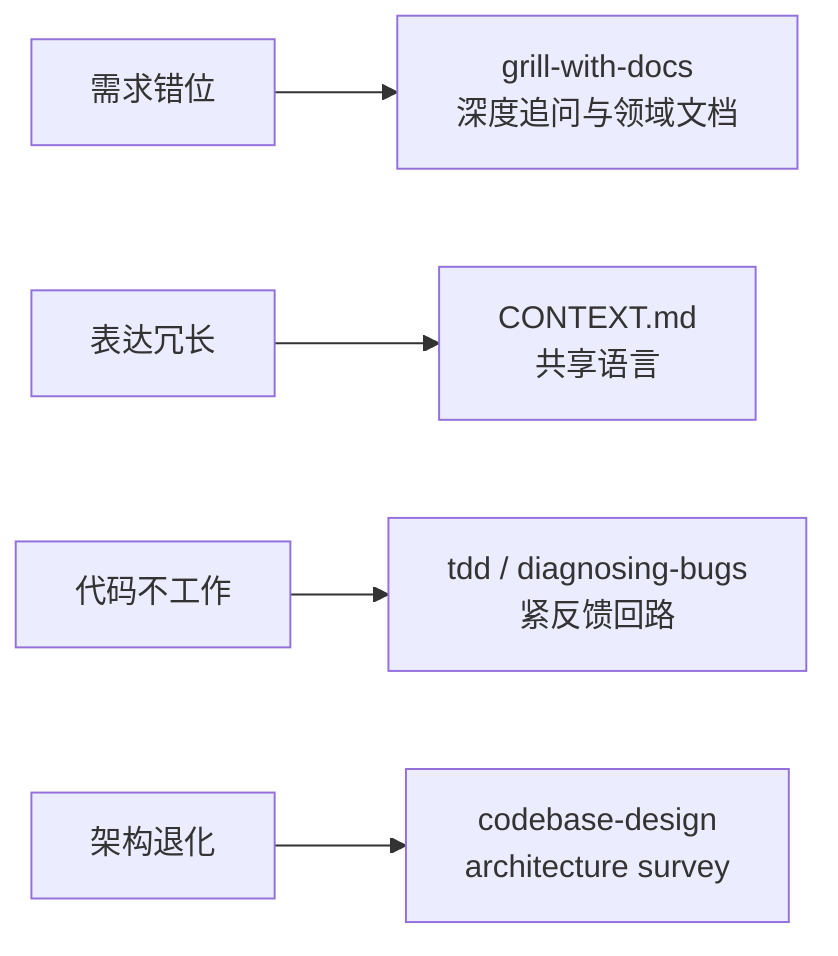
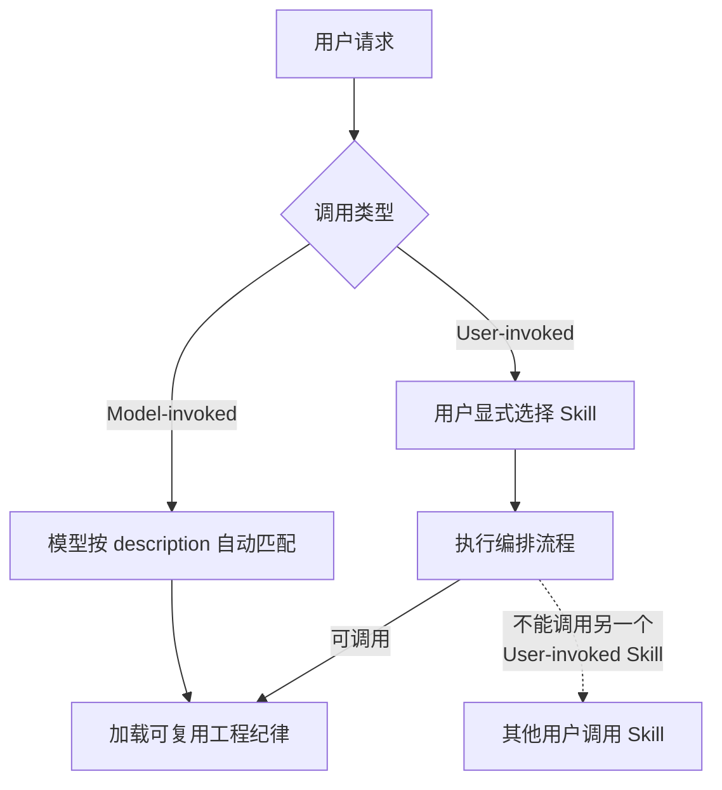
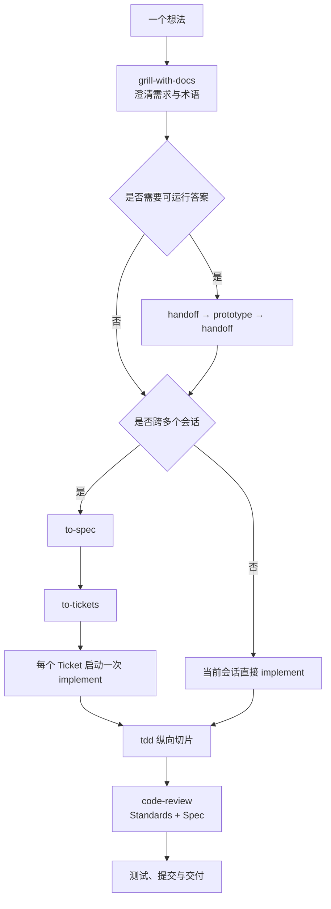
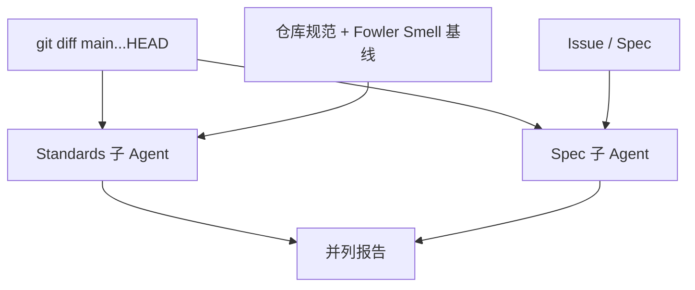
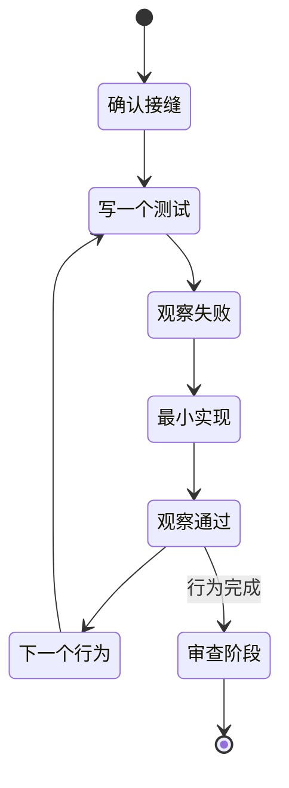
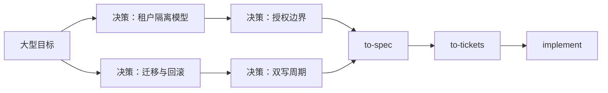

> [mattpocock/skills](https://github.com/mattpocock/skills) 是 Matt Pocock 日常使用的一组工程型 Agent Skills。它不试图接管整个开发流程，而是把需求澄清、领域建模、规格拆分、TDD、调试、代码审查和会话交接等能力拆成小型、可组合的技能。

本文依据项目 [GitHub 仓库](https://github.com/mattpocock/skills)、[DeepWiki 代码解析](https://deepwiki.com/mattpocock/skills)、[skills.sh 页面](https://skills.sh/mattpocock/skills) 与 Skills CLI 文档整理。内容状态截至 **2026 年 8 月**；仓库仍在快速更新，安装前请以当前 README 和 `npx skills add mattpocock/skills --list` 的结果为准。

---

## 一、这套 Skills 解决什么问题

Matt Pocock 将常见的 Agent 工程失败归纳为四类：

1. **需求没有真正对齐**：用户以为 Agent 已经理解，直到看到成品才发现双方想的不是一件事。
2. **Agent 过于啰嗦**：Agent 不理解项目术语，只能用很长的描述绕开领域概念。
3. **代码缺少反馈回路**：没有类型检查、测试、浏览器或可复现脚本，Agent 只能凭感觉判断代码是否有效。
4. **软件熵被加速**：Agent 写代码很快，也能更快制造耦合、重复与难以修改的模块。

这套仓库对应的解决方案是：



它的核心主张不是“让 Agent 自己完成一切”，而是：

- 人负责目标、取舍和不可逆决策。
- Skill 负责把成熟工程纪律写成可重复执行的流程。
- Agent 负责调查、实现、验证和机械化工作。
- 代码、测试、`CONTEXT.md`、ADR、Issue 和交接文档共同构成持久上下文。

---

## 二、Skill、Harness 与 Skills CLI

### 2.1 什么是 Skill

一个 Skill 至少包含一个 `SKILL.md`：

```text
skill-name/
├── SKILL.md
├── agents/
│   └── openai.yaml
├── references.md
├── templates/
└── scripts/
```

其中：

- `SKILL.md` 的 YAML Front Matter 声明名称、描述和调用策略。
- 正文给出 Agent 必须遵循的步骤、完成标准和失败条件。
- `agents/openai.yaml` 提供 Codex 等 Harness 使用的界面元数据与隐式调用策略。
- 同目录还可以包含模板、参考资料和辅助脚本。

Skill 不是普通“提示词收藏”。它可以要求 Agent 读文件、运行命令、创建文档、调用子 Agent，甚至提交 Git 变更。因此安装第三方 Skill 与安装代码工具一样，都需要先审查来源。

### 2.2 Harness 是什么

本文中的 **Harness** 指承载 Agent 的宿主工具，例如：

- Claude Code
- OpenAI Codex
- Cursor
- OpenCode
- 其他兼容 Agent Skills 规范的编码 Agent

同一份 `SKILL.md` 可以跨 Harness 使用，但以下能力不一定完全一致：

- Skill 的自动发现和自动调用
- 用户显式调用语法
- 子 Agent 与后台任务
- 浏览器、Issue Tracker、GitHub CLI 等工具权限
- 项目级和全局级 Skill 目录

因此，“能安装”不等于“在所有 Harness 中行为完全相同”。Skill 给出流程，真正能否执行仍取决于宿主暴露的工具。

### 2.3 用户调用与模型调用

该仓库把 Skill 分为两类：

- **User-invoked**：只能由用户显式启动。Claude Code 中使用 `disable-model-invocation: true`；Codex 元数据中使用 `policy.allow_implicit_invocation: false`。
- **Model-invoked**：用户可以点名使用，模型也可以在任务匹配时自动选择。



一个重要约束是：**用户调用型 Skill 可以调用模型调用型 Skill，但不能在内部启动另一个用户调用型 Skill。** 这可以防止复杂流程在用户不知情时不断嵌套。

---

## 三、仓库中的技能地图

截至本文整理时，Claude Code 插件清单包含 **25 个正式发布技能**。skills.sh 页面可能显示更多，因为它还会发现仓库中的实验性、杂项或尚未进入正式插件的目录。二者数量不同不代表安装失败。

### 3.1 工程类：用户显式调用

- `ask-matt`：不知道该选哪个 Skill 时使用的总路由。
- `grill-with-docs`：通过持续追问澄清需求，同时维护 `CONTEXT.md` 与 ADR。
- `triage`：用状态机处理外部进入的 Bug 和功能请求。
- `improve-codebase-architecture`：扫描代码库中的“模块加深”机会，并生成可视报告。
- `setup-matt-pocock-skills`：为当前仓库配置 Issue Tracker、Triage 标签和领域文档结构。
- `to-spec`：把当前对话综合成可执行规格，不再额外访谈。
- `to-tickets`：把规格拆成带阻塞关系的纵向切片 Ticket。
- `implement`：按规格或 Ticket 实现，内部使用 TDD，并在结束前进行代码审查。
- `wayfinder`：为无法在一个会话中想清楚的大型工作建立“决策地图”。

### 3.2 工程类：模型可自动调用

- `prototype`：用可丢弃原型回答一个设计问题。
- `diagnosing-bugs`：按照“反馈回路 → 最小复现 → 假设 → 插桩 → 修复 → 回归测试”诊断难题。
- `research`：让后台 Agent 基于高可信一手资料调查，并产出带引用的 Markdown。
- `tdd`：按一个测试、一个最小实现的纵向切片推进红绿循环。
- `domain-modeling`：建立和校正项目领域语言。
- `codebase-design`：使用深模块、接口、接缝、适配器和局部性等词汇改善设计。
- `code-review`：分别从仓库标准与原始规格两个轴进行审查。
- `resolving-merge-conflicts`：按双方意图逐个解决 Merge/Rebase 冲突，不通过 `--abort` 逃避。
- `wizard`：为必须由人完成的凭据、控制台和基础设施步骤生成交互式 Bash 向导。

### 3.3 生产力类

- `grill-me`：没有代码仓库时使用的无状态深度访谈。
- `grilling`：被其他 Skill 复用的访谈原语。
- `handoff`：把当前会话压缩成可由另一 Agent 或另一 Harness 接手的文档。
- `teach`：以当前目录为状态空间，进行跨会话教学。
- `to-questionnaire`：把必须由特定人员回答的决策缺口整理成异步问卷。
- `wait-what`：当上一段解释没有听懂时，用项目语言重新说明。
- `writing-for-agents`：编写 `AGENTS.md`、`CLAUDE.md` 和 Skill 文档的参考规范。

如果仓库版本新增或移除了技能，先运行：

```bash
npx skills add mattpocock/skills --list
```

不要把本文的固定清单当作永久 API。

---

## 四、安装方式怎么选

### 4.1 Claude Code：安装官方市场插件

```bash
claude plugins install mattpocock-skills
```

也可以在 Claude Code 会话中执行：

```text
/plugin install mattpocock-skills
```

这种方式的特点：

- 整套技能作为受管理插件安装。
- 插件内容只读，适合直接使用。
- 作者发布新版本后由插件机制更新。
- 不适合直接修改 Skill 内容。

### 4.2 Codex、Cursor、OpenCode 等：使用 Skills CLI

```bash
npx skills@latest add mattpocock/skills
```

交互式安装器会让你选择：

1. 要安装哪些 Skill。
2. 安装到哪些 Harness。
3. 使用项目级还是全局级目录。

务必选中 `setup-matt-pocock-skills`，它是其他工程流程的初始化入口。

### 4.3 不要重复安装

Claude Code 插件和 Skills CLI 代表两种不同策略：

- **插件模式**：订阅作者维护的受管理版本。
- **Skills CLI 模式**：把普通文件安装到项目或用户目录，便于选择和修改。

不要同时把同一套 Skill 通过两种方式安装到 Claude Code，否则技能列表中可能出现重复名称，模型也可能加载到两份不同版本。

### 4.4 项目级还是全局级

默认安装到当前项目，适合：

- 团队希望固定同一组 Skill。
- 需要针对仓库修改 Skill。
- 不希望其他项目受到影响。

添加 `--global` 或 `-g` 则安装到用户目录：

```bash
npx skills@latest add mattpocock/skills --global
```

全局安装适合个人常用技能，但仓库专用流程仍建议放在项目级，避免一个项目的约定污染另一个项目。

---

## 五、首次初始化

安装后，在每个仓库中显式运行一次：

```text
/setup-matt-pocock-skills
```

在不使用斜杠命令的 Harness 中，可以直接说：

```text
请显式使用 setup-matt-pocock-skills Skill 初始化当前仓库。
```

该 Skill 会先调查仓库，然后与你确认三类配置。

### 5.1 Issue Tracker

默认优先使用 GitHub，也支持：

- GitLab
- `.scratch/` 下的本地 Markdown
- Jira、Linear 等自定义工作流

最终约定写入：

```text
docs/agents/issue-tracker.md
```

### 5.2 Triage 标签

如果安装了 `triage`，默认使用五个角色标签：

```text
needs-triage
needs-info
ready-for-agent
ready-for-human
wontfix
```

已有标签体系时，应映射到现有名称，不要重复创建同义标签。

### 5.3 领域文档

普通仓库默认采用单上下文结构：

```text
CONTEXT.md
docs/
├── adr/
└── agents/
    ├── domain.md
    ├── issue-tracker.md
    └── triage-labels.md
```

只有真正的大型 Monorepo 才考虑 `CONTEXT-MAP.md` 加多个局部 `CONTEXT.md`。

### 5.4 初始化会修改哪些文件

Skill 会优先编辑已有 `CLAUDE.md`；若没有，则编辑已有 `AGENTS.md`。两者都不存在时，它应该先问你创建哪一个，而不是擅自选择。

它还会展示草稿并等待确认，然后写入 `docs/agents/*.md`。因此初始化不是无副作用的“扫描命令”，执行前应先确认工作区状态。

---

## 六、推荐主流程：从想法到交付



### 6.1 先澄清，不要马上写代码

在代码仓库中使用：

```text
/grill-with-docs

我们要为 SaaS 增加团队级 API Token。请持续追问，
直到权限范围、生命周期、撤销语义、审计要求和迁移策略都没有未决分支。
```

它会把稳定术语写入 `CONTEXT.md`，把难以逆转的设计决策写入 ADR。之后 Agent 可以直接说“Token Rotation”或“Revocation Window”，无需每次重新解释。

没有仓库、只讨论产品或文章时，改用：

```text
/grill-me
```

### 6.2 决定是否写规格

小改动可以在同一会话进入 `implement`。以下情况应先 `to-spec`：

- 工作跨多个会话。
- 涉及多个模块或团队。
- 有明显依赖关系。
- 当前对话已经包含大量决策，需要固化。

`to-spec` 是“综合已有对话”，不是再做一次访谈。如果仍有大量问题未决，应返回 `grill-with-docs`。

### 6.3 用纵向切片拆 Ticket

`to-tickets` 不应拆成“先建数据库层、再建服务层、最后建 UI”的水平任务，而应拆成可独立验证的 Tracer Bullet：

```text
Ticket 1：管理员可创建只读 Token，并通过 API 完成一次读取
Ticket 2：管理员可撤销 Token，旧 Token 立即被拒绝
Ticket 3：管理员可轮换 Token，旧 Token 在宽限期后失效
```

每个 Ticket 都应声明阻塞关系，使不同 Agent 可以安全领取已经解除阻塞的工作。

### 6.4 实现阶段的隐藏行为

当前 `implement` Skill 的流程包含：

1. 根据规格或 Ticket 实现。
2. 在预先确认的测试接缝上使用 `tdd`。
3. 定期执行类型检查和单测试文件。
4. 结束时执行完整测试。
5. 使用 `code-review` 审查。
6. **提交到当前 Git 分支。**

最后一点很重要：如果你不希望 Agent 自动提交，需要在开始时明确覆盖：

```text
使用 implement Skill 完成 Ticket #42，但不要创建 Git Commit；
完成测试与 code-review 后停下并向我汇报。
```

---

## 七、Harness 实战一：Claude Code 插件工作流

### 7.1 安装并初始化

```bash
claude plugins install mattpocock-skills
cd ~/projects/billing-service
claude
```

进入会话：

```text
/setup-matt-pocock-skills
```

选择 GitHub Issues、默认 Triage 标签和单上下文领域文档。

### 7.2 一个完整功能案例

第一阶段，澄清：

```text
/grill-with-docs

为账单系统增加按席位计费。请挑战我的所有假设，
尤其关注席位增加、减少、试用期、按比例计费、时区和失败重试。
不要实现代码。
```

第二阶段，固化并拆分：

```text
/to-spec
```

```text
/to-tickets
```

第三阶段，打开一个新上下文实现首个已解除阻塞的 Ticket：

```text
/implement

实现 GitHub Issue #123。使用当前 Issue 作为规格来源。
先确认测试接缝；不要修改其他 Ticket 的范围。
```

Claude Code 插件对斜杠命令支持最直接，适合完整主流程。插件是只读受管理包，如需修改 Skill，请改用 Skills CLI 安装方式。

---

## 八、Harness 实战二：Codex 中进行 TDD 修复

### 8.1 精选安装

先查看仓库中当前可用 Skill：

```bash
npx skills@latest add mattpocock/skills --list
```

只安装调试、TDD、设计和审查相关技能：

```bash
npx skills@latest add mattpocock/skills \
  --agent codex \
  --skill setup-matt-pocock-skills \
  --skill diagnosing-bugs \
  --skill tdd \
  --skill codebase-design \
  --skill code-review
```

项目级 Codex Skill 通常位于：

```text
.agents/skills/
```

### 8.2 难复现 Bug 案例

向 Codex 提交：

```text
请使用 diagnosing-bugs Skill 调查“并发刷新 Token 时偶发 401”。
不要直接猜原因。先构造一个能够捕获用户原始症状、可重复且足够快的反馈命令。
所有日志必须去除 Token、Cookie 和 Authorization Header。
```

该 Skill 要求按以下顺序推进：


如果 Codex 在没有反馈命令时就开始读代码并宣布根因，应立即纠正：

```text
停止提出根因假设。按 diagnosing-bugs 的 Phase 1 继续，
直到你能给出一个已经运行过、能够对这个具体 Bug 变红的命令。
```

这比一句“帮我修 Bug”更可靠，因为它把 Agent 的注意力锁定在可验证信号上。

---

## 九、Harness 实战三：Cursor 中进行架构体检

### 9.1 安装到 Cursor

```bash
npx skills@latest add mattpocock/skills \
  --agent cursor \
  --skill setup-matt-pocock-skills \
  --skill improve-codebase-architecture \
  --skill codebase-design \
  --skill grill-with-docs
```

项目级 Cursor Skills 通常由 Skills CLI 放入：

```text
.agents/skills/
```

全局安装则使用：

```text
~/.cursor/skills/
```

安装后新建一个 Agent 会话，让 Cursor 重新发现 Skill。

### 9.2 架构体检案例

在 Cursor Agent 中输入：

```text
请显式使用 improve-codebase-architecture Skill 扫描当前代码库。
重点寻找：
1. 一个业务变化需要修改多个文件的 Shotgun Surgery；
2. 只有转发逻辑的浅模块；
3. 重复穿越对象图的 Message Chain；
4. 可通过缩小接口而加深实现的模块。

先生成调查报告，不要直接重构。
```

选择一个候选项后，再使用 `grill-with-docs` 对齐目标：

```text
请使用 grill-with-docs 追问“统一支付提供商适配层”这个候选方案。
明确公开接口、错误模型、重试责任和迁移边界后，再更新 ADR。
```

架构 Skill 是**调查器，不是自动救援器**。面对历史代码库，它会找到候选机会，但不会一键把“泥球”变成整洁架构。正确做法是一次选择一个高杠杆接缝进入主流程。

---

## 十、Harness 实战四：OpenCode 中进行双轴审查

### 10.1 安装

```bash
npx skills@latest add mattpocock/skills \
  --agent opencode \
  --skill setup-matt-pocock-skills \
  --skill code-review
```

OpenCode 的项目级 Skill 通常位于：

```text
.agents/skills/
```

全局目录通常是：

```text
~/.config/opencode/skills/
```

### 10.2 审查当前分支

```text
请使用 code-review Skill 审查当前分支相对 main 的改动。
固定点是 main，规格来源是 GitHub Issue #218。
标准来源包括 CONTRIBUTING.md、AGENTS.md 和 docs/architecture.md。
只报告 Diff 中可定位的问题。
```

`code-review` 会把审查拆成两个互不污染的方向：



- **Standards**：是否违反仓库规范，是否出现 Mysterious Name、Feature Envy、Shotgun Surgery、Speculative Generality 等味道。
- **Spec**：是否漏需求、实现不完整、实现错误或发生范围膨胀。

两轴结果不应被混成一个总分。代码可能完全符合风格却做错需求，也可能功能正确却破坏项目约定。

---

## 十一、Harness 实战五：同一仓库支持多种 Agent

团队成员可能分别使用 Codex、Cursor 和 OpenCode。可以一次安装到多个目标：

```bash
npx skills@latest add mattpocock/skills \
  --agent codex \
  --agent cursor \
  --agent opencode \
  --skill setup-matt-pocock-skills \
  --skill diagnosing-bugs \
  --skill tdd \
  --skill code-review
```

Skills CLI 默认倾向于使用一个规范副本并链接到各 Agent 目录，以减少重复。若 Windows 策略、容器挂载或文件系统不支持符号链接，可以使用：

```bash
npx skills@latest add mattpocock/skills \
  --agent codex \
  --agent cursor \
  --copy
```

使用复制模式后，每个目录会成为独立副本。修改或更新其中一份，不会自动同步到其他 Harness。

### 跨 Harness 交接案例

假设 Cursor 中完成了需求澄清，要让 Codex 实现：

1. 在 Cursor 中使用 `handoff` 生成交接文档。
2. 文档中保留目标、已定决策、未决问题、关键文件和验证命令。
3. 在 Codex 新会话中读取交接文档。
4. 从 Ticket 或规格启动实现，不依赖原会话记忆。

```text
请使用 handoff Skill 为 Codex 生成交接文件。
接收方将从新的上下文窗口开始，工作目录保持不变。
必须包含 Issue #321、相关 ADR、测试接缝以及当前未提交变更。
```

`handoff` 适合“换 Harness、换目录、交给同事或分叉旁路任务”。如果仍在同一会话、同一目录且上下文健康，直接继续通常比交接更便宜。

---

## 十二、TDD Skill 的正确打开方式

该仓库的 TDD 不是“一次写完所有测试，再一次写完所有实现”，而是纵向红绿切片：



### 12.1 先确认测试接缝

Skill 明确要求在写测试前与用户确认公共接缝：

```text
使用 tdd Skill 实现购物车折扣。
测试接缝限定为 Cart.calculateTotal() 公共接口和 POST /checkout 集成接口；
不要直接测试私有方法，也不要通过数据库旁路验证结果。
```

### 12.2 一个循环只增加一个行为

正确节奏：

1. 写一个表达业务行为的失败测试。
2. 确认它因缺少该行为而失败。
3. 写刚好让测试通过的代码。
4. 再进入下一个行为。

应避免：

- Mock 内部协作者，导致重构即破坏测试。
- 用与实现相同的算法计算期望值，形成自证循环。
- 一次预写几十个测试。
- 为未来假设提前增加抽象。
- 把“代码不报错”误当成测试通过。

当前 Skill 把重构放在审查阶段，而不是混入红绿循环。无论是否认同这一取舍，都应先理解它与经典“Red-Green-Refactor”命名习惯之间的区别。

---

## 十三、难题与特殊流程

### 13.1 大型、模糊、跨会话工作：wayfinder

`wayfinder` 适合“还看不清从当前位置到目标的路径”的工作，例如：

- 从单体迁移到多租户架构。
- 重新设计权限系统。
- 建立跨多个服务的数据一致性机制。

它创建的是**决策 Ticket 地图**，不是实现 Ticket：



当地图已经清晰，应回到 `to-spec`，把分散决策压缩成可构建规格。不要直接把整张决策图丢给 `implement`。

### 13.2 外部 Issue 堆积：triage

`triage` 只处理外部进入、尚未澄清的 Issue：

- 用户 Bug 报告
- 外部功能请求
- 信息不完整的反馈

`to-tickets` 生成的 Ticket 已经是 Agent Ready，不应再走 Triage。

### 13.3 需要看见或运行才能决策：prototype

当问题无法靠文字决定时，做一个可丢弃原型：

- 状态模型是否自然。
- 三套 UI 中哪一种更合适。
- 某个浏览器 API 是否能满足需求。

原型的目标是回答一个问题，而不是偷偷演变成生产实现。把结论写回原始规格或 ADR，再重新实现正式代码。

### 13.4 只有人能完成的步骤：wizard

遇到以下步骤时，Agent 不应伪装成可以自动完成：

- 在第三方控制台创建账号。
- 配置支付或云平台凭据。
- 完成 SSO、MFA 或审批。
- 执行高风险一次性迁移。

`wizard` 会生成交互式 Bash 脚本，引导人打开 URL、输入值并写入环境变量或 GitHub Secret。它适合真正的人机协作边界，不适合 Agent 本来就能通过 CLI 完成的普通操作。

---

## 十四、日常维护

### 14.1 查看可用技能

```bash
npx skills@latest add mattpocock/skills --list
```

### 14.2 更新

```bash
# 交互式更新
npx skills update

# 更新项目级 Skills
npx skills update --project

# 更新某个 Skill
npx skills update tdd
```

通过 Claude Code 插件安装的版本应由插件机制更新，不要再用 Skills CLI 覆盖同名文件。

### 14.3 删除

```bash
# 从当前项目删除指定 Skill
npx skills remove tdd

# 只从 Cursor 删除
npx skills remove --agent cursor tdd

# 删除 Cursor 中的全部 Skill
npx skills remove --skill '*' --agent cursor
```

### 14.4 团队定制

作者明确鼓励用户修改这些技能。推荐做法：

1. 通过 Skills CLI 安装可编辑副本。
2. 固定适合团队的 Skill 集合。
3. 把仓库特有约定放在 `AGENTS.md`、`CLAUDE.md` 和 `docs/agents/`，不要硬编码到所有全局 Skill。
4. 修改后用真实任务验证，而不是只看文案是否合理。
5. 记录修改原因，避免更新上游版本时无意覆盖。

---

## 十五、常见问题排查

### 15.1 安装后看不到 Skill

依次检查：

1. 命令是否在正确项目目录执行。
2. `--agent` 名称是否正确，如 `claude-code`、`codex`、`cursor`、`opencode`。
3. Skill 是否真的被选择，而不是只安装了仓库中的一部分。
4. Harness 是否需要新建会话才能重新扫描。
5. 项目级和全局级目录中是否存在同名旧版本。

### 15.2 同一个 Skill 出现两次

最常见原因是：

- Claude Code 插件与 Skills CLI 重复安装。
- 项目级和全局级各有一份。
- 复制模式留下旧副本。

保留一种来源，并删除重复目录。

### 15.3 Agent 没有自动使用 Skill

先确认该 Skill 是不是 User-invoked。此类 Skill 本来就不能自动启动，应由用户显式点名。

对 Model-invoked Skill，也可以直接说：

```text
请显式使用 diagnosing-bugs Skill，并严格遵守每一阶段的完成条件。
```

不同 Harness 的自动匹配能力不同，显式点名比依赖猜测更稳定。

### 15.4 Skill 要求的工具不存在

例如：

- `to-spec` 想创建 GitHub Issue，但没有 `gh`。
- `code-review` 想启动并行子 Agent，但 Harness 不支持。
- `wizard` 需要 Bash，而当前环境只有受限 Shell。

此时 Skill 的目标仍可保留，但执行方式必须降级。让 Agent明确说明缺失能力、可完成的部分和需要人工执行的步骤，不要假装已经完成外部操作。

### 15.5 `setup` 初始化了错误的文件

按当前 Skill 规则：

1. 已有 `CLAUDE.md` 时编辑它。
2. 否则编辑已有 `AGENTS.md`。
3. 两者都没有时必须先询问。

如果仓库已有自定义结构，应在确认草稿阶段纠正，不要等写入后再处理重复章节。

---

## 十六、安全与工程边界

### 16.1 Skill 是可执行的信任

Skill 可以指示 Agent：

- 读取或修改文件。
- 执行终端命令。
- 调用外部服务。
- 创建 Issue。
- 运行子 Agent。
- 提交 Git 变更。

安装前至少阅读 `SKILL.md`，特别检查删除、提交、推送、凭据与外部写入相关步骤。skills.sh 会进行安全审计，但官方也明确说明无法保证每个第三方 Skill 的质量与安全。

### 16.2 不要泄露调试数据

`diagnosing-bugs` 特别要求在展示命令、输出和抓取工件前删除：

- Token
- Cookie
- Authorization Header
- 私钥
- 数据库连接串
- 用户敏感信息

凭据应保留在环境变量中，不应出现在 Prompt、日志引用、Issue 或交接文件里。

### 16.3 自动提交不是自动推送

`implement` 当前会提交到现有分支，但这不代表应该自动 Push 或合并。团队应明确：

- 是否允许 Agent 创建 Commit。
- Commit 前需要哪些测试。
- 是否允许 Push。
- 谁负责最终审查和合并。

在高风险仓库中，建议明确要求“测试和审查完成后停止，不提交、不推送”。

---

## 十七、推荐学习路径


初次使用不建议一次启用所有流程。可以从以下最小组合开始：

```text
setup-matt-pocock-skills
ask-matt
grill-with-docs
tdd
diagnosing-bugs
code-review
handoff
```

当单会话工作已经稳定，再引入 `to-spec`、`to-tickets`、`implement` 和 `wayfinder`。

---

## 十八、总结

mattpocock/skills 的价值不在于增加更多花哨命令，而在于把容易被 Agent 忽略的软件工程纪律变成可执行约束：

- 用追问解决需求错位。
- 用 `CONTEXT.md` 和 ADR 建立共享语言。
- 用可变红的反馈回路代替猜测。
- 用纵向 TDD 切片控制实现规模。
- 用 Standards 与 Spec 双轴审查避免“代码漂亮但做错需求”。
- 用 Ticket、Handoff 和决策地图跨越上下文窗口。
- 用可编辑、可组合的 Skill 适配不同团队和 Harness。

最实用的使用原则是：**先安装少量高频 Skill，在真实任务中验证，再根据失败模式逐步增加流程。** Skills 是工程纪律的载体，不是替你做决策的黑盒。

---

## 参考资源

- [mattpocock/skills GitHub 仓库](https://github.com/mattpocock/skills)
- [DeepWiki：mattpocock/skills](https://deepwiki.com/mattpocock/skills)
- [skills.sh：mattpocock/skills](https://skills.sh/mattpocock/skills)
- [Skills CLI 文档](https://skills.sh/docs)
- [Vercel Skills CLI](https://github.com/vercel-labs/skills)
- [Agent Skills 开放规范](https://agentskills.io/)
- [Claude Code Skills 文档](https://code.claude.com/docs/en/skills)
- [OpenAI Codex Skills 文档](https://developers.openai.com/codex/skills)
- [Cursor Skills 文档](https://cursor.com/docs/context/skills)
- [OpenCode Skills 文档](https://opencode.ai/docs/skills)

> 仓库中的技能名称、正式发布清单、插件版本和 Harness 支持会持续变化。安装与自动化时，请优先核对当前仓库 README、插件清单以及 `npx skills@latest add mattpocock/skills --list` 的输出。
