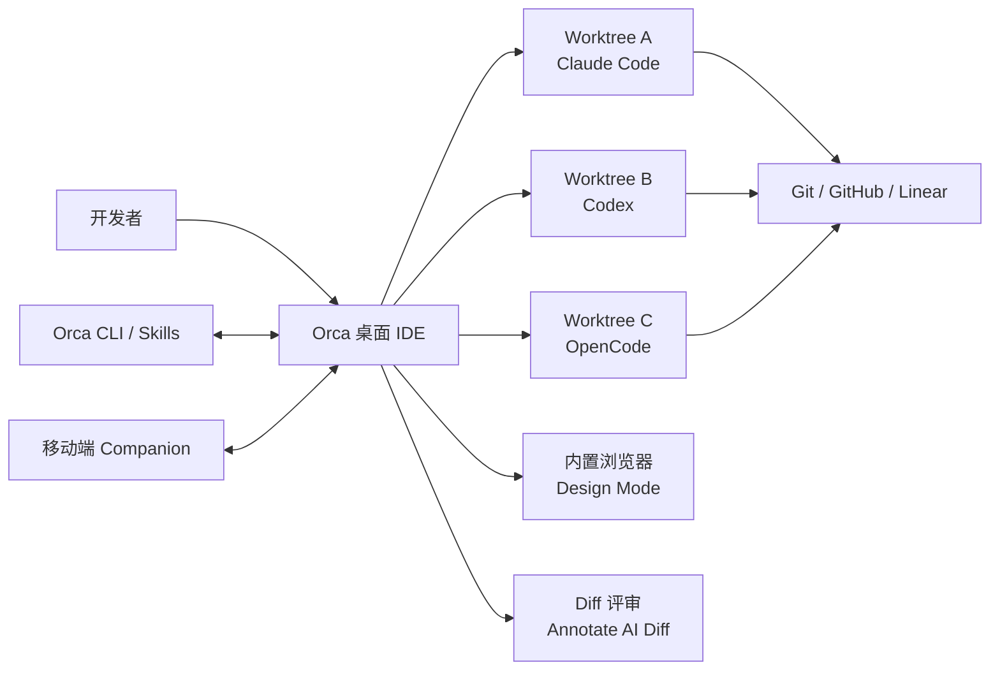
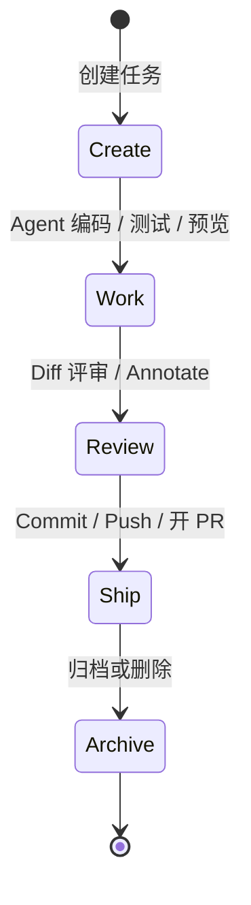
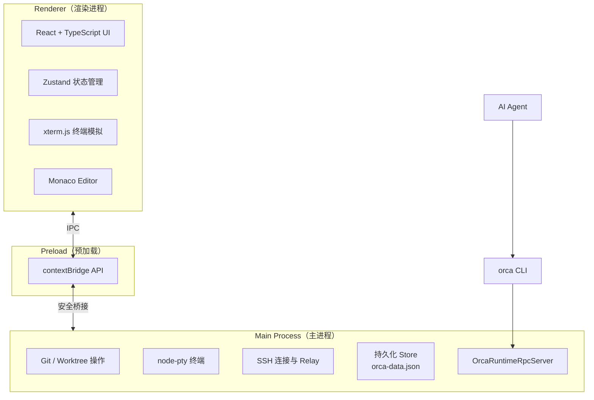
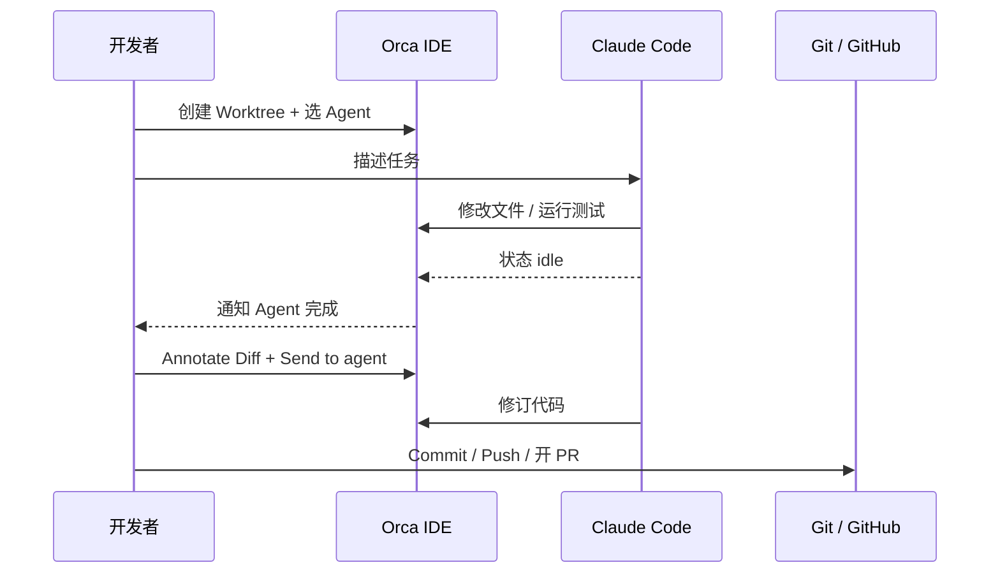
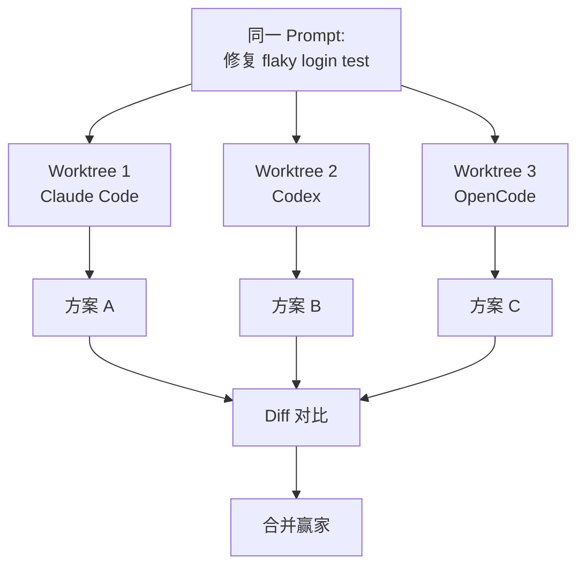
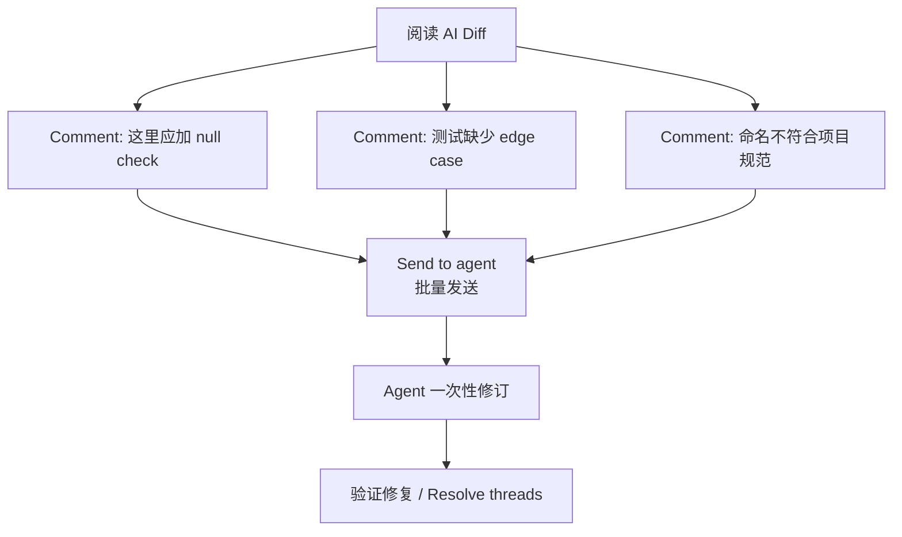
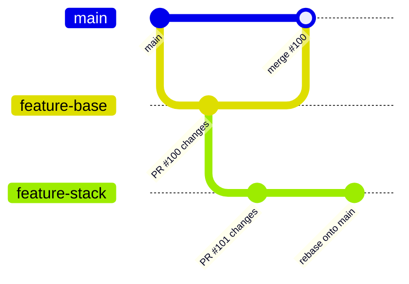

> **Orca** 是面向专业开发者的 AI Orchestrator（AI 编排 IDE）。它不替代 Claude Code、Codex、Cursor CLI 等 Agent，而是在桌面端为每个任务提供独立的 git worktree、Agent 终端、内置浏览器和代码编辑器，让你可以并行运行多个 Agent、比较结果、认真审查 diff，再决定合并哪条方案。

本文依据 [Orca GitHub 仓库](https://github.com/stablyai/orca)、[官方文档](https://www.onorca.dev/docs) 与 [DeepWiki 代码解析](https://deepwiki.com/stablyai/orca) 整理，覆盖安装、核心概念、Worktree 工作流、Agent 编排、Design Mode、Diff 评审、SSH 远程、Orca CLI 自动化和实战案例。文中功能状态截至 **2026 年 8 月**。

---

## 一、为什么需要 Orca

当你已经在用 Claude Code、Codex 或 Cursor CLI 写代码时，常见痛点是：

- **并行任务互相踩踏**：多个 Agent 在同一 checkout 上改文件，stash 和 branch 切换很快失控。
- **状态不可见**：普通终端不知道 Agent 是在工作、等待审批还是已经完成。
- **审查流于形式**：AI 生成的 diff 很大，缺少结构化的 inline review 回路。
- **上下文切换成本高**：GitHub PR、Linear Issue、本地终端、浏览器预览分散在不同工具里。

Orca 的定位是 **Worktree-Native 的 Agent 编排 IDE**：

- 每个任务一个独立 git worktree，文件天然隔离。
- 同一 prompt 可以 fan-out 到多个 Agent，各自在独立 worktree 里尝试，再选赢家合并。
- Agent 状态（working / idle / blocked）实时可见，完成时有通知。
- GitHub PR、Linear Issue、CI 检查、Diff 评审、内置浏览器都在同一窗口完成。

### Orca 与普通 IDE + 终端的区别



Orca 的关键不是“又一个编辑器”，而是把 **worktree 隔离、Agent 生命周期、代码审查和浏览器验证** 绑成一条闭环。

---

## 二、核心概念与架构

### 2.1 Worktree 是一等公民

Orca 的每个任务都对应一个真实的 `git worktree`：

| 概念 | 说明 |
| --- | --- |
| **Project** | 通常对应一个 Git 仓库，或一组相关仓库的 Project Group |
| **Worktree** | 独立 checkout：独立分支、独立目录、独立 Agent 终端 |
| **Start-from ref** | 创建 worktree 时选择的分支起点（`origin/main`、本地分支、SHA 等） |
| **Agent Terminal** | 绑定在某个 worktree 内的 PTY 终端，运行 Claude Code / Codex 等 |
| **Browser Tab** | 绑定在某个 worktree 内的 Chromium 浏览器，支持 Design Mode |

Worktree 生命周期：



### 2.2 三进程 Electron 架构

根据 DeepWiki 对源码的解析，Orca 基于 Electron，采用三进程模型：



- **Main Process**：Git 操作、PTY 会话、SSH、持久化、CLI RPC 服务端。
- **Preload**：通过 `contextBridge` 暴露受控 API，隔离 UI 与系统能力。
- **Renderer**：React 界面、Zustand 全局状态、终端与编辑器渲染。

技术栈概览：

| 层级 | 技术 | 用途 |
| --- | --- | --- |
| 桌面壳 | Electron | 跨平台原生容器 |
| 前端 | React + TypeScript | 组件化 UI |
| 状态 | Zustand | 轻量全局状态 |
| 终端 | xterm.js + node-pty | 高性能终端仿真 |
| 编辑器 | Monaco Editor | VS Code 级编辑体验 |
| 样式 | Tailwind CSS | 实用优先样式 |

---

## 三、安装与首次配置

### 3.1 桌面端安装

Orca 支持 macOS、Windows、Linux：

| 平台 | 安装方式 |
| --- | --- |
| **macOS** | [DMG 下载](https://github.com/stablyai/orca/releases/latest) 或 `brew install --cask stablyai/orca/orca` |
| **Windows** | [Setup.exe](https://github.com/stablyai/orca/releases/latest/download/orca-windows-setup.exe) |
| **Linux** | [AppImage](https://github.com/stablyai/orca/releases/latest/download/orca-linux.AppImage) 或 AUR `stably-orca-bin` |
| **无头 Linux 服务器** | `orca serve`，参见 [headless Linux server 指南](https://github.com/stablyai/orca/blob/main/docs/reference/headless-linux-server.md) |

官方下载页：[onorca.dev/download](https://onorca.dev/download)

### 3.2 前置依赖

为获得完整功能，建议提前安装：

```bash
# Git（必需）
git --version

# GitHub CLI（PR / Issue / CI 集成）
gh auth login
gh auth status

# 可选：你常用的 Agent CLI
claude --version    # Claude Code
codex --version     # Codex
```

Orca **不自带模型订阅**——你需要已有 Claude Code、Codex、Cursor CLI 或 OpenCode 等账号。

### 3.3 注册 Orca CLI

Orca CLI 随桌面应用一起安装。首次使用前在 IDE 内注册：

1. 打开 **Settings → General → Orca CLI**（部分版本在 Settings → Experimental → CLI）。
2. 终端验证：

```bash
command -v orca
orca status --json
```

若 Orca 未运行，可先启动：

```bash
orca open --json
orca status --json
```

Agent 也可安装 CLI Skill：

```bash
npx skills add https://github.com/stablyai/orca --skill orca-cli
# 无 Settings UI 的环境：
orca skills install --skill orca-cli
```

### 3.4 移动端 Companion（可选）

- **iOS**：[App Store](https://apps.apple.com/us/app/orca-ide/id6766130217) 或 [TestFlight](https://testflight.apple.com/join/YjeGMQBA)
- **Android**：[APK 下载](https://github.com/stablyai/orca/releases)

配对后可在手机上监控 Agent 状态、查看终端流、发送 follow-up 指令。

---

## 四、五分钟快速入门

### 4.1 导入项目

1. 启动 Orca，点击 **Add Project**。
2. 选择本地 Git 仓库路径。
3. Orca 自动识别 remote、默认分支，并在侧边栏创建 Project 条目。

若导入的是包含多个 Git 仓库的父目录，Orca 可将其分组为 **Project Group**。

### 4.2 创建第一个 Worktree

1. 在 Project 行点击 **+**，或按 `Cmd-N`（Windows/Linux 为 `Ctrl-N`）。
2. 填写任务名称，例如 `fix-login-bug`。
3. 选择 **Start-from**（通常选 `origin/main`）。
4. 可选：关联 GitHub PR、Linear Issue 或 Jira Ticket。
5. 选择 Agent（Claude Code / Codex / Blank Terminal 等）。
6. 点击 Create——对话框会立即关闭，worktree 在后台创建，侧边栏显示进度条。

创建完成后，Orca 自动打开该 worktree 的 Agent 终端。

### 4.3 发送第一个任务

在 Agent 终端输入自然语言任务，例如：

```text
登录页在 Safari 下点击 Submit 无响应。请定位原因、修复并补充一个回归测试。
```

Agent 开始工作后，侧边栏和状态栏会显示 **working**。完成后 Orca 发送通知（系统通知 + 声音 + worktree 标记）。

### 4.4 审查并提交

1. 打开 **Diff 面板**，查看 Agent 相对 start-from ref 的变更。
2. 对不满意的行使用 **Annotate AI Diff** 留 comment。
3. 点击 **Send to agent** 批量发回修订。
4. 满意后 inline commit、push，并直接从 Orca 开 PR。



---

## 五、Worktree 深度指南

### 5.1 并行 Agent：Fan-out 同一 Prompt

Orca 的核心场景之一：把同一个 bug 或 feature 交给多个 Agent 并行尝试。



操作步骤：

1. 创建主 worktree，写好清晰的任务描述。
2. 再创建 2～4 个子 worktree（可设 `--parent-worktree active`），分别启动不同 Agent。
3. 把相同 prompt 粘贴到各终端（或通过 Orchestration 批量 dispatch）。
4. 在 Diff 面板并排比较各 worktree 的改动。
5. 选定最佳方案，cherry-pick 或手动合并，删除其余 worktree。

### 5.2 共享目录与本地配置

新建 worktree 是干净 checkout，`.env`、`node_modules` 等 gitignored 内容默认不存在。Orca 提供三种互补机制：

**1. Settings → Repository → Worktree Shared Paths**（每用户配置）

在 macOS 上优先使用 APFS clone-copy，否则 symlink。

**2. 仓库根目录 `orca.yaml`**

```yaml
# orca.yaml
worktree:
  sharedDirectories:
    - node_modules
    - .cache
```

适合大型可重建目录，以 symlink/share 方式共享。

**3. 仓库根目录 `.worktreeinclude`**

```text
# .worktreeinclude
.env
.env.local
.vscode/settings.json
```

以 **copy** 方式复制到每个新 worktree，适合各 worktree 需要独立副本的配置文件。

### 5.3 分支命名与 Issue 关联

- 默认从 workspace 名称推导分支名。
- 从 Linear Issue 创建时，Orca 优先使用 Linear 建议的分支名。
- 从 GitHub PR 创建时，分支在提交时重新解析 PR 分支。
- Advanced 抽屉可手动指定 `feature/my-branch`。

关联 Issue 后，worktree 卡片会显示对应 chip，便于追踪。

### 5.4 侧边栏与导航

常用快捷键：

| 快捷键 | 功能 |
| --- | --- |
| `Cmd-J` | Worktree Jump Palette（快速跳转） |
| `Cmd-N` | 新建 Worktree |
| 双击标题 | 内联重命名 |
| `Cmd`+点击 | 多选 worktree（批量归档/删除） |

侧边栏过滤器可隐藏：Sleeping、Default branch、Automation-created、CLI-created、Detached HEAD 等 workspace。

---

## 六、Agent 与编排

### 6.1 支持的 Agent

Orca 支持 **任何能在终端运行的 CLI Agent**，包括但不限于：

Claude Code、Codex、Cursor CLI、GitHub Copilot CLI、OpenCode、Pi、Grok、Amp、Cline、Continue、Kilocode、Qwen Code 等。

Orca 不捆绑模型——使用你已有的订阅，并可在 **Settings → Account** 中切换账号、查看 Claude/Codex 用量与 rate-limit 重置时间。

### 6.2 Agent 状态

Orca 追踪 Agent 终端的状态：

| 状态 | 含义 |
| --- | --- |
| **working** | Agent 正在执行任务 |
| **idle** | Agent 已完成或等待输入 |
| **blocked** | Agent 等待用户审批（如 Claude Code 的 permission prompt） |

状态变化会触发通知。SSH 远程 worktree 上的 Agent 状态同样同步到本地侧边栏。

### 6.3 Orchestration（多 Agent 编排）

对于需要 tracked multi-agent 调度的场景，Orca 提供 **Orchestration** 能力（区别于普通终端 prompt）：

- 从同一 orchestration 入口向多个 Agent 分发任务。
- 子 worktree 自动建立 parent/child 关系。
- 可通过 CLI Skill 安装编排指南：

```bash
orca skills install --skill orchestration
orca skills get orchestration --full
```

CLI 创建带 Agent 的 worktree 示例：

```bash
orca worktree create \
  --name review-api \
  --agent claude \
  --prompt "Review the auth module for security issues" \
  --setup run \
  --json
```

`--setup run|skip|inherit` 控制仓库 setup hook（如 `npm install`）的执行策略。

---

## 七、终端系统

Orca 内置 Ghostty 级终端：WebGL 渲染、无限分屏、重启后 scrollback 保留。

### 7.1 分屏与多 Pane

- 水平/垂直 split，每个 pane 独立 PTY。
- 可在同一 worktree 内同时运行 Agent、dev server、测试、日志 tail。

### 7.2 CLI 终端控制

```bash
# 列出当前 worktree 的终端
orca terminal list --json

# 读取终端输出
orca terminal read --json

# 发送输入
orca terminal send --text "continue" --enter --json

# 等待 Agent 进入 idle
orca terminal wait --for tui-idle --timeout-ms 300000 --json

# 创建新终端并运行命令
orca terminal create --worktree active --command "npm test" --json

# 分屏
orca terminal split --direction vertical --command "npm run dev" --json
```

自动化脚本应优先使用 `--json`，并通过 cursor 分页读取长输出。

---

## 八、Design Mode 与内置浏览器

### 8.1 Design Mode 工作流

Design Mode 把浏览器变成 **点击即上下文** 的工具：

1. 在 worktree 的 Browser Tab 打开本地 dev server（如 `http://localhost:3000`）。
2. 点击工具栏 **Design Mode** 开关。
3. 鼠标悬停高亮元素，点击选中。
4. Orca 捕获：HTML、computed CSS、元素截图、source map 定位（若可用）。
5. 上下文自动注入当前 Agent 终端，你补充修改意图即可。


### 8.2 CLI 浏览器自动化

适合 Agent 或脚本驱动的 E2E 验证：

```bash
orca goto --url http://localhost:3000 --json
orca snapshot --json          # 返回 @e1, @e3 等元素 ref
orca click --element @e3 --json
orca fill --element @e1 --value "test@example.com" --json
orca wait --text "Welcome" --json
orca screenshot --json

# 响应式测试
orca set device --name "iPhone 12" --json
orca screenshot --json
```

遵循 **snapshot → act → re-snapshot** 循环；导航或 DOM 变化后需重新 snapshot。

### 8.3 Browser Profiles

不同 profile 隔离 cookies、localStorage 和登录态，便于测试多用户场景：

```bash
orca tab profile list --json
orca tab profile create --name "logged-in-user" --json
orca tab profile use-default --name "logged-in-user" --json
```

---

## 九、Diff 评审：Annotate AI Diff

这是 Orca 区别于普通 IDE 的核心 review 回路。

### 9.1 留 Comment

1. 在 Diff 面板 hover 任意行，gutter 出现 **+**。
2. 点击或按 `c` 键，输入 markdown 格式的反馈。
3. `Cmd-Enter` 保存，`Esc` 取消。

Comment 锚定到具体行；diff 变化时 Orca 会尽量跟踪行位移。

### 9.2 批量发回 Agent

审查完成后点击 **Send to agent**：

- Orca 将所有 comment 合成一条结构化 prompt。
- 弹出菜单选择目标 Agent 或新建 Agent。
- Agent 一次性消化全部反馈，避免来回 ping-pong。



### 9.3 为什么必须 Batch

逐条发送 comment 会导致 Agent 反复修改同一文件的不同部分，上下文碎片化。批量发送让 Agent 做 **一轮完整思考、一轮完整修订**，命中率显著更高。

---

## 十、GitHub、Linear 与任务集成

### 10.1 GitHub 原生集成

- 浏览 PR、Issue、CI Checks，无需切换浏览器。
- 从 PR/Issue 直接创建 worktree，分支自动关联。
- Inline push 并开 PR，等待 CI 结果。

前置条件：`gh` CLI 已安装并完成 `gh auth login`。

### 10.1 Linear 集成

CLI 层提供完整的 Linear 操作面：

```bash
# 读取当前 worktree 关联的 Issue
orca linear issue --current --full --json

# 搜索
orca linear search "auth bug" --json

# 创建 Issue
orca linear create --title "Flaky login test" --team ENG --priority high --json

# 更新状态
orca linear status set --current --to "In Progress" --json

# 添加 comment
orca linear comment add --current --body "Investigating regression" --json
```

安装 Linear Skill：

```bash
orca skills install --skill orca-linear
```

### 10.2 从任务到 Ship 的完整链路


---

## 十一、SSH 远程 Worktree

当本地算力不足、需要 GPU 或长时间构建时，Orca 可通过 SSH 在远程机器上运行 Agent，编辑器和 diff 体验仍保持本地。

### 11.1 添加 SSH Target

1. **Settings → SSH → Add Target**。
2. 填写 host、user、port、identity file；或从 OpenSSH config 导入。
3. **Test** 连接，**Save**。

### 11.2 创建远程 Worktree

创建 worktree 时在 **Run on** 选择 SSH target 而非 Local。Orca 会：

- 在远程 host 执行 `git worktree add`。
- 通过 SSH relay 运行 Agent 终端。
- 同步文件事件，本地编辑器/浏览器仍可操作远程文件。

### 11.3 连接状态与持久化

| 状态 | 含义 |
| --- | --- |
| 绿色 | 已连接 |
| 黄色 | 重连中 |
| 红色 | 断开 |

关键特性：

- **断开不杀 Agent**：Orca 自动重连并 re-attach。
- **关闭 Orca 不杀远程 PTY**：远程会话通过 relay lease，默认 5 分钟 grace period 内重连可恢复 scrollback。
- **Port Forwarding**：`Cmd-Shift-I` 打开 Ports 面板，一键转发远程端口到本地。

### 11.4 远程文件下载

在 SSH worktree 文件树右键：

- **Download**：单文件保存到本地。
- **Download Folder**：递归下载整个目录（需 SFTP 支持）。

---

## 十二、Orca CLI 完全参考

CLI 是 Orca 自动化的核心接口——Agent 和 Shell 脚本都通过它与运行中的 Orca 通信。

### 12.1 Selector 语法

脚本中优先使用 selector，避免硬编码 ID：

```bash
orca worktree show --worktree active --json
orca worktree show --worktree path:/abs/path --json
orca worktree show --worktree branch:feature-name --json
orca worktree show --worktree issue:123 --json
```

`active` / `current` 从 shell 当前目录或终端上下文解析。

### 12.2 Worktree 命令

```bash
orca worktree ps --json
orca worktree list --repo id:<repoId> --json
orca worktree create --repo id:<repoId> --name fix-login --json
orca worktree create --name child-task \
  --agent codex \
  --prompt "Investigate flaky test" \
  --parent-worktree active \
  --json
orca worktree set --worktree active --comment "reproduced bug" --json
orca worktree rm --worktree id:<id> --force --json
```

### 12.3 文件与 Diff

```bash
orca file open src/App.tsx --worktree active --json
orca file diff src/App.tsx --staged --json
orca file open-changed --mode both --json
```

### 12.4 定时自动化

```bash
orca automations list --json
orca automations create \
  --name "Daily review" \
  --trigger daily \
  --time 09:00 \
  --prompt "Review open changes" \
  --provider codex \
  --repo id:<repoId> \
  --disabled \
  --json
orca automations run <automationId> --json
```

### 12.5 Artifacts 分享

将 HTML/Markdown 发布为公开链接（需在 Settings → Artifacts 中启用）：

```bash
orca artifacts share ./report.html --json
orca artifacts list --json
orca artifacts delete <id> --json
```

### 12.6 Headless 模式

在无桌面环境的 Linux 服务器上：

```bash
orca serve --port 6768 --pairing-address 100.64.1.20 --json
```

配合 Remote Orca Server 或 Tailscale 等组网，从本地 Orca 客户端连接远程 runtime。

---

## 十三、通知与移动端

### 13.1 Agent 完成通知

Agent 从 working 变为 idle 时，Orca 触发：

- 系统桌面通知
- 自定义声音（支持 MP3/WAV/OGG/M4A 等）
- Worktree 上的 unread chip
- macOS Dock badge

Settings → Notifications 可分别关闭各类通知，或设置自定义提示音。

### 13.2 移动端 Companion

配对桌面 Orca 后，手机端可以：

- 实时查看 Agent 终端输出。
- 收到 Agent 完成推送。
- 远程发送 follow-up 指令。

适合“排队三个 Agent、离开工位、收到第一个完成通知再回来审查”的工作模式。

---

## 十四、实战案例

### 实战一：并行三 Agent 修复同一 Bug

**场景**：登录页在 Safari 下 Submit 按钮无响应，不确定哪条修复路径最优。

**步骤**：

1. 创建主 worktree `safari-login-bug`，start-from `origin/main`。
2. 复制创建两个子 worktree，分别选 Claude Code 和 Codex。
3. 向三个终端发送相同 prompt：

```text
Safari 下登录页 Submit 按钮点击无响应。请：
1. 复现并定位根因
2. 修复并添加回归测试
3. 在内置浏览器中验证
```

4. 等待三个 Agent 全部 idle（Orca 通知）。
5. 打开各 worktree 的 Diff，比较改动范围、测试覆盖和代码质量。
6. 选择 Codex 的方案（假设测试最完整），cherry-pick 到主 worktree。
7. Annotate 剩余小问题，Send to agent 做最后一轮修订。
8. Push 并开 PR。

```mermaid
gantt
    title 并行三 Agent 修 Bug
    dateFormat HH:mm
    section Claude
    调查根因           :a1, 09:00, 15m
    实现修复           :a2, after a1, 20m
    section Codex
    调查根因           :b1, 09:00, 12m
    实现修复+测试       :b2, after b1, 18m
    section OpenCode
    调查根因           :c1, 09:00, 18m
    实现修复           :c2, after c1, 22m
    section 开发者
    比较 Diff 选方案    :d1, 09:40, 10m
    合并+开 PR         :d2, after d1, 10m
```



---

### 实战二：Design Mode 修复 UI 样式 Bug

**场景**：Dashboard 卡片间距在移动端 breakpoint 下不正确。

**步骤**：

1. 创建 worktree `fix-card-spacing`，启动 Claude Code。
2. 在 Browser Tab 打开 `http://localhost:5173/dashboard`。
3. 开启 Design Mode，点击间距异常的卡片元素。
4. 在 Agent 终端补充：

```text
这个卡片在 768px 以下 breakpoint 时 margin-bottom 应为 16px，当前是 8px。请修复并确保 tailwind 类名符合项目规范。
```

5. Agent 修改 CSS/Tailwind 后页面热重载。
6. 切换 device profile 到 iPhone 12，再次 Design Mode 点击验证。
7. Annotate Diff 确认无 regression，commit 并 push。

---

### 实战三：Linear Issue → Worktree → PR 全链路

**场景**：Linear ENG-456「Add rate limiting to /api/search」。

**步骤**：

1. 在 Orca 创建 worktree，粘贴 Linear URL 或搜索 ENG-456。
2. Orca 自动使用 Linear 建议的分支名。
3. 启动 Codex，prompt：

```text
Implement rate limiting for GET /api/search:
- 100 req/min per IP
- Return 429 with Retry-After header
- Add integration tests
Follow existing middleware patterns in src/middleware/.
```

4. Agent 完成后，Annotate Diff：
   - 「Rate limit 应可配置，不要 hardcode 100」
   - 「Integration test 缺少 IPv6 场景」
5. Send to agent 批量修订。
6. 从 Orca inline push，开 GitHub PR。
7. CLI 更新 Linear 状态：

```bash
orca linear status set --current --to "In Review" --json
orca linear comment add --current --body "PR opened: https://github.com/org/repo/pull/789" --json
```

8. CI 通过后 merge，删除 worktree。

---

### 实战四：SSH 远程 GPU 机器跑长任务

**场景**：本地 MacBook 跑大模型 fine-tune 脚本需要 2 小时，希望在远程 GPU 服务器上执行。

**步骤**：

1. Settings → SSH 添加 `gpu-box`（`user@192.168.1.100`）。
2. 创建 worktree，Run on 选 `gpu-box`。
3. 在远程 Agent 终端：

```text
Run scripts/finetune.py with config/experiment.yaml.
Monitor loss and save checkpoint every 1000 steps.
```

4. 关闭 Orca 笔记本端（远程 PTY 通过 relay 保持运行）。
5. 2 小时后手机 Companion 收到 Agent idle 通知。
6. 重新打开 Orca，SSH 重连，查看终端 scrollback 和结果。
7. Ports 面板转发远程 `6006`（TensorBoard）到本地查看曲线。
8. 右键 Download Folder 把 checkpoint 拉到本地。

---

### 实战五：Shell 脚本自动化「创建 → 等待 → 审查 → 清理」

**场景**：每晚自动让 Codex 审查当天所有未 commit 的变更。

```bash
#!/usr/bin/env bash
set -euo pipefail

REPO_ID="id:abc123"
WT=$(orca worktree create \
  --repo "$REPO_ID" \
  --name "nightly-review-$(date +%Y%m%d)" \
  --agent codex \
  --prompt "Review all uncommitted changes. List issues by severity." \
  --setup skip \
  --json | jq -r '.worktreeId')

echo "Created worktree: $WT"

# 等待 Agent idle（最多 10 分钟）
orca terminal wait --for tui-idle --timeout-ms 600000 --json

# 读取 Agent 输出
orca terminal read --json | jq -r '.text' > /tmp/review-output.txt

# 打开 diff 供人工确认
orca file open-changed --mode diff --json

echo "Review complete. Output saved to /tmp/review-output.txt"
# 人工确认后可删除 worktree：
# orca worktree rm --worktree "id:$WT" --force --json
```

配合 `orca automations` 可设为每日 21:00 自动触发。

---

### 实战六：多 Worktree 功能栈（Stacking PR）

**场景**：PR #100 还在 review，但需要在其基础上继续开发 PR #101 的依赖功能。

**步骤**：

1. 创建 worktree `feature-base`，start-from `origin/main`，完成并 push PR #100。
2. 创建 worktree `feature-stack`，start-from **本地分支 `feature-base`**（而非 main）。
3. 在 `feature-stack` 上开发并 push PR #101（base 指向 #100 的分支）。
4. 两个 worktree 并行存在：一个处理 #100 的 review comment，一个继续 #101 开发。
5. #100 merge 后，在 `feature-stack` 终端执行 `git rebase origin/main`，Orca 自动反映文件变化。



---

## 十五、配置与个性化

### 15.1 仓库级配置汇总

| 文件/位置 | 作用 |
| --- | --- |
| `orca.yaml` | 共享 gitignored 目录（symlink） |
| `.worktreeinclude` | 复制 gitignored 文件/目录到每个 worktree |
| Settings → Repository | 每用户 Worktree Shared Paths |
| Settings → General | 默认 Agent、Open in 菜单（VS Code 等） |
| Settings → Shortcuts | 自定义快捷键 |

### 15.2 Skills 生态

Orca 内置 Skills 注册表，Agent 可安装领域指南：

```bash
orca skills list
orca skills install --skill orca-cli --skill orchestration --skill orca-linear
orca skills update --all
```

### 15.3 通知与账号

- Settings → Notifications：分类开关、自定义声音。
- Settings → Account：Claude/Codex 账号切换、用量追踪。

---

## 十六、常见问题排查

### 16.1 CLI 无法连接 Orca

```bash
command -v orca          # 确认 CLI 已注册
orca open --json         # 启动 Orca
orca status --json       # 检查 runtime 状态
```

### 16.2 Worktree 创建失败

- 检查 `git fetch` 是否成功（网络 / 权限）。
- 查看 worktree 内嵌进度面板的错误信息，点 **Retry**。
- 确认 start-from ref 存在且可访问。

### 16.3 新 Worktree 缺少依赖

- 确认 `orca.yaml` 或 Shared Paths 已配置 `node_modules`。
- 检查 `.worktreeinclude` 是否包含 `.env`。
- 手动在 worktree 终端运行 setup hook，或创建时设 `--setup run`。

### 16.4 SSH 远程终端不可用

Linux 远程主机缺少编译工具链时，文件编辑和 git 仍可用，但 PTY 无法工作。安装后重连：

```bash
# Debian/Ubuntu
sudo apt-get install -y build-essential python3
```

### 16.5 Agent 状态不更新

- 确认 Agent 是 Orca 支持的 CLI Agent（在终端内直接运行，而非嵌套在 tmux 内）。
- SSH 连接断开时检查 reconnect 状态；点击 worktree 卡片上的 **Connect**。

### 16.6 Browser Automation ref 失效

`snapshot` 返回的 `@e3` 等 ref 在页面导航或 DOM 变化后失效。每次 action 后 re-snapshot。

---

## 十七、最佳实践

1. **一个任务一个 worktree**，永远不要让两个 Agent 共享同一 checkout。
2. **Fan-out 前先写好清晰、可比较的 prompt**，否则难以评判方案优劣。
3. **Diff 评审务必 batch 发送**，不要逐条 ping Agent。
4. **大项目配置 `orca.yaml` 共享 `node_modules`**，避免每个 worktree 重复 install。
5. **`.env` 走 `.worktreeinclude` copy**，避免 symlink 导致的 secrets 共享风险。
6. **脚本一律 `--json`**，用 selector 而非硬编码 ID。
7. **长任务优先 SSH 远程**，本地只保留编辑和 review 体验。
8. **Design Mode 适合 UI bug**，不适合后端逻辑——选对工具。
9. **关联 Linear/GitHub Issue**，分支命名和追踪更省心。
10. **定期清理 sleep/archived worktree**，避免磁盘和分支堆积。

---

## 十八、总结

Orca 最适合以下场景：

- 已有 Claude Code / Codex / Cursor CLI 订阅，想要统一的 Agent 编排面板。
- 需要并行尝试同一任务的多种实现，并认真比较 diff。
- 重视 AI 生成代码的 review 质量，而非“生成即合并”。
- 使用 git worktree 隔离并行 feature 开发。
- 需要在远程 GPU/构建服务器上跑 Agent，同时保留本地 IDE 体验。
- 希望通过 CLI 和 Skills 构建可重复的 Agent 工作流。

建议的学习路线：


先把 Orca 当作 **“Worktree-Native 的多 Agent IDE”** 日常使用，再逐步引入 CLI 自动化、SSH 远程和 Orchestration。这样既能立即获得并行隔离和 diff 评审能力，也不会一开始就把编排设计得过于复杂。

---

## 参考资源

- [Orca GitHub 仓库](https://github.com/stablyai/orca)
- [Orca 官方文档](https://www.onorca.dev/docs)
- [下载页面](https://onorca.dev/download)
- [Worktrees 模型](https://www.onorca.dev/docs/model/worktrees)
- [Orca CLI 概览](https://www.onorca.dev/docs/cli/overview)
- [Orca CLI 参考](https://www.onorca.dev/docs/cli/reference)
- [Design Mode](https://www.onorca.dev/docs/browser/design-mode)
- [Annotate AI Diff](https://www.onorca.dev/docs/review/annotate-ai-diff)
- [SSH Worktrees](https://www.onorca.dev/docs/ssh)
- [终端系统](https://www.onorca.dev/docs/terminal)
- [通知与 Inbox](https://www.onorca.dev/docs/notifications)
- [DeepWiki：stablyai/orca](https://deepwiki.com/stablyai/orca)
- [Discord 社区](https://discord.gg/fzjDKHxv8Q)
- [Changelog / Releases](https://github.com/stablyai/orca/releases)

> Orca 仍在快速演进（README 自述 “we ship daily”）。命令参数、支持的 Agent 与平台特性可能随版本变化；涉及自动化时，请优先使用当前安装版本的 `orca --help`、`orca skills list` 和官方文档进行核对。
