> 2026 年 8 月 13 日，DeepSeek Harness 开发者预览和 Cordis 设计论文同一天公开。前者的口号是 **Everything is a plugin（一切皆插件）**；后者给出这句话能成立的形式基础。论文全名是 [_A Programming Paradigm for Spatiotemporal Composability_](https://github.com/cordiverse/paper)（时空可组合性的编程范式），作者是史一凡（北京大学 / DeepSeek）、张伟（北京大学）、崔天一（DeepSeek）。文稿标注 **Draft of August 13, 2026**，仍在修订，引用请以仓库最新 PDF 为准。

本文依据 [论文仓库](https://github.com/cordiverse/paper)、[DeepWiki 源码级导读](https://deepwiki.com/cordiverse/paper)、本地 preprint `paper.pdf`，以及 [DeepSeek Harness](https://github.com/deepseek-ai/deepseek-harness) 的实际用法整理。目标不是复述定理编号，而是回答三件事：

1. 为什么现有插件系统和 Agent 驾驭层会在热插拔时翻车。
2. 论文用哪两个互相垂直的机制把这件事做对。
3. 这些机制在 DeepSeek Harness（`dsh`）里分别对应什么。

先看使用指南：[DeepSeek Harness 完全使用指南](/2026-08-17-deepseek-harness-complete-guide)。本文讲的是那套用法背后的理论。

---

## 一、一句话读懂这篇论文

**把组件对世界的改动做成可撤销的账本，把组件对世界的依赖做成会自动开关的订阅，再用同一个 Context 把两件事管起来。**

传统软件组合是静态的：函数调用、模块 import、类继承在编译期就定死。现代系统越来越要求**动态组合**：插件随时装卸载，Agent 随时改自己的工具面，配置随时热更新。操作系统能按进程重启，容器能按服务编排，但粒度都太粗——重启会丢掉缓存、连接和进行中的任务。论文要的是**组件粒度**的安全插拔。

它把问题拆成两个正交维度：

| 维度 | 日常说法 | 论文机制 | 在 `dsh` 里的样子 |
| --- | --- | --- | --- |
| **时间（Temporal）** | 拔掉一块积木，别把旁边的积木带倒 | **可逆副作用**（Revertible Effects）：每次改 Context 都带着逆操作，运行时记账 | 插件卸载时，监听器、工具、定时器自动撤销 |
| **空间（Spatial）** | 这块积木缺螺丝就不能立起来 | **反应式余效应**（Reactive Coeffects）：声明依赖，环境一变就通知 | `inject: ['tools']`，没有 `ctx.tools` 就不启动 `apply` |

古典类型论里，**效应（effect）**描述程序怎么改环境，**余效应（coeffect）**描述程序需要环境提供什么。论文的贡献是：不再把它们只当编译期注解，而是做成运行时机制。

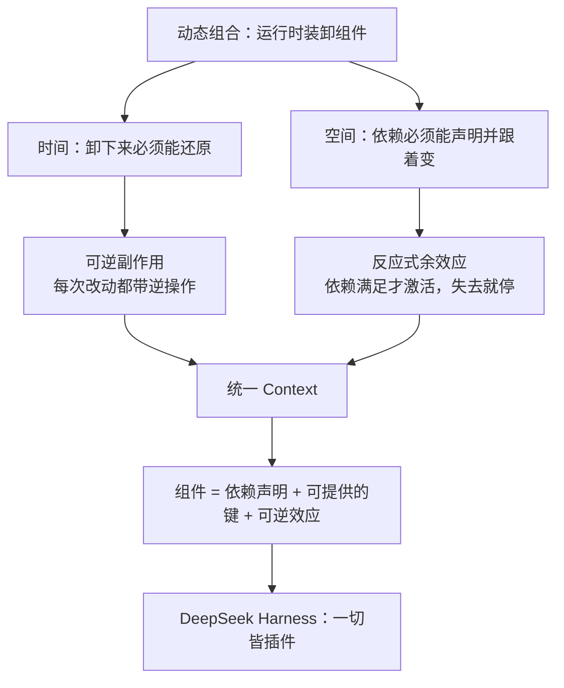

---

## 二、问题从哪里来

### 2.1 静态组合已经很成熟，动态组合还没有

论文开篇把对比写得很干脆：静态世界里，时间维度可以靠词法作用域（RAII、bracket）解决，空间维度可以靠模块导入解决。一旦组件在**部署之后**才到达、才离开，两件事都变难：

- 副作用不再被大括号框住，生命周期可能持续数小时。
- 依赖不再是编译期图，可能中途出现、消失、换身份。

### 2.2 VSCode：装得进去，卸不干净

论文用 VSCode 当插件系统的典型反例（Marketplace 数据截至 2026 年 6 月 9 日）：

- 扩展跑在共享的 **extension host** 里。`activate` 一旦执行，禁用或卸载单个扩展通常要**重启整个 host**，所有扩展一起受影响。
- `deactivate` 只是进程退出时的礼貌回调，不是真正的热卸载。创建副作用在 `activate`，清理在 `deactivate`，**关注点被撕开**，完整清理很难验证。
- 前 100 个安装量最高的扩展里，**87 个带可执行代码**，因此卸载会触发重启；只有主题、快捷键、snippet 这类纯声明扩展可以随便卸。
- `extensionDependencies` 几乎没人用：前 100 里只有 **7 个**声明了对非内置扩展的依赖。扩展 API 把大家赶到宿主提供的固定扩展点上，扩展之间缺少带类型的结构契约；`exports` 默认是 `any`。

这不是 VSCode 独有的病，插件系统普遍如此，只是程度不同。

### 2.3 自演化 Agent Harness：卸载失败的代价被放大

论文把 **self-evolving agent harness** 写成第二类动机。现代 Agent 驾驭层要组合工具套件、沙箱、会话、记忆、子 Agent、权限和界面。未来的 harness 还会在**持续服务请求的同时**，生成并部署对自己组件的修改。

没有细粒度可组合性时：

- **缺时间维度**：每次自修改都要全进程重启，丢掉进程内状态；飞行中的任务被反复打断；更糟的是，一次错误的自修改可能把用来恢复的进程本身弄挂。
- **缺空间维度**：每个模块只能用临时手段探测依赖是出现了、消失了还是换人了；朴素的代码替换会悄悄弄坏依赖方，或引入只有重载时才暴露的循环依赖。

DeepSeek Harness 正好落在这个位置。它不是又一个“打开就能写代码”的产品，而是把模型接到文件系统、Shell、编辑器、网络、子 Agent 和审批策略上的运行时。口号 **Agent = Model + Harness** 里，Harness 这一半就是动态组合问题。

### 2.4 粗粒度替代方案：用进程和容器凑合

操作系统按进程给时间可组合性，容器编排按服务给空间可组合性。多数软件靠这两层凑合：模块坏了就重启进程，服务依赖交给编排器。

代价也很清楚：

- 重启丢掉缓存、连接、部分计算结果，重建要数秒到数分钟。
- 为了重启期间仍可用，往往要冗余副本。
- 容器编排表达不了**同一地址空间内**组件之间的依赖，把本来可以是函数调用的交互变成网络调用。

粒度错位了：现代系统已经在组件级组合，抽象却停在进程边界。论文要的是和组件同级的效应与依赖管理。

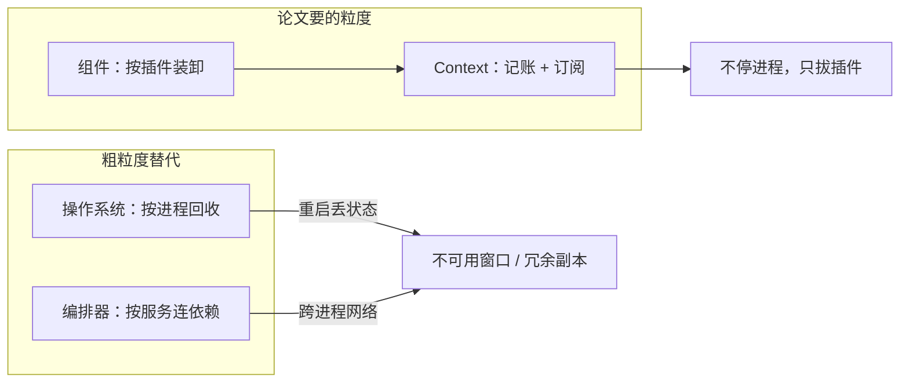

---

## 三、时间维度：可逆副作用

### 3.1 先把“副作用”说成人话

任何会改世界的函数，都可以改写成“带着环境一起走”的纯函数：输入是当前环境 `Γ` 和参数，输出是新环境和返回值。对固定输入，真正的副作用就是 `Γ → Γ` 的变换。

这些变换构成一个幺半群（monoid）：

- 两个副作用接起来还是副作用。
- 结合律：先做 A 再做 B 再做 C，怎么加括号结果一样。
- 单位元：什么都不做。

要能卸载，每个变换 `f` 必须配一个**左逆** `g`，满足在作用点上 `g(f(γ)) = γ`。注意是单向的：只要能撤回去，不要求再做一遍 `f` 能从任意状态还原。多个成对变换用**扭曲复合**：正向按应用顺序叠，逆向按相反顺序叠。这就是后进先出（LIFO）清理。

### 3.2 效应上下文：当前状态 + 回收器

论文把效应上下文写成 `∂Γ = Γ × (Γ → Γ)`，一对 `(γ, φ)`：

- `γ`：现在的环境。
- `φ`：**累加器**，到目前为止所有逆操作的复合。对它应用 `γ`，就能回到这一层开始时的状态。

初始是 `(γ0, id)`。每次 `track(f, g)` 用 `f` 改 `γ`，把 `g` 接到 `φ` 后面。`recover` 则执行 `φ(γ)` 并把累加器清回单位元。

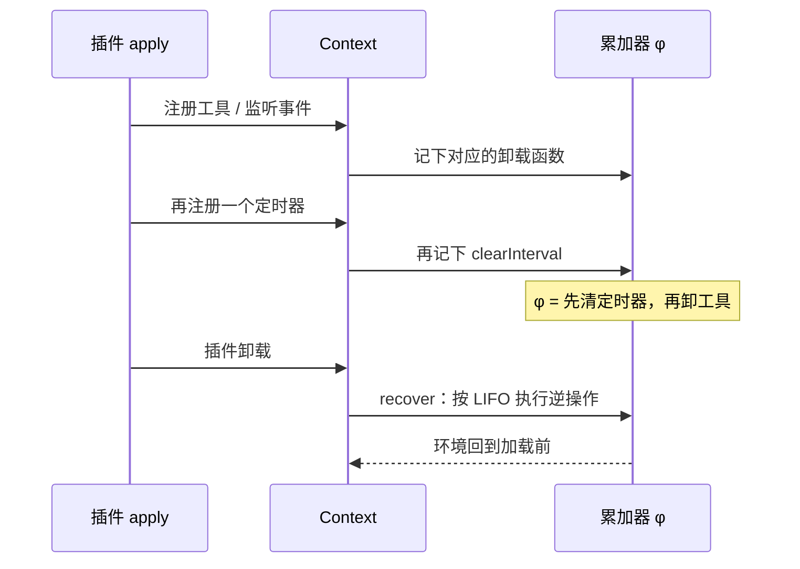

直觉对照：

| 论文 | 你可能写过的代码 |
| --- | --- |
| `track(f, g)` | `useEffect(() => { subscribe(); return unsubscribe })` |
| 累加器 `φ` | 插件私有的 disposer 栈 |
| `recover` | 按反序调用所有 disposer |
| 见证条件 `g(δ)=γ` | unsubscribe 必须真的把 subscribe 的效果撤掉 |

和 React `useEffect` 的关键差别：React 靠**调用顺序**把效应钉在隐藏的 fiber 状态上，效应目标和注册机制都不出现在参数里。Cordis 把每次改动都显式记在你传入的那个 `ctx` 上，所以卸载时知道该撤谁的账。

### 3.3 可逆效应函数：逆操作在调用点生成

预先准备一个对所有状态都成立的 `g` 往往不现实。实际需要的是类型 `e : Γ → Γ × (Γ → Γ)`：应用到当前 `γ`，得到新状态 `δ` 和**这一次**的逆 `g`。见证条件只要求 `g(δ)=γ`，别的状态上的 `g` 可以不管。

复合用 `⋄`：先做右边，再做左边，逆操作反向连接。这保证“加载时怎么叠，卸载时就怎么拆”。

`dsh` 插件里对应的就是 `ctx.effect()`：回调里做正向工作，返回 disposer。框架不验证 disposer 是否真的还原——那是作者义务——但它保证：**凡是走 Context 的改动，都会被记上，卸载时按 LIFO 回收。**

```ts
import type { Context } from '@deepseek-ai/cordis'

export const name = 'hello-timer'

export function apply(ctx: Context) {
  const id = setInterval(() => {
    console.log('[hello-timer] tick')
  }, 5000)

  // 返回值就是这次效应的逆操作
  ctx.effect(() => () => clearInterval(id))
}
```

不必再写单独的 `deactivate`。加载路径本身生成卸载路径。

### 3.4 效应独立：为什么能只拔一块积木

LIFO 对**同一个组件内部**的效应序列永远成立。真正难的是：系统里同时跑着很多组件，你要卸 A，B 的效应还在。这时 A 的逆操作碰到的不是它当初离开时的状态，而是被别人改过的状态。

论文用**独立性（independence）**刻画何时仍然安全：两边能做的变换必须彼此交换，而且一方的变换不能改掉另一方生成的逆。满足时，按任意顺序撤销一组独立效应，都能回到起点。

日常例子：

- **独立**：两个插件各自往路由表里登记一条互不干扰的路由。先卸谁都行。
- **不独立**：中间件链是有序的，A 插在 B 前面会看见不同的请求。这种顺序不能靠“效应自己交换”解决，必须升级成**余效应声明**——谁提供、谁依赖，由运行时规定激活和停用顺序。

DeepSeek Harness 里，工具注册、事件监听通常是独立的（一张表，条目可增可删）。Agent 循环对 `ctx.llm`、`ctx.tools` 的依赖则不是“登记一条就完”，而是空间维度要管的事。

---

## 四、空间维度：反应式余效应

### 4.1 余效应是“我需要什么”，不是“我改了什么”

效应：程序对环境做了什么。余效应：环境必须给程序什么——资源、权限、服务。古典余效应是编译期分析；论文把它做成运行时的依赖表。

余效应上下文 `Σ` 是一张**带类型的部分映射**：每个键 `k` 对应一种值类型。核心操作：

- `get(k)`：读依赖，键必须已经在。
- `set(k, v)`：提供依赖，键必须还没有；同时返回撤销函数（删掉这个键）。

关键观察：**`set` 本身就是可逆效应。** 所以“声明依赖”和“撤销副作用”用的是同一套账本。提供一个服务，卸载时服务自动从环境消失，并通知所有订阅者。

### 4.2 规格与三种通知

组件声明一个依赖集合 `d`（coeffect specification）。环境 `σ` 满足 `d`，当且仅当 `d` 里每个键都在 `σ` 的定义域里。

任意一次环境变化，相对 `d` 只可能是三种：

| 分类 | 含义 | 运行时动作 |
| --- | --- | --- |
| **activating** | 以前不满足，现在满足 | 执行组件效应（完整跟踪） |
| **deactivating** | 以前满足，现在不满足 | 用累加器回收 |
| **neutral** | 满足与否没变 | 什么都不做（refresh 幂等） |

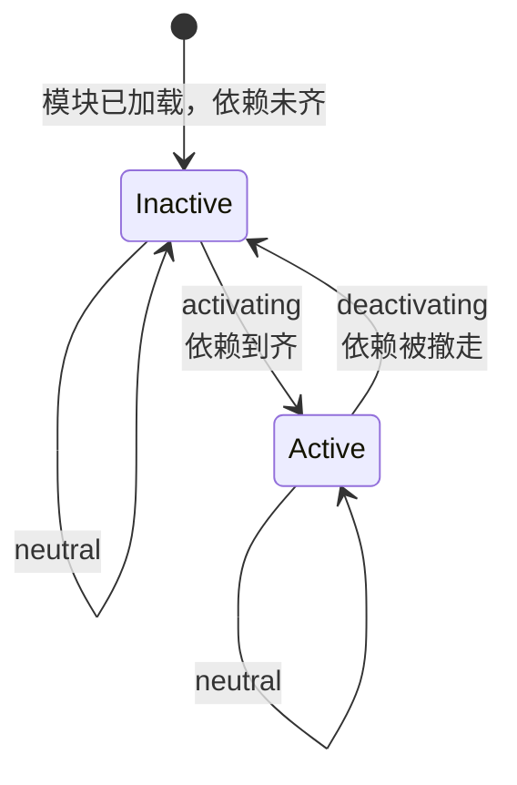

这给出**局部空间可组合性**：组件只在依赖齐的时候激活，所以不会读到不存在的绑定；每次环境变化都会被分类，丢失依赖会在发生处被发现并驱动停用。

单向顺序是免费的：A 提供 `k`，B 声明 `k`，则 B 只能在 A 激活并提供之后激活。反向不是免费的：卸 A 会弄坏 B 的满足性，但一次通知本身不能保证 B 拆卸期间 `k` 仍然可读，也不能保证 A 等到 B 拆完再回收。这要全局生命周期规则（见第六节）。

### 4.3 隔离与拦截

扁平依赖表不够用。论文加了两个派生机制，它们**不改共享表**，只派生一个子 Context，回收时丢掉子 Context 即可：

**隔离（isolate）**  
同一逻辑键在不同上下文可以绑到不同值。实现是两层：先把键映射到 realm，再从 realm 取真正的值。用途：多租户、测试替身、组件沙箱。DeepSeek Harness 里，不同 Agent 预设要不同工具面，服务行用 `isolate` realm，避免标准模式和极简模式抢同一份 `ctx.tools`。

**拦截（intercept）**  
给依赖访问附加横切元数据（权限、路径白名单），不改依赖值本身。元数据可以来自组件声明，也可以来自外层 Context；合并时外层优先，所以编排者能在不改插件源码的情况下收紧权限。论文讨论部分用文件系统举例：社区插件只读，核心插件可写。

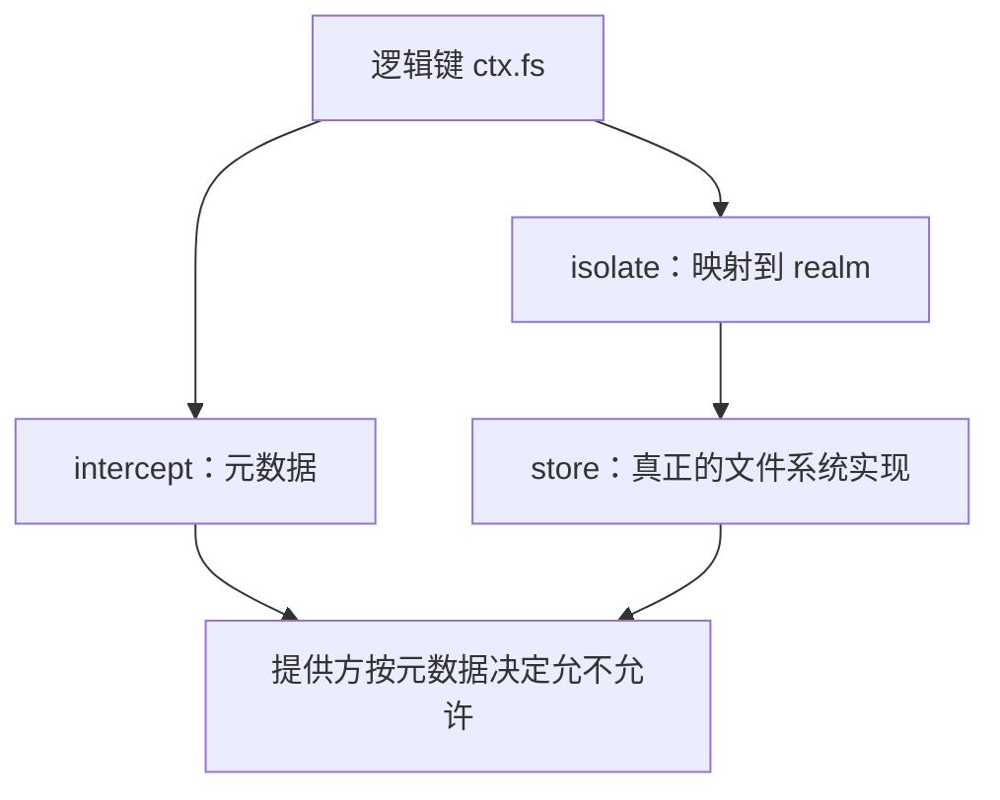

`dsh` 的权限预设（`workspace-write` / `read-only` / `danger-full-access`）在产品层是审批与沙箱策略；在 Cordis 层，同一思路是：声明能碰哪些键，再用拦截收紧每个键上的操作。

---

## 五、统一 Context：一种编程范式

### 5.1 一个类型同时装效应和余效应

效应上下文是 `∂Γ = Γ × (Γ → Γ)`。把它递归下去，再塞进余效应表 `Σ`，得到自相似的 Context 类型 `Γ∞ = μΓ. Γ × (Γ → Γ) × Σ`，三部分：

1. 当前子 Context（递归，所以是一棵树）。
2. 这一层的累加器。
3. 依赖表。

所有组件与环境的交互都经过这一个对象。共享可变状态也可以编码成某个键上的值——`Σ` 不只是“服务发现”，而是组件之间能看见的全部共享状态。

树形结构对应“插件”这个隐喻：

- 加载 = 执行效应（插上）。
- 卸载 = 回收效应（拔掉，不影响旁边的插件）。
- 父 Context 聚合子级效应，可以任意嵌套。

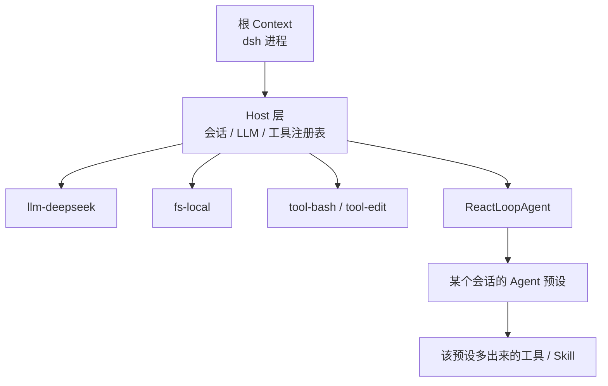

这就是 `dsh` 启动后那棵插件树。没有特权内核需要打补丁：Agent 循环本身也是插件。

### 5.2 观察等价：不要求物理状态逐字节还原

`malloc` 的逆是 `free`，但堆布局不会回到分配前；生成式名字被丢掉后，下一次创建会拿到新名字。所以“还原”应读成**观察等价** `≃`：没有观察者能分辨两个状态。

观察者手里只有余效应——每个键自带一组操作和该键上的等价关系。键没绑住的东西（堆布局、内部生成名）默认被忘掉。于是：

- 相关状态有相同的键集合，满足性谓词一致，反应性在商集上仍然成立。
- 两个不同键上的操作天然独立（各改各的格子）。
- 同一键是否可交换，取决于它公布的接口：路由表通常可交换；有序中间件链通常不可交换。

论文把“能交换的部分”交给效应（想什么顺序撤就什么顺序撤），把“必须保序的部分”交给余效应（提供者先于消费者激活，消费者先于提供者停用）。可组合性因此发生在**组件粒度**，而不是每一次原子效应。

### 5.3 在函数式和命令式之间

论文把 Context 范式放在两个极端中间：

| 极端 | 代表 | 优点 | 代价 |
| --- | --- | --- | --- |
| 显式传状态 | State 单子、效应处理器 | 可推理、类型里看得见 | 调用链上每个函数都要接管子 |
| 隐式乱改 | 全局单例、Spring `getBean`、React `useEffect` 的隐藏 fiber | 写起来顺 | 改动和依赖散落，删除一处可能弄坏远处 |

Context 范式：每个操作都经过显式的 `ctx`，所以改动可归因到所属组件；开发者只为原子操作提供逆，复合的卸载由框架推导；开发者只声明需要的依赖，接线由运行时维护。**本来靠纪律保证的正确性，变成范式的结构性质。**

写 `dsh` 插件时的体感就是这样：`apply(ctx)` 里用 `ctx.tools.register(...)`，不必在卸载函数里再写一遍 `unregister`。

---

## 六、组件演算：从单个插件到整棵树

局部保证只对“一个组件自己的效应 / 依赖”成立。要让整棵交错的插件树也成立，需要把系统拆成组件，并给出生命周期的操作语义。

### 6.1 组件、Fiber、注册表

一个组件是三元组 `(d, p, e)`：

- `d`：它要读的键（DeepSeek Harness 的 `inject`）。
- `p`：它可能写入的键（`provide`）。
- `e`：激活时贡献的可逆效应（`apply`）。

**Fiber** 是组件的一次实例，带着自己的生命周期状态。运行中的系统是一张 fiber 注册表；余效应表可以从“当前谁 ACTIVE、提供了什么”读出来。

`dsh` 对照：

| 论文 | Cordis 实现 | DeepSeek Harness |
| --- | --- | --- |
| 组件 | `inject` + `provide` + `apply` | 一个插件模块 |
| Fiber | `fiber.uid` / `fiber.state` | 配置树里的一行（有 `id`） |
| `d` | `fiber.inject` | `export const inject = ['tools']` |
| `e` | `fiber.apply` | `export function apply(ctx)` |
| 累加器 | `fiber.dispose` | 插件卸载时自动跑的 disposer 链 |
| 已提交视图 | `fiber.committed` | 这次激活真正绑上的服务快照 |

### 6.2 生命周期不是“加载 / 运行 / 销毁”三拍

真实运行时里，迁移不是原子、不是瞬时、也不是永不失败。论文逐步放开三个假设，得到 inertial（惯性）状态机：

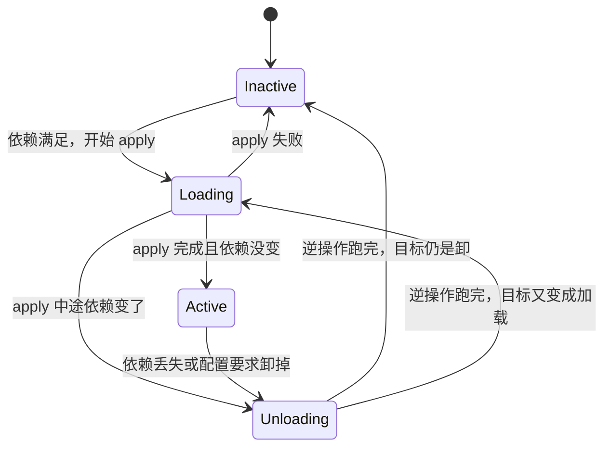

几个对 `dsh` 很重要的设计：

1. **惯性**：reload / unload 一旦开始，先跑完，再看目标有没有变。不会在半截效应上叠加新的半截效应。
2. **先停止提供，再回收**：进入 UNLOADING 的那一刻，这个 fiber 已经不出现在“当前提供者”里。依赖它的插件会先开始拆自己，而它的绑定此时还在——拆卸期间仍然读得到。
3. **卸提供者要等依赖方**：`unload` 先通知并等待依赖方到达 INACTIVE，再执行自己的 disposer。这就是全局空间可组合性：A 提供、B 依赖时，顺序是 B 先停、A 再撤。
4. **失败是发散源**：某次调度可能让 fiber 失败，另一次可能成功。失败 fiber 对共享状态的贡献必须是空的（它装上去的东西会被撤掉）。

### 6.3 元理论用白话说

不必记住定理编号，记住五句保证：

| 性质 | 白话 |
| --- | --- |
| **Preservation** | 每一步之后系统仍处于良定义状态。 |
| **时间可组合性** | 卸掉一个 fiber，它留下的可观察贡献是空的。 |
| **空间可组合性** | 组件只在依赖被提供时开始迁移；依赖在整个活跃期（含拆卸）保持可读；提供者的身份不会在迁移中途偷换。 |
| **Progress** | 依赖图无环时不会死锁，有限步后进入静止。 |
| **Confluence** | 不管中间经历怎样的装卸顺序，静止后的状态等于“按最终配置从头装一遍”。 |

最后一条特别重要：它允许你把运行中的 Cordis 应用**当成静态组装来推理**。编排器加一个组件、去掉一个、换掉提供者再换回来，最终状态与一开始就写成最终配置相同。失败被排除在这条之外——失败是真发散，但失败组件不会污染别人的状态。

这也是 `dsh` 里改 `cordis.patch.yml` 可以热更新的许可证：调和（reconciliation）随便增删行，静止后的树只取决于最终那份配置。

---

## 七、Cordis：论文落到代码

Cordis 是时空可组合性的元框架：不规定 Web、ORM 或 UI，只提供通用的动态组合语义。三层：

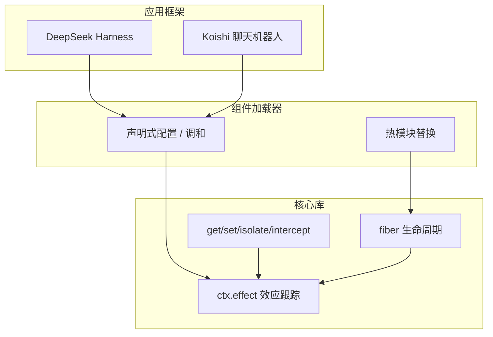

### 7.1 核心原语

几乎所有会改 Context 的操作都汇聚到 `ctx.effect`。提供服务、实例化子组件，最后都是一次被跟踪的效应。

伪代码对应论文 Algorithm 1 / 2 / 4 / 5：

```ts
// 提供服务 = 可逆效应
ctx.set('tools', toolRegistry)
// 卸载时自动 delete，并 notify 依赖方

// 声明依赖，未就绪则 apply 不会跑
export const inject = ['tools']

export function apply(ctx: Context) {
  ctx.tools.register(/* ... */)
  // register 内部同样走 effect，unload 时自动撤销
}

// 父插件实例化子插件 = 父级的一次效应
ctx.use(childComponent, config)
// 父卸载时，子的 target 被置空并 unload
```

`ctx.tools` 这种属性访问不是直接读全局单例。TypeScript 里 Context 是 Proxy：从当前 fiber 往父级走，只允许读**已声明且已提交**的键。未声明访问会失败。这既是人体工学（写起来像对象字段），也是能力安全（没有环境权限）。

### 7.2 声明式加载器 = `dsh` 的 Profile / Bundle / Patch

编排者不该手写一长串 `ctx.use`。加载器把期望状态写成配置树，diff 之后变成最少的加载 / 卸载：

- 改 `id` / `url`：重建这一行。
- 改 `isolate`：重分配 realm。
- 改 `intercept`：就地更新，不必重载。
- 改 `config`：交给组件自己决定是否重载。
- 改 `disabled`：卸或重新装。

`dsh` 的叠加顺序就是加载器调和：

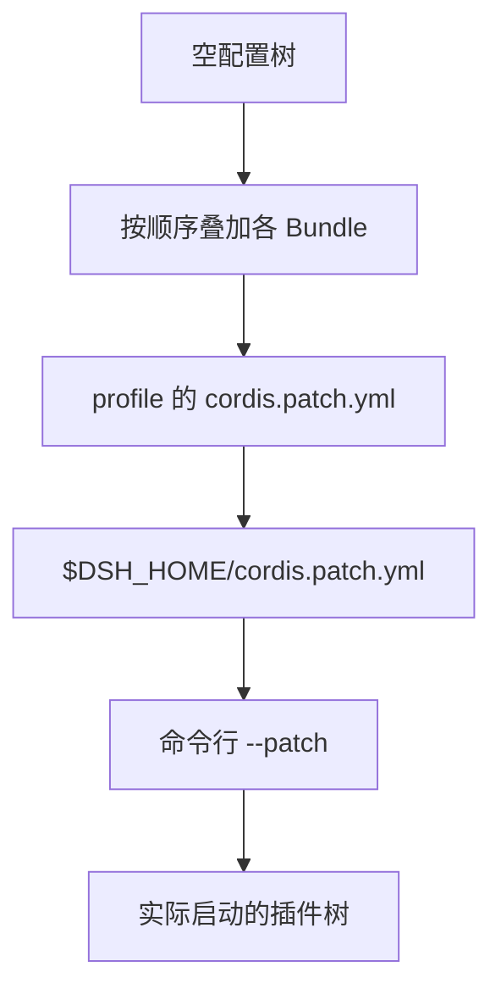

Bundle 是“Cordis 配置行 + 挂载代码”的分发格式。`dsh-base` 是底座，`dsh-web-app` 加上浏览器应用，`dsh-headless` 加上一次性运行器。Patch 按 `id` **整行替换** `config`，不是深合并——这是配置即期望状态，不是 Git merge。

HMR：代码或配置变更时，加载器只撤回受影响 fiber 的效应，再装新版本。无关插件的缓存和连接保留。论文的 Koishi 案例把这当成四年生产证据：控制台禁用插件会就地撤回效应；开发时保存文件只重放被编辑的插件。

### 7.3 Koishi：先于 Agent 的存在性证明

Koishi 是模块化聊天机器人框架，用 Cordis 跑了四年（案例基于 v3；论文讲的是 v4，语义更明确，组合模型一脉相承）。它说明两件事：

1. **时间维度对作者几乎零成本**：只要走 Context，即使不熟练的作者也能得到有序清理，不必手写卸载路径。
2. **空间维度能跨开源生态工作**：IM 适配器提供平台访问，数据库驱动提供存储，功能插件只声明这些余效应。换存储后端或重连适配器时，只重激活解析结果变了的依赖方；依赖还没到的插件保持未激活，而不是报错。

威胁：这是单生态、单语言的观察性证据，不是对照实验。论文自己把这一点写进了 validity。

---

## 八、用 DeepSeek Harness 把论文跑一遍

下面不再抽象讲“组件”，而用 `dsh` 的一次真实生命周期对照论文。

### 8.1 启动：声明式配置变成 fiber 树

```sh
npx @deepseek-ai/dsh web
```

启动器读 profile `web`，叠 Bundle，再叠 patch，得到一棵配置树。加载器并发拉取模块——依赖不决定“何时 download”，只决定“何时 ACTIVE”。`llm-deepseek` 提供 `ctx.llm`，`core/tools` 提供 `ctx.tools`，`ReactLoopAgent` 声明这些依赖，齐了才进入 `apply`。

这就是论文 1.2.2 节说的 harness：工具、沙箱、会话、循环、UI 全是可替换组件。

### 8.2 四种预设：同一 Host，不同余效应

Web UI 的四种预设不是四套提示词，而是挂在同一 Host 上的四种能力组合：

| 预设 | 多出来 / 少掉的东西 | 论文视角 |
| --- | --- | --- |
| `standard` | 完整编码工具面 | 一组消费者 fiber，依赖 fs / shell / tools |
| `code` | 同一工具面，经 Code Mode SDK 暴露 | 同一批余效应，换一种调用形态 |
| `minimal` | 只留 `bash` 和 `str_replace_editor` | 更小的 `d` 和更少的 `p`，适合公平评测 |
| `cordis` 创造模式 | 标准模式 + 运行时自省、内存中试验插件 | 论文说的 **self-evolving harness**：Agent 改自己的组件 |

会话级能力差异靠 `isolate`：每个预设的服务行在自己的 realm 里，互不抢绑定。换预设不会热更新已经跑着的会话——fiber 在会话开始时固定，这是惯性：中途改 `d` 等于换组件身份，应该新开会话。

### 8.3 写插件：`inject` + `apply` 就是 `(d, e)`

```ts
import type { Context } from '@deepseek-ai/cordis'
import { defineTool } from '@deepseek-ai/dsh-tools'

export const name = 'my-tool'
export const inject = ['tools']

export function apply(ctx: Context) {
  ctx.tools.register(defineTool({
    name: 'read_file',
    description: 'Read a file from disk.',
    parameters: {
      path: { type: 'string', required: true, description: 'Absolute path' },
    },
    output: {
      schema: { type: 'string' },
      render: (_args, value) => [{ type: 'text', text: value }],
    },
    async execute(args, exec) {
      return readFile(args.path, { encoding: 'utf8', signal: exec.signal })
    },
  }))
}
```

对照：

- `inject: ['tools']` → 余效应规格 `d`。没有 `ctx.tools` 时 `apply` 不会跑。
- `ctx.tools.register` → 对 `tools` 这个键上的操作，本身是可逆效应。
- 插件卸载 / 热更新 → `fiber.dispose` 按 LIFO 撤销登记。
- 不必改 Agent 循环源码 → 没有特权内核，新行为挂到已有 seam。

这就是为什么官方说：换文件系统提供方，Bash、PTY、LSP 会一起搬走。消费者依赖的是 `ctx.fs` 这个键，不是某个具体实现类。

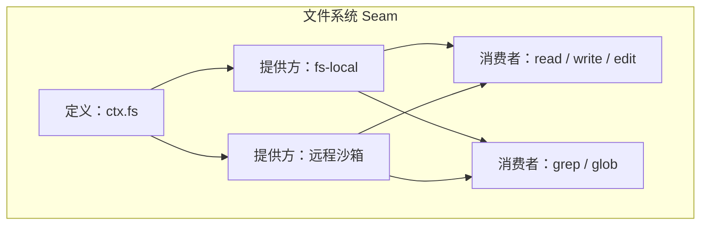

Seam = 余效应键。提供方可以换，消费者不用 fork。

### 8.4 改 patch：调和而不是重启 `dsh`

加入 MCP 客户端时，你插入的是配置行，不是改 harness 源码：

```yaml
- insert:
    - id: mcp-github
      name: '@deepseek-ai/dsh-mcp-client'
      config:
        serverName: github
        transport: stdio
        command: npx
        args: ['-y', '@modelcontextprotocol/server-github']
```

加载器对这一行做 O-Insert（`ctx.use`）。MCP 工具出现在模型面前。删掉这一行或改 `disabled`，对应 fiber 进入 UNLOADING：先让依赖这些工具的 Agent 侧状态失效，再断开 stdio。编辑配置会 HMR 断开并重连；不改 `serverName` 则工具名稳定——因为调和键是 `id`，对外名字是配置的一部分。

这正是 confluence：中间怎么插拔，静止后的树等于最终 YAML。

### 8.5 创造模式：论文动机的现场演示

论文担心的最坏情况是：harness 在无人值守下修改自己，错误修改却卸不掉。创造模式把这个问题从未来时变成现在时：

- Agent 可以自省插件树、在内存中试验插件、编写新预设。
- 每一次试验仍是 `ctx.use` + 可逆效应。试验失败，fiber 失败，贡献必须被撤空。
- 因此“让 Agent 改运行时”在理论上可接受，前提是**所有改动走 Context**。直接改全局单例、直接 `require` 副作用模块，就走出了系统边界（见第九节）。

这也是为什么创造模式属于高信任，不该对着含密钥的生产目录随手开：理论保证的是 Context 内的装卸，不是模型一定不会做蠢事。Harness 还要审批、沙箱、会话日志。时空可组合性管的是**改动能不能干净撤销**，不管**该不该让模型去改**。

### 8.6 一次工具调用里的两层组合

用户发一条消息之后，表面上是 Agent 循环；底下是两棵树叠在一起：

```mermaid
sequenceDiagram
    participant U as 用户
    participant Loop as ReactLoopAgent（插件）
    participant LLM as ctx.llm（插件）
    participant T as ctx.tools（插件）
    participant P as 你的 my-tool（插件）

    U->>Loop: followup
    Note over Loop: 余效应：llm、tools、session 必须 ACTIVE
    Loop->>LLM: agent/request
    LLM-->>Loop: 要调用 read_file
    Loop->>T: tools/pre-execute
    T->>P: execute
    P-->>T: 文件内容
    T-->>Loop: tool/result
    Loop->>LLM: 下一步
    LLM-->>Loop: 最终回复
```

- **空间**：循环插件声明了 `llm` 和 `tools`；你的工具插件声明了 `tools`。缺任何一个，对应 fiber 保持 Inactive，模型根本看不到那项能力。
- **时间**：会话结束或预设卸载时，工具登记、事件监听、MCP 连接按累加器撤掉，不必重启 Web UI。

会话日志的不变量“模型可见即已记录”是 harness 产品层的设计；Cordis 保证的是插件树本身可插拔。两者正交：一个管轨迹可回放，一个管运行时可热更新。

---

## 九、边界、局限和读论文时容易误会的地方

### 9.1 系统边界：不是所有副作用都能撤销

逆操作对什么成立，取决于边界。

- **边界内**：系统能独占修改，并能恢复到修改前（在观察等价的意义下）。这些操作记入 `Γ`，可回收。
- **边界外**：做不到其中一点。操作视为恒等，既不跟踪也不回收。

例子：私有临时文件可以在边界内；别的程序也在写的路径在边界外。论文把一次外部操作拆成两段：

1. **获取（acquisition）**：`open` / `malloc` / `fork` 在边界内留下记录（文件描述符、句柄、子进程号）。记录是可逆的。
2. **排放（emission）**：`write` / `send` 把数据推到外面。推出去的字节不在 `Γ` 里。

所以：卸载插件可以关掉它打开的连接（获取被撤销），但不能收回已经发到网上的数据包（排放越界了）。需要的话，只能延迟提交，或提供补偿事务（删掉已创建的文件、退款）。补偿按同样的 LIFO 组合，但元理论不再自动成立，因为等价关系被应用放粗了。

对 `dsh`：`ctx.effect` 能保证工具从模型的工具表里消失、MCP 子进程被杀掉；不能保证模型已经执行过的 `rm` 能撤销。审批和沙箱仍然必要。

### 9.2 服务复用：换模型为什么不必重载整个 Agent

同一接口多个提供方时，论文给了两种做法：

- **独占绑定**：同时最多一个提供方。切换要卸旧装新，消费者会短暂失去依赖并重载。
- **服务代理（broker）**：消费者只依赖代理。后端提供方注册到代理上（可逆效应）。换后端时代理还在，消费者不重载。

`dsh` 的模型路由更接近第二种：设置里改 API Key 立刻可用，不必重启 Web UI。Agent 循环依赖的是 `ctx.llm` 这个键，真正的 HTTP 适配器可以在键后面换。滚动更新、跨进程 RPC 也按同一模式讲，但跨进程必须是异步契约。

### 9.3 依赖图不能有环

进度定理假设提供/消费关系无环。组件声明自己提供的键，会形成 `n ≺ n`。自演化 harness 如果让 Agent 无界地注册“会再注册自身”的组件，fiber 名字集合可能无穷，终止性假设被打破。实践上：预设和插件是有限程序，加载器按配置树展开，深度和分支都被配置限制。

### 9.4 这是预印本

仓库 README 写明：内容可能大幅修改，引用请核对最新版。DeepWiki 索引日期是 2026 年 8 月 14 日。Cordis API 随 DeepSeek Harness 开发者预览一起，仍可能发生破坏性变更。

---

## 十、如果想继续读公式

论文结构很干净，可以按角色选读：

| 你是 | 建议读 |
| --- | --- |
| 要写 `dsh` 插件 | 第 1 节动机 + 第 5 节实现对照表 + 本文第八节 |
| 要理解为什么能热更新 | 第 3.1–3.2 节 + 第 5.2 节调和 |
| 要抠形式化 | 第 3.3 节观察等价 + 第 4.4 节元理论 |
| 要做安全 / 沙箱 | 第 3.2.3 节隔离拦截 + 第 6.3 节能力控制 |
| 要比较相关工作 | 第 7 节：效应系统、RAII、OSGi、DI 容器、HMR |

第 2 节是效应 / 余效应速成：单子效应、代数效应与 handler、余效应的余单子和分级半环。读过 Haskell / Koka 会很顺；没读过也不影响第 3 节——第 3 节是把这些概念**运行时化**，不再做编译期分析。

形式化核心可以压成四张图：

1. `track` / `recover`：正向变换进状态，逆向进累加器。
2. `notify_d`：一次环境变化相对依赖集只有三种标签。
3. `Γ∞`：树状 Context，每层都有自己的累加器和依赖表。
4. fiber 状态机：Inactive / Loading / Active / Unloading，带惯性和“先停供再回收”。

DeepWiki 把同一套概念映射到 `ctx.effect`、`fiber.inject`、`fiber.dispose`、`fiber.committed`，适合对着 [cordis 仓库](https://github.com/cordiverse/cordis) 读实现。

---

## 十一、给 Harness 工程师的结论

把论文和 DeepSeek Harness 叠在一起，得到一条能用的工程原则：

**想让 Agent 运行时可演化，就不要让任何能力活在特权内核里。让它成为 Context 上的一个键：提供是可逆效应，消费是反应式余效应，组装是可调和的配置树。**

由此可以核对你正在做的事：

1. 新能力是不是只能通过 `apply(ctx)` 挂上？如果必须改循环源码，时空可组合性在这里断了。
2. 卸载路径是不是从加载路径推导出来的？如果又在写对称的 `deactivate`，关注点再次被撕开。
3. 依赖是不是声明在 `inject` 里？如果 `apply` 里直接抓全局，Proxy 的能力边界被绕过。
4. 配置变更走不走调和？如果靠重启进程恢复一致性，又退回粗粒度替代方案。
5. 排放性副作用（已发送的邮件、已执行的 `rm`）有没有审批 / 补偿？论文不会替你撤销它们。

DeepSeek Harness 把这条原则产品化成：模型、工具、Skills、会话、沙箱、存储、循环、调度和 UI 全部是插件。论文则说明，为什么这样组装不会在热更新时留下幽灵监听器、半死不活的依赖和只有重启才能治的状态。

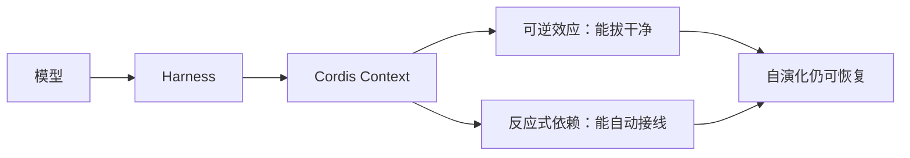

相关阅读：

- 论文 PDF：[github.com/cordiverse/paper](https://github.com/cordiverse/paper)
- DeepWiki：[deepwiki.com/cordiverse/paper](https://deepwiki.com/cordiverse/paper)
- Cordis 实现：[github.com/cordiverse/cordis](https://github.com/cordiverse/cordis)
- DeepSeek Harness：[github.com/deepseek-ai/deepseek-harness](https://github.com/deepseek-ai/deepseek-harness)
- 本站使用指南：[DeepSeek Harness 完全使用指南](/2026-08-17-deepseek-harness-complete-guide)
- 本站方法论：[Harness Engineering：驾驭 AI 智能体的工程方法论](/2026-03-28-harness-engineering-guide)
