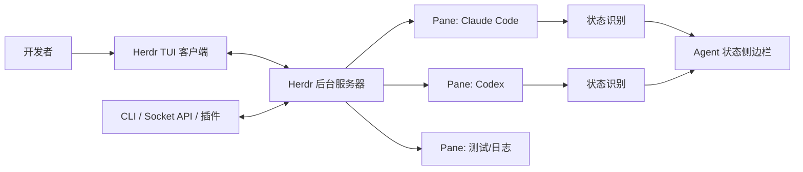
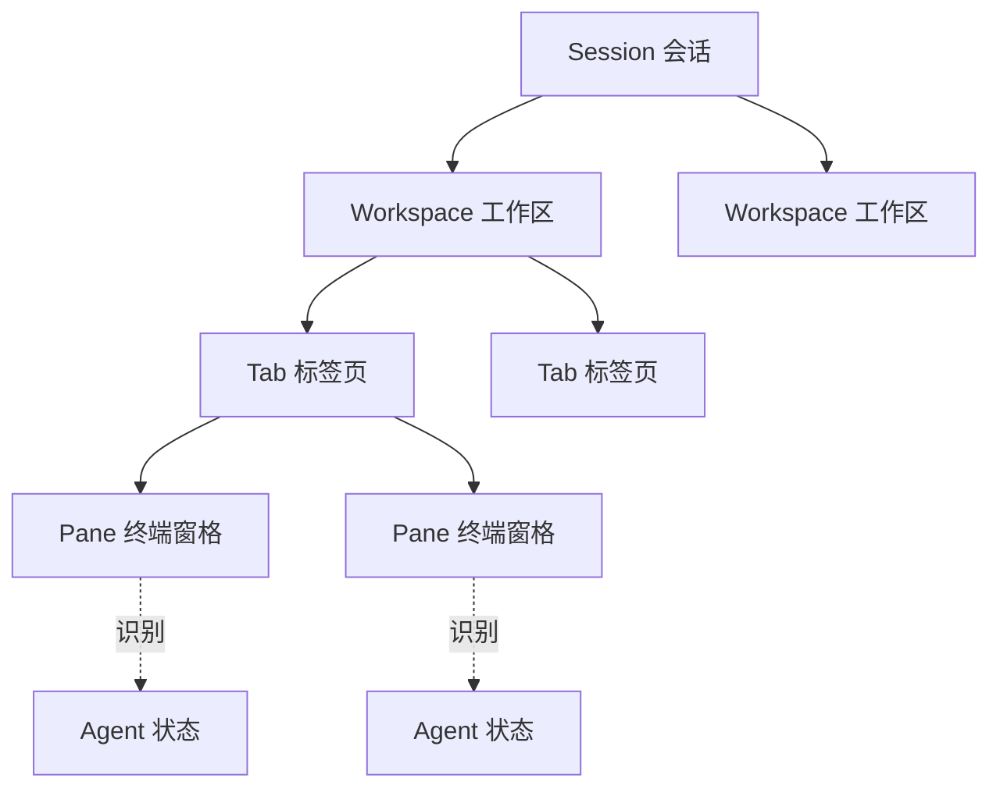
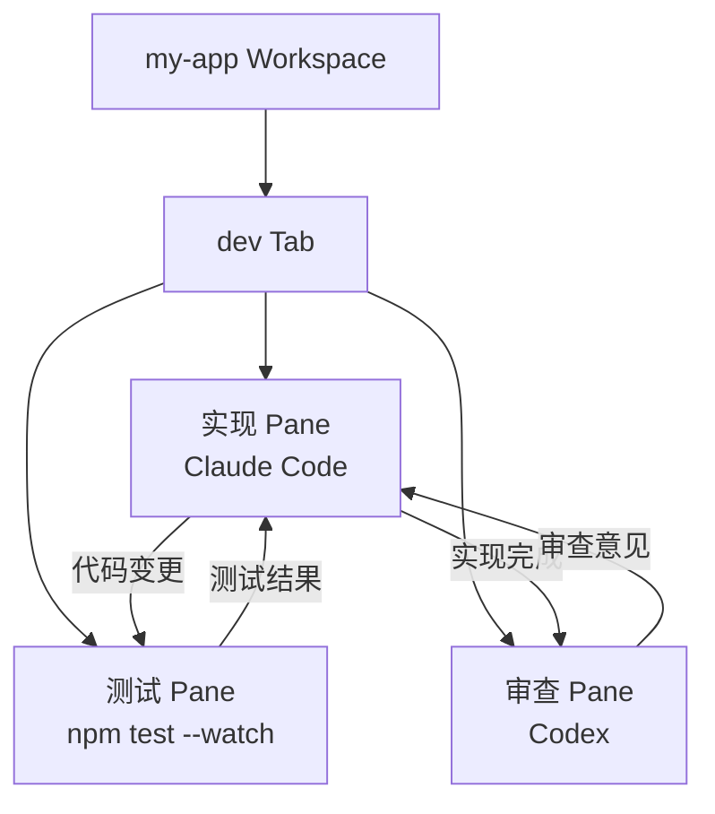
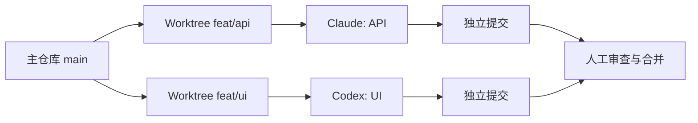
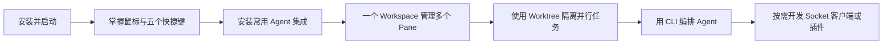

> **Herdr** 是专为 AI 编码 Agent 设计的终端工作区管理器与运行时。它不替代 Claude Code、Codex、Cursor Agent、OpenCode 等工具，而是接管它们所在的真实终端，为多 Agent 提供持久会话、状态识别、统一导航，以及可编程的 CLI、Socket API 和插件系统。

本文依据 [Herdr GitHub 仓库](https://github.com/herdrdev/herdr)、[官方文档](https://herdr.dev/docs/) 与 [DeepWiki 代码解析](https://deepwiki.com/herdrdev/herdr) 整理，覆盖安装、概念、日常操作、配置、远程访问、自动化编排和实战案例。文中功能状态截至 **2026 年 8 月**，Windows 原生版本仍处于 Beta。

---

## 一、为什么需要 Herdr

普通终端或传统终端复用器可以同时打开多个 Shell，却不知道哪个窗格中运行着 Agent，也不知道 Agent 正在工作、等待审批还是已经完成。并行任务一多，开发者就需要不断切换窗口检查状态。

Herdr 在终端复用能力之上增加了 Agent 语义：

- **后台持久运行**：客户端退出后，服务器继续持有终端和进程。
- **Agent 状态可见**：侧边栏集中显示 `working`、`blocked`、`done`、`idle` 等状态。
- **保留原有工具链**：Agent 仍在真实 Shell 中运行，无需迁移到专有 IDE。
- **支持鼠标与键盘**：可以点击、拖动、右键分屏，也支持类似 tmux 的前缀键。
- **面向自动化**：Agent 和脚本可以创建窗格、发送任务、读取输出并等待状态变化。
- **单个 Rust 二进制**：无需 Electron，也没有常驻 Web 应用依赖。

### Herdr 与普通终端复用器的区别



Herdr 的关键不是“能分屏”，而是服务器能够理解窗格中的 Agent 生命周期，并把同一套控制能力暴露给人、脚本和 Agent。

---

## 二、核心概念与架构

### 2.1 对象层级



- **Session**：独立的 Herdr 服务器命名空间，也是持久化边界。多数用户使用默认会话即可。
- **Workspace**：项目级容器，通常对应一个 Git 仓库、一个 worktree 或一项调查任务。
- **Tab**：工作区内的一套窗格布局，可用于区分 `agents`、`server`、`tests`、`logs` 等视图。
- **Pane**：真正运行 PTY/ConPTY 和 Shell 进程的终端实例。
- **Agent**：Herdr 在 Pane 中识别出的逻辑状态层，并不是额外包装进程。

### 2.2 客户端与服务器

Herdr 默认采用客户端/服务器模型：

1. 执行 `herdr` 时，如果服务器不存在，则自动启动后台服务器。
2. 服务器负责终端进程、布局、状态检测和会话数据。
3. TUI 客户端只负责显示与交互。
4. 客户端分离后，服务器和窗格进程继续运行。
5. 再次执行 `herdr` 即可重新连接。

需要特别区分两种持久化：

- **客户端分离**：进程仍由正在运行的服务器持有，因此 Agent 不会中断。
- **服务器冷重启**：Herdr 会恢复工作区、标签页和窗格结构；只有拥有有效原生会话引用的受支持 Agent 才能恢复对话。不要把它理解成所有任意进程都能跨机器重启继续执行。

### 2.3 Agent 状态

Herdr 使用以下语义状态：

- `working`：Agent 正在执行任务。
- `blocked`：Agent 等待输入、批准或决策。
- `done`：后台任务已经结束，但用户还没有查看该标签页。
- `idle`：Agent 已结束或正在等待，而且结果已被查看。
- `unknown`：Herdr 检测到了 Agent，但无法可靠判断生命周期。

状态会从 Pane 向 Tab、Workspace 汇总。例如，只要一个工作区内存在 `blocked` Agent，侧边栏就会突出提示该工作区需要处理。

### 2.4 状态如何被检测

Herdr 有两类状态来源：

1. **生命周期集成**：通过 Agent 的 Hook 或插件直接上报状态，准确度更高。
2. **屏幕规则检测**：识别前台进程，并用 TOML Manifest 匹配终端底部缓冲区中的提示、加载动画和审批界面。

Claude Code、Codex、Cursor Agent 等可通过屏幕规则识别；Pi、OpenCode、Kimi、OMP 等在安装集成后可提供更完整的生命周期状态。无法识别的 Agent 仍可正常运行，只是状态可能不够丰富。

---

## 三、安装与升级

### 3.1 Linux 与 macOS

官方安装脚本会检测操作系统和 CPU 架构：

```bash
curl -fsSL https://herdr.dev/install.sh | sh
```

也可以使用包管理器：

```bash
# Homebrew
brew install herdr

# mise
mise use -g herdr
```

Nix 用户可以按发布标签安装，避免无意间追踪开发分支：

```bash
# 将 v0.x.y 替换为最新 Release 标签
nix profile install github:herdrdev/herdr/v0.x.y
```

### 3.2 Windows Beta

Windows 原生版本使用 ConPTY，目前只通过 Preview 渠道发布：

```powershell
powershell -ExecutionPolicy Bypass -c "irm https://herdr.dev/install.ps1 | iex"
```

安装包包含应用本地的 ConPTY 运行时。手动下载 ZIP 时，应保留完整解压目录，不要只复制 `herdr.exe`。

### 3.3 验证与更新

```bash
herdr --version
herdr
```

由官方脚本安装的版本可以直接更新：

```bash
herdr update
```

Homebrew、mise 和 Nix 安装应继续通过原包管理器升级。Linux 与 macOS 直接安装默认使用稳定渠道，也可主动切换：

```bash
herdr channel show
herdr channel set preview
herdr channel set stable
```

Preview 可能包含尚未进入稳定版的修复，也可能引入回归。Windows Beta 当前只能使用 Preview。

---

## 四、五分钟快速入门

### 4.1 启动第一个工作区

进入项目目录并启动：

```bash
cd ~/projects/my-app
herdr
```

首次进入时，Herdr 会自动创建 Workspace、Tab 和根 Pane。在当前 Pane 中启动已有的编码 Agent：

```bash
claude
# 也可以启动 Codex、Cursor Agent、OpenCode、Pi 等受支持工具
```

Agent 被识别后会出现在侧边栏中。

### 4.2 使用鼠标

- 点击 Pane、Tab、Workspace 或 Agent 可直接聚焦。
- 右键打开上下文菜单，可分屏或创建 Tab。
- 拖动分割线调整 Pane 大小。
- 拖选文本会复制到剪贴板，无需按 `Ctrl+C`。
- 双击 Token 可以快速复制。
- `Ctrl+单击` 可打开 OSC 8 超链接或可见的 HTTP/HTTPS 地址。

### 4.3 最常用的键盘操作

默认前缀键是 `Ctrl+B`。例如 `prefix+c` 表示先按下并松开 `Ctrl+B`，再按 `c`。

- `prefix+c`：新建 Tab。
- `prefix+v`：向右分屏。
- `prefix+minus`：向下分屏。
- `prefix+h/j/k/l`：在 Pane 之间移动。
- `prefix+n` / `prefix+p`：下一个/上一个 Tab。
- `prefix+w`：进入 Workspace 导航。
- `prefix+z`：缩放当前 Pane。
- `prefix+[`：进入复制模式。
- `prefix+?`：显示当前所有快捷键。
- `prefix+q`：分离客户端，但保留后台任务。

### 4.4 分离、重连与停止

```bash
# 在 TUI 内按 Ctrl+B，然后按 q
# 或直接关闭外层终端

# 稍后重连默认会话
herdr

# 真正停止默认服务器及其所有 Pane
herdr server stop
```

不要把“关闭外层终端”和 `herdr server stop` 混为一谈。前者保留任务，后者会结束会话中的 Pane 进程。

---

## 五、安装 Agent 集成

先查看当前集成状态：

```bash
herdr integration status
```

然后按实际使用的 Agent 安装：

```bash
herdr integration install claude
herdr integration install codex
herdr integration install cursor
herdr integration install opencode
herdr integration install pi
```

集成的作用因 Agent 而异：有些只上报原生会话 ID，用于服务器重启后的会话恢复；有些还能直接上报完整生命周期。安装集成后，Herdr 会优先选择相应的权威状态来源，避免与屏幕规则产生两个互相竞争的结果。

如果侧边栏状态明显不正确，可运行：

```bash
herdr agent list
herdr agent explain <agent-name-or-pane-id> --verbose
herdr server update-agent-manifests
```

`agent explain` 会给出当前 Manifest 来源、匹配规则、证据区域和回退原因，是排查误判的首选命令。

---

## 六、配置文件与个性化

配置文件位置：

```text
Linux / macOS: ~/.config/herdr/config.toml
Windows:       %APPDATA%\herdr\config.toml
```

Herdr 无配置即可运行。需要完整模板时可以打印默认配置：

```bash
herdr --default-config
herdr --default-config > ~/.config/herdr/config.toml
```

修改后重载大多数设置，不必终止 Pane：

```bash
herdr server reload-config
```

### 6.1 一份实用的基础配置

```toml
onboarding = false

[terminal]
new_cwd = "follow"
shell_mode = "auto"

[keys]
prefix = "ctrl+b"
new_tab = "prefix+c"
next_tab = "prefix+n"
previous_tab = "prefix+p"
focus_pane_left = "prefix+h"
focus_pane_down = "prefix+j"
focus_pane_up = "prefix+k"
focus_pane_right = "prefix+l"
split_vertical = "prefix+v"
split_horizontal = "prefix+minus"

[theme]
name = "catppuccin"

[ui.toast]
delivery = "herdr"
delay_seconds = 1

[ui.toast.herdr]
position = "bottom-right"

[worktrees]
directory = "~/.herdr/worktrees"
```

`terminal.new_cwd = "follow"` 会让新 Pane 继承源 Pane 或 Workspace 的目录，适合多 Agent 在同一项目中工作。

### 6.2 为常用工具添加弹窗

```toml
[[keys.command]]
key = "prefix+alt+g"
type = "popup"
command = "lazygit"
description = "打开 lazygit"
width = "80%"
height = "80%"
```

在 Windows 上，自定义命令字符串默认由 `cmd.exe /d /c` 执行；如果需要 PowerShell 语法，应显式调用 `powershell.exe -NoProfile -Command "..."`。

### 6.3 通知策略

当后台 Agent 完成或请求输入时，可以选择以下通知方式：

- `herdr`：Herdr 内部 Toast。
- `terminal`：由外层终端发送通知，适合 SSH。
- `system`：本机操作系统通知。
- `off`：关闭弹窗。

Herdr 会抑制当前活动 Tab 的完成通知，避免正在查看任务时重复打扰。

---

## 七、会话、远程访问与 Worktree

### 7.1 命名会话

Workspace 适合分隔项目；只有需要完全独立的服务器、Socket 和运行状态时，才使用命名 Session：

```bash
herdr session list
herdr session attach work
herdr session attach side-project
herdr session stop work
herdr session delete side-project
```

### 7.2 远程连接

在 Linux 或 macOS 客户端上，可以通过 SSH 使用本地 Herdr 连接远程服务器：

```bash
herdr --remote workbox
herdr --remote ssh://you@server.example.com:2222
herdr --remote workbox --session agents
```

推荐先在 `~/.ssh/config` 中配置主机别名：

```sshconfig
Host workbox
  HostName server.example.com
  User you
  Port 2222
```

默认情况下，远程连接使用本地快捷键配置。若希望使用服务器配置：

```bash
herdr --remote workbox --remote-keybindings server
```

Windows Beta 尚不支持从原生 Windows 二进制执行 `herdr --remote`。Windows 用户可先 SSH 到 Linux/macOS 服务器，再在服务器内运行 `herdr`。

### 7.3 Git Worktree

并行 Agent 若同时修改同一个工作目录，容易覆盖文件或争抢 Git Index。Herdr 可以创建 Git worktree，并把每个 checkout 打开成独立 Workspace：

```bash
herdr worktree list --cwd ~/projects/my-app

herdr worktree create \
  --cwd ~/projects/my-app \
  --branch feat/api \
  --base main \
  --label api-agent \
  --no-focus

herdr worktree create \
  --cwd ~/projects/my-app \
  --branch feat/ui \
  --base main \
  --label ui-agent \
  --no-focus
```

`workspace close` 只关闭 Herdr 中的视图，不删除 checkout；要删除 checkout，必须显式执行：

```bash
herdr worktree remove --workspace <workspace-id>
```

该命令不会删除对应 Git 分支。脏工作区只有在显式添加 `--force` 后才会强制移除。

---

## 八、CLI 自动化基础

Herdr 的 CLI 与服务器通过本地 Socket API 通信，多数结构化命令返回 JSON。自动化脚本应该解析响应中的真实 ID，而不是猜测 `w1:p1`、`w1:p2`。

### 8.1 创建布局并获取 Pane ID

以下示例需要安装 `jq`：

```bash
created=$(herdr workspace create \
  --cwd "$HOME/projects/my-app" \
  --label my-app \
  --no-focus)

main_pane=$(printf '%s\n' "$created" |
  jq -r '.result.root_pane.pane_id')

split=$(herdr pane split "$main_pane" \
  --direction right \
  --ratio 0.5 \
  --no-focus)

review_pane=$(printf '%s\n' "$split" |
  jq -r '.result.pane.pane_id')

printf 'main=%s review=%s\n' "$main_pane" "$review_pane"
```

### 8.2 Pane 命令与 Agent 命令

Pane 是原始终端，Agent 是被识别的前台进程。应根据目标选择命令：

```bash
# 普通命令：使用 Pane
herdr pane run "$main_pane" "npm test"
herdr pane wait-output "$main_pane" \
  --regex "passed|failed" \
  --timeout 120000

# 启动受支持的 Agent：使用 Agent
herdr agent start reviewer \
  --kind codex \
  --pane "$review_pane"

herdr agent prompt reviewer \
  "审查当前分支的改动，重点检查并发问题与缺失测试" \
  --wait \
  --until done \
  --until idle \
  --until blocked \
  --timeout 300000

herdr agent read reviewer \
  --source recent-unwrapped \
  --lines 120
```

`agent start` 只会在已经存在且空闲的 Shell Pane 中启动 Agent，不负责创建布局。Agent 名称必须以小写字母开头，只能包含小写字母、数字、下划线或连字符，最长 32 个字符。

### 8.3 等待语义状态

```bash
herdr agent wait reviewer --until done --timeout 300000
herdr agent wait reviewer --until blocked --timeout 300000
```

`agent wait` 观察的是 Agent 语义状态，而不是任意命令退出码。测试、服务器和日志等普通进程应使用 `pane wait-output`。

同时要注意：

- `done` 表示后台任务结束且尚未查看。
- 聚焦该 Agent 后，`done` 可能变为 `idle`。
- `blocked` 表示检测到了明确的审批或提问界面。
- `unknown` 不表示成功，只表示无法可靠分类。

---

## 九、实战一：一个项目中的开发、测试与审查

目标：使用一个 Workspace 和三个 Pane，左侧由 Claude Code 实现功能，右上持续运行测试，右下由 Codex 做代码审查。



### 步骤 1：创建布局

1. 在项目目录运行 `herdr`。
2. 在根 Pane 中启动 Claude Code。
3. 按 `prefix+v` 向右分屏。
4. 聚焦右侧，按 `prefix+minus` 向下分屏。
5. 在右上 Pane 运行测试：

```bash
npm test -- --watch
```

6. 在右下 Pane 启动 Codex：

```bash
codex
```

### 步骤 2：分工

向实现 Agent 提交清晰、可验证的任务：

```text
实现用户搜索 API：
1. 支持 query 与 page 参数；
2. query 为空时返回 400；
3. 添加单元测试和集成测试；
4. 运行现有测试，不要提交代码。
```

等待实现完成后，让审查 Agent 检查真实 Diff：

```text
审查当前 git diff。重点检查：
1. 输入校验和错误路径；
2. 分页边界；
3. 测试是否覆盖真实请求链路；
4. 是否引入不必要的依赖。
只输出按严重度排序的问题和修改建议。
```

### 步骤 3：分离并稍后处理

任务运行时按 `prefix+q` 分离。稍后执行 `herdr` 重连，通过侧边栏优先处理 `blocked` Agent，再查看 `done` Agent。这样无需依次打开每个终端轮询。

---

## 十、实战二：用脚本编排“实现 → 测试 → 审查”

下面的 Bash 脚本展示一条可复用流水线：创建两个 Pane，启动实现 Agent，等待实现结束，运行测试，再启动审查 Agent。

```bash
#!/usr/bin/env bash
set -euo pipefail

project="${1:-$PWD}"

created=$(herdr workspace create \
  --cwd "$project" \
  --label feature-pipeline \
  --no-focus)
impl_pane=$(jq -r '.result.root_pane.pane_id' <<<"$created")

split=$(herdr pane split "$impl_pane" \
  --direction right \
  --no-focus)
review_pane=$(jq -r '.result.pane.pane_id' <<<"$split")

herdr agent start implementer \
  --kind claude \
  --pane "$impl_pane"

herdr agent prompt implementer \
  "实现 docs/task.md 中的需求，补齐测试，完成后不要提交代码。" \
  --wait \
  --until done \
  --until idle \
  --timeout 900000

herdr agent get implementer
herdr agent read implementer \
  --source recent-unwrapped \
  --lines 120

# Agent 回到 Shell 后才可以直接在同一个 Pane 执行普通命令；
# 实际项目中也可以预先创建独立测试 Pane。
test_split=$(herdr pane split "$impl_pane" \
  --direction down \
  --no-focus)
test_pane=$(jq -r '.result.pane.pane_id' <<<"$test_split")

herdr pane run "$test_pane" "npm test"
herdr pane wait-output "$test_pane" \
  --regex "passed|failed|PASS|FAIL" \
  --timeout 300000

herdr agent start reviewer \
  --kind codex \
  --pane "$review_pane"

herdr agent prompt reviewer \
  "审查当前 git diff 与测试结果，只报告可复现的问题。" \
  --wait \
  --until done \
  --until idle \
  --timeout 600000

herdr agent read reviewer \
  --source recent-unwrapped \
  --lines 160
```

这个脚本只把 `done` 或 `idle` 视为可继续流水线的状态。如果 Agent 进入 `blocked`，等待会保持挂起，开发者可在 Herdr 中完成审批；若在超时时间内仍未解决，脚本会以错误退出。不要把 `blocked` 当作任务成功。

---

## 十一、实战三：Worktree 隔离的并行开发

目标：让两个 Agent 分别实现 API 与前端页面，同时避免写入同一 checkout。



### 步骤 1：创建两个 Worktree Workspace

```bash
herdr worktree create \
  --cwd "$HOME/projects/my-app" \
  --branch feat/api \
  --base main \
  --label api \
  --no-focus

herdr worktree create \
  --cwd "$HOME/projects/my-app" \
  --branch feat/ui \
  --base main \
  --label ui \
  --no-focus
```

### 步骤 2：在各自 Workspace 启动 Agent

通过侧边栏进入 `api` Workspace，在其根 Pane 启动 Claude；进入 `ui` Workspace 启动 Codex。分别分配不重叠的文件范围和验收条件。

API Agent：

```text
仅在 feat/api worktree 中实现 /api/users 搜索接口和后端测试。
不要修改前端文件。测试通过后提交到当前分支。
```

UI Agent：

```text
仅在 feat/ui worktree 中实现用户搜索页面和组件测试。
使用现有 API 类型，不修改服务端实现。测试通过后提交到当前分支。
```

### 步骤 3：汇总

两个 Agent 完成后分别检查：

```bash
git status
git diff main...feat/api
git diff main...feat/ui
```

最后由人或专门的 Review Agent 在新的集成分支中按依赖顺序合并。Worktree 只能隔离文件与 Git Index，不能自动消除共享接口不一致，因此仍需集成测试。

---

## 十二、实战四：在远程服务器上运行长任务

适用场景包括大规模测试、数据回填、模型训练或需要保持数小时的 Agent 任务。

### 步骤 1：确认 SSH

```bash
ssh workbox
```

### 步骤 2：远程附加

```bash
herdr --remote workbox
```

如果远端没有兼容版本，交互模式会询问是否安装到 `~/.local/bin/herdr`；非交互模式不会擅自修改服务器。

### 步骤 3：启动任务并分离

在远程 Workspace 中启动 Agent 或普通命令：

```bash
python jobs/backfill.py --from 2025-01-01
```

按 `prefix+q` 分离后，任务由远端 Herdr 服务器继续持有。之后从本机重新执行：

```bash
herdr --remote workbox
```

如果远程认证失败，应先修复普通的 `ssh workbox`，而不是反复重试 Herdr。使用带口令的私钥时，可提前加入 `ssh-agent`：

```bash
ssh-add
herdr --remote workbox
```

---

## 十三、Socket API：让 Agent 控制 Herdr

多数自动化优先使用 CLI。只有需要长期事件订阅、协议客户端或直接请求/响应控制时，才使用原始 Socket API。

### 13.1 查看当前版本的 Schema

```bash
herdr api schema
herdr api schema --json
herdr api schema --output herdr-api.schema.json
```

Schema 来自当前安装的 Herdr 二进制，比复制网上某个版本的请求结构更可靠。

### 13.2 协议与请求示例

Herdr 使用一行一个 JSON 对象的协议。Unix 使用 Unix Domain Socket，Windows 使用 Named Pipe。

```json
{"id":"req_1","method":"ping","params":{}}
```

响应会保留相同的 `id`：

```json
{"id":"req_1","result":{"type":"pong"}}
```

应用一套声明式布局：

```json
{
  "id": "layout_1",
  "method": "layout.apply",
  "params": {
    "workspace_id": "w1",
    "tab_label": "dev",
    "focus": true,
    "root": {
      "type": "split",
      "direction": "right",
      "ratio": 0.65,
      "first": {
        "type": "pane",
        "label": "agent",
        "cwd": "/repo"
      },
      "second": {
        "type": "pane",
        "label": "tests",
        "cwd": "/repo",
        "command": ["sh", "-c", "npm test"]
      }
    }
  }
}
```

`layout.apply` 会创建新的终端结构，但不会迁移原布局中的实时 PTY、运行进程或滚动历史。

### 13.3 订阅阻塞事件

```json
{
  "id": "sub_1",
  "method": "events.subscribe",
  "params": {
    "subscriptions": [
      {
        "type": "pane.agent_status_changed",
        "pane_id": "w1:p1",
        "agent_status": "blocked"
      }
    ]
  }
}
```

这适合构建通知机器人、任务看板或自定义协调器：服务器确认订阅后，会继续在连接上推送匹配事件。

---

## 十四、插件系统

Herdr 插件是带有 `herdr-plugin.toml` 的可执行工作流包。它可以使用 Bash、PowerShell、JavaScript、Python、Rust 或任何本机可执行语言。

插件不是沙箱。安装或链接后，其构建和运行命令以当前用户权限执行，并且可以调用完整 Herdr CLI。安装第三方插件前必须审查 Manifest 与脚本。

### 14.1 安装和管理

```bash
# GitHub 简写：owner/repo/subdir
herdr plugin install \
  ogulcancelik/herdr-plugin-examples/agent-telegram-notify

herdr plugin list
herdr plugin action list \
  --plugin examples.agent-telegram-notify

# 本地开发
herdr plugin link /path/to/my-plugin
herdr plugin unlink example.my-plugin
```

示例仓库中的插件是社区范例，不应被误认为 Herdr 官方维护插件。

### 14.2 最小插件

目录结构：

```text
my-plugin/
├── herdr-plugin.toml
└── index.js
```

`herdr-plugin.toml`：

```toml
id = "example.workspace-tools"
name = "Workspace Tools"
version = "0.1.0"
min_herdr_version = "0.7.0"
description = "常用 Workspace 工具"
platforms = ["linux", "macos", "windows"]

[[actions]]
id = "list-workspaces"
title = "列出工作区"
contexts = ["workspace"]
command = ["node", "index.js"]
```

`index.js`：

```javascript
const { spawnSync } = require("node:child_process");

const herdr = process.env.HERDR_BIN_PATH ?? "herdr";
const result = spawnSync(herdr, ["workspace", "list"], {
  encoding: "utf8",
  stdio: ["ignore", "pipe", "pipe"],
});

process.stdout.write(result.stdout);
process.stderr.write(result.stderr);
process.exit(result.status ?? 1);
```

插件应优先通过 `HERDR_BIN_PATH` 调用 CLI，这样同一份代码可跨 Unix Socket 与 Windows Named Pipe 工作。

---

## 十五、常见问题排查

### 15.1 命令找不到

```bash
herdr --version
```

若安装成功但找不到命令，重新打开终端，并确认安装目录已经加入 `PATH`。

### 15.2 Agent 未被识别或状态错误

```bash
herdr agent list
herdr agent explain <target> --verbose
herdr server agent-manifests --json
herdr server update-agent-manifests --json
```

如果 Agent 运行在容器或沙箱包装器中，宿主机可能只能看到包装器。可以在宿主可见的启动命令上添加提示：

```bash
HERDR_AGENT=claude fence -- claude
```

不要全局导出 `HERDR_AGENT`，否则其他前台进程也可能被误认为同一个 Agent。

### 15.3 tmux 内部的 Agent 无法检测

Herdr 可以运行在 tmux 外层，但不会穿透 Pane 内部的 tmux 会话检测 Agent。如果 Shell 配置会自动进入 tmux，Herdr 看到的前台进程将是 `tmux`，而不是里面的 Claude 或 Codex。

### 15.4 配置修改没有生效

```bash
herdr server reload-config
```

少数启动期配置仍需要重启服务器。停止服务器会结束 Pane 进程，操作前先确认长任务已完成。

### 15.5 查看日志

常见日志位置：

```text
~/.config/herdr/herdr.log
~/.config/herdr/herdr-client.log
~/.config/herdr/herdr-server.log
```

提交 Issue 时应同时提供 Herdr 版本、操作系统、终端应用、Shell、复现步骤和相关日志。

### 15.6 Windows Beta 注意事项

Windows 原生版本目前存在以下限制：

- 不支持 Direct Terminal Attach。
- 不支持从 Windows 二进制使用 `herdr --remote`。
- 不支持 Live Server Handoff。
- 图片剪贴板与 Kitty Graphics 尚未被正式支持。
- CJK 输入法候选框定位与原生光标稳定性之间存在取舍。

若中文输入法候选框位置错误，可尝试：

```toml
[ui]
host_cursor = "native"
```

这会恢复原生 IME 锚点，但活跃输出时可能重新出现光标闪烁或跳动。

---

## 十六、最佳实践

1. **一个项目优先使用一个 Workspace**，只有需要独立服务器命名空间时才创建 Session。
2. **并行写代码时使用 Git worktree**，不要让多个 Agent 同时编辑同一 checkout。
3. **为 Agent 安装官方集成**，提高状态和会话恢复的准确度。
4. **脚本必须解析 JSON 响应中的 ID**，不要假设 Pane 永远是 `w1:p1`。
5. **普通命令使用 Pane API，Agent 使用 Agent API**，两类等待语义不同。
6. **给所有自动等待设置超时**，并把 `blocked` 作为需要处理的状态，而不是成功。
7. **谨慎执行 `server stop` 和 `session stop`**，它们会结束对应 Pane 中的进程。
8. **插件按本机代码审查**，因为它们不是受限扩展，拥有当前用户权限。
9. **先验证普通 SSH，再排查远程 Herdr**，不要把认证问题误判成 Herdr 故障。
10. **升级后以本机 Schema 为准**，Socket API 自动化应针对当前二进制校验。

---

## 十七、总结

Herdr 最适合以下场景：

- 同时运行多个 Claude Code、Codex、Cursor Agent 或 OpenCode 实例。
- 希望关掉客户端后仍让长任务继续运行。
- 需要快速定位“正在工作、等待审批、已经完成”的 Agent。
- 使用 Git worktree 隔离并行开发任务。
- 通过 CLI 或 Socket API 构建多 Agent 工作流。
- 在 Linux/macOS 服务器上持久运行任务，并从本地通过 SSH 管理。

建议的学习路线是：



先把 Herdr 当作“懂 Agent 状态的终端工作区”使用，再逐步引入 CLI 自动化、Worktree 和 Socket API。这样既能立即获得持久会话与统一状态面板，也不会一开始就把工作流设计得过于复杂。

---

## 参考资源

- [Herdr GitHub 仓库](https://github.com/herdrdev/herdr)
- [Herdr 官方文档](https://herdr.dev/docs/)
- [安装文档](https://herdr.dev/docs/install/)
- [快速入门](https://herdr.dev/docs/quick-start/)
- [核心概念](https://herdr.dev/docs/concepts/)
- [Agent 支持与状态检测](https://herdr.dev/docs/agents/)
- [Agent 自动化](https://herdr.dev/docs/agent-automation/)
- [CLI 参考](https://herdr.dev/docs/cli-reference/)
- [Socket API](https://herdr.dev/docs/socket-api/)
- [配置参考](https://herdr.dev/docs/configuration/)
- [插件系统](https://herdr.dev/docs/plugins/)
- [持久化与远程访问](https://herdr.dev/docs/persistence-remote/)
- [Windows Beta](https://herdr.dev/docs/windows-beta/)
- [DeepWiki：herdrdev/herdr](https://deepwiki.com/herdrdev/herdr)

> Herdr 仍在快速演进。命令参数、支持的 Agent 与 Windows 功能可能随版本变化；涉及自动化时，请优先使用当前安装版本的 `herdr --help`、`herdr api schema` 和官方文档进行核对。
