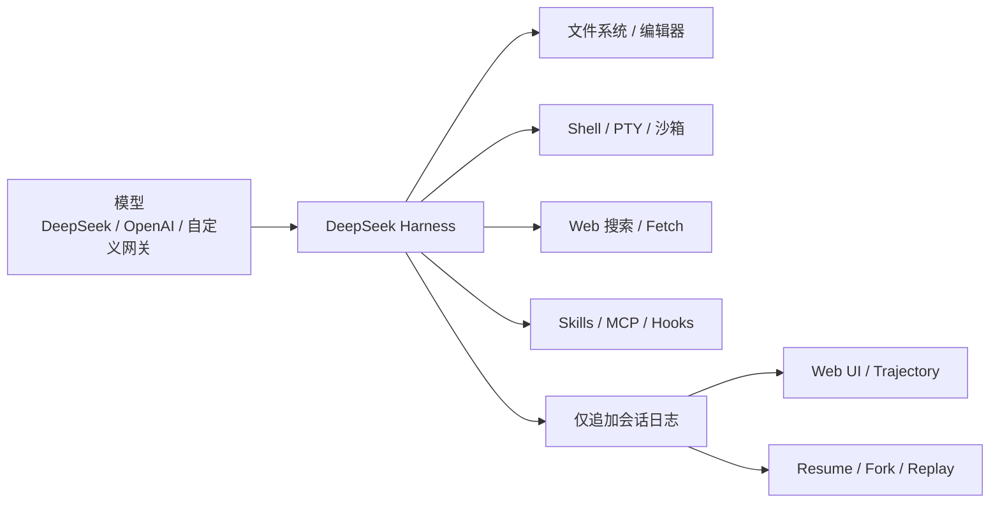
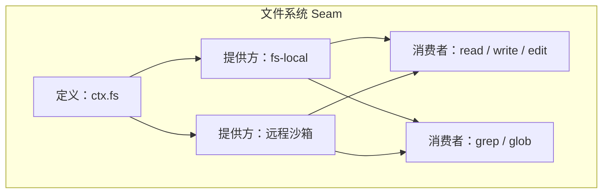
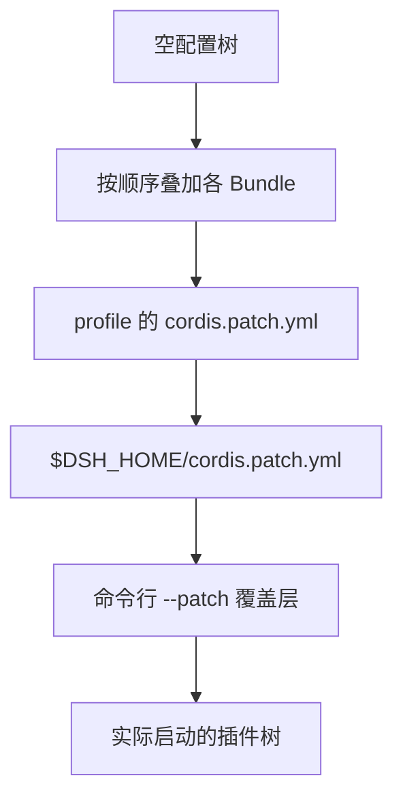
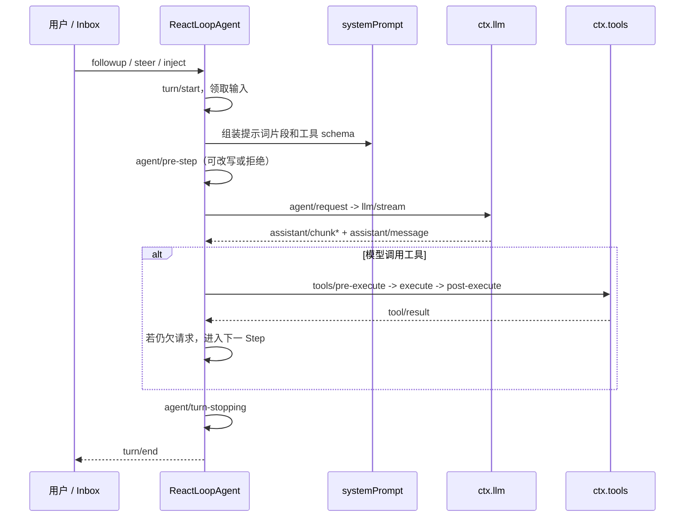
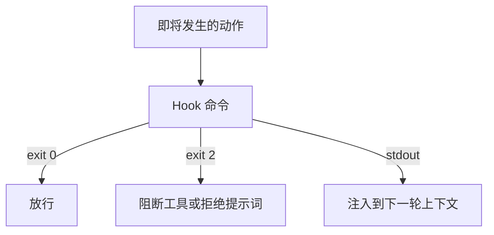
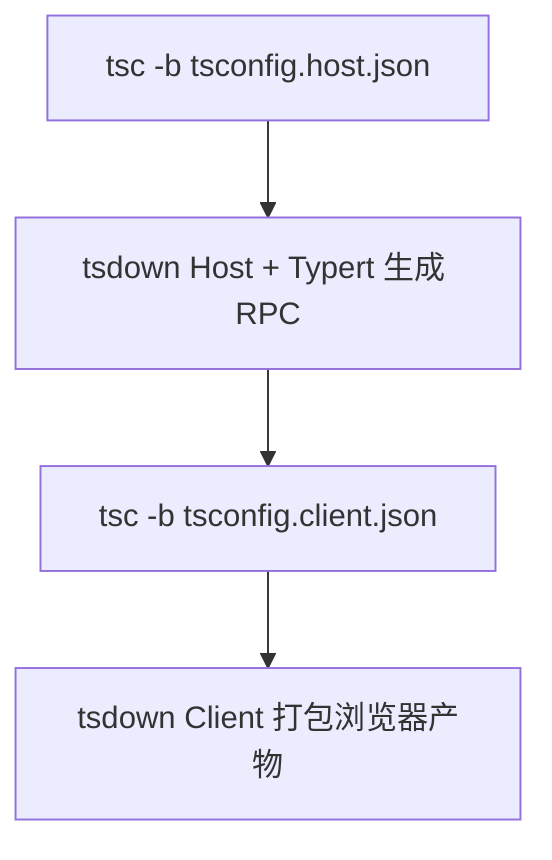
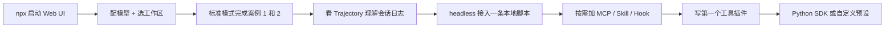

> **DeepSeek Harness**（命令是 `dsh`）是 DeepSeek AI 开源的 Agent 驾驭层（agent harness）。它不是又一个“帮你写代码的产品”，而是一套把模型接到文件系统、Shell、编辑器、网络、子 Agent 和审批策略上的运行时。口号只有一句话：**Everything is a plugin（一切皆插件）**——连 Agent 循环本身也是插件。

本文依据 [GitHub 仓库](https://github.com/deepseek-ai/deepseek-harness)、[官方产品页](https://deepseek.com/harness/en/)、[开发者文档](https://deepseek-harness.github.io/deepseek-harness/en/reference/) 与 [DeepWiki 源码解析](https://deepwiki.com/deepseek-ai/deepseek-harness) 整理。当前状态是 **developer preview**，官方明确提示会有破坏兼容性的变更。文中功能截至 **2026 年 8 月**。

---

## 一、为什么需要 DeepSeek Harness

Claude Code、Codex、Cursor Agent 解决的是“打开就能写代码”。DeepSeek Harness 解决的是另一层问题：

- 模型只是灵魂；真正让 Agent 能在真实仓库里持续工作的，是工具、沙箱、会话日志、审批和编排。
- 当你需要**替换模型、替换文件系统、替换沙箱、替换循环本身**，而不是改框架源码时，需要的是可组合的 harness，而不是固化的产品。
- 当一次运行出错，你需要回答“模型当时到底看见了什么”，而不是只留下最终聊天文本。

官方把这件事写成公式：**Agent = Model + Harness**。



和现成编码 Agent 的关系不是二选一：

| 维度 | Claude Code / Codex | DeepSeek Harness |
| --- | --- | --- |
| 定位 | 现成的编码 Agent | 用来组装 Agent 的 harness |
| 使用方式 | 打开就能干活 | 用 Profile、Preset、插件组装能力 |
| 模型绑定 | 绑定特定厂商模型 | 模型本身也是插件 |
| 扩展方式 | 技能、MCP、Hooks | 一切能力都通过 Cordis 插件挂载 |
| 成熟度 | 生产可用 | 开发者预览，接口会变 |

适合现在上手的人：要自定义 Agent 工作流、要公平评测模型、已经在用 DeepSeek 并想把“能写代码”做成可复用运行时。不适合的人：只想要一个开箱即用的写代码助手，或无法接受预览期破坏性变更。

---

## 二、核心概念：一切皆插件

底层引擎是 [Cordis](https://github.com/cordiverse/cordis)，设计论文是 [_A Programming Paradigm for Spatiotemporal Composability_](https://github.com/cordiverse/paper)。运行中的 `dsh` 就是一棵插件树：每个插件向共享 `Context` 贡献服务、类型化事件和可逆副作用。插件卸载时，注册项会自动撤销，不存在需要打补丁的“特权内核”。

### 2.1 能力 Seam

一个 **seam（接缝）** 是可替换能力，必须同时有三种角色：

1. **Service Definition**：声明接口，例如 `ctx.llm`、`ctx.fs`、`ctx.shell`。
2. **Service Provider**：实现接口，例如 `llm-deepseek`、`fs-local`。
3. **Consumer**：使用能力，通常是面向模型的工具，例如 `tool-bash` 消费 shell。

这就是“换一个提供方，整个产品跟着变”的原因。把文件系统和子进程一起指向远程沙箱，Bash、PTY、LSP 会一起搬走，不必为每个工具写专用 fork。



### 2.2 Profile、Bundle 与 Patch

`dsh` 不是启动一个固定程序，而是启动一个 **profile（配置组合）**。

- **Profile**：Harness home 里的具名组装。列出要叠放的 bundle，保存树外插件，以及用户自己的 `cordis.patch.yml`。发行版自带 `web` 和 `headless` 模板。
- **Bundle**：Cordis 配置行及其挂载代码的分发格式。`dsh-base` 是每一层的底座；`dsh-web-app` 加上浏览器应用；`dsh-headless` 加上一次性运行器。
- **Patch**：按 `id` 定位一行配置。它**整行替换** `config`，不是深合并。只改一个字段、漏掉其余字段，原来的 API Key、base URL 会一起消失。

叠加顺序（后写的赢）：



查看本机真正启动的树，不必把服务拉起来：

```sh
dsh --profile web --dump-default-config   # 只看 bundle 层
dsh --profile web --dump-config           # 加上 profile / home / --patch
```

### 2.3 四种 Agent 预设

Web UI 自带四种预设。它们不是四套提示词，而是挂在同一套 Host 上的四种能力组合：模型路由、会话持久化、沙箱和审批栈保持不变，变的是工具和提示词片段。

| 预设 ID | 界面名称 | 组成 |
| --- | --- | --- |
| `standard` | 标准模式 | 完整编码 Agent：文件编辑、Shell、文件/网页搜索、Skills、计划、目标、子 Agent、工作流 |
| `code` | PTC / Code 模式 | 标准模式全部能力，但工具通过 Code Mode SDK 暴露；模型写一段 TypeScript 编排多步调用 |
| `minimal` | 极简模式 | 只保留持久 `bash` 和 `str_replace_editor`，系统提示词固定为一句，关闭压缩，适合评测 |
| `cordis` | 创造模式 | 标准模式 + 运行时自省、内存中试验插件、编写新预设。Agent 能改自己的运行时，属于高信任模式 |

预设在会话开始时固定。已经跑起来的会话不会跟着预设文件热更新。自定义预设可以复制内置项，再编辑其 `agent.cordis.yml`。

### 2.4 Turn 与 Step

- **Step（步骤）**：一次模型请求，加上它调用的工具。
- **Turn（轮次）**：零个或多个 Step。领取第一条输入时打开，不再欠任何工作时关闭。



输入走同一个 Inbox：

- **Followup**：进入下一轮，立即唤醒。
- **Steer**：进入当前轮的下一步，立即唤醒。
- **Inject**：进入下一步，但**不唤醒**；等下一次自然请求时才被模型看见。

核心不变量是：**模型可见即已记录**。任何进入模型请求的内容，都必须能从仅追加的会话日志重建。Resume、Fork、Trajectory、遥测、回放都从这个事件流派生。

### 2.5 核心包与 `ctx` 键

| 包 | 职责 | `ctx` 键 |
| --- | --- | --- |
| `core/session` | 仅追加的 `SessionEvent` 日志与内存存储 | `ctx.sessions` |
| `core/system-prompt` | 提示词片段与工具 schema 组装 | `ctx.systemPrompt` |
| `core/tools` | 作用域化工具注册表与把关执行流水线 | `ctx.tools` |
| `core/agent` | Agent 接口、活跃注册表、`agent/*` 事件 | `ctx.agents` |
| `core/agent-loop` | 默认驱动器 `ReactLoopAgent` | `ctx.agentLoop` |
| `llm/llm` | 消息/流式词汇表与适配器 seam | `ctx.llm` |

---

## 三、安装与第一次运行

### 3.1 环境要求

- **日常使用**：安装 [Node.js](https://nodejs.org/)。仓库开发要求 `^22.19.0` 或 `>=24.0.0`。
- **从源码开发**：再加 pnpm（仓库用 Corepack 钉在 `11.7.0`）和 Git 2.26+。
- **API Key**：到 [DeepSeek 开放平台](https://platform.deepseek.com/) 申请。密钥保存在 `$DSH_HOME/.credentials.yaml`，设置文件只保留引用。
- **Python SDK**：Python 3.10+；目前支持 Linux x64 / Linux arm64 / macOS 14+ arm64，**不支持 Windows Agent**。

### 3.2 最快路径：npx

在你要当作工作区根目录的项目里执行：

```sh
npx @deepseek-ai/dsh web
```

默认打开 `http://127.0.0.1:3080`。启动目录会成为默认文件系统位置，但**全新 Web UI 不会自动选中工作区**。没选工作区时，会话输入框不可用——这是第一次启动最容易卡住的地方。

可选参数：

```sh
dsh web --port 8080
dsh web --help
```

CLI 目前不支持 `--host 0.0.0.0`，避免把本地 Agent 暴露到局域网。

### 3.3 从源码运行

适合改插件、跟文档做教程、给上游提反馈：

```sh
git clone https://github.com/deepseek-ai/deepseek-harness.git
cd deepseek-harness
pnpm install
pnpm run build
pnpm dsh web
```

生产运行需要先 `pnpm run build`。之后用 `pnpm dsh <参数...>` 走 TypeScript 入口转发全部参数。

### 3.4 第一次任务：三步走

1. 打开 **设置 → 模型**，填入 DeepSeek API Key 并保存。路由立刻可用，不必重启。
2. 点击 **选择工作区**，把启动 `dsh` 时所在的项目目录加进去并选中。
3. 新建会话，发送：

```text
Summarize this repository and identify its main packages.
```

Agent 可以读文件、改文件、跑命令、委派子任务并维护计划。当前权限策略要求审批时，Web UI 会先问你。

凭据解析顺序：继承的环境变量 → `$DSH_HOME/.credentials.yaml` → 启动目录的 `.env` → `$DSH_HOME/.env`。受管凭据文件不会被物化进 `process.env`。

---

## 四、配置模型与工作区

### 4.1 DeepSeek、目录提供方与自定义网关

| 方式 | 适用 |
| --- | --- |
| Settings → Models 里的 DeepSeek 卡片 | 官方 DeepSeek API |
| **Add provider** | Anthropic、OpenAI 等已安装目录 |
| **Add a custom provider** | 公司网关、自建服务、目录里没有的提供方 |

自定义提供方需要：永久的小写 Provider ID、base URL、API 协议、凭据，以及至少一个模型。Provider ID 一旦写入，请求、已保存会话、默认模型和凭据引用都会用它。要改名，只能新建再删除旧的。

手填模型默认按纯文本处理。端点无法被询问“支不支持图片”，所以给未声明视觉能力的模型贴图会在发送前被拒绝。需要在 `$DSH_HOME/settings.yaml` 里给该模型写 `input: [text, image]`。DeepSeek 自己的 chat-completions 路由是纯文本，不能改成多模态。

Bedrock、Vertex、Azure、Codex 走各自的原生认证（AWS 区域、ADC 项目、`api-version`、OAuth），只填 API Key 配不起来。

### 4.2 权限与沙箱

新会话默认权限预设是 **`workspace-write`**：Bash 和文件系统写入被限制在会话工作区以及平台临时目录；读取、网络和进程可见性并不被关进同一道墙。`DSH_PERMISSION_MODE` 可改进程级回退。Web 里改过的通用权限只影响**之后**新建的会话。

| 沙箱模式 | 效果 |
| --- | --- |
| `read-only` | 后端拒绝写入；POSIX 仍会给 Shell 需要的 `/dev/null` |
| `workspace-write` | 允许写工作区根和承诺的临时区；默认，搭配 ask 审批 |
| `danger-full-access` | 完全绕过隔离，搭配 never 审批；必须显式选择 |

执行层按平台落地：Linux 用 bwrap / Landlock，macOS 用 Seatbelt，Windows 用 ACL restricted-token。后端会报告 `full` 或 `partial` 执行强度；设计是 fail-closed——静默放行未隔离命令是被禁止的。

遥测默认关闭。`DSH_TELEMETRY_MODE=FULL` 会把投影后的会话事件以 OTLP/HTTP 打出去；`FEEDBACK_ONLY` 只在提交反馈时上传日志后缀。任何非空的 `DSH_TELEMETRY_DISABLED` 都是硬退出。

---

## 五、Web UI 日常工作流

日常编码建议从 **标准模式** 开始。侧边栏可以浏览工作区、切换会话、看 Trajectory（轨迹）。轨迹按来源展示系统提示词、推理、工具调用与结果、子 Agent 调度和每一次上下文注入。

建议养成的操作习惯：

1. **一个仓库一个工作区**，一个任务一个会话。空白会话会在同一路径上被复用；一旦接受了提示词或开始跑工具，就不再是空白会话。
2. 危险操作走审批，不要一上来切 `danger-full-access`。
3. 跑偏了用 Trajectory 回看模型当时看见的上下文，而不是只看最终回复。
4. 需要分支尝试时 fork 会话，而不是在同一条日志上继续污染。
5. 长任务可以切 Plan Mode：先规划、限制工具，确认后再 `exit_plan_mode` 执行。

Code 模式适合“多步工具调用可以收成一段程序”的任务，例如批量改文件、跑测试再根据输出修。极简模式适合公平对比模型，因为提示词和工具面被刻意钉死。创造模式适合做插件和自定义预设，不要对着生产仓库随手开。

---

## 六、CLI：Web、无头、插件与 TUI

`dsh` 是 profile 启动器。启动器自己的参数必须写在前面，它不认识的第一个 token 开始归应用解析。

```sh
dsh --profile web --port 8080
dsh --profile headless "run the tests"
dsh --profile web --help      # web 应用的帮助，不启动服务
dsh --help                    # 启动器自己的帮助
```

| 命令 | 作用 |
| --- | --- |
| `dsh web` | `--profile web` 的别名，启动 Web UI |
| `dsh --profile headless "任务"` | 新建一次持久会话，打印最终回复后退出；不监听端口 |
| `dsh --profile <名字>` | 启动 `$DSH_HOME/profiles/<名字>` |
| `dsh plugin --profile <名字> add <包>` | 在该 profile 目录里把命令转发给 pnpm |

只有 `web` 和 `headless` 会在首次使用时从模板自动初始化。其它名字必须先 `dsh plugin` 装 bundle。

终端 UI **没有打进发行版**。要 TUI，需要自己建 profile 并安装树外插件：

```sh
dsh plugin --profile tui add github:deepseek-harness/turtle-ui
dsh --profile tui
```

Git 托管、带源码构建的插件，pnpm ≥10 会拦住 `prepare` 脚本，直到你在该 profile 的 `pnpm-workspace.yaml` 里允许构建。本地 checkout 或已构建 tarball 不需要这步。

无头模式适合 CI：提交一条任务，等到 Agent 完全静止，把最后一条非空助手文本打到 stdout。`turn/end` 为 `completed` 时退出码 0，否则 1。成功时 stderr 为空，也不开监听端口。

启动目录同时是默认工作区根。适用的 `AGENTS.md` / `CLAUDE.md` 会被加载，渲染预算 65,536 字节。

---

## 七、MCP、Skills 与 Hooks

### 7.1 MCP：默认一个都不开

`@deepseek-ai/dsh-mcp-client` 作为依赖随 CLI 提供，但**默认不启用任何 MCP 服务器**。每个 server 命令都是沙箱外的受信任可执行代码，必须你自己写进 patch。一个插件实例对应一台服务器；模型看到的名字是 `mcp__<serverName>__<tool>`，和 Claude Code / Codex 同一套命名。

在 profile 的 `cordis.patch.yml` 或 `--patch` 文件里插入：

```yaml
- insert:
    - id: mcp-github
      name: '@deepseek-ai/dsh-mcp-client'
      config:
        serverName: github
        transport: stdio
        command: npx
        args: ['-y', '@modelcontextprotocol/server-github']
        env:
          GITHUB_TOKEN: !!js process.env.GITHUB_TOKEN

    - id: mcp-web
      name: '@deepseek-ai/dsh-mcp-client'
      config:
        serverName: web
        transport: streamable-http
        url: http://localhost:3000/mcp
        headers:
          Authorization: !!js '`Bearer ${process.env.MCP_TOKEN}`'
```

然后：

```sh
dsh web --patch ./mcp.patch.yml
```

当前只桥接 Tools；Resources 和 Prompts 还没有 harness 消费方。编辑该配置会 HMR 断开并重连，不改 `serverName` 则工具名保持稳定。

### 7.2 Skills

Skills 是可复用的 Markdown 指令集，由 `SkillRegistry` 从文件系统和运行时提供方合并。`tool-skill` 在 `agent/pre-step` 注入技能目录；模型调用 `skill(name="xyz")` 后，完整正文会进入下一轮。用户也可以用 `/<skill>` 手势确定性加载。

### 7.3 Hooks

Hook 协议兼容 Codex / Claude Code 的拦截点，底层走 `dsh-hook-protocol`，Codex 桥是 `hooks-codex`：

| Hook | 接到的事件 |
| --- | --- |
| `SessionStart` | 会话初始化，分离执行 |
| `UserPromptSubmit` | `agent/pre-step` |
| `PreToolUse` | `tools/pre-execute` |
| `PostToolUse` | `tools/post-execute` |
| `Stop` | `agent/turn-stopping` |

Hook 以 Shell 命令执行。退出码 2 会阻断动作；stdout / additionalContext 会作为 `plugin` 来源注入 transcript。



---

## 八、写第一个插件和工具

从源码 checkout 并完成 `pnpm install` / `pnpm run build` 后，可以按官方教程把本地插件挂进 Web UI。

插件就是导出 `apply(ctx)` 的 TypeScript 模块：

```ts
import type { Context } from '@deepseek-ai/cordis'

export const name = 'hello-plugin'

export function apply(ctx: Context) {
  console.log('[hello-plugin] plugin loaded!')
}
```

`scratch-plugin/cordis.yml` 必须用**绝对路径**：

```yaml
- insert:
    - id: hello
      name: '/absolute/path/to/deepseek-harness/scratch-plugin/src/my-plugin.ts'
```

```sh
pnpm dsh web --patch ./scratch-plugin/cordis.yml
```

终端出现 `[hello-plugin] plugin loaded!` 即表示挂上。通过 `ctx` 注册的监听器、工具、定时器会在插件卸载时自动清理。需要显式释放的资源用 `ctx.effect()` 返回 disposer。依赖其它服务时声明 `inject: ['tools']`，框架会等服务就绪再调用 `apply`。

面向模型的工具用 `defineTool` 注册。schema 会自动进入提示词组装；Code 模式里同一工具会变成 `await tools.<name>(args)`，不必再写一层适配。

```ts
import { readFile } from 'node:fs/promises'
import type { Context } from '@deepseek-ai/cordis'
import { defineTool } from '@deepseek-ai/dsh-tools'

export const name = 'my-tool'
export const inject = ['tools']

export function apply(ctx: Context) {
  ctx.tools.register(defineTool({
    name: 'read_file',
    description: 'Read a file from disk.',
    parameters: {
      path: { type: 'string', required: true, description: 'Absolute path' },
      limit: { type: 'number' },
    },
    output: {
      schema: { type: 'string' },
      render: (_args, value) => [{ type: 'text', text: value }],
    },
    async execute(args, exec) {
      return readFile(args.path, { encoding: 'utf8', signal: exec.signal })
    },
  }))
}
```

几个容易踩坑的契约：

- `execute` 只返回规范 JSON 值，不要返回 UI 卡片或散文。
- 必须响应 `exec.signal`，取消时停掉进行中的工作。
- 策略不要写死在工具里：允许/拒绝/询问走 `tools/pre-execute`，最终拒绝用 `ctx.tools.guard()`。
- `presentCall` / `presentResult` 必须是纯函数，因为直播和会话回放都会跑它们。

社区插件可打 GitHub topic [`dsh-plugin`](https://github.com/topics/dsh-plugin) 方便发现。

新行为应挂到已有扩展点，而不是改循环源码：

| 目标 | 机制 |
| --- | --- |
| 加模型提供方 | 在 `ctx.llm` 注册适配器 |
| 加面向模型的能力 | `ctx.tools.register` |
| 让某个会话能力不同 | 做 Agent preset，服务行需要 `isolate` realm |
| 加 Shell | 注册 `ctx.shell` 后端 |
| 拦截请求/工具/轮次 | `agent/*` 或 `tools/*`；`agent/turn-stopping` 停轮 |
| 注入模型可见上下文 | `agent.inject()`，落到下一次获准请求 |
| 持久会话状态 | 扩展 `SessionEventMap`，从日志渲染和回放 |

---

## 九、Python SDK

这是 Web UI 的程序化替代。SDK 自带同版本运行时，**不需要系统 Node.js**。官方示例组合是极简工具面（持久 `bash` + `str_replace_editor`），权限是 `danger-full-access`，只应在一次性 checkout 或容器里跑。

```sh
git clone https://github.com/deepseek-ai/deepseek-harness.git
cd deepseek-harness
python -m venv .venv
. .venv/bin/activate
python -m pip install deepseek-harness-sdk

export DEEPSEEK_API_KEY=sk-your-key-here
# export DEEPSEEK_BASE_URL=http://127.0.0.1:8000/v1
# export DSH_MODEL=deepseek-v4-flash

python examples/jsonrpc-agent/minimal.py \
  --workspace /absolute/path/to/workspace \
  --session-root /absolute/path/to/sessions \
  --session-id example-001 \
  "Inspect the repository and fix the failing tests."
```

在自己的程序里：

```python
from pathlib import Path
from deepseek_harness import DeepSeekHarness

config = Path("examples/jsonrpc-agent/minimal.cordis.yml").resolve()
workspace = Path("/absolute/path/to/workspace").resolve()
sessions = Path("/absolute/path/to/sessions").resolve()

with DeepSeekHarness(
    provider="deepseek-official",
    model="deepseek-v4-flash",
    max_tokens=49_152,
    cwd=str(workspace),
    session_root=str(sessions),
    cordis=str(config),
) as harness:
    result = harness.run(
        "Inspect the repository and fix the failing tests.",
        session_id="example-001",
    )

print(result.final_response)
```

`cwd` 是 Agent 可访问的工作区，`session_root` 存 JSONL 日志。复用同一个 harness 和 `session_id` 会保留该会话的 Bash 进程（工作目录、导出变量、shell 函数）。独立任务请换新的 session id。

---

## 十、从入门到实战的案例

### 案例 1：五分钟摸清一个陌生仓库

目标：用标准模式让 Agent 读仓库结构，而不是一上来就改代码。

1. 在仓库根目录执行 `npx @deepseek-ai/dsh web`。
2. 配置 DeepSeek Key，选中当前目录为工作区。
3. 新建标准模式会话，发送：

```text
先不要修改任何文件。请总结这个仓库的用途、主要包/模块、构建与测试入口，
以及我如果要加一个小功能最该改的 3 个文件。给出路径和理由。
```

观察它是否先列目录、读 README / `package.json` / 文档，而不是盲目 `grep`。需要审批时先看命令，再决定允许一次还是记住策略。

### 案例 2：在 Web UI 里修失败测试

目标：走完“读失败 → 改代码 → 再跑测试 → 你审查 diff”的闭环。

准备一个有失败测试的 git checkout（不要直接对主分支生产仓库使用 `danger-full-access`）。

```text
运行现有测试。不要改测试来迁就实现，除非测试本身断言错误。
修复失败用例，每改一处都说明原因，最后再跑一遍相关测试并总结 diff。
```

建议保持 `workspace-write`。如果 Agent 想在工作区外装全局工具或改家目录，拒绝它，让它把依赖装进项目内。修完后用 Trajectory 核对：它看到的测试输出是否就是你本机跑出来的那一份。

### 案例 3：无头模式接入 CI

目标：在流水线里跑一次性任务，用退出码当门禁。

```sh
export DEEPSEEK_API_KEY="$DEEPSEEK_API_KEY"
cd "$GITHUB_WORKSPACE"

npx --yes @deepseek-ai/dsh --profile headless \
  "Run the unit tests. If they fail, fix the production code (not the tests) and re-run.
   Print a short summary of what changed. Do not commit."
```

要点：

- 任务必须是位置参数；没有任务是用法错误。
- 成功时只把最终助手文本打到 stdout，适合贴到 CI 摘要。
- 把工作区限制在 job 的 checkout；不要在共享 runner 上开 `danger-full-access` 还挂着长期密钥。
- 预览期请在 CI 里钉死 `@deepseek-ai/dsh` 版本，避免 `npx` 某天拉到破坏性变更。

### 案例 4：用 MCP 让 Agent 开 GitHub Issue

目标：显式启用一个 MCP 服务器，让模型调用 `mcp__github__*` 工具。

1. 准备 `GITHUB_TOKEN`。
2. 将上一节的 `mcp-github` patch 存成 `mcp.github.yml`。
3. 启动：`dsh web --patch ./mcp.github.yml`。
4. 在标准模式会话中发送：

```text
阅读当前仓库的 README 和最近的 git log，起草 3 个适合新手的 good first issue。
先把草稿发给我确认，不要直接创建。确认后用 GitHub MCP 在本仓库创建 issue，
标签用 good first issue。
```

先确认草稿再允许创建，避免 Agent 在沙箱外的 MCP 进程里直接写生产数据。若工具没出现，用 `--dump-config` 确认 patch 是否真正插入，并看启动日志里 MCP 是否 `listTools` 成功。

### 案例 5：自定义只读工具，拦截危险 Bash

目标：演示“加能力”和“加策略”是两条不同的 seam。

只读工具插件（示意）：把仓库约定的 `CHANGELOG.md` 摘要暴露给模型，避免它每次全文件读入。

```ts
import type { Context } from '@deepseek-ai/cordis'
import { defineTool } from '@deepseek-ai/dsh-tools'
import { readFile } from 'node:fs/promises'

export const name = 'changelog-head'
export const inject = ['tools']

export function apply(ctx: Context) {
  ctx.tools.register(defineTool({
    name: 'changelog_head',
    description: 'Return the first N lines of CHANGELOG.md in the workspace.',
    parameters: {
      lines: { type: 'number', description: 'Max lines to return', required: true },
    },
    output: {
      schema: { type: 'string' },
      render: (_args, value) => [{ type: 'text', text: value }],
    },
    async execute(args, exec) {
      const n = Math.min(Math.max(args.lines, 1), 80)
      const text = await readFile('CHANGELOG.md', { encoding: 'utf8', signal: exec.signal })
      return text.split(/\r?\n/).slice(0, n).join('\n')
    },
  }))
}
```

策略插件监听 `tools/pre-execute`：对 `bash` 里的 `rm -rf`、`curl | sh` 直接 deny，其它调用 `next()`。不要把部署策略写进工具实现，这样换沙箱提供方时策略仍然在。

### 案例 6：Python SDK 批量巡检多个仓库

目标：同一运行时、不同 session id，对一组只读任务做巡检。

```python
from pathlib import Path
from deepseek_harness import DeepSeekHarness

repos = [
    Path("/tmp/iso/app-a").resolve(),
    Path("/tmp/iso/app-b").resolve(),
]
sessions = Path("/tmp/dsh-sessions").resolve()
config = Path("examples/jsonrpc-agent/minimal.cordis.yml").resolve()

prompt = (
    "Do not modify files. List the test runner, CI config, and the riskiest "
    "dependency. Reply with a 10-line report."
)

with DeepSeekHarness(
    provider="deepseek-official",
    model="deepseek-v4-flash",
    max_tokens=49_152,
    cwd=str(repos[0]),
    session_root=str(sessions),
    cordis=str(config),
) as harness:
    for repo in repos:
        result = harness.run(prompt, session_id=f"audit-{repo.name}")
        print(f"## {repo.name}\n{result.final_response}\n")
```

注意：官方 `DeepSeekHarness` 在构造时绑定 `cwd`。若 SDK 版本不允许中途换工作区，就为每个仓库开一个 `with` 块，或先确认当前版本是否支持按 run 覆盖 `cwd`。每个仓库使用独立 session id，避免 Bash 状态串台。

### 案例 7：Code 模式做一次多文件重构

目标：让模型用一段 TypeScript 编排“搜索 → 编辑 → 测试”，减少来回 function calling。

在 Web UI 新建会话时选 **PTC / Code 模式**（内部 ID 是 `code`）：

```text
把 src/utils/date.ts 的时区处理抽成可测试函数。
更新所有调用点，补单元测试，跑相关测试。
不要改公共 API 的日期字符串格式。
```

Code 模式里，你注册的工具会自动出现在 `tools.*` 上，成功调用得到的是规范 JSON，而不是 UI 卡片文本。适合步骤多、中间值不需要进会话日志的任务。若模型把程序写成“解析终端散文拿 job id”，那是工具 `output.schema` 没设计好——应直接返回 `{ kind: 'background', jobId }` 这样的句柄。

### 案例 8：创造模式拼一个“文档审阅 Agent”

目标：复制标准预设，减工具、加技能，做成窄垂直 Agent。

1. 在设置里复制 Standard，命名为 `doc-review`。
2. 打开预设目录，编辑 `agent.cordis.yml`：去掉 web fetch、子 Agent、工作流；保留读文件、搜索、一个只读 MCP（例如文档站点）。
3. 在工作区加入 skill：`skills/style-guide.md`，写明标题层级、术语表、禁止事项。
4. 用创造模式先在隔离目录试验插件树，确认 `cordis_inspect_self` 看到的工具面符合预期。
5. 新开会话选 `doc-review`，对一份 Markdown 发“按技能审阅，只提修改建议，不直接改文件”。

创造模式能改运行时，不要对含密钥的生产目录使用。试验通过后，把预设当普通会话默认即可。


---

## 十一、源码开发与质量门（给要改仓库的人）

仓库是 pnpm monorepo，Host / Client 两套 TypeScript 聚合，避免 Cordis `Context` 声明合并冲突。



常用命令：

```sh
pnpm dsh web                 # 源码跑 CLI
vitest -t "某个用例"          # 针对性测试，不要每次全量
pnpm run doc-sync            # 双语文档与类型等价门
```

质量门包括 `ci-primary`、逐文件 100% 覆盖的 `ci-coverage`、无头回放快照 `ci-snapshot`、`knip`/`publint` 卫生检查，以及文档双语配对。改文档要同时改 `.md` 和 `.zh.md`。E2E 用 Playwright，默认 `replay` 模式走 `dsh-llm-replay`，CI 不需要真 API Key。

---

## 十二、常见问题

**`MISSING_CREDENTIAL`**  
在 Models 页面保存密钥，或提供被引用的环境变量。托管环境里账户上的 Key 不会自动注入终端，需要 `export DEEPSEEK_API_KEY=...`。

**输入框是灰的**  
还没选工作区。`dsh` 的启动目录只是默认文件系统位置，Web UI 仍要你点一次“选择工作区”。

**`UNKNOWN_MODEL`**  
当前选择的模型不在已配置提供方里。自定义提供方要自己加模型列表。

**贴图被拒绝**  
模型未声明 `image` 模态。自定义路由在 `settings.yaml` 写 `input: [text, image]`。DeepSeek chat-completions 不能开图像。

**`--patch` 把原配置弄丢了**  
Patch 是整行替换。先 `--dump-config` 抄完整 `config`，再改你要的字段。带 `!!js ctx.webStartup.port ?? 3080` 这类表达式的行，换成字面量后，命令行 `--port` 会失效。

**MCP 工具不出现**  
默认不启用任何 server。检查 patch 是否 `insert` 成功、`serverName` 是否冲突、启动时 `listTools` 是否失败。`failOnStartupError` 默认 `false`，连不上时插件仍会激活，只是没有工具。

**Python SDK 在 Windows 上报错**  
官方示例依赖持久 PTY，不支持 Windows Agent。换 Linux / macOS arm64，或只用 Node CLI 的 Web / headless。

**headless 没有输出 / 退出码 1**  
看 stderr 的错误码。常见原因是没配密钥、任务为空、Agent 以 `error` 结束。无头模式没有交互审批面，权限预设要预先设好。

**想把 UI 绑到 `0.0.0.0`**  
当前 CLI 故意不允许。这是本地 Agent 的安全边界，不要用反向代理绕过信任主机栅栏，除非你清楚 `/api` 的 browser-trust 模型。

---

## 十三、建议学习路线



先把 `dsh` 当成“可替换插件的本地编码 Agent”用起来，再进入配置树和扩展点。不要第一天就改 `packages/core/agent-loop`。

---

## 十四、总结

DeepSeek Harness 的价值不是再发一个聊天窗口，而是把 Agent 运行时拆成可替换的插件树：

- **一切皆插件**：模型、工具、沙箱、会话、循环、UI 都可以配置替换。
- **每次运行可追溯**：模型看见的东西都在仅追加日志里，Resume / Fork / Replay 同源。
- **多种运行面**：Web、无头 CI、可安装的 TUI、ACP / JSON-RPC、Python SDK。
- **默认偏安全**：工作区写入默认受限，遥测默认关，MCP 默认一个都不开。

它仍是开发者预览。把它用在可丢弃的 checkout、钉版本的 CI、以及你愿意跟着 upstream 一起改配置的实验上。当你不再满足于“让 AI 写这段代码”，而是想“让 AI 按我规定的工具、边界和流程持续工作”，这就是 harness 该出场的时候。

---

## 参考资源

- [deepseek-ai/deepseek-harness](https://github.com/deepseek-ai/deepseek-harness)
- [产品页：Everything is a plugin](https://deepseek.com/harness/en/)
- [架构文档](https://deepseek-harness.github.io/deepseek-harness/en/reference/)
- [Web UI 指南](https://github.com/deepseek-ai/deepseek-harness/blob/master/docs/user/guide/index.md)
- [模型配置](https://github.com/deepseek-ai/deepseek-harness/blob/master/docs/user/guide/providers.md)
- [第一个插件](https://deepseek-harness.github.io/deepseek-harness/en/develop/basic/)
- [工具编写参考](https://deepseek-harness.github.io/deepseek-harness/en/reference/cookbook/adding-a-tool)
- [Python SDK](https://deepseek-harness.github.io/deepseek-harness/en/guide/python-sdk)
- [CLI 行为参考](https://github.com/deepseek-ai/deepseek-harness/blob/master/apps/cli/reference/README.md)
- [GitHub Discussions](https://github.com/deepseek-ai/deepseek-harness/discussions)
- [dsh-plugin 话题](https://github.com/topics/dsh-plugin)
- [DeepWiki：deepseek-ai/deepseek-harness](https://deepwiki.com/deepseek-ai/deepseek-harness)
- [Cordis](https://github.com/cordiverse/cordis)
